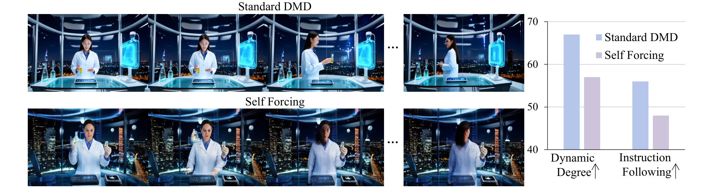
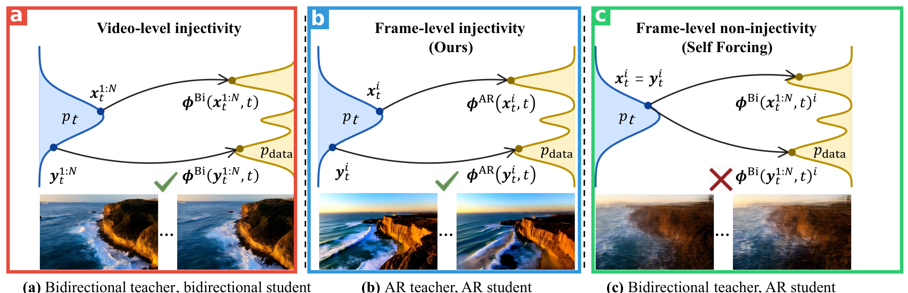
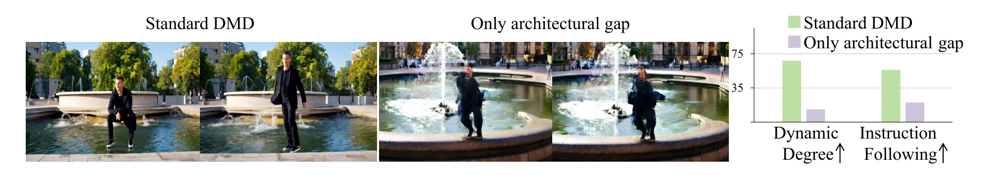
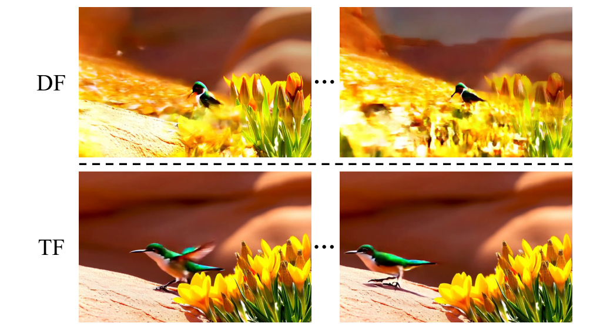
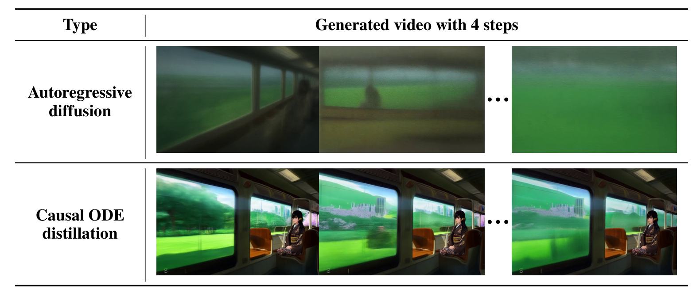
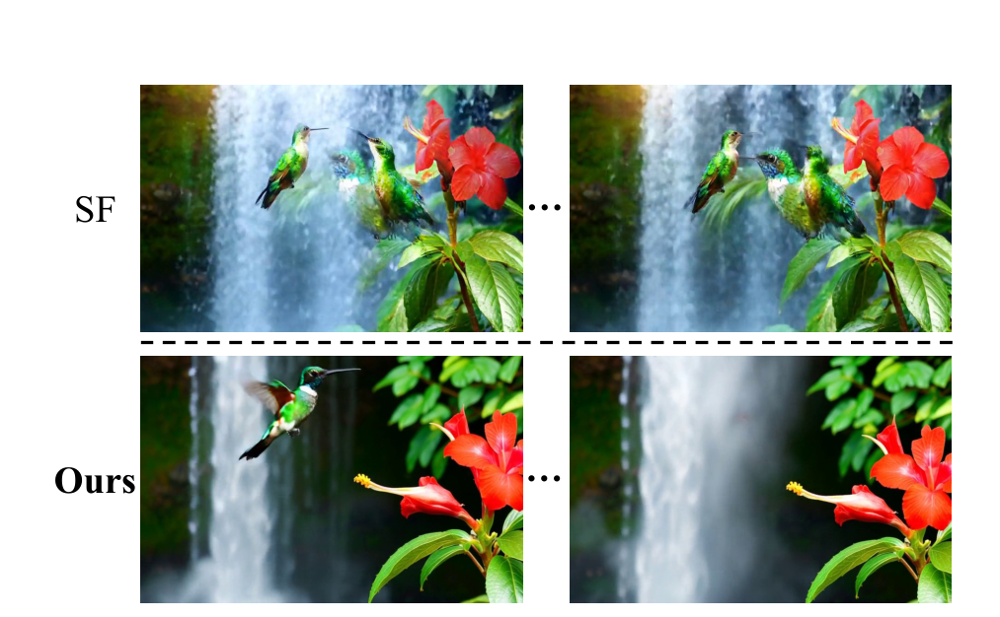
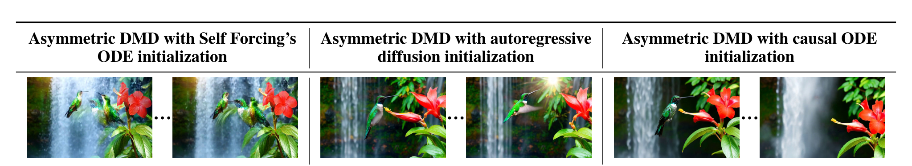
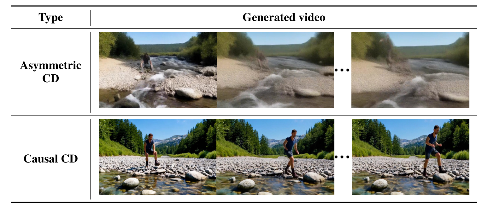

# Causal Forcing: Autoregressive Diffusion Distillation Done Right for High-Quality Real-Time Interactive Video Generation

## 元信息

| 项目 | 内容 |
|---|---|
| 题目 | Causal Forcing: Autoregressive Diffusion Distillation Done Right for High-Quality Real-Time Interactive Video Generation |
| 作者 | Hongzhou Zhu*, Min Zhao*（共同一作）, Guande He, Hang Su, Chongxuan Li, Jun Zhu（通讯） |
| 单位 | 清华大学（TSAIL/BNRist）、生数科技 ShengShu、UT Austin、中国人民大学高瓴 AI |
| arXiv | [2602.02214](https://arxiv.org/abs/2602.02214)（v5, 2026-06-01），ICML 2026 |
| 发布日期 | 2026-02-02（arXiv v1） |
| 代码 | https://github.com/thu-ml/Causal-Forcing |
| 项目主页 | https://thu-ml.github.io/CausalForcing.github.io/ |

**结构速览**（每节在干嘛）：

- **Sec 1 引言**：实时交互视频生成需要少步自回归（AR）模型；现有做法把双向扩散模型蒸馏成 AR 学生，存在"架构鸿沟"没被理论解决。
- **Sec 2 背景**：扩散模型与 flow matching（2.1）、AR 视频扩散的 teacher forcing / diffusion forcing 两种训练范式（2.2）、一致性蒸馏与 ODE 蒸馏（2.3）、得分蒸馏 DMD（2.4）。
- **Sec 3 方法**：3.1 指出 Self Forcing 仍显著落后标准 DMD；3.2 分析病根——ODE 蒸馏要求"帧级单射性"，双向教师违反它（Lemma 3.2 / Prop 3.3）；3.3 提出 Causal Forcing 三阶段（TF 训 AR 教师 → 因果 ODE 蒸馏 → asymmetric DMD），并证明 diffusion forcing 有训练-推理失配（Prop 3.4）；3.4 把同一视角扩展出首个因果一致性蒸馏（causal CD）。
- **Sec 4 实验**：VBench + 自建 100-prompt 富动作集 + user study，对比 8 个 baseline；消融覆盖 AR 训练范式、ODE 初始化、CD。
- **Sec 5 讨论**：长视频局限（只训 5s）；与 GAN 系 AR 蒸馏 APT2 的区别。
- **Sec 6 结论**。
- **附录 A**：扩展相关工作（视频生成、AR 扩散、交互应用）。
- **附录 B**：证明——B.1 双向 PF-ODE 的帧级非单射性与回归坍缩到条件均值；B.2 diffusion forcing 的 KL 失配证明。
- **附录 C**：C.1 与 PFVG/BAgger/Resampling Forcing 等新 AR 训练策略的对比实验；C.2 直接用多步 AR 扩散模型初始化 DMD 的效果与残留问题；C.3 控制变量——学生从双向模型初始化也行，关键在教师。
- **附录 D**：实现细节（数据构造、超参、CD 的边界条件参数化、评测细节）。

---

## 第1章 · 作者与实验室背景评估

### 作者背景表

| 姓名 | 角色 | 单位 | 主方向 | 代表作 | 主页 |
|---|---|---|---|---|---|
| Hongzhou Zhu | 共同一作 | 清华计算机系（TSAIL），兼署 ShengShu | 视频扩散、扩散蒸馏 | RIFLEx (ICML 2025)、UltraViCo (ICLR 2026)、Conditional Image Leakage (NeurIPS 2024) | [个人主页](https://zhuhz22.github.io/) · [GitHub](https://github.com/zhuhz22) |
| Min Zhao | 共同一作 | 南京大学 AI 学院助理教授（前清华 TSAIL 博士后，博士毕业于中科院自动化所） | 视频世界模型（实时/可交互） | Conditional Image Leakage (NeurIPS 2024)、RIFLEx (ICML 2025)、UltraViCo (ICLR 2026, 一作)、ControlVideo、Vidu 技术报告 | [个人主页](https://gracezhao1997.github.io/) · [Google Scholar](https://scholar.google.com/citations?user=ExIZrLAAAAAJ) |
| Guande He | 三作 | UT Austin 博士生（前清华 TSAIL 硕士） | 生成模型 post-training / 蒸馏 | **Self Forcing (NeurIPS 2025 Spotlight)**——本文批判并改进的直接前作 | [个人主页](https://guandehe.github.io/) · [Google Scholar](https://scholar.google.com/citations?user=3rddMeMAAAAJ) |
| Hang Su | 合作者 | 清华计算机系副教授 | 对抗鲁棒性、可解释性 | 对抗攻防系列 | 未找到个人主页；[Google Scholar](https://scholar.google.com/citations?user=dxN1_X0AAAAJ) |
| Chongxuan Li | 合作者 | 人民大学高瓴 AI 副教授 | 深度生成模型 | Analytic-DPM (ICLR 2022 杰出论文)、DPM-Solver (NeurIPS 2022 Oral)、ProlificDreamer | [个人主页](https://zhenxuan00.github.io/) |
| Jun Zhu 朱军 | 通讯 | 清华计算机系教授、TSAIL 负责人；**生数科技创始人/首席科学家** | 机器学习、生成模型 | TSAIL 扩散系工作共同通讯（DPM-Solver、Vidu 等） | [个人主页](http://ml.cs.tsinghua.edu.cn/~jun) · [Google Scholar](https://scholar.google.com/citations?user=axsP38wAAAAJ) |

### 实验室主方向

清华 TSAIL（thu-ml）是扩散模型研究的头部实验室，且有商业实体生数科技（Vidu 文生视频产品）承接落地。近 5 年在本文方向的连续投入（实际检索到的证据链）：

- 2022：Analytic-DPM（ICLR 杰出论文）、DPM-Solver（NeurIPS Oral）——扩散采样理论
- 2023：U-ViT (CVPR)、UniDiffuser (ICML)、ProlificDreamer（NeurIPS Spotlight，变分得分蒸馏）
- 2024：Vidu 技术报告（产品化）、Conditional Image Leakage (NeurIPS)
- 2025：RIFLEx (ICML)、SageAttention / TurboDiffusion（视频扩散推理加速开源）
- 2026：UltraViCo (ICLR)、本文 Causal Forcing (ICML)、后续技术报告 Causal Forcing++

**判定：传统强方向**，且是该实验室当前主攻线——从扩散采样理论 → 蒸馏 → 视频生成 → 实时交互视频，一条连续且有产品支撑的演进链。

### 水平预判

**事实**：一作之一 Hongzhou Zhu 个人主页自述为清华计算机系**四年级本科生**（信息或有滞后），但此前已有 NeurIPS 2024 / ICML 2025 / ICLR 2026 三篇视频扩散发表，本文不是其首篇该方向工作。另一共一 Min Zhao 已凭该方向工作获南大教职。三作 Guande He 是 Self Forcing 的作者之一——本文标题里 "Done Right" 怼的正是他自己参与的前作。

**推断**（依据上述事实）：水毕业风险信号四项全部为"否"（一作有积累、导师主业对口、实验室持续投入、单位积累深厚），这是头部实验室主攻线上的正规军工作，还有前作作者"自我修正"式的师承关系。需要留意的不是作者资质，而是产业利益相关（ShengShu 实时视频产品线）背景下实验对比选择是否公允——此为提醒，非已核实的问题。

⚠️ 本章内容未进入第3章盲审上下文。

---

## 第2章 · 论文类型判定

**类型结论：a+b 型组合 + 一处原理创新。** 流程里每个环节都来自已有工作（基座、TF 训练范式、ODE 蒸馏目标、asymmetric DMD、LCM），本文的原创是：(1) 帧级单射性理论分析（Lemma 3.2 / Prop 3.3 / Prop 3.4，指出现有组合错在哪）；(2) 据此做的流程重组——把 ODE 蒸馏的教师从双向换成自己先训出来的 AR 教师。属于"诊断驱动的重新组装"，单个新模块为零，但组装顺序本身是贡献。

**组件清单**（均为论文方法节实际承担流程环节、且在参考文献中真实存在的引用）：

| 组件 | 原论文 | 在本文中承担的角色 |
|---|---|---|
| Wan2.1-T2V-1.3B / 14B | [Wan et al., 2025](https://arxiv.org/abs/2503.20314) | 基座模型（微调起点）；DMD 阶段 1.3B 当 s_fake、14B 当 s_real |
| Teacher forcing 训练策略（干净视频+噪声视频拼接、因果注意力掩码） | [MAGI-1, Teng et al., 2025](https://arxiv.org/abs/2505.13211) | Stage 1 训 AR 扩散教师的训练范式（Sec 2.2 明引 Teng et al.） |
| Diffusion forcing（噪声前缀条件） | Chen et al., NeurIPS 2024（论文未给 arXiv 号） | 被 Prop 3.4 反驳的对照训练范式（CausVid 采用） |
| ODE 蒸馏（CD 的直接回归简化版） | [CausVid, Yin et al., 2025](https://arxiv.org/abs/2412.07772)、[Self Forcing, Huang et al., 2025](https://arxiv.org/abs/2506.08009) | Stage 2 的训练目标形式（Eq. 8）；本文只换了教师 |
| DMD（分布匹配蒸馏） | [Yin et al., 2024](https://arxiv.org/abs/2311.18828) | Stage 3 的核心目标（Eq. 2） |
| Asymmetric DMD + self-rollout 配方 | [Self Forcing](https://arxiv.org/abs/2506.08009) | Stage 3 完整流程，论文原话 "Exactly as in Self Forcing's DMD"（Sec 3.3） |
| LCM | [Luo et al., 2023](https://arxiv.org/abs/2310.04378) | Sec 3.4 causal CD 扩展的实例化配方（48 步离散 CD） |
| VidProM | [Wang & Yang, 2024](https://arxiv.org/abs/2403.06098) | 合成训练数据的 prompt 来源、DMD 阶段训练 prompts |
| VBench | [Huang et al., 2024](https://arxiv.org/abs/2311.17982) | 主评测基准 |
| VisionReward | [Xu et al., 2024](https://arxiv.org/abs/2412.21059) | 视觉质量与指令遵循评测器 |

**疑似借鉴（论文未引用）**：未发现——方法节所有组件均能对应到参考文献。相邻工作 APT2（GAN 系 AR 蒸馏，teacher-forcing CD 初始化与本文方向一致）论文已在 Sec 5 明引并讨论区别，不属于漏引。

---

## 第3章 · 双盲评审 + Rebuttal（隔离上下文，全流程记录）

### 3.1 初审意见（由隔离上下文的盲审 agent 独立生成，仅见净化文本）

> **Summary**：本文研究实时交互式视频生成中的自回归（AR）扩散蒸馏。作者指出，现有方法（CausVid、Self Forcing）从双向 teacher 直接做 ODE 蒸馏来初始化 AR student，违反了他们提出的 "frame-level injectivity" 条件——同一个噪声帧在双向 teacher 的 PF-ODE 下可对应多个不同的干净帧，导致 MSE 回归塌缩到条件期望、产生模糊结果（Lemma 3.2、Prop 3.3）。为此提出 Causal Forcing 三阶段流程：先用 teacher forcing 训练 AR 扩散模型（并论证 TF 优于 DF，Prop 3.4），再以它为 teacher 做 causal ODE 蒸馏，最后沿用 Self Forcing 的 asymmetric DMD。在 Wan2.1-1.3B 基座上报告全面超越基线。
>
> **Strengths**：
> - 问题定位清晰，Fig. 2 的控制实验（剥离 sampling-step gap、只留 architectural gap）是干净的归因设计；
> - 把社区经验直觉（非配对回归导致模糊）形式化为可检验命题（Lemma B.1 / Prop B.2）并给出修复原则；
> - 消融覆盖 chunk-wise / frame-wise 与 CD 范式；Appendix C.3 的学生初始化控制实验排除了替代解释；
> - 公平性有明确努力（同 prompts 内部合成数据、3K 步数对齐、DMD 严格沿用 Self Forcing 配置）；
> - 对 diffusion forcing 的反驳有节制地划定范围（Appendix C.1），没有过度外推。
>
> **Weaknesses**：
> - **W1（统计报告全面缺失）**：全部定量结果为单次训练、单次评测的点估计，无误差条/CI/显著性检验。关键差距很小（VBench Total +0.30、Quality +0.11；Dynamic Degree 基于 100 prompt 二值判定，抽样标准误约 ±5 点），"consistently outperforms all baselines across all metrics" 的全称命题撑不住；10人×10prompt 用户研究同样无检验。
> - **W2（头条数字建立在作者自选评测集上）**：19.3%/8.7%/16.7% 全部来自自建 100-prompt "rich motion" 集，构造标准未预设、时间点未说明，且刻意偏向本方法强项；标准 VBench 上可见增益只有 Total +0.30。构成选择性报告风险。
> - **W3（Table 4 削弱核心理论叙事）**：跳过 causal ODE 蒸馏、直接用 TF 多步 AR 扩散初始化 DMD 得 84.02/66/5.863，与完整方法（84.04/68/6.326）几乎打平——最终性能的主要驱动力是"先训 AR teacher"而非标题性的 frame-level injectivity 驱动的 causal ODE 蒸馏本身；且引出缺失基线：为何不用现成 AR 扩散模型（MAGI-1、SkyReels-V2）直接当 teacher？
> - **W4（两处理论薄弱点）**：Prop 3.4 把 DF 建模为固定 t>0 的噪声前缀条件，可能打的是简化靶子，对"噪声水平作为输入、训练分布含近零噪声前缀"的真实 DF 实现适用性未论证；AR teacher 的 PF-ODE "by nature" 满足帧级单射性只是断言，没有与 Lemma B.1 对称的正式引理。
> - **W5（"same training budget" 核算不完整，基线数字来源不明）**：DCausal 的 3K 条轨迹采样开销未计入；throughput/latency 转录自 Self Forcing 论文；Table 1 基线质量分数是自评还是转录未说明。
> - **W6（关键论据只有示意图）**：Fig. 1 与 Fig. 2 只有无刻度柱状图，无数值表、无样本量，而这两个实验是全文逻辑链起点。
> - **W7（指标双重标准）**：Table 2 中 DF 的高 Dynamic（60 vs 50）被解释为坍缩假象（有 Fig. 4 佐证，尚可）；但 Table 3 中 PFVG 61 vs TF 50 被一句 "no significant improvement" 带过，无检验无证据——同一指标对己从宽、对人从严。
>
> **Questions**（7条，略述）：基线分数自评还是转录；100-prompt 集构造时间点、能否在标准全集补报三指标；能否提供多次评测均值±CI 与配对检验；causal ODE 阶段净贡献如何界定、Fig. 7 能否量化；为何不用现成 AR 模型当 teacher；Prop 3.4 是否覆盖真实 DF 实现；数据与代码是否发表时完整公开。
>
> **Minor**：Lemma 3.2 与附录维度记号不一致；VisionReward 可负，报相对百分比（8.7%、90%、218%、3100%）量纲无意义且零点附近病理性放大，应改绝对差；"2079% higher throughput" 应作"约21×"；排版粘连；"wraped" 拼写；Fig. 3 说明与正文重复。
>
> **评级：major revision**。诊断清晰、修复原则明确、消融比同类认真，但实用配方与 APT2 的 teacher-forcing 初始化方向重叠（论文自己承认理论目标一致），理论是对已知直觉的形式化；证据层面改进方向大概率真实，但当前报告水准（无方差单次运行、自选评测集头条、理论主推步骤净贡献很小、零统计检验）撑不住其强 claim。补齐 W1/W2/W3 后可上调至 minor revision / accept 区间。

### 3.2 Rebuttal（主 agent 以作者方身份撰写，仅引用论文内部证据）

**承认的批评清单（本文真正的硬伤一览）**：

1. **W1 成立**：全部定量结果为单次训练+单次评测点估计，无 CI、无检验；全称 claim 超出证据。
2. **W2 后半成立**：100-prompt 集构造标准与时间点未记载，无法排除结果后选择；标准 VBench 全集上三项头条指标未报告；摘要未标注头条数字来自自建集。
3. **W3 后半成立**：causal ODE 蒸馏的净增量（Total +0.02 / VisionReward +0.46 / Instr. +8）未在正文量化；Fig. 7 无量化指标；结论叙事应改写为"主要收益来自教师换成 AR 模型"。
4. **W4 全部成立**：Prop 3.4 适用范围需限定；AR 教师侧 injectivity 缺正式引理（技术上可由 Liu et al. 2022 标准结果导出，但论文没写）。
5. **W5 后半成立**：DCausal 轨迹采样开销未计入预算对比；基线质量分数来源未标注。
6. **W6 成立**：Fig. 1/2 无数值表；Standard DMD 侧数字全文无处可查。
7. **W7 成立**：Table 3 对 PFVG 的处理与自己的头条标准构成双重标准。
8. **Minor 全部接受**。

**辩护（只为站得住的点）**：

- **W2 前半**：Table 1 的 VBench Total/Quality/Semantic 本身就在标准官方 prompts 上评测（附录 D 明确说明），该未经筛选集合上本文仍全场最高（84.04/84.59/81.84）——"只在自选集上赢"不成立；自建集动机已在 Sec 4.1 给出（官方 prompts 动作极少，无法区分本文诊断的"糊→不动"病理）。
- **W3 前半**：张力并非未被正面讨论——Sec 3.3 Stage 1 末尾明写多步 AR 扩散"already provides a substantially improved initialization... but still exhibits abrupt artifacts"并导向附录 C.2（机制解释 + Fig. 7）。且 Table 4 第二行同样用 AR 教师，其大幅增益本身支持"教师必须因果"的大主张。
- **W3 缺失基线**：本文消融要求教师与学生同源（同为 Wan2.1-1.3B 微调、同 prompts 合成数据），把变量隔离到"教师是否因果"一项；引入 MAGI-1（4.5B）/SkyReels-V2 会同时改变架构、参数量、数据、配方，且 Table 1 显示它们本身显著弱于 Wan2.1（Total 78.88/81.97 vs 83.37）——用更弱教师做对照无检验力。
- **W5 前半**："same training budget" 在 Sec 4.2 有明确所指（DMD 前均 ≥3K 步 ODE 初始化）；速度数字转录一事附录 D 已主动披露，非隐瞒。

（对 7 条 Questions 的简答均按上述口径，未引入论文外信息；Q7 答复为发表时将完整公开代码、权重、数据与评测集。）

### 3.3 审稿人二轮回复 + 最终评级

> **W1：维持，双方确认**。修复方向正确，但本轮无新数据，缺陷在当前稿件原样存在。
> **W2：核心维持，澄清部分成立**。初审从未主张"只在自选集上赢"（原文已注明标准集增益 +0.30），澄清与初审不冲突；维持核心——头条数字来自构造过程未记载的自建集，且标准集优势小到落入 W1 的噪声不可排除区间。
> **W3 前半：部分撤回，修正后维持**。撤回"完全未讨论"的措辞成分（Sec 3.3 确有导向附录 C.2 的定性讨论，初审措辞过重）；但指出作者辩护需再修正：Table 4 第二行不含 ODE 蒸馏，其增益支持"因果模型作 DMD 初始化更好"的宽主张，不能直接记为 injectivity 理论（诊断 ODE 蒸馏配对数据机制）的证据。承认的改写方向落实后此项可关闭。
> **W3 后半（缺失基线）：撤回**。同源控制论证成立，该实验从"必需对照"降级为"应用性扩展建议"，不再作为缺陷。
> **W4：维持，双方确认**。技术路线可信但引理尚未写出，断言在当前稿件无支撑。
> **W5：部分撤回，缺口维持**。撤回"表述误导"的程度指控（原文确有明确所指且主动披露）；维持两个缺口（采样开销、分数来源）。
> **W6：维持，双方确认**。作者自查确认 Standard DMD 侧数字全文不可核验，问题比初审认定更具体。
> **W7：维持，双方确认**。
>
> **双方确认的缺陷**（7 项）：统计缺失与全称 claim；自建集构造未记载 + 标准集三指标未报；causal ODE 净增量未量化、叙事需改写；Prop 3.4 范围限定 + AR 侧引理缺失；采样开销与基线分数来源；Fig. 1/2 数值不可查；Dynamic Degree 双重标准。
>
> **最终评级：major revision（维持）**。rebuttal 质量很高——承认清单诚实具体，两处辩护均引用原文且成立，导致 W3 后半撤回、W2/W3/W5 措辞收窄。但评级对象是当前稿件而非修改承诺：统计缺陷、缺失引理、逻辑链起点不可核验数字均未以新证据封闭，其封闭超出纯表述修订范畴。七项确认缺陷落实后，本文有明确路径达到录用水位；以当前文本论，证据尚不足以支撑其结论强度。

（流程说明：盲审 agent 全程只接触净化文本 `_work/sanitized.txt` 与上述 rebuttal 文本；两轮后流程终止，主 agent 未对评审结论做任何软化或删改。）

---

## 第4章 · 大白话：这篇文章在做什么

**场景**：实时交互视频生成——让模型像游戏引擎一样，一边生成画面你一边下指令改剧情。这要求模型逐帧（逐段）往外吐画面，而且每秒能吐出跟播放一样快的帧数。

**之前的方法**：最强的视频模型是"双向"的（生成第 3 秒时能看到第 8 秒），质量高但必须整段一起算，慢且没法交互。于是大家把双向大模型"蒸馏"成一个只看过去、几步出图的自回归小模型（CausVid、Self Forcing）。但蒸出来的学生总是比不过双向学生：画面偏糊、动作变少。

**本论文的方法**：找到了病根——老师是双向的，它给出的"标准答案"依赖未来帧；学生看不到未来帧，同一道题在数据集里对应好几个不同答案，学生只能学出"平均答案"，也就是糊掉的画面（这就是帧级单射性被破坏）。解法很直接：先训一个同样只看过去的自回归老师，再让学生照它蒸馏——老师和学生看到的信息一致，答案唯一，学生就能学准。最后照常接 Self Forcing 的 DMD 阶段提质量。

**图内文字翻译**（Figure 1，现有方法的局限）：上排是 Standard DMD（把双向模型蒸馏成双向少步学生）生成的视频帧，下排是 Self Forcing（把双向模型蒸馏成自回归学生）生成的同 prompt 视频帧——同一个双向基座模型蒸出来，Self Forcing 的人物动作明显更少、更呆。右侧柱状图：两个指标 Dynamic Degree（动态程度，越高越好）和 Instruction Following（指令遵循，越高越好）上，Self Forcing（紫）都明显低于 Standard DMD（蓝），约差 10 个点。这说明现有自回归蒸馏没有把双向模型的本事学全。

**自查**：不做这个方向的人看懂要点——"老师会剧透未来，学生看不到未来，抄老师答案只能抄个平均值，所以先换个不剧透的老师"。

---

## 第5章 · 实验

本文是视频生成论文，无机器人仿真/真机实验；按"每个 benchmark 一小节"组织。

### 5.1 标准评测：VBench + 自建 100-prompt 富动作集

**场景一句话**：给一句文字 prompt，模型生成 81 帧、832×480 的 5 秒视频，看谁生成得又快又好又"敢动"。

**条件**（Sec 4.1 + 附录 D）：
- 基座：Wan2.1-T2V-1.3B 微调；训练数据全部为模型自合成——DBi（Wan2.1 用 VidProM prompts 合成 3K 段）+ DCausal（AR 教师采样的 3K 条 ODE 轨迹）；DMD 阶段在 VidProM 上训 750 步。
- baseline 三组：双向扩散（LTX-1.9B、Wan2.1-1.3B）、AR 扩散（NOVA、Pyramid Flow、SkyReels-V2-1.3B、MAGI-1-4.5B）、蒸馏 AR（CausVid、Self Forcing）。
- 指标定义：VBench Total/Quality/Semantic 按官方 prompts 算；Dynamic Degree、VisionReward、Instruction Following 在作者自建的 100 条富动作 prompt 上算（附录 D：因为 VBench 官方 prompts 动作太少）。VisionReward 是拟合人类偏好的打分器，可为负；Instruction Following 是它的 prompt 对齐子分。全部 ×100。另有 10 人 × 10 prompts 的 user study（排名，越小越好）。速度：单张 H100 上的吞吐（FPS）与首帧延迟（秒），baseline 速度数字直接沿用 Self Forcing 论文。

**主对比表**（Table 1 汉化，最优加粗）：

| 模型 | 吞吐 FPS↑ | 延迟(s)↓ | VBench Total↑ | Quality↑ | Semantic↑ | Dynamic Degree↑ | VisionReward↑ | Instruction Following↑ | 用户排名↓ |
|---|---|---|---|---|---|---|---|---|---|
| *双向扩散* | | | | | | | | | |
| LTX-1.9B | 8.98 | 13.5 | 79.83 | 81.88 | 71.62 | 46 | −6.218 | −38 | 6.40 |
| Wan2.1-1.3B | 0.78 | 103 | 83.37 | 84.30 | 79.65 | 61 | 5.275 | 42 | 2.29 |
| *AR 扩散（多步）* | | | | | | | | | |
| NOVA | 0.88 | 4.1 | 80.31 | 80.66 | 78.92 | 46 | −7.381 | −16 | 8.41 |
| Pyramid Flow | 6.70 | 2.5 | 80.75 | 83.41 | 70.11 | 16 | 4.055 | −2 | 6.11 |
| SkyReels-V2-1.3B | 0.49 | 112 | 81.97 | 83.96 | 74.01 | 37 | 3.584 | 32 | 6.57 |
| MAGI-1-4.5B | 0.19 | 282 | 78.88 | 81.67 | 67.72 | 42 | 0.773 | 8 | 6.44 |
| *蒸馏 AR（少步，实时）* | | | | | | | | | |
| CausVid | **17.0** | **0.69** | 81.33 | 83.98 | 70.72 | 62 | 5.741 | 12 | 4.27 |
| Self Forcing | **17.0** | **0.69** | 83.74 | 84.48 | 80.77 | 57 | 5.820 | 48 | 2.87 |
| **Causal Forcing (本文)** | **17.0** | **0.69** | **84.04** | **84.59** | **81.84** | **68** | **6.326** | **56** | **1.64** |

要点：与 Self Forcing 同速（17 FPS / 0.69s，实时线以上），Dynamic Degree 57→68（+19.3%）、VisionReward 5.820→6.326（+8.7%）、Instruction Following 48→56（+16.7%）；甚至全面超过慢 22 倍的双向基座 Wan2.1（吞吐高 2079%）。作者强调训练预算与 baseline 持平（ODE 初始化都是 3K 步量级 + 同协议 DMD）。

**场景图**：定性对比见下图（Figure 6，论文原图）。

图内文字翻译：四行分别是 Wan2.1（双向基座）、CausVid、Self Forcing、Ours（本文）对同一 prompt 生成的连续帧。左上组：海边吃冰淇淋的女子——本文的人物动作幅度和镜头运动明显更大；右上组：蓝色卡通兔——CausVid/Self Forcing 出现风格漂移和形变，本文保持一致；左下组：薰衣草田捧花女子；右下组：夕阳雪地里的鹿——本文光影和动态最自然。总体：本文动态显著高于两个蒸馏 AR baseline，视觉质量与双向 Wan2.1 相当或更好。

### 5.2 真机实验

本文无真机/机器人实验（纯视频生成工作）。项目主页：https://thu-ml.github.io/CausalForcing.github.io/（论文摘要给出），有视频 demo。

### 5.3 为什么选这些实验

- **共同特性：富动作场景**。作者明确承认 VBench 官方 prompts "involve minimal motion"（Sec 4.1），于是自建 100 条富动作 prompt 集，并把三个主打指标（Dynamic Degree / VisionReward / Instruction Following）全放在这个自建集上测。这恰好是本文方法优势最大的轴：糊化/坍缩最直接的表现就是"不动"——Self Forcing ODE 初始化在 frame-wise 下 Dynamic Degree 只有 2，本文 64（Table 2）。换句话说，指标集是围绕"帧级单射性破坏 → 画面糊 → 动态低"这条因果链设计的。
- **方法设计吃这个特性**：因果 ODE 蒸馏消除了"条件均值坍缩"，学生敢生成大幅度运动而不糊（Fig 5、Fig 6），所以 Dynamic Degree 增益最大（57→68，+19.3%），而 VBench Quality 这类静态质量指标只微涨（84.48→84.59，+0.1 点）——数字本身也印证选富动作集才能把差距放大。
- **该测但没测的**：(1) **交互式评测缺席**——标题打 "Interactive"，但所有评测都是一次性 T2V 生成，没有任何用户中途改指令的交互场景或世界模型类 benchmark（如游戏/具身环境）；(2) **长视频缺席**——只测 5s，Sec 5 作者自己承认直接外推会退化，把长视频留给 LongLive/Rolling Forcing 等正交工作；(3) 与同类 GAN 系 AR 蒸馏 APT2 无数字对比（理由是 APT2 不开源，Sec 5）。前两项的缺席本身就是信号：本文实证只覆盖"实时"，没有覆盖"交互"。

### 5.4 复现可能性（硬核查）

核查日期 2026-08-15，证据来源逐项标注（联网核查由子 agent 实际打开 repo/HF 完成）。

**代码**：✅ 存在且是实质代码库。https://github.com/thu-ml/Causal-Forcing ，约 126 commits，目录含 `model/ pipeline/ trainer/ configs/ wan/` 及 `train.py`、`inference.py`、ODE 数据生成脚本 `get_causal_ode_data_framewise.py / _kv.py`；README（460 行）覆盖安装、1/2/4 步推理（chunk-wise/frame-wise）、**三阶段完整训练命令**。注意 repo 同时覆盖后续 Causal Forcing++（arXiv 2605.15141）。

**ckpt**（HuggingFace `zhuhz22/Causal-Forcing`，公开，Apache 2.0，共 73.8 GB）——逐场景核对文件树：

| 权重 | 状态 |
|---|---|
| AR 扩散教师（Stage 1） | ✅ 开源（framewise + chunkwise 各一，5.68 GB） |
| causal ODE 蒸馏模型（Stage 2） | ✅ 开源（两种设定） |
| 最终 DMD 模型（Stage 3, 4-step） | ✅ 开源（两种设定） |
| causal CD 模型 | ✅ 开源（两种设定） |
| 论文原版 ckpt | ✅ 单独 repo `zhuhz22/Causal-Forcing-original-paper`（主 repo 权重对应更新后代码） |
| CF++ 的 HunyuanVideo / Wan-14B 版、action-conditioned 数据 | ❌ 未上架（repo issue #38 请求，核查时无回复） |

**数据**：
- DCausal（ODE 轨迹）：✅ 开源 `zhuhz22/Causal-Forcing-data`（约 300 GB LMDB），但规模为 **6K，与论文的 3K 不一致**，对应关系 README 未说明；自行生成脚本齐全。
- DBi（Wan2.1 合成 3K）：❌ 未单独发布（README 只提供上述 6K toy set + 合成脚本）。
- VidProM prompts：✅ 复用 Self Forcing 发布的过滤版（README 给出下载命令）。
- **评测用 100-prompt 富动作集：❌ 未找到**——repo `prompts/` 目录只有 demo prompts，README 无 VBench/evaluation 字样；论文说"provided in the supplementary materials"，但 repo/HF 均未见。评测脚本也未提供。

**训练细节**（论文内核查）：
- 学习率 2e-6、Adam β1=0 β2=0.999、batch size 64：✅ 附录 D
- 各阶段步数（2K TF + 1K ODE 蒸馏 + 750 DMD；消融各 3K）：✅ Sec 4.1 + 附录 D
- 4 步采样时间步 1 / 0.9375 / 0.8333 / 0.625：✅ 附录 D
- CD 配置（LCM 48 步、UniPC、EMA 0.99、x0-参数化边界条件）：✅ 附录 D
- 数据构造流程（DBi/DCausal 怎么合成、对应关系怎么存）：✅ 附录 D
- **训练硬件与训练时长：❌ 论文未提及**（只说评测用单张 H100；repo README 的训练命令暗示 8 机 64 卡，但论文本身没写）

**结论：可直接复现（模型与训练层面）**——代码、三阶段全部权重、ODE 数据、关键超参齐全，开源完整度在同类论文中属最高一档。但**论文评测数字属"需自行补齐细节"**，缺失项：
1. 100-prompt 富动作评测集未发布（头条数字 19.3%/8.7%/16.7% 无法直接复验）；
2. 评测脚本未发布；
3. DBi 原始 3K 数据未发布，公开的 6K 数据与论文规模不一致且未说明对应关系；
4. 训练硬件与时长论文未给出。

---

## 第6章 · 方法拆解

本文没有传统的 pipeline 总览图，最接近方法总览的是 Figure 3（ODE 蒸馏为什么需要帧级单射性）。彩色框标注如下：🟥 红 = (a) 标准双向蒸馏（参照组），🟦 蓝 = (b) 本文的因果 ODE 蒸馏，🟩 绿 = (c) Self Forcing 的错误做法。

图内文字翻译：三个面板都画同一件事——把带噪分布 p_t 里的噪声样本沿 PF-ODE 流映射 φ 拉回数据分布 p_data。(a) 视频级单射：双向教师、双向学生，整段视频 x_t^{1:N} 唯一对应一段干净视频 ✓；(b) 帧级单射（本文）：AR 教师、AR 学生，单帧 x_t^i 唯一对应一个干净帧 ✓；(c) 帧级非单射（Self Forcing）：双向教师、AR 学生，同一个带噪帧 x_t^i = y_t^i 被映射到两个不同的干净帧 ✗——底下的示例帧也相应变糊。

### 分块说明

**🟥 (a) 标准 ODE 蒸馏（参照，为什么双向→双向没问题）**
- 来源：ODE/一致性蒸馏路线（Consistency Models, Song et al. 2023；[Rectified Flow](https://arxiv.org/abs/2209.03003)），CausVid/Self Forcing 用的简化回归版。
- 逻辑：扩散 PF-ODE 在**整段视频**层面是单射的——一个噪声视频只对应一个干净视频，所以拿 (x_t^{1:N}, x_0^{1:N}) 配对做 MSE 回归，学生能学到真流映射。
- 这解释了 Fig 1 里 Standard DMD 为什么强：它没破坏单射性。

**🟩 (c) Self Forcing 的 ODE 初始化（病灶）**
- 来源：[CausVid](https://arxiv.org/abs/2412.07772) / [Self Forcing](https://arxiv.org/abs/2506.08009) 的第一阶段。
- 问题：教师是双向的，它给第 i 帧去噪时**偷看了未来帧**；学生是因果的看不到。于是固定 x_t^i、换不同未来帧，教师给出不同的 x_0^i——同一输入多个标签（Lemma 3.2 证明这种碰撞概率非零）。MSE 回归的最优解退化为条件均值 E[x_0|x_t^i]（Prop 3.3），表现为糊。
- 论文还用控制实验排除了"DMD 阶段能兜底"的可能（Fig 2）：拿标准 DMD 蒸好的双向少步模型来初始化 AR 学生（只留架构鸿沟、无采样步数鸿沟），结果仍然大幅落后——所以锅只能在 ODE 初始化阶段解决。

  

  图内文字翻译（Figure 2）：左边 Standard DMD 生成的喷泉边人物动作自然；中间"只剩架构鸿沟"的模型人物糊成一团；右侧柱状图显示后者在 Dynamic Degree 和 Instruction Following 上都断崖式落后。

**🟦 (b) 本文三阶段流水线（Causal Forcing）**

- **① Stage 1 · Teacher Forcing 训 AR 扩散教师**
  - 来源：teacher forcing 训练范式沿用 [MAGI-1](https://arxiv.org/abs/2505.13211)/Pyramid Flow 的做法（干净视频与带噪视频拼接 + 因果注意力掩码）；反对的是 [Diffusion Forcing](https://arxiv.org/abs/2407.01392)（CausVid 采用的噪声前缀条件），理论依据 Prop 3.4：DF 训练时条件是带噪前缀、推理时是干净前缀，KL 失配恒大于零；实证见 Fig 4（DF 视频坍缩）。
  - 训练：从 Wan2.1-T2V-1.3B 初始化，在 DBi（Wan2.1 合成的 3K 视频）上训 2K 步，流匹配 loss，chunk-wise（每 chunk 3 个 latent 帧）。
  - 接口：**进** 双向基座 + 合成数据；**出** 一个多步（50 步）自回归扩散教师。附录 C.2：这个教师直接拿去初始化 DMD 已经大涨，但 4 步生成时 chunk 间跳变严重（Fig 7 上排），所以还需要下一步。

  

  图内文字翻译（Figure 4，TF vs DF）：上排 DF（diffusion forcing）训出的模型——蜂鸟和花田糊成一片、纹理崩坏（视频坍缩）；下排 TF（teacher forcing）——蜂鸟清晰、动作连贯。与普遍认知相反，DF 因训练-推理失配反而更差。
- **② Stage 2 · 因果 ODE 蒸馏（本文核心，图 b 面板）**
  - 来源：作者原创（把 ODE 蒸馏的教师从双向换成 AR，理论上恢复帧级单射）。
  - 数据构造：从真实数据取干净历史帧 x_gt^{<i}，AR 教师从纯噪声出发、以这些历史为条件走 ODE 求解器生成当前帧，存下轨迹上各时间步的中间状态 → DCausal（3K 条）。
  - 训练：学生（从 AR 教师初始化）以同样的干净历史为条件，从 x_t^i 回归 x_0^i（Eq. 8），训 1K 步。因为教师是 AR 的，同一 (x_t^i, 历史) 只对应一个 x_0^i，回归学的是真流映射而非均值。
  - 接口：**进** Stage 1 的 AR 教师 + DCausal；**出** 一个 4 步就能稳定生成的 AR 学生（Fig 7 下排：4 步生成无跳变），4 步时间步固定为 1, 0.9375, 0.8333, 0.625。

  

  图内文字翻译（Figure 7，DMD 之前的 4 步生成对比）：上排"多步 AR 扩散模型直接 4 步生成"——车窗外景色糊掉、chunk 之间画面突变；下排"因果 ODE 蒸馏后 4 步生成"——车厢里的人物与窗外景色稳定连贯。说明多步教师必须先经过少步化蒸馏才适合做 DMD 初始化。
  - 附录 C.3 控制实验：学生改从双向模型初始化、只保留 AR 教师造的配对数据，效果几乎一样——证明关键确实在"教师是谁"，不在"学生从哪初始化"。
- **③ Stage 3 · Asymmetric DMD（照抄 Self Forcing）**
  - 来源：[DMD](https://arxiv.org/abs/2311.18828) + [Self Forcing](https://arxiv.org/abs/2506.08009) 的 asymmetric 配方，一字不改（作者刻意保持一致以隔离贡献）。
  - 训练：学生自回归 self-rollout 生成视频，冻结的 Wan2.1-14B 当 s_real、在线训练的 Wan2.1-1.3B 当 s_fake，做分布匹配；VidProM prompts 上训 750 步收敛。
  - 接口：**进** Stage 2 的 4 步 AR 学生；**出** 最终模型——17 FPS、0.69s 延迟（H100）、支持时序 KV cache 的实时交互生成器。

  

  图内文字翻译（Figure 5，Self Forcing vs 本文最终模型）：上排 SF（Self Forcing）——瀑布前两只蜂鸟几乎悬停不动；下排 Ours——蜂鸟大幅扇翅飞离画面，动态明显更强且不糊。

**流程串联自查**：双向基座 →① AR 多步教师 →② 4 步 AR 初始化 →③ 实时少步模型，三段接口首尾相接 ✓。

**扩展块（Sec 3.4）· Causal CD**：把同一"AR 教师"原则搬到一致性蒸馏（LCM 配方，48 离散时间步，v-预测下 x0-参数化天然满足边界条件），得到首个因果 CD 框架；目前是朴素实例化，性能不如 DMD 路线，但方向已验证（对比 asymmetric CD 大幅胜出，见第7章）。

---

## 第7章 · 消融

### 7.1 主消融（Table 2 汉化）

| 对照组 | 人话版行名 | Total↑ | Quality↑ | Semantic↑ | Dynamic↑ | VisionReward↑ | Instruct.↑ | 一句 takeaway |
|---|---|---|---|---|---|---|---|---|
| AR 扩散训练 | 噪声前缀训练（diffusion forcing，CausVid 式） | 81.76 | 82.52 | 78.71 | 60 | 1.583 | 30 | DF 的高 Dynamic 是坍缩假象（画面乱动），VisionReward 只有 TF 的一半不到 |
| AR 扩散训练 | 干净前缀训练（teacher forcing，本文采用） | 82.12 | 82.73 | 79.67 | 50 | **3.343** | 32 | TF 比 DF VisionReward +111.2%，佐证 Prop 3.4 的训练-推理失配 |
| 得分蒸馏 chunk-wise | 双向教师 ODE 初始化 + DMD（= Self Forcing 原流程） | 82.00 | 82.18 | 81.29 | 24 | 3.330 | 38 | 病灶基线：动态坍到 24 |
| 得分蒸馏 chunk-wise | **AR 教师 ODE 初始化 + DMD（本文）** | **84.04** | **84.59** | **81.84** | **68** | **6.326** | **56** | 换教师带来 VisionReward +90%、Dynamic +183%、Instruct +47%——全文最大单项 |
| 得分蒸馏 frame-wise | 双向教师 ODE 初始化 + DMD | 81.83 | 82.66 | 78.50 | 2 | 1.951 | −4 | 逐帧设定下病灶更致命：几乎完全静止（Dynamic=2） |
| 得分蒸馏 frame-wise | AR 教师 ODE 初始化 + DMD（本文） | 83.75 | 84.35 | 81.37 | 64 | 6.204 | 42 | Dynamic 2→64（+3100%），帧级单射性论证在最严设定下成立 |
| 一致性蒸馏 | 双向教师 CD（asymmetric CD） | 79.07 | 79.99 | 75.37 | 59 | −7.983 | −42 | 双向教师在 CD 里同样灾难（VisionReward 为负） |
| 一致性蒸馏 | AR 教师 CD（causal CD，本文扩展） | 81.48 | 82.13 | 78.88 | 51 | 1.798 | 18 | 换教师 VisionReward +9.78、Instruct +60；但朴素 LCM 配方仍不敌 DMD 路线 |

公平性说明（Sec 4.2 + 附录 D）：两种 ODE 初始化总训练量对齐（都是 3K 步：本文 2K TF + 1K 蒸馏 vs 对照 3K）；DBi 与 DCausal 用同一批 prompts 由模型自合成，数据质量一致。

### 7.2 补充消融

**DMD 初始化三选一**（附录 C.2，Table 4）：Self Forcing ODE 初始化 → TF 多步 AR 扩散直接初始化 → 因果 ODE 初始化，Total 82.00 → 84.02 → 84.04；VisionReward 3.330 → 5.863 → 6.326；Instruction Following 38 → 48 → 56。takeaway：光是"换成 AR 教师"（第二行）就吃掉了大部分收益，因果 ODE 蒸馏这一步在 Total 上只再涨 0.02，但 VisionReward/Instruct 仍有明显增量——它主要修复的是 4 步生成的 chunk 间跳变（Fig 7/8）。

**AR 训练策略扩展对比**（附录 C.1，Table 3）：PFVG (Dynamic 61) / BAgger (53) / Resampling Forcing (51) 对比 Teacher Forcing (50, VisionReward 3.343 最高)——近期新策略在 5s 设定下均无显著优势，takeaway：这些方法主打长视频，短视频场景 TF 够用。

图内文字翻译（Figure 8）：三列分别为"Self Forcing ODE 初始化 + DMD"（蜂鸟几乎静止在瀑布前）、"多步 AR 扩散初始化 + DMD"（动起来了，但两朵红花突变成一朵）、"因果 ODE 初始化 + DMD"（动态与一致性都最好）。

图内文字翻译（Figure 10）：上排 asymmetric CD（双向教师）——溪流画面整体糊掉且有突变；下排 causal CD（AR 教师）——溪边行走的人清晰稳定。

---

*本文档由 /read 工作流生成，供精读参考；所有论断出处见各章标注。*
