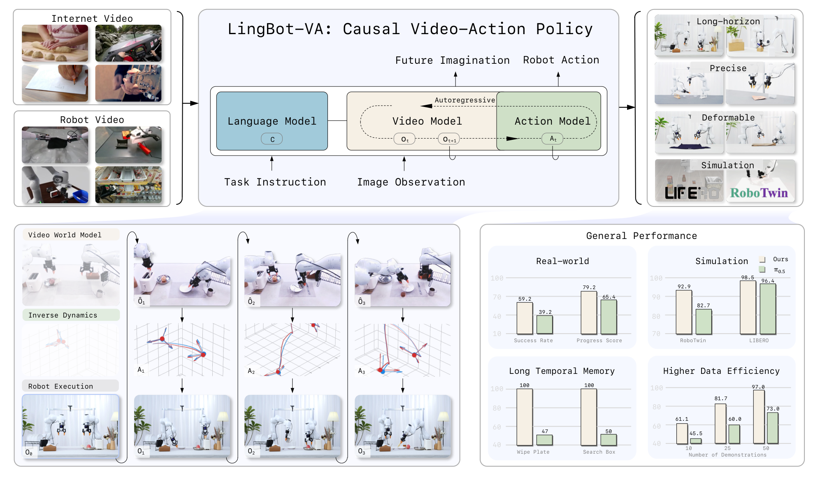
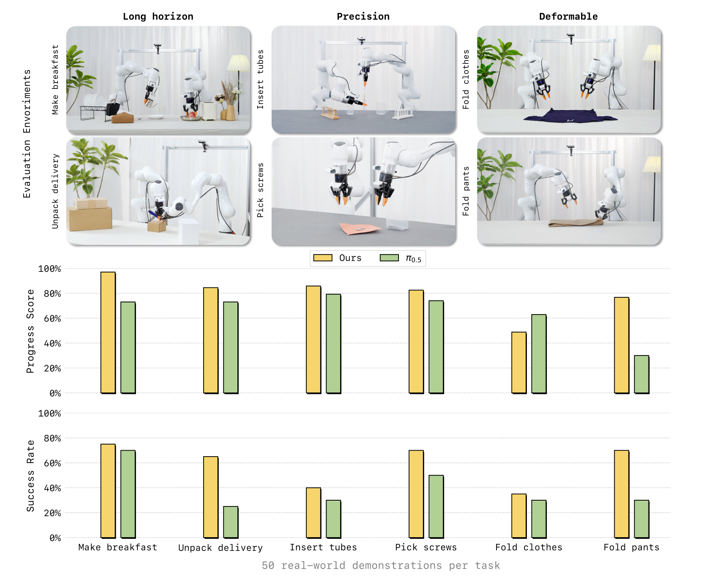
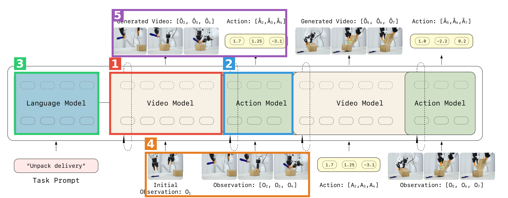
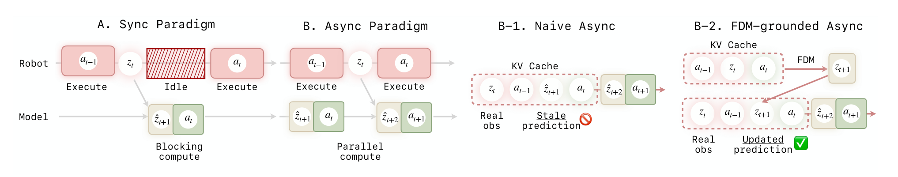
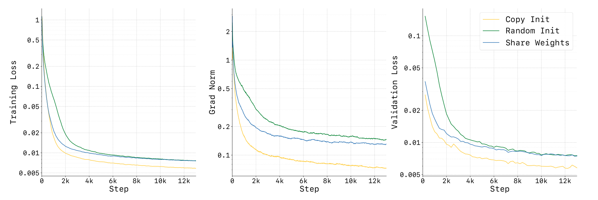
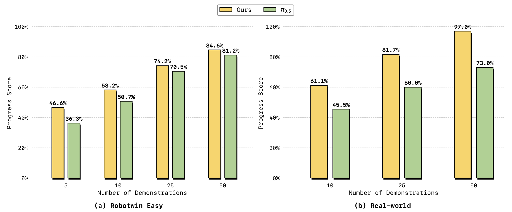
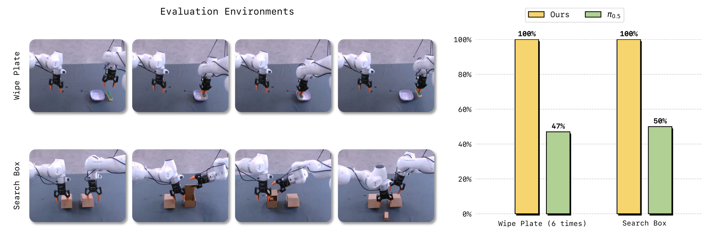
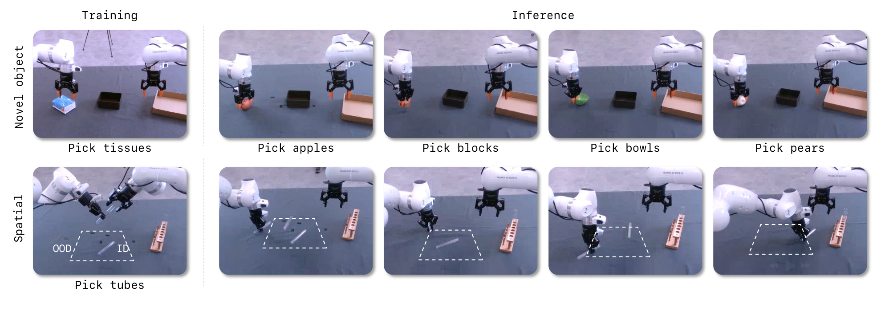

# Causal World Modeling for Robot Control（LingBot-VA）

| 项目 | 内容 |
|---|---|
| 题目 | Causal World Modeling for Robot Control |
| 作者 | Lin Li*、Qihang Zhang*†、Yiming Luo*、Shuai Yang、Ruilin Wang、Fei Han、Mingrui Yu、Zelin Gao、Nan Xue、Xing Zhu、Yujun Shen、Yinghao Xu‡（*共同一作，†Project Lead，‡通讯） |
| arXiv | [2601.21998](https://arxiv.org/abs/2601.21998)（v2，2026-03-22；cs.CV） |
| 发表 | RSS 2026（GitHub repo 标注 "[RSS 2026]"） |
| 代码 | [github.com/Robbyant/lingbot-va](https://github.com/Robbyant/lingbot-va)（Apache-2.0） |
| 权重 | [HF robbyant/lingbot-va-base](https://huggingface.co/robbyant/lingbot-va-base) 等（详见 5.4） |
| 项目主页 | [technology.robbyant.com/lingbot-va](https://technology.robbyant.com/lingbot-va) |
| 精读日期 | 2026-08-15 |

**结构速览**（论文正文 31 页）：
- §1 Introduction：VLA 反应式范式的"表示纠缠"问题 → 自回归视频-动作世界模型的三点动机（反应性、长时记忆、因果性）
- §2 Preliminary：flow matching 基础 + 条件 flow matching 视频生成
- §3 Method：3.1 两阶段形式化（视觉动力学预测 + 逆动力学）；3.2 自回归视频-动作世界建模（chunk 级 AR、latent 编码、逆动力学）；3.3 架构与训练（MoT 双流、动作流初始化、变长 chunk、teacher forcing、Noisy History Augmentation、损失）；3.4 部署（KV cache 推理、FDM-grounded 异步流水线）
- §4 Experiments：4.1 数据（16K 小时六来源）；4.2 实现与训练细节；4.3 主结果（真机六任务 + RoboTwin 2.0 + LIBERO）；4.4 消融（同步/异步、预训练、初始化）；4.5 分析（数据效率、时序记忆、泛化）
- §5 Related Work；§6 Conclusion
- 附录 A：真机评测协议与逐 trial 打分（Tables S1–S7）

---

## 第1章 · 作者与实验室背景评估

### 作者背景表

| 作者 | 角色 | 单位（依据见下） | 主页 | 背景要点 |
|---|---|---|---|---|
| Lin Li | 共同一作 | Robbyant | 未找到主页 | 公开检索无法与同名研究者可靠区分，此前发表记录无法确认 |
| Qihang Zhang | 共同一作 + Project Lead | Robbyant | [zqh0253.github.io](https://zqh0253.github.io/) | CUHK MMLab 博士（导师 Bolei Zhou、Dahua Lin），Stanford 访问（Gordon Wetzstein 组）；方向：生成模型（3D/视频）及其作为具身世界模型的应用 |
| Yiming Luo | 共同一作 | Robbyant | 未找到主页 | 同 Lin Li，无法可靠确认公开记录 |
| Yujun Shen | 作者（资深） | Robbyant 首席科学家 / Ant Research 交互智能实验室负责人 | [shenyujun.github.io](https://shenyujun.github.io/) | 清华本科、CUHK 博士；GAN 可解释性成名（InterFaceGAN、In-Domain GAN Inversion 等，多篇引用 500+）；主导开源 CoDeF、MagicQuill 等 |
| Yinghao Xu | 通讯作者 | 现 HKUST 助理教授；2025.6–2026.3 任 Robbyant 首席研究科学家，领导世界模型与具身智能组 | [justimyhxu.github.io](https://justimyhxu.github.io/) | Stanford 博后（Gordon Wetzstein）；方向 3D 视觉、生成式 AI、具身智能；其主页标注 CoRL 2024 论文为个人首篇机器人论文 |

**机构判定依据**：论文 PDF 首页未印机构名，但首页给出的项目主页（technology.robbyant.com）、GitHub org（Robbyant）与 HuggingFace org（robbyant）一致指向 Robbyant；Yujun Shen、Yinghao Xu、Qihang Zhang 三人主页均自述任职于 Robbyant（蚂蚁集团旗下具身智能/机器人公司）。

### 实验室主方向

**判定：公司主业方向（重兵投入的新开方向）**。证据：
- HuggingFace robbyant org 下有 **27 个模型仓库**，构成完整的 "LingBot" 家族：lingbot-world（世界模型，含 v2-14b）、lingbot-vla（4B/6B）、lingbot-va（本文）、lingbot-video（1.3B/30B-A3B 视频生成）、lingbot-depth、lingbot-vision（ViT S/B/L/G）——世界模型 + VLA + 视频生成是该机构的平台化主线，非单点项目。
- GitHub repo 中已放入 `LingBot_VA2_paper.pdf`（二代论文），且 Qihang Zhang 主页列出多篇后续工作（Next Forcing、RepWAM、Native Video-Action Pretraining），说明该方向持续迭代。
- 资深作者（Yujun Shen、Yinghao Xu）的学术积累在生成模型/3D/视频侧，机器人操作是近 1–2 年的新拓展；但拓展方式是"生成模型班底 + 大算力"整建制切入，与学生单打独斗式的新开方向性质不同。

### 水平预判（推断，与上述事实分开）

- 逐条核对风险信号：一作无相关积累？——Lin Li / Yiming Luo 查不到记录，**无法核对**（工业界常见）；导师主业不在此方向？——通讯与资深作者主业是生成模型，机器人是新方向，**部分命中但被下一条抵消**；实验室无持续投入？——**明确不命中**（27 个模型仓库、二代论文、多篇姊妹工作）；单位无积累？——视频生成/世界模型积累深厚，真机操作积累较新。
- **预判**：工业实验室旗舰项目，工程完成度和资源投入远超"水毕业"画像；风险不在"水"，而在"宣传口径超前于科学证据"（详见第3章盲审：核心命题的对照实验缺失、统计检验缺失）。此为推断，依据为上表发表记录与第3章评审结论。

⚠️ 本章内容未进入第3章盲审上下文。

---

## 第2章 · 论文类型判定

**结论：a+b 型（预训练视频扩散底座 + MoT 多模态架构 + 逆动力学范式的组合），外加三处原创工程模块（Noisy History Augmentation、FDM-grounded 异步推理、动作流插值初始化）。**

组件清单（均为方法节实际承担流程环节、且在参考文献中真实存在的引用）：

| 组件 | 原论文 | 在本文中承担的角色 |
|---|---|---|
| Wan2.2-5B 视频扩散模型 + causal VAE | [Wan (arXiv 2503.20314)](https://arxiv.org/abs/2503.20314)，文中 [79] | 视频流权重初始化（dv=3072，30 层）；causal VAE 做视觉 tokenizer（4×16×16 压缩） |
| Mixture-of-Transformers | [MoT (arXiv 2411.04996)](https://arxiv.org/abs/2411.04996)，文中 [43] | 双流架构骨架：视频/动作各自独立 QKV、跨模态联合注意力 |
| Flow Matching | [Lipman et al. (arXiv 2210.02747)](https://arxiv.org/abs/2210.02747)，文中 [46] | 视频与动作两条流的生成目标（连续 latent 上迭代去噪） |
| Rectified Flow | [Liu et al. (arXiv 2209.03003)](https://arxiv.org/abs/2209.03003)，文中 [50] | 同上，线性插值路径的流匹配形式 |
| T5 | [Raffel et al. (arXiv 1910.10683)](https://arxiv.org/abs/1910.10683)，文中 [59] | 冻结文本编码器，任务指令经 cross-attention 注入 |
| Motus | [Bi et al. (arXiv 2512.13030)](https://arxiv.org/abs/2512.13030)，文中 [5] | 视频时间稀疏化（τ=4）与视频-动作 token 交错的做法来源；RoboTwin 多任务训练协议也沿用其设置 |
| Seer（预测式逆动力学） | [Tian et al. (arXiv 2412.15109)](https://arxiv.org/abs/2412.15109)，文中 [73] | "先预测未来视觉状态、再条件化解动作"的 IDM 范式先例（文中 Eq. 9 明确说 mirrors [1,20,22,55,73]） |

**疑似借鉴（论文未引用，不算组件）**：Noisy History Augmentation（Eq. 10，对历史 latent 加噪以支持推理期部分去噪）与 Diffusion Forcing 一类 "per-token 独立噪声水平" 的自回归扩散训练方案机制上高度相近，但论文参考文献中没有该工作——第3章盲审 W9 亦独立指出此点。

---

## 第3章 · 双盲评审 + Rebuttal（全流程记录）

流程说明：净化文本（删除作者/机构/致谢/项目链接，方法名匿名化为 AnonBot-VA）→ 隔离上下文的 `blind-reviewer` subagent 初审 → 主 agent 以作者方身份 rebuttal 一轮 → 同一评审 agent 二轮回复与最终评级。主 agent 未对评审结论做任何软化或删改。

### 3.1 初审意见（由隔离上下文的盲审 agent 独立生成）

> **Summary**：本文提出 AnonBot-VA，一个统一视频预测与动作推理的自回归 diffusion 世界模型：视频流由 Wan2.2-5B 初始化，动作流为同深度、更窄的并行 transformer，两者通过 Mixture-of-Transformers（MoT）在交错的视频-动作 token 序列上以 causal attention + KV cache 做 chunk 级自回归生成（§3.2–3.3）。为满足实时控制，作者提出 Noisy History Augmentation（训练时对历史视频 latent 加噪，推理时只需部分去噪，Eq. 10）和 FDM-grounded 异步推理管线（Fig. 4、Alg. 2）。模型在约 16K 小时机器人数据上预训练（1.4T tokens），在 RoboTwin 2.0（50 任务）、LIBERO（4 套件）及六个真机任务上评测，并声称在长时程、精细操作与数据效率上全面超越 π0.5 等 SOTA 基线，达到 LIBERO 平均 98.5%、RoboTwin Easy/Hard 92.9%/91.6%。
>
> **Strengths**：
> 1. 逐 trial 的真机评测披露透明度高（Tables S2–S7 给出全部 6 任务 × 20 trials × 每步骤原始打分，包括对自身不利的数据）。
> 2. LIBERO 评测协议规范：3 seeds × 500 trials，报告 ± 标准差，是全文统计口径最扎实的部分。
> 3. 真机对比采用交替评测协议（一次 π0.5、一次本方法轮替），控制环境漂移混杂。
> 4. 异步推理设计有清晰的失效分析与对应 ablation（naive async 在 Horizon=3 从 85.6 崩到 32.9）。
> 5. 动作网络初始化策略有训练动态证据（Fig. 7：loss / grad norm / val loss 三组曲线）。
> 6. 评测覆盖面广：50 任务双臂仿真、LIBERO、6 真机任务，外加数据效率、时序记忆、泛化三组分析。
>
> **Weaknesses**：
> - **W1（主文声称与自身数据直接矛盾）**：§4.3.1 声称 "consistently achieves state-of-the-art performance across all six tasks and both evaluation metrics"，但 Table S4 显示 Fold Clothes 上本方法 progress score 48.8% vs π0.5 的 62.9%——基线在六分之一任务的二分之一指标上明显更高。主文全称量化表述与补充数据直接冲突。
> - **W2（核心机制性 claim 缺少直接对照）**：全文中心论点是 causal AR 优于 bidirectional chunk diffusion，Table 3 图注甚至承诺 "AR vs. bidirectional" ablation，**但表中该对照根本不存在**；与 Motus/UWM 的横向比较混杂了数据、backbone 与容量，无法归因到因果结构本身。核心科学结论处于未检验状态。
> - **W3（全文无统计检验）**：只报点估计。真机 n=20 下 Make Breakfast 75% vs 70%（15/20 vs 14/20）、Insert Tubes 40% vs 30%（8/20 vs 6/20）远不显著，却被纳入 "substantially outperforming" 叙事。
> - **W4（样本量与 seed 口径缺失）**：RoboTwin 每任务 trial 数、Fig. 8/9/10 的 n、除 LIBERO 外是否多 seed 均未报。
> - **W5（预训练数据混杂）**：语料含未披露的 "internally collected demonstrations"；基线预训练语料完全不同，数据 vs 架构无法分离；InternData-A1 与 RoboTwin 的分布关系未讨论。
> - **W6（可复现性缺口）**：（净化版中）代码发布不可核验；真机平台型号/自由度/相机配置完全未说明；π0.5 真机基线微调预算是否对齐未说明。
> - **W7（效率 claim 无实测）**："2× faster" 全文无延迟/控制频率实测；FDM async 在 Horizon=3 掉 7.6 点仍称 "comparable"。
> - **W8（数值与记号不一致）**：Conclusion 92.0% vs Table 1 的 92.93 vs §4.4 的 92.10，三组数字并存无解释；Eq. 13 的 vψ 记号与 §3.4 hat 约定混乱。
> - **W9（最近似 prior art 未讨论）**：Noisy History Augmentation 与 Diffusion Forcing 类 per-token 噪声水平的 AR-diffusion 训练方案高度相近，未引用未讨论。
>
> **Questions**（7 条，略，见 Weaknesses 对应项）
>
> **Minor issues**：Conclusion "over 20% improvement" 无明确指标对应；"Envoriments" 拼写错误、"both both" 重复；chunk size 范围 §3.3 写 K∈[1,8] 而 §4.2 写 [1,4]；真机微调超参（§4.2 默认 lr 1e-5/3K 步 vs §4.3.1 实际 lr 1e-4/500 步）不一致未解释；Eq. 6 行末游离中点。
>
> **评级：major revision**。贡献量级上是执行完整、工程含量高的组合式推进；但中心概念增量（causal AR 优于 bidirectional）恰是全文唯一没有被直接实验检验的命题，且主文结论与补充数据存在直接矛盾、全文零统计检验。

### 3.2 Rebuttal（主 agent 以作者方身份撰写）

逐条回应见发送原文（要点如下）。**承认的批评清单——即本论文真正硬伤一览**：

1. **W1 成立**："across all six tasks and both metrics" 与 Table S4（Fold Clothes 48.8% vs 62.9%）直接矛盾，须改写并讨论。
2. **W2 成立，无辩护**：AR vs. bidirectional 的同底座、同数据、同预算对照不存在，Table 3 图注承诺未兑现——这是核心命题的证据缺口。
3. **W3 大部分成立**：全文无检验/CI；Make Breakfast（p=1.0）与 Insert Tubes（p=0.74，Fisher 精确检验，由附录逐 trial 数据复算）的差距确在噪声内。
4. **W4 成立，无辩护**：样本量与 seed 口径须逐处补报。
5. **W5 预训练混杂成立**：内部数据规模未披露，跨方法比较中数据与架构贡献无法分离。
6. **W6 部分成立**：真机硬件规格、内部数据、基线微调预算披露不足。
7. **W7 成立，无辩护**："2× faster" 无实测；"comparable" 掩盖了 Horizon=3 的 7.6 点代价。
8. **W8 成立，无辩护**：三组汇总数字并存、Eq. 13 记号混乱。
9. **W9 成立**：须补引 Diffusion Forcing 类工作（rebuttal 附机制区分：噪声加在 context 上换推理加速 vs 加在生成 target 上做训练机制）。

**辩护的三点**（论据全部来自论文内部）：(a) 附录逐 trial 数据的 Fisher 精确检验显示 Unpack Delivery（13/20 vs 5/20，p=0.025）与 Fold Pants（14/20 vs 6/20，p=0.026）的优势在 n=20 下站得住；(b) 仿真对比的 post-training 数据是对齐的（§4.3.2 所有方法用同一批 demonstrations）；(c) 代码/权重公开链接在原始投稿首页真实存在，因匿名净化被删（净化流程说明，非论文外部证据）。

### 3.3 审稿人二轮回复 + 最终评级

> **W1 维持（双方确认）**：Fold Clothes 成功率 35% vs 30% 的澄清准确但 7/20 vs 6/20 无统计区分力，不能挽回全称表述；两个指标在同一任务方向相反更说明须如实讨论。
> **W2 维持（双方确认）**：这不是普通补充实验，而是中心命题目前唯一可能的直接证据；在其存在之前核心科学结论未被检验——维持当前评级的首要原因。
> **W3 部分撤回、主体维持**：接受 Fisher 检验（可由附录数据直接复算），撤回对 Unpack Delivery / Fold Pants 差距真实性的怀疑；但检验须写进论文；且 6 任务 × 2 指标共 12 组比较未做多重校正——Bonferroni 下上述两个 p 值均不再显著，须报告校正结果或论证不校正的理由；RoboTwin 平均量级论据在 trial 数未报前不予采信。
> **W4 维持（双方确认）**。
> **W5 核心维持**：post-training 对齐的澄清成立，但初审指控的本就是预训练语料层面的混杂，该辩护是对未被提出的指控的澄清。
> **W6 部分按"不可核验"记录**：链接因匿名化被删的解释合理，不再作为独立扣分项，以编辑处核验为准；硬件规格等三点维持。
> **W7、W8 维持（双方确认）**。
> **W9 维持，机制区分说明予以采纳**：缓解 novelty 担忧，但"最近似 prior art 缺席"事实不变。
> rebuttal 未发现诉诸权威或论文外部信息的违规论据。
>
> **最终评级：major revision（维持初审评级）**。rebuttal 态度坦诚、认账清晰，三处辩护均属合法内部论证，小幅增强了对实验证据的信心；但决定性缺口未变：中心科学命题（causal AR 结构本身带来收益）仍无直接实验支撑，W1/W3/W4/W7 须以新实验和新数据在修改稿中兑现，rebuttal 只提供了承诺而非结果。补齐后有达到 minor revision 乃至录用水位的可能。

---

## 第4章 · 大白话：这篇文章在做什么

**场景**：让一台双臂机器人看着摄像头画面、听一句指令，就把"做早餐""叠衣服""拆快递"这类活儿干完。

**之前的方法**：主流 VLA 模型是"看一眼当前画面 → 直接吐动作"的反应式映射，一张网络又要懂画面、又要懂物理、又要会控制，全靠一份监督信号硬学；结果是费数据、爱忘事——干长活儿干到一半忘了自己做到哪一步。

**本论文的方法**：先让模型学会"想象"——在动手之前预测接下来几帧画面会怎么变（视频世界模型），再倒推"要让画面这么变，手该怎么动"（逆动力学）。两件事塞进同一个自回归序列里一起生成，像语言模型写下一个词那样滚动进行，所有历史都留在 KV cache 里当记忆，每一步还把真实相机画面塞回去纠偏，所以长活儿不忘事、还能边干边改。

**图内文字中文翻译**（按阅读顺序）：
- 左侧输入：**Internet Video** = 互联网视频，**Robot Video** = 机器人操作视频——预训练数据的两大来源。
- 中间主框 "LingBot-VA：因果视频-动作策略"：**Language Model**（语言模型）吃 **Task Instruction**（任务指令）；**Video Model**（视频模型）吃 **Image Observation**（图像观测），沿 **Autoregressive**（自回归）箭头产出 **Future Imagination**（未来想象，o_t → o_{t+1}）；**Action Model**（动作模型）产出 **Robot Action**（机器人动作 A_t）。
- 右侧四类评测场景：**Long-horizon** 长程、**Precise** 高精度、**Deformable** 可形变物体、**Simulation** 仿真（LIBERO、RoboTwin）。
- 左下三行流程：**Video World Model**（视频世界模型）想象出 Ô₁Ô₂Ô₃ → **Inverse Dynamics**（逆动力学）解出动作 A₁A₂A₃ → **Robot Execution**（真机执行）得到真实画面 O₁O₂O₃。
- 右下 **General Performance**（总体成绩，黄=本文，绿=π0.5）：真机成功率 59.2 vs 39.2、进度分 79.2 vs 65.4；仿真 RoboTwin 92.9 vs 82.7、LIBERO 98.5 vs 96.4；**Long Temporal Memory**（长时记忆）擦盘子 100 vs 47、找盒子 100 vs 50；**Higher Data Efficiency**（数据效率）10/25/50 条演示下 61.1/81.7/97.0 vs 45.5/60.0/73.0。

自查：不做机器人的人应能读懂——"先想象画面再倒推动作，滚动生成且带记忆"。

---

## 第5章 · 实验

### 5.1 仿真实验

#### RoboTwin 2.0（双臂操作，50 任务）

- **一句大白话**：两条机械臂配合干 50 种桌面活儿（叠积木、递麦克风、挂杯子……），Easy = 东西摆放固定，Hard = 东西乱摆 + 场景随机化。
- **条件**（§4.3.2）：多任务统一训练（沿用 Motus 协议），所有方法用同一批数据：2,500 条干净场景演示（每任务 50）+ 25,000 条重随机化演示（每任务 500）；视频降采样到 12.5 Hz、动作保持 50 Hz；本文模型训 50K 步、lr 1e-5。指标 = 成功率（每任务 trial 数论文未说明，盲审 W4）。作者按任务步数（Horizon 1/2/3）分桶汇报。
- **场景图**：论文未给独立场景图；teaser 图右下角有 RoboTwin 缩略画面（见第4章图）。
- **主对比表**（Table 1 汉化；成功率 %，最优加粗；括号内为对第二名的领先，第二名加下划线原文标注）：

| 指标 | X-VLA Easy/Hard | π0 Easy/Hard | π0.5 Easy/Hard | Motus Easy/Hard | **LingBot-VA Easy/Hard** |
|---|---|---|---|---|---|
| 单步任务均值（Horizon=1） | 81.6 / 82.5 | 66.5 / 61.6 | 85.1 / 80.2 | 91.0 / 90.6 | **94.18 (+3.2) / 93.56 (+3.0)** |
| 两步任务均值（Horizon=2） | 59.3 / 55.9 | 66.1 / 54.7 | 79.3 / 73.0 | 85.2 / 80.9 | **90.35 (+5.2) / 86.95 (+6.1)** |
| 三步任务均值（Horizon=3） | 61.2 / 66.0 | 61.6 / 50.2 | 78.6 / 67.4 | 85.0 / 84.2 | **93.22 (+8.2) / 93.28 (+9.1)** |
| 全部 50 任务均值 | 72.9 / 72.8 | 65.9 / 58.4 | 82.7 / 76.8 | 88.7 / 87.0 | **92.93 (+4.2) / 91.55 (+4.6)** |

规律：任务越长（Horizon 越大）、场景越乱（Hard），领先越大——与"自回归 + KV cache 记忆"的卖点一致。

#### LIBERO（单臂，四套件）

- **一句大白话**：桌面机器人按语言指令做家务式短任务，四个套件分别考空间关系、物体识别、目标改变和长程任务。
- **条件**：每套件 10 任务 × 50 演示（按 OpenVLA 惯例过滤失败演示）；微调 4K 步、lr 1e-5；**3 个随机 seed × 每套件 500 trials（共 1500）**，报均值 ± 标准差——全文统计口径最规范的一组。
- **主对比表**（Table 2 汉化，成功率 %；基线数字转引自 X-VLA 论文）：

| 方法 | Spatial | Object | Goal | Long | 平均 |
|---|---|---|---|---|---|
| Octo | 78.9 | 85.7 | 84.6 | 51.1 | 75.1 |
| SpatialVLA | 88.2 | 89.9 | 78.6 | 55.5 | 78.1 |
| CoT-VLA | 87.5 | 91.6 | 87.6 | 69.0 | 81.1 |
| SmolVLA | 93.0 | 94.0 | 91.0 | 77.0 | 88.8 |
| GR00T-N1 | 94.4 | 97.6 | 93.0 | 90.6 | 93.9 |
| π0 | 96.8 | 98.8 | 95.8 | 85.2 | 94.1 |
| OpenVLA-OFT | 97.6 | 98.4 | **97.9** | 94.5 | 97.1 |
| CronusVLA | 97.3 | **99.6** | 96.9 | 94.0 | 97.0 |
| X-VLA | 98.2 | 98.6 | 97.8 | 97.6 | 98.1 |
| **LingBot-VA（本文）** | **98.5 ± 0.3** | **99.6 ± 0.3** | 97.2 ± 0.2 | **98.5 ± 0.5** | **98.5** |

（表中另有 Seer/MoDE/SuSIE 等仅报 Long 的方法与 TraceVLA、ThinkAct、FLOWER、π0+FAST、OpenVLA、DD-VLA、UniVLA 等，均低于本文，从略；完整见原文 Table 2。）注意 Goal 套件上 OpenVLA-OFT（97.9）更高，本文并非四项全胜；LIBERO 已高度饱和，98+ 水位上差距的信息量有限。

### 5.2 真机实验

- **一句大白话**：一套双臂机器人做六件事——做早餐（10 步）、拆快递（5 步）、插试管（抓+插 3 根）、捡螺丝（倒出来再一颗颗插回，5 步）、叠上衣（6 步）、叠裤子（3 步）。
- **条件**（§4.3.1 + 附录 A）：每任务仅 50 条真机演示，微调 500 步、lr 1e-4（注意与 §4.2 宣称的默认配置 1e-5/3K 步不一致，论文未解释）；每任务 20 trials，与 π0.5 交替评测；指标 = 进度分 PS（每步 1 / 重试成功 0.5 / 失败 0，除以满分）与成功率 SR（全步骤一次通过才算成功）。**真机平台型号、自由度、相机配置论文未提及**（图片中机械臂外观疑似 Franka，仅为看图观察，论文未写）。
- **场景图**：

- **结果汇总**（由附录 Tables S2–S7 整理；PS/SR 均为 %，优者加粗）：

| 任务 | 类别（正文口径） | 步数 | LingBot-VA PS | π0.5 PS | LingBot-VA SR | π0.5 SR |
|---|---|---|---|---|---|---|
| Make Breakfast | 长程 | 10 | **97.0** | 73.0 | **75.0** | 70.0 |
| Unpack Delivery | 长程 | 5 | **84.5** | 73.0 | **65.0** | 25.0 |
| Insert Tubes | 精度 | 6 分 | **85.8** | 79.2 | **40.0** | 30.0 |
| Pick Screws | 精度 | 5 | **82.5** | 74.0 | **70.0** | 50.0 |
| Fold Clothes | 形变 | 6 | 48.8 | **62.9** | **35.0** | 30.0 |
| Fold Pants | 形变 | 3 | **76.7** | 30.0 | **70.0** | 30.0 |

- 注意两处（grounded）：① **Fold Clothes 的进度分输给 π0.5**（48.8 vs 62.9，Table S4），与主文 "consistently ... across all six tasks and both metrics" 直接矛盾（盲审 W1，双方确认）；② 任务归类正文与 Fig. 5 图注互相矛盾——正文说长程 = Make Breakfast + Unpack Delivery、精度 = Insert Tubes + Pick Screws，图注却写长程 = Make Breakfast + Pick Screws、精度 = Insert Tubes + Unpack Delivery。
- 项目主页：[https://technology.robbyant.com/lingbot-va](https://technology.robbyant.com/lingbot-va)（论文首页脚注给出）。

### 5.3 为什么选这些实验

作者选的场景几乎全部落在**"长、乱、省数据"**三个特性上，恰好是自回归世界模型设计的甜区：

1. **长程 / 多步**：RoboTwin 按 Horizon 分桶后，领先随步数单调放大（Horizon=1 时 +3.2/+3.0 → Horizon=3 时 +8.2/+9.1，Table 1）；真机选了 10 步的 Make Breakfast（PS 97.0 vs 73.0）。吃这个特性的设计是 **KV cache 持久记忆 + 因果注意力**——chunk 式扩散方法每段独立生成会"失忆"，本文把整条轨迹缓存起来。
2. **显式记忆**：专门设计了 Wipe Plate（擦盘子恰好 6 次，考计数）和 Search Box（右盒空了该去开左盒，考状态记忆），成功率 100 vs 47、100 vs 50（Fig. 9）。这两个任务是为"teacher forcing 全历史条件 + KV cache"量身定做的——没有记忆的反应式策略在 Search Box 上理论上限就是 50%。
3. **少样本后训练**：数据效率曲线（Fig. 8）在 10 demo 时差距最大（真机 61.1 vs 45.5，RoboTwin 58.2 vs 50.7）；吃这个特性的是 16K 小时视频-动作联合预训练提供的动力学先验。

**该测但没测的（缺席本身是信号）**：
- **CALVIN ABC-D**：长程语言条件操作的主流 bench，且本文引用的 Seer 正是在 CALVIN 上立论的——本文主打长程却没测它。
- **扰动/干扰实验**：论文第 1 页把 "reactivity gap"（实时纠错）列为三大动机之首，FDM-grounded 设计也是为闭环反应服务的，但全文没有任何"执行中途人为干扰"的实验，反应性只有间接证据（naive async 的崩溃，Table 3）。
- **真机上与其他世界模型方法的对比**：真机只打了 π0.5 一个基线；同类视频-动作方法（UWM、UVA、Motus）都只在仿真里比。
- 统计检验缺失使部分真机差距（Make Breakfast SR 15/20 vs 14/20）不具区分力，见第3章 W3。

### 5.4 复现可能性（硬核查）

逐项核查（证据来源标注；GitHub repo 与 HuggingFace 已实际打开核对文件列表）：

**代码**：✅ 存在且是实质代码。[Robbyant/lingbot-va](https://github.com/Robbyant/lingbot-va)（Apache-2.0）含 `wan_va/`（模型）、`evaluation/`（RoboTwin + LIBERO 的 server/client 脚本）、`script/`（训练启动）、`INSTALL.md`、post-training 完整文档（FSDP + LeRobot 格式，含自定义数据集教程）；README 给出依赖版本（Python 3.10.16 / torch 2.9.0 / CUDA 12.6）与显存需求（RoboTwin 评测约 24GB、i2av 推理约 18GB）。

**ckpt 逐场景清单**（来源：repo README "Model Download" 表 + HF org 列表实查）：

| 场景 | 权重 | 状态 |
|---|---|---|
| 预训练底座 | lingbot-va-base | ✅ HF + ModelScope |
| RoboTwin 后训练 | lingbot-va-posttrain-robotwin | ✅ |
| LIBERO-Long 后训练 | lingbot-va-posttrain-libero-long | ✅（2026-04-24 释出） |
| LIBERO Spatial/Object/Goal 后训练 | — | ❌ 未开源 |
| 六个真机任务 | — | ❌ 全部未开源 |

**数据**：post-training 数据 ✅（HF datasets：robotwin-clean-and-aug-lerobot、libero-long-lerobot，LeRobot 格式）；预训练 16K 小时语料 ❌——六个公开来源列了名字（Agibot、RoboMind、InternData-A1、OXE 子集、UMI 数据、RoboCOIN，§4.1），但"internally collected demonstrations"的规模与内容未披露、未发布，逐源配比未给（仅说 uniform sampling）。处理脚本：repo 有自定义数据集转换教程 ✅。

**训练细节**（正文 §4.2 找到的）：预训练 lr 1e-4 峰值 + AdamW + wd 0.01 + cosine/linear warmup ✅、bf16 + grad clip 2.0 ✅、text dropout 0.1 ✅、λ=1 ✅、1.4T tokens ✅、uniform SNR sampler ✅、K∈[1,4] ✅、序列打包 10K tokens ✅、动作 per-dimension 分位数归一化 ✅、数据 90/10 切分 ✅、推理配置（视频 3 步 Euler 到 s=0.6，动作 10 步到 s=1.0，CFG 5.0/1.0）✅。

**缺失项**（每条均为全文检索未找到）：
- batch size / GPU 型号与数量 / 预训练总时长——未给出
- RoboTwin 每任务评测 trial 数——未说明
- 除 LIBERO 外全部实验的 seed 数——未说明
- 真机平台型号、自由度、相机配置——未说明
- 真机任务微调为何用 lr 1e-4/500 步而非 §4.2 宣称的默认 1e-5/3K 步——未解释
- π0.5 各实验中的微调预算——未说明
- warmup 步数、λ 以外损失细节（Lfdm 权重）——未给出

**结论**：
- **仿真（RoboTwin / LIBERO-Long）：需自行补齐细节**——代码 + ckpt + 后训练数据齐备，评测脚本现成，主要缺 batch size / trial 数 / 硬件规模等次级信息，跑通推理评测的可行性高。
- **预训练与真机结果：难以复现**——内部预训练数据不可得、算力配置未知、真机 ckpt 与硬件规格全部缺失。

---

## 第6章 · 方法拆解

方法总览图（Fig. 2）+ 彩色标注：

框对应关系：🟥1 = 视频流（Video Model），🟦2 = 动作流（Action Model），🟩3 = 语言条件（Language Model），🟧4 = 真实观测回灌（闭环反馈输入），🟪5 = 每步输出（想象视频 + 动作 chunk）。图中右半部分是同一模型的下一个自回归步（结构相同，未重复标注）。

**🟩3 语言条件块**——来源：冻结 T5 编码器（[T5](https://arxiv.org/abs/1910.10683)，文中 [59]）。接口：进 = 一句任务指令（如 "Unpack delivery"）；出 = 文本 embedding，经 cross-attention 注入视频流和动作流每一层。训练时：冻结不动，另以 0.1 概率 dropout 文本做 classifier-free guidance。部署时：整条任务只编码一次。

**🟥1 视频流（世界模型主体）**——来源：Wan2.2-5B 视频扩散模型初始化（[Wan](https://arxiv.org/abs/2503.20314)，文中 [79]），dv=3072、30 层。接口：进 = 历史视频 latent（Wan causal VAE 编码，4×16×16 压缩 + patchify，双视角拼宽后每帧 192 个 token）+ 历史动作 token + 🟩 的文本条件；出 = 下一个 chunk（K=4 帧）的未来视频 latent，交给 🟦。训练时：flow matching 速度场回归（Eq. 11），teacher forcing + 因果注意力掩码（Fig. 3），关键特技是 **Noisy History Augmentation**——以 0.5 概率把历史 latent 按 flow 插值方式加噪到 s∈[0.5,1]（Eq. 10），逼着下游学会从"半模糊"的想象里读信息。部署时：只积分到 s=0.6（3 步 Euler）就停——画面不用画到高清，够动作流看懂就行，去噪步数省一半。

**🟦2 动作流（逆动力学）**——来源：MoT 双流设计（[MoT](https://arxiv.org/abs/2411.04996)，文中 [43]）+ 预测式 IDM 范式（[Seer](https://arxiv.org/abs/2412.15109) 等，文中 [73]）；作者原创点是**插值初始化**：从视频流权重按动作维度插值并乘 α=√(dv/da) 保方差，避免随机初始化搅乱联合注意力（Fig. 7 有对照曲线）。结构：与视频流同深（30 层）但窄 4 倍（da=768，仅 ~350M 参数），每层独立 QKV，动作 token 先线性投到视频维度参与联合自注意力再投回。接口：进 = 🟥 预测的（半去噪）未来 latent + 全部历史 + 文本条件；出 = 每帧 τ=4 个、共 τK=16 个 30 维动作向量（双臂各 7 EEF + 7 关节 + 1 夹爪），10 步 Euler 积分到 s=1.0，经单层 MLP 解码。训练时：逆动力学 flow matching 损失（Eq. 12），与 Ldyn 等权（λ=1）联合优化。部署时：动作以 50 Hz 执行。

**🟧4 闭环反馈块**——来源：作者原创（针对 naive async 的失效分析，§3.4）。接口：进 = 机器人执行后相机拍到的真实画面；出 = causal VAE 编码后写入 KV cache，**替换**模型自己脑补的画面。部署时的完整机制是 **FDM-grounded 异步推理**（Fig. 4B-2、Alg. 2）：机器人执行当前动作 chunk 的同时，模型并行预测下一 chunk；为了不让模型"顺着自己的幻觉往下编"，每步先用最新真实观测 + 正在执行的动作跑一次前向动力学（FDM）重新想象结果，再基于这个"落过地"的预测规划下一步。训练时：post-training 阶段额外加 FDM 预测损失（Eq. 13）。

**🟪5 输出块**——接口：进 = 🟥🟦 的生成结果；出 = ① 未来想象视频（可解码到像素做可视化，也是世界模型的副产品能力：视频预测、从机器人视频反推动作）；② 动作 chunk → 机器人电机执行 → 产生新观测回到 🟧4，闭环成立。

**接口自查**：指令→🟩→（🟥,🟦）条件；历史观测/动作→🟥→未来 latent→🟦→动作→机器人→新观测→🟧→KV cache→🟥。首尾相接，流程闭合 ✅。

---

## 第7章 · 消融

消融都在 RoboTwin 2.0 Easy 上做（Table 3 汉化，成功率 %）：

| 消融项 | 全部任务 | Horizon=1 | Horizon=2 | Horizon=3 | 一句 takeaway |
|---|---|---|---|---|---|
| 完整 LingBot-VA（同步部署，基线） | **92.9** | **94.2** | **90.4** | **93.2** | 上限参照 |
| 部署换成 FDM-grounded 异步 | 90.4 | 92.5 | 87.7 | 85.6 | 异步加速不白给：总体 -2.5，长程任务 -7.6——论文称 "comparable" 偏宽（盲审 W7） |
| 部署换成朴素异步（不做 FDM 重落地） | 74.3 | 83.3 | 70.3 | 32.9 | 长程崩盘（-60.3）：不把真实观测灌回去，模型顺着幻觉走到底；FDM grounding 是异步可用的关键 |
| 预训练底座换成原始 Wan2.2（不做视频-动作联合预训练） | 80.6 | 84.9 | 76.3 | 67.6 | 联合预训练贡献约 12 个点，是最大单项，且越长程贡献越大（Horizon=3 差 25.6） |

动作网络初始化消融（Fig. 7）：随机初始化 → 梯度范数高、收敛慢；直接共享视频权重 → 稳定但次优；**拷贝视频权重 + √(dv/da) 缩放** → 三条曲线（训练 loss / 梯度范数 / 验证 loss）全面最优。

配套分析实验（不算严格消融但支撑设计动机）：数据效率（Fig. 8）、时序记忆（Fig. 9）、泛化（Fig. 10）：

**关键缺陷（呼应第3章）**：Table 3 图注承诺了三组消融——"world modeling (AR vs. bidirectional), deployment, pretraining"——但表里只有后两组，**AR vs. bidirectional 这一全文中心命题的消融不存在**（盲审 W2，rebuttal 无辩护，双方确认）。换句话说：消融证明了"预训练有用、FDM 有用、初始化有用"，唯独没证明标题里的 "Causal" 本身有用。
