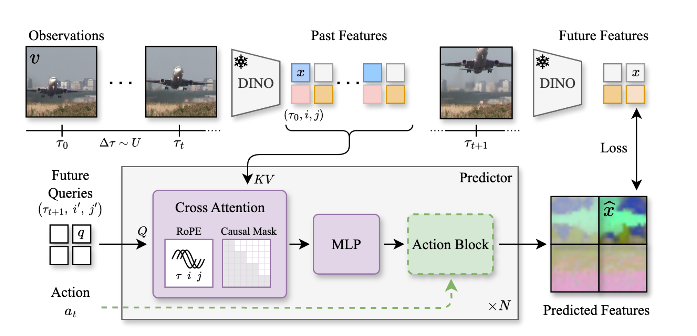
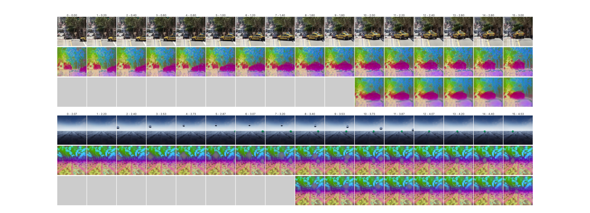
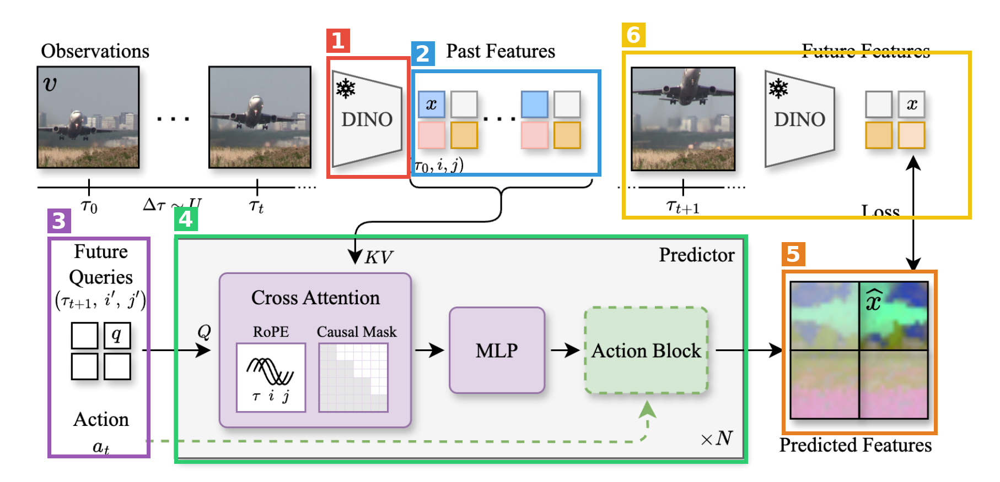
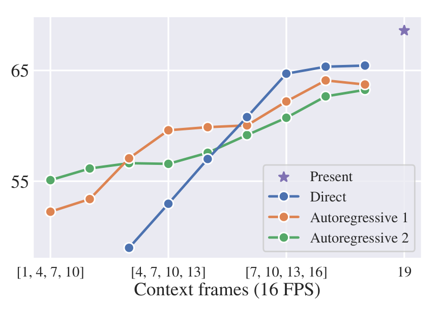

# Back to the Features: DINO as a Foundation for Video World Models（DINO-world）

| 项目 | 内容 |
|---|---|
| 题目 | Back to the Features: DINO as a Foundation for Video World Models |
| 作者 | Federico Baldassarre, Marc Szafraniec, Basile Terver, Vasil Khalidov, Francisco Massa, Yann LeCun, Patrick Labatut, Maximilian Seitzer, Piotr Bojanowski（Meta FAIR） |
| arXiv | <https://arxiv.org/abs/2507.19468>（v1, 2025-07-25） |
| 发布日期 | 2025-07-25（arXiv v1） |
| 代码 / 主页 | 未找到（2026-08-15 检索：无官方仓库、无项目主页；论文内也无发布声明） |
| 一句话 | 冻结 DINOv2 当状态空间，在 6600 万条未整理网络视频上训一个 cross-attention 未来特征预测器；支持任意帧率/分辨率/上下文长度，加零初始化 action block 微调后可做 latent 规划 |

**结构速览**（24 页）

- §1 引言：世界模型三大难（数据贵、任务难、评测散），主张"冻结 SSL encoder 的 latent 空间里做预测"
- §2 相关工作：世界模型的应用（控制/生成/预报）与设计选择（latent 空间、多阶段训练、建模框架）
- §3 方法：3.1 观测与状态空间（DINOv2 patch token）；3.2 预测器架构与训练（cross-attention decoder + 3 轴 RoPE + 变帧率采样）；3.3 动作条件微调（零初始化 action blocks）
- §4 实验：4.1 dense forecasting（VSPW/Cityscapes/KITTI）+ 直觉物理（IntPhys/GRASP/InfLevel）；4.2 消融（predictor 规模/数据/encoder）+ 定性分析 + direct vs 自回归；4.3 动作微调与规划（PushT/Wall/PointMaze）
- §5 结论与未来方向
- 附录 A 实现与超参（架构细节、RoPE 周期、优化、算力）；B 数据集统计；C 评测数据集/基线适配/协议细节；D 规划环境、微调与 CEM 算法；E 补充结果（定性 rollout、注意力可视化、直觉物理逐类分数）

---

## 第1章 · 作者与实验室背景评估

### 作者背景表

| 作者 | 角色 | 单位 | 主方向与代表作 | 主页 |
|---|---|---|---|---|
| Federico Baldassarre | 一作 | Meta FAIR（发文时，博士后 2023.9–2025.12；现 Mistral AI Scientist） | 自监督视觉表征：DINOv3、DINO.txt（CVPR 2025）、CAPI（TMLR 2025）；博士（KTH, 2018–2023）做深度模型可解释性 | [个人主页](https://baldassarrefe.github.io/) · [Google Scholar](https://scholar.google.com/citations?user=0iy5EucAAAAJ) |
| Piotr Bojanowski | 末位作者（资深，DINO 团队负责人角色） | Meta FAIR | fastText、SwAV、DINOv2/DINOv3 等自监督表征系列，引用 8 万+ | [Google Scholar](https://scholar.google.com/citations?user=lJ_oh2EAAAAJ) |
| Yann LeCun | 合作者 | Meta（时任首席 AI 科学家） | 世界模型/JEPA 路线图（"A Path Towards Autonomous Machine Intelligence"）、V-JEPA、DINO-WM 等 | 未单独检索主页 |
| Maximilian Seitzer | 合作者 | Meta FAIR（DINO 团队） | 物体中心表征学习（VideoSAUR 等），博士毕业于 MPI Tübingen | [Semantic Scholar](https://www.semanticscholar.org/author/Maximilian-Seitzer/2348556) |

### 实验室主方向

Meta FAIR 的 DINO 团队（巴黎为主）：自监督视觉表征是**传统强方向**——DINO（2021）→ DINOv2（2023）→ Vision Transformers Need Registers（2023）→ CAPI/DINO.txt（2025）→ DINOv3（2025.8，一作同为 Baldassarre 参与），持续投入五年以上。视频世界模型对 DINO 团队本身算**新延伸方向**，但在 FAIR 整体是 LeCun 世界模型议程下的持续投入：V-JEPA（2024）、Navigation World Models（2024）、DINO-WM（2024，NYU+Meta）、Garrido et al. 直觉物理（2025）。本文正是"DINO 团队的表征"与"LeCun 的世界模型议程"的交汇点。

### 水平预判

**事实**：一作有扎实的 SSL 表征发表记录（DINOv3/CAPI/DINO.txt），但这是其**首篇世界模型方向**的一作工作；资深作者、团队、机构在 encoder 侧积累极深，世界模型侧 FAIR 有持续产出。
**推断**（依据上述事实）：工业实验室工作，无"水毕业"问题；预期是工程与评测扎实、思想上偏"规模化验证已有范式"的稳健型论文——DINO-WM（用 DINO 特征做规划）与 DINO-Foresight（用 DINO 特征做预报）已先行，本文的增量在规模与统一评测。这一预判与第3章盲审结论（"组合与规模化推进，执行良好"）一致。

⚠️ 本章内容未进入第3章盲审上下文。

---

## 第2章 · 论文类型判定

**结论：a+b 型组合创新 + 三处原创设计**。把「冻结 DINOv2 的特征空间」（a）与「query-based cross-attention 自回归预测器」（b）组合成视频世界模型，再规模化到 1.1B 参数 / 66M 视频；原创部分是：① 连续时间戳的 3 轴 RoPE（时间用绝对秒，空间用 [-1,1] 相对坐标），② 变帧率均匀 Δτ 采样策略，③ 零初始化 action blocks 微调方案。评测协议大量复用先前工作。

### 组件清单

| 组件 | 原论文 | 在本文中的角色 |
|---|---|---|
| DINOv2（+ registers） | [DINOv2](https://arxiv.org/abs/2304.07193) · [Registers](https://arxiv.org/abs/2309.16588) | 冻结帧编码器，定义状态空间（ViT-B/14，取末层 256×768 patch token，§3.1、附录 A.1） |
| Transformer cross-attention | [Attention Is All You Need](https://arxiv.org/abs/1706.03762) | 预测器骨干：N 层 pre-norm cross-attention decoder（§3.2 明言借鉴 NMT [53]） |
| CrossMAE | [Rethinking Patch Dependence for MAE](https://arxiv.org/abs/2401.14391) | query token 只 cross-attend 上下文的解码式重建思路（§3.2 引 [54]） |
| RoPE | [RoFormer](https://arxiv.org/abs/2104.09864) | 位置编码基座；本文改成 τ/i/j 三轴分割 head 维度（§3.2、附录 A.1） |
| DINO-WM | [arXiv 2411.04983](https://arxiv.org/abs/2411.04983) | 整套规划评测协议：三个环境的离线轨迹、frameskip=5、CEM 规划器（§4.3、附录 D）；同时是 action 条件化的对比方案（interleave token，§3.3 批评其缺点） |
| Diffusion Policy | [arXiv 2303.04137](https://arxiv.org/abs/2303.04137) | PushT 环境来源（[68]） |
| D4RL | [arXiv 2004.07219](https://arxiv.org/abs/2004.07219) | PointMaze 环境来源（[69]） |
| Garrido et al. 直觉物理协议 | [arXiv 2502.11831](https://arxiv.org/abs/2502.11831) | surprise 分数评测直觉物理的协议（§4.1 引 [21]） |
| DINO-Foresight | [arXiv 2412.11673](https://arxiv.org/abs/2412.11673) | 最近似先前工作/基线：同样冻结 DINOv2 预测未来特征，但 masked-reconstruction 目标 + 窄域训练（§4） |

基线（承担对照而非流程环节）：[V-JEPA](https://arxiv.org/abs/2404.08471)、[COSMOS](https://arxiv.org/abs/2501.03575)。未发现"疑似借鉴但未引用"的组件。

---

## 第3章 · 双盲评审 + Rebuttal（全流程记录）

### 3.1 初审意见（由隔离上下文的盲审 agent 独立生成）

> **Summary**：本文提出 DINO-world，一个在冻结 DINOv2 latent 空间中训练的通用视频世界模型：用一个 query-based cross-attention 预测器（最大 1.1B 参数，ViT-g 规模）在约 66M 条未整理网络视频上以 next-frame 特征预测目标做预训练，通过 3 轴 RoPE 显式建模连续时间戳，从而支持可变帧率、上下文长度与分辨率。作者在 dense forecasting（VSPW/Cityscapes 分割预测、KITTI 深度预测）与三个直觉物理基准上，将本方法与 V-JEPA、DINO-Foresight、COSMOS 等不同范式的世界模型置于统一评测协议下比较，并进一步展示：在预训练模型上插入零初始化的 action blocks，用少量 observation-action 轨迹微调后即可在 PushT、Wall、PointMaze 三个模拟环境中做 CEM 规划，且优于从零训练。
>
> **Strengths**
> - **跨范式统一评测是实在的贡献**。第 4.1 节及附录 C 把像素生成模型（COSMOS）、联合训练的表征模型（V-JEPA）和 latent 预测模型放进同一 downstream 协议（present-time linear head + 未来特征），并为每个 baseline 做了细致、写得很透明的适配（附录 C.2/C.3，如 V-JEPA 双 encoder 的处理、DINO-Foresight 的 PCA 协议二选一并报告更优者）。这种评测工程在该文献中确实缺失。
> - **架构设计干净且有明确动机**。第 3.2 节用连续时间戳 + 3 轴 RoPE 取代离散帧索引，配合按 Δτ 均匀采样的训练策略，使模型天然支持变帧率与任意查询时刻；Figure 3 的 direct vs. autoregressive 对比正是这一设计解锁的分析。
> - **消融覆盖了三条关键轴**：predictor 规模、训练数据规模/多样性、encoder 选择（Table 3），且结论清晰。
> - **Action-conditioned 微调方案简单合理**。零初始化 action blocks 保持预训练模型不被破坏、支持 frozen-backbone 变体，Table 4 的三档对比设计是对的。
> - 附录 A/B 对超参、算力、数据集统计的披露比同类工作细致。
>
> **Weaknesses**
> - **W1（可复现性，政策性硬伤）**：全部主结果建立在约 66M 条私有视频之上，而全文没有任何代码、模型权重或数据发布的声明。数据消融（Table 3 中）恰恰表明公开数据集训练无法接近主结果，即本文的核心结论在现有材料下不可独立验证。
> - **W2（统计报告全面缺失）**：全文没有任何误差条、置信区间或统计检验。Table 4 虽给出 n=512 episodes，但未报 CI——按二项分布粗算，Wall 上 fine-tuned vs. action-only（93.8 vs 91.1）的差距约在一个标准误的量级。
> - **W3（摘要 claim 与证据落差）**：(a) 摘要称 "outperforms previous models on a variety of video prediction benchmarks"，但 Cityscapes mid-term（55.1 vs 57.2）与 KITTI mid-term（4.268 vs 3.740）均落败；(b) 摘要称 "strong understanding of intuitive physics"，正文却明确写 "we treat these evaluations as a sanity check rather than a benchmark"，且 GRASP Collision 类目准确率 0.0；(c) "6.3% higher mIoU" 只有把 Copy-Last 排除在 "model" 之外才成立（Copy-Last 42.1 高于 COSMOS-12B 的 40.7），对最强替代的真实领先是 4.9 个点。
> - **W4（规划实验缺最直接的对比对象）**：完全采用 DINO-WM 的环境、离线轨迹与 CEM 设置，却不报 DINO-WM 自己的成功率；CEM 的 K 从 30 改为 10 的影响也未说明。
> - **W5（跨方法比较的容量与数据不对齐）**：本方法 predictor 1.1B vs V-JEPA 22M / DINO-Foresight 193M；且 Table 3（中）显示同一架构在 Cityscapes 上训练时 CS mid-term 仅 45.6，远低于 DINO-Foresight 的 57.2——主结果的领先主要由私有大规模数据驱动，"validates the proposed paradigm" 归因过强。
> - **W6（测试集污染未检查）**：66M uncurated 网络视频与六个评测基准之间没有任何去重或近重复检查的报告。
> - **W7（直觉物理度量不可比 + 报告口径不一）**：latent 模型用特征 MAE、COSMOS 用 token perplexity，两种 surprise 不可直接横比；Table 2 只列 COSMOS-4B，Table 9a 却有 12B，9b/9c 又只有 4B。
>
> **Minor issues**：摘要 ~60M 与正文 ~66M 不一致；"three physics understanding benchmark" 语法；正文 "0.5 seconds" 与附录 562.5/600ms 不一致；Figure 3 刻度过少；Table 9b 表头错位；D.1 缺词。
>
> **评级：major revision**。贡献量级是执行良好的规模化验证与跨范式评测整合，核心思想相对 DINO-Foresight/DINO-WM 属组合与规模化推进；W1 无法解决则按本刊政策不可发表。

### 3.2 Rebuttal（作者方，一轮）

逐条回应见下；**承认的批评清单**（即本文真正硬伤一览）：

1. **W1 成立**：无任何代码/权重/数据发布声明，私有 66M 数据 + Table 3 证明公开数据无法逼近主结果 → 现状不可独立复现。
2. **W2 部分成立**：全文无 CI/检验/多 seed；Wall 上 fine-tuned vs action-only（93.8 vs 91.1）确实在噪声边缘。
3. **W3 全部三处表述缺陷成立**：摘要措辞超出证据范围；直觉物理的摘要说法与正文 sanity-check 定位矛盾；"6.3%" 口径未说明（对 Copy-Last 实为 4.9）。
4. **W4 成立**：借用 DINO-WM 全套评测设置却不报其数字，K=30→10 无消融，论文内部无材料填补。
5. **W5 归因过强成立**："validates the proposed paradigm" 应收敛为"frozen encoder + 大规模数据的组合有效"。
6. **W6 成立**：污染/去重检查完全缺失。
7. **W7 报告口径不一致成立**：COSMOS 4B/12B 在 Table 2/9 间不统一。
8. Minor issues 全部承认。

**辩护的点**（论据全部来自论文内部）：

- 对 W2：§4.3 的核心结论是 fine-tuned vs **scratch**（PushT +12.5 个点 ≈4σ、PointMaze +9.3 ≈3σ、Wall +6.7 ≈3.5σ，按 n=512 二项 SE 估算），补上 CI 后该方向性结论仍在三个环境存活；不显著的只是次要对比 fine-tuned vs action-only。
- 对 W3(a)：准确版本是 VSPW short/mid 均第一、Cityscapes short 第一、KITTI short 第一；mid-term 落后的两处对手是域内专训的 DINO-Foresight，正文 4.1 已有此归因，缺陷在摘要未反映限定。
- 对 W5：Table 3 的 CS 行也不是纯架构对照——DINO-Foresight 用 448×896 两阶段训练 + 四层特征拼接 PCA，我们的 CS 模型是 1.1B predictor 在 2975 条视频上、单层特征、224 分辨率（VSPW 崩至 23.1 印证过拟合），所以"数据对齐时架构必然劣于 masked-reconstruction"同样推不出；能得出的只是"小数据窄域下大 predictor 无优势"。
- 对 W7：协议沿用 Garrido et al. [21]；COSMOS 用 perplexity 是其离散 token 机制下的自然对应；正文已明确降格为 sanity check。

### 3.3 审稿人二轮回复 + 最终评级

> **W1 维持**（政策性硬伤，必须以发布封闭）。**W2 部分撤回**：撤回"核心结论可能整体不显著"的推断强度——rebuttal 的二项 SE 估算是合法内部论证，"预训练优于从零"在三个环境可存活；维持"统计披露缺失"本身。**W3 维持**（三处均为真实存在的表述缺陷，可改写封闭）。**W4 维持**（内部对照干净这一澄清被接受，但绝对水位问题未回答）。**W5 部分撤回**：撤回"数据对齐时架构劣于 masked-reconstruction"的反向推断，修正为"**架构贡献在现有实验中不可分离**——既未证明优势也未证明劣势"；维持归因过强 + 容量对齐消融缺失。**W6 维持**。**W7 部分撤回**：降格为呈现问题；维持 COSMOS 口径不一致。
>
> **双方确认的缺陷**：①私有数据 + 无发布声明，不可复现；②无 CI/检验/多 seed；③摘要三处过度声称；④缺 DINO-WM 对比 + K 改动无消融；⑤容量与数据不对齐、架构贡献不可分离；⑥无污染检查；⑦COSMOS 报告口径不一。
>
> **最终评级：major revision（维持）**。rebuttal 在 W2/W5 两处实质改善了判断，证据强度在"部分支持"区间内上移但不足以跨档；诚实、全部基于内部证据的 rebuttal 态度增强了对修订可行性的信心，但 W1 不解决则按本刊政策无法发表。

---

## 第4章 · 大白话：这篇文章在做什么

**场景**：视频世界模型——给模型看几帧视频，让它预测接下来会发生什么。预测得准，就说明它"懂"物理和常识，可以拿来给机器人做规划：真动手之前先在脑子里把几条候选动作演一遍，挑最好的那条。

**之前的方法**：一派是像素级生成模型（SORA、COSMOS），画面漂亮但训练要上千万 GPU 时，而且大量算力浪费在"风吹树叶怎么动"这种和决策无关的细节上；另一派在抽象特征空间里做预测，省算力，但要么 encoder 和预测器绑在一起训、特征不适合预测（V-JEPA），要么只在自动驾驶等窄域小数据上训过（DINO-Foresight、DINO-WM）。

**本论文的方法**：encoder 直接用现成的 DINOv2 并且冻住，只训一个"未来特征预测器"，在 6600 万条未经筛选的网络视频上大规模预训练——相当于站在 DINOv2 肩膀上，只学"世界怎么变"，不学"世界长什么样"。预测器用"查询"的方式工作，可以问它任意未来时刻、任意位置的特征；之后插几个小的动作模块微调，就能变成可用于规划的动作条件世界模型。

**图内文字中文翻译**（按阅读顺序）：左上 **Observations（观测）**——一段视频的各帧 v 和时间戳 τ₀…τₜ，相邻帧间隔 Δτ 从均匀分布采样（Δτ∼U）；帧经过带雪花❄标记（=冻结不训练）的 **DINO** 编码器，得到 **Past Features（过去特征）**——每帧一格格的 patch token x，坐标记为 (τ₀,i,j)。右上：未来时刻 τₜ₊₁ 的帧同样过冻结 DINO 得到 **Future Features（未来特征，作训练目标）**，与模型输出算 **Loss（损失）**。下半 **Predictor（预测器）**：左侧 **Future Queries（未来查询）**——查询 token q 携带目标坐标 (τₜ₊₁,i′,j′)，作为 Q 进入 N 层堆叠的模块：**Cross Attention（交叉注意力，含 RoPE 位置旋转编码——对 τ,i,j 三轴分别编码——和 Causal Mask 因果掩码，保证只能看过去）**，K、V 来自全部过去特征；再过 **MLP**；虚线绿框 **Action Block（动作块）** 是可选的：动作条件微调时才加入，把动作 aₜ 注入查询。最右 **Predicted Features（预测的特征）** x̂ 即输出。

自查：不做这个方向的人应能看懂——"冻住一个看图很强的模型，只教另一个模型预测'它眼中的世界'接下来长什么样"。

---

## 第5章 · 实验

### 5.1 仿真 / 基准实验

本文没有机器人真机实验，全部评测分三组：dense forecasting（§4.1）、直觉物理（§4.1）、模拟环境规划（§4.3）。

#### 5.1.1 Dense forecasting（分割/深度预报）

**一句大白话**：给模型看过去 4 帧，让它预测 0.2 秒（short）或约 0.5–0.6 秒（mid）之后的特征，再用一个只在"当前帧"上训过的线性头把特征解码成语义分割或深度图——特征预测得越准，分割/深度就越准。

**条件**（§4.1、附录 C）：三个数据集 Cityscapes（驾驶，16FPS，只有第 19 帧有标注）、VSPW（野外场景视频，124 类，全帧标注）、KITTI（驾驶深度，10FPS）。指标：分割 mIoU（越高越好）、深度 RMSE（越低越好）。基线：Copy Last（把最后观测帧的特征直接当预测）、COSMOS-4B/12B（生成像素后再编码）、V-JEPA ViT-L/H、DINO-Foresight。本文模型：DINOv2 ViT-B 编码 + 1.1B "giant" 预测器，训练数据 66M 私有视频。

**主对比表（Table 1 汉化）**：Present = 不预测、直接在当前帧上用线性头的上限分数。

| 方法 | encoder | VSPW mIoU↑ 当前 | short | mid | Cityscapes mIoU↑ 当前 | short | mid | KITTI RMSE↓ 当前 | short | mid |
|---|---|---|---|---|---|---|---|---|---|---|
| Copy Last | ViT-B | 52.8 | 47.9 | 42.1 | 68.6 | 53.2 | 39.7 | 2.963 | 3.778 | 4.745 |
| COSMOS-4B | ViT-B | 52.8 | 46.6 | 40.2 | 68.6 | 55.4 | 46.2 | 2.963 | 4.178 | 4.742 |
| COSMOS-12B | ViT-B | 52.8 | 46.6 | 40.7 | 68.6 | 55.6 | 45.9 | 2.963 | 4.157 | 4.617 |
| V-JEPA ViT-L | ViT-L | 29.1 | 8.2 | 7.7 | 48.8 | 15.5 | 14.0 | 3.502 | 7.217 | 7.491 |
| V-JEPA ViT-H | ViT-H | 28.0 | 4.9 | 4.6 | 49.7 | 13.3 | 12.2 | 3.402 | 5.458 | 5.785 |
| DINO-Foresight | ViT-B | 50.6 | 44.7 | 37.7 | 66.9 | **64.5** | **57.2** | 2.882 | 3.562 | **3.740** |
| DINO-world（本文） | ViT-B | 52.8 | **51.6** | **47.0** | 68.6 | **64.7** | 55.1 | 2.963 | **3.214** | 4.268 |

读法：VSPW 两个设置本文大幅第一（mid 47.0，比次优 world model COSMOS-12B 的 40.7 高 6.3 个点——但注意 Copy Last 就有 42.1，对它的领先是 4.9 个点，这正是盲审 W3(c) 指出的口径问题）；Cityscapes/KITTI 的 mid-term 输给域内专训的 DINO-Foresight；V-JEPA 全面崩坏，佐证其预测器只是训 encoder 的辅助头。

**场景图**：驾驶/街景场景可见下方 Figure 2 首行（出租车转弯视频）；论文未提供 VSPW/KITTI 单独场景图。

#### 5.1.2 直觉物理（IntPhys / GRASP / InfLevel）

**一句大白话**：给模型看"物理上不可能"的视频（物体凭空消失之类），如果模型的"惊讶程度"（预测误差）比看正常视频时高，就算它懂这条物理规律。

**条件**：协议来自 Garrido et al. [21]；本文/V-JEPA/DINO-Foresight 用特征 MAE 当 surprise，COSMOS 用 token perplexity（两者不可直接横比，盲审 W7）。指标：区分可能/不可能视频的相对准确率（逐类目平均，Table 2；逐类明细在附录 Table 9）。

| 方法 | encoder | predictor 参数 | IntPhys | GRASP | InfLevel |
|---|---|---|---|---|---|
| COSMOS-4B | VAE | 4B | **99.5** | 60.1 | 44.8 |
| V-JEPA ViT-L | ViT-L | 22M | 92.2 | 67.0 | 58.9 |
| V-JEPA ViT-H | ViT-H | 22M | 89.4 | 73.0 | 59.9 |
| DINO-Foresight | ViT-B | 193M | 87.8 | 64.9 | 62.8 |
| DINO-world（本文） | ViT-B | 1.1B | 91.3 | **76.0** | **63.7** |

注意：正文明确把这组实验定位为 sanity check 而非 benchmark；附录 Table 9b 显示本文在 GRASP 的 Collision 类目准确率为 0.0，一个 Gravity 类目仅 28.9——摘要里 "strong understanding of intuitive physics" 是过度声称（盲审 W3(b)，作者方 rebuttal 已承认）。

#### 5.1.3 模拟环境规划（PushT / Wall / PointMaze）

**一句大白话**：PushT——推一个 T 型积木到目标位姿；Wall——带门的两室导航，从一间走到另一间的目标点；PointMaze——有惯性的小球走 U 型迷宫到目标点。规划方式：CEM 采样 300 条候选动作序列，在 latent 空间里 rollout，挑终态特征离目标特征最近的一条执行。

**条件**（§4.3、附录 D）：离线轨迹全部来自 DINO-WM 释出的数据（PushT 18500 条、Wall 1920 条、PointMaze 2000 条，224×224）；微调 25 epochs，T=4，frameskip=5；base 预测器；成功率按 512 episodes 统计。**Table 4 汉化**：

| 模型 | PushT | Wall | PointMaze |
|---|---|---|---|
| 从零训练（Scratch） | 46.9 | 87.1 | 59.4 |
| 只训 action blocks（预训练冻结） | 49.4 | 91.1 | 61.6 |
| 全量微调（预训练初始化） | **59.4** | **93.8** | **68.7** |

读法：预训练 vs 从零的优势明确（PushT +12.5 个点，约 4 倍二项标准误）；但没有 DINO-WM 本身的数字做绝对水位对照（盲审 W4）。

### 5.2 真机实验

**本文无真机实验**。结论一节明确把 "validating post-training and planning in real-world environments" 列为未来方向（§5）。项目主页：论文无脚注/链接，检索未找到——**未找到项目主页**。

### 5.3 为什么选这些实验

**共同特性**：三组评测全部以"冻结 encoder 的特征空间"为评测货币——dense forecasting 用 DINOv2 特征 + 线性头，直觉物理用特征误差当 surprise，规划用特征距离当目标函数。这恰好是本方法的主场：模型本来就在 DINOv2 空间里训练，预测目标与评测空间零错位；而 COSMOS 要先生成像素再被 DINOv2 重新编码（Table 1 里 KITTI short 4.178 vs 本文 3.214），V-JEPA 的特征空间与评测头错位（VSPW present 只有 29.1 vs DINOv2 的 52.8，起跑线就差 23 个点）。

**方法设计与场景的耦合**：变帧率训练（§3.2）直接吃掉了"任意未来时刻查询"的评测需求（Figure 3 的 direct vs autoregressive 分析只有本方法能做）；纯语义任务（分割）不需要像素细节，正好回避了 latent 方法不能渲染像素的短板。

**该测但没测的**：① 视频生成质量类基准（FVD 等）——latent 方法天然做不了，属结构性回避但论文未讨论；② DINO-WM 原文的规划成功率——同设置下最直接的对手，缺席本身是信号（盲审 W4，双方确认）；③ 主流机器人操作基准（如 LIBERO、Meta-World 级别的多任务）——只用了三个 2D 玩具环境，"更复杂环境中预训练收益更明显"（§4.3 末句）停留在期望层面。

### 5.4 复现可能性（硬核查）

| 项目 | 状态 | 证据来源 |
|---|---|---|
| 代码仓库 | **未找到**。论文全文无发布声明；2026-08-15 检索 GitHub/facebookresearch 无 DINO-world 仓库（DINOv3 有仓库但不含本文） | 论文全文 + web 检索 |
| ckpt（逐场景） | 预训练 predictor（base/large/giant）：**未开源**；三个规划环境的微调权重：**未开源**；依赖的 DINOv2 ViT-B/14 with registers 权重：**已开源**（官方仓库，附录 A.1 明言使用官方权重） | 附录 A.1；检索 |
| 训练数据 | 66M 主数据集：**私有**（"large-scale private pool"，§4；附录 B 仅给统计：5–60 秒、10–60 FPS、Table 6/Figure 4 分布直方图）。消融用 Cityscapes/SSv2：公开。规划轨迹：DINO-WM 释出的数据（附录 D.1），**公开可得** | §4、附录 B、附录 D.1 |
| 数据处理脚本 | 未提供 | 论文未提及 |
| 训练细节 | **相当完整**：AdamW，lr 1e-4（5k warmup 后恒定），wd 0.4，300k iters，batch 1024，T=8，224² 后接 50k iters 448²；smooth L1 β=0.1（附录 Eq.6）；RoPE 周期 10^linspace(−2,2,10)；硬件与时长：base 4 节点×8 H100 45.3h / large 8 节点 70.2h / giant 16 节点 95.6h（Table 5）；微调 25 epochs、frameskip 5、90/10 切分（附录 D.2）；CEM 全部超参（Table 8） | 附录 A/D |
| 评测协议 | 非常详尽：三数据集帧号级 forecasting 协议（附录 C.1）、各基线适配细节（C.2）、线性头训练/评测流程（C.3） | 附录 C |

**结论：难以复现（主结果）**。缺失项：① 训练/评测代码未发布；② 任何模型权重未发布；③ 66M 核心训练数据私有且无可核查子集；④ 数据消融（Table 3）表明用公开数据集训练无法逼近主结果，堵死了"绕开私有数据复现"的路径。仅"公开数据 + 自写代码复现小规模变体"可行（超参披露足够支撑），属`需自行补齐细节`；主结果本身为`难以复现`。

---

## 第6章 · 方法拆解

各块接口首尾相接，串成完整流程：视频帧 →🟥→ patch 特征序列 →🟦→（与🟪的查询一起）→🟩→ 预测特征 →🟧→ 与🟨的目标特征算 loss。

**🟥 框1 · 冻结 DINO 编码器**
来源：[DINOv2](https://arxiv.org/abs/2304.07193) + [registers](https://arxiv.org/abs/2309.16588)，官方权重，非本文训练。
接口：进——单帧 RGB 图（224×224 或 448×448）；出——每帧 256 个 768 维 patch token（ViT-B/14 末层，弃 CLS 和 register token）。
训练时：完全冻结，无梯度。逐帧独立编码（不看时间）。
部署时：同样冻结，把观测帧变成"状态"。

**🟦 框2 · 过去特征（上下文 KV）**
来源：本文的状态空间定义（§3.1）。
接口：进——🟥 输出的全部历史 patch token + 各自的 (τ,i,j) 坐标；出——作为 K、V 喂给 🟩 的每层 cross-attention。坐标不加进 token，而是在注意力里用 RoPE 旋转注入。
训练时：一段 T=8 帧的 clip，帧间隔 Δτ 从 [Δτmin, Δτmax] 均匀采样（保证模型见过各种时间跨度，而不是只会预测下一帧那 33 毫秒）。
部署时：上下文长度任意（4 帧、6 帧都行），帧率任意。

**🟩 框3 · 查询与动作入口**
来源：query-based 解码思路借鉴 [Attention Is All You Need](https://arxiv.org/abs/1706.03762) 与 [CrossMAE](https://arxiv.org/abs/2401.14391)；动作注入方式为本文原创（对比 [DINO-WM](https://arxiv.org/abs/2411.04983) 的 interleave token 方案）。（图中紫框）
接口：进——想要预测的未来坐标 (τₜ₊₁, i′, j′)（微调时另加动作 aₜ）；出——一个可学习 embedding 初始化的查询 token q（1536 维，giant 档），每个未来 patch 一个查询，(T−1)×H×W 个并行。
训练时：teacher forcing——所有帧的所有 patch 同时出查询，块三角因果掩码保证"预测第 t+1 帧只能看 ≤t 帧"。
部署时：想查哪个时刻/位置就发哪个查询；可一步直达（direct），也可逐帧自回归。

**🟩 框4 · 预测器主体（cross-attention decoder ×N）**
来源：架构为本文设计；RoPE 来自 [RoFormer](https://arxiv.org/abs/2104.09864)，本文改造成 3 轴版（每个注意力 head 的 60 维分成三个 20 维块，分别按 τ（绝对秒）、i、j（[-1,1] 相对坐标）旋转，10 个角周期取 10^linspace(−2,2,10)）。
接口：进——查询 q（作 Q）+ 过去特征（作 KV）；出——精炼 N 轮后的查询向量。每层 = cross-attention（带 RoPE + 因果掩码）→ MLP →（微调时）action block。giant 档 N=40 层、1536 维、24 头、1.1B 参数。
训练时：loss 为 smooth L1（β=0.1），对全部 (T−1)HW 个预测并行计算——对比 V-JEPA/DINO-Foresight 只在少量 mask token 上算 loss，本文每个 token 都出监督信号。
部署时：与训练同构，无 mask 比例等超参。
**action block（绿色虚线，微调时才存在）**：每层后加一个 MLP(LN([q, a]))，layer-scale 零初始化=恒等函数，不破坏预训练；可只训 action blocks（+22M 参数）冻住其余。

**🟧 框5 · 预测特征输出**
来源：本文。
接口：进——最后一层的 q；出——LayerNorm + 线性层投影回 DINOv2 的 768 维特征空间，即 x̂。
部署时：这个 x̂ 不能直接变成像素，但可以直接喂给分割/深度线性头（第5章 dense forecasting）、算 surprise（直觉物理）、算与目标特征的距离（规划的 CEM 目标函数，Eq.8）。

**🟨 框6 · 训练目标（右上）**
来源：本文训练目标定义。
接口：进——未来帧 vₜ₊₁ 过同一个冻结 🟥 编码器；出——目标特征 xₜ₊₁，与 x̂ 算 smooth L1。
部署时：不存在（只在训练时用）。

---

## 第7章 · 消融

Table 3 三组消融，全部报 IntPhys（物理）/ Cityscapes mid（CS）/ VSPW mid 三个指标：

**① predictor 规模**（300k iters，224²）

| 预测器档位 | IntPhys | CS | VSPW | takeaway |
|---|---|---|---|---|
| Base（86M） | 84.9 | 47.7 | 45.4 | — |
| Large（304M） | 89.1 | 51.9 | 46.4 | 比 Base 全面 +1~4 点 |
| Giant（1.1B） | **90.6** | **53.2** | **46.8** | 三指标单调上升：学时间动态比学静态特征更吃容量（作者解读） |

**② 训练数据**（同 giant 架构）

| 训练数据 | IntPhys | CS | VSPW | takeaway |
|---|---|---|---|---|
| 只用 Cityscapes（2975 条驾驶视频） | 66.7 | 45.6 | 23.1 | 窄域小数据全面崩，连本域 CS 都不如大数据版 |
| 只用 SSv2（16.9 万条人-物交互） | 79.3 | 44.9 | 45.2 | 稍好但物理和驾驶域仍差 11+ 点 |
| 本文 66M 网络视频 | **90.6** | **53.2** | **46.8** | 数据规模+多样性是主结果的最大功臣——这也正是盲审 W5 的抓手：领先主要由（私有）数据驱动，架构贡献不可分离 |

**③ 视觉 encoder**（同 giant predictor、同数据）

| encoder | IntPhys | CS | VSPW | takeaway |
|---|---|---|---|---|
| SD3.5 VAE（84M，为像素重建设计） | – | 13.0 | 1.5 | 压缩用的 latent 没有语义，预测器学不动，几乎完全失败 |
| SigLIP2 SO400M（图文对齐） | 80.7 | 50.5 | 41.0 | 可用但全面低 3~10 点，归因于图文预训练特征噪 |
| DINOv2 ViT-B（自监督表征） | **90.6** | **53.2** | **46.8** | SSL 表征是最适合当世界模型状态空间的 latent——本文标题论点的直接证据 |

**④ direct vs 自回归预测**（Figure 3，Cityscapes 分割预报）：

takeaway：近距离 direct 更准（一步到位不积累误差），远距离自回归更稳（分小步走，每步都在训练分布内）；但超过约 1 秒所有方式都不准——长时程预测是当前模型的公认上限（正文原话承认这是 limitation）。

**缺失的消融**（呼应第3章）：RoPE 3 轴设计 vs 学习式位置编码、变帧率采样 vs 固定帧率、action block vs interleave token（§3.3 只给了定性论证）、CEM 的 K=30→10——这些本文自己的原创设计点反而没有消融，是盲审确认的缺陷之一。

---

*生成于 2026-08-15，/read 批量自动化运行（papertrain 清单 world model 部分）。*
