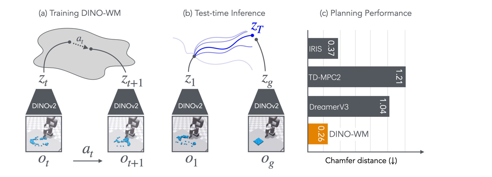
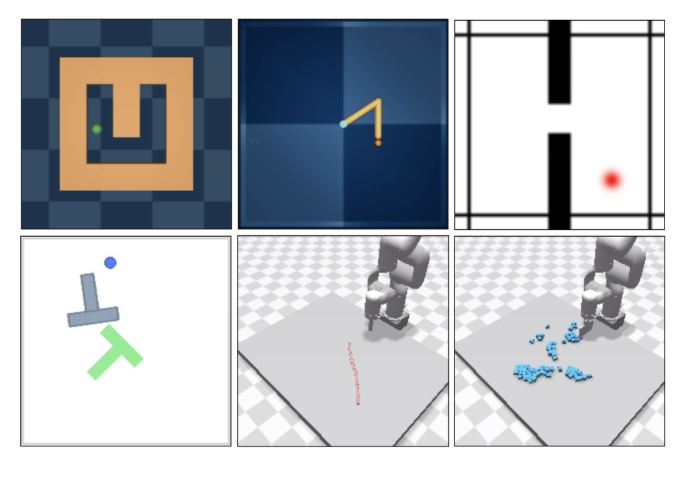
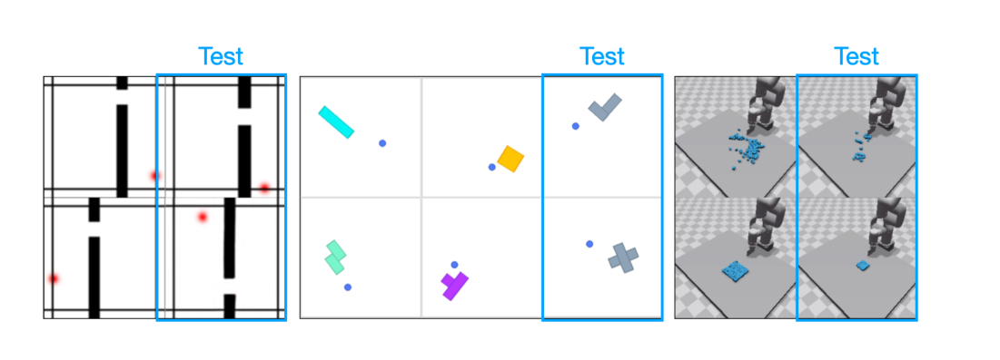
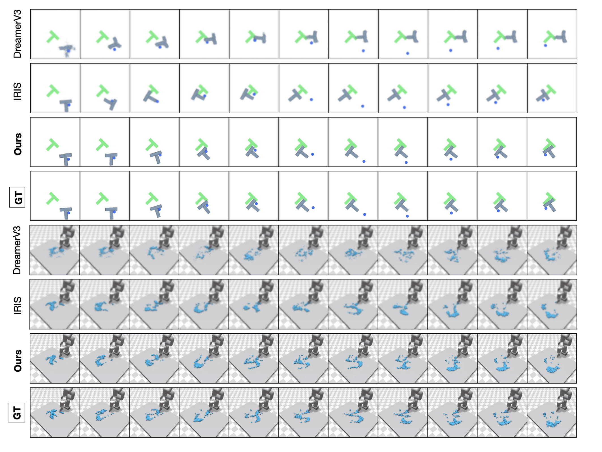
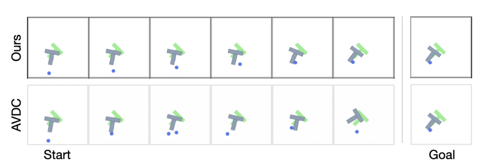
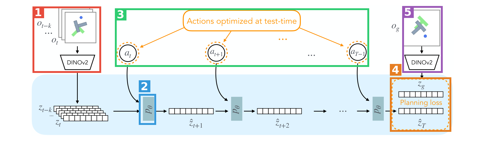

# DINO-WM: World Models on Pre-trained Visual Features enable Zero-shot Planning

| 项 | 内容 |
|---|---|
| 题目 | DINO-WM: World Models on Pre-trained Visual Features enable Zero-shot Planning |
| 作者 | Gaoyue Zhou, Hengkai Pan, Yann LeCun, Lerrel Pinto（NYU Courant + Meta AI） |
| arXiv | [2411.04983](https://arxiv.org/abs/2411.04983)（v2, 2025-02-01；ICML 2025 接收） |
| 发布日期 | 2024-11-07（arXiv v1） |
| 代码 | [github.com/gaoyuezhou/dino_wm](https://github.com/gaoyuezhou/dino_wm) |
| 项目主页 | [dino-wm.github.io](https://dino-wm.github.io) |
| 一句话 | 冻结 DINOv2 patch 特征当观测编码器，只训一个隐空间 ViT 动力学模型，测试时用 CEM/MPC 对目标图像做零样本规划 |

**结构速览**（21 页）：

- §1 Introduction：离线世界模型的核心问题——求解任务时需要什么辅助信息；答案：预训练视觉表征
- §2 Related Work：model-based 学习 / 生成式视频世界模型 / 预训练视觉表征三条线
- §3 方法：观测模型（冻结 DINOv2）+ 转移模型（帧级因果 ViT）+ 可选解码器；规划 = MPC + CEM 最小化隐空间 MSE
- §4 实验：六环境主对比（4.3）、编码器消融（4.4）、新配置泛化（4.5）、与生成视频模型定性对比（4.6）、隐空间解码质量 LPIPS/SSIM（4.7）
- §5 结论与局限
- 附录：A.1 环境与数据生成｜A.2 泛化测试环境族｜A.3 预训练编码器说明｜A.4 消融（数据规模/因果 mask/解码器 loss）｜A.5 CEM/GD/MPC 细节与规划器对比｜A.6 动作条件 AVDC 对比｜A.7 LPIPS+SSIM 全表｜A.8 推理耗时｜A.9 超参与依赖仓库｜A.10 规划可视化

---

## 第1章 · 作者与实验室背景评估

### 作者背景表

| 人物 | 角色 | 单位 | 主方向 | 主页 |
|---|---|---|---|---|
| Gaoyue Zhou | 一作 | NYU Courant 博士生（导师 Pinto + LeCun） | 机器人离线学习、世界模型 | [个人主页](https://gaoyuezhou.github.io/) ·[Google Scholar](https://scholar.google.com/citations?user=-1iyBukAAAAJ) |
| Hengkai Pan | 二作 | 当时 NYU（Pinto 组），后赴 CMU RI 读硕（Deepak Pathak 组） | 机器人学习 | [个人主页](https://hengkaipan.github.io/) · [Google Scholar](https://scholar.google.com/citations?user=76ut8YkAAAAJ) |
| Yann LeCun | 通讯层导师 | NYU + Meta AI（时任首席 AI 科学家） | 自监督学习、JEPA 世界模型议程 | [个人主页](http://yann.lecun.com) |
| Lerrel Pinto | 通讯层导师 | NYU，GRAIL 实验室（General-purpose Robotics and AI Lab） | 机器人学习、表征学习、廉价开源机器人 | [个人主页/实验室](https://www.lerrelpinto.com/) · [Google Scholar](https://scholar.google.com/citations?user=pmVPj94AAAAJ) |

### 实验室主方向判定：**传统强方向的自然延伸（表征/动力学线），世界模型细分是新开但高度相关**

事实（发表记录）：Pinto 组近 5 年在"表征 + 动力学"这条线上有持续投入——Learning Predictive Representations for Deformable Objects（CoRL 2020/2021，即本文引用并沿用任务谱系的 Yan et al. 2021）、DynaMo: In-Domain Dynamics Pretraining（NeurIPS 2024）、BAKU（NeurIPS 2024）、Behavior Transformers（NeurIPS 2022）、ToTO 真机 benchmark（ICRA 2023）。LeCun 一侧则是 JEPA 世界模型议程的持续输出（I-JEPA 2023、V-JEPA 2024，均被本文引用）。"用世界模型做零样本规划"这个具体命题在 Pinto 组是 DINO-WM 首次成体系发表，但正落在两位导师议程的交汇点上。

### 一作画像

事实：Gaoyue Zhou 此前经历为 UC Berkeley 本科 → CMU RI 硕士（Abhinav Gupta 组）→ NYU 博士；发表记录包括 Parrot（ICLR 2021）、ToTO 真机 offline RL benchmark（ICRA 2023）、Real World Offline RL（ICRA 2023）。DINO-WM 是其**首篇世界模型方向一作论文**，同期还有 Navigation World Models（CVPR 2025，与 LeCun 合作）。

### 水毕业风险信号核对

| 信号 | 核对结果 |
|---|---|
| 一作无相关积累 | ✗ 不成立：有 offline RL / 真机 benchmark 积累，与本文"离线数据训世界模型"直接相关 |
| 导师主业不在此方向 | ✗ 不成立：Pinto 主业机器人学习，LeCun 主业就是世界模型（JEPA） |
| 实验室该方向无持续投入 | ✗ 不成立：DynaMo、NWM 等后续/同期工作说明是议程性投入 |
| 单位在该领域无积累 | ✗ 不成立：NYU CILVR/GRAIL 在机器人学习领域有长期积累 |

**水平预判（推断，依据上表）**：非水毕业作品，是实验室议程核心产出；ICML 2025 接收、代码/模型开源、后续引用与跟进工作多。质量风险不在"做没做真"，而在实证严谨度（无统计、纯仿真），见第3章盲审。

⚠️ 本章内容未进入第3章盲审上下文。

---

## 第2章 · 论文类型判定

**结论：a+b 型组合创新 + 一处架构级微创新。** 组合 =（a）冻结的预训练视觉编码器 DINOv2 +（b）隐空间 ViT 动力学模型 +（c，经典组件）MPC/CEM 规划；微创新 = 转移模型的**帧级因果注意力**（相对 IRIS 的 token 级自回归，§3.1.2 明确对比并在 A.4.2 消融）。解码器与预测器完全解耦训练也是一个设计层面的贡献点（A.4.3 消融支撑）。

组件清单（均为论文参考文献中真实存在的引用）：

| 组件 | 原论文 | 在本文中的角色 |
|---|---|---|
| DINOv2 | [Oquab et al., 2024](https://arxiv.org/abs/2304.07193) | 观测模型：冻结的 patch 特征编码器（§3.1.1） |
| ViT | [Dosovitskiy et al., 2021](https://arxiv.org/abs/2010.11929) | 转移模型骨架：去掉 tokenization 层的 decoder-only 结构（§3.1.2） |
| VQ-VAE-2 式解码器 | [Razavi et al., 2019](https://arxiv.org/abs/1906.00446) | 可选解码器：转置卷积栈，仅用于可视化（§3.1.3，"similar as in"） |
| MPC / CEM | [Williams et al., 2017](https://ieeexplore.ieee.org/document/7989202) 等经典控制文献 | 测试时行为优化：隐空间 MSE 代价 + 交叉熵方法（§3.2、A.5.1） |
| Push-T 环境 | [Chi et al., 2024 (Diffusion Policy)](https://arxiv.org/abs/2303.04137) | 实验环境 + 其专家轨迹加噪 replay 作训练数据（A.1 d） |
| Rope/Granular 仿真 | [Zhang et al., 2024 (AdaptiGraph)](https://arxiv.org/abs/2407.07889) | 可变形/颗粒操作环境（Nvidia Flex）（A.1 e/f） |
| PointMaze | [Fu et al., 2021 (D4RL)](https://arxiv.org/abs/2004.07219) | 导航环境（A.1 a） |
| Reacher | [Tassa et al., 2018 (DMC)](https://arxiv.org/abs/1801.00690) | 机械臂控制环境（A.1 c） |

疑似借鉴（论文未引用）：无——方法链各环节均有明确引用。

---

## 第3章 · 双盲评审 + Rebuttal（全流程记录）

### 3.1 初审意见（由隔离上下文的盲审 agent 独立生成）

> **Summary**：本文提出 DINO-WM，在冻结的 DINOv2 patch 特征空间中学习视觉动力学：ViT 转移模型做帧级自回归预测，解码器仅用于可视化、与预测器解耦。任务求解构造为视觉目标到达：MPC + CEM 在隐空间最小化预测状态与目标状态的 MSE，无需奖励、示教或逆模型。六个仿真环境上与 IRIS、DreamerV3、TD-MPC2、AVDC 对比。
>
> **Strengths**：问题定位清晰（离线世界模型需要何种辅助信息 → 用预训练表征替代）；方法简洁且解耦设计有消融依据（A.4.3）；帧级因果注意力 vs token 级有 A.4.2 的强对照（h=3 时 0.92 vs 0.08）；编码器消融（Table 2）直接支撑核心论点；分布外配置泛化测试（§4.5）超出多数世界模型论文；可复现性基础较好（开源声明 + A.9 超参）。
>
> **Weaknesses**（编号后为核心内容摘录）：
> - **W1 统计报告整体缺失**：全部表格为裸点估计，无 seed 数/方差/CI/检验；Rope/Granular 仅 n=10，而摘要 "45% on average" 的主要来源恰是这两个环境。
> - **W2 纯仿真验证**：六环境全部仿真（"XArm" 实为 Nvidia Flex 仿真）；冻结 DINOv2 面对真实相机噪声/光照/遮挡的有效性是方法最大风险点，恰被仿真图像系统性回避；该局限未列入 Limitations。
> - **W3 基线公平性存疑**：TD-MPC2 被移出设计工况（无奖励）运行得 0.00，不应支撑"超越 SOTA"；DreamerV3/IRIS 的 goal-reaching 适配细节未交代；patch token（14×14×384）vs 单一全局向量的**容量混淆**未消融——缺"ResNet 池化前空间特征图"对照。
> - **W4 "without expert demonstrations" 与数据构造矛盾**：PushT 的 18500 条训练数据由专家轨迹加噪 replay 生成（A.1 d），且目标经"25 步内可行"筛选；全部关键消融只在 PushT 上做。
> - **W5 成功判据与指标定义缺失**：全文无成功阈值定义、无 Chamfer Distance 计算对象与单位，Table 1 数字不可独立复核。
> - **W6 聚合数字来历不明**："45% on average"、"56%（LPIPS）"无计算式；消融只在 PushT 上做却按方法级一般结论表述。
> - **W7 最近邻竞争工作未对比**：Yan et al. 2021（隐空间可变形物体预测表征）正是 Rope/Granular 上最直接的竞争方法，被引而未对比。
>
> **Minor**：§4.5 "From Table 5" 应为 Table 3；图像尺寸 224 vs 196 不一致；A.5.2 拼写错误；Table 8 多处 NA 未说明。
>
> **评级：reject**（旗舰刊水位）——核心新颖性是既有组件组合，实证发现对 model-based 机器人学习 subfield 有明确价值但结论半径未超出该 subfield，且全部证据来自低复杂度仿真、缺物理验证；证据层面零统计报告、基线工况外运行、表述与数据构造的张力使"显著超越 SOTA"仅部分被支持。补齐后投主流 ML/机器人会议是恰当归宿。

### 3.2 Rebuttal（作者方，诚实优先）

完整回应见上方流程记录，要点：为 W3 中 TD-MPC2 行的**论证功能**辩护（它承担"依赖奖励塑形 latent 的世界模型在无奖励离线设定下不可用"这一设定层面主张，且 §4.3 透明披露并解释；真正的同协议公平对比由 Table 2 承担）；为 W4 中摘要的 **"at test time" 限定语**辩护（对照对象是求解时需示教/逆模型/密集奖励的方法，与 §3.2 规划流程内部自洽）。

**承认的批评（= 本文真正硬伤一览）**：

1. **W1 全部**：无 seed/方差/CI/检验，Rope/Granular 仅 n=10 且恰为核心优势声明所在。
2. **W2 主体**：纯仿真、无物理验证，且该局限未列入 Limitations；冻结特征在真实感知条件下的有效性论文内部无证据。
3. **W3 (a)(b)(c)**："outperforming SOTA" 措辞被工况外失效行部分支撑；DreamerV3/IRIS 适配细节缺失；patch vs 全局向量的容量混淆未解开，"patch 表征关键"应弱化为"预训练+空间结构关键（容量未排除）"。
4. **W4 (a)(b)(c)**：PushT 训练分布受益于专家轨迹且与其余五环境不对称；全部关键消融压在这唯一环境上；目标经可行性筛选。
5. **W5 全部**：成功判据与 CD 定义缺失。
6. **W6 全部**：聚合数字无计算式；单环境消融被一般化表述。
7. **W7**：Yan et al. 2021 同域未对比且无不可比理由。
8. 全部 minor。

### 3.3 审稿人二轮回复 + 最终评级

> **W1 维持（双方确认）**；**W2 维持主体**，撤回"伪装真机实验"的语气（正文确实把结果锚定在具体仿真 benchmark 上），但证据形态缺口不变；**W3 部分撤回**——TD-MPC2 行作为设定层面主张且已透明披露，不构成学术不当，撤回"不应报告该行"的隐含要求；但其参与竞速叙事、适配细节缺失、容量混淆三点维持；**W4 定性降级**——"矛盾"降为"易被误读、需加限定的表述"（"at test time" 限定语辩护成立），但专家数据不对称、消融集中、目标筛选三点维持；**W5/W6/W7/minor 全部维持（双方确认）**。
>
> **最终评级：reject（维持）。** 理由：rebuttal 质量很高，两处重议均基于论文内部文本并获部分撤回，但只涉及措辞定性，不改变两条主线：贡献量级是组件组合 + subfield 级实证发现，证据全部来自低复杂度仿真；且经 rebuttal 后作者确认了统计缺失、判据缺失、聚合数字无出处、最近邻基线缺席、机制结论需弱化——主要结论仍只是部分被支持。多数缺陷可一轮大修修复，但修复后贡献量级仍难越过本刊水位；补齐统计与判据后投主流 ML/机器人会议是恰当归宿。

*（注：本刊水位为 Science Robotics / Science 家族盲审标准；本文实际发表于 ICML 2025，与审稿人"主流 ML 会议是恰当归宿"的判断一致。）*

---

## 第4章 · 大白话：这篇文章在做什么

**场景**：给机器人看一张"目标长这样"的照片，让它自己想出一串动作，把眼前的世界摆成照片里的样子——不给示范、不给奖励分数、不提前告诉它任务是什么。

**之前的方法**：世界模型要么在线边玩边学（换个任务就得重训），要么离线训练但真要解任务时还得靠"外挂"——专家示范、关键点标注、预训练逆模型或密集奖励，通用性大打折扣。

**本论文的方法**：眼睛直接用现成的 DINOv2（完全冻结不训练），只训练一个在特征空间里"给定动作预测下一帧特征"的小模型；测试时把目标照片也编码成特征当靶子，在特征空间里直接搜动作序列，六个环境零样本搞定，推 T 块、摆绳子、聚沙堆都行。

**图内文字中文翻译**（按阅读顺序）：
- **(a) 训练 DINO-WM**：每帧图像 $o_t$ 经 **DINOv2** 编码成特征 $z_t$；模型学的是灰色云朵里那一步——特征空间中"$z_t$ 在动作 $a_t$ 作用下变成 $z_{t+1}$"的转移规律。
- **(b) 测试时推理**：当前观测 $o_1$ 和目标图像 $o_g$ 都编码成特征（$z_1$、$z_g$）；从 $z_1$ 出发向外探出多条候选轨迹（蓝色曲线），优化动作序列使终点 $z_T$ 尽量贴近目标 $z_g$，深蓝那条是选中的最优。
- **(c) 规划性能**（Granular 任务，Chamfer 距离，越低越好）：IRIS 0.37、TD-MPC2 1.21、DreamerV3 1.04，**DINO-WM 0.26**（橙色）最优。

---

## 第5章 · 实验

### 5.1 仿真实验

*六个环境（左上→右下）：Maze、Reach、Wall、Push-T、Rope、Granular（图源论文 Figure 3）*

所有环境的任务统一为：从任意初态出发，到达一张目标图像指定的状态；观测为 224×224 RGB（§4.1）。评测：Maze/Wall/Reach/PushT 各 50 组初/目标态测成功率 SR，Rope/Granular 因仿真步进太慢只测 10 组 Chamfer 距离 CD（§4.3）。**注意：成功率阈值与 CD 的计算对象论文均未定义（盲审 W5）。**

各环境一句大白话 + 训练数据（A.1、Table 11）：

| 环境 | 大白话 | 训练数据（全随机除注明外） |
|---|---|---|
| Maze（D4RL PointMaze） | 一个受力驱动的小球在迷宫里滚到目标位置 | 2000 条 × 100 步 |
| Wall | 两个房间隔一堵带门的墙，agent 从一侧穿门到另一侧 | 1920 条 × 50 步 |
| Reach（DMC Reacher 加难版） | 二关节机械臂**整条臂**（不只末端）摆到目标姿态 | 3000 条 × 100 步 |
| PushT | 把 T 型积木和推杆都推到目标位形（绿 T 只是视觉参照物） | 18500 条，**由官方专家轨迹加噪 replay 生成** |
| Rope | XArm（Flex 仿真）把桌上软绳摆成目标形状 | 1000 条 × 20 步 |
| Granular | 同一仿真里把上百颗粒子聚成指定位置/大小的方块 | 1000 条 × 20 步 |

**主对比表（Table 1，各列最优加粗）**：

| 模型 | Maze SR↑ | Wall SR↑ | Reach SR↑ | PushT SR↑ | Rope CD↓ | Granular CD↓ |
|---|---|---|---|---|---|---|
| IRIS | 0.74 | 0.04 | 0.18 | 0.32 | 1.11 | 0.37 |
| DreamerV3 | **1.00** | **1.00** | 0.64 | 0.30 | 2.49 | 1.05 |
| TD-MPC2 | 0.00 | 0.00 | 0.00 | 0.00 | 2.52 | 1.21 |
| DINO-WM | 0.98 | 0.96 | **0.92** | **0.90** | **0.41** | **0.26** |

读法：简单导航上与 DreamerV3 打平；差距全部拉开在**需要精确接触/物体动力学**的操作环境（PushT 0.90 vs 0.32、Rope 0.41 vs 1.11）。TD-MPC2 全零是因为它的 latent 依赖奖励信号塑形，此设定下无奖励可用（§4.3；盲审确认这行只能当"设定层面主张"，不能当竞速证据）。

**编码器对比（Table 2，同一转移模型/规划器只换编码器）**：

| 编码器 | Maze | Wall | Reach | PushT | Rope CD↓ | Granular CD↓ |
|---|---|---|---|---|---|---|
| R3M | 0.94 | 0.34 | 0.40 | 0.42 | 1.13 | 0.95 |
| ImageNet ResNet-18 | **0.98** | 0.12 | 0.06 | 0.20 | 1.08 | 0.90 |
| DINO CLS（全局向量） | 0.96 | 0.58 | 0.60 | 0.44 | 0.84 | 0.79 |
| DINO Patch（本文） | **0.98** | **0.96** | **0.92** | **0.90** | **0.41** | **0.26** |

读法：这是全文最硬的一张表——凡是把图像压成单一全局向量的编码器（R3M/ResNet/CLS），环境一复杂就崩；保留 14×14 空间 patch 的 DINOv2 全线最优。但注意盲审 W3(c)：patch 表征同时也意味着大得多的 latent 容量，"patch 结构关键"与"容量关键"未被消融区分。

**新配置泛化（Table 3）**：WallRandom（墙/门位置全新）0.82 vs DreamerV3 0.76 / IRIS 0.06；PushObj（4 个训练形状 → 2 个新形状）0.34，所有方法都难；GranularRandom（粒子数减半，分布外画面）CD 0.63，最优。

*WallRandom / PushObj / GranularRandom 的训练 vs 测试（蓝框）设置（论文 Figure 5）*

**预测质量（Table 4，LPIPS↓）**：PushT 0.007（次优 0.039）、Wall 0.0016、Rope 0.009、Granular 0.035（次优 0.080）。开环 rollout 与真值几乎不可分辨：

*PushT 与 Granular 上各模型开环 rollout vs 真值 GT（论文 Figure 4）：DreamerV3/IRIS 预测糊掉或物体漂移，DINO-WM 行与 GT 行肉眼难分*

**与生成式视频模型对比（§4.6）**：扩散视频模型 AVDC 画面逼真但物理不合理（单步内物体瞬移），动作条件版 AVDC 长程预测发散（A.6）：

### 5.2 真机实验

**本文无真机实验。** 六个环境全部为仿真，Rope/Granular 里的 "XArm" 是 Nvidia Flex 仿真臂（A.1 e/f）。项目主页 [dino-wm.github.io](https://dino-wm.github.io)（论文 §1 脚注给出）有规划视频，但均为仿真。这是盲审 W2 的核心批评：冻结 DINOv2 在真实相机噪声/光照/遮挡下能否支撑精确隐空间规划，本文未回答。

### 5.3 为什么选这些实验

**共同特性**：全部是 2D/桌面俯拍或固定视角、目标可由单张图完全指定、成败取决于**精确的空间/接触推理**——PushT 要推杆-积木接触点对，Rope/Granular 要多粒子空间分布。没有长程任务链、没有视角变化、没有真实感知噪声。

**方法哪个设计吃这个特性**：DINOv2 的 14×14 patch 网格天然保留"什么东西在哪个格子"的空间布局。数字支撑：Wall 上全局向量编码器 0.12–0.58 vs patch 0.96；PushT 上 0.20–0.44 vs 0.90（Table 2）——差距恰好在空间精度要求高的环境爆发。GranularRandom 的解释也同源：粒子数减半后整图分布外，但**每个 patch 内**的粒子密度仍在分布内，所以 CD 0.63 仍最优（§4.5）。反过来说，这些环境也恰好避开了冻结特征的弱点（真实感知扰动、语义级任务理解）。

**该测但没测的**（缺席即信号）：主流操作 benchmark 如 Meta-World、RLBench、LIBERO、Franka Kitchen 全部缺席——这些环境 3D 视角 + 多任务 + 长程，正是冻结 patch 特征 + 单步 MSE 代价可能吃力的地方；最直接的竞争方法 Yan et al. 2021（同为隐空间可变形物体预测表征）在 Rope/Granular 上未对比（盲审 W7）；真机为零。

### 5.4 复现可能性（硬核查）

| 项 | 状态 | 证据来源 |
|---|---|---|
| 代码仓库 | ✅ 实质代码：`train.py`/`plan.py`/`models/`/`planning/`/`datasets/`/`conf/`，训练与规划命令、conda 环境、Mujoco/PyFlex 安装说明齐全 | [GitHub repo](https://github.com/gaoyuezhou/dino_wm) 实际打开核查（2026-08-15） |
| ckpt | ⚠️ 逐场景：PointMaze / PushT / Wall 三个环境的 ckpt 经 OSF 提供；**Reacher、Rope、Granular 未提供** | repo README |
| 数据 | ⚠️ 提供下载：`point_maze`、`pusht_noise`、`wall_single`、`deformable`（rope+granular）；**Reacher 数据未见**；数据生成脚本未见 | repo README 数据目录列表 |
| 学习率 | ✅ decoder 3e-4 / predictor 5e-5 / action encoder 5e-4，AdamW | Table 12（A.9） |
| batch size / epochs | ✅ 32 / 100 | Table 12 |
| 架构超参 | ✅ ViT depth 6、16 heads、MLP 2048、~19M 参数；DINOv2 出 (14×14, 384) 特征 | A.9 |
| 逐环境超参 | ✅ H、frameskip、数据量、轨迹长度 | Table 11 |
| CEM 超参 | ⚠️ 100 samples × 10 iterations 有（A.8）；elite 数 K、初始分布方差、规划 horizon T **未给出** | A.5.1 只有流程无数值 |
| 数据切分 | ❌ train/val 切分方式未说明 | 全文未见 |
| 训练硬件/时长 | ❌ 仅 A.8 提到推理用 A6000；训练硬件与时长未给出 | 全文未见 |
| 成功判据 | ❌ SR 阈值、CD 定义均未给出（盲审 W5） | 全文未见 |
| 随机种子 | ❌ seed 数未说明，疑似单次训练 | 全文未见 |

**结论：`需自行补齐细节`。** 主链路（代码+三环境数据 ckpt+核心超参）可跑通；缺失项：① 成功判据/CD 定义（复现评测数字必卡）；② CEM 完整超参；③ Reacher/Rope/Granular ckpt；④ 数据切分；⑤ 训练硬件与时长；⑥ seed。

---

## 第6章 · 方法拆解

*论文 Figure 2 标注版：1🟥 观测编码 → 2🟦 转移模型 → 3🟩 测试时优化的动作 → 4🟧 Planning loss → 5🟪 目标编码*

- 🟥 **1 · 观测编码器（冻结 DINOv2）**——来源：[DINOv2](https://arxiv.org/abs/2304.07193)，非本文训练。接口：进 = 过去 H 帧 RGB 图像 $o_{t-k..t}$（统一缩放后取 patch）；出 = 每帧一个 14×14=196 个 patch × 384 维的特征网格 $z$（A.9）。训练时：**完全冻结**，训练测试全程不更新（§3.1.1）；若有本体感知（proprioception）则经拼接并入 latent。部署时：同样冻结，每帧过一遍。

- 🟦 **2 · 转移模型 $p_\theta$（帧级因果 ViT）**——来源：[ViT](https://arxiv.org/abs/2010.11929) 骨架 + 本文改造（去 tokenization 层变 decoder-only；帧级因果注意力，区别于 [IRIS](https://arxiv.org/abs/2209.00588) 的 token 级）。接口：进 = 过去 H 帧 latent $z_{t-H:t-1}$ + 对应动作（每个动作先经 MLP 升到 10 维，再拼接到**每个** patch 向量上）；出 = 下一帧全部 196 个 patch 的预测 latent $\hat z_t$。训练时：teacher forcing，轨迹切成 H+1 段，隐空间一致性损失 $L_{pred}=\|p_\theta(\text{enc}(o), \phi(a)) - \text{enc}(o_{t+1})\|^2$（式 1）——**全程不重建像素**。规模 ~19M 参数（depth 6、16 heads、MLP 2048）。部署时：自回归滚动，一次前向 0.014 s vs 仿真器单步 3 s（Table 10）。

- 🟩 **3 · 测试时动作序列（CEM 优化变量）**——来源：交叉熵方法，经典控制组件（A.5.1）。接口：进 = 初始高斯分布采样的 N 个候选动作序列 $a_{t:T-1}$；出 = 喂给 🟦 逐个 rollout 后按代价排序，取 top-K 精英更新分布均值方差，迭代 10 轮（100 样本/轮，A.8）。训练时：**不存在**——动作只在测试时被优化，这就是"零样本"的含义。部署时：MPC 滚动执行——优化完执行前 k 步，重新观测再优化（A.5.1 g）。梯度下降版可行但更差（Table 8：GD 0.22–0.28 vs MPC 0.90–0.98）。

- 🟧 **4 · Planning loss（隐空间 MSE）**——来源：本文设定（§3.2）。接口：进 = 🟦 滚出的终态预测 $\hat z_T$ 与 🟪 给出的目标 latent $z_g$；出 = 代价 $C=\|\hat z_T - z_g\|^2$，回馈给 🟩 作为排序依据。无任何奖励模型、无任务标签——目标图像本身就是任务定义。

- 🟪 **5 · 目标编码分支**——与 🟥 是**同一个**冻结 DINOv2。接口：进 = 目标图像 $o_g$（单张 RGB）；出 = 目标 latent $z_g$，供 🟧 使用。

- **（图外）可选解码器**——来源：[VQ-VAE-2](https://arxiv.org/abs/1906.00446) 式转置卷积栈（§3.1.3）。接口：进 = 任意 latent $z_t$；出 = 重建图像。训练时：独立的重建损失 $L_{rec}$，**梯度不回传给预测器**（回传会掉 12 个点，Table 7）；部署时：不参与规划，只用于画 Figure 4 那类可视化。

**接口自查（串成完整流程）**：🟥 把历史观测变成 latent → 🟦 吃 latent + 🟩 的候选动作，滚出未来 latent → 🟧 拿终态与 🟪 的目标 latent 算 MSE → 代价送回 🟩 更新动作分布 → 循环 10 轮后执行最优动作前 k 步 → 新观测回到 🟥。闭环成立，全程无像素重建、无奖励。

---

## 第7章 · 消融

本文消融共三组（A.4，全部只在 PushT 上做——这本身是盲审 W6 的批评点）+ 一组规划器对比（A.5.3）。无消融配图，均为表格。

**① 数据规模（Table 5）**：

| 训练数据量 | SR↑ | SSIM↑ | LPIPS↓ | takeaway |
|---|---|---|---|---|
| 200 条 | 0.08 | 0.949 | 0.056 | 200 条基本不可用 |
| 1000 条 | 0.48 | 0.973 | 0.013 | 5 倍数据 +40 个点 |
| 5000 条 | 0.72 | 0.981 | 0.007 | 继续正向 |
| 10000 条 | 0.88 | 0.984 | 0.006 | 接近饱和 |
| 18500 条 | 0.92 | 0.987 | 0.005 | 收益递减但仍在涨 |

Takeaway：成功率对数据量单调正相关且前期极陡（200→1000 条 +40 个点），说明该方法的"零样本"建立在离线数据覆盖充分的前提上——这正是结论里承认的第一条局限。

**② 帧级因果注意力 mask（Table 6，历史长度 h 变化）**：

| 设置 | h=1 | h=2 | h=3 | takeaway |
|---|---|---|---|---|
| 不加因果 mask | 0.76 | 0.36 | 0.08 | 历史越长越崩：训练时能偷看未来帧，测试时没有未来可看 |
| 加因果 mask（本文） | 0.76 | 0.88 | 0.92 | 历史变成正收益（速度/动量信息），h=3 比 h=1 +16 个点 |

Takeaway：这是全文最有说服力的消融——同一架构只差一个 mask，h=3 时 0.92 vs 0.08，84 个点的差距，"帧级因果预测"这个微创新的必要性被钉死。

**③ 解码器重建 loss 是否回传预测器（Table 7）**：

| 设置 | SR↑ | takeaway |
|---|---|---|
| 不回传（本文，解耦） | 0.92 | 特征学习与像素重建解耦 |
| 回传重建 loss | 0.80 | 逼预测器管像素反而伤规划 12 个点 |

Takeaway：支撑"世界模型不需要重建世界"的标题级主张——重建目标会把容量花在与任务无关的像素细节上。

**④ 规划器对比（Table 8，A.5.3，开环 vs 闭环）**：

| 优化器 | PointMaze | Push-T | Wall | takeaway |
|---|---|---|---|---|
| CEM（开环执行） | 0.80 | 0.86 | 0.74 | 不重规划已能用 |
| 梯度下降 GD | 0.22 | 0.28 | NA | 可微分不等于好优化，GD 崩 |
| MPC（CEM+滚动重规划） | 0.98 | 0.90 | 0.96 | 闭环重规划再+8~22 个点 |

Takeaway：模型质量是主体，但闭环 MPC 的纠错贡献不可忽略；GD 的失败说明隐空间代价面并不平滑，采样式优化器更稳。（Rope/Granular 的 CEM/GD 为 NA，原因未说明——盲审 minor。）

**缺陷呼应**：消融覆盖了三个关键设计轴（数据、因果 mask、解耦），质量不低；但全部压在 PushT 单环境上，而 PushT 恰是唯一用专家衍生数据的环境（盲审 W4/W6），结论的方法级普适性打折。
