# DreamZero: World Action Models are Zero-shot Policies

## 元信息

| 项目 | 内容 |
|---|---|
| 题目 | World Action Models are Zero-shot Policies（模型名 DreamZero） |
| 作者 | Seonghyeon Ye†, Yunhao Ge*, Kaiyuan Zheng*, Shenyuan Gao*, Sihyun Yu*, George Kurian*, Suneel Indupuru*, You Liang Tan* 等 37 人（† 项目负责，* 核心贡献者），末位负责人 Yuke Zhu†, Linxi "Jim" Fan†, Joel Jang† |
| 机构 | NVIDIA（GEAR 团队） |
| arXiv | [2602.15922](https://arxiv.org/abs/2602.15922)（2026-02-17，v1，cs.RO） |
| 发布日期 | 2026-02-17（arXiv v1） |
| 项目主页 | https://dreamzero0.github.io |
| 代码 | https://github.com/dreamzero0/dreamzero（权重 + 推理 + 微调脚本，见 5.4 节核查） |
| 骨干 | Wan2.1-I2V-14B-480P 图生视频扩散模型 |

**结构速览**（36 页）：

- §1 Introduction：VLA 语义泛化强但物理动作泛化弱 → 提出 14B World Action Model（WAM）联合预测视频+动作，四条贡献（多样数据学习 / 2× 零样本泛化 / 38× 加速 7Hz / 跨具身迁移）
- §2 Related Work：VLA 谱系；视频模型做机器人策略的谱系；给 "WAM" 下定义（用世界建模能力辅助动作预测的模型家族）
- §3 方法：3.1 联合视频-动作 flow matching（分解 = 自回归视频预测 × 逆动力学 IDM，式 1-3），chunk 级 teacher forcing 自回归架构；3.2 实时化——异步执行 + CFG 双卡并行 + DiT 缓存 + 编译量化 + DreamZero-Flash 解耦噪声调度，累计 38×（Table 1）
- §4 实验设置：AgiBot G1 自采 500 小时多样数据（22 个环境）+ DROID-Franka；基线 GR00T N1.6 / π0.5 各 scratch 与 pretrained 两档；默认"未见环境+未见物体"评测；post-training 三任务
- §5 结果：Q1 多样数据学习（seen 62.2% vs 27.4%）、Q2 未见任务（39.5% vs 16.3%）、Q3 post-training（90.5%）、Q4 纯视频跨具身迁移（+42% 相对）、Q5 30 分钟适配新机器人、Q6 Flash 单步 74%；5.2 消融（数据多样性/规模/AR vs BD，Table 4）
- §6 Discussion：scaling law 未探明、人类视频、更快推理、长程记忆、高精度任务局限、具身设计假说
- 附录：A 与 latent/3D 世界模型对比；B 双向 vs 自回归的 FPS 错配问题；C 注意力掩码与超参（K=2, M=4, H=48）；D 实时化细节；E 数据采集协议（任务弃用机制）；F/G 全部评测任务清单；H 失败案例（视频错→动作错）

---

## 第1章 · 作者与实验室背景评估

### 作者背景表

| 角色 | 人物 | 单位 | 主页 | 主方向与代表作 |
|---|---|---|---|---|
| 一作 & 项目负责 | Seonghyeon Ye | KAIST AI 博士生（导师 Minjoon Seo、Kimin Lee）；NVIDIA GEAR 研究实习生 | [个人主页](https://seonghyeonye.github.io/)、[Google Scholar](https://scholar.google.com.sg/citations?hl=en&user=JfGGjBoAAAAJ) | 机器人世界-动作模型：LAPA（ICLR 2025）、DreamGen、GR00T N1 系列参与者；博士早期做 LLM 指令微调与评测（FLASK、BigGen Bench） |
| 项目负责（通讯性质） | Joel Jang | NVIDIA GEAR 高级研究科学家，GR00T 世界模型团队负责人；UW 博士（2023–2025，导师 Luke Zettlemoyer & Dieter Fox） | [个人主页](https://joeljang.github.io/) | LAPA、DreamGen、DreamDojo、DreamZero——GEAR 世界模型线的直接负责人 |
| 项目负责 | Yuke Zhu | UT Austin 副教授（RPL 实验室主任）兼 NVIDIA Research 杰出科学家、GEAR 联合负责人 | [个人主页](https://yukezhu.me/)、[RPL 实验室](https://rpl.cs.utexas.edu/) | 通用机器人自主：GR00T 系列、机器人感知与决策 |
| 项目负责 | Linxi "Jim" Fan | NVIDIA AI 总监 / 杰出科学家，GEAR 联合创始人；Stanford 博士（导师 Fei-Fei Li） | [个人主页](https://jimfan.me/) | 具身智能体基础模型：MineDojo（NeurIPS 2022 杰出论文）、Voyager、Eureka、VIMA、GR00T |

### 实验室主方向判定：传统强方向

NVIDIA GEAR（Generalist Embodied Agent Research）由 Jim Fan 与 Yuke Zhu 联合创立，旗舰项目 Project GR00T 就是人形/通用机器人基础模型。"视频世界模型 → 机器人策略"这条线是该组近三年的持续主线，证据链：

- GR00T N1（[arXiv 2503.14734](https://arxiv.org/abs/2503.14734)，2025.03）→ GR00T N1.5 → N1.6：VLA 基础模型持续迭代
- LAPA：Latent Action Pretraining from Videos（ICLR 2025，一作正是 Seonghyeon Ye）
- DreamGen（CoRL 2025，[arXiv 2505.12705](https://arxiv.org/abs/2505.12705)）：视频世界模型合成机器人数据，Joel Jang / Seonghyeon Ye 主导
- FLARE：隐式世界建模的机器人学习（[arXiv 2505.15659](https://arxiv.org/abs/2505.15659)）

DreamZero 是这条"DreamGen（世界模型造数据）→ DreamZero（世界模型直接当策略）"演进线的自然下一步。

### 一作画像

Seonghyeon Ye 不是首次做该方向：LAPA → DreamGen → GR00T 系列已有连续两年以上的世界模型×机器人积累（此前博士早期的 LLM 评测工作与本文无关，属转向后的第二阶段）。本文是其在 GEAR 实习期间的旗舰产出。

### 水毕业风险核对与水平预判

**事实**（发表记录）：一作有直接相关积累（LAPA/DreamGen）；负责人 Joel Jang 的主业就是世界模型团队；实验室在该方向连续产出 ≥3 年；NVIDIA 在视频生成（Cosmos、Wan 合作生态）与机器人（GR00T）两端均有重投入。

**推断**（依据上述事实）：四项水毕业风险信号全部为否。这是工业旗舰实验室的团队型大项目（37 位作者、真机集群、GB200 部署），不是学位驱动的单点工作。预判可信度上限高，但注意：工业大团队论文的典型风险不在"水"，而在"宣传口径强于证据"（见第3章盲审 W2/W3/W7 正是这类问题）。

---

## 第2章 · 论文类型判定

**结论：a+b+c 组合创新型 + 两处原创工程模块，兼重系统实验型。** a = 预训练视频扩散骨干（Wan2.1），b = 自回归 chunk 级视频扩散技术栈（teacher forcing、KV cache，承自 AR 视频扩散一脉），c = flow matching 动作生成（承自 π0/GR00T 一脉的 VLA 动作头做法）；原创模块 = DreamZero-Flash 解耦噪声调度、闭环 KV cache 真实观测回填；另有大规模系统优化与 500 小时多样性数据采集协议这两项系统型贡献。

### 组件清单（方法节实际承担流程环节的引用）

| 组件 | 原论文 | 在本文中的角色 |
|---|---|---|
| Wan2.1-I2V-14B-480P | [Wan (arXiv 2503.20314)](https://arxiv.org/abs/2503.20314) | 14B 图生视频扩散骨干，DreamZero 全部权重的初始化来源（§4.1） |
| Flow matching | [Lipman et al. 2022 (2210.02747)](https://arxiv.org/abs/2210.02747)、[Liu et al. 2022 (2209.03003)](https://arxiv.org/abs/2209.03003)、[Albergo et al. 2023 (2303.08797)](https://arxiv.org/abs/2303.08797) | 视频+动作联合去噪的训练目标（式 3） |
| Chunk 级 teacher forcing AR 视频扩散 | [CA2-VDM (2411.16375)](https://arxiv.org/abs/2411.16375)、[Pyramidal Flow (2410.05954)](https://arxiv.org/abs/2410.05954) | 训练目标形式：当前噪声 chunk 以之前干净 chunk 为条件（§3.1） |
| KV cache 自回归视频扩散推理 | [Self Forcing (2506.08009)](https://arxiv.org/abs/2506.08009)、[MAGI-1 (2505.13211)](https://arxiv.org/abs/2505.13211)、CausVid（Yin et al., CVPR 2025） | 推理时的高效自回归生成机制（§3.1 Model Inference） |
| Classifier-free guidance | [Ho & Salimans 2022 (2207.12598)](https://arxiv.org/abs/2207.12598) | 推理引导；本文将条件/无条件两路分到两块 GPU 并行（§3.2.3） |
| Flow UniPC 采样器 | [UniPC (NeurIPS 2023)](https://arxiv.org/abs/2302.04867) | 去噪求解器（附录 D，调度器操作迁移到 GPU） |
| DROID 数据集 | [DROID (2403.12945)](https://arxiv.org/abs/2403.12945) | Franka 轨道的全部预训练数据（§4.1） |
| GR00T N1.6 基线 | [GR00T N1 (2503.14734)](https://arxiv.org/abs/2503.14734) | VLA 基线之一；其 DiT 动作模块做法也被用于构造放大版 VLA 消融（§5.2 Q2） |
| π0.5 基线 | [π0.5 (2504.16054)](https://arxiv.org/abs/2504.16054) | VLA 基线之二 |
| 评测方差控制 | [Barreiros et al. 2025 (2507.05331)](https://arxiv.org/abs/2507.05331) | post-training 评测的初始场景 image overlay 协议（§4.2） |
| DiT 缓存的灵感来源 | [TeaCache (2411.19108)](https://arxiv.org/abs/2411.19108)、[TaylorSeer (2503.06923)](https://arxiv.org/abs/2503.06923) | 附录 D 明确引用作为先行工作；本文自己的余弦相似度速度缓存是变体（半原创） |
| NVFP4 量化 | [NVIDIA Model-Optimizer](https://github.com/NVIDIA/Model-Optimizer)（工具引用） | Blackwell 上的混合精度部署（附录 D.2） |

原创部分（论文未引他人、自研）：DreamZero-Flash 解耦噪声调度（式 5-6）、闭环执行后用真实观测回填 KV cache 的机制（§3.1）、任务弃用+强制扩展的数据采集协议（附录 E）。

疑似借鉴（论文未引用）：未发现需要单列的项——方法节各环节都有对应引用。

---

## 第3章 · 双盲评审 + Rebuttal（全流程记录）

### 3.1 初审意见

> 由隔离上下文的盲审 agent 独立生成（输入仅为净化后论文全文，无作者/机构/热度信息，禁网）。以下为原样记录。

**Summary**：本文提出 DreamZero，一个基于预训练 image-to-video diffusion backbone（Wan2.1-I2V-14B）的 14B "World Action Model"（WAM），以 flow matching 目标联合去噪未来视频帧与动作序列，采用 chunk 级 teacher-forcing 的自回归架构，并在闭环执行时用真实观测回填 KV cache 以抑制误差累积。作者用约 500 小时"多样、非重复"的 AgiBot G1 遥操作数据（及 DROID 数据用于 Franka）预训练，在跨地理位置的未见环境中评测 seen/unseen 任务，报告相对于 GR00T N1.6 与 π0.5 两个 VLA 基线在任务进度上超过 2 倍的提升；同时提出一套系统与模型层优化（含解耦视频/动作噪声调度的 DreamZero-Flash），实现 38× 推理加速、约 7Hz 的实时控制；并展示两类跨具身迁移：10–20 分钟纯视频数据带来 42% 相对提升，以及 30 分钟 play data 完成向 YAM 机器人的少样本具身适配。

**Strengths**（摘录要点，完整见原文）：

- 评测协议默认难度高：默认"未见环境+未见物体"、训练评测地理隔离、seen/unseen 按 motion×object 粒度定义、附录逐 rollout 列初始画面与指令、DROID 固定物位保证公平
- 基线有诚意：每个 VLA 同时测 from-scratch 与 from-pretrained，同数据同 batch 同步数
- 核心对比效应量极大（VLA scratch <1% vs DreamZero 62.2%），对评测噪声鲁棒
- 系统贡献扎实：Table 1 逐层累积加速比、Flash 有明确 train-test mismatch 动机与受控验证
- 失败案例分析坦诚（附录 H：失败主要来自视频生成错误）
- 数据采集方法学本身是贡献（任务弃用+强制扩展机制）

**Weaknesses**：

- **W1：声称超越 "previous WAMs"，但全文没有任何一个 WAM 基线的实验对比。** 引用了 Cosmos Policy、mimic-video、Genie Envisioner、UWM 等直接竞争工作却无一对比；Table 4 Q3 的 BD 变体是自建的且任务进度与 AR 持平（50% vs 50%）。"WAM 中的 SOTA"缺乏实验锚点。
- **W2：全文无统计检验，主图无不确定度，headline 的 42% 相对提升在自报误差范围内无法确立。** Table 2 中 38.3%±7.6% 与 54.3%±10.4% 标准误区间大幅重叠，无配对检验；SE 计算口径（按 rollout 还是按 task）未说明。
- **W3："38× 加速 without degrading performance" 与论文自身数据矛盾。** 38× 包含 Flash，而 Table 3 显示 Flash 单步 74% 比 4-step 的 83% 低 9 个百分点；16-step 到 4-step 的性能代价也只有定性表述，从未完整量化端到端损失。
- **W4：与 VLA 基线的比较存在容量与算力不对齐，放大 VLA 基线构造可疑。** 14B vs 更小 VLA 按步数对齐而非 FLOPs；截断预训练 VLM 一半 transformer blocks 的做法可能破坏表征，0% 结果不能排除"基线被构造性削弱"；基线超参调优流程未披露。
- **W5：真机打分流程缺少防偏置披露。** 打分者身份、设盲、评分者间一致性均未说明；"Shake Hands" 59.2%、"Remove Hat" 85.7% 这类连续进度判定存在偏置风险。
- **W6：可复现性与 Science 家族政策的缺口。** 500 小时 AgiBot 数据仅"计划开源"，训练代码不在开源承诺内，repetitive 对照集构成不明；DROID 轨道部分缓解但主结果不可独立复现。
- **W7：三处主张无量化证据。** Genie Sim 3.0 "non-trivial performance" 无数字；free-form 100+ 任务无成功率统计；"substantially smoother motions" 无平滑度指标。
- **W8：消融统计功效不足。** 50K 步、batch 32、仅 PnP Easy 3 任务、rollout 数未报告，却支撑了"数据多样性 essential"、"策略性能由视频质量根本决定"这类摘要级主张。

**Questions**（8 条，见 3.2 中对应回应）；**Minor issues**：多处拼写错误（tranfer、genearlization、startegy 等）、参考文献重复（π0 与 OpenVLA 各两条）、"first-citizens of generalization evals" 措辞不合规范、Table 3 口径 success rate/task progress 不统一、7Hz 依赖 2×GB200 应前置披露。

**初审评级：major revision**——问题重要、核心 WAM-vs-VLA 对比因效应量极大基本可信，但 W1–W3 未封闭前不满足发表条件。

### 3.2 Rebuttal（作者方，一轮）

主 agent 以作者身份撰写，论据全部来自论文内部，逐条回应（全文已发送给审稿人，此处为要点）：

**承认的批评清单（本文真正硬伤一览）**：

1. **W1 成立**：全文确无 WAM 基线实验对比，相对 "previous WAMs" 的 SOTA 表述应降格或补实验
2. **W2 成立**：无检验统计量与 P 值；42% 相对提升（38.3±7.6 → 54.3±10.4，SE 区间重叠）未被统计学确立；SE 口径未说明
3. **W3 成立**：摘要 "without degrading performance" 与 Table 3（83%→74%）矛盾，属过度概括；16-step 基准从未量化
4. **W4 部分成立**：FLOPs 口径不对等、基线超参流程未披露、截断 VLA 的 0% 不能排除构造性削弱
5. **W5 部分成立**：打分者设盲与一致性均未披露
6. **W6 成立**：AgiBot 数据与训练代码未释出，主结果不可独立复现
7. **W7 全部成立**：三处主张均无量化证据
8. **W8 成立**：消融证据强度低于其支撑的主张强度

**辩护的点**（只为站得住的辩）：

- W4：主结果中的 from-pretrained 基线是**官方完整 checkpoint 继续训练**（脚注 4），不涉及截断，且这些基线额外享有数千小时跨具身预训练数据——不对齐方向部分偏向基线；截断构造只出现在辅助消融 Table 4 Q2
- W5：post-training 指标是客观计数（折叠阶段/5、水果数/10、清理件数，§4.2）；附录 F/G 预先固定 rollout 初始画面与指令、DROID 固定物位——post-training 结果的偏置风险低于笼统批评
- W2：Table 2/3/4 均报告 ± 标准误，DROID 组柱状图带误差须，不确定度并非完全缺失（但承认无检验）

### 3.3 审稿人二轮回复 + 最终评级

> 同一盲审 agent 收到 rebuttal 后的逐条回应，原样记录要点。

- **W1 维持**：两点缓解性事实核实属实，但都不能替代与已发表 WAM 的直接对比；此为修订必须封闭的首要缺口
- **W2 维持主体**：作者已承认核心问题；净化文本无法核验图中误差须，不改变"全文无检验"的实质
- **W3 维持**：双方对事实无分歧，转为双方确认的缺陷
- **W4 部分撤回**：审稿人确认主结果基线为官方完整 checkpoint 且享有额外预训练数据优势，"主结果基线被削弱"的担忧程度下调；FLOPs 不对等、超参未披露、Q2 截断基线三点维持
- **W5 维持主体，承认部分缓解**：post-training 客观计数指标成立，其偏置风险低于初审笼统表述；unseen 任务（Figure 9）的连续进度人工判定风险原样存在
- **W6/W7/W8 维持**：作者全部承认，转为双方确认的缺陷

**最终评级：major revision（与初审一致）。** 审稿人总结："rebuttal 是诚实的，但它几乎全部是承认而非化解——八条 weakness 中没有任何一条被论文内部证据实质性推翻，唯二的有效辩护只是局部下调了两条批评的严重度。问题重要、核心 WAM-vs-VLA 对比因效应量极大仍然可信，够得上门槛；若修订版补充 WAM 基线对比与统计检验、修正 W3 的矛盾表述、按政策释出数据与训练代码，本文有明确的录用路径。"

---

## 第4章 · 大白话：这篇文章在做什么

**场景**：让一个机器人听懂人话去干各种活——不光是训练时见过的活，还包括从没教过它的新动作（解鞋带、熨衣服、握手），在从没去过的房间里。

**之前的方法**：主流做法（VLA）是把一个"看图说话"的大模型改造成"看图出动作"。它认识物体、听得懂指令（语义泛化好），但它的底子是静态图文数据，不懂物理世界怎么"动"——没教过的动作就做不出来，换个环境就抓瞎，而且训练数据必须是同一个任务反复演示几百遍的"标准教材"。

**本论文的方法**：换个底子——从"视频生成模型"出发而不是"图文模型"。视频模型看过全互联网的视频，天生懂"世界接下来会怎么动"。DreamZero 让它同时生成两样东西：未来几秒的画面 + 对应的机器人动作，相当于"先在脑子里放一遍接下来的电影，再照着电影做动作"。这样杂乱的非重复数据也能学（每一帧都是监督信号），没见过的任务也能靠想象力规划出来；再加一套工程优化把 14B 大模型压到每秒 7 次的实时控制。

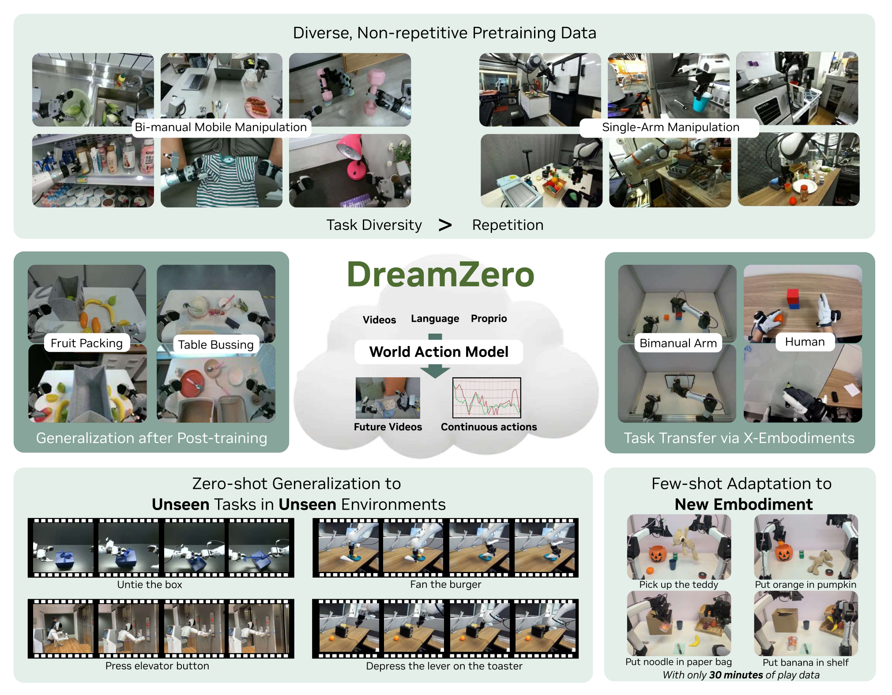

**图内文字中文翻译**（按阅读顺序）：

- 顶部大框：**多样、非重复的预训练数据**——左组图为"双臂移动操作"（AgiBot G1 在厨房/货架/桌面等真实场景），右组图为"单臂操作"（Franka）；底部标语：**任务多样性 > 重复次数**
- 中排左框：**Post-training 后的泛化**——水果装袋（Fruit Packing）、餐桌清理（Table Bussing）
- 中排中央：**DreamZero 世界动作模型**——输入：视频、语言、本体感受（Proprio）；输出：未来视频 + 连续动作
- 中排右框：**跨具身的任务迁移**——双臂机器人（Bimanual Arm）与人类（Human）的演示视频都能用
- 底部左框：**对未见环境中未见任务的零样本泛化**——解开盒子上的丝带（Untie the box）、给汉堡扇风（Fan the burger）、按电梯按钮（Press elevator button）、压下烤面包机手柄（Depress the lever on the toaster）
- 底部右框：**少样本适配新机器人**——只用 30 分钟玩耍数据（play data），就能在新机器人上做"拿起泰迪熊""把橘子放进南瓜桶""把泡面放进纸袋""把香蕉放上架子"

自查：不做机器人的读者应能看懂——"用视频生成模型当机器人大脑，先想象画面再出动作，所以没教过的动作也会做"。

---

## 第5章 · 实验

### 5.1 仿真实验

**本文没有以仿真为主的定量实验。** 全部主结果均为真机评测。仿真只在两处被提及：

- 脚注 1：称在 Genie Sim 3.0（100 个仿真任务）上有 "non-trivial performance"，**全文未给出任何数字**（盲审 W7 已点名）
- §4.1 / 脚注 6：开源了在 PolaRiS（DROID 的 real-to-sim 评测）上运行 DROID checkpoint 的代码，但论文正文同样未报告 PolaRiS 数字

### 5.2 真机实验

项目主页：https://dreamzero0.github.io（论文首页脚注给出）。

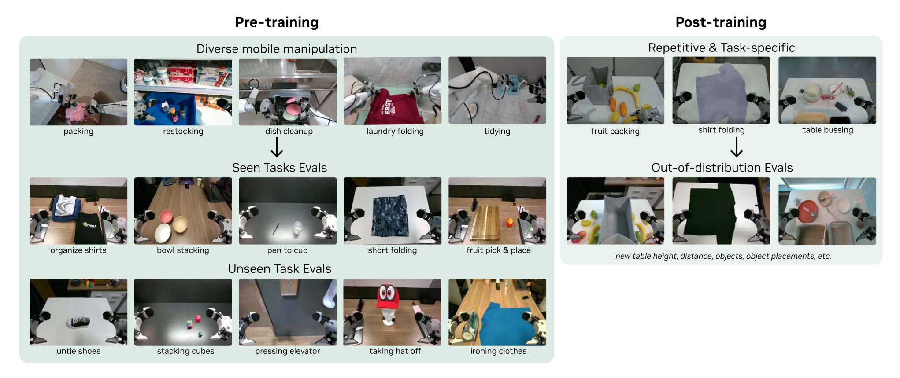

评测设置总览（Figure 7）：左侧预训练→seen 任务评测（叠衣、摞碗、笔入杯等）与 unseen 任务评测（解鞋带、堆方块、按电梯、摘帽、熨衣）；右侧 post-training 三任务→改变桌高、距离、物体与摆位的 out-of-distribution 评测。

#### 5.2.1 AgiBot G1：seen 任务（预训练后直接测，零样本换环境换物体）

一句大白话：机器人在**从没去过的房间**里做**训练里出现过的任务类型**（抓水果、擦桌子、叠衣服……），但物体全是新的。

- 条件：500 小时自采多样数据预训练，直接 out-of-box 评测；10 个任务 × 4 台机器人 × 8 rollouts = 80 rollouts/checkpoint；评测点与数据采集点地理隔离
- 指标：平均任务进度（task progress，0–1 部分完成度）
- 基线：GR00T N1.6 与 π0.5，各有 scratch（仅 VLM 初始化+同数据训练）与 pretrained（官方权重+同数据继续训练）两档

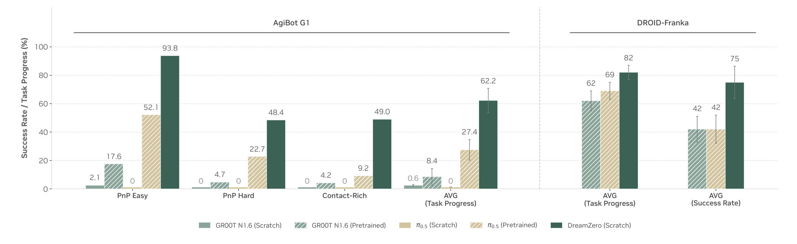

| 方法 | PnP 简单 | PnP 困难 | 接触密集型 | AgiBot 平均 | DROID 平均（进度） | DROID 平均（成功率） |
|---|---|---|---|---|---|---|
| GR00T N1.6（scratch） | 2.1 | 0 | 0 | 0.6 | — | — |
| GR00T N1.6（pretrained） | 17.6 | 4.7 | 4.2 | 8.4 | 62 | 42 |
| π0.5（scratch） | 0 | 0 | 0 | 0 | — | — |
| π0.5（pretrained） | 52.1 | 22.7 | 9.2 | 27.4 | 69 | 42 |
| **DreamZero（scratch）** | **93.8** | **48.4** | **49.0** | **62.2** | **82** | **75** |

（单位 %；PnP = 抓取放置；"接触密集型"= 叠衬衫/叠短裤/摞衣服；DROID 组只对比公开的 π0.5-DROID 与内部训练的 GR00T N1.6-DROID）

#### 5.2.2 AgiBot G1 + DROID：unseen 任务（零样本做没教过的动作）

一句大白话：让机器人做**训练数据里完全不存在的动作**——解鞋带、摘假人帽子、画圈、熨衣服、握手、叠地图、拉小车。

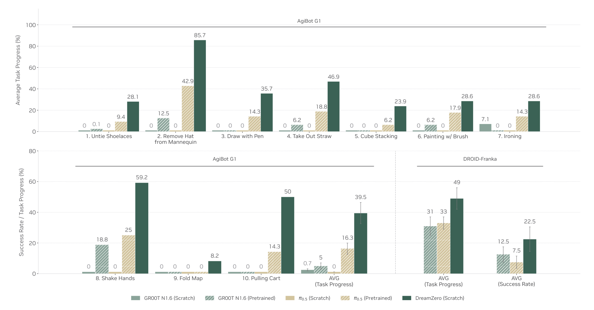

| 方法 | AgiBot 平均进度 | DROID 平均进度 | DROID 成功率 |
|---|---|---|---|
| GR00T N1.6（scratch） | 0.7 | — | — |
| GR00T N1.6（pretrained） | 5 | 31 | 12.5 |
| π0.5（scratch） | 0 | — | — |
| π0.5（pretrained） | 16.3 | 33 | 7.5 |
| **DreamZero（scratch）** | **39.5** | **49** | **22.5** |

DreamZero 单项亮点：摘帽子 85.7%、握手 59.2%、拉小车 50%；最弱项：叠地图 8.2%、堆叠方块 23.9%。DROID 侧的 unseen 用"训练数据中不存在的动词"定义（fan/slice/type/weave 等 20 个）。定性观察：VLA 基线不管指令是什么都伸手去抓（过拟合到抓放行为），DreamZero 则先"想象"出任务画面再执行。

#### 5.2.3 Post-training（任务专项微调后是否保住泛化）

三个下游任务采集专项数据微调 50K 步：叠衬衫（33h）、水果装袋（12h）、餐桌清理（40h）；仍在未见环境评测，10 rollouts/任务。

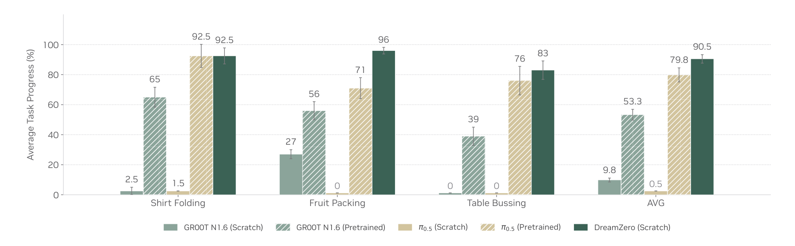

| 方法 | 叠衬衫 | 水果装袋 | 餐桌清理 | 平均 |
|---|---|---|---|---|
| GR00T N1.6（scratch） | 2.5 | 27 | 0 | 9.8 |
| GR00T N1.6（pretrained） | 65 | 56 | 39 | 53.3 |
| π0.5（scratch） | 1.5 | 0 | 0 | 0.5 |
| π0.5（pretrained） | 92.5 | 71 | 76 | 79.8 |
| **DreamZero（scratch）** | 92.5 | **96** | **83** | **90.5** |

要点：DreamZero **没做任何跨具身预训练**就追平/超过了吃过数千小时机器人数据的 pretrained VLA，说明环境泛化在微调后保留。

#### 5.2.4 跨具身迁移（纯视频、无动作标签）

9 个 unseen 任务，用另一具身的**纯视频**演示（无动作标签）共训 10K 步：YAM 机器人 20 分钟 / 人类第一视角 12 分钟。

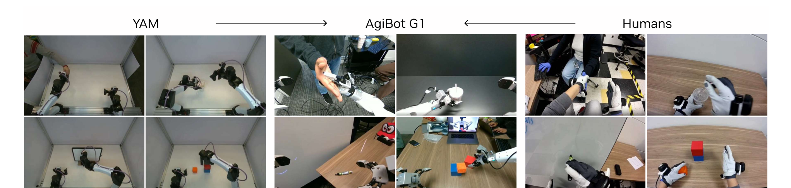

| 方法 | unseen 任务进度 |
|---|---|
| DreamZero 基线 | 38.3% ± 7.6% |
| + 人类视频迁移（12 分钟） | 54.3% ± 10.4% |
| + YAM 机器人视频迁移（20 分钟） | **55.4% ± 9.5%** |

⚠️ 注意（盲审 W2）：两组提升的标准误区间与基线大幅重叠，论文未做统计检验，"42% 相对提升"的 headline 未被统计学确立。

#### 5.2.5 少样本具身适配（30 分钟上新机器人）

AgiBot 预训练 checkpoint → 新机器人 YAM，仅 55 条轨迹 / 11 个任务 / 约 30 分钟 play data 做 post-training。结果为定性展示（Figure 12）：保住语言跟随能力，还能泛化到训练未见物体（南瓜桶、泰迪熊、泡面、纸袋）。**论文未给出该实验的定量成功率表**。

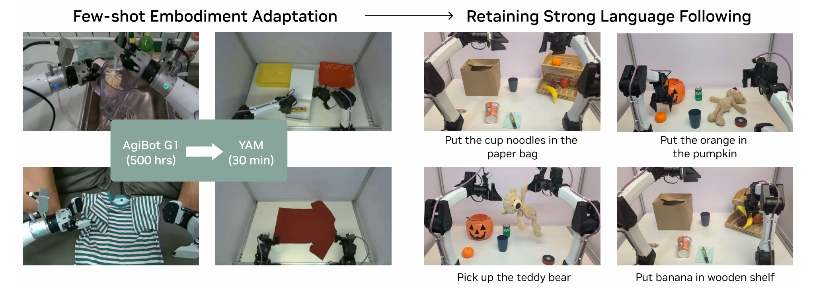

#### 5.2.6 DreamZero-Flash（速度-精度权衡）

餐桌清理任务上验证单步去噪：

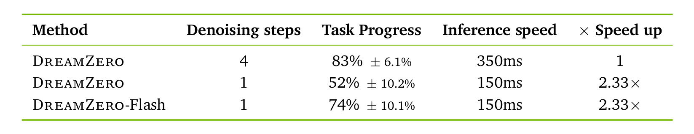

| 方法 | 去噪步数 | 任务进度 | 推理延迟 |
|---|---|---|---|
| DreamZero | 4 | **83% ± 6.1%** | 350ms |
| DreamZero | 1 | 52% ± 10.2% | 150ms |
| DreamZero-Flash | 1 | 74% ± 10.1% | 150ms |

Flash 用解耦噪声调度把单步性能从 52% 拉回 74%，代价是仍比 4 步低 9 个点（这正是盲审 W3 指出摘要"无损 38×"表述矛盾之处）。

#### 失败模式

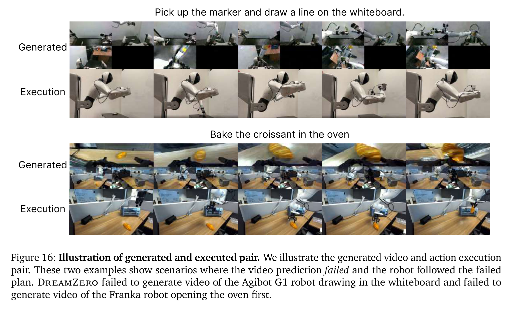

附录 H：失败主要来自**视频生成错**而非动作提取错——机器人忠实执行了错误的"想象"（例：指令画线，生成的视频却是把笔递给另一只手，机器人照做）。含义：提升视频骨干 ≈ 直接提升策略。

### 5.3 为什么选这些实验

**共同特性**：所选场景全部是①开放环境（22 个真实场所采数据、异地评测）、②粗粒度全身/双臂运动（叠衣、装袋、清桌、握手）、③强语言条件（每 rollout 一句自然语言指令）、④非重复长程数据可覆盖的日常操作。这正是"视频先验 + 想象式规划"最吃香的地形：动作容错大、进度可部分计分、语义可从网络视频先验借力。

**数字印证**：unseen 任务中得分最高的恰是运动粗放、判定连续的任务——摘帽子 85.7%、握手 59.2%；得分最低的恰是需要精确对位的任务——叠地图 8.2%、堆方块 23.9%（Figure 9）。seen 任务中 PnP-Easy 93.8% vs 接触密集型 49.0% 同样呈"越粗放越强"的梯度（Figure 8）。

**该测但没测的**（缺席即信号）：
- 主流仿真 bench（LIBERO、SimplerEnv、CALVIN、RoboCasa 等）一个都没报数字——Genie Sim 3.0 只有一句无数字的脚注。仿真 bench 恰恰是重复、精确、可统计检验的场景，是本方法的劣势地形
- 高精度装配类任务（插孔、拧螺丝）完全缺席，论文自己在 §6 承认继承了行为克隆在亚厘米精度任务上的局限
- 与其他 WAM（Cosmos Policy、UWM、mimic-video 等）的对比缺席（盲审 W1 的核心）——这些方法与 DreamZero 共享"视频先验"优势，比 VLA 基线更能检验本文的增量贡献

### 5.4 复现可能性（硬核查）

逐项核查（证据来源：论文 + 实际打开 [GitHub 仓库](https://github.com/dreamzero0/dreamzero)）：

| 项目 | 状态 | 证据 |
|---|---|---|
| 代码仓库 | ✅ 存在，实质代码 | repo 顶层含 `groot/`、`scripts/`、`eval_utils/`、`docs/`、`pyproject.toml`，68 commits，2.5k stars（2026-08 查证） |
| 推理代码 | ✅ 开源 | WebSocket 分布式推理服务器，支持 GB200/H100（repo README） |
| 微调/训练代码 | ⚠️ 部分开源 | repo 含 LoRA 与全量微调脚本及新具身训练指南；但**预训练代码未见**，论文贡献列表也只承诺 weights+inference+benchmark 代码（§1） |
| ckpt：DreamZero-DROID (14B) | ✅ HuggingFace 已发布 | repo README |
| ckpt：DreamZero-AgiBot | ✅ HuggingFace 已发布 | repo README |
| ckpt：DreamZero-Flash / 5B 消融版 / YAM 适配版 | ❌ 未见 | repo 未列出 |
| 数据：DROID | ✅ 开放 | 原始数据本就公开；repo 另提供预处理版 DROID（131GB，HF）+ 转换说明 |
| 数据：AgiBot 500 小时 | ❌ 未释出 | 脚注 5 仅 "plan to open-source in upcoming releases"，主页有样例视频 |
| 数据：repetitive 对照集 / YAM / 人类视频 | ❌ 未释出 | 论文仅一句话描述构成 |
| 仿真评测 | ⚠️ coming soon | repo 明确标注 PolaRiS 与 Genie Sim 支持为 coming soon |
| 训练细节：步数/batch | ✅ 找到 | 100K 步、全局 batch 128（预训练）；50K 步（post-training）（§4.1/4.2） |
| 训练细节：冻结策略 | ✅ 找到 | 冻结 text/image encoder 与 VAE，更新 DiT+state/action 编解码器；LoRA 试过效果差（脚注 7） |
| 训练细节：chunk 结构 | ✅ 找到 | K=2 latent 帧/chunk，M=4 chunks，视频 5FPS，动作 30Hz（AgiBot）/15Hz（DROID），H=48/24，上下文 6.6 秒（附录 C） |
| 训练细节：动作表示 | ✅ 找到 | 过滤 idle 动作、相对关节位置（§4.1） |
| 学习率 / optimizer / schedule | ❌ 正文与附录均未给出 |
| 训练硬件与时长 | ❌ 未给出（仅推理硬件 2×GB200） |
| 评测任务清单 | ✅ 找到 | 附录 F/G 逐 rollout 列出初始画面与指令 |

**结论：需自行补齐细节（AgiBot 主结果实际难以复现）。** 缺失项分点：
- 学习率、optimizer、lr schedule 未给出
- 预训练代码未开源（只有微调脚本）
- AgiBot 500 小时数据、repetitive 对照集、YAM/人类视频数据均未释出 → Figure 8/9/10 的 AgiBot 侧结果无法独立复现
- 训练硬件与时长未披露
- DROID 轨道例外：数据+ckpt+推理代码齐全，属"可直接复现推理评测、需补超参方可复现训练"

---

## 第6章 · 方法拆解

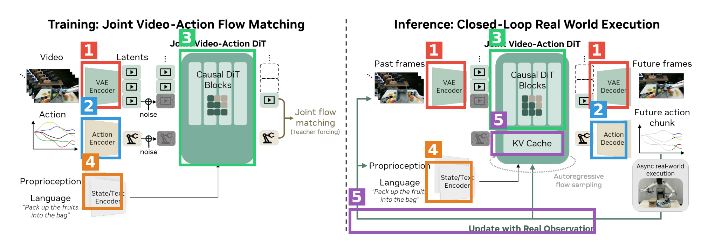

左半 = 训练（联合视频-动作 flow matching），右半 = 推理（闭环真机执行）。编号框：🟥1 VAE 编解码器 · 🟦2 动作编解码器 · 🟩3 Causal DiT 主干 · 🟧4 状态/文本编码器 · 🟪5 KV Cache 与真实观测回填。

🟥 **1 · VAE 视频编解码器**（出自 [Wan2.1](https://arxiv.org/abs/2503.20314)，冻结）
- 接口：进——多视角相机画面（多视角拼接成单帧，不改骨干结构）；出——视频 latent 给 DiT。推理端右侧的 VAE Decoder 把去噪后的 latent 还原成"未来几秒的想象画面"
- 训练时：完全冻结，不更新
- 部署时：编码真实观测进 KV cache；解码生成的未来帧（用于可视化与对齐检查）

🟦 **2 · 动作编码器 / 解码器**（作者新增，参数量极小）
- 接口：进——48 步动作块（1.6 秒 @30Hz，归一化的相对关节位置）加噪后的 latent；出——解码器把 DiT 输出还原为未来 1.6 秒的 48 步动作序列
- 训练时：与 DiT 一起从头训练；动作和视频共享去噪时间步（Flash 版解耦）
- 部署时：每次推理吐一个动作块，交给 30Hz 运动控制器异步执行，执行前过 Savitzky-Golay 滤波（上采样 2×→滤波→降采样）去高频抖动

🟩 **3 · Causal DiT 主干**（[Wan2.1-I2V-14B](https://arxiv.org/abs/2503.20314) 初始化 + [CA2-VDM 式](https://arxiv.org/abs/2411.16375) chunk 级 teacher forcing 改造，全参微调）
- 接口：进——[噪声视频 latent, 噪声动作 latent] + 干净历史 chunk 上下文 + 语言/状态条件；出——两个模态的联合速度场（flow matching 式 3）
- 训练时：AgiBot 500h 或 DROID，100K 步 batch 128；每 chunk 含 K=2 个 latent 帧，M=4 个 chunk，chunk 内共享时间步、chunk 间独立时间步；当前噪声 chunk 只能注意此前干净 chunk（附录 C 注意力掩码）
- 部署时：16 步去噪 → DiT 缓存降到 4 步（速度方向余弦相似即复用）→ Flash 降到 1 步；CFG 双卡并行

🟧 **4 · 状态/文本编码器**（文本编码器为 Wan2.1 自带、冻结；状态编码器为作者新增）
- 接口：进——自然语言指令 + 当前本体感受（关节状态）；出——条件向量注入 DiT
- 训练时：文本编码器冻结，状态编码器参与训练
- 部署时：每个 chunk 用最新的真实本体感受刷新条件

🟪 **5 · KV Cache + 真实观测回填**（作者原创的闭环机制）
- 接口：进——每个动作块执行完后的**真实**相机观测与关节状态；出——用 VAE 编码真实帧替换 KV cache 中的预测帧，丢弃已生成的视频 latent
- 训练时：无此环节（teacher forcing 天然用真值上下文，与推理行为一致）
- 部署时：这是 WAM 独有的福利——纯视频生成模型自回归会误差累积，而机器人每步都能拿到真实世界的"标准答案"回填上下文，同时 KV cache 让上下文任意长也只需一次前向；最大视觉记忆 6.6 秒

**接口串联自查**：真实画面→🟥编码→🟩以历史+🟧条件联合去噪[视频,动作]→🟦解码动作块→机器人异步执行→新的真实观测→🟪回填🟩的 KV cache→下一轮。首尾相接，闭环成立。

---

## 第7章 · 消融

消融配置注意：全部用缩水配置（50K 步、batch 32，主模型为 100K 步、batch 128），只在 PnP Easy 3 个任务上测——盲审 W8 指出该证据强度低于其支撑的摘要级主张，读表时打折扣。

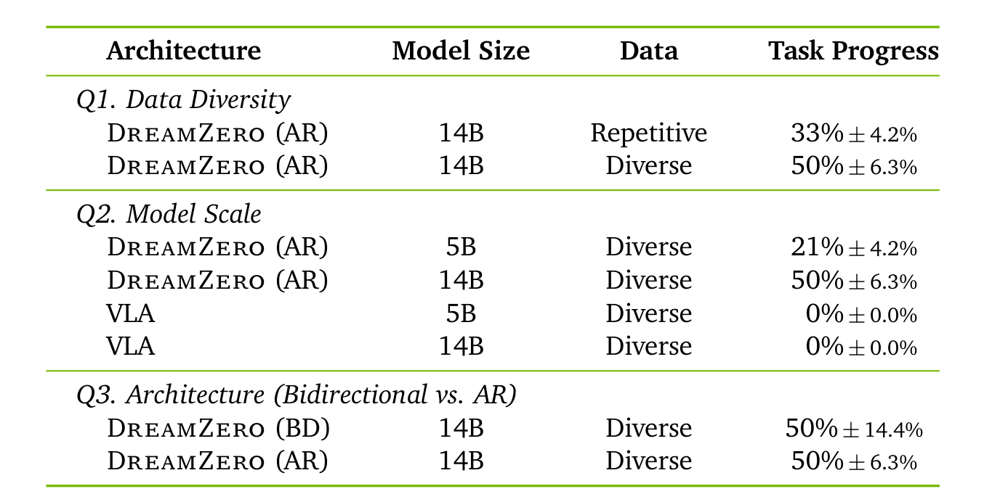

| 消融行（人话重述） | 任务进度 | 一句 takeaway |
|---|---|---|
| 同样 500 小时，换成"70 个任务反复演示"的重复数据 | 33% ± 4.2% | 数据多样性贡献 +17 个点：视频预测靠预训练白送，瓶颈是逆动力学，重复数据给不了多样的状态-动作对应 |
| 500 小时多样数据（基准） | **50% ± 6.3%** | — |
| 骨干从 14B 缩到 5B | 21% ± 4.2% | 模型规模贡献 +29 个点，是最大单项：小模型视觉幻觉多，幻觉直接传导成错误动作——佐证"视频质量决定动作质量" |
| 把 VLA 也放大到 5B/14B（截断大 VLM+DiT 动作头） | 0% ± 0.0% | VLA 加参数也学不会多样数据（悬停不接触）；但盲审 W4 指出截断构造可能本身削弱了基线，此行证据可疑 |
| 主干改双向（BD）不用自回归 | 50% ± 14.4% | 任务进度打平！AR 的优势不在分数，而在动作平滑度（无量化指标，W7）与 3–4× 推理速度（KV cache） |

另一组功能性消融（正文 Table 3，见 5.2.6）：去噪 4 步→1 步掉 31 个点（83→52），Flash 解耦噪声调度挽回 22 个点（52→74）——说明"训练时就练习从噪声画面里读出干净动作"这一设计实际有效，是全文消融里最干净的一组对照。

**呼应第3章**：消融没有覆盖的关键问题——联合去噪 vs 分离式"视频模型+IDM"（式 1 的分解本可以直接消融）、GT 回填 KV cache 的贡献量、teacher forcing 的贡献量。这些自家原创模块反而没有消融，是比"配置缩水"更实质的缺口。

---

## 总结速览

- **一句话**：把 Wan2.1 视频扩散模型改造成"边想象未来画面边出动作"的 14B 世界动作模型，靠视频先验在真机上实现对未见任务/环境的零样本泛化（39.5% vs VLA 16.3%），并用 38× 推理加速跑到 7Hz 实时闭环
- **最硬的证据**：scratch VLA 在多样数据上全线归零 vs DreamZero 62.2%（效应量大到不需要统计检验）；Flash 消融干净
- **最大的软肋**（盲审 major revision）：自称 WAM SOTA 却无任何 WAM 基线、headline 的 42% 迁移提升未过统计检验、"无损 38×"与自家 Table 3 矛盾、AgiBot 主结果数据未释出无法复现
