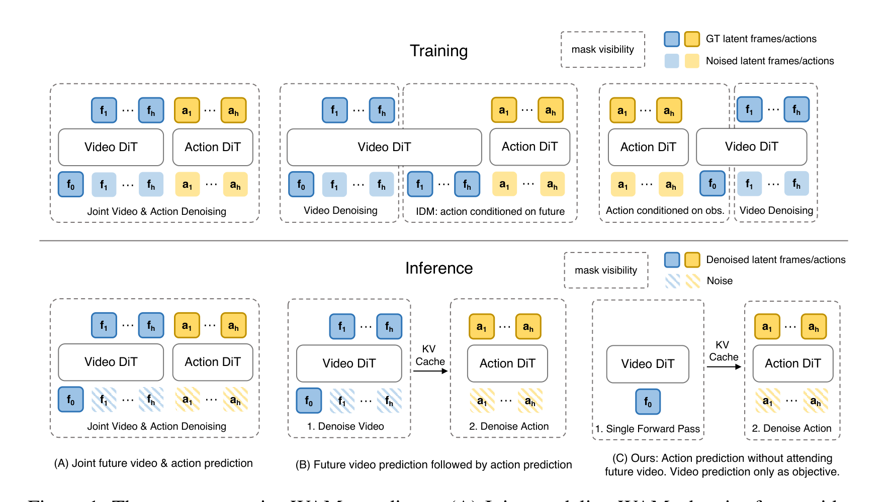
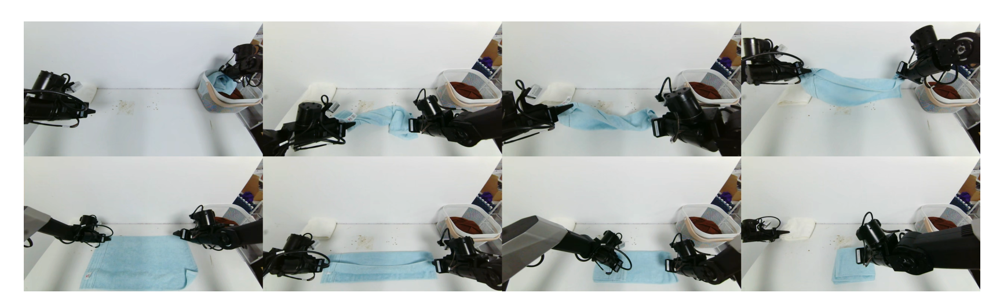
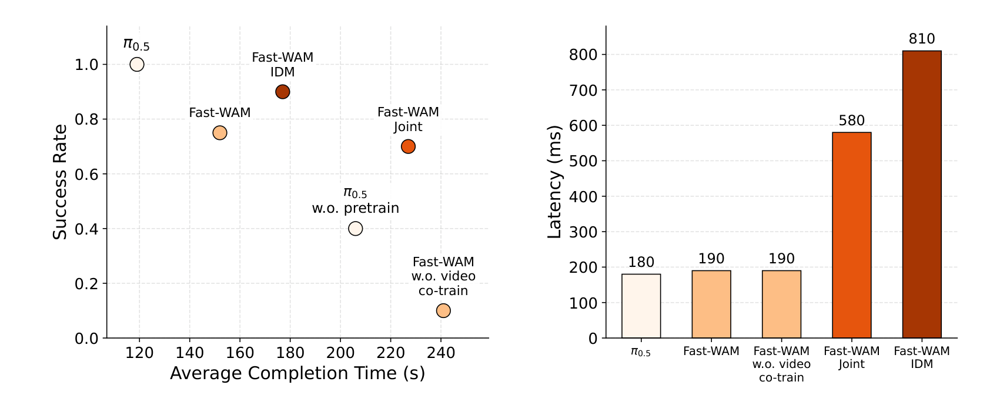
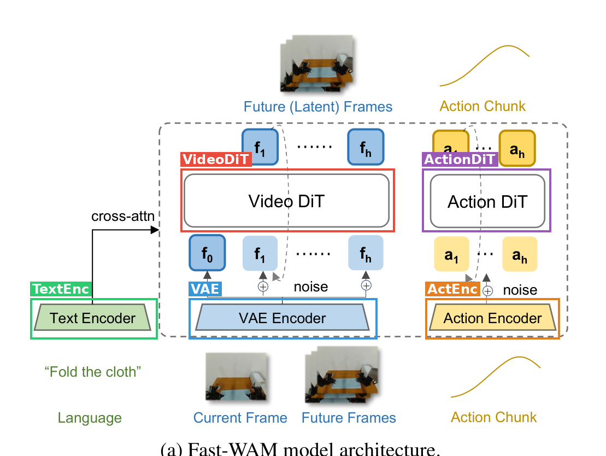

# Fast-WAM: Do World Action Models Need Test-time Future Imagination?

| 项 | 内容 |
|---|---|
| 题目 | Fast-WAM: Do World Action Models Need Test-time Future Imagination? |
| 作者 | Tianyuan Yuan（袁天远）, Zibin Dong（董子斌）, Yicheng Liu, Hang Zhao（赵行） |
| 单位 | 清华大学交叉信息研究院（IIIS）+ Galaxea AI（星海图） |
| arXiv | [2603.16666](https://arxiv.org/abs/2603.16666)（v2, 2026-03-23, cs.CV） |
| 代码 | [github.com/yuantianyuan01/FastWAM](https://github.com/yuantianyuan01/FastWAM)（实质代码 + HF 权重/数据，见 5.4） |
| 项目主页 | [yuantianyuan01.github.io/FastWAM](https://yuantianyuan01.github.io/FastWAM/) |
| 发布日期 | 2026-03-17（arXiv v1） |

**结构速览**（13 页，正文 9 页）：

- §1 Introduction：提出核心问题——WAM 的收益来自训练时的视频建模还是测试时的未来想象，并宣布用受控变体来拆解。
- §2 Related Work：VLA 一线；WAM / 视频驱动策略一线；与 VPP、UVA 两个"绕开测试时视频合成"的近邻工作划界。
- §3 Method：3.1 问题形式化（imagine-then-execute 的分解式 vs 直接策略式）；3.2 架构（Wan2.2-5B 视频 DiT + 1B action expert 的 MoT 共享注意力 + 结构化掩码）与 flow matching 训练目标；3.3 受控变体设计（Joint / IDM / 无视频共训练）。
- §4 Experiment：4.1 实现细节；4.2 评测设置（LIBERO、RoboTwin 2.0、真机毛巾折叠）；4.3 主结果 + 变体受控对比 + 真机与延迟。
- §5 Conclusion：结论 + 未来方向（更大规模预训练与模型缩放）。
- Appendix A.1：RoboTwin 51 个任务逐任务成功率表（Table 3）。

---

## 第1章 · 作者与实验室背景评估

### 作者背景表（事实）

| 作者 | 角色 | 单位 | 主页 | 主方向与代表作 |
|---|---|---|---|---|
| 袁天远 Tianyuan Yuan | 一作 | 清华 IIIS 博四（本科北大） | [个人主页](https://yuantianyuan01.github.io/) / [Google Scholar](https://scholar.google.com/citations?hl=en&user=wmSj3RgAAAAJ) | 前三年主攻自动驾驶建图：StreamMapNet（WACV'24 一作）、PreSight（ECCV'24 一作）、VectorMapNet（ICML'23 co-author）、Neural Map Prior（CVPR'23 co-author）；2026 起转具身：DepthVLA（ICRA'26 一作）、Galaxea G0（ICRA'26 co-author） |
| 董子斌 Zibin Dong | 二作 | 天津大学硕士毕业，2026 秋入学清华博士（导师赵行） | [个人主页](https://zibindong.github.io/) / [Google Scholar](https://scholar.google.com/citations?hl=en&user=JQ6881QAAAAJ) | Diffusion/flow policy 与强化学习（NeurIPS diffusion RL 系列），方向为 Embodied AI + 生成式决策 |
| Yicheng Liu | 三作 | 清华 IIIS 博士生（导师赵行） | [个人主页](https://mrmoore98.github.io/liuyicheng/) | 生成模型在自动驾驶/机器人中的应用；VectorMapNet、Neural Map Prior 等建图系列 |
| 赵行 Hang Zhao | 通讯/导师 | 清华 IIIS 助理教授，MARS Lab PI；Galaxea AI 联合创始人/首席科学家 | [个人主页](https://hangzhaomit.github.io/) / [IIIS 页](https://iiis.tsinghua.edu.cn/en/People/Faculty/ZhaoHang.htm) / [实验室主页](https://group.iiis.tsinghua.edu.cn/~marslab/) / [Google Scholar](https://scholar.google.com/citations?user=DmahiOYAAAAJ&hl=en) | MIT 博士（2019）、Waymo 研究科学家（2019–2020）；多模态学习、自动驾驶（DriveVLM 部署于理想汽车）、机器人学习；2023 年联合创办 Galaxea AI |

### 实验室主方向判定

MARS Lab（清华 IIIS，赵行组）的**传统强方向是自动驾驶与多模态学习**：VectorMapNet（ICML'23）、Neural Map Prior（CVPR'23）、StreamMapNet（WACV'24）、DriveVLM 等构成 2021–2024 的主产出线。**具身机器人/VLA/WAM 是近两年（约 2025 起）借 Galaxea AI 开出的新方向**，证据：Galaxea Open-World Dataset & G0 dual-system VLA（ICRA'26）、DepthVLA（ICRA'26）、本文 Fast-WAM（2026.03），三篇密集产出且全部依托 Galaxea 真机平台。判定：**新开方向，但带公司级资源投入**（真机队列、60 小时遥操作数据、赵行本人以 Galaxea 首席科学家身份把具身作为当前主业），不是学术试水型新方向。

### 水毕业风险信号核对与水平预判（推断，注明依据）

| 信号 | 判定 | 依据 |
|---|---|---|
| 一作无相关积累 | 部分符合 | 一作前三年积累在自驾建图，VLA/WAM 是近一年新转；但已有 DepthVLA（ICRA'26）一作打底，本文是其第二篇具身一作、首篇 world model 方向 |
| 导师主业不在此方向 | 不符合 | 赵行历史主业在自驾，但现任 Galaxea 首席科学家，具身即当前主业 |
| 实验室无持续投入 | 不符合 | G0 → DepthVLA → Fast-WAM 连续产出 + 公司真机平台 |
| 单位无积累 | 不符合 | 清华 IIIS + Galaxea AI 均在该领域有实体投入 |

**预判**：不像水毕业产物，更像实验室战略转向期的实用导向工作——问题选得干净（拆解 WAM 两个纠缠因素）、带真机验证、代码权重开源齐全，工程完成度高于典型"新方向首篇"。风险点仅在：一作在 world model 方向积累尚浅（首篇），结论的机制层面深度可能受限（后文盲审 W1 恰好印证了这一点）。

⚠️ 本章内容未进入第3章盲审上下文。

---

## 第2章 · 论文类型判定

**结论一句话**：**a+b 型 + 实验（系统）型内核**——架构上是"Wan2.2-5B 视频基座 + π0 风格 action expert"的 MoT 拼接（a+b），但论文的主要贡献不是新模块，而是一组受控对比实验（三个变体拆解"训练时视频目标 vs 测试时未来想象"），属于实验型研究问题驱动。

### 组件清单（方法节实际承担流程环节的引用工作）

| 组件 | 原论文 | 在本文中的角色 |
|---|---|---|
| Wan2.2-5B 视频 DiT | [Wan (arXiv 2503.20314)](https://arxiv.org/abs/2503.20314) [36] | 世界建模 backbone；推理时作单次前向的世界编码器（§3.2, §4.1） |
| Wan2.2 内置 T5 文本编码器 | 同上 [36] | 语言指令编码，cross-attention 喂给所有 token（§3.2） |
| Wan2.2 视频 VAE | 同上 [36] | 图像 → latent video tokens（§3.2） |
| Flow matching 目标 + logit-normal 噪声调度 | follow [36]（§4.1 "Following [36]"） | 动作与视频分支共用的训练目标（式 5–9） |
| 噪声增广（p=0.5，用于 IDM 变体） | [LingBot-VA (arXiv 2601.21998)](https://arxiv.org/abs/2601.21998) [3] | §4.1 "we follow [3]"，构建 Fast-WAM-IDM 时对 GT 视频 token 加噪 |
| Joint 范式模板（变体 A） | [WAM (2602.15922)](https://arxiv.org/abs/2602.15922) [4]、[UWM (2504.02792)](https://arxiv.org/abs/2504.02792) [6]、[Motus (2512.13030)](https://arxiv.org/abs/2512.13030) [5] | Fast-WAM-Joint 复刻的"视频动作联合去噪"推理结构（§3.3） |
| IDM 范式模板（变体 B） | [LingBot-VA](https://arxiv.org/abs/2601.21998) [3]、[Vidar (2507.12898)](https://arxiv.org/abs/2507.12898) [7]、[UniPi (2302.00111)](https://arxiv.org/abs/2302.00111) [8] | Fast-WAM-IDM 复刻的"先生成视频再出动作"推理结构（§3.3） |
| LIBERO | [arXiv 2306.03310](https://arxiv.org/abs/2306.03310) [37] | 仿真评测 benchmark |
| RoboTwin 2.0 | [arXiv 2506.18088](https://arxiv.org/abs/2506.18088) [38] | 仿真评测 benchmark（双臂） |

**作者原创部分**：action expert DiT（与 video branch 同构、hidden dim 缩到 1024 的 1B 分支）、结构化注意力掩码（action token 不看未来视频 token、f0 不看任何 token，Figure 2b）、以及"训练保留视频分支/推理整体删除"的设计本身。

**疑似借鉴（论文未引用，不算组件）**：

- "Mixture-of-Transformer (MoT) 共享注意力"的叫法与 Meta 的 Mixture-of-Transformers（Liang et al., 2024, arXiv 2411.04996）同名同构，论文未引用该文。
- "主干 + 缩小 hidden dim 的 action expert"的设计与 π0（[10]，参考文献里作为 baseline 存在）的 action expert 高度相似，但方法节未标注来源。

---

## 第3章 · 双盲评审 + Rebuttal（全流程记录）

### 3.1 初审意见（由隔离上下文的盲审 agent 独立生成）

> 评审仅依据净化文本（删除作者、机构、项目主页 URL、arXiv 编号），按 Science Robotics 家族水位评审。

**Summary（审稿人复述）**：本文研究 WAM 的收益究竟来自训练时的视频预测目标还是测试时显式生成未来观测。Fast-WAM 用 Wan2.2-5B 视频 DiT + 1B action expert 的 MoT 架构，训练时 flow matching 联合优化动作与未来视频 latent，推理时删掉未来视频分支、单次前向后直接去噪动作（190 ms）。同框架实现 Joint / IDM / 无视频共训练三个对照变体，在 LIBERO、RoboTwin 2.0 与真机毛巾折叠上对比，结论：视频预测的主要价值在训练期塑造世界表征。

**Strengths（摘要）**：

- 问题干净、实验设计有对照意识：§3.3 在共享 backbone/tokenization/训练配方下实例化三个变体，比"又一个 WAM 系统"在方法论上更接近受控实验。
- 注意力掩码设计合理（§3.2, Fig 2b）：结构上保证未来信息不泄漏进动作分支，删除视频分支成为无缝操作。
- 仿真评测规模可观、有逐任务细粒度结果（RoboTwin 50+ 任务、附录 Table 3；LIBERO 2000 trials）。
- 对不利结果报告诚实（§4.3.3 明确写出真机上预训练 π0.5 仍最强）。
- 实用价值明确：190 ms vs 同框架 580/810 ms。

**Weaknesses（全文）**：

- **W1（核心结论存在未排除的混杂因素）**：中心 claim 唯一支撑是 w.o. co-train 消融的落差，但该消融同时去掉了世界建模目标**和**对 Wan2.2 预训练视频表征的保持作用——性能下降可能来自"灾难性遗忘了通用视频先验"而非"缺少世界建模信号"。论文没有任何区分实验（冻结视频 DiT 变体、表征 probing、训练后视频分支质量检查）。直接削弱标题所答问题的结论强度。
- **W2（与最近似先行工作的关系未经实验厘清）**：UVA [35]（联合建模、测试时跳过视频解码）、VPP [34]（预测性表征做条件）、FLARE [30]（implicit world modeling）已在实践中体现"测试时不需要显式生成未来"，本文净新增收窄为"共享框架内的受控对比"，且 Table 1/2 无与 UVA/VPP/FLARE 的任何实证比较。
- **W3（无统计检验与不确定度）**：全部结论建立在单次训练的点估计上；91.8 vs 90.6 vs 91.3 称 "highly comparable"、与 83.8 的差距称 "substantial"，均无误差棒/置信区间/显著性检验；LIBERO 上 Joint（98.5）反而高于 Fast-WAM（97.6），噪声水平无从判断。
- **W4（真机实验关键细节缺失）**：trial 数、成功判据、超时设定、完成时间是否只在成功 trial 上平均（幸存者偏差风险）均未交代；单任务、单平台、无泛化测试。
- **W5（可复现性未达发表门槛）**：净化文本中无代码/数据公开声明；λ（式 9）数值、相机配置、控制频率未给出。
- **W6（基线数字来源不明；"over 4× faster than existing WAMs"超出证据范围）**："Motus from WAN2.2 / LingBot-VA from WAN2.2" 由谁按什么配方训练未交代；LingBot-VA from WAN2.2 的 Rand. 缺失未解释；延迟对比只测了作者自己实现的变体，未测任何 existing 系统。
- **W7（"competitive with SOTA"表述偏强）**：RoboTwin 上仍低于预训练 LingBot-VA（91.8 vs 92.2），真机明确输给预训练 π0.5。

**Questions**：真机 trial 数/判据/超时/时间统计口径；基线数字来源；训练 seed 数；区分 W1 两种解释的证据；为何无 UVA/VPP 直接比较；λ 取值与代码公开计划。

**Minor**：CFG=1.0 等价于不用 CFG 的表述困惑；LIBERO seed 表述含糊；Figure 4 标签可读性；Table 1 有效数字不一致；多相机拼接细节缺失。

**初审评级：reject**——核心发现已被 UVA/VPP/FLARE 很大程度预示，净增量是子领域内的受控消融 + 推理加速；且现有证据撑不住结论（W1 混杂、W3 无统计、W4 真机细节缺失、W5 不可复现）。若补齐，适合机器人学习专业会议，但辐射范围难达本刊 "substantial progress" 水位。

### 3.2 Rebuttal（主 agent 以作者方身份撰写，双盲，论据仅来自论文内部）

逐条回应见发送原文，要点：

- **W1 承认**（本文最实质缺陷），但划出边界：三个带视频 loss 的变体之间的横向比较（91.8/90.6/91.3）不受混杂影响，"保留视频目标前提下测试时想象收益很小"这半个结论仍成立；受混杂的是"下降归因于世界建模信号"那半个。接受冻结/probing 实验为必要补充。
- **W2 部分承认**：无直接比较是缺失；辩护仅限定位——净贡献是四种设计在同 backbone 下的受控分解（UVA 无 imagine-then-execute 与 no-co-train 对照；VPP 推理仍需视频模型前向），而非"可以跳过测试时生成"这一现象本身。
- **W3 承认**：4.2 的 "random seeds" 是评测 seed，训练均为单次；并主动指出 LIBERO/RoboTwin 上变体排序翻转恰好提示 1 点内差距在噪声级。
- **W4 全部承认**（含完成时间幸存者偏差风险）。
- **W5 承认**，承诺公开代码/仿真权重/数据管线；真机 60h 数据不承诺。
- **W6 大部分承认**："4× faster" 应改为 "than imagine-then-execute variants under the same backbone"；有限辩护：两变体保留了对应范式的定义性推理结构（§3.3），对同 backbone 下该类范式有代表性。
- **W7 辩护**："competitive" 非 "surpass"，差距 0.4/0.9 点有 Table 1/2 支撑，真机劣势 §4.3.3 首句明写；接受在摘要显式加"pretrained ... while using no embodied pretraining"限定。

**承认的批评清单（= 本文真正硬伤一览）**：

1. w.o. co-train 消融无法区分"世界建模信号"与"防遗忘视频预训练特征"两种解释（W1）——核心结论只剩一半站得住。
2. 与 UVA/VPP/FLARE 无任何直接实证比较（W2）。
3. 每变体单次训练、全文无误差棒/统计检验（W3）。
4. 真机实验 trial 数、成功判据、超时、完成时间统计口径全部未交代（W4）。
5. λ 数值、相机配置、控制频率、多相机拼接细节未给出（W5 + minor）。
6. 基线复现数字（"from WAN2.2" 两行）来源与配方不明，LingBot-VA Rand. 缺失无解释（W6）。
7. 摘要 "over 4× faster than existing WAMs" 超出证据范围——延迟只测了自己实现的变体（W6）。

### 3.3 审稿人二轮回复 + 最终评级

**逐条裁定**：

- **W1 维持（双方确认），接受作者划定的结论边界**：三个带视频目标的变体之间的横向比较确实不受混杂影响，"保留视频目标前提下测试时想象收益很小"这半结论方向上有支撑——但其证据强度仍受 W3 制约（1 点内差距、单次训练，只能算定性判断）；标题与摘要所答的完整问题依赖被混杂污染的另一半，冻结 DiT 对照与 probing 只是承诺，不计入现有证据。
- **W2 维持，认可定位层面辩护**："受控分解而非现象本身"的定位有 §2/§3.3 文本支撑；但与 UVA/VPP 零实证比较的缺失仍在，且 no-co-train 臂在 W1 解决前不干净，分解完整性打折。
- **W3 维持（双方确认）**：排序翻转作为"噪声级"旁证是聪明的内部论证，但它同时说明论文中一切 1–2 点量级的比较目前都不可解释。
- **W4 维持（双方确认）**：补齐前 Figure 4 的真机证据（尤其 10% 那个点）不可评估。
- **W5 维持（双方确认）**：公开是承诺不是现状；真机数据不能全开须文中声明并给替代核验途径。
- **W6 维持（双方确认），接受修正措辞**："同 backbone 下延迟量级有代表性"的有限辩护成立，正因如此正确表述就是 "variants under the same backbone" 而非 "existing WAMs"。
- **W7 撤回**（作为实质性缺陷），降级为表述修订项："competitive" 一词有 Table 1/2 数字与 §4.3.3 直白披露支撑，初审此条列得偏重。

**最终评级：reject（维持初审）**。理由：rebuttal 质量很高——几乎全部承认且结论边界划定准确——但未带来任何新证据；补充实验全部是承诺。对作者"剩余分歧是否只在辐射范围"的问题，审稿人回答：**大部分是，但不完全是**——冻结 DiT 对照不只是补证，其结果可能改写核心叙事（若下降主要由遗忘解释，"世界建模信号"的故事需要重写），在它出来之前"结论维持"这一前提本身待验证。若全部补齐且结论维持，剩余分歧落在编辑层面（子领域受控分解 + 推理加速是否够旗舰刊水位），审稿人对此维持否定，认为更适合机器人学习专业会议。

---

## 第4章 · 大白话：这篇文章在做什么

**场景**：让机器人看着摄像头画面、听一句指令去干活（叠毛巾、收拾桌面）。最近流行的"世界-动作模型"（WAM）路线是：让模型先在脑子里"放一段小电影"——预测接下来画面会怎么变——再据此决定手怎么动。

**之前的方法**：都是"先想象、再动手"（imagine-then-execute）：每决策一次都要先花几百毫秒把未来视频一帧帧去噪生成出来，再出动作。慢是公认的；但更要命的是，从来没人验证过这步"想象"到底是不是必要的。

**本论文的方法**：把两件事拆开——训练时照样让模型学预测未来视频（当陪练目标），部署时把想象环节整个删掉，看一眼当前画面就直接出动作。结果：性能跟"先想象再动手"的版本几乎一样（差距 1 个点以内），速度快 4 倍（190 ms）；反过来，把"训练时学视频"删掉才真正掉点（仿真掉 4–8 个点，真机从 75% 掉到 10%）。所以：**视频预测的价值在训练，不在部署**。

**图内文字中文翻译**（按阅读顺序）：上半部分是**训练**、下半部分是**推理**，图例：深色块 = 干净的（GT/去噪完成的）latent 帧或动作，浅色块 = 加噪的 latent 帧或动作，斜纹块 = 纯噪声；f₀ 是当前帧，f₁…f_h 是未来帧，a₁…a_h 是动作序列。三列分别是：**(A) 联合式**——未来视频 token 和动作 token 在 Video DiT + Action DiT 里一起去噪（"Joint Video & Action Denoising"）；**(B) 先视频后动作式**——第 1 步先把未来视频去噪生成出来（"1. Denoise Video"），第 2 步经 KV 缓存把生成的未来喂给动作模型去噪动作（"2. Denoise Action"，训练时对应"IDM：动作以未来为条件"）；**(C) 本文 Fast-WAM**——训练时视频预测只当训练目标（右侧小框"Video Denoising"），动作以当前观测为条件（"Action conditioned on obs."）；推理时只做一次前向（"1. Single Forward Pass"，只喂 f₀），经 KV 缓存直接去噪动作，完全不生成未来视频。

自查：不做机器人方向的人应能看懂——"训练时陪练、考试时不用打草稿"。

---

## 第5章 · 实验

### 5.1 仿真实验

#### 5.1.1 LIBERO

**场景一句大白话**：单臂桌面操作标准考卷，四份子卷——Spatial（同样的东西换摆位）、Object（换物体）、Goal（换任务目标）、Long（长程多步任务），每份 10 个任务。

**条件**：每 suite 500 条演示（10 任务），训 20k 步；共 40 任务 × 2000 trials 评测（§4.2）。指标 = 成功率（任务完成为成功）。baseline：OpenVLA、π0、π0.5、LingBot-VA、Motus（均带具身预训练）；Fast-WAM 系列全部**不带**具身预训练。

**场景图**：论文内未含 LIBERO 场景图；项目主页为 Overleaf 稿生成的草稿页，亦无独立场景图。未找到。

**主对比表（Table 2 汉化，成功率 %，最优加粗）**：

| 方法 | 具身预训练 | Spatial | Object | Goal | Long | 平均 |
|---|---|---|---|---|---|---|
| OpenVLA | ✓ | 84.7 | 88.4 | 79.2 | 53.7 | 76.5 |
| π0 | ✓ | 96.8 | 98.8 | 95.8 | 85.2 | 94.1 |
| π0.5 | ✓ | 98.8 | 98.2 | 98.0 | 92.4 | 96.9 |
| LingBot-VA | ✓ | 98.5 | 99.6 | 97.2 | **98.5** | **98.5** |
| Motus | ✓ | 96.8 | **99.8** | 96.6 | 97.6 | 97.7 |
| **Fast-WAM (Ours)** | ✗ | 98.2 | **100.0** | 97.0 | 95.2 | 97.6 |
| *变体对比* | | | | | | |
| Fast-WAM-Joint | ✗ | **99.6** | 99.4 | **98.2** | 96.8 | **98.5** |
| Fast-WAM-IDM | ✗ | 98.8 | 97.8 | 97.8 | 97.6 | 98.0 |
| Fast-WAM 无视频共训练 | ✗ | 89.2 | 99.2 | 95.4 | 90.0 | 93.5 |

#### 5.1.2 RoboTwin 2.0

**场景一句大白话**：双臂协同操作大考场——50+ 个需要两只手配合的任务（递东西、叠碗、挂杯子），分"干净场景"和"重度场景随机化"两种设定。

**条件**：多任务混训（follow Motus/LingBot-VA 的设置）：2,500 条干净场景演示 + 25,000 条随机化场景演示，训 30k 步；每任务 100 trials（§4.2）。逐任务结果见附录 Table 3。

**场景图**：论文内未含 RoboTwin 场景图。未找到。

**主对比表（Table 1 汉化，成功率 %，最优加粗）**：

| 方法 | 具身预训练 | 干净场景 | 随机化场景 | 平均 |
|---|---|---|---|---|
| π0 | ✓ | 65.92 | 58.40 | 62.2 |
| π0.5 | ✓ | 82.74 | 76.76 | 79.8 |
| Motus | ✓ | 88.66 | 87.02 | 87.8 |
| Motus（从 WAN2.2 起训） | ✗ | 77.56 | 77.00 | 77.3 |
| LingBot-VA | ✓ | **92.90** | 91.50 | **92.2** |
| LingBot-VA（从 WAN2.2 起训） | ✗ | 80.60 | – | 80.6 |
| **Fast-WAM (Ours)** | ✗ | 91.88 | **91.78** | 91.8 |
| *变体对比* | | | | |
| Fast-WAM-Joint | ✗ | 90.84 | 90.32 | 90.6 |
| Fast-WAM-IDM | ✗ | 91.16 | 91.34 | 91.3 |
| Fast-WAM 无视频共训练 | ✗ | 82.76 | 84.80 | 83.8 |

注：表中 "–"（LingBot-VA from WAN2.2 的随机化栏）论文未解释缺失原因（盲审 W6 亦指出）。

### 5.2 真机实验

**场景一句大白话**：双臂机器人叠毛巾——毛巾是软的，抓一下形状就变，必须边看边调整，是长程 + 可形变物体的困难任务。

**条件**：Galaxea R1 Lite 双臂平台，60 小时遥操作演示，训 30k 步；指标 = 平均成功率 + **平均完成时间**（作者强调后者衡量策略是不是靠反复试错磨出来的）（§4.2）。trial 数与成功判据论文未给出（盲审 W4）。

**项目主页**：[https://yuantianyuan01.github.io/FastWAM/](https://yuantianyuan01.github.io/FastWAM/)（论文首页脚注）。

*图 3 翻译：真机叠毛巾过程八连拍（上排：展开、抓角、对折中；下排：铺平、二次对折、完成）。叠可形变物体需要长程规划和精确的闭环操作。*

*图 4 翻译与读数（§4.3.3 + 图中标签）：左图横轴 = 平均完成时间（秒）、纵轴 = 成功率。π0.5（带预训练）最强：成功率 1.0、约 120 s；Fast-WAM-IDM 约 0.9、178 s；Fast-WAM 约 0.75、152 s（Fast-WAM 家族里完成时间最短）；Fast-WAM-Joint 约 0.7、228 s；π0.5 无预训练掉到约 0.4、206 s；Fast-WAM 无视频共训练只有 0.1、约 241 s（最慢）。右图延迟：π0.5 = 180 ms，Fast-WAM = 190 ms，无共训练版 = 190 ms，Joint = 580 ms，IDM = 810 ms。*

### 5.3 为什么选这些实验

- **LIBERO + RoboTwin = 竞品主战场，为了直接可比**。本文的对话对象 Motus 与 LingBot-VA 都在这两个 bench 上报数（§4.2 明确 "follow the multi-task training setup of [5, 3]"）。数字支撑：RoboTwin 上 91.8 直接对标 LingBot-VA 92.2 / Motus 87.8，且"from WAN2.2"两行专门用来论证"同起点时我更强"（91.8 vs 80.6 / 77.3）。
- **共同特性：全部是 in-distribution 多任务模仿学习**。RoboTwin 的 randomized 设定看似考泛化，但训练集本身含 25,000 条随机化演示——所以 Fast-WAM 随机化栏几乎不掉点（91.88 → 91.78）考的是抗干扰拟合而非分布外泛化。这个设定恰好吃"数据效率"这个卖点：无预训练、纯下游数据，视频共训练当正则/表征增强。
- **毛巾折叠恰好同时吃两个设计优势**：(1) 可形变物体 + 长程 → "需要理解世界怎么变"的场景，用来展示视频共训练的价值（无共训练版 75%→10% 的最大落差正是在这里，Figure 4）；(2) 完成时间指标 → 放大低延迟优势（190 ms vs IDM 810 ms；完成时间 152 s vs Joint 228 s）。闭环控制频率越高、纠错越快，这正是砍掉未来想象的直接收益。
- **明显"该测但没测"的**：任何分布外泛化评测（SimplerEnv、新物体/新场景真机测试）缺席；跨本体/zero-shot 缺席——而对话对象 [4]（World Action Models are Zero-shot Policies）的核心卖点恰是 zero-shot。缺席本身是信号：无具身预训练的 6B 模型在分布外的表现存疑，"数据效率"叙事回避了"泛化能力"叙事。另外 LIBERO 上各强方法均 >96.9，已接近饱和（Table 2），区分度证据主要靠 RoboTwin 与真机。

### 5.4 复现可能性（硬核查）

逐项核查（证据来源标注）：

| 项 | 状态 | 证据 |
|---|---|---|
| 代码仓库 | ✅ 存在且为实质代码 | [GitHub repo](https://github.com/yuantianyuan01/FastWAM)：`configs/`、`scripts/`（DeepSpeed 训练、T5 embedding 预计算）、`experiments/`（LIBERO/RoboTwin 评测管理器）、`src/fastwam/`、`third_party/RoboTwin/`；README 含完整训练/评测指引 |
| ckpt：LIBERO | ✅ 开源 | HF [yuanty/fastwam](https://huggingface.co/yuanty/fastwam)：`libero_uncond_2cam224.pt` + dataset stats |
| ckpt：RoboTwin | ✅ 开源 | 同上：`robotwin_uncond_3cam_384.pt` + dataset stats |
| ckpt：真机毛巾折叠 | ❌ 未开源 | README 未提及（列入缺失项） |
| ckpt：三个变体（Joint/IDM/无共训练） | ❌ 未开源 | README 未提及（列入缺失项） |
| 数据：LIBERO 预处理版 | ✅ 开源 | HF datasets [yuanty/LIBERO-fastwam](https://huggingface.co/datasets/yuanty/LIBERO-fastwam) |
| 数据：RoboTwin 预处理版 | ✅ 开源 | HF datasets [yuanty/robotwin2.0-fastwam](https://huggingface.co/datasets/yuanty/robotwin2.0-fastwam) |
| 数据：真机 60h 遥操作 | ❌ 未开放 | 论文与 README 均未提供（列入缺失项） |
| 学习率 / 优化器 | ✅ | §4.1：AdamW，lr 1e-4，weight decay 0.01，cosine 退火，grad clip 1.0，混合精度 |
| 训练步数 | ✅ | §4.2：LIBERO 20k、RoboTwin 30k、真机 30k |
| 推理配置 | ✅ | §4.1：10 步去噪，CFG scale 1.0，action horizon 32，视频 4× 时域下采样（9 帧/chunk），多相机拼接单图 |
| batch size | ❌ 正文/附录未给 | 论文通篇未出现（README 摘录亦未列；列入缺失项——repo config 文件可能含，未在论文中） |
| λ（视频 loss 权重，式 9） | ❌ 未给出 | 正文只说 "λ balances..."（列入缺失项） |
| 训练硬件/时长 | ⚠️ 论文未给；repo 补充 | 论文只给延迟测量硬件（RTX 5090D V2 32GB，§4.1）；README：LIBERO 单机 8 卡、RoboTwin 64 卡；训练时长未给（列入缺失项） |
| 数据切分/预处理格式 | ✅（repo） | repo 提供预处理数据与预处理脚本、`*_dataset_stats.json` |

**结论**：仿真部分 **可直接复现**（代码 + 逐 benchmark ckpt + 预处理数据齐备，超参靠 repo config 补全）；真机部分 **难以复现**（数据、ckpt、平台配置、trial 协议全缺）。缺失项汇总：λ 数值、batch size（正文）、训练时长、真机 ckpt、真机数据、变体 ckpt、真机评测协议（trial 数/成功判据/超时）。

---

## 第6章 · 方法拆解

（标注框与下文色块一一对应：🟥 VideoDiT、🟦 VAE、🟩 TextEnc、🟧 ActEnc、🟪 ActionDiT。完整原图含 Figure 2b 掩码见 `figs/fig2_full.png`。）

**🟩 Text Encoder（文本编码器）**——来源：[Wan2.2](https://arxiv.org/abs/2503.20314) 内置 T5 预训练编码器，直接复用（§3.2）。接口：**进**：一句任务指令（如 "Fold the cloth"）；**出**：语言 embedding，通过 cross-attention 喂给视频和动作两个分支的所有 token。训练时：论文未提及是否冻结。部署时：同样一次编码（repo 提供 T5 embedding 预计算脚本，可离线算好）。

**🟦 VAE Encoder（视觉入口）**——来源：Wan2.2 预训练视频 VAE，直接复用（§3.2）。接口：**进**：多相机图像拼接成的单张图（训练时 = 当前帧 + 未来帧序列；部署时 = 只有当前帧）；**出**：latent video tokens。训练时对未来帧的 latent 加噪（流匹配插值），当前帧 f₀ 保持干净。

**🟥 Video DiT（世界编码器，本文的心脏）**——来源：Wan2.2-5B 视频扩散 Transformer，5B 参数（§4.1）。接口：**训练时进**：干净 f₀ token + 加噪的未来帧 token f₁…f_h，**出**：未来帧的流匹配速度场预测（视频 loss L_vid，式 8）；**部署时进**：只有 f₀，单次前向（不迭代、不去噪），**出**：latent 世界表征，经 KV cache 供动作分支读取。训练数据：下游任务演示的视频段（4× 时域下采样，9 帧/chunk），无额外视频预训练数据。这一块的关键就是"身份切换"：训练时它是视频预测器，部署时它退化成一个前向编码器。

**🟧 Action Encoder（动作入口）**——来源：作者自建。接口：**进**：加噪的 action chunk（32 步动作，式 5 的插值样本）；**出**：action tokens 给动作分支。

**🟪 Action DiT（动作专家）**——来源：作者自建，架构与视频分支同构但 hidden dim 缩到 1024，约 1B 参数（全模型共 6B，§4.1）；这种"主干 + 小 action expert"的范式与 π0 相似（论文未标注来源，见第2章）。接口：**进**：噪声 action tokens + 经共享注意力读到的 f₀/视频分支特征 + cross-attention 语言 embedding；**出**：去噪后的动作序列 a₁…a₃₂。训练 loss：L = L_act + λ·L_vid（式 9，动作和视频都是流匹配）。**关键掩码规则（Figure 2b）**：动作 token 只能看 f₀ 和彼此，**不能看未来视频 token**；f₀ 不看任何人。这保证训练和部署的信息流完全一致，部署时删掉视频分支不产生 train-test 鸿沟。部署时：10 步去噪出一个 action chunk，整条链路 190 ms。

**接口自查（首尾相接）**：指令 →🟩→ 语言 embedding ↘；当前帧 →🟦→ f₀ latent →🟥（单次前向）→ 世界表征（KV cache）→🟪（+🟧 的噪声动作入口，10 步去噪）→ 32 步动作 chunk → 机器人执行。训练时额外挂一条：未来帧 →🟦→ 加噪 latent →🟥→ 视频去噪 loss，仅作梯度来源，部署即拆除。链路闭合。

---

## 第7章 · 消融

本文的消融就是 §4.3.2 的受控变体对比（Table 1/2 变体区 + Figure 4），设计上"变体即消融"：

| 变体（人话重述） | RoboTwin 平均 | LIBERO 平均 | 真机成功率 | 延迟 | takeaway |
|---|---|---|---|---|---|
| 完整版：训练学视频，部署不想象 | 91.8 | 97.6 | ~75% | 190 ms | 基准 |
| 部署时把未来视频和动作一起去噪（老范式 A） | 90.6 | **98.5** | ~70% | 580 ms | 测试时联合想象未来最多换来 0.9 点（LIBERO），RoboTwin 反而 -1.2；两个 bench 排序还互相打架，差距在噪声级 |
| 部署时先生成未来视频再出动作（老范式 B） | 91.3 | 98.0 | ~90% | 810 ms | 4 倍多的延迟，仿真收益 ≤0.4 点；真机成功率最高但完成时间更长——想象未来在真机上或有小益，代价巨大 |
| 训练时也不学视频（退化成纯 VLA） | 83.8 | 93.5 | **10%** | 190 ms | **最大单项**：仿真掉 4–8 点，真机崩到 10% 且完成时间最长——视频共训练贡献了几乎全部 WAM 收益 |

消融配图：见上文 Figure 4（`figs/fig4_realworld_results.png`），左图即真机消融散点。

**该做而未做的消融**：λ（视频 loss 权重）敏感性、backbone 规模、去噪步数、冻结 Video DiT 的对照（正是盲审 W1 点名的区分实验）。这不算"无消融"，但消融矩阵只有一维（变体轴），呼应第3章评审：现有消融无法区分"世界建模信号"与"防止遗忘预训练特征"两种解释。

---

*本文档由 /read 工作流生成，第3章评审由隔离上下文的盲审 agent 独立完成，主 agent 未修改其结论。*
