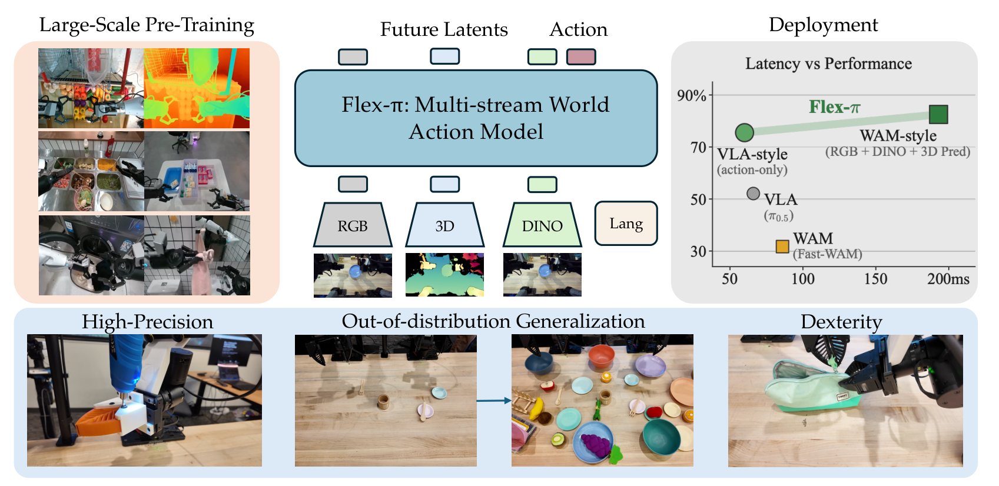
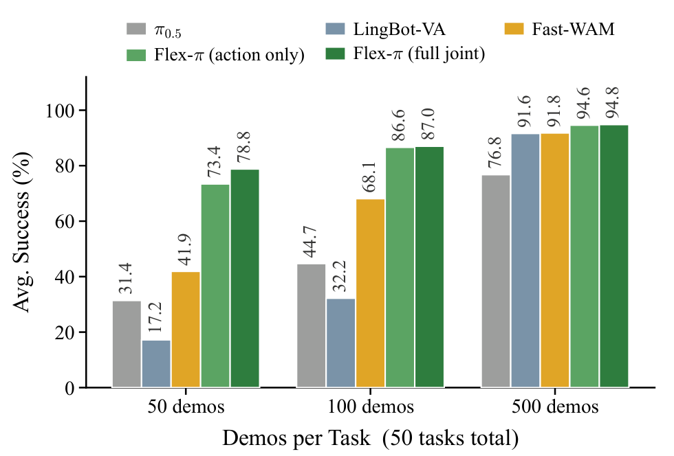
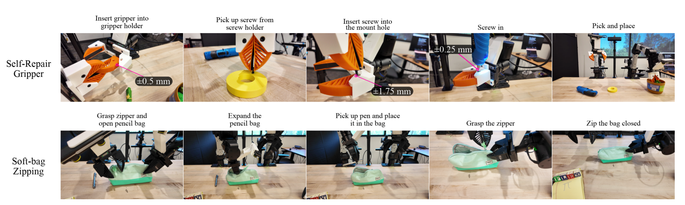
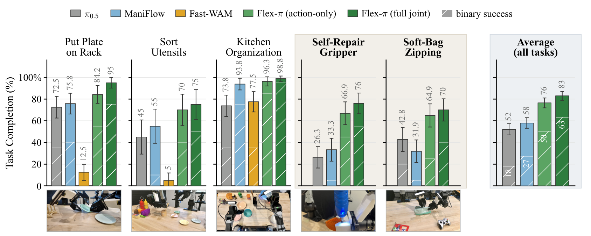
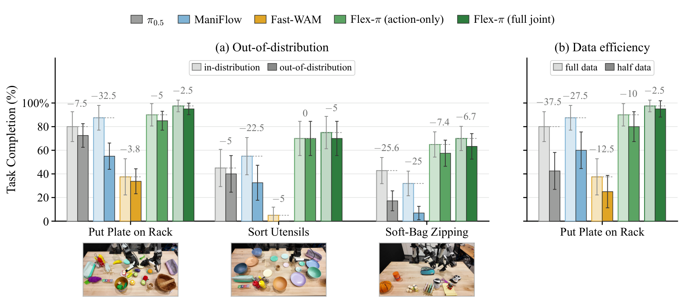
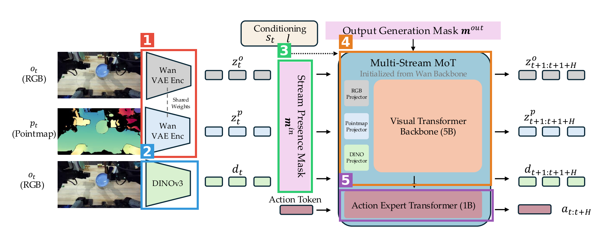
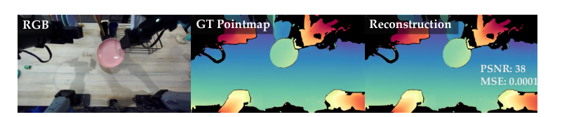
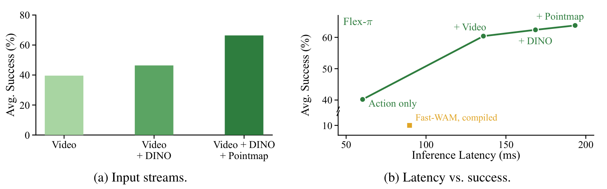
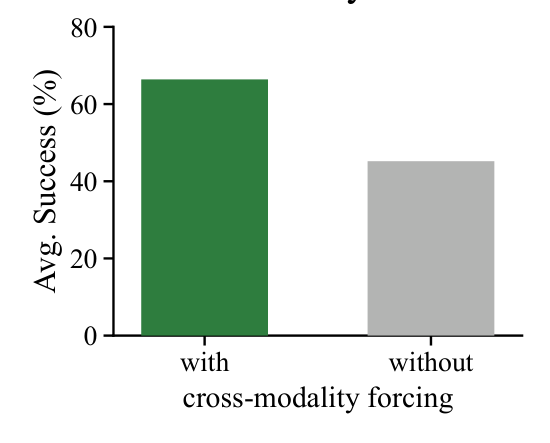

# Flex-π: A Multi-Stream World-Action Model with Compute Flexibility

| 项目 | 内容 |
|---|---|
| 题目 | Flex-π: A Multi-Stream World-Action Model with Compute Flexibility |
| 作者 | Ge Yan\*, Jinghao Liu\*, Yuzhi Fan\*, Lei Cai, Minwen Liao, Jesse Zhang†, Dieter Fox†（\*共同一作，†共同通讯） |
| 单位 | University of Washington；Dieter Fox 兼 Allen Institute for AI |
| arXiv | [2608.10860](https://arxiv.org/abs/2608.10860)（v2，2026-08-13） |
| 项目主页 | https://flex-pi.github.io/ |
| 代码 | https://github.com/geyan21/flex-pi （截至 2026-08-15 仅有 README，"code is ready soon"） |
| 精读日期 | 2026-08-15 |

**结构速览**

- §1 Introduction：WAM（world-action model）只预测 RGB latent 不够，本文加 3D 与语义监督且三不牺牲（不加传感器、不训新先验、不加推理延迟）。
- §2 Related Work：VLA / 视频预测式策略 / 多模态策略三条线的定位。
- §3 方法：3.1 三路视觉流（Wan-VAE 编码 RGB+pointmap、DINOv3 语义）与 MoT 骨干；3.2 双掩码流 dropout + cross-modality forcing；3.3 flow-matching 损失、AGIBOT World 预训练、推理。
- §4 实验：4.1 设置（RoboTwin / LIBERO(-Plus) / 真机 YAM）；4.2 真机五任务；4.3 真机 OOD 与数据效率；4.4 大规模仿真对比；4.5 消融（输入流 / 输出流 / cross-modality forcing / 去噪步数）。
- §5 结论与局限（收敛慢、full-joint 仍比同参数 VLA 慢、缺强 VLM 语义）。
- 附录：A 架构细节（本体感知编码、动作表示、action expert 重采样初始化、DINO x-prediction、注意力掩码规则）；B 预训练数据（AGIBOT World 500h + Depth Anything 3 离线标注）；C 真机平台（双臂 YAM，3×ZED 相机）；D 真机打分 rubric；E LIBERO 协议（仿真重渲染取深度）；F baseline 实现与延迟测量协议；G 补充实验（真机协议、深度输入消融、两个高难任务详解、消融/scaling 设置、完整 LIBERO(-Plus) 表）；H RoboTwin 50 任务逐任务表；I 推理优化（TensorRT / prefill-decode 分离的延迟阶梯）；J 训练超参。

---

## 第1章 · 作者与实验室背景评估

（联网调研于 2026-08-15；来源：项目主页、arXiv 作者检索、各作者个人主页、Google Scholar、GeekWire 报道。事实与推断分开标注。）

### 作者背景表（事实）

| 姓名                    | 身份/单位                                                                                         | 主方向                           | 代表作/前作                                                                                                                               |
| --------------------- | --------------------------------------------------------------------------------------------- | ----------------------------- | ------------------------------------------------------------------------------------------------------------------------------------ |
| **Ge Yan**（共一，领衔）     | UW CS PhD 二年级（导师 Dieter Fox），此前 UCSD MS（导师 Xiaolong Wang）；兼职 Toyota Research Institute LBM 团队 | 机器人基础模型、灵巧操作                  | ManiFlow（CoRL 2025 一作，即本文真机 baseline 之一）、DNAct（IROS 2025 Oral 共一）、GNFactor（CoRL 2023 Oral 二作）、Open X-Embodiment（ICRA 2024 最佳论文，合作成员） |
| **Jinghao Liu**（共一）   | UW Allen School 本科毕业生，即将入学 UCSD CS 硕士（导师 Xiaolong Wang）                                       | 机器人学习（自述）                     | 个人主页仅列本文。**首篇论文**                                                                                                                    |
| **Yuzhi Fan**（共一）     | 项目页标注 UW，无个人主页/Scholar/OpenReview 档案                                                          | 未找到                           | arXiv 检索仅返回本文。**极可能是首篇**（推断依据：无公开学术足迹）                                                                                               |
| Lei Cai               | 项目页标注 UW；同名个人网站显示为西雅图产品/UX 设计师，无学术发表记录（是否同一人未能 100% 确认）                                       | 未找到（学术）                       | 未找到                                                                                                                                  |
| Minwen Liao           | 项目页标注 UW，其余未找到                                                                                | 未找到                           | 未找到                                                                                                                                  |
| **Jesse Zhang**（共同通讯） | UW 博士后（导师 Dieter Fox + Abhishek Gupta）；PhD 来自 USC                                             | RL/技能学习 → 近年 VLA              | SPRINT、BOSS（CoRL 2023）、EXTRACT（CoRL 2024）、HAMSTER（ICLR 2025，与 Fox 合作的分层 VLA）                                                         |
| **Dieter Fox**（共同通讯）  | UW Allen School 教授、RSE Lab 负责人；曾任 NVIDIA 机器人研究高级总监，2025 年 7 月加入 Ai2 领导机器人 foundation model 团队 | 机器人感知与操作；概率机器人（MCL/SLAM）奠基人之一 | RVT / RVT-2（RSS 2024）、HAMSTER（ICLR 2025）、MolmoAct（2025）/ MolmoAct2（2026）、VLA-0                                                       |

### 实验室主方向判定（事实 + 推断）

**判定：传统强方向内的新延伸。** VLA/机器人操作是 Fox 谱系的传统强方向——近 5 年产出连续：RVT（CoRL 2023）→ RVT-2（RSS 2024）→ HAMSTER（ICLR 2025）→ MolmoAct（2025）→ MolmoAct2（2026），横跨 NVIDIA/UW/Ai2 三个平台（以上为事实，见各论文）。world-action model 子方向对 Fox 本人是近 1–2 年的延伸，但 UW 校内有直接前驱：UWM（Chuning Zhu et al., RSS 2025，UW WEIRD Lab + TRI）正是本文所属 WAM 范式的开创工作之一，出自 Abhishek Gupta 组——而 Gupta 是本文通讯 Jesse Zhang 的博后合作导师，Ge Yan 兼职的 TRI 也是 UWM 合作方（事实）。推断：Flex-π = Fox/Zhang 的 VLA 积累 × UW 校内 UWM 世界模型积累的交叉，非临时开辟的孤立方向。

### 水毕业风险信号核对（事实核对 + 推断）

| 信号 | 结论 | 依据 |
|---|---|---|
| 一作无相关积累？ | 不成立（内部有梯度） | 领衔共一 Ge Yan 有 CoRL/IROS 一作前作；但另两位共一均为首篇——"资深学生带新人"结构（推断） |
| 导师主业不在此方向？ | 不成立 | 两位通讯主业即 VLA/操作（HAMSTER、MolmoAct 系列） |
| 实验室无持续投入？ | 不成立 | 2023–2026 每年有旗舰产出；WAM 有校内 UWM 铺垫 |
| 单位无积累？ | 不成立 | UW + Ai2 + NVIDIA 西雅图渊源，一线单位 |

### 水平预判（推断）

不符合"水毕业"画像，更接近一线实验室在自家强方向上的旗舰投入：通讯组合是领域奠基级教授 + 活跃博后（本文兼有 Jesse Zhang 求职代表作属性，推断），领衔一作的 3D 操作背景（UCSD Xiaolong Wang 组）与本文"RGB+3D+语义多流"技术选型高度吻合。需留意：两位共一无前作、两位中间作者学术身份不明（其一疑似 UX/工程角色），工程与学术贡献分工不透明；6B 模型 + 真机资源来自 Ai2/TRI 生态，外部复现门槛高。预期水位：顶会主赛道竞争力工作（推断，依据以上证据）。

⚠️ 本章内容未进入第3章盲审上下文。

---

## 第2章 · 论文类型判定

**结论：a+b+c 集成创新型，外加两处原创机制**——把现成的视频生成模型（Wan-2.2）、DINOv3、Depth Anything 3、Mixture-of-Transformers 组装成多流 WAM；原创点一是"Wan-VAE 不经训练即可近无损编码 pointmap"这一发现（§3.1, Figure 3），二是双掩码流 dropout + cross-modality forcing 的训练方案（§3.2）。

组件清单（均为方法节实际承担流程环节、且在参考文献中真实被引的工作）：

| 组件 | 原论文 | 在本文中的角色 |
|---|---|---|
| Wan-2.2-5B 视频生成模型 | [Wan et al., 2025 (arXiv 2503.20314)](https://arxiv.org/abs/2503.20314) | 冻结 VAE 编码 RGB **和** pointmap 到同一 latent 空间；5B 骨干权重初始化视觉 trunk；自带 umT5 文本编码器做语言条件 |
| DINOv3 (ViT-B/16) | [Siméoni et al. (arXiv 2508.10104)](https://arxiv.org/abs/2508.10104) | 冻结编码器提供物体级语义 token 流 |
| Depth Anything 3 | [Lin et al. (arXiv 2511.10647)](https://arxiv.org/abs/2511.10647) | 离线为预训练数据三视角标注单目深度→pointmap（真机部署用 ZED 传感深度，不依赖它） |
| Mixture-of-Transformers | [Liang et al., TMLR 2025 (arXiv 2411.04996)](https://arxiv.org/abs/2411.04996) | 多流骨干架构：共享 attention、按模态分参数 |
| Flow matching / rectified flow | [Lipman et al., 2023 (arXiv 2210.02747)](https://arxiv.org/abs/2210.02747)、[Liu et al., 2023](https://arxiv.org/abs/2209.03003) | 所有流（含动作）的生成目标（Eq. 1/3） |
| UWM | [Zhu et al., RSS 2025 (arXiv 2504.02792)](https://arxiv.org/abs/2504.02792) | "联合去噪动作+未来观测能学到更好表征"的思想来源（论文明引） |
| DreamZero（"World action models are zero-shot policies"） | [Ye et al. (arXiv 2602.15922)](https://arxiv.org/abs/2602.15922) | 同上，视频骨干做 WAM 的路线来源 |
| Fast-WAM | [Yuan et al. (arXiv 2603.16666)](https://arxiv.org/abs/2603.16666) | action expert 的"重采样初始化"做法（§A.3 明确注明沿用）；也是主要 WAM baseline |
| x-prediction | [Salimans & Ho, 2022 (arXiv 2202.00512)](https://arxiv.org/abs/2202.00512)，经 [Li & He, 2025 (arXiv 2511.13720)](https://arxiv.org/abs/2511.13720) | 高维折叠 DINO 流不预测速度、直接预测干净特征（§A.4） |
| PixelUnshuffle | [Shi et al., 2016 (arXiv 1609.05158)](https://arxiv.org/abs/1609.05158) | DINO token 2×2 折叠降 4× token 数（§3.1/A.3） |
| AGIBOT World | [AgiBot-World-Contributors, 2025 (arXiv 2503.06669)](https://arxiv.org/abs/2503.06669) | 预训练数据：100 任务约 500 小时双臂操作数据 |

原创部分（论文未引外部来源、自证的）：

1. **Wan-VAE 免费编码 pointmap 的发现**（§3.1 Figure 3，PSNR 38 / MSE 1e-4）——整个"3D 监督零成本"故事的地基。
2. **双掩码（m_in / m_out）流 dropout + cross-modality forcing**（§3.2）——m_out 只是注意力掩码不是 loss 掩码，所有流每步都被去噪，这是"一个 checkpoint 任意输入/输出组合"的机制。相近思想（masked training、modality forcing）在 §2 引了 [Duisterhof et al. 2026 (arXiv 2606.13676)](https://arxiv.org/abs/2606.13676) 等，但这套具体方案是作者自己的。

疑似借鉴（论文未引用）：未发现明显该引未引的组件。

---

## 第3章 · 双盲评审 + Rebuttal

评审流程：净化文本（去除作者/机构/致谢/资助/主页 URL）→ 隔离上下文盲审 agent 初审 → 主 agent 以作者方身份 rebuttal（一轮）→ 同一盲审 agent 二轮回复 + 最终评级。以下为全流程原样记录。

### 3.1 初审意见（由隔离上下文的盲审 agent 独立生成，旗舰刊水位）

**Summary**：本文提出 FLEX-π，一个 6B 参数的 world-action model：利用冻结的 Wan-2.2 VAE 同时编码 RGB 和 3D pointmap（后者虽然 VAE 从未在其上训练过，但重建近乎无损），加上冻结的 DINOv3 语义特征，把三路视觉信号与动作放进 Mixture-of-Transformers 骨干联合去噪。训练时对视觉流做独立的输入/输出 dropout 并施加 cross-modality forcing，使单一 checkpoint 推理时可在 action-only 到全联合生成之间任选工作点。在 RoboTwin、LIBERO(-Plus) 和真实双臂 YAM 五任务上评测，声称真机以 2–6× 成功率优势超过 π0.5、ManiFlow、Fast-WAM，且 action-only 延迟低于 π0.5。

**Strengths**：

- 真实任务的难度与覆盖面是最有说服力的部分（±0.25–0.5 mm 插装、八阶段顺序任务、无稳定形态的软袋；Figure 19b 整任务成功率 55% vs π0.5 的 0%、ManiFlow 的 5%，这种量级不太可能由评测噪声解释）。
- "一个 checkpoint、任意输入输出组合"实用且执行到位（attention mask 而非 loss mask 的实现清晰，真机/仿真均确认两档来自同一 checkpoint 的运行时开关）。
- 实验协议披露诚实规范：baseline 数字来源逐一记录（§F.1）、真机 baseline 共享完全相同数据（§F.2）、rollout 间重新随机化且方法轮内交错（§G.1）、DAgger 修正用 ManiFlow 收集以避免偏向自身失败模式（§G.3）。
- 推理优化部分（§I）异常扎实：逐组件延迟阶梯、prefill 缓存导致 benchmark 虚快约 20 ms 的坑被主动指出并校正、TensorRT 数值误差端到端验证。这种系统层面的自我审查在同类论文中少见。
- 消融结构完整：输入流/输出流/cross-modality forcing/去噪步数各自独立消融，输出流消融正确固定同一 checkpoint。

**Weaknesses**：

- **W1 统计检验完全缺失，多个结论建立在噪声量级的差异上。** 全文无任何统计检验、置信区间或精确 P 值。真机每任务仅 10–20 rollouts，以下差异落在二项噪声范围内却被以结论语气表述：Kitchen Organization +5.0 分（98.8 vs 93.8）、"withholding depth costs nothing measurable"（95.0 vs 91.7）、full joint 对 action-only 的 +9.1%/+10%、LIBERO 99.2 vs 98.4–98.7 的排位。摘要的"2-6×"来自 n=20 的二值成功率之比。大差距和小差距被混在同一叙述强度里。
- **W2 所有配置均为单次训练，无 seed 重复。** "加 DINO 提升 6.8%"这类中等效应完全可能被训练随机性覆盖；cross-modality forcing 的 21% 差距较大但同样只有单次运行支撑——而这两个消融恰恰承载核心机制性结论。
- **W3 无代码、无 checkpoint、无数据发布声明。** 按 Science 家族政策，数据与核心代码公开是发表前置条件。附录披露详尽部分缓解，但不能替代可运行 artifact。
- **W4 "free lunch"核心观察证据单薄，先例未讨论。** 支撑只有 Figure 3 单样例（PSNR 38），无语料级聚合统计、无米制深度误差分布；用冻结 RGB VAE 编码深度图在扩散深度估计一线（Marigold 系）已是成熟做法，"surprising"名不副实；所引 Duisterhof et al. 2026 "modality forcing" 与本文机制命名几乎相同却从未讨论关系。
- **W5 速度结论与工程投入混淆。** 摘要称"running faster than π0.5"，但 §F.3 承认未固定各方法优化水平：FLEX-π 走了 TensorRT 全套优化栈，π0.5 按发布配置运行。这是部署栈层面而非模型层面的比较，摘要未携带该限定。
- **W6 baseline 协议不对称。** Fast-WAM 基于非量化判断被排除出两个最难任务；部分任务平均损害可比性；低数据档三个 baseline 由作者重训但未报告是否重新调参——"1.9–4.5×"数据效率结论正建立在这些点上。
- **W7 人工评分是否盲评未报告。** rubric 含主观条目（"place it cleanly"），交错评测控制了环境漂移但未控制评分者预期偏差。
- **W8 LIBERO 表述超出证据。** "one FLEX-π checkpoint outperforms all existing VLA or WAM methods with up to 99.2%"——99.2 来自专门去掉 stream dropout（放弃核心卖点）的 FLEX-π* 变体，且与 Qwen-RobotManip 是打平不是超越。

（另有 8 条 Questions 与 7 条 minor issues：含 §4.2 声称报告标准差但未见数值、Peebles & Xie 年份不一致、"MomloAct2"拼写、umT5 引用指向 UniMax 等。）

**初审评级：major revision。** 理由：执行水准很高的系统工作（真机大幅领先、单 checkpoint 灵活性、透明的推理优化分析），但核心机制是既有组件组合、最具新颖性色彩的观察证据单薄，且零统计检验、单 seed、评分未设盲、无 artifact，使多个次级结论不被数据充分支撑。

### 3.2 Rebuttal（主 agent 以作者方身份撰写，论据仅来自论文内部）

逐条回应（全文已发送给审稿人，此处录要点）：

- **W1**：承认无检验，同意次级结论降级；澄清一项事实——标准差以误差棒形式画在 Figure 6/9/17 中（净化文本不含图像故审稿人不可见），属呈现方式而非缺失，但误差棒不等于检验，核心批评成立。
- **W2**：承认。Figure 12 的 21 分差距大概率超出 seed 噪声，但 +6.8% 确在风险区间。
- **W3**：承认。仅指出附录披露密度体现可复现意图，不能替代 artifact。
- **W4**：部分承认（无聚合统计、"surprising"应弱化）；辩护：Duisterhof 已在 §2 被引用（未展开≠未引用）；贡献主体是"3D 监督进入策略学习目标且部署可丢弃"（Figure 11a 掉 20 分 + Figure 18 只掉 3.3 分的组合），这在深度估计先例中不存在，请求收窄批评范围。
- **W5**：承认摘要缺限定；辩护：§F.3 预先披露了协议选择、Fast-WAM 也获得 torch 编译优化（并报告加速后数字）、Table 10 A0 行给出本方法 eager 裸跑数据。
- **W6**：三个子项均承认；补充：三个 baseline 低数据档同时大幅落后且方向一致，"全部恰好欠调优"先验不高，500-demo 档引用各家自报数字仍领先。
- **W7**：承认，接受录像盲评修复方案。
- **W8**：承认 Intro 把两件事压缩成误导性一句；辩护仅在于 Table 2/§4.4 的数据呈现本身透明。
- **Q1–Q8**：全部如实回答，无一能提供论文外新证据。

**承认的批评清单（= 本文真正硬伤一览）**：

1. 全文零统计检验/CI/P 值；n=10–20 下的次级结论（Kitchen Org +5.0、深度可选 95.0 vs 91.7、full joint 增益 +9.1%/+10%、LIBERO 排位）超出证据强度。
2. 所有实验单 seed；DINO +6.8% 增益处于噪声风险区间。
3. 无代码/权重/数据发布声明（论文文本内）。
4. VAE-pointmap"免费午餐"仅单样例支撑，无语料级米制误差统计；措辞过强；与 VAE 编码深度先例及 Duisterhof et al. 关系未展开。
5. 摘要速度结论未携带"各按实际部署配置测量"的限定。
6. Fast-WAM 排除标准非预设；部分任务平均未标注；低数据 baseline 调参范围未报告。
7. 真机人工评分未报告是否设盲。
8. Intro 的 LIBERO 99.2% 表述需改写（来自放弃 dropout 的特化变体且系打平）。
9. RoboTwin 每任务评测 episode 数正文未写明。

### 3.3 审稿人二轮回复 + 最终评级

- **W1**：部分撤回事实性子项（接受"标准差在图中误差棒"的澄清，属评审载体盲区而非论文缺失）；核心批评全部维持，修订完成前仍是实质缺口。
- **W2**：维持（双方一致，修复未发生）。
- **W3**：维持（披露密度已在初审记为优点，但意图不能替代 artifact，发布兑现前不可关闭）。
- **W4**：部分维持——接受作者辩护，**批评范围收窄**至"观察自身的证据与措辞"，不否定组合贡献（Figure 11a + Figure 18）的成立；但收窄后仍是实质缺陷：摘要把该观察放在最显眼位置，证据密度与位置不匹配，且 Figure 18 一半又受 W1 约束。
- **W5**：部分维持——接受三点事实辩护，问题从"隐瞒"降为"摘要措辞未携带限定"（与初审定性一致），改写义务不变。
- **W6**：部分维持——确认"三 baseline 一致性"论证有分量，**不再怀疑数据效率结论的方向性**；但"1.9–4.5×"的倍数精度因调参范围未报告而不可核验。
- **W7**：维持（作者承认，待执行）。
- **W8**：维持核心（数据呈现透明的辩护成立，Intro 改写义务不变）。
- rebuttal 合规性：未使用论文外部信息或权威论证，无违规。

**最终评级：maintain major revision（维持初审评级）。** 审稿人理由原文要义："rebuttal 诚实且高质量，成功澄清两处事实并合理收窄 W4/W6，这使我确认证据链不存在'系统性不可信'——大效应结论（真机 2–6×、pointmap 消融 20 分、数据效率方向性优势）大概率稳健。但评级由缺口的封闭状态决定，而非承认态度：九项确认缺陷无一在本轮被新证据关闭，其中统计检验、多 seed、artifact 发布、盲评复核四项需实际工作而非改字。这些修订全部在本研究 scope 内可完成，完成后本文有清晰路径达到 minor revision 乃至录用水位。"

---

## 第4章 · 大白话：这篇文章在做什么

**场景**：教一台双臂机器人干精细活——把盘子插进碗架、给自己换夹爪并拧螺丝（间隙只有 ±0.25–0.5 毫米）、给软趴趴的笔袋拉拉链。这类活既要看得准（3D 几何），又要认得出东西（物体语义），还得动作快。

**之前的方法**：一类模型（world-action model, WAM）靠"边预测未来画面边出动作"来学得更快、泛化更好，但它们预测的只是 RGB 画面的压缩编码——那是为"重建像素"训练的，里面没有明确的 3D 几何和物体语义。想把几何/语义补上，按老办法就得加深度传感器、重新预训练视觉编码器、或者推理变慢，三样都很贵。

**本论文的方法**：发现了一个"免费午餐"——视频生成模型自带的图像压缩器（VAE）虽然只在 RGB 上训过，拿来直接压 3D 点图（pointmap）居然几乎无损。于是让模型同时预测未来的 RGB、3D、语义三路信号外加动作，一起训练；训练时随机"蒙住"某几路，逼模型学会从剩下的路脑补缺失的路。结果是一个 checkpoint 部署时随便挑档位：赶时间就只出动作（60 ms，比 π0.5 还快），要成功率就把三路未来全预测出来（193 ms，最准）。真机上比最强 baseline 成功率高 2–6 倍。

图内文字中文翻译（按阅读顺序）：左上粉框"**大规模预训练**"——AGIBOT World 数据里的 RGB 帧与对应 3D 点图；中间蓝框"**Flex-π：多流世界-动作模型**"——下方三个梯形是三路输入编码器（RGB、3D、DINO 语义），加一个"语言"输入；上方是模型产出的"未来 latent"（RGB/3D/语义三色小块）与"动作"（红色小块）。右上灰框"**部署**"——延迟 vs 性能散点图：横轴推理延迟（50–200 ms），纵轴成功率；绿线两端是 Flex-π 的两个档位——左端"VLA 式（只出动作）"又快又已经最准，右端"WAM 式（RGB+DINO+3D 全预测）"更准但更慢；下方两个孤点是 baseline：VLA（π0.5，约 52%）和 WAM（Fast-WAM，约 32%），都被绿线全面压住。底部蓝条三张实拍图：**高精度**（拧螺丝修夹爪）、**分布外泛化**（桌面从 3 件物体变成摆满杂物）、**灵巧性**（夹笔袋拉链）。

自查：不做机器人方向的人应能看懂——"预测未来帮助现在决策，三种未来比一种学得好，而且预测哪几种可以部署时现挑"。

---

## 第5章 · 实验

### 5.1 仿真实验

#### RoboTwin（双臂仿真，50 任务）

一句大白话：一对机械臂在桌面上做 50 种日常小任务（叠碗、递积木、按订书机、挂杯子……），有干净背景和域随机化两种考法。

条件：训练数据 2,500 条干净 + 25,000 条域随机化演示（每任务 50+500 条）；一个 checkpoint 同时微调所有任务。指标 = 成功率（%），每任务的成功判定由 benchmark 自带（出处：§4.4、Table 1、附录 H）。baseline 分两组：VLA（π0.5、X-VLA、Qwen-RobotManip）和 WAM（Motus、Fast-WAM、LingBot-VA (2.0)），均为公开发表数字。

主对比表（Table 1 汉化；Clean=干净背景，Rand.=域随机化，Avg=均值；每组每列最优加粗）：

| 方法 | Clean | Rand. | Avg. |
|---|---|---|---|
| **VLA 组** | | | |
| X-VLA (2025) | 72.9 | 72.8 | 72.9 |
| π0.5 (2025) | 82.7 | 76.8 | 79.8 |
| Qwen-RobotManip (2026a) | 93.7 | 94.0 | 93.9 |
| Flex-π（只出动作） | **94.5** | **94.6** | **94.6** |
| **WAM 组** | | | |
| Motus (2025) | 88.7 | 87.0 | 87.8 |
| Fast-WAM (2026b) | 91.9 | 91.8 | 91.8 |
| LingBot-VA (2026) | 92.9 | 91.6 | 92.2 |
| LingBot-VA 2.0 (2026) | 93.8 | 93.4 | 93.6 |
| Flex-π（全联合生成） | **94.3** | **94.8** | **94.6** |

注意两点：Qwen-RobotManip 的预训练语料约 38,100 小时，是本文（约 500 小时）的 76 倍，仍被 action-only 模式反超 0.7 个点（§4.4 原文）；两种模式打平（94.6），作者自己说这暗示该 benchmark 接近饱和。

**数据效率 sweep**（Figure 10，每任务 50/100/500 条演示，域随机化 50 任务平均；π0.5 / Fast-WAM / LingBot-VA 在 50/100 档由作者重训，500 档引公开数字，见 §F.1）：

| 每任务演示数 | π0.5 | LingBot-VA | Fast-WAM | Flex-π 只出动作 | Flex-π 全联合 |
|---|---|---|---|---|---|
| 50 | 31.4 | 17.2 | 41.9 | 73.4 | **78.8** |
| 100 | 44.7 | 32.2 | 68.1 | 86.6 | **87.0** |
| 500 | 76.8 | 91.6 | 91.8 | 94.6 | **94.8** |

低数据档位领先 1.9–4.5×，这是全文最能打的数字之一。

#### LIBERO / LIBERO-Plus（单臂仿真）

一句大白话：LIBERO 是单臂桌面任务集（四套件：空间关系 / 物体 / 目标 / 长程），几乎没有训练-测试分布差，测的是"模型拟合演示的能力"；LIBERO-Plus 把评测环境沿 7 个轴扰动（换相机、换机器人位姿、改语言、改光照、换背景、加噪声、改布局，共 10,030 个扰动任务），测鲁棒性。

条件：4 套件 ×10 任务 ×50 演示，微调一个 checkpoint，每任务 50 rollouts（LIBERO 共 2,000 集）。深度来自仿真器重渲染（§E）。Flex-π\* = 关掉流 dropout 微调的版本（dropout 略伤拟合能力，§4.4）。

LIBERO 总分（Table 2 汉化，完整分套件表见原文 Table 6）：

| 方法 | LIBERO 平均 |
|---|---|
| **VLA 组** | |
| π0.5 | 96.9 |
| GR00T-N1 | 93.9 |
| OpenVLA-OFT | 97.1 |
| MolmoAct2-Think | 98.1 |
| Qwen-RobotManip | **99.2** |
| Flex-π（只出动作） | 98.4 |
| Flex-π\*（只出动作） | 98.7 |
| **WAM 组** | |
| LingBot-VA | 98.5 |
| Fast-WAM | 97.6 |
| Flex-π（全联合） | 98.5 |
| Flex-π\*（全联合） | **99.2** |

LIBERO-Plus 总分（Table 7 汉化摘要，按扰动任务数加权）：Flex-π 全联合 80.9 / 只出动作 78.3，超过 Fast-WAM（65.3）和除 π0.5（84.7）、Qwen-RobotManip（91.4）外的所有 VLA。作者承认输给这两家，归因于对方有更强 VLM 骨干和多得多的机器人数据预训练（§4.4 末、§5 Limitations）。

场景图：论文未单独给 LIBERO/RoboTwin 场景图，RoboTwin 任务场景可见消融图注（§G.5 列了 5 个消融任务名）。

### 5.2 真机实验

平台：静态双臂 YAM（2×6-DoF 臂 + 平行夹爪，14 自由度），3 个标定 ZED 立体相机（头顶 ZED 2i + 双腕 ZED Mini），三视角拼成一张画布过一次 VAE；30 Hz 控制，单张 RTX 5090 上以 32 步 chunk 开环执行，每 1.07 s 重规划（§C）。每任务演示 152–802 集（1.2–11.8 小时，Table 5），Self-Repair Gripper 另有 570 集 DAgger 修正（用 ManiFlow 的失败 rollout 收的，避免偏向自家失败模式，§G.3）。评分用分阶段 partial-credit rubric（Table 3），10–20 rollouts/任务。

五个任务一句话：**Put Plate on Rack** 按下盘沿再抓起插进碗架；**Sort Utensils** 把餐具放到指定颜色盘子并把第二件竖插进筒；**Kitchen Organization** 一集连做四步（摆碗、递盘、插架）；**Self-Repair Gripper** 用电动螺丝刀给自己装夹爪、拧螺丝，八阶段严格顺序，插入间隙 ±0.25–0.5 mm；**Soft-Bag Zipping** 拉开软笔袋、装笔、拉上拉链（目标形状每次都变）。

（图内文字翻译，上排 Self-Repair Gripper 各阶段：把夹爪插进夹爪座（±0.5 mm）→ 从螺丝座拿起螺丝 → 把螺丝插进安装孔（±1.75 mm）→ 拧入（±0.25 mm）→ 抓放收尾；下排 Soft-bag Zipping：抓住拉链头拉开笔袋 → 撑开袋口 → 拿笔放入 → 再抓拉链头 → 拉上封口。）

主结果（Figure 6 汉化，task completion %，括号内为整任务二值成功率；'-' = Fast-WAM 因前三个任务表现太差未在两个高难任务上评测，§4.2）：

| 任务 | π0.5 | ManiFlow | Fast-WAM | Flex-π 只出动作 | Flex-π 全联合 |
|---|---|---|---|---|---|
| Put Plate on Rack | 72.5 | 75.8 | 12.5 | 84.2 | **95.0** |
| Sort Utensils | 45.0 | 55.0 | 5.0 | 70.0 | **75.0** |
| Kitchen Organization | 73.8 | 93.8 | 77.5 | 96.3 | **98.8** |
| Self-Repair Gripper | 26.3 | 33.3 | - | 66.9 | **76.0** |
| Soft-Bag Zipping | 42.8 | 31.9 | - | 64.9 | **70.0** |
| 五任务平均 | 52 (18) | 58 (27) | - | 76 (50) | **83 (63)** |

关键读数：任务越难差距越大——Self-Repair Gripper 上比最强 baseline 高 42.7 个点、Soft-Bag Zipping 高 27.2 个点；整任务成功率对 π0.5 是 3.5×、对 ManiFlow 是 2.3×。只出动作模式 60 ms/次（比 π0.5 的 66 ms 还快，Figure 15）就已在所有任务上全胜；全联合再花 3 倍延迟换 +13% 成功率。

**OOD 与数据减半**（§4.3, Figure 9）：换新物体+强杂物干扰下，Flex-π 全联合平均只掉 4.7 分（只出动作掉 4.1），而原本最强的 ManiFlow 掉 26.7 分（它还有深度输入！），π0.5 在没见过的软袋上掉 25.6 分。真机演示减半重训后，Flex-π 全联合仍超过所有用全量数据的 baseline。

项目主页：https://flex-pi.github.io/ （论文首页脚注给出，含全部真机 rollout 视频与 56 种部署配置的交互演示）。

### 5.3 为什么选这些实验

这些场景的共同特性与方法设计是逐条咬合的：

1. **高精度装配**（Self-Repair Gripper ±0.25–0.5 mm）吃的是 pointmap 流的显式几何——消融里去掉 pointmap 输入 RoboTwin 平均掉 20 个点（Figure 11a），真机上这正是领先幅度最大的任务（+42.7 分）。
2. **形变物体**（Soft-Bag Zipping，目标位形每 rollout 都变）吃的是 DINO 语义 + 联合预测未来：拉链头小、颜色和袋子接近，靠外观记忆的策略找不到它；π0.5 在这掉 25.6 分、ManiFlow 只完成 1/20 次。
3. **杂物/换物体 OOD**（Figure 9a）吃的是 cross-modality forcing 逼出来的"外观-几何-语义互相可预测"表征——作者的解释在 §4.3 末尾，证据是有深度输入的 ManiFlow 掉 26.7 分而 Flex-π 掉 4.7 分：优势不是"有 3D 输入"而是"训练目标里有 3D"。
4. **低数据档位**（RoboTwin 50 demos/任务：78.8 vs 最强 baseline 41.9）吃的是三路联合预测提供的额外监督——§4.3 原话"world-action 目标提供了本来要靠更多演示才能获得的监督"。

"该测但没测"的信号：
- **没有任何跨本体（cross-embodiment）或移动平台实验**——预训练与真机都是固定双臂，AGIBOT World 之外的数据配方没验证。
- **没测主流单臂真机基准生态**（如 DROID/ALOHA 类平台的公开任务），真机五任务全是自定义任务 + 自定义 rubric，无第三方可比数字（§F.2 也承认 YAM 平台无公开数字，全部 baseline 由作者自己训练部署）。
- **LIBERO-Plus 上输给 π0.5 和 Qwen-RobotManip** 被如实报告了，但语义/语言侧的短板（Robot 扰动轴只有 53.1，对 π0.5 的 76.8）没有进一步实验探究。
- 长时程移动操作、语言复杂指令等 VLM 强项场景整体缺席——与其"補 VLM 骨干"的 future work 表述一致，选题避开了自己的弱区。

### 5.4 复现可能性（硬核查）

逐项核查（核查日期 2026-08-15）：

| 项目 | 状态 | 证据 |
|---|---|---|
| 代码仓库 | **存在但为空壳**：仅 1 个 README.md，写明 "The code is ready soon... will push the training and inference code, along with pre-trained checkpoints"，最后 push 2026-08-12 | github.com/geyan21/flex-pi 文件列表实查 |
| ckpt：AGIBOT 预训练 6B | 未发布 | repo 无 release/权重；README 只有承诺 |
| ckpt：RoboTwin / LIBERO / 真机各微调 | 逐场景均未发布 | 同上 |
| 预训练数据 | AGIBOT World-Beta 本身公开（第三方数据集）；但本文的采样清单（每任务前 285 集）、重切分脚本、DA3 pointmap 标注管线未发布 | §B 有文字描述，无代码 |
| 真机数据 | 未发布（152–802 集/任务，Table 5 只有统计量） | 论文附录 Table 5 |
| 仿真 benchmark | RoboTwin 2.0 / LIBERO / LIBERO-Plus 均公开 | 各自原文 |
| 学习率 / 优化器 / schedule | 有：AdamW β=(0.9,0.95)，lr 1e-4，cosine + 5% warmup，weight decay 1e-2，clip 1.0，bf16，ZeRO-1 | 附录 J Table 12 |
| 流配置 | 有：loss 权重全 1、flow shift 6.0/1.0、DINOv3 ViT-B/16、pointmap 2 m 截断、128 umT5 token、dropout 概率 0.5 | 附录 J Table 12 |
| batch size | **未给出**（Table 12 caption 称"per-domain values are given in the last group"，但表内实际没有 batch size 条目） | 附录 J Table 12 实查 |
| 训练 epoch 数 | 部分：消融 5 epochs（§G.5）、真机微调"至少 10 epochs"（§5 Limitations）；预训练与各主实验的确切 epoch/步数**未给出** | §G.5、§5 |
| 硬件与训练时长 | **未给出**：只知致谢提到 UW Hyak/Tillicum 集群；推理是 1×RTX 5090（§I），训练 GPU 型号/数量/时长无 | 致谢、§I |
| 数据切分格式 | 预训练重切分规则有文字描述（§B）；真机 DAgger 混合比例、train split 细节部分有（§F.2"identical dataset"）但无格式规范 | §B、§F.2 |
| 推理栈 | 复现延迟数字所需的 TensorRT/编译配置有详细文字（§I，含"什么没用"），无代码 | §I |

**结论：难以复现**（以当前状态）。缺失项：① 代码与全部 checkpoint（repo 空壳）；② batch size；③ 预训练/主实验确切训练步数与硬件时长；④ AGIBOT 采样与 DA3 标注管线脚本；⑤ 真机数据与任务资产（3D 打印夹爪座等无 CAD 发布）。若代码+权重如 README 承诺发布，仿真部分可望升到"需自行补齐细节"（超参表相当详细、baseline 来源逐一注明是加分项）；真机部分因平台与数据私有，本质不可复现，只能复现"方法在自己平台上的版本"。

---

## 第6章 · 方法拆解

方法总览图（Figure 2）标注版——五个色框对应下面五个块：

🟥 **红 1 · Wan-VAE 双编码器（冻结，共享权重）**
- 来源：[Wan-2.2-5B](https://arxiv.org/abs/2503.20314) 视频生成模型自带的 VAE；"能直接编码 pointmap"是本文原创发现（Figure 3：PSNR 38，MSE 1e-4，见下图）。
- 接口：进——当前时刻 RGB 图 `o_t` 和 pointmap `p_t`（真机 = ZED 深度 + 内参反投影；预训练数据 = Depth Anything 3 离线标注；三视角拼一张 384×320 画布）；出——RGB latent token 流 `z^o_t` 和 pointmap latent 流 `z^p_t`，同一 latent 空间。
- 训练时：全程冻结，不训。pointmap 按 2 m 截断。
- 部署时：同样冻结前向；解码器只在需要看生成的未来画面时才用（部署只取动作时未来 latent 根本不回传主机，§I）。

🟦 **蓝 2 · DINOv3 语义编码器（冻结）**
- 来源：[DINOv3 ViT-B/16](https://arxiv.org/abs/2508.10104)。
- 接口：进——同一张 RGB `o_t`；出——语义 token 流 `d_t`：768 维 patch token 经 2×2 [PixelUnshuffle](https://arxiv.org/abs/1609.05158) 折叠成 3072 维，token 数省 4× 且可逆无损（§A.3）。
- 训练/部署均冻结。因折叠后维度太高，这一流的未来预测用 x-prediction（直接预测干净特征再换算成速度，§A.4），其余流用标准速度预测。

🟩 **绿 3 · 流存在掩码 m_in + 全局条件**
- 来源：作者原创训练方案（§3.2）；条件通路沿用 Wan 的 umT5 文本编码器。
- 接口：进——三路视觉流 + 语言指令 `l`（128 umT5 token）+ 本体感知 `s_t`（32 维标准布局经一层线性映射成 1 个 token 拼进语言序列，§A.1）；出——被选中的流进骨干，被丢的流 token 置零。
- 训练时：每个视觉流独立以 0.5 概率丢弃（拒绝采样保证至少留一路）；被丢的流**输出端照样去噪、照样算 loss**——这就是 cross-modality forcing：模型被逼着从剩下的流脑补缺失流的未来。
- 部署时：变成运行时开关——同一 checkpoint 靠传参决定用哪些输入。

🟧 **橙 4 · Multi-Stream MoT 视觉骨干（5B，可训）+ 输出掩码 m_out**
- 来源：[Mixture-of-Transformers](https://arxiv.org/abs/2411.04996) 架构 + Wan-2.2-5B 权重初始化。
- 接口：进——三路当前 token 流（各自过 per-stream projector）+ 条件；出——三路未来 latent `z^o、z^p、d`（各 2 个未来 latent 帧，覆盖 32 步动作的同一时间窗，§A.2），经各自输出头以 flow matching 去噪。
- 结构：30 块，只有中间 16 块开跨流注意力（早期编码、后期解码各流独立）；attention 共享、FFN/norm 按模态分开。m_out 决定"哪些未来流互相可见、动作读哪些"，但**不是 loss 掩码**——每个流每个样本都被监督（§3.2/A.5）。
- 训练时：数据 = AGIBOT World 100 任务约 500 小时（按语言标注边界重切分，§B）；loss = 四路 flow-matching 损失等权求和（Eq. 3，λ 全为 1）。
- 部署时：K=4 步 Euler 积分；动作不读的未来流直接从序列里删掉，省算力。

🟪 **紫 5 · Action Expert Transformer（约 1B，可训）**
- 来源：π0 系的 action expert 思路，初始化用 [Fast-WAM](https://arxiv.org/abs/2603.16666) 的重采样法——头数(24)/头维(128)/深度(30)与骨干对齐，残差/FFN 宽度缩小（1024/4096 vs 3072/14336），Wan 权重经 1D 线性插值缩放而来（§A.3）。
- 接口：进——32 个动作噪声 token（一层线性嵌入，不离散化）+ 单向交叉注意力读当前观测 token 和 m_out 允许的未来流 token（视觉 token 永远不回看动作，所以部署可整体丢掉动作外的一切）；出——H=32 步动作 chunk（32 维标准布局：双臂 EE 位姿 6D 旋转 + 夹爪 + 关节角，真机取相对首帧锚点的 body-frame 表示，§A.2）。
- 训练时：与视觉流同一 flow-matching 损失（flow shift 1.0，视觉流 6.0）。
- 部署时：30 Hz 执行全部 32 步再重规划（真机开环 1.07 s/chunk）；action-only 模式用 KV 缓存 prefill 387 个锚 token，每步只去噪 32 个动作 token → 60 ms/次（RTX 5090 + 编译优化，§I）。

**接口自查（首尾相接）**：相机 RGB+深度 →（🟥🟦）三路 token 流 →（🟩）掩码选流并注入语言/本体条件 →（🟧）MoT 联合去噪出三路未来 latent →（🟪）动作 expert 边读当前与未来边去噪出 32 步动作 → 机器人 30 Hz 执行 → 新观测回到起点。串联完整，无断点。

---

## 第7章 · 消融

消融统一设置（§G.5）：RoboTwin 5 任务（lift_pot、place_shoe、pick_diverse_bottles、place_object_basket、stack_bowls_two）、每任务 50 演示、从头训 5 epochs、域随机化评测。

**① 输入流消融（Figure 11a）**——训练时给模型看哪几路：

| 配置（人话） | 平均成功率 | takeaway |
|---|---|---|
| 只看视频（RGB） | ~40% | 基线：和现有 RGB-only WAM 同款配置 |
| 视频 + DINO 语义 | ~46% | 语义流贡献 +6.8 个点 |
| 视频 + DINO + pointmap | **~66%** | 3D 流再贡献 +20 个点，**是最大单项**——几何信息对操作任务的价值远超语义 |

**② 输出流消融（Figure 11b，同一 checkpoint 只变推理档位）**——RGB-only 输入下推理时生成哪几路未来：

| 推理档位（人话） | 成功率 | 延迟 |
|---|---|---|
| 只出动作，不想象未来 | 40.2% | ~60 ms |
| 额外想象未来视频 | 60.4% | ~136 ms |
| 再加想象 DINO 语义 | ~63% | ~168 ms |
| 三路未来全想象 | **63.8%** | ~193 ms |
| （对照）Fast-WAM 编译版 | 10.0% | 90 ms |

takeaway：推理时"想象未来"本身值 20+ 个点；一个 checkpoint 横跨 3× 延迟、24 个点的操作区间，档位部署时现选。

**③ Cross-modality forcing 消融（Figure 12）**——两个模型都看全三路输入，只差训练规则：

| 配置（人话） | 平均成功率 | takeaway |
|---|---|---|
| 有 cross-modality forcing | ~66% | — |
| 训练时不逼模型脑补被丢的流 | ~45% | **去掉掉 21 个点**：收益主要不是"容忍缺传感器"，而是逼出"外观-几何-语义互相可预测"的表征 |

**④ 去噪步数消融（Table 11 汉化，action-only，RTX 5090）**：

| Euler 步数 K | 延迟 (ms) | Clean | Rand. | takeaway |
|---|---|---|---|---|
| 10 | 85 | 93.5 | 93.6 | 多花钱不多办事 |
| 4 | 60 | **94.5** | **94.6** | 峰值，全文默认 |
| 2 | 53 | 93.7 | 93.9 | K≥2 都在峰值 1 分以内 |
| 1 | 49 | 51.0 | 52.9 | 单步崩盘（掉 40+ 个点） |

**⑤ 真机深度输入消融（§G.2, Figure 18）**：Put Plate on Rack 全联合模式，有深度输入 95.0 vs 没有 91.7——深度**传感器**部署时可选（掉 3.3 个点），但 pointmap **训练流**不可选（去掉训练里的 pointmap 掉 20 个点，①）。这一对数字是"free lunch"故事的收口。

消融覆盖了方法的每个新增件（两路新流、forcing 机制、推理档位），缺口是没有消融 MoT vs 单塔共享参数、以及 m_out 采样概率的敏感性——属于次要缺口。

