# Galaxea G0.5: One Autoregressive Stream for Robot Reasoning and Action

| | |
|---|---|
| **题目** | Galaxea G0.5: One Autoregressive Stream for Robot Reasoning and Action |
| **作者** | Galaxea Team（公司团队署名；Project lead: Yicheng Liu；Project PI: Hang Zhao，名单见论文第 25 页 Contributors 节） |
| **arXiv** | [2608.11739](https://arxiv.org/abs/2608.11739)（v1, 2026-08-12, cs.RO） |
| **项目主页** | https://opengalaxea.github.io/G05/ |
| **代码** | [OpenGalaxea/GalaxeaVLA](https://github.com/OpenGalaxea/GalaxeaVLA)（405 个文件的实质仓库） |
| **权重** | [HuggingFace OpenGalaxea/G05](https://huggingface.co/OpenGalaxea/G05)（g05-base / droid / libero / robotwin20 / so101 + action_tokenizer.pt） |
| **精读日期** | 2026-08-15 |

**结构速览**（每节在干嘛）：

- §1 Introduction：立论——VLA 应该让 VLM 亲自当"决策者"（自回归输出动作），而不是当外挂 flow-matching 专家的"条件编码器"。
- §2 Related Work：三条线梳理——VLM-as-encoder vs VLM-as-actor 之争（2.1）、动作 tokenization 三代演进（2.2）、VLA 里的 CoT 两派（2.3）。
- §3 Model Design：三大组件——跨本体 ActionCodec 动作分词器（3.1）、原生 CoT 推理流（3.2）、视觉记忆模块（3.3）。
- §4 Pre-training：14 种本体的机器人数据 + Web/VQA 混合共训；自动标注流水线；8 种 CoT 格式加权采样。
- §5 Experiments：七个评测场景——DROID 零样本迁移（5.1）、三个仿真套件（5.2）、BEHAVIOR 长程挑战赛（5.3）、真机微调（5.4）、自建 Pick-and-Place 语言跟随基准（5.5）、CoT/动作头零样本探针（5.6）、GRPO 强化学习微调（5.7）。
- §6 Conclusion：总结三条"结构性优势"证据 + 承认两个失败模式（半透明抽屉定位、记忆只有几秒）。
- §7 Contributors：贡献者名单。
- Appendix A：BEHAVIOR 50 任务逐项分数（Table 6）、RoboTwin 2.0 50 任务逐项分数（Table 7）。

---

## 第1章 · 作者与实验室背景评估

### 事实（发表记录与公开信息）

**署名主体**：论文以 "Galaxea Team" 公司团队署名，无传统一作。Contributors 节（第 25 页）列出 Project lead 为 Yicheng Liu，Project PI 为 Hang Zhao。

**Hang Zhao（通讯/PI）**：清华大学交叉信息研究院（IIIS）助理教授，MARS Lab 负责人；MIT 博士（2019，导师 Antonio Torralba）；[Galaxea AI（星海图）联合创始人](https://www.forbes.com/sites/ywang/2025/08/25/the-700-million-chinese-robot-startup-that-wants-to-take-on-tesla/)。研究方向：多模态学习、自动驾驶（VectorNet、DriveVLM 等）、机器人。

**Yicheng Liu（项目负责人）**：MARS Lab 出身，此前一作代表作为自动驾驶方向的 [VectorMapNet（ICML 2023）](https://github.com/Tsinghua-MARS-Lab/vectormapnet)；VLA 方向一作 [FASTer（ICLR 2026）](https://arxiv.org/abs/2512.04952)——即本文动作分组策略的来源。

**公司背景**：Galaxea AI（星海图）是估值约 7 亿美元的具身智能公司（Forbes 2025-08 报道），自研 R1 / R1-Lite / R1-Pro 机器人本体——本文的两个真机平台就是自家产品。

**该方向的持续投入（近两年论文链）**：
- [Galaxea G0 + Open-World Dataset（arXiv 2509.00576, 2025-09）](https://arxiv.org/abs/2509.00576)：双系统 VLA + 500 小时开源数据集
- [ActionCodec（arXiv 2602.15397, 2026-02）](https://arxiv.org/abs/2602.15397)：本文动作分词器的训练配方来源
- [FASTer（ICLR 2026）](https://arxiv.org/abs/2512.04952)：本文动作分组策略来源
- [Fast-WAM（arXiv 2603.16666, 2026-03）](https://arxiv.org/abs/2603.16666)：世界动作模型，本文 baseline 之一
- 本文 G0.5（2026-08）

**开源记录**：G0 时代已开源模型权重 + 500 小时数据集；G0.5 的代码仓库、5 个 checkpoint、动作分词器权重均已上线（详见 5.4 节核查）。

### 判定：传统强方向还是新开方向？

**对公司而言是核心主业**：Galaxea 从 G0 → G0Plus → G0.5 的产品线迭代清晰，VLA 就是这家公司的命根子，投入是全职、持续、带硬件闭环的。
**对 MARS Lab 而言是新开方向**（约 2024 年起从自动驾驶/多模态转入机器人），但两年内密集产出了 FASTer / ActionCodec / Fast-WAM / G0 系列一整条技术栈，且核心成员（Yicheng Liu、Zibin Dong、Tianyuan Yuan）在各环节论文间反复出现——是"新开但重仓"的方向。

### 水平预判（推断，注明依据）

**水毕业风险：几乎为零。** 依据：这不是学生毕业论文，而是公司旗舰技术报告；一作（项目负责人）有 ICML/ICLR 一作积累且 FASTer 正是本文的直接前置；PI 深耕多模态十余年且是公司创始人；自家硬件 + 自建数据 + 开源生态是长期战略投入，不存在"凑一篇毕业"的动机结构。
**需要留意的偏向**（推断）：公司技术报告的天然倾向是把整系统优势讲成方法论优势——评测中 G0.5 的预训练数据含自家 R1 本体而 baseline 没有，这类"主场优势"在第3章盲审中被作为核心问题点名（W1）。

---

## 第2章 · 论文类型判定

**结论：a+b+c 型组合创新**——把「FASTer 的动作分组 + ActionCodec 的 RVQ 训练配方」「ECoT 一脉的同流 CoT」「π0.7/MEM 的视觉记忆」三块成熟组件，装配到 Qwen3.5 2B 底座上，用"单一自回归流 + 单一 cross-entropy"的极简训练框架统一起来。原创性主要在**工程整合与规模化验证**（跨本体统一 27 维动作空间、active-part 稀疏预测、8 种 CoT 模板的推理期切换），而非某个单点新机制。

### 组件清单（均为论文方法节实际引用并承担流程环节的工作）

| 组件 | 原论文 | 在本文中承担的角色 |
|---|---|---|
| Qwen3.5 2B | [Qwen Team, 2026](https://qwen.ai/blog)（论文 [30]） | VLM 底座：视觉编码器 + 共享词表 + 自回归解码器（§3 开头） |
| FASTer | [ICLR 2026, arXiv 2512.04952](https://arxiv.org/abs/2512.04952)（论文 [33]） | 动作按身体部位分组（left/right/lower body）的策略（§3.1） |
| ActionCodec | [arXiv 2602.15397](https://arxiv.org/abs/2602.15397)（论文 [32]） | 动作分词器训练配方：残差向量量化 RVQ + 时间对比损失（§3.1） |
| π0.5 action expert | [arXiv 2504.16054](https://arxiv.org/abs/2504.16054)（论文 [4]） | 可选的 flow-matching 动作头架构（仅用于对照实验与可选部署，§3） |
| π0.7 + MEM | [arXiv 2604.15483](https://arxiv.org/abs/2604.15483) / [arXiv 2603.03596](https://arxiv.org/abs/2603.03596)（论文 [34][10]） | 视觉记忆：ViT 内每 4 层插入时空分解注意力（§3.3，明说 "we follow π0.7 and MEM"） |
| TraceVLA | [ICLR 2025, arXiv 2412.10345](https://arxiv.org/abs/2412.10345)（论文 [29]） | CoT 四原语之一"2D 末端轨迹 Trace"的灵感来源（§2.3） |
| ECoT | [arXiv 2407.08693](https://arxiv.org/abs/2407.08693)（论文 [27]） | "推理与动作共享同一 AR 解码器"的路线先例，本文自认 closest in spirit（§2.3） |
| GRPO / RLinf | [arXiv 2402.03300](https://arxiv.org/abs/2402.03300) / [arXiv 2509.15965](https://arxiv.org/abs/2509.15965)（论文 [60][61]） | §5.7 RL 实验：AR 用 GRPO，FM 侧用 RLinf 的 SDE 似然近似 |
| SAM3 / Gemini 3 / Doubao Seed 2.0 | [arXiv 2511.16719](https://arxiv.org/abs/2511.16719) 等（论文 [35][36][37]） | 自动标注流水线：bbox/掩码追踪 + 语言标注生成（§4） |

**疑似借鉴（论文未引用）**：未发现明显案例——论文的引用较为齐全，连"AR 不是瓶颈"这一命题的先例（VLA-0、Knowledge Insulation）都主动交代了。

---

## 第3章 · 双盲评审 + Rebuttal

> 净化说明：评审文本由 `_work/sanitized.txt` 生成——删除了公司品牌、团队署名、Contributors 节、项目主页 URL，并匿名化了参考文献中与本文贡献者重合的自引条目（[16][32][33]）的作者名单。评审 agent 禁网、上下文中无第1章调研内容。

### 3.1 初审意见（由隔离上下文的盲审 agent 独立生成，原样收录）

**Summary**：本文提出 G0.5，一个 2B 规模的自回归 VLA：以 Qwen3.5 2B 为骨干，将推理（Subtask/BBox/Trace/ActionHint 四类 CoT）与动作（经跨本体 RVQ ActionCodec 压缩的离散动作码）统一在同一条 next-token 流中，用单一 cross-entropy 目标联合训练，辅以视觉记忆模块。核心论点是：VLA 的正确路线是让 VLM 保持"actor"身份（AR 统一流），而非将其降级为外挂 flow-matching 专家的条件编码器。实验覆盖七个场景。

**Strengths（摘要）**：
1. **评测广度与物理世界验证扎实**——七个 regime 覆盖三个真机平台、一个有外部排行榜的公开挑战赛（BEHAVIOR）与三个标准仿真套件，DROID 明确做了环境级与物体实例级 held-out。
2. **AR vs FM 对照设计思路正确**——同一 checkpoint 上仅切换推理期配置，两个头共享 trunk 与 post-CoT hidden state，并人工核对了两头 CoT 质量以排除混淆。
3. **方差控制实践良好**——PP Bench 配对协议、真机交错评测。
4. **披露相对诚实**——主动报告多处对己不利的结果（无标记抽屉 60% 低于 π0.5 90%、box stacking 输给 π0.5 等）。
5. **Related work 定位清晰**——诚实交代"AR 不是瓶颈"已有 VLA-0 等先例。

**Weaknesses（全文收录）**：

**W1（核心结论的混淆变量未被控制）**：标题级 claim 是 AR 统一流的"structural rather than incidental advantage"，但支撑数字全部来自跨模型比较——骨干 VLM（Qwen3.5 2B vs PaliGemma）与预训练语料（含 R1 本体的 14 本体自建数据 vs 各自数据）同时不同。真机 76.7% vs 53.3% 与 PP Bench 零样本 65.6% vs 0.0% 在很大程度上可由"G0.5 预训练见过 R1 本体而 π0.5 没有"解释——论文自己在 §5.5 也承认这一点，却在 Conclusion 中仍把它列为结构性优势的第一条证据。唯一真正控制了骨干与数据的比较是 §5.6/5.7，但见 W2。

**W2（关键机制实验样本量过小且无统计检验）**：§5.6 长程任务每 cell 仅 n=5，Finding 2 的核心数字在 n=5 下不具备统计可分辨性；§5.7 GRPO 标注 "mean ± std over seeds" 但从未报告 seed 数，四个任务是事后挑选且未给任务名；全文无任何检验统计量、P 值或置信区间；RoboTwin 93.3 vs 92.2、LIBERO 98.9 vs 98.7 这类 SOTA claim 无误差棒无法与噪声区分。

**W3（headline 数字包含对己方定制的环境改造）**：主评测中在抽屉内壁与底部贴了橙色高对比标记卡，原因是无标记时 G0.5 仅 60%（π0.5 90%、MolmoAct2 80%），加标记后 G0.5 升至 100% 而 π0.5 基本不变。摘要与 Fig. 6 的 82.5% 建立在为修复 G0.5 特定失败模式而改造过的环境上。披露值得肯定，但把改造后配置作为 headline 属于选择性报告。

**W4（核心组件缺乏消融，归因靠叙事）**：(a) ActionCodec 无 vs FAST/FAST+ 对比、无重建误差、无 active-part 或时间对比损失开关消融，R、chunk 长度 H、码本大小等超参未给出；(b) 视觉记忆的收益归因（§5.3.2）没有 memory on/off 消融支撑，纯属叙事——BEHAVIOR 后训练用的还是单帧输入；(c) Fig. 1 右上的 "Trains better" 收敛面板与延迟面板（FM 190ms vs AR w/ CoT 192ms）在正文中找不到对应实验。

**W5（可复现性不满足发表前置条件）**：预训练语料规模（小时/episode/各本体占比）、VQA 混合比、训练步数与算力全部未披露（仅 "trained until convergence"）；无可用性声明，"the pretrained backbone we release" 为将来时承诺；BEHAVIOR 的 π0.5 基线由作者自行训练、GR00T-N1.7 仅 24.4% 的异常低分均缺基线调优说明。

**W6（§5.6 中 FM 头本身的公平性存疑）**：作为对照的 flow-matching 头是"optional at inference"的附加模块，训练方式未交代。若它只是次要附件，则 AR>FM 结论可能反映的是"训得不充分的 FM 头"而非 FM 范式——这直接削弱唯一受控的机制证据。

**Questions（8 条，摘要）**：预训练数据规模与算力；Fig. 1 两面板的实验锚点；GRPO seed 数与任务清单；§5.6 扩样本后 Finding 2 是否反转；DROID 无标记完整数字；FM 头训练细节；GR00T 基线调优投入；ActionCodec 超参与 vs FAST+ 对比。

**Minor issues（摘要）**：首页图注编码乱码；摘要把 progress score 0.314 写成 31.4% 与成功率并列（口径混用）；Table 6 两次 eval run 个别任务波动剧烈；30% 历史帧 drop 概率应写进方法节；SimplerEnv 基线数字"从其他文献汇编"的协议一致性应列明。

**初审评级：major revision**——"G0.5 是一个强模型"这一弱化结论得到较好支撑，但论文实际主张的"AR 结构性优于 FM"依赖被骨干与预训练数据混淆的跨模型比较，唯一受控的机制实验 n=5 且 FM 头公平性存疑，三个核心组件消融不全，加之无统计检验、预训练规模未披露。所列缺口均可在本研究 scope 内封闭；若能封闭 W1–W4，评级可上调。

### 3.2 Rebuttal（主 agent 以作者方身份撰写）

对 W1–W6 的完整回应已发送（全文见上方对话记录），立场概括：

- **W1 部分承认**：Conclusion 措辞（"structural rather than incidental"、"apples-to-apples"）超出跨模型比较可支撑范围，承认；但 §5.4 匹配协议（同数据/同 16 GPU/同 wall-clock/交错评测）与 §5.3（π0.5 拿到 4 倍 epoch）在"整系统比较"意义上是尽力公平的。
- **W2 全部承认**：附量化背景——DROID n=100 下 +25pp 差距显著（SE≈5pp）、PP Bench n=64 配对，这两处排序结论稳健；但不能替代正式检验。
- **W3 承认**：附重算——按无标记 60% 替换后 10 任务平均 82.5%→78.5%，与 π0.5（57.5%）排序不变。
- **W4 一处更正 + 大部承认**：CoT 组件并非零消融（§5.6 四格对照 + Table 5 三档 referring-context 消融），"三个组件零消融"表述不准确；codec 与 memory 无消融、Fig. 1 两面板无锚点，承认。
- **W5 部分承认**：数据规模等披露缺失承认；但"发布"并非空头——正文两处 "we release" + 被遮蔽的项目主页实际已公开代码与权重（此论据被评审按双盲规则判为无效，见 3.3）。
- **W6 承认 + 范围澄清**：§5.7 中 AR/FM 联合后训练且初始成功率可比（62.5% vs 63.0%），该实验起点公平；§5.6 的 FM 训练细节缺失承认。

**⚠️ 承认的批评清单（= 本文真实硬伤一览）**：

1. **Conclusion 的"结构性优势"论断超出证据支撑范围**——跨模型比较被骨干与预训练数据混淆，PP Bench 零样本优势部分来自"预训练见过自家 R1 本体"（W1）。
2. **§5.6 机制实验每格仅 n=5，Finding 2（AR 比 FM 更听 CoT 的话）有反转可能**；§5.7 seed 数与任务清单未报告；全文无置信区间/统计检验（W2）。
3. **DROID 的 82.5% headline 包含为修复自家失败模式而贴的高对比标记卡**，无标记补测未完成（W3）。
4. **ActionCodec 与视觉记忆两大组件零消融**，§5.3.2 的收益归因是叙事不是实验；Fig. 1 的 "Trains better" 与延迟面板在正文无实验锚点；R/H/码本大小等关键超参缺失（W4）。
5. **预训练数据规模、VQA:action 混合比、训练算力全部未披露**；两个自训基线（BEHAVIOR π0.5、真机 GR00T-N1.7）的调优投入披露不足（W5）。
6. **§5.6 所用 FM 头的训练充分性无文内证据**，其作为 FM 范式代表的公平性未论证（W6）。

### 3.3 审稿人二轮回复 + 最终评级（原样收录）

- **W1 维持（核心点双方确认；协议层辩护采纳）**：§5.4/5.3 的协议公平性认可，但"整系统比较无法承载架构论断"不变，受控实验证据强度不足。
- **W2 维持（双方确认）**：DROID 单项排序稳健、PP Bench 协议够格——但这反衬了核心机制 claim 落在 n=5 上的问题；"一个承认可能反转的 finding 不能作为已确立证据计入评级"。
- **W3 部分维持**：rebuttal 的重算只封闭了三个受影响抽屉任务（towel/pen/block→drawer）中的一个，其余两个无无标记对照数据，真实无标记平均值不可知；与 π0.5 的排序在合理最坏情形下大概率仍保持。
- **W4 部分撤回，主体维持**："三个贡献零消融"的概括性表述撤回（CoT 确有消融）；codec 与 memory 零消融、叙事归因、Fig. 1 无锚点维持。
- **W5 维持（一处辩护判无效）**：rebuttal 关于"被遮蔽主页已公开代码权重"的陈述属论文外部信息，按双盲规则无效；论文内部只有 "we release" 表述，评审时点等同 "coming soon"。π0.5 同协议 53.3% 说明协议未系统性压制基线，采纳；GR00T 24.4% 仍需限定语。
- **W6 部分撤回**：§5.7 起点公平的质疑撤回（联合后训练 + 初始成功率可比是文内证据）；§5.6 部分维持。

**最终评级：major revision（维持初审）。** 理由：rebuttal 质量很高，两处初审错误被更正并撤回；但评级依据当前稿件——核心论断在剥离被承认的混淆比较后，只剩一个作者自认可能反转的 n=5 探针和一个 seed 数未报告的 RL 曲线；两个技术组件无消融；可复现性前置条件在评审时点未满足。缺口全部可封闭，封闭后可获偏正面评定。

> 注：评审在双盲规则下将"代码/权重实际已公开"判为无效论据，这是隔离机制的正确行为；但读者视角下该信息为真——实际开放程度见 5.4 节的联网核查。

---

## 第4章 · 大白话：这篇文章在做什么

**场景**：让一个机器人听懂人话去干活——"把核桃倒进空气炸锅然后关上抽屉"。主流做法是给大模型（VLM）外挂一个专门的"动作专家"模块：VLM 负责看图和理解指令，动作专家负责生成手臂轨迹。

**之前方法的问题**：外挂动作专家之后，VLM 就退化成了一个"翻译官"——它的推理能力、听指令改行为的能力，都要隔着一层压缩的接口才能影响动作，用不上劲。而最早那种"让 VLM 自己一个 token 一个 token 吐动作"的做法（RT-2、OpenVLA）虽然保住了 VLM 的主导权，但动作 token 太多太慢，被大家放弃了。

**本文的方法**：回到"VLM 自己吐动作"的路线，但把当年慢的根源治掉——用一个学出来的动作压缩器（ActionCodec）把连续动作压成极少量的离散码，不动的关节干脆不吐 token。这样推理文字和动作码就流在**同一条自回归 token 流**里，一个模型、一套权重、一个训练目标搞定"想"和"做"：它可以先说"下一步：抓住把手"、框出关键物体，再接着吐动作码，而且改改 prompt 就能改变机器人的动作，不用重新训练。

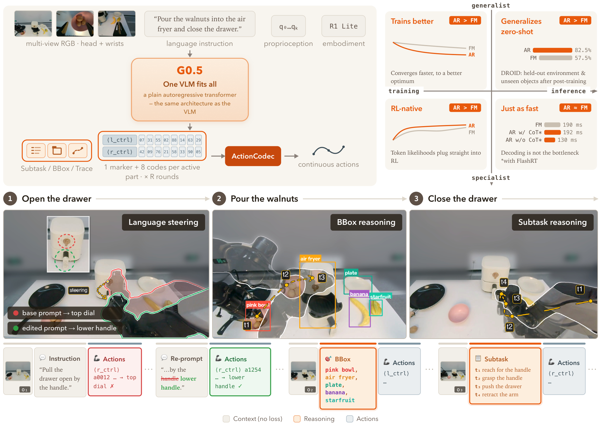

**图内文字中文翻译**（按阅读顺序语境化重述）：

- **左上（输入→输出流水线）**：多视角 RGB（头部 + 双腕相机）、语言指令（"把核桃倒进空气炸锅并关上抽屉"）、本体感知 q₀…q_k、本体标识（R1 Lite）四路输入 → **G0.5：一个 VLM 通吃**（就是一个普通的自回归 transformer，架构与 VLM 完全相同）→ 吐出推理内容（Subtask / BBox / Trace）与动作码（每个活跃部位 1 个标记 token + 8 个动作码，共 R 轮）→ **ActionCodec** 解码成连续动作。
- **右上（四宫格对比，从"通用预训练"到"专用后训练"、从"训练"到"推理"两根轴）**：①**训练更好**（AR > FM）：AR 收敛更快、终点更优；②**零样本泛化更强**（AR > FM）：DROID 上换环境换物体后 AR 82.5% vs FM 57.5%；③**天生适配强化学习**（AR > FM）：token 似然可以直接喂给 RL 算法；④**速度不吃亏**（AR ≈ FM）：FM 190ms、带 CoT 的 AR 192ms、不带 CoT 的 AR 130ms（配 FlashRT），解码不是瓶颈。
- **下方（闭环执行三阶段：① 拉开抽屉 → ② 倒核桃 → ③ 关抽屉）**：①**语言操控**：原 prompt 让机器人去够上面的旋钮（✗），把指令改成"抓下面的把手"后动作跟着改对（✓）——红圈=原目标，绿圈=修正目标；②**BBox 推理**：模型自己框出粉碗、空气炸锅、盘子、香蕉、杨桃再动手；③**子任务推理**：模型自己列出 t₁ 伸手够把手 → t₂ 抓住把手 → t₃ 推抽屉 → t₄ 收回手臂，逐步执行。底部图例：米色=上下文（不算 loss）、橙色=推理 token、蓝色=动作 token。

**自查**：不做机器人的人能看懂——"以前是大脑指挥外挂小脑，现在是大脑自己长了手"。

---

## 第5章 · 实验

评测围绕七个问题（Q1–Q7，§5 开头）展开，按仿真/真机整理如下。

### 5.1 仿真实验

#### 5.1.1 SimplerEnv-Bridge（§5.2.1，Table 1）

**场景一句话**：WidowX 单臂机器人在仿真里做四个 Bridge 风格的桌面任务（勺子放毛巾上、胡萝卜放盘子里、绿块叠黄块、茄子放黄篮子）。SimplerEnv 是"真实数据训练 → 仿真评测"的 real-to-sim 基准。

**条件**：在 BridgeData V2 上后训练 8 万步（lr 3×10⁻⁵），**不给本体感知状态**（state-free，比标准协议更严格）；评测时不做任何仿真域训练。注意表注：部分 baseline 数字是从其他文献汇编的（原论文未报 SimplerEnv 成绩）。

**场景图**：论文未提供场景图（标准公开套件，任务见表头）。

| 方法 | 勺子→毛巾 | 胡萝卜→盘子 | 绿块叠黄块 | 茄子→黄篮 | 平均 |
|---|---|---|---|---|---|
| π0 | 29.1 | 0.0 | 16.6 | 62.5 | 27.1 |
| π0-FAST | 29.1 | 21.9 | 10.8 | 66.6 | 32.1 |
| π0.5 | 49.3 | 64.7 | 44.7 | 69.7 | 57.1 |
| GR00T-N1.5 | 75.3 | 54.3 | 57.0 | 61.3 | 61.9 |
| StarVLA-GR00T | 83.0 | 59.4 | 18.8 | **100.0** | 65.3 |
| RoboBrain2.5-8B | 75.0 | 55.5 | 40.1 | **100.0** | 67.6 |
| MemoryVLA | 75.0 | **75.0** | 37.5 | **100.0** | 71.9 |
| EO-1 | 63.6 | 54.5 | 81.8 | 90.9 | 72.7 |
| Xiaomi-Robotics-0 | 95.8 | 62.5 | 75.0 | 83.3 | 79.2 |
| **G0.5** | **97.5** | **75.0** | **83.3** | 93.3 | **87.3** |

（单位：成功率 %；粗体 = 该列最优）

#### 5.1.2 RoboTwin 2.0（§5.2.2，Table 2）

**场景一句话**：仿真双臂机器人做 50 多个需要双手协同的任务（递东西、叠碗、开笔记本电脑等），分"干净场景"和"重度随机化场景"两档评。

**条件**：2,500 条干净演示 + 25,000 条随机化演示，微调 4 epoch（lr 4×10⁻⁵，batch 1024），每任务 100 次评测。

| 方法 | 干净场景 | 随机化 | 平均 |
|---|---|---|---|
| π0 | 65.9 | 58.4 | 62.2 |
| π0.5 | 82.7 | 76.8 | 79.8 |
| LingBot-VLA | 86.5 | 85.3 | 85.9 |
| Motus | 88.7 | 87.0 | 87.8 |
| StarVLA | 88.7 | 87.8 | 88.3 |
| LingBot-VA | 92.9 | 91.5 | 92.2 |
| Fast-WAM | 91.9 | 91.8 | 91.8 |
| **G0.5** | **93.7** | **92.8** | **93.3** |

逐任务成绩见论文附录 Table 7（弱项：Hanging Mug 40/56、Turn Switch 74/80、Move Stapler Pad 80/70，其余大多 ≥84）。注意与次优 LingBot-VA 的差距仅 +1.1pp，无误差棒（盲审 W2 点名）。

#### 5.1.3 LIBERO（§5.2.3，Table 3）

**场景一句话**：Franka 单臂仿真基准，四个套件各考一种能力——Spatial（空间关系）、Object（认物体）、Goal（听指令）、Long（长程任务）。

**条件**：每任务 50 条演示，微调 10 万步（lr 1×10⁻⁵，weight decay 1×10⁻²），每任务 50 次评测。

| 方法 | Spatial | Object | Goal | Long | 平均 |
|---|---|---|---|---|---|
| π0 | 98.0 | 96.8 | 94.4 | 88.4 | 94.4 |
| π0.5 | 98.8 | 98.2 | 98.0 | 92.4 | 96.9 |
| GR00T-N1.7 | 97.7 | 98.5 | 97.5 | 94.4 | 97.0 |
| OpenVLA-OFT | 97.6 | 98.4 | 97.9 | 94.5 | 97.1 |
| Fast-WAM | 98.2 | 100.0 | 97.0 | 95.2 | 97.6 |
| Being-H0.5 | **99.2** | 98.2 | **99.0** | 96.2 | 98.2 |
| EO1 | 99.7 | 99.8 | 99.2 | 94.8 | 98.4 |
| Cosmos Policy | 98.1 | 100.0 | 98.2 | 97.6 | 98.5 |
| LingBot-VA | 98.5 | 99.6 | 97.2 | 98.5 | 98.5 |
| Xiaomi-Robotics-0 | 98.8 | **100.0** | 98.8 | 97.2 | 98.7 |
| **G0.5** | 98.4 | **100.0** | 98.6 | **98.6** | **98.9** |

（表已截取代表性行；完整 16 行见论文 Table 3。G0.5 亮点在最难的 Long 套件 98.6%；与次优差距 +0.2pp，同样无误差棒。）

#### 5.1.4 2025 BEHAVIOR Challenge（§5.3，Table 4/6）——长程重头戏

**场景一句话**：在照片级仿真器 OmniGibson 里，控制 R1-Pro 机器人做 50 个完整家务（做爆米花、装礼品篮、搬柴火……），每条演示平均 6.6 分钟，需要导航 + 双臂操作 + 全身控制。评分不是二值成功率，而是 **Task Success Score**（完成了目标条件的多少比例，给部分分）。

**条件**：官方标准赛道，1 万条遥操作演示（1,100+ 小时）全部联合训练，**单 checkpoint 跑全部 50 任务**；对照的第一名方案用了 4 个 checkpoint 分摊任务。π0.5 基线由作者自训（4 epoch，遵循第一名方案的公开配置）。每任务 10 个随机化实例，成绩为两次评测 run 的平均。

| 方法 | Task Success Score ↑ |
|---|---|
| RLC（挑战赛第一名，4 个 checkpoint） | 0.2605 |
| Comet（第二名） | 0.1830 |
| π0.5（4 epochs，单 checkpoint，作者自训） | 0.2626 |
| G0.5（1 epoch，单 checkpoint） | 0.2904 |
| **G0.5（4 epochs，单 checkpoint）** | **0.3136** |

**逐任务规律**（§5.3.2，附录 Table 6）：G0.5 在 50 任务中 29 项领先、π0.5 15 项领先。G0.5 强在开阔空间搬运类（装礼品篮 +0.26、放鼠夹 +0.46、捡垃圾 +0.30）——与预训练数据以 pick-and-place 为主吻合；π0.5 强在容器/电器交互类（微波炉爆米花 0.95 vs 0.55）——这类技能在 G0.5 预训练数据中稀缺，但 4 epoch 后差距明显收窄（煎热狗 0.45→0.90）。**注意**：论文把视觉记忆预训练列为长程优势的三大原因之一，但后训练用的是单帧输入且无 on/off 消融——此归因被盲审判定为"叙事而非证据"（W4，作者方承认）。

### 5.2 真机实验

**项目主页**：https://opengalaxea.github.io/G05/ （论文首页脚注给出）。

#### 5.2.1 DROID 环境级+物体级零样本迁移（§5.1，Fig. 5/6）

**场景一句话**：把在 DROID 数据集上后训练的模型部署到一台**从没在训练数据里出现过的** Franka 机械臂工位上，抓的物体实例也全是新的——考"换个房间换批东西还会不会干活"。

**条件**：Franka Research 3 + Robotiq 夹爪，右侧第三人称相机 + 腕部相机；10 个桌面任务 × 10 次试验，二值计分（两段式任务给 0.5 部分分）。Baseline：π0.5-DROID、MolmoAct2-DROID。

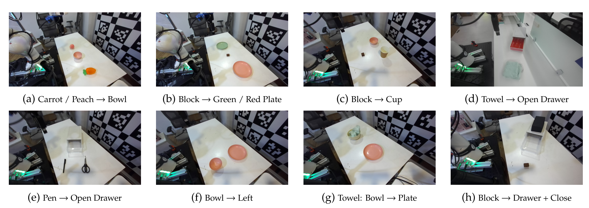

*任务图（图内文字翻译）：(a) 胡萝卜/桃子→碗 (b) 积木→绿/红盘 (c) 积木→杯子 (d) 毛巾→开着的抽屉 (e) 笔→开着的抽屉 (f) 碗向左移 (g) 毛巾：从碗到盘子 (h) 积木→抽屉+关抽屉*

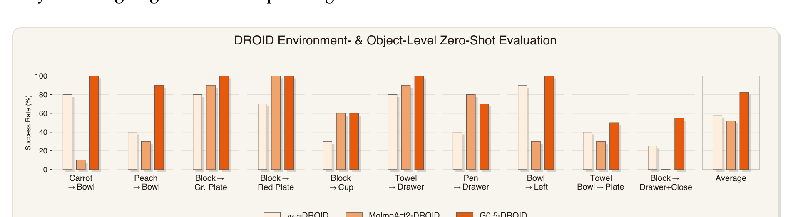

**结果**：G0.5 平均 **82.5%**，超 π0.5-DROID（57.5%）25.0pp、超 MolmoAct2-DROID（52.0%）30.5pp；10 任务全部不输 π0.5。MolmoAct2 在两段式任务上全军覆没且常"冻住不动"。
**⚠️ 重要口径问题**（盲审 W3，作者方承认）：主评测的抽屉内贴了橙色高对比标记卡——因为无标记时 G0.5 只有 60%（π0.5 90%、MolmoAct2 80%），贴卡后 G0.5 变 100%。按无标记数字替换单项后平均降为 78.5%（排序不变），但受影响的抽屉任务共三个，另外两个没有无标记对照数据。G0.5 对低对比度半透明表面的定位是其自认的失败模式（§6）。

#### 5.2.2 R1-Lite / R1-Pro 真机微调（§5.4，Fig. 7/8）

**场景一句话**：在自家两款机器人上微调后做四个难活：叠毛巾（软物体）、折纸箱（接触密集装配）、五箱搬运码垛（全身协同）、文具袋装笔（拉链+杂乱桌面），共六个"任务×本体"设定。

**条件**：所有模型同数据、同算力（16 张 H20、同 wall-clock 4–10 小时）、同观测/动作空间，交错评测防环境漂移；每设定 15 次试验，报成功率 + 过程分（分阶段给分）。Baseline：π0.5、GR00T-N1.7。

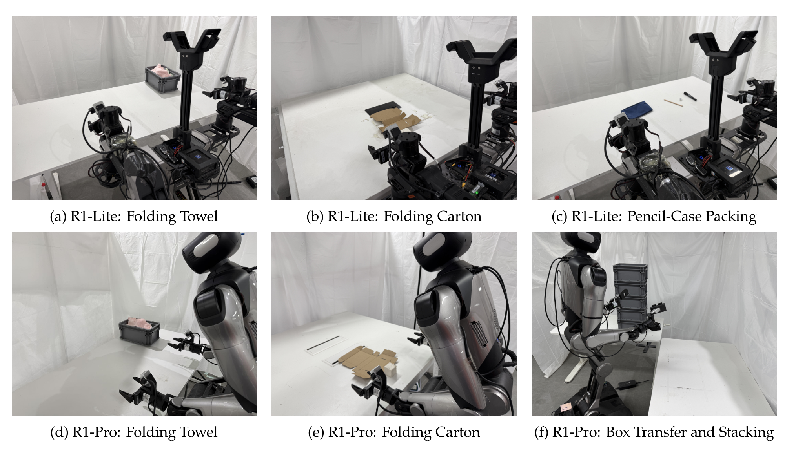

*设定图：(a) R1-Lite 叠毛巾 (b) R1-Lite 折纸箱 (c) R1-Lite 文具袋装笔 (d) R1-Pro 叠毛巾 (e) R1-Pro 折纸箱 (f) R1-Pro 搬箱码垛*

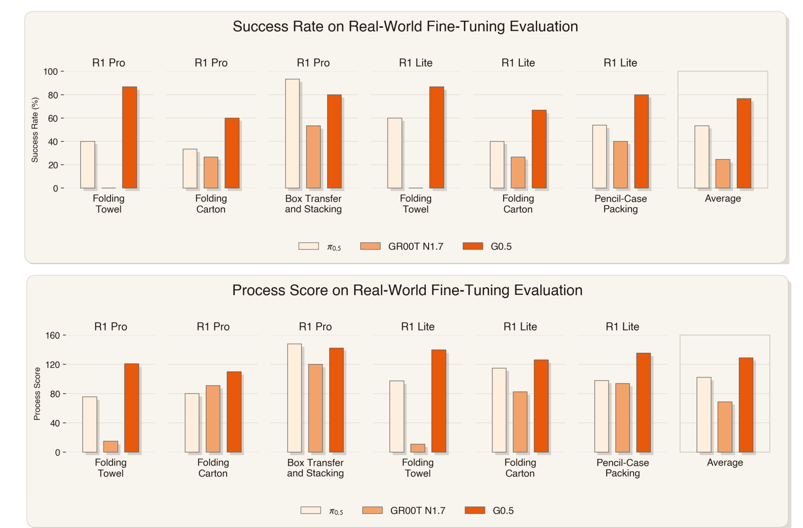

**结果**：六个设定平均成功率 **G0.5 76.7% / π0.5 53.3% / GR00T-N1.7 24.4%**；过程分 129.2 / 105.2 / 68.9。G0.5 六中五最优，唯一输的是 R1-Pro 搬箱码垛（80.0% vs π0.5 93.3%）。两本体表现均衡（R1-Pro 75.6%，R1-Lite 77.8%）。**注意**：G0.5 预训练见过 R1 本体，baseline 没有——这是盲审 W1 的核心（作者方承认跨模型比较有此混淆）；GR00T-N1.7 的 24.4% 异常低，且无基线专属调优说明（W5）。

#### 5.2.3 Pick-and-Place 语言跟随基准（§5.5，Fig. 9/10，Table 5）——自建

**场景一句话**：桌上摆 16 个物体和容器，指令说"用左手把黄色美工刀放进白色篮子"，分开统计"**找对了东西吗**"（语言跟随率）和"**放进去了吗**"（任务成功率）——把"听不懂"和"手笨"两种失败拆开。

**条件**：R1-Lite 自采 50 小时数据，嵌套子集 1H/10H/50H（分别训 12/8/4 epoch）看数据规模效应；64 物体类别 + 3 容器，其中 16 类是训练没见过的（OOD）；每模型 64 次配对试验（同指令、同布局、同初始状态）。

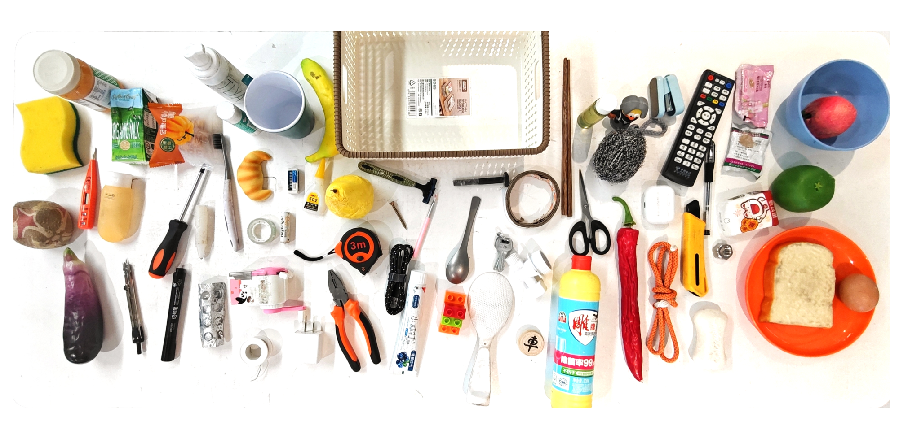

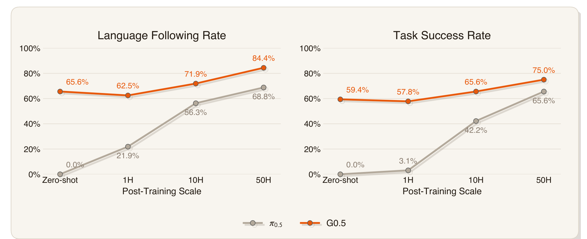

| 后训练规模 | G0.5 语言跟随 | π0.5 语言跟随 | G0.5 任务成功 | π0.5 任务成功 |
|---|---|---|---|---|
| 零样本 | **65.6%** | 0.0% | **59.4%** | 0.0% |
| 1H | 62.5% | 21.9% | 57.8% | 3.1% |
| 10H | 71.9% | 56.3% | 65.6% | 42.2% |
| 50H | **84.4%** | 68.8% | **75.0%** | 65.6% |

亮点：G0.5 **零样本 65.6% 语言跟随**（π0.5 为 0——它没见过 R1-Lite 本体，这正是 W1 说的混淆）。referring-context 附加实验见第7章。

### 5.3 为什么选这些实验

**共同特性**：七个场景里权重最高的三个（BEHAVIOR、真机微调、PP Bench）共享两个特征——**长程多阶段**（BEHAVIOR 平均 6.6 分钟/条，真机四任务全是 3–5 阶段）和**语言接地要求高**（PP Bench 16 物体选一、BEHAVIOR 50 任务一个 checkpoint 靠指令区分）。这恰好是"推理和动作在同一条流里"的设计最能吃到红利的地方：CoT 的子任务分解直接喂给动作 token（§5.6 显示 CoT 在五阶段任务上把进度分从 2.4 拉到 3.8，单阶段 PP Bench 上只有 ~1.6pp 增益——增益恰好只出现在长程处），BBox 推理直接服务于杂乱桌面的选物（+Target Visual 上下文把语言跟随从 84.4% 拉到 98.4%）。

**方法设计与场景的对应**：active-part 稀疏预测 + 部位分组 token 化天然适配"导航与操作解耦"的移动操作——论文引 BEHAVIOR 搬运类任务的逐项优势（搬箱入库 +0.35、捡垃圾 +0.30、装车 +0.28）作证。反过来，**精度敏感、视觉低对比**的场景是它的弱项且论文自己承认（无标记抽屉 60%、Hanging Mug 40%、box stacking 输 π0.5）。

**该测未测的主流 bench**：①**SimplerEnv-Fractal/Google Robot** 半边（只测了 Bridge 半边）；②**CALVIN**（语言条件长程的老牌基准，主打语言跟随的论文缺席它值得注意）；③**灵巧手/高频控制**类基准全部缺席——27 维统一动作空间里没有手指自由度，而"AR 慢"的历史病根恰恰在高频高维控制上，这是对 AR 路线压力最大、也最该测的场景（缺席本身是信号）；④宣称 RL-native 但 RL 实验只在 LIBERO 四个（未具名）任务上做了 100 步。

### 5.4 复现可能性（硬核查，零猜测）

以下每项均实际打开过 repo/HF 页面核验（核查日期 2026-08-15）：

**代码**：✅ **实质代码**。[OpenGalaxea/GalaxeaVLA](https://github.com/OpenGalaxea/GalaxeaVLA)，405 个文件：训练入口（`scripts/run/finetune.sh`，torchrun DDP）、Hydra 配置体系（`configs/train.yaml` + libero/robotwin/droid/bridge/r1lite/r1pro/so100 任务配置）、`configs/tokenizer/actioncodec.yaml`、部署代码（`experiments/{droid,libero,robotwin,r1lite,r1pro,so100}` 各有 README + 推理引擎）、双语文档（架构/数据 schema/部署）。最近 push 2026-08-13，732 star。

**ckpt（逐场景）**：
| 场景 | checkpoint | 状态 |
|---|---|---|
| 预训练底座 | `g05-base`（HF OpenGalaxea/G05） | ✅ 已开源 |
| DROID | `g05-droid` | ✅ 已开源 |
| LIBERO | `g05-libero` | ✅ 已开源 |
| RoboTwin 2.0 | `g05-robotwin20` | ✅ 已开源 |
| SO-100/101（论文外赠送） | `g05-so101` | ✅ 已开源 |
| 动作分词器 | `action_tokenizer.pt` | ✅ 已开源 |
| SimplerEnv-Bridge | — | ❌ 未见对应 ckpt |
| BEHAVIOR Challenge | — | ❌ 未见对应 ckpt |
| 真机微调六设定（叠毛巾等） | — | ❌ 未开源 |
| PP Bench 各规模 | — | ❌ 未开源 |

**数据**：前作 [Galaxea Open-World Dataset](https://huggingface.co/datasets/OpenGalaxea/Galaxea-Open-World-Dataset)（500+ 小时 R1-Lite，RLDS/LeRobot 格式）✅ 开源；但 G0.5 完整预训练混合（14 本体）、PP Bench 50 小时数据、真机微调数据 ❌ 未开源。自动标注流水线代码 ❌ 未见。

**训练细节（正文+附录核查）**：
- 找到了：后训练超参齐全——Bridge 80K 步 / lr 3e-5；RoboTwin 4 epoch / lr 4e-5 / batch 1024；LIBERO 100K 步 / lr 1e-5 / wd 1e-2（各 §5.2.x）；真机微调算力 16×H20、4–10 小时（§5.4）；历史帧 drop 30%（§5.3.2）；repo 补充了 README 级细节（视觉记忆 5 秒窗 6 帧、VQA:action = 1:4、推理 >8GB 显存/微调建议 ≥8×A100 等）。
- 没找到（缺失项）：❌ 预训练总数据量（小时/episode 数）；❌ 各本体数据占比；❌ 预训练步数与总算力；❌ 预训练 lr 具体数值与 schedule 参数（正文只说 AdamW + warmup/constant/cosine，"trained until convergence"）；❌ ActionCodec 码本大小、残差轮数 R 的取值、chunk 长度 H、控制频率（正文只有"每 group-round 8 码"与图上 4 级 RVQ）；❌ CoT 八种格式的具体采样权重；❌ 真机评测的逐阶段评分细则（论文说"provided in the appendix"，但 arXiv v1 附录只有 Table 6/7，未见评分细则——疑似附录不全）。

**结论：`需自行补齐细节`**。微调/评测复现（LIBERO、RoboTwin、DROID）路径通畅：代码 + ckpt + 公开数据 + 超参齐备，属于"可直接复现"档；但**从零复现预训练不可行**（数据大头未开源、预训练超参与算力未披露），自建基准（PP Bench、真机六设定）因数据与 ckpt 未开源而无法复现。三档取其中。

---

## 第6章 · 方法拆解

方法总览（Fig. 1 左上面板，彩色框标注）：

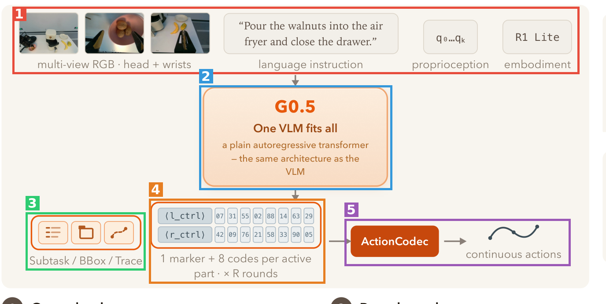

**接口串联总览**：🟥 多模态输入 → 🟦 G0.5 自回归 VLM → 🟩 CoT 推理 token（可选，流内）→ 🟧 结构化动作码 → 🟪 ActionCodec 解码 → 连续控制指令 → 机器人执行 → 新观测回到 🟥（闭环）。

---

🟥 **块1 · 条件输入组**（框1，图上排）
- **来源**：标准 VLA 输入约定 + 本文的本体标识设计。
- **接口**：进——K 路多视角 RGB（头部+双腕，含约 5 秒稀疏历史帧）、语言指令（≤200 token）、本体感知状态（关节位置+夹爪状态，用连续 embedding 而非文本 token，与视觉帧严格同步）、本体标识文本（如 `r1lite`，决定后面激活哪些部位组）；出——序列化成 Fig. 2 模板的"条件段"（user 角色，不算 loss），以 `<EOC>` 收尾。
- **训练时**：条件段被 mask，不产生梯度。
- **部署时**：每个控制周期重新打包最新观测。

🟦 **块2 · G0.5 自回归 VLM**（框2，中央）
- **来源**：[Qwen3.5 2B](https://qwen.ai/blog) 初始化（视觉编码器 + 词表 + 解码器）；视觉编码器内每 4 层插入时空分解注意力做**视觉记忆**（follow [π0.7](https://arxiv.org/abs/2604.15483) 和 [MEM](https://arxiv.org/abs/2603.03596)）——历史帧信息在 ViT 里融合，最后一层丢弃全部历史 token 保延迟。
- **接口**：进——块1 的条件段；出——生成段 token（CoT + 动作码），全词表统一。
- **训练时**：单一 next-token cross-entropy（式 1），只算生成段；视觉塔不冻结；训练时以 30% 概率随机丢掉全部历史帧防过拟合；机器人数据与 Web/VQA 数据同一目标混训（action 为主）。**没有任何辅助回归损失或专家蒸馏**——这是与 VLM-as-encoder 路线的分水岭。
- **部署时**：标准自回归解码；可选外接一个 π0.5 风格 flow-matching 头读 trunk 隐状态出动作（仅对照/加速用，主实验全用 AR 头）。

🟩 **块3 · 原生 CoT 推理段**（框3，左下）
- **来源**：路线上最接近 [ECoT](https://arxiv.org/abs/2407.08693)；四个原语中 Trace 来自 [TraceVLA](https://arxiv.org/abs/2412.10345) 的灵感；区别是本文把 CoT 做成**推理期可切换的 prompt 条件模板**。
- **接口**：进——条件段里的 CoT 前缀指令（如"predict bbox, subtask and action"）；出——`Subtask:`（原子子任务文本）、`BBox:`（关键物体框，`<loc>` token）、`Trace:`（双手 2D 落点轨迹）、`ActionHint:`（帧级动作提示）四者的任意子集，按固定顺序排列，供后续动作 token 直接 attend。
- **训练时**：每条机器人样本按加权采样分到 8 种 CoT 格式之一（含无 CoT；子任务文本权重最高）；标注来自自动流水线（Gemini 3 / Doubao 生成语言标注，SAM3 追踪 bbox，正运动学投影 2D 轨迹）。
- **部署时**：默认评测用无 CoT 格式（快）；长程任务开 CoT 有明显收益（见第7章）。

🟧 **块4 · 结构化动作码**（框4，中下）
- **来源**：分组策略来自 [FASTer](https://arxiv.org/abs/2512.04952)。
- **接口**：进——块2 解码出的 token 流（`<EOV>` 之后）；出——R 轮残差 ×｛活跃部位组｝× 8 个动作码：每轮吐 `<left_control_r>` + 8 码、`<right_control_r>` + 8 码、（有下肢的本体才有）`<lower_body_control_r>` + 8 码。**不动的部位组整组不吐**（active-part 稀疏预测），残差轮数越多精度越高。
- **训练时**：动作码就是普通 token，与文本共享词表和 loss。
- **部署时**：静止部位零 token 开销；序列以 `<eos>` 结束。

🟪 **块5 · ActionCodec 跨本体编解码器**（框5，右下）
- **来源**：训练配方来自 [ActionCodec](https://arxiv.org/abs/2602.15397)（RVQ + 时间对比损失）；跨本体统一动作空间的思路与 Being-H0.5/Green-VLA/HEX 同类，但本文把对齐做进了**分词器本身**。
- **接口**：进——块4 的离散动作码；出——统一 27 维连续动作：`left_control(9) | left_gripper(1) | right_control(9) | right_gripper(1) | lower_body(7)`，不同本体的空缺槽位用 noop 填充，换新机器人**不需要加任何新参数**。
- **训练时**：与 VLM 分开预训练后冻结——动作块 [t:t+H] 过动作编码器得 z，4 级残差量化（decoded z = res0+res1+res2+res3），时间相邻动作做对比学习（z(t) 与 z(t+1) 为正对）拉近相似动作的码距，再由动作解码器重建各部位动作。逐本体做归一化（z-score 截尾或 q01/q99 分位缩放）。
- **部署时**：查码本 → 解码器 → 连续控制指令，按 chunk 执行后闭环重规划。

配套细节图：

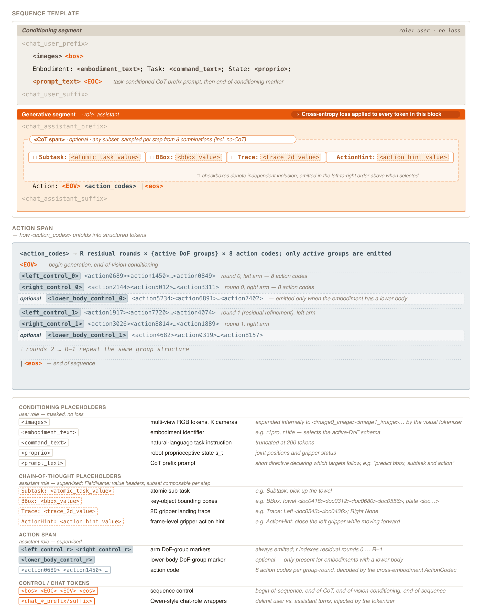

*Fig. 2 要点翻译：整条序列 = 条件段（user 角色、不算 loss：图片 + `<bos>` + "Embodiment: …; Task: …; State: …" + CoT 前缀指令 + `<EOC>`）＋ 生成段（assistant 角色、每个 token 都算 cross-entropy：可选 CoT 跨度（四选任意子集）→ `Action: <EOV>` → 动作码 → `<eos>`）。*

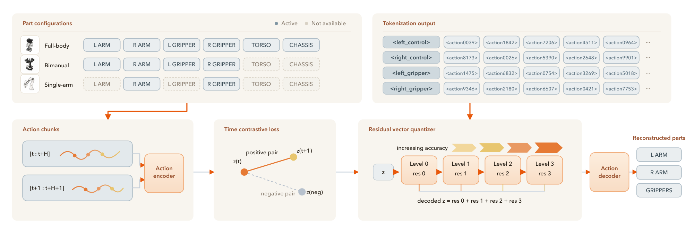

*Fig. 3 要点翻译：左上——三种部位配置（全身/双臂/单臂）各自激活不同部位组；右上——token 化输出按部位组排列；下排——动作块经动作编码器 → 时间对比损失（相邻时刻为正对）→ 4 级残差向量量化（逐级提精度）→ 动作解码器重建各部位动作。*

**质量门槛自查**：五块接口首尾相接——🟥 出条件段正是 🟦 的输入；🟦 出的生成段被 🟩🟧 按模板切分；🟧 的码正是 🟪 的输入；🟪 输出闭环回 🟥。串联成立。

---

## 第7章 · 消融

本文**没有传统的组件消融**（ActionCodec、视觉记忆、active-part 均无 on/off 对照——这是盲审 W4 的主体内容，作者方承认，评审二轮维持）。但有三组"推理期开关"性质的对照实验，按消融惯例整理：

### 7.1 CoT × 动作头 四格对照（§5.6，同一 checkpoint 只动推理配置）

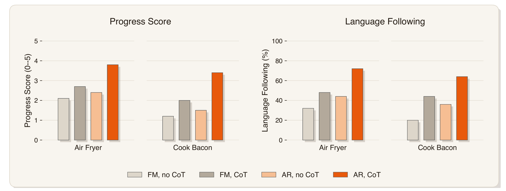

| 配置（人话） | Air Fryer 进度分(0–5) | Cook Bacon 进度分 | Air Fryer 语言跟随 | Cook Bacon 语言跟随 |
|---|---|---|---|---|
| 外挂 FM 头、不让模型先想 | 2.1 | 1.2 | 32% | 20% |
| 外挂 FM 头、先想再做 | 2.7 | 2.0 | 48% | 44% |
| AR 自己出动作、不先想 | 2.4 | 1.5 | 44% | 36% |
| **AR 自己出动作、先想再做** | **3.8** | **3.4** | **72%** | **64%** |

- **Takeaway 1**：CoT 在**长程分阶段任务**上收益巨大（AR 进度分 +1.4/+1.9），在单阶段 PP Bench 上几乎无效（≤1.6pp）——"先想"只在有多个接地事件的任务里值钱。
- **Takeaway 2**：同样开 CoT，AR 头吃到的收益比 FM 头大得多（+1.4 vs +0.6）——论文假说：动作 token 与 CoT 同流可直接 attend，FM 头只能读池化摘要。两头 CoT 文本质量人工核对相当（~90/85/80%），排除了"想得不一样好"的解释。
- **⚠️ 可信度警示**：每格仅 n=5，作者方在 rebuttal 中承认扩样后"有反转可能"，评审据此拒绝将其计入已确立证据——此表看方向，别背数字。

### 7.2 Referring-context 三档消融（§5.5，Table 5，PP Bench 50H 模型）

| 给模型的额外提示（人话） | 语言跟随率 | 任务成功率 | Takeaway |
|---|---|---|---|
| 只给物体名字（基线） | 84.4% | 75.0% | — |
| 名字 + 目标框文本坐标 | 85.9% | 76.6% | 坐标 token 几乎白给（+1.5pp）：格式偏移出预训练分布，动作头用不上 |
| 名字 + 目标区域裁剪图 | **98.4%** | **84.4%** | 视觉裁剪暴涨 +14pp：长尾物体（如中国象棋"马"）靠外观不靠名字，多图接口是 G0.5 结构红利 |

### 7.3 GRPO 微调：AR vs FM（§5.7，Fig. 12）

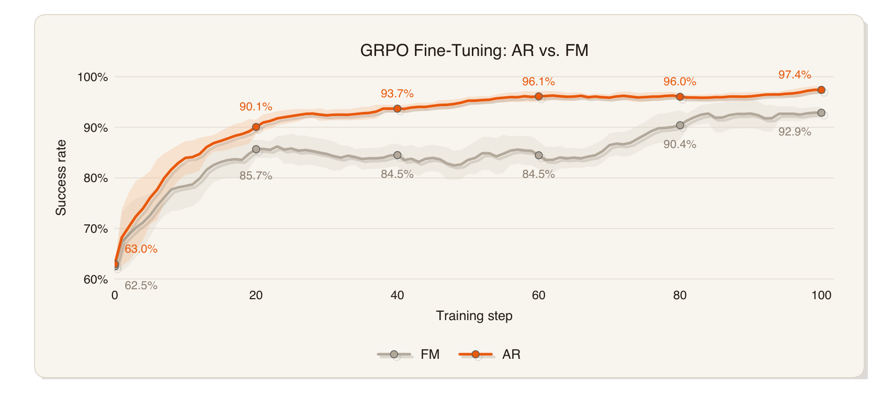

| 对照项 | 起点 | 100 步后 | Takeaway |
|---|---|---|---|
| AR 策略（token 似然直接可用） | 63.0% | **97.4%** | 起点相同、终点 +4.5pp、方差更小、爬得更快 |
| FM 策略（需 SDE 重构似然，follow RLinf） | 62.5% | 92.9% | 似然近似引入的离散化/噪声表调度可能带来优化噪声 |

- **Takeaway**：这是"AR 天生适配 RL"主张的唯一定量证据，方向清晰；但 seed 数未报告、四个 LIBERO 任务未具名且以"两者起点相当"为筛选条件（W2 点名）。

**总体缺陷呼应第3章**：三组实验都只动"推理/训练配置"，不动"组件本身"——核心组件（codec、记忆）的贡献量至今没有数字。这算实质缺陷：正是因为它，"三大组件都有用"目前只能靠信，这也是盲审给 major revision 的主要理由之一。

---

## 收尾信息

- 精读文档：`papers/g05-one-stream/read.md`（本文件）
- 图片：`papers/g05-one-stream/figs/`（12 张，全部本地化）
- 中间产物：`papers/g05-one-stream/_work/`（全文文本、净化文本、整页渲染、标注 boxes.json，不进 git）
