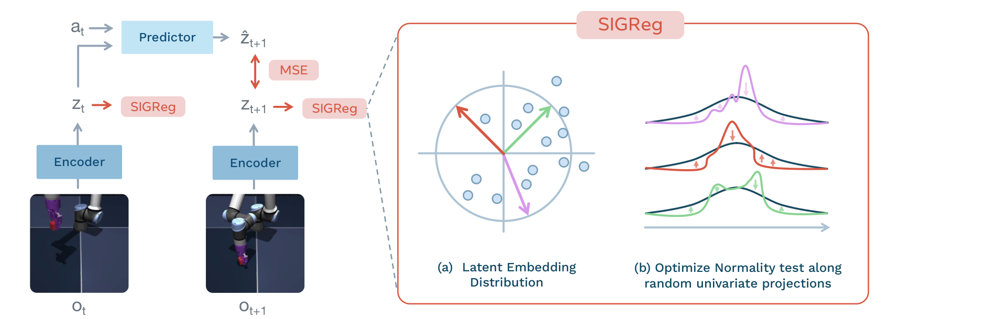
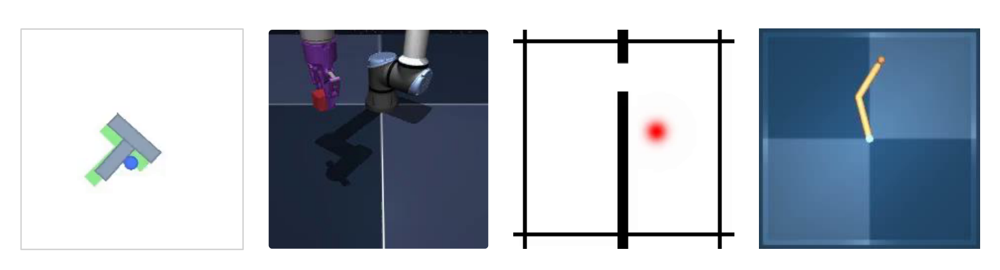
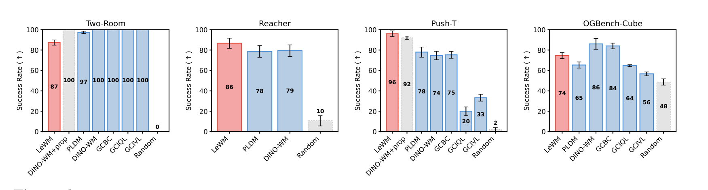
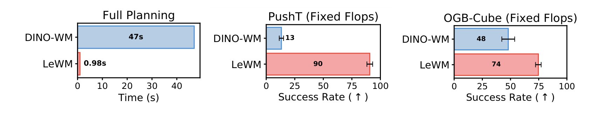
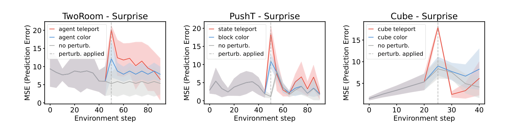
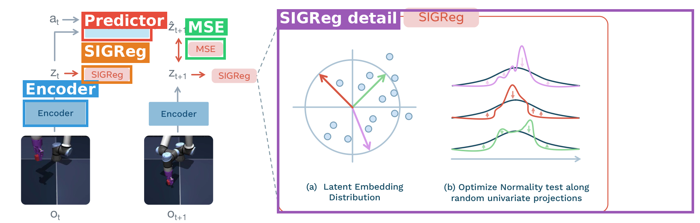
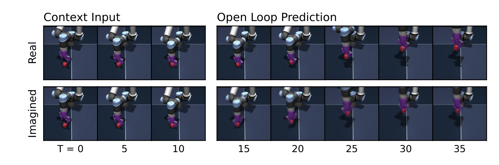
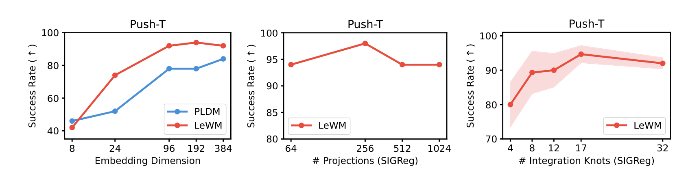
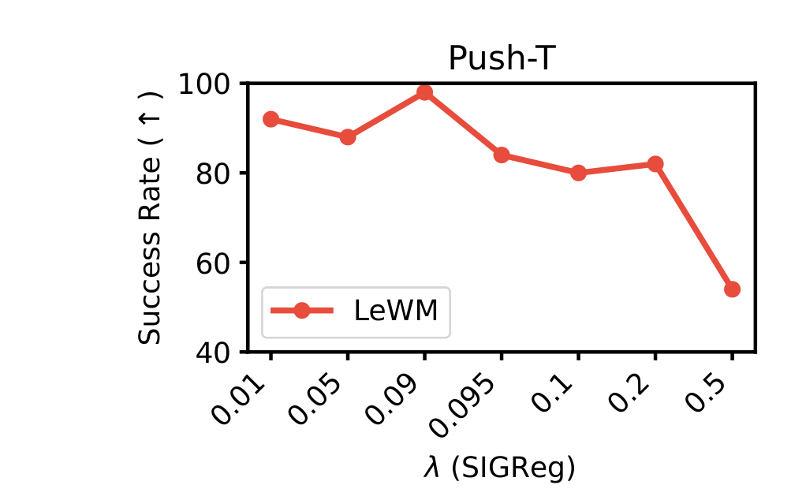

# LeWorldModel: Stable End-to-End Joint-Embedding Predictive Architecture from Pixels

| 项 | 内容 |
|---|---|
| 题目 | LeWorldModel: Stable End-to-End Joint-Embedding Predictive Architecture from Pixels |
| 作者 | Lucas Maes*（Mila & UdeM）、Quentin Le Lidec*（NYU）、Damien Scieur（Mila/Samsung SAIL）、Yann LeCun（NYU）、Randall Balestriero（Brown）；* 共同一作 |
| arXiv | [2603.19312](https://arxiv.org/abs/2603.19312)（v3, 2026-06-03） |
| 代码 | [github.com/lucas-maes/le-wm](https://github.com/lucas-maes/le-wm)（MIT，约 4.3k stars） |
| 主页 | [le-wm.github.io](https://le-wm.github.io) |
| 发布日期 | 2026-03-13（arXiv v1） |

**结构速览**（每节在干嘛）：

- §1 Introduction：JEPA 世界模型容易塌缩，现有防塌缩手段（EMA/stop-grad/预训练编码器/多项正则）复杂不稳，提出两项损失的 LeWM。
- §2 Related Work：生成式世界模型（Dreamer/IRIS/Genie 系）vs 无奖励 JEPA 线；JEPA 防塌缩策略分类；latent 规划（MPC 系）。
- §3 Method：编码器（ViT-Tiny，[CLS]+BN 投影）+ 预测器（AdaLN 注动作），损失 = 下一步 embedding MSE + SIGReg 高斯正则；推理时 CEM+MPC 在 latent 空间规划。
- §4 Latent Planning Performance：四个环境上对比 DINO-WM/PLDM/GCBC/GC-RL；固定算力对比与 48× 规划提速；训练稳定性与消融概览。
- §5 Quantifying Physical Understanding：物理量 probing、事后 decoder 可视化、t-SNE、temporal straightening 涌现现象、violation-of-expectation（VoE）惊讶度实验。
- §6 Conclusion + Limitations：短 horizon、依赖数据覆盖、低多样性环境 SIGReg 变弱、依赖动作标签。
- App A：SIGReg 数学定义（随机投影 + Epps–Pulley + Cramér–Wold）。App B：CEM 算法。App C：基线细节（PLDM 七项损失全展开、超参搜索；DINO-WM；GC-RL/GCBC）。App D：实现细节（frame-skip 5、batch 128、224×224、decoder 仅用于可视化、CEM 配置）。App E：四个环境与数据集。App F：评测协议、probing 全表、VoE 细节。App G：消融全集（维度/投影数/积分节点/λ/predictor 尺寸/重建损失/encoder 架构/dropout/求解器/训练方差）。App H：temporal straightening。App I：训练曲线。

---

## 第1章 · 作者与实验室背景评估

### 作者背景表

| 作者 | 角色 | 单位 | 主方向 | 主页 |
|---|---|---|---|---|
| Lucas Maes | 共同一作 | Mila & Université de Montréal（博三），现驻 AMI Labs | JEPA/世界模型、自监督学习、优化 | [个人主页](https://lucas-maes.github.io) · [Mila 页](https://mila.quebec/en/directory/lucas-maes) |
| Quentin Le Lidec | 共同一作 | NYU 博后（AMI Labs） | 机器人可微仿真/优化 → 世界模型 | [个人主页](https://quentinll.github.io/) |
| Damien Scieur | 作者 | Samsung SAIL Montreal 高级研究科学家（Mila 成员） | 优化（加速方法、自适应优化器理论） | [个人主页](https://damienscieur.com/) |
| Yann LeCun | 作者 | NYU 教授；LinkedIn 显示现任职 AMI（Advanced Machine Intelligence） | JEPA/世界模型路线的提出者与推动者 | [个人主页](http://yann.lecun.com/) |
| Randall Balestriero | 作者 | Brown 助理教授 | 深度学习理论、自监督学习（LeJEPA/SIGReg 作者） | [Brown 研究者页](https://vivo.brown.edu/display/rbalestr) |

补充事实：

- **Lucas Maes**（dblp）：2023 一篇代码评审生成；2024–2025 转向 SSL 与优化——"On the Importance of Embedding Norms in Self-Supervised Learning"（ICML 2025）、"Understanding Adam Requires Better Rotation Dependent Assumptions"（NeurIPS 2025）、stable-pretraining 工具库；2026 集中产出世界模型三连：stable-worldmodel 平台、Causal-JEPA、本文。Mila 目录显示其（联合）导师为 Simon Lacoste-Julien。
- **Quentin Le Lidec**：ENS Paris 博士（2024，题目"Differentiable optimization for robotics"，导师 Justin Carpentier / Cordelia Schmid / Ivan Laptev），GDR Robotique 2024 最佳博士论文奖；此前代表作有 Contact Models in Robotics（IEEE T-RO 2023）、可微渲染（NeurIPS 2021）；2026 起转入世界模型（本文、Causal-JEPA、stable-worldmodel）。
- **实验室主方向判定：传统强方向。** 本文所处的 JEPA 世界模型线正是 LeCun–Balestriero 圈子近年的主线，论文参考文献即是证据：I-JEPA [12]、V-JEPA/V-JEPA 2 [13,14]、VICReg [23]、DINO-WM [18]（Zhou, Pinto, LeCun, ICML 2025）、PLDM [21,22]（Sobal…LeCun）、Navigation World Models [33]、LeJEPA [25]（Balestriero & LeCun 2025）、Temporal Straightening [45]、Causal-JEPA [20]——本文是这条线内部的自然下一步（用自家 LeJEPA 的正则器修自家 PLDM 的训练不稳）。
- **一作画像**：LeWM 属于 Maes 的首批世界模型方向工作（与 stable-worldmodel、Causal-JEPA 同年集中产出），但他有 SSL/优化的直接相关积累（embedding norm 论文与本文防塌缩主题一脉相承）；Le Lidec 有完整的机器人/优化博士训练。

### 水毕业风险信号核对（事实 → 推断分开）

| 信号 | 核对结果 |
|---|---|
| 一作无相关积累 | 否。Maes 有 SSL（ICML'25）与优化（NeurIPS'25）积累；Le Lidec 是机器人优化方向获奖博士 |
| 导师主业不在此方向 | 否。LeCun 是 JEPA 路线本人；Balestriero 是 SIGReg/LeJEPA 一作 |
| 实验室该方向无持续投入 | 否。近 5 年 I-JEPA→V-JEPA→DINO-WM→PLDM→LeJEPA→本文，连续投入 |
| 单位在该领域无积累 | 否。Mila/NYU/Brown 均为该领域核心机构 |

**水平预判（推断，依据上表）**：这不是边缘团队蹭热点的作品，而是 JEPA 核心团队的"路线整合"论文——把 LeJEPA（2025.11）的正则器接到 PLDM（2025）的世界模型设定上。可预期工程质量与开源完整度高；同时也要意识到，作者与被比较基线（DINO-WM、PLDM）同属一个学术圈子，比较立场需读者自行留意（这一点已通过第3章盲审独立检验）。

---

## 第2章 · 论文类型判定

**结论：a+b 型（组合创新），附少量原创工程模块。** a = PLDM 的"像素端到端 JEPA 世界模型 + 离线无奖励数据 + latent MPC 规划"整套设定；b = LeJEPA 的 SIGReg 防塌缩正则器（逐 timestep 施加）。原创增量是三处工程设计：[CLS]+BatchNorm 投影头（绕开 ViT 末层 LayerNorm 对 SIGReg 的阻碍，§3.1）、AdaLN 零初始化注入动作、SIGReg 的 step-wise 用法。

组件清单（均为论文方法节实际承担流程环节的引用，非 related work 泛引）：

| 组件 | 原论文 | 在本文中的角色 |
|---|---|---|
| 问题设定 + 端到端 JEPA 世界模型 + 评测协议 | PLDM：[Sobal et al., 2025](https://openreview.net/forum?id=jON7H6A9UU)（前身 [2211.10831](https://arxiv.org/abs/2211.10831)） | 本文要替换其七项 VICReg 式损失的直接对象；TwoRoom 环境亦出自此文 |
| SIGReg 正则器 | LeJEPA：[Balestriero & LeCun, 2025](https://arxiv.org/abs/2511.08544) | 防塌缩的唯一正则项（随机投影 + Epps–Pulley 检验） |
| Epps–Pulley 正态性检验 | [Epps & Pulley, 1983](https://doi.org/10.1093/biomet/70.3.723)（论文 ref [38]） | SIGReg 内的一维检验统计量 |
| ViT 编码器 | [Dosovitskiy et al., 2020](https://arxiv.org/abs/2010.11929) | 帧 → [CLS] embedding |
| AdaLN 动作注入 | DiT：[Peebles & Xie, 2023](https://arxiv.org/abs/2212.09748) | 预测器每层注入动作条件 |
| CEM 规划求解器 | [Rubinstein & Kroese, 2004](https://link.springer.com/book/10.1007/978-1-4757-4321-0)（论文 ref [40]） | 推理时优化动作序列 |
| 规划评测设定（MPC 配置、Reacher/PushT 数据） | DINO-WM：[Zhou et al., ICML 2025](https://arxiv.org/abs/2411.04983) | App. D 明确"This configuration follows the setup used in [18]"；也是主要对比基线 |
| OGBench-Cube 环境 | [Park et al., 2025](https://openreview.net/forum?id=M992mjgKzI) | 3D 操作评测环境 |

疑似借鉴（论文未引用）：未发现——方法节各环节均能对应到参考文献里真实存在的引用。

---

## 第3章 · 双盲评审 + Rebuttal（隔离上下文，全流程记录）

> 净化说明：从全文删除作者名、机构、邮箱、Website/Code 链接、arXiv 版本戳；参考文献 [20]（五位作者与本文完全重合的自引指纹）改写为 Anonymous。盲审 agent 只接收净化文本路径，未接触第1章调研、社交网络信息或任何主对话内容。

### 3.1 初审意见（由隔离上下文的盲审 agent 独立生成）

**Summary**：本文提出 LeWorldModel（LeWM），一种从原始像素端到端训练的 JEPA 世界模型：ViT 编码器将帧映射为单个低维 latent（[CLS] token，192 维），transformer 预测器以 AdaLN 注入动作、自回归预测下一步 latent。训练目标只有两项——next-embedding MSE 预测损失与 SIGReg 正则（将 latent 分布向各向同性高斯匹配以防 collapse，取自文献 [25]），不使用 stop-gradient、EMA 或预训练编码器。作者在 Push-T、Two-Room、OGBench-Cube、Reacher 四个仿真环境上用 CEM/MPC 做 latent planning，报告与 DINO-WM、PLDM 及若干 offline GC-RL/BC 基线的对比，声称在固定算力下大幅胜出、规划速度快至 48 倍；并通过物理量 probing、latent 解码、temporal straightening 与 violation-of-expectation（VoE）实验考察 latent 空间的物理结构。

**Strengths**：

- 方法极简且动机清晰。将 PLDM 的七项目标（六个可调权重）压缩为两项、单个有效超参 λ，并用训练曲线对比（Fig. 18 vs 19）直观展示优化动态差异，对 JEPA 世界模型 subfield 是有实际价值的工程贡献。
- 消融覆盖面较广（App. G）：embedding 维度、投影数、积分节点、λ 扫描、predictor 尺寸、dropout、encoder 架构、加/不加重建损失、不同求解器均有报告。
- 对 latent 空间的分析角度多样（probing、事后 decoder、t-SNE、temporal straightening 涌现现象）。
- 基线复现过程透明：App. C 完整给出 PLDM 七项损失定义、256 组配置搜索过程与最终系数，并披露原论文未提及 time-var/time-cov 项。
- 速度优势机制解释合理：单 [CLS] token 对比 DINO-WM 约 200× token 数差距，提速可信。

**Weaknesses**：

- **W1（主结果缺乏统计基础，且存在疑似数据矛盾）**：Fig. 6 每个柱状数字未报告评测轨迹数 n、seed 数与检验；更严重的是 Tab. 5 报告 DINO-WM 在 Push-T 上 92.0 ± 1.63，而 Fig. 6 中 DINO-WM 为 74、DINO-WM+prop 为 92——两处数字对不上，动摇主结论可信度。
- **W2（超参在评测环境上选择）**：App. G 全部消融在 Push-T 上以下游成功率为准（dropout 0→0.1 使成功率 78→96），Push-T 的 96 正是在该测试任务上以测试指标选出的最优配置；PLDM 系数也在 Push-T 上搜索后固定用于所有环境，可能系统性低估其他环境上的 PLDM。
- **W3（Fixed-FLOPs 对比协议未披露）**：Fig. 3 声称固定算力下 90 vs 13（PushT）、74 vs 48（Cube），但 App. D 完全没有说明 FLOPs 如何定义、如何对 DINO-WM 实施，不可复核。
- **W4（VoE 统计设计不成立）**：App. F.3 明确每环境每条件只生成一条轨迹；n=1 下的 paired t-test 只能是帧级配对，帧间强时间自相关使其成为伪重复，p 值无效，且未报精确统计量。
- **W5（新颖性主要是既有组件的移植，强 claim 措辞过强）**：SIGReg 完整来自 [25]，设定来自 [22]；"the first JEPA that trains stably end-to-end from raw pixels"与"provable anti-collapse guarantees"超出证据（PLDM 同为像素端到端；[25] 的保证是渐近弱收敛，不构成"训练不塌缩"的证明）。
- **W6（probing 缺乏检验）**：± 口径不明、无检验、多重比较未校正；DINO-WM 线性探针 MSE 1.888 但 r=0.977 提示量纲/归一化可能不一致。
- **W7（外部效度有限）**：全部证据来自四个小型仿真环境、15M 模型、in-distribution 目标评测；Cube 输 DINO-WM（74 vs 86）、Two-Room 落后所有基线；"narrowing the gap toward real-time control"无证据支撑。

**Questions**：Q1 Fig. 6 的 n/seed 与 92/74 关系；Q2 fixed-FLOPs 协议定义；Q3 超参在哪个环境用什么指标选定、PLDM 若获等量搜索差距还剩多少；Q4 VoE 检验的配对单元/n/精确统计量；Q5 相对 LeJEPA 的方法学新增及其单独消融。

**Minor issues**：摘要"six to one"与"seven-term"表述需统一；48× vs ∼50× 不一致；"18%"应为 18 个百分点；Fig. 4 caption 误指 Fig. 2；Alg. 3 伪代码语法错误；App. F.1 "three environments"实为四个；Two-Room 落后的解释目前是推测。

**评级：reject。** 理由：贡献量级上是把已有正则器移植到已有设定的应用性工作，验证止于小型仿真与 in-distribution 评测，辐射范围停留在 JEPA 训练稳定性 subfield；证据面上核心对比图无 n 无误差棒且与附录数字矛盾（W1）、fixed-FLOPs 不可复核（W3）、超参在评测任务上选择（W2）、VoE 统计设计无效（W4）。更适合投递 ML 会议并修补统计报告。

（评审范围声明：净化文本中链接不可访问，代码/数据实际可得性无法确认；图形内容仅能依据文本化数字与 caption 评审。）

### 3.2 Rebuttal（作者方，一轮）

**承认的批评清单（本文真正的硬伤一览，不辩护）**：

1. Fig. 6 caption 未标注评测轨迹数与 seed 数；**Tab. 5 的 DINO-WM 92.0 与 Fig. 6 的 DINO-WM 74 口径不一致且正文未解释**（最可能是 Tab. 5 用了 +prop 变体漏标，但按现有文本无法确证），需勘误（W1）。
2. **Fixed-FLOPs 协议完全未定义**，Fig. 3 中/右的对比不可复核（W3）。
3. **VoE 每条件仅一条轨迹**，帧级配对 t 检验存在伪重复，未报精确统计量（W4）。
4. "provable anti-collapse guarantees" 超出 App. A 的渐近弱收敛陈述；"first...stably" 依赖程度判断，措辞应收敛；step-wise SIGReg、[CLS]+BN 投影、AdaLN 零初始化**均无单独消融**（W5/Q5）。
5. Probing 表 ± 口径未说明、无检验、无多重比较校正（W6）。
6. Minor 各条（48×/50×、百分点、Fig. 4 caption、Alg. 3 语法、"three environments"）均成立。
7. 全部证据为小规模仿真 + in-distribution 评测，"narrowing the gap toward real-time control" 是展望而非已证结论——此判断不争辩（W7）。

**辩护（仅站得住的点）**：

- **W1 补充**：评测规模并非完全未报——Tab. 5 caption 给出 3 seeds × 同一组 50 条轨迹的口径，Fig. 3 左注明 averaged over 50 runs，Fig. 6 柱状图本身绘有误差须；缺的是把口径系统写进 Fig. 6。
- **W2 核心辩护**：§4.1 明确"hyperparameters fixed across all environments"，因此 Two-Room/Reacher/Cube 的数字是**配置迁移**结果，"过拟合评测环境"应收窄到 Push-T 单列；且 Push-T 上 PLDM 同样享受 256 组网格搜索（App. C.2），属对称调参而非单方面优待。承认残余问题：双方搜索空间不等量（PLDM 未搜 dropout/容量），Push-T headline 对消融选择敏感。
- **W5 辩护**：增量不止移植——(a) LeJEPA 的设定是静态多视图 SSL，本文是 action-conditioned 时序世界建模，SIGReg 逐 timestep + teacher-forcing MSE 的组合在动力学设定下能否防塌缩此前无人验证；(b) §3.1 报告了可复用的架构发现（ViT 末层 LayerNorm 阻碍 SIGReg 优化，需 [CLS]+BN 投影绕开）；(c) 相对 PLDM：6 超参→1、搜索 O(n⁶)→O(log n)、训练曲线由噪声非单调变平滑单调（Fig. 18/19），是可度量的实质改进。
- **W6 部分辩护**：Tab. 1 的 12 组比较（3 属性 × 2 探针 × 2 指标）方向全部一致，一致性本身有证据力；MSE 1.888 与 r 0.977 并存可由重尾误差解释（±0.500 的离散度同样提示），不必然是量纲不一致。
- **W7 范围辩护**：论文措辞克制（"remaining competitive"），如实报告两处失利并给出机制假设，Limitations 主动列出三条缺陷；goal 采样协议沿用 DINO-WM 设定（App. D），保证与基线可比。
- **Minor 第 1 条反驳**：Eq. 8 共 7 个损失项、6 个可调系数（L_pred 系数固定为 1）；"six to one"计超参、"seven-term"计项数，两处各自准确，不矛盾。

### 3.3 审稿人二轮回复 + 最终评级

- **W1 维持（范围收窄）**：承认初审"完全无 n"表述过宽（Tab. 5/Fig. 3 有局部口径）；但 Fig. 6 四环境的 n 与 seed 未系统报告、92/74 矛盾在勘误落地前仍是主证据链缺口。
- **W2 部分撤回，部分维持**：撤回"单方面优待基线"的指控（对称调参成立、非 Push-T 环境是配置迁移）；维持"搜索空间不等量、Push-T 领先幅度应打折扣"（dropout 一项即 78→96）。
- **W3 维持**（双方确认）：协议不可复核，"固定算力下大幅胜出"暂不能计入证据。
- **W4 维持**（双方确认）：VoE 显著性结论在按轨迹为独立单元重做前不成立。
- **W5 部分撤回，部分维持**：撤回"原封不动移植"的过苛定性（[CLS]+BN 发现、组合的首次验证、可度量的简化均获认可）；维持措辞须收敛、三组件无消融；贡献量级不变——"扎实的会议级贡献"。
- **W6 维持**（承认方向一致性的部分证据力）：并指出 Tab. 4 Overall MLP 行 PLDM（0.503/r 0.600）实际略优于 LeWM（0.525/0.584），"多数一致"≠"全面一致"。
- **W7 维持**：认可论文诚实披露，但证据形态（小规模仿真 + in-distribution）不变。
- **Minor 第 1 条撤回**：作者解释正确，建议文中加半句说明防止误读。

**最终评级：reject（维持初审）。** 审稿人评价："rebuttal 质量很高——W2 与 Minor 1 的反驳成立……但这些修正作用于边缘，三条最重的证据缺陷（主结果统计口径与数字矛盾、fixed-FLOPs 协议缺失、VoE 统计设计无效）均被作者确认……补齐上述缺陷后，这将是一篇有竞争力的 ML 会议投稿，但不适合本刊（旗舰刊水位）。"

---

## 第4章 · 大白话：这篇文章在做什么

**场景**：让机器人在"脑子里"预演世界——给它当前画面和一串候选动作，它能预测"照这么做，画面会变成什么样"，于是不用真的去环境里试错，就能在想象中挑出最好的动作序列（这就是世界模型 + 规划）。

**之前的方法**：这类模型有个致命毛病——"摆烂塌缩"：把所有画面都编码成同一个向量，预测误差直接归零，但学到的东西毫无用处。现有解法各有代价：要么借一个冻结的大预训练编码器兜底（DINO-WM，规划一次要 47 秒，能力也被预训练模型框死）；要么端到端硬训，但得叠七项损失、小心平衡六个权重才不塌（PLDM，调参是 O(n⁶) 的噩梦，训练还不稳）。

**本论文的方法**：只用两项损失就稳了——① 预测下一帧 latent 的 MSE；② 一个把整个 latent 分布往"标准高斯"上拉的正则项 SIGReg（分布被强制摊开成高斯，就不可能缩成一个点）。整个模型 15M 参数、单卡几小时训完、规划不到 1 秒（比 DINO-WM 快 48 倍），四个控制任务上成绩与大模型方案掰手腕。

**图内文字翻译**（按阅读顺序）：左半部分是训练流程——相邻两帧观测 o_t、o_{t+1} 分别过**编码器（Encoder）**得到 latent z_t、z_{t+1}；z_t 和动作 a_t 一起进**预测器（Predictor）**，吐出对下一帧的预测 ẑ_{t+1}；ẑ_{t+1} 与真实的 z_{t+1} 之间算 **MSE** 预测损失；同时每个时刻的 latent 都被施加 **SIGReg** 正则。右半部分放大解释 SIGReg：(a) latent embedding 的分布（散点）被沿多个随机方向（彩色箭头）投影成一维；(b) 对每个一维投影做正态性检验并将其作为损失来优化——彩色曲线是当前投影的分布，深色曲线是目标高斯，箭头表示把前者往后者上压。把所有一维投影都压成高斯，整个联合分布就会趋近各向同性高斯（Cramér–Wold 定理）。

自查：不做这个方向的人应能看懂——"两项损失防摆烂，小模型跑得快"。

---

## 第5章 · 实验

### 5.1 仿真实验

评测协议（App. F.1）：goal-conditioned 控制。初始状态从离线数据集轨迹随机采样，goal 取同一条轨迹 25 步之后的状态（保证可达、但也意味着完全 in-distribution）；评测预算 50 步。成功率口径：Tab. 5 给出 Push-T 上为 3 个训练 seed × 同一组 50 条评测轨迹，其余环境未系统标注（第3章 W1）。所有方法超参跨环境固定（§4.1）。

场景图（论文 Fig. 5，从左到右：Push-T、OGBench-Cube、Two-Room、Reacher）：

#### 5.1.1 Push-T（2D 操作）
- 一句话：一个蓝色圆点小推手，把 T 形积木推到目标位形（只能推，不能抓）。
- 条件：沿用 DINO-WM 的数据集——20,000 条专家轨迹、平均 196 步，训 10 epochs（App. E.b）；连续动作空间。

#### 5.1.2 OGBench-Cube（3D 操作）
- 一句话：机械臂把一个方块捡起来放到目标位置（单方块变体），视觉上最复杂的一个环境。
- 条件：10,000 条 × 200 步，用 benchmark 自带启发式策略采集，训 10 epochs（App. E.c）。

#### 5.1.3 Two-Room（2D 导航）
- 一句话：红点小人从一个房间穿过门走到另一个房间的目标点。
- 条件：10,000 条、平均 92 步，噪声启发式策略（先奔门、过门后奔目标）采集，训 10 epochs（App. E.a）；环境出自 PLDM 论文 [22]。

#### 5.1.4 Reacher（2D 两关节臂）
- 一句话：两关节机械臂转到能碰到目标点的关节位形（DeepMind Control Suite）。
- 条件：10,000 条 × 200 步，SAC 策略采集，训 10 epochs；成功定义为关节位形与目标位形完全对齐（App. E.d）。

#### 主对比（论文 Fig. 6 数字转录；成功率 %，每列最优加粗）

| 方法 | Two-Room | Reacher | Push-T | OGBench-Cube |
|---|---|---|---|---|
| LeWM（本文，纯像素） | 87 | **86** | **96** | 74 |
| DINO-WM+prop（额外用本体感知） | **100** | — | 92 | — |
| PLDM | 97 | 78 | 78 | 65 |
| DINO-WM | **100** | 79 | 74 | **86** |
| GCBC | **100** | — | 75 | 84 |
| GCIQL | **100** | — | 20 | 64 |
| GCIVL | **100** | — | 33 | 56 |
| Random | 0 | 10 | 2 | 48 |

- 亮点：Push-T 上纯像素的 LeWM（96）超过带本体感知的 DINO-WM+prop（92）与 PLDM（78，+18 个百分点）；Reacher 上也是第一（86）。
- 如实记录的失利：**Cube 上输给 DINO-WM（74 vs 86）**——作者归因于 3D 视觉复杂度让端到端编码器训练更难；**Two-Room 上垫底（87，其他方法 97–100）**——作者假设是低内在维度环境难以匹配高维高斯先验，SIGReg 反而帮倒忙（§4.2，此解释为推测，见第3章 minor）。
- 训练方差（Tab. 5，Push-T，3 seeds）：LeWM 96.0 ± 2.83，DINO-WM 92.0 ± 1.63，PLDM 78.0 ± 5.0——PLDM 方差最大，呼应"训练不稳"的动机。⚠️ 注意该表 DINO-WM 的 92 与 Fig. 6 的 74 存在口径矛盾（第3章 W1，双方确认的缺陷）。

#### 速度与固定算力对比（论文 Fig. 3）

- 完整规划一次：LeWM **0.98 s** vs DINO-WM **47 s**（50 次运行平均）——机制是 LeWM 每帧只有 1 个 [CLS] token，DINO-WM 要过约 200× 的 patch tokens。
- 固定 FLOPs 下：Push-T 90 vs 13、Cube 74 vs 48，LeWM 大胜。⚠️ 但"固定 FLOPs"的具体实施方式论文未披露（第3章 W3，双方确认不可复核）。

#### 5.1.5 物理理解实验（论文 §5：probing + VoE）

- **物理量 probing**（Tab. 1/3/4）：用线性/MLP 探针从 latent 里回归物理量。Push-T 上 LeWM 在 3 属性 × 2 探针 × 2 指标共 12 组比较中全面优于或持平 PLDM（如 Block Location 线性 MSE：LeWM 0.029 vs PLDM 0.122），与 DINO-WM 互有胜负；Cube 上旋转类量（Block Yaw/Quaternion）三家全都学不会（r ≤ 0.3），速度类量 DINO-WM 明显更强。⚠️ 无显著性检验、± 口径未说明（第3章 W6）。
- **Violation-of-Expectation（惊讶度）**（Fig. 8）：对轨迹中途做两种扰动——物体瞬移（违反物理连续性）和变色（纯视觉）。LeWM 对瞬移的预测误差出现显著尖峰、对变色反应弱，说明 latent 对"物理"比"外观"敏感；DINO-WM 在 Cube 上两种扰动都检不出来（Fig. 14）。⚠️ 每条件仅 1 条轨迹、帧级 t 检验为伪重复（第3章 W4，双方确认统计无效，结论只能当定性证据看）。

### 5.2 真机实验

**本文无真机实验。** 全部评测在仿真中完成；结论"narrowing the gap toward real-time control"（§4.2）是展望性措辞。项目主页：[le-wm.github.io](https://le-wm.github.io)（有四环境的规划 rollout 视频、成功/失败案例，仍全部为仿真）。

### 5.3 为什么选这些实验

- **共同特性**：四个环境全是**低视觉复杂度、短 horizon（规划 horizon 5 步 × frame-skip 5 = 25 环境步）、goal 图像给定且 in-distribution** 的桌面级任务。这恰好是"小编码器 + 单 [CLS] token + 各向同性高斯先验"的舒适区：不需要大预训练模型的视觉先验，latent 维度 192 就够用（Fig. 15：维度 >184 后饱和）。
- **方法设计与特性的对应**：单 token 编码 → 规划算力砍 200×（0.98 s vs 47 s，Fig. 3）；SIGReg 高斯先验 → 在中等复杂度环境（Push-T 96、Reacher 86）胜出。而数字也诚实暴露了边界：视觉一复杂（Cube 3D）就输给带 DINOv2 先验的 DINO-WM（74 vs 86），环境一简单（Two-Room 内在维度 ~2）高斯先验又变成负担（87 vs 97–100）——LeWM 的甜点区间其实很窄。
- **该测未测的缺席信号**：无任何真机实验；无主流操作套件（Meta-World、LIBERO、RLBench、Franka Kitchen）；DeepMind Control 只取了最简单的 Reacher，没测 locomotion（Walker/Cheetah 等动力学更丰富的任务）；无长 horizon 任务（作者在 Limitations 自认短 horizon 是缺陷）。与 DINO-WM 原文覆盖的环境集相比也是子集。缺席本身与 Cube 的失利方向一致：视觉/动力学复杂度上去后优势可能不保。

### 5.4 复现可能性（硬核查）

| 项 | 状态 | 证据来源 |
|---|---|---|
| 代码仓库 | ✅ 实质代码：`train.py`、`eval.py`、`jepa.py`、`module.py`、`utils.py`、Hydra `config/`，MIT 协议，约 4.3k stars | GitHub repo 文件列表（2026-08-15 实查） |
| ckpt — Push-T | ✅ 开源 | HF `quentinll/lewm-pusht`（repo README） |
| ckpt — OGBench-Cube | ✅ 开源 | HF `quentinll/lewm-cube`（repo README） |
| ckpt — Two-Room | ✅ 开源 | HF `quentinll/lewm-tworooms`（repo README） |
| ckpt — Reacher | ✅ 开源 | HF `quentinll/lewm-reacher`（repo README） |
| 基线 ckpt | ✅ Google Drive 镜像 | repo README / 项目主页 |
| 数据 | ✅ 四环境 HDF5 数据集在 HF 提供（`.tar.zst`，解压到 `$STABLEWM_HOME`）；采集策略在论文 App. E 有文字描述 | repo README + 论文 App. E |
| 架构细节 | ✅ encoder ViT-Tiny patch14（HuggingFace 实现）、predictor ViT-S 6 层 16 头 dropout 0.1、embedding 192、AdaLN 零初始化 | 论文 §3.1 + App. D |
| 训练配置 | ✅ batch 128、sub-trajectory 4 帧、frame-skip 5、224×224、10 epochs、λ=0.1、M=1024 投影 | 论文 App. D/E、§3.1 |
| 规划配置 | ✅ CEM 300 样本、30 迭代（Push-T）/10 迭代（其他）、top-30 elites、horizon 5、MPC | 论文 App. D |
| 学习率 / 优化器 / schedule | ❌ 论文正文与附录未给出（repo 的 Hydra config 可能包含，论文内无） | 全文核查 |
| 硬件型号 / 训练时长 | ⚠️ 仅"single GPU""a few hours"，无型号与精确时长 | 摘要 / repo README |
| 评测 n（Fig. 6 各环境） | ❌ 除 Push-T（50 条 × 3 seeds，Tab. 5）外未标注 | 全文核查（呼应第3章 W1） |

**结论：可直接复现**（代码 + 逐环境 ckpt + 数据 + 配置文件俱全，这是该团队 stable-worldmodel 平台线的配套工程）。缺失项：① 学习率/优化器/schedule 在论文内未给出，须依赖 repo config；② GPU 型号与精确训练时长未说明；③ Fig. 6 中除 Push-T 外各环境的评测轨迹数与 seed 数未标注。

---

## 第6章 · 方法拆解

标注版流程图（对应论文 Fig. 1）：

### 分块说明

🟦 **Encoder（编码器，ViT-Tiny，约 5M 参数）**
- 来源：标准 ViT（[Dosovitskiy 2020](https://arxiv.org/abs/2010.11929)）；**投影头是本文原创发现**——ViT 末层自带 LayerNorm，会把 embedding 压在球面上、让 SIGReg 没法优化，所以取 [CLS] token 后接一个"1 层 MLP + BatchNorm"的投影再输出（§3.1）。
- 接口：进——224×224 RGB 帧 o_t；出——192 维 latent 向量 z_t（每帧只有这一个向量，这是规划提速 48× 的根源）。
- 训练时：与预测器联合端到端训练，梯度全通，无 stop-gradient、无 EMA、无预训练权重。
- 部署时：编码当前观测 o_1 与目标图 o_g。

🟥 **Predictor（预测器，ViT-S 结构 transformer，约 10M 参数）**
- 来源：transformer + AdaLN 动作注入借自 DiT（[Peebles & Xie 2023](https://arxiv.org/abs/2212.09748)）；AdaLN 参数零初始化（动作条件从零逐渐生效）是本文的稳定化处理。
- 接口：进——最近 N 帧的 latent 历史（Push-T/Cube N=3，Two-Room N=1）+ 对应动作块（frame-skip 5，5 个原始动作打包成一块）；出——下一帧 latent 预测 ẑ_{t+1}（后接与编码器同款投影头）。causal mask 保证不偷看未来。
- 训练时：teacher-forcing——用真 z_t 预测 z_{t+1}。
- 部署时：自回归——吃自己上一步的预测 ẑ_t 继续往前滚。

🟩 **MSE 预测损失**
- 来源：JEPA 标准预测目标（PLDM/DINO-WM 同款）。
- 接口：进——ẑ_{t+1} 与 z_{t+1}；出——L_pred = ‖ẑ_{t+1} − z_{t+1}‖²。它逼编码器学"可预测"的表征——但单独用会塌缩（全部编码成常数即可作弊），所以需要下一块。

🟧 **SIGReg 正则（防塌缩的唯一机制）**
- 来源：LeJEPA（[Balestriero & LeCun 2025](https://arxiv.org/abs/2511.08544)）；**逐 timestep 施加**是本文的用法。
- 接口：进——整个 batch 的 latent 张量 Z（N×B×192）；出——一个标量损失。做法：采 M=1024 个随机单位方向，把 Z 投影成 1024 个一维分布，每个算 Epps–Pulley 正态性检验统计量，取平均。总损失 = L_pred + λ·SIGReg，λ=0.1，是全模型唯一需要调的超参（对分搜索即可）。
- 直觉：分布被强制摊成"各向同性高斯"，就不可能缩成一个点——摆烂通道被物理堵死。

🟪 **SIGReg 原理放大图（图右侧面板）**
- 来源：Cramér–Wold 定理（1936）+ Epps–Pulley 检验（1983）。
- 含义：高维分布 = 高斯 ⟺ 它在**所有**一维投影方向上都是高斯。所以不用做昂贵的高维检验，抽一批随机方向逐个做一维检验就行——这就是"Sketched"（抽样素描）的意思。消融显示投影数从 64 到 1024 性能几乎不变（Fig. 15 中）。

**部署期完整链路（对应论文 Fig. 4）**：o_1、o_g → 🟦 编码 → z_1、z_g → CEM 采 300 条候选动作序列 → 🟥 对每条自回归 rollout 5 步得 ẑ_H → 代价 ‖ẑ_H − z_g‖² 排序 → 取 top-30 精英更新采样分布，迭代 30/10 轮 → 执行整段动作后重新规划（MPC）。全程 0.98 s。

**接口自查**：帧 →(🟦)→ z_t →(🟥+动作)→ ẑ_{t+1} →(🟩 对齐真值 / 部署时进代价函数)→ 动作序列；🟧 旁路挂在所有 z 上防塌缩。首尾相接，流程闭合 ✓

预测器自回归 rollout 的实际效果（论文 Fig. 7，Cube 环境，3 帧上下文 + 35 步开环预测，用事后训练的解码器可视化）——整体场景结构与方块位移保持得住，末端执行器角度等细节在长 horizon 上丢失（与 Tab. 4 旋转量 probing 差的结果一致）：

---

## 第7章 · 消融（App. G，全部在 Push-T 上做）

| 消融项（人话重述） | 结果（Push-T 成功率 %） | Takeaway |
|---|---|---|
| latent 维度从 8 拉到 384 | <184 明显掉，184→384 饱和（Fig. 15 左；PLDM 同样趋势但全程更低） | 维度只要"够用"即可（约 184），再大是浪费——方法对编码器容量不敏感 |
| SIGReg 随机投影数 64→1024 | 94–98 之间波动（Fig. 15 中） | 投影数基本不用调，λ 才是唯一有效超参 |
| Epps–Pulley 积分节点数 4→32 | 80→95 后趋平（Fig. 15 右） | 太少（4）会掉，≥8 后不敏感 |
| 正则权重 λ 从 0.01 扫到 0.5 | [0.01, 0.2] 内都 >80%，峰值在 0.09；λ=0.5 崩到约 54（Fig. 16） | 一个超参 + 宽平台 = 对分搜索就能调好；正则太强会压过预测损失、毁掉动力学 |
| 预测器容量 tiny/small/base | 80.67 / **96.0** / 86.7（Tab. 6） | ViT-S 是甜点；更大反而略掉——不是越大越好 |
| 训练时加解码器重建损失 | 96.0 → 86.0（Tab. 7） | 重建反而**有害**（−10 点）：会逼模型编码与控制无关的视觉细节，佐证"JEPA 不需要重建"的路线主张 |
| 编码器换成 ResNet-18 | 96.0 → 94.0（Tab. 8） | 方法对视觉骨干基本无关，ViT 略优 |
| 预测器 dropout 0 / 0.1 / 0.2 / 0.5 | 78 / **96** / 85.33 / 66.67（Tab. 9） | **最大单项**：0→0.1 贡献 +18 点。这也是第3章 W2 维持的核心论据——headline 数字对该选择高度敏感 |
| 规划求解器 CEM / SGD / RMSProp / Adam | **96** / 26 / 67.33 / 84（Tab. 10；PLDM 同序） | 零阶采样式的 CEM 远胜梯度求解器，规划器选择与世界模型本身同等重要 |
| 训练方差（3 seeds） | LeWM ±2.83 vs PLDM ±5.0（Tab. 5） | "更稳"的主张有跨 seed 证据（但仅 3 seeds） |

**缺席的消融**（呼应第3章 W5/Q5，审稿人指出、作者承认）：三个原创工程件——step-wise SIGReg（对比只在末帧/汇总施加）、[CLS]+BN 投影（对比直接用 LayerNorm 输出）、AdaLN 零初始化——均无单独消融；且全部消融都以 Push-T 测试成功率为选择依据，存在测试集调参风险（W2）。

---

## 收尾备注

- 第3章盲审最终评级为 **reject（旗舰刊水位）**，核心理由是证据链三缺口（Fig. 6 口径矛盾、fixed-FLOPs 协议缺失、VoE 统计无效）与贡献量级（会议级）；审稿人明确表示补齐后是"有竞争力的 ML 会议投稿"。
- 阅读时最值得带走的三点：① 两项损失（MSE + SIGReg）足以稳定训练像素端到端 JEPA 世界模型，超参从 6 降到 1；② [CLS]+BN 投影绕开 LayerNorm 的工程发现可复用；③ 单 token latent 让规划快 48×，但甜点区间窄——视觉太复杂输 DINOv2 先验，环境太简单高斯先验帮倒忙。
