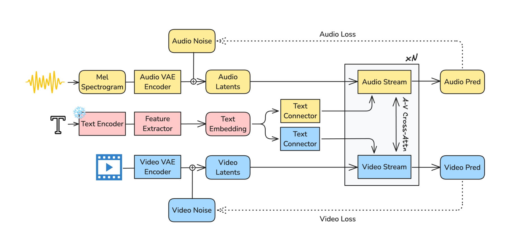
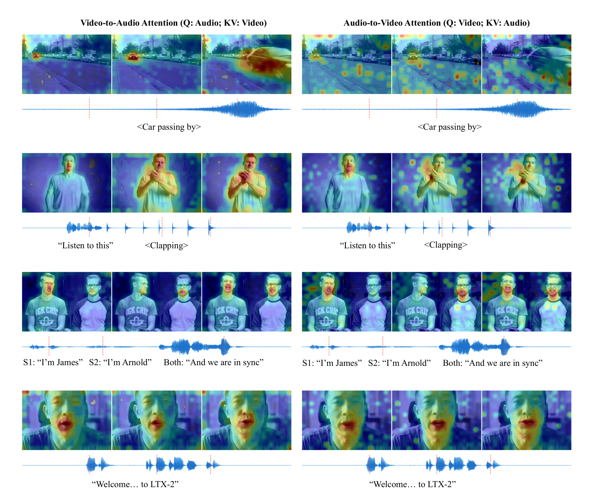
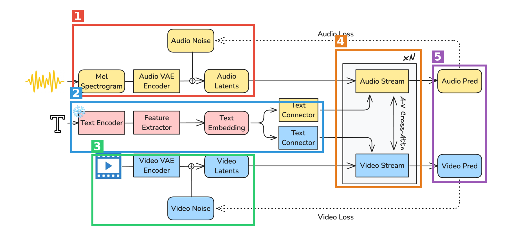
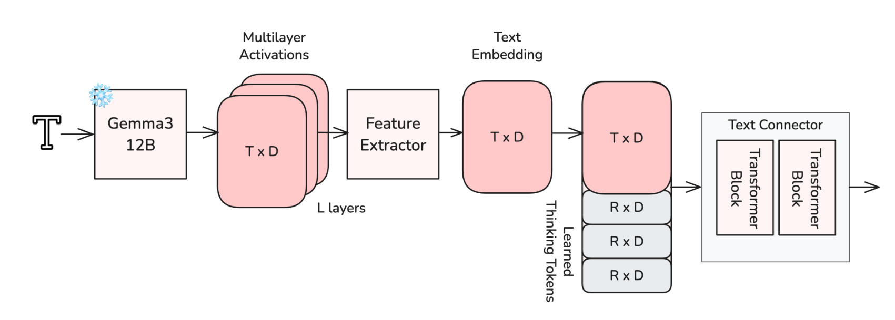
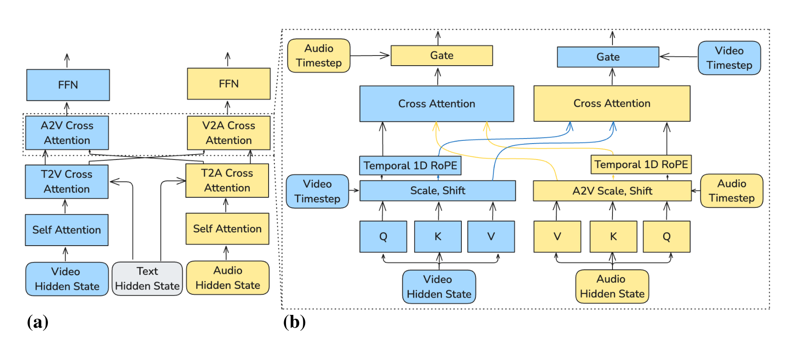
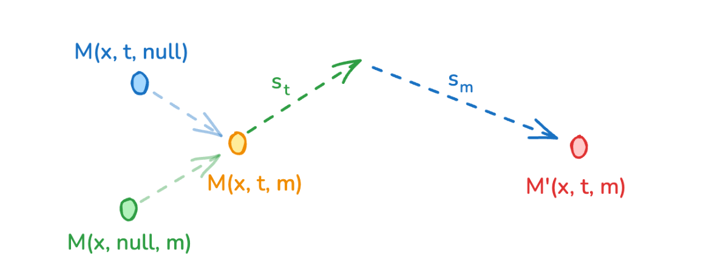
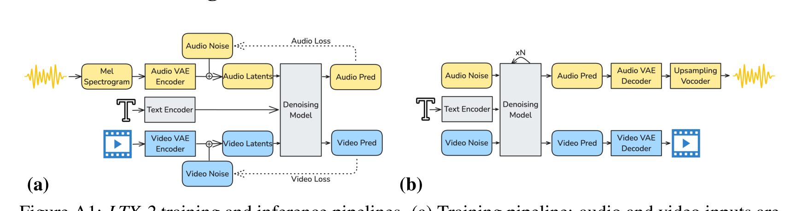

# LTX-2: Efficient Joint Audio-Visual Foundation Model

| 项 | 内容 |
|---|---|
| 题目 | LTX-2: Efficient Joint Audio-Visual Foundation Model |
| 作者 | Yoav HaCohen, Benny Brazowski, Nisan Chiprut, Yaki Bitterman（四位 project lead）+ 25 人团队（按字母序），全部来自 Lightricks |
| arXiv | [2601.03233](https://arxiv.org/abs/2601.03233)（2026-01-06 提交，cs.CV） |
| 代码 | [github.com/Lightricks/LTX-2](https://github.com/Lightricks/LTX-2)（已验证，实质代码） |
| 权重 | [huggingface.co/Lightricks/LTX-2](https://huggingface.co/Lightricks/LTX-2)（已验证，19B dev/distilled 全套，不设门槛） |
| 主页 | [ltx.io](https://ltx.io)（来自 repo homepage 字段） |

**结构速览**（14 页 = 10 页正文 + 3 页参考文献 + 1 页附录）：

- §1 Introduction：T2V 模型都是"哑巴"，串行 T2V→V2A 管线次优，提出统一联合生成 + 四条设计原则与四项贡献
- §2 Related Work：DiT/Rectified Flow 基础；T2V、解耦音视频合成、并发 T2AV 工作（Veo 3 / Ovi / BridgeDiT）；文本条件化演进
- §3 Method：3.1 非对称双流 DiT（14B 视频流 + 5B 音频流、双向 AV cross-attention、cross-modality AdaLN）；3.2 文本条件管线（冻结 Gemma3-12B + 多层特征抽取 + thinking tokens）；3.3 音频 VAE（双声道 mel、128 维 latent）与 HiFi-GAN 改版 vocoder
- §4 Inference：4.1 modality-CFG（文本引导与跨模态引导两个独立 scale）；4.2 多尺度多 tile 推理出 1080p
- §5 Training Data：LTX-Video 数据子集 + 自建音视频细粒度 captioning 系统（一页不到）
- §6 Experiments：6.1 内部人类偏好研究（**无任何数字**）；6.2 Artificial Analysis 外部榜单排名；6.3 推理速度 Table 1（全文唯一定量表）
- §7 Limitations：低资源语言、多说话人分配错乱、>20s 漂移、无推理/世界建模能力
- §8 Social Impact；§9 Conclusion（⚠️ 参数量表述与正文矛盾，见第3章 W2）
- 附录 A.1：仅两张图——训练/推理管线图（flow-matching loss）与单流内部结构图；**无训练细节、无消融**

---

## 第1章 · 作者与实验室背景评估

> 本章由联网调研 agent 完成，所有 URL 均实际访问验证过；Google Scholar / LinkedIn 因反爬未能验证的一律不列。

### 作者背景表

| 人名 | 角色 | 单位 | 主方向 | 代表作 | 主页链接 |
|---|---|---|---|---|---|
| Yoav HaCohen | 一作 / project lead | Lightricks（以色列耶路撒冷），Generative AI Research Team Lead | 视频/音视频生成；早年计算摄影 | LTX-Video（arXiv 2501.00103，一作）、LTX-2（本文一作）、SIGGRAPH/TOG 2011·2013 | [DBLP](https://dblp.org/pid/99/9924.html)；个人主页未找到（Scholar 页存在但未能打开验证，不列） |
| Nisan Chiprut | project lead | Lightricks, Researcher | 视频生成模型 | LTX-Video 二作 | 未找到主页 |
| Benny Brazowski | project lead | Lightricks | 视频生成模型 | LTX-Video 三作 | 未找到主页 |
| Yaki Bitterman | project lead | Lightricks | 视频生成模型 | LTX-Video 作者 | 未找到主页 |

四位 lead 全部出现在 LTX-Video（arXiv 2501.00103）16 人作者名单中（已在 arXiv abs 页逐一核对）——LTX-2 是同一团队同一模型线的直接续作。

### 实验室（公司团队）主方向：传统强方向的自然延伸

**事实**：Lightricks 2013 年由 5 名希伯来大学博士生创立，主业消费级影像 App（Facetune 2 亿+下载、Videoleap 2017 Apple 年度 App，2025 年约 $2.5 亿 ARR）。生成模型线时间轴：LTX Studio（2024.02）→ **LTX-Video 开源**（2024.11，2025.05 升级 13B）→ **LTX-2**（2025.10 发布、2026.01 开源权重）→ LTX-2.3/2.5（与 Nvidia 合作端侧部署）。证据：[Wikipedia: Lightricks](https://en.wikipedia.org/wiki/Lightricks)、[LTX-Video 论文](https://arxiv.org/abs/2501.00103)、[官方 repo](https://github.com/Lightricks/LTX-2)、[Google Cloud 官方客户案例](https://cloud.google.com/customers/lightricks-ltxv)（用 TPU 训练、公开主张开源路线）。

**音视频联合方向的前置积累**：CAFA（ICCV 2025，video-to-audio foley，[arXiv 2504.06778](https://arxiv.org/html/2504.06778v3)）经核实确系 Lightricks 相关——Tavi Halperin、Gleb Sterkin 两人以 Lightricks 署名，一作 Roi Benita（Technion）脚注注明"Work done as part of an internship at Lightricks"，且 Roi Benita、Michael Finkelson 均出现在本文作者名单中。即团队做 LTX-2 之前已有音频侧真实积累。

**判定：传统强方向**——视频生成是公司级战略产品线，音频联合是在既有主线上的增量扩展，非蹭热点新开方向。

### 一作画像

Yoav HaCohen：希伯来大学 CS 博士（2014，图像增强方向），早年 SIGGRAPH/TOG/ICCV 计算摄影论文，之后约十年发表空窗（**推断**：在工业界做产品研发），2024 年底以 LTX-Video 一作重返发表。**这不是其首篇本方向工作**——LTX-2 是 LTX-Video 的二代。

### 水平预判（事实与推断分开）

- **事实**：一作有直接积累（两代模型一作）；团队主业就在此方向（公司旗舰产品线）；单位有音视频联合前置工作（CAFA）；代码+全套权重（约 66GB）实际公开可下载。
- **推断（水毕业风险：低）**：依据上述三层连续投入 + 模型可下载可复跑，灌水动机与空间都小。需留意的风险模式是公司论文的通病：评测利己、与闭源对手的对比无法复核（此判断依据 technical report 的一般模式而非本次调研事实，交由第3章盲审与 5.4 复现性核查验证——事后看，两处都精确命中）。

---

## 第2章 · 论文类型判定

**结论：a+b 型组合创新为主，加三处组件级原创**（非对称双流 AV cross-attention 耦合、modality-CFG、thinking tokens 文本连接器）。视频骨干、latent 空间、音频参数化、vocoder、文本编码器全部来自已有工作；原创部分是把两条模态流"缝"在一起的耦合层与推理期引导机制。

### 组件清单（均为方法节实际承担流程环节、且在参考文献中真实存在的引用）

| 组件 | 原论文 | 在本文中承担的角色 |
|---|---|---|
| LTX-Video [11] | [arXiv 2501.00103](https://arxiv.org/abs/2501.00103) | 视频流骨干与深压缩时空 causal VAE；训练数据也是其子集（§5） |
| DiT [23] | [arXiv 2212.09748](https://arxiv.org/abs/2212.09748) | 整个去噪网络的架构范式（§2） |
| Flow Matching / Rectified Flow [15] | [arXiv 2210.02747](https://arxiv.org/abs/2210.02747) | 训练目标：匹配速度场的 flow-matching loss（附录 Fig. A1） |
| Gemma 3 (12B) [27] | [arXiv 2503.19786](https://arxiv.org/abs/2503.19786) | 冻结的多语言文本编码器（§3.2） |
| AudioLDM / AudioLDM 2 [17][18] | [arXiv 2301.12503](https://arxiv.org/abs/2301.12503) / [arXiv 2308.05734](https://arxiv.org/abs/2308.05734) | mel-spectrogram 潜空间参数化方案，本文扩展为双声道（§3.3） |
| HiFi-GAN [13] | [arXiv 2010.05646](https://arxiv.org/abs/2010.05646) | vocoder 底座，本文改为立体声联合合成 + 16→24kHz 上采样、通道数翻倍（§3.3.1） |
| Classifier-free Guidance [12] | [arXiv 2207.12598](https://arxiv.org/abs/2207.12598) | modality-CFG 的基础公式（§4.1） |
| Registers / MetaQueries 等 [4][30][22] | [arXiv 2309.16588](https://arxiv.org/abs/2309.16588) / [arXiv 2410.14072](https://arxiv.org/abs/2410.14072) / [arXiv 2504.06256](https://arxiv.org/abs/2504.06256) | thinking tokens 的思想来源（"额外可学习 token 作全局信息载体"，§3.2.2 明确引用） |
| 多层 LLM 特征抽取 [10][16][29] | [arXiv 2511.06876](https://arxiv.org/abs/2511.06876) / [arXiv 2409.10695](https://arxiv.org/abs/2409.10695) / CVPR 2025（Wang et al.，refs 未给 arXiv 号） | Feature Extractor 的动机文献（§3.2.1） |

对照系统（非组件）：Veo 3 [8]、Ovi [24]（[arXiv 2510.01284](https://arxiv.org/abs/2510.01284)）、BridgeDiT [9]（[arXiv 2510.03117](https://arxiv.org/abs/2510.03117)）、Sora 2 [21]。

疑似借鉴（论文未引用）：未发现明显案例——方法节各环节都有对应引用，引用规范较好。

---

## 第3章 · 双盲评审 + Rebuttal（全流程记录）

### 3.1 初审意见（由隔离上下文的盲审 agent 独立生成）

> 盲审 agent 只见净化后全文（作者、机构、代码 URL、同团队自引 [11][1] 作者名均已移除），按 Science 家族水位评审。以下为原样记录（Summary 与 Strengths 略有压缩，Weaknesses 起全文保留）。

**Summary**：论文提出开源 T2AV 模型 LTX-2：非对称双流 DiT（14B 视频 + 5B 音频），双向 AV cross-attention + cross-modality AdaLN 耦合；文本侧冻结 Gemma3-12B + 多层特征抽取 + thinking tokens；推理侧 modality-CFG 与 multi-scale multi-tile 出 1080p。声称开源 SOTA、媲美 Veo 3 / Sora 2、比 Wan 2.2-14B 快约 18 倍。

**Strengths**：架构设计动机链条清晰（信息密度→非对称容量；解耦 VAE→原生 V2A/A2V 编辑；跨模态只用时间 RoPE→强制时间对齐）；modality-CFG 公式化干净、可被社区复用；Figure 3 attention 可视化提供了跨模态对齐的定性证据；开放承诺；Limitations 一节诚实。

**Weaknesses**：

- **W1（致命）：支撑核心结论的音视频评估完全没有报告任何数据。**"开源 SOTA、媲美专有模型"的唯一依据是 §6.1 一段文字（"Our internal benchmarks indicate..."），无评估者人数、无 prompt 数、无样本 n、无偏好率、无置信区间、无统计检验；"significantly" 在无检验统计量的情况下使用，直接违反 Science 家族统计报告政策。与 Ovi/BridgeDiT 也没有任何客观指标（FVD/FAD/同步指标）对比。这不是披露不充分，而是主结论没有可核验的证据。
- **W2（致命）：参数量表述自相矛盾。** 摘要与 §3.1 写 14B+5B（与 Table 1 的 19B 一致），Conclusion 却写"extending a pretrained 13B video diffusion transformer with a lightweight 3B audio stream"；且"视频流由预训练模型扩展而来""progressive joint training"这两个关键训练事实只在 Conclusion 出现，Method 节从未描述。
- **W3（严重）：Table 1 的实验设计不支持"18× 快"的强结论。** 单一配置单个数字、无重复无方差；LTX-2 与 Wan 2.2 latent 压缩率不同，在质量端无数据的前提下"每步耗时"混淆了"架构快"与"压缩狠"；与 Ovi 的速度对比连数字都没有。
- **W4（严重）：四项 claimed contributions 零消融。** modality-CFG（"significantly improving alignment"仅一句经验陈述，且推理期即可消融、成本最低）、thinking tokens、多层特征抽取、非对称容量分配，全部无对照实验，读者无法区分哪些组件真正起作用。
- **W5（严重）：可复现性信息大面积缺失。** 训练数据只有"LTX-Video 子集"一句话，无规模、无构成；captioning 系统未说明用什么模型构建；优化器/学习率/batch size/步数/算力/loss 权重全部缺失；附录只有两张图。
- **W6（中等）：外部榜单不可核验且时效性存疑。** Artificial Analysis 排名协议不受论文控制、随时间变动；"联合训练不损害视觉质量"本可用"同一骨干加音频流前后对照"直接验证，论文没做，也没在 VBench 等公开 benchmark 上报数字。
- **W7（中等）：多语言与 20 秒长时程两项能力 claim 零评估。** 无分语言 WER/可懂度，无 20s 样本的同步性测量（§7 反而承认接近 20s 会漂移）。

**Questions（6 条）**：偏好研究完整协议与数字；14B+5B 还是 13B+3B、progressive training 阶段划分；Table 1 是否含 VAE 解码与 vocoder、端到端时间；modality-CFG 开关消融与权重选定方式；训练数据规模与语言分布、captioning 用什么模型；有无任何公开客观指标对比。

**Minor**：音频 latent 与视频 latent 时间粒度对应关系未给；§4.1 公式排版乱码；"unprecedented speed"等宣传措辞；Figure 3 取前/后 1/3 推理步的依据未说明。

**初审评级：reject**——贡献属组件级改进（方向已有 Veo 3 / Ovi / BridgeDiT 在先），本就处于门槛边缘；决定性的是证据端：核心结论依赖一段无任何数字的"internal benchmarks"叙述，四项贡献零消融，参数量自相矛盾。

### 3.2 Rebuttal（作者方，诚实优先）

逐条回应见流程记录，核心如下。

**承认的批评（= 本文真正硬伤一览）**：

1. **W1 全部承认**：全文无任何评估协议、n、数值、统计检验、客观指标——本文最大硬伤，不辩护。
2. **W2 全部承认**：矛盾真实存在（仅按论文内部证据推断 14B+5B 为本意：三处一致 vs Conclusion 一处孤立）；Method 节缺失预训练初始化与 progressive training 描述，承认。
3. **W4 全部承认**：零消融无从辩护；modality-CFG 无需重训也没做，只能归因于评估工作缺位。
4. **W5 主体承认**：训练数据规模、captioning 实现、全部训练超参缺失，从头复现训练不可能。
5. **W7 主体承认**：两项能力 claim 论文内零测量。
6. **W3 部分承认**：无重复测量、无端到端时间、与 Ovi 无数字。

**辩护的点（论据仅来自论文内部）**：

- W3：latent 压缩率不是混淆变量而是显式设计自由度（§1 Decoupled Latent Representations、§3.3 采纳 [11] 深压缩空间），相同帧数/分辨率下每步耗时衡量的是完整系统方案的成本；但同意在质量端无数据（W1）前提下"更快"无法与"质量受损"解耦。
- W5：权重与代码公开使推理侧复现可行；附录 Fig. A1 明确训练目标为 flow-matching loss。
- W6：Artificial Analysis 为第三方独立榜单、数据非作者自报、引用日期固定（2025-11-06），作为旁证有独立性。
- W7：§7 主动披露语言差距与 20s 漂移，能力边界报告诚实。

### 3.3 审稿人二轮回复 + 最终评级

- **W1 维持**（双方确认）："读者可自己生成样本验证"不是同行评审可接受的证据形态，且对 Veo 3 / Sora 2 闭源对照连原则上都无法复核。
- **W2 维持但降格**：接受"14B+5B 为本意"的文本推断，问题从"不知道模型是什么"降为"结论段事实性错误 + Method 节重大省略"。
- **W3 部分撤回、主体维持**：撤回"混淆变量"定性（认可压缩率是明示的设计自由度、每步耗时衡量完整系统成本）；维持"18×"孤立数字不能支撑与质量绑定的摘要级 claim。
- **W4、W5、W7 维持**（双方确认）。
- **W6 部分撤回、主体维持**：认可第三方榜单独立性高于自报数字；维持"旁证不能替代论文内可存档、协议可审的 benchmark 数字"。
- 六个 Questions 中五个的答案是"论文未包含该信息"，本身即证据缺口的最直接印证。

**最终评级：reject（维持初审）**。审稿人结语：rebuttal 全部由承认与语境说明构成，无新证据；这项工作作为开源工程系统有真实价值，补齐完整评估与训练细节后值得重新评审，"但那将是一篇实质上不同的论文"。评审终止。

---

## 第4章 · 大白话：这篇文章在做什么

**场景**：AI 文生视频——我打一段字，模型生成一段视频。但现在的模型（Wan、HunyuanVideo、LTX-Video）生成的全是**无声片**：画面再好，人张嘴没声音、关门没响动，得再找一个配音模型往上贴音轨。

**之前的方法**：要么先生成视频再"看图配音"（V2A），要么先有音频再"听声画面"（A2V）。两段式的毛病是后做的一方永远迁就先做的一方——配音模型看到的视频可能根本没给出足够的声音线索，而且口型和语音是同一件事的两面，分两步做天然对不齐。闭源的 Veo 3 已经证明"一口气同时生成音+画"效果最好，但开源界缺一个这样的模型。

**本论文的方法**：训一个"连体"模型一次同时生成画面和声音：视频一条流（14B，管画面这种信息量大的）、音频一条流（5B，管声音这种信息量小的），两条流在每一层互相"看"对方（双向 cross-attention），生成时同步商量——嘴型跟着台词动，撞击声跟着物体落地响。附带三个小发明：用大语言模型深挖文本让它连口音语气都听懂、给文本加"思考 token"、推理时把"听文字的话"和"跟对面模态对齐"两个力度分开调。结果：开源里效果最好，速度比同级视频模型快约 18 倍，权重全开源。

**图内文字中文翻译**（按阅读顺序）：这张图画的是整个系统的数据流。左侧三路输入：声波→**梅尔频谱图**→**音频 VAE 编码器**→（训练时叠加**音频噪声**）→**音频潜变量**；文字 T →**文本编码器**（❄ 表示冻结不训练）→**特征抽取器**→**文本嵌入**，分岔进两个**文本连接器**（黄色给音频流、蓝色给视频流）；视频帧→**视频 VAE 编码器**→（训练时叠加**视频噪声**）→**视频潜变量**。中间大框是重复 N 层的双流主干：**音频流**与**视频流**并行去噪，中间的双向箭头是**音-视交叉注意力**（A-V Cross-Attn），文本连接器的输出分别喂给两条流。右侧输出**音频预测**与**视频预测**，训练时分别与所加噪声对照计算**音频损失**/**视频损失**（虚线）。

自查：不做这个方向的人应该能看懂——"无声片配音两步走不如连体一次生成"。

---

## 第5章 · 实验

⚠️ 本文是视频生成论文，无仿真/真机之分；按论文自己的三块评估组织。先说总印象：**实验是全文最薄的部分**（不足 1.5 页），全文只有一张定量表。

### 5.1 音视频质量：人类偏好研究（§6.1）

- **场景一句话**：让人看不同模型生成的带声视频，选哪个更好（画面真实感、音频保真度、口型/拟音同步）。
- **条件**：对比对象为开源 Ovi、闭源 Veo 3 与 Sora 2。**数据量：论文未提及**——评估者人数、prompt 数、样本数、偏好率数值、统计检验，一概没有（这正是盲审 W1）。
- **结论原文**：显著优于 Ovi；与 Veo 3 / Sora 2 "comparable"。无表无图，无法汉化成表格。
- 场景图：论文无此实验的配图；相关可视化只有 attention map（Figure 3，嵌在下方 5.3 节）。

### 5.2 视觉质量：Artificial Analysis 外部榜单（§6.2）

- **场景一句话**：第三方网站让全网用户盲选两个模型的生成视频投票，形成天梯排名。
- **结果**（截至 2025-11-06）：Image-to-Video 第 3、Text-to-Video 第 4，超过 Sora 2 Pro 与 Wan 2.2-14B。用来支撑"加了音频流不牺牲画质"。
- 论文未在 VBench 等任何可存档的公开 benchmark 上自报数字（盲审 W6）。
- 项目主页：[ltx.io](https://ltx.io)（论文脚注只给了 GitHub；主页地址来自 repo 的 homepage 字段）。

### 5.3 推理速度（§6.3，Table 1 汉化）

条件：H100 单卡，121 帧 720p，单步 Euler 采样器，CFG=1，比较**每个扩散步耗时**（不含 VAE 解码与 vocoder——按"per diffusion-step"定义推断，论文未明说）。

| 模型 | 模态 | 参数量 | 每步耗时 |
|---|---|---|---|
| Wan 2.2-14B | 仅视频 | 14B | 22.30 秒 |
| **LTX-2** | **音频 + 视频** | **19B** | **1.22 秒**（≈18× 快） |

另有无数字的定性陈述：比 Ovi（两条 5B 流）更快；最长可生成 20 秒（对比 Veo 3 的 12s、Sora 2 的 16s、Ovi/Wan 2.5 的 10s）。

**图内文字翻译**：左列为"视频→音频注意力"（Query 是音频，Key/Value 是视频），右列反之。四组例子自上而下：〈汽车驶过〉——注意力热区跟着画面里移动的车走；"听听这个"+〈鼓掌〉——热区从说话人嘴部转到拍手的手；S1"我是 James"/S2"我是 Arnold"/齐声"我们同步了"——热区在两个说话人之间切换、齐声时同时覆盖两人；"欢迎来到 LTX-2"——特写镜头下热区聚焦唇部。波形图上的红竖线标出所示帧的时间戳。

### 为什么选这些实验（对照数字回答）

- **共同特性**：三块评估全部绕开"可存档的客观指标"，选的都是**主观偏好类**（内部人类研究、第三方投票榜单）或**纯系统效率类**（每步耗时）的证据。
- **方法设计恰好吃哪个特性**：LTX-2 的真正杀手锏是继承 LTX-Video 的**深压缩 latent 空间**——latent token 少，每步计算量就小，所以 Table 1 的 18×（1.22s vs 22.30s）是其优势最大化的展示方式；且论文自己承认"分辨率越高、时长越长差距越大"。20 秒时长优势同样是深压缩的直接红利（同样显存装下更多秒数）。
- **该测但没测的**（缺席即信号）：①FVD/FAD/AV-sync 等该领域常规客观指标——与 Ovi、BridgeDiT 的直接对比全部缺席；②VBench 类公开视频 benchmark；③"同一视频骨干加/不加音频流"的对照——这是验证"联合训练不损害画质"最便宜的实验。缺席的共同点：这些都是**别人可以复核**的数字。与 5.1 的"comparable to Veo 3/Sora 2"无数字陈述合观，评测选择明显利己（盲审 W1/W6 的判断，第1章的预判在此应验）。

### 5.4 复现可能性（硬核查，逐项附证据来源）

| 项 | 状态 | 证据 |
|---|---|---|
| 代码仓库 | ✅ 存在且为实质代码 | [github.com/Lightricks/LTX-2](https://github.com/Lightricks/LTX-2)（已打开验证：4 个包 ltx-core / ltx-kernels / ltx-pipelines / ltx-trainer，10+ 条推理 pipeline，9016 stars） |
| ckpt：论文版 19B | ✅ 全开源、不设 gate | [HF Lightricks/LTX-2](https://huggingface.co/Lightricks/LTX-2)（已列文件核验：ltx-2-19b-dev / distilled 及 fp8/fp4 变体、audio_vae、connectors、text_encoder、latent/temporal upscaler、scheduler） |
| ckpt：逐组件 | ✅ dev+distilled 双版本，VAE/connector/上采样器分文件齐全 | 同上文件清单 |
| 后续版本 | ✅ LTX-2.3 / 2.5（22B）另库发布（约 66GB），注意**与论文描述的 19B 不是同一模型** | repo README、MODELS-LTX-2.3.md（已读） |
| 推理脚本 | ✅ 命令行即用（含量化/offload 选项） | README Quick Start（已读） |
| 训练代码 | ⚠️ 仅 LoRA trainer，**无预训练/全量训练代码** | repo 描述："inference and LoRA trainer package" |
| 原始数据 | ❌ 未开放 | 论文 §5 仅说"LTX-Video 数据子集"；repo 无数据 |
| 数据规模/构成 | ❌ 论文未提及（无小时数/clip 数/语言分布） | §5 全文核对 |
| captioning 系统 | ❌ 用什么模型构建、质量如何验证，论文未提及 | §5.1 全文核对 |
| 学习率/batch size/步数/schedule | ❌ 论文未提及 | 正文+附录逐节核对，附录仅两张图 |
| 硬件/训练时长 | ❌ 论文未提及 | 同上 |
| 训练流程（progressive joint training 阶段划分） | ❌ 仅 Conclusion 一句带过，Method 无描述 | §9 vs §3（盲审 W2） |
| loss | ⚠️ 仅知 flow-matching（附录 Fig. A1）与文本投影阶段用 MSE（§3.2.1），无权重细节 | Fig. A1、§3.2.1 |

**结论：推理侧可直接复现；训练侧难以复现。** 缺失项：数据规模与构成、captioning 实现、学习率、batch size、训练步数与 schedule、硬件与时长、progressive training 阶段划分、loss 权重、CFG 权重（st/sm）的选定方式。

---

## 第6章 · 方法拆解

### 🟥 1 · 音频编码链（Mel Spectrogram → Audio VAE Encoder → Audio Latents）

- **来源**：mel 频谱参数化沿用 [AudioLDM](https://arxiv.org/abs/2301.12503) / [AudioLDM 2](https://arxiv.org/abs/2308.05734)；深压缩 latent 思想来自 [LTX-Video](https://arxiv.org/abs/2501.00103)。原创点：原生支持**立体声**（双声道 mel 沿通道维拼接）。
- **接口**：进：双声道 16kHz 波形；出：每个 token ≈1/25 秒、128 维的 1D latent 序列。
- **训练时**：causal 音频 VAE 独立于 DiT（细节论文未提及）；DiT 训练时在 latent 上加噪。
- **部署时**：波形→mel→latent，交给 🟧。

### 🟦 2 · 文本理解管线（Text Encoder → Feature Extractor → Text Embedding → 两个 Text Connector）

- **来源**：编码器 = 冻结的 [Gemma3-12B](https://arxiv.org/abs/2503.19786)；"用所有层而非最后一层"的动机来自 [Playground v3](https://arxiv.org/abs/2409.10695) 等；thinking tokens 思想来自 [ViT registers](https://arxiv.org/abs/2309.16588)、[MetaQueries](https://arxiv.org/abs/2504.06256) 等。组合方式为作者原创。
- **接口**：进：文本 prompt；出：**两套**条件 token 序列（视频流、音频流各配一个独立的 Text Connector）。
- **训练时**：Gemma3 全程冻结；投影矩阵 W（把 [B,T,D×L] 压回 D 维）在初始阶段与主模型联合训练（标准 diffusion MSE loss）后**冻结**；Text Connector（双向 transformer 块 + 可学习 thinking tokens，thinking tokens 顶替 padding 位）与主干 DiT 一起训练。
- **部署时**：prompt → 逐层特征 → 均值中心化缩放 → 拼接投影 → connector 精炼 → 原始 token + thinking token 一起经 caption projection 进 cross-attention。
- **大白话**：不光听 LLM"最后说了什么"，把它每一层的"心理活动"都拿来用——浅层有发音信息（对说话嘴型很关键），深层有语义；再额外配几个"思考 token"当草稿纸，把散落的上下文信息汇总好了再喂给生成模型。

**图内文字翻译**：文字 T → 冻结（❄）的 **Gemma3-12B** → 全部 L 层的**多层激活**（每层 T×D）→ **特征抽取器**压成一份 T×D 的**文本嵌入** → 在其后拼接若干个 R×D 的**可学习思考 token** → 进入**文本连接器**（若干个双向 Transformer Block）→ 输出条件序列（视频流与音频流各有一套独立的连接器）。

### 🟩 3 · 视频编码链（Video VAE Encoder → Video Latents）

- **来源**：[LTX-Video](https://arxiv.org/abs/2501.00103) 的时空 causal VAE（1:192 高压缩比是 LTX 系的招牌）。
- **接口**：进：视频帧序列；出：3D（x,y,t）视频 latent token；训练时加噪后交给 🟧。

### 🟧 4 · 非对称双流 DiT（Audio Stream 5B + Video Stream 14B + A-V Cross-Attn，×N 层）

- **来源**：[DiT](https://arxiv.org/abs/2212.09748) 范式；视频流承自 LTX-Video；**双流耦合方式是本文核心原创**。
- **接口**：进：加噪音频 latent + 加噪视频 latent + 两套文本条件；出：两路去噪预测。
- **每层四步**（Figure 2）：同模态 Self-Attention → 文本 Cross-Attention → **音视 Cross-Attention** → FFN，层间穿插 RMS Norm。视频流用 3D RoPE（x,y,t），音频流用 1D 时间 RoPE；跨模态注意力**只用时间分量的 RoPE**——强迫两条流只在"时间对齐"上互相找对应，不管空间位置。Q 和 (K,V) 分别被本模态 timestep 的 AdaLN 缩放平移（控制"暴露/接收多少"），注意力输出再过一道由**对方模态** timestep 决定的 AdaLN 门（cross-modality AdaLN，控制"吸收多少"）——两模态去噪进度不同步时也能协调。
- **训练时**：flow-matching loss 匹配速度场（附录 Fig. A1a）；数据为 LTX-Video 子集中"有实质音频内容"的 clip + 自建系统生成的音画双轨详细 caption（含对话转写、说话人/语言/口音标注）。
- **部署时**：从纯噪声起步迭代 N 步（附录 Fig. A1b）。

**图内文字翻译**：(a) 左（蓝）视频流、右（黄）音频流，自下而上：隐状态 → Self Attention → T2V/T2A 文本交叉注意力（中间灰块是文本隐状态）→ A2V/V2A 音视交叉注意力（虚线框）→ FFN。(b) 交叉注意力块内部：视频/音频隐状态各自投影出 Q/K/V → 由本模态 timestep 驱动的 Scale,Shift（对方向的用 A2V Scale,Shift）→ 时间 1D RoPE 对齐 → Cross Attention → 由对方 timestep 驱动的 Gate 门控输出。

### 🟪 5 · 输出端（Audio/Video Pred → VAE 解码 → Vocoder）

- **来源**：视频 VAE 解码器承自 LTX-Video；vocoder 基于 [HiFi-GAN](https://arxiv.org/abs/2010.05646)，改动：双声道联合合成、16kHz mel 输入→24kHz 波形输出、生成器通道数翻倍。
- **接口**：进：去噪完成的两路 latent；出：视频帧 + 24kHz 立体声波形。
- **训练时**（DiT 视角）：两路预测分别与所加噪声对照计算 Audio/Video Loss。

**接口自查**：波形/文本/视频帧 →（🟥🟦🟩）三路编码 → 🟧 联合去噪 → 🟪 解码回波形与帧，首尾相接 ✅。

### 推理期两个附加机制（不在总览图内）

**modality-CFG（§4.1，Figure 5）**：每条流的引导预测 = 全条件输出 + st·(有文本−无文本) + sm·(有对方模态−无对方模态)。把"听文字"和"跟对面对齐"两个力度拆开独立调。所用权重：视频流 st=3, sm=3；音频流 st=7, sm=3。

**图内文字翻译**：三个输入点——蓝点 = 去掉对方模态的输出 M(x,t,null)，绿点 = 去掉文本的输出 M(x,null,m)，橙点 = 全条件输出 M(x,t,m)；从橙点出发，沿"文本引导方向"（绿虚线，力度 s_t，即全条件与无文本之差）和"跨模态引导方向"（蓝虚线，力度 s_m，即全条件与无对方模态之差）依次外推，得到最终引导预测 M'(x,t,m)（红点）。

**多尺度多 tile 推理（§4.2）**：先在约 0.5MP 低分辨率生成"底片"定构图/运动/音画同步 → 专用 latent 上采样器放大 → 切成时空重叠 tile 逐块精修（同一套模型参数）→ latent 域拼接融合 → VAE 解码出 1080p。

**图内文字翻译**：(a) 训练：音/视输入经各自 VAE 编码为 latent，加噪后进去噪模型，预测与噪声算音频/视频损失（flow-matching 匹配速度场）。(b) 推理：从音/视噪声出发，去噪模型迭代 N 步 → 音频预测经音频 VAE 解码 + 上采样 vocoder 出波形，视频预测经视频 VAE 解码出帧。

---

## 第7章 · 消融

**本文无消融实验。**

这是明确缺陷，而且是盲审定级为 reject 的四大理由之一（W4）：论文自称四项贡献——非对称双流、thinking tokens、紧凑音频 VAE、modality-CFG——没有任何一项被隔离验证过。尤其刺眼的是 modality-CFG：它是纯推理期机制，把 sm 设成 0 再跑一遍评测就是一个零训练成本的消融，论文也没做，只留下一句"Empirically, we observe that increasing sm promotes mutual information refinement"（§4.1）。非对称容量分配（14B+5B 对比对称方案）、多层特征抽取对比只用最后一层、thinking tokens 的去留，同样全部只有动机叙述没有数字。结果就是：读者无法区分这四个组件哪些真正贡献了效果、哪些只是搭了大模型+大数据的便车。

---

## 收尾备注

- 本文档基于 arXiv v1（2026-01-06）。PDF 首页题目与指定题目核对一致，无 MISMATCH。
- 值得注意的整体图景：这是一篇**模型很硬、论文很软**的 technical report——权重/代码开放程度在同类中数一数二（5.4 节），但作为"论文"其证据链几乎为零（第3章）。读它的正确姿势是当架构设计文档 + 开源模型说明书，而不是当实验论文。
