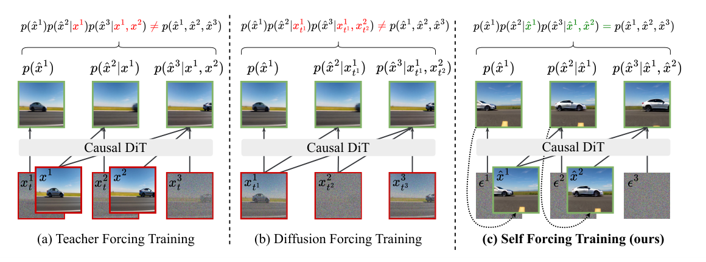
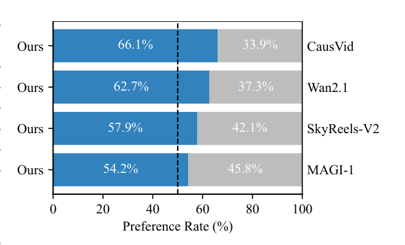
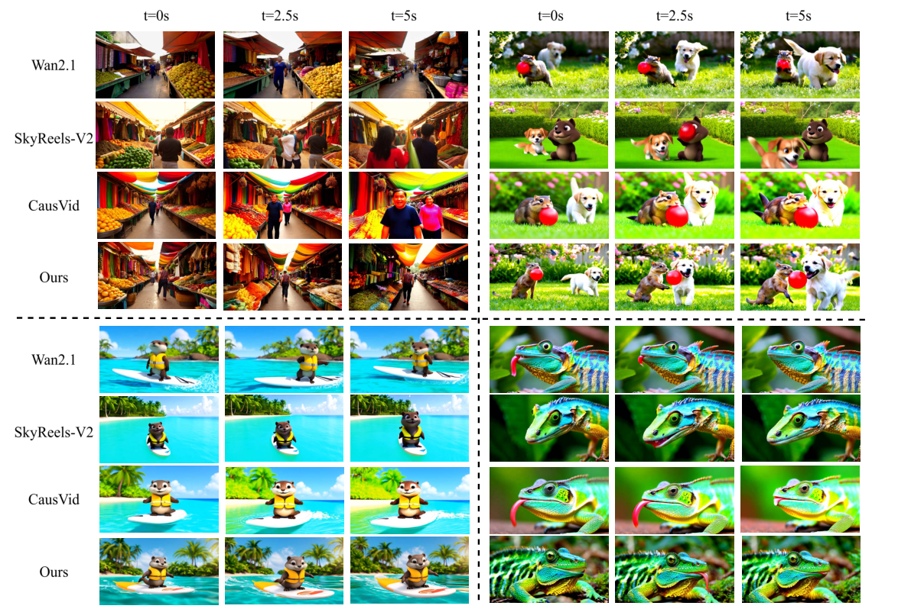
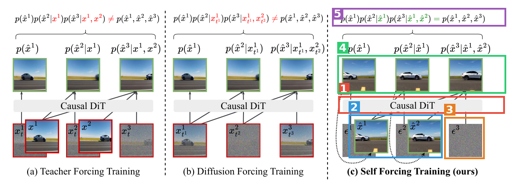
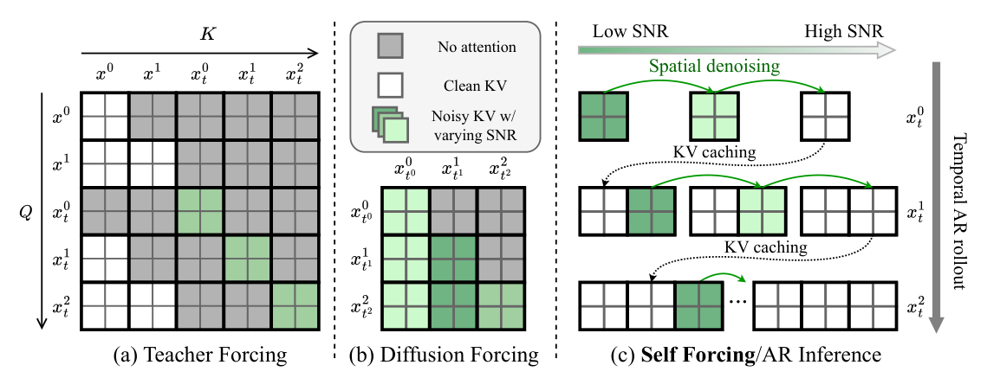
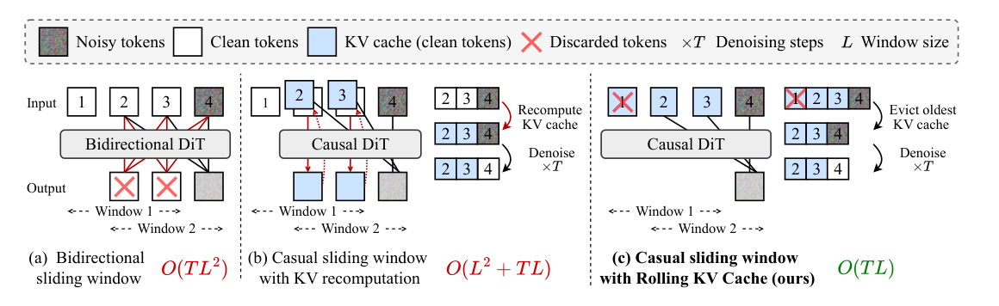
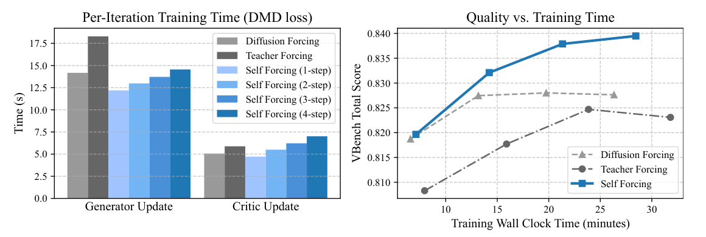

# Self Forcing: Bridging the Train-Test Gap in Autoregressive Video Diffusion

| 项 | 内容 |
|---|---|
| 题目 | Self Forcing: Bridging the Train-Test Gap in Autoregressive Video Diffusion |
| 作者 | Xun Huang¹, Zhengqi Li¹, Guande He², Mingyuan Zhou², Eli Shechtman¹（¹Adobe Research, ²UT Austin） |
| arXiv | [2506.08009](https://arxiv.org/abs/2506.08009)（v2，NeurIPS 2025） |
| 日期 | 2025-06（v1）/ 2025-11-10（v2） |
| 代码 | [github.com/guandeh17/Self-Forcing](https://github.com/guandeh17/Self-Forcing)（Apache-2.0） |
| 主页 | [self-forcing.github.io](https://self-forcing.github.io/) |

**结构速览**：§1 Intro（AR 视频扩散的 exposure bias 问题）→ §2 Related Work（GAN 视频生成 / AR-扩散混合模型 / rolling diffusion / CausVid）→ §3 方法（3.1 AR 视频扩散预备知识；3.2 训练时自回滚 + 梯度截断，Algorithm 1；3.3 三种整段视频分布匹配损失 DMD/SiD/GAN；3.4 rolling KV cache 长视频生成，Algorithm 2）→ §4 实验（Table 1 主对比、Fig 4 用户研究、Table 2 消融、训练效率 Fig 6）→ §5 Discussion（并行训练范式的根本局限、局限与未来方向）→ 附录 A 实现细节（Table 3 全部超参）→ 附录 B rolling KV cache 局部注意力消融 → 附录 C VBench 16 维分数 → 附录 D 社会影响 → 附录 E 用户研究细节。

---

## 第1章 · 作者与实验室背景评估

### 作者背景表（事实）

| 作者 | 单位 | 角色 | 主方向 / 代表作 | 主页 |
|---|---|---|---|---|
| Xun Huang（一作） | Adobe Research | 研究科学家 | 生成模型：**AdaIN**（StyleGAN 核心组件）、**MUNIT**、**CausVid** 共同作者；Cornell PhD（导师 Serge Belongie） | [个人主页](https://www.xunhuang.me/) · [Google Scholar](https://scholar.google.com/citations?user=1XGC4GsAAAAJ) |
| Zhengqi Li | Adobe Research（署名时；检索显示其后转 Google DeepMind） | 研究科学家 | 3D/视频合成：InfiniteNature 系列；Cornell PhD（导师 Noah Snavely） | [个人主页](https://zhengqili.github.io/) |
| Guande He | UT Austin | PhD 学生（2024 起，导师 Mingyuan Zhou），Adobe 实习 | 扩散模型：Diffusion Bridge Implicit Models（ICLR 2025）、Consistency Diffusion Bridge Models（NeurIPS 2024）、RIFLEx（ICML 2025）；官方 repo 的维护者 | 个人主页未找到；[GitHub](https://github.com/guandeh17) · [Google Scholar](https://scholar.google.com/citations?user=3rddMeMAAAAJ) |
| Mingyuan Zhou | UT Austin（McCombs 统计教授） | 教授（Guande He 的导师） | 扩散蒸馏：**SiD** 系列（本文三种损失之一的原作者）、贝叶斯统计 | [个人主页](https://mingyuanzhou.github.io/) |
| Eli Shechtman | Adobe Research | Senior Principal Scientist | 图像/视频生成与编辑（Firefly、Generative Fill 背后），DMD/CausVid 共同作者 | [Adobe 主页](https://research.adobe.com/person/eli-shechtman/) |

论文未标注通讯作者（论文未提及）。

### 实验室主方向判定

**传统强方向**。这是 Adobe Research 视频生成团队与 UT Austin Mingyuan Zhou 组（扩散蒸馏）的合作，两边都在本文方向上有持续投入，证据：

- Adobe 线：DMD（CVPR 2024）、DMD2（NeurIPS 2024）、**CausVid**（CVPR 2025，本文最近邻工作，Shechtman、Xun Huang 均为作者）、Long-context state-space video world models（2025，本文引文 [63]，Shechtman/Huang 参与）——few-step 蒸馏 → 自回归视频扩散一条线连续四年。
- UT Austin 线：SiD（ICML 2024）、Adversarial SiD（ICLR 2025）——本文的 SiD 损失直接来自 Zhou 组自家工作。

### 水平预判（推断，依据如上发表记录）

水毕业风险信号逐条核对：一作无相关积累？**否**（AdaIN/MUNIT/CausVid）。导师主业不在此方向？不适用（工业界论文，一作即资深研究员）。实验室无持续投入？**否**（CausVid→Self Forcing 是同团队直接迭代）。单位无积累？**否**（Adobe 是视频生成头部工业实验室）。

预判：这是头部团队在自己最强方向上的延续性工作，且是 CausVid 的"官方修正版"（一作本人是 CausVid 作者，本文核心动机就是指出 CausVid 的分布失配缺陷），可信度先验高；风险不在"水"，而在工业界论文常见的"claim 略强于证据"（后经第3章盲审印证：surpassing 表述与 14B 教师混淆）。

> ⚠️ 本章内容未进入第3章盲审 agent 的上下文。

---

## 第2章 · 论文类型判定

**结论**：a+b+c 型组合创新 + 一处核心原创模块——把「few-step 扩散蒸馏（CausVid/DMD/SiD/GAN）」×「自回归视频扩散（Wan2.1 骨干）」×「LLM 的 rolling KV cache（StreamingLLM）」组合起来，原创点是**训练时带 KV cache 的自回滚 + 随机梯度截断**（Algorithm 1），使"训练分布 = 推理分布"成为可计算的训练目标。

组件清单（均为论文参考文献中真实引用、在方法流程中实际承担环节的工作）：

| 组件 | 原论文 | 在本文中承担的角色 |
|---|---|---|
| Wan2.1-T2V-1.3B | [arXiv:2503.20314](https://arxiv.org/abs/2503.20314) | 骨干与初始化权重；14B 版本用作 DMD 的 real score / GAN 的数据生成器（§4） |
| CausVid | [arXiv:2412.07772](https://arxiv.org/abs/2412.07772) | ODE 初始化协议 + few-step AR 蒸馏框架的直接前身；本文即针对其"DF 输出 ≠ 推理分布"缺陷（§2、§3.3） |
| DMD / DMD2 | [arXiv:2311.18828](https://arxiv.org/abs/2311.18828) / [arXiv:2405.14867](https://arxiv.org/abs/2405.14867) | 分布匹配损失之一（reverse-KL，§3.3、附录 A 式(2)(3)） |
| SiD | [arXiv:2404.04057](https://arxiv.org/abs/2404.04057) | 分布匹配损失之二（Fisher 散度，附录 A 式(4)） |
| R3GAN | [arXiv:2501.05441](https://arxiv.org/abs/2501.05441) | 分布匹配损失之三（relativistic GAN + R1/R2 正则，§4、附录 A 式(5)-(7)） |
| StreamingLLM (attention sinks) | [arXiv:2309.17453](https://arxiv.org/abs/2309.17453) | rolling KV cache 的灵感来源（§3.4 明引 [92]） |
| Flow Matching | [arXiv:2210.02747](https://arxiv.org/abs/2210.02747) | 噪声调度/参数化框架（附录 A） |
| VidProM | [arXiv:2403.06098](https://arxiv.org/abs/2403.06098) | 训练 prompt 数据源（§4、附录 A：过滤+Qwen 扩写后约 250k 条） |
| Professor Forcing | [arXiv:1610.09038](https://arxiv.org/abs/1610.09038) | RNN 时代"用自生成序列训练"的思想源头（§1 明引 [40]） |
| FlashAttention-3 | [arXiv:2407.08608](https://arxiv.org/abs/2407.08608) | 训练基础设施（SF 无需特殊掩码故可用之，这是训练效率优势的一半来源，§4） |
| VBench | [arXiv:2311.17982](https://arxiv.org/abs/2311.17982) | 主评测协议 |

疑似借鉴（论文未引用）：未发现——需要指认的思想源头（Professor Forcing、SeqGAN、sequence-level training）论文都在 §1 老实引了。

---

## 第3章 · 双盲评审 + Rebuttal（隔离上下文，全流程记录）

净化说明：从 `_work/fulltext.txt` 生成 `_work/sanitized.txt`，删除作者/机构行、NeurIPS 录用戳与 arXiv 水印、项目 URL（两处）、致谢与资助段、参考文献作者名（保留方法关键引文的编号→标题映射），逐段检查无残留。

### 3.1 初审意见（由隔离上下文的盲审 agent 独立生成，按 Science Robotics 水位）

> **Summary**：本文提出 Self Forcing，一种针对自回归视频扩散模型的后训练范式，旨在解决 exposure bias：训练时不再以 ground-truth（Teacher Forcing）或加噪 ground-truth（Diffusion Forcing）作为上下文，而是在训练中执行带 KV cache 的自回归 rollout，以模型自生成的帧为条件，并在完整生成视频上施加 holistic 分布匹配损失（DMD / SiD / GAN 三种实现）。为控制计算开销，方法采用 4 步扩散骨干与随机梯度截断策略，并提出 rolling KV cache 机制支持长视频外推。基于 Wan2.1-T2V-1.3B 的实验声称在单张 H100 上实现 17 FPS、亚秒级延迟的实时生成，VBench 与用户偏好研究显示质量匹敌或超过更慢的双向扩散模型。
>
> **Strengths**
> - **问题诊断清晰且有理论表述**。第 3.3 节将 TF/DF 刻画为 frame-wise 分布匹配（上下文从数据分布采样）、将本方法刻画为 holistic 分布匹配（上下文从模型自身分布采样），并明确指出 CausVid 的 DMD 损失匹配的不是推理时分布。这一诊断是对该方向一个真实缺陷的精准定位，而非泛泛的动机陈述。
> - **消融设计有良好的对照卫生**。Table 2 在同一实现框架、同一训练条件下复现了 CausVid（DF + DMD）并与 Self Forcing 直接对比，且在 chunk-wise 与 frame-wise 两种设置、三种分布匹配目标下均有结果，隔离了训练范式这一变量。frame-wise 设置下基线大幅退化（DF: 77.24）而 Self Forcing 保持稳定（84.26），是支持核心论点的较强间接证据。
> - **对"real-time"的定义比同类工作严格**。第 4 节明确区分 throughput 与 first-frame latency 并同时报告，指出了仅凭吞吐量宣称实时的问题。
> - **工程贡献具体且有实证支撑**。Algorithm 1 的随机梯度截断、训练时 KV caching、rolling KV cache 配合局部注意力训练修复首帧分布失配都是可操作的具体设计；Fig 6 对"序列 rollout 训练反而不慢于并行范式"这一反直觉结论给出了两方面证据并解释了原因。
> - **附录实现细节较完整**。Algorithm 1/2 伪代码完整，Table 3 列出三种目标的全部关键超参。
>
> **Weaknesses**
>
> **W1（最严重）：摘要级 claim "matching or even surpassing … non-causal diffusion models" 存在教师容量混淆。** Table 3 显示 DMD 变体的 real score network 是 Wan2.1-T2V-14B，GAN 变体的训练数据是 14B 模型生成的 70k 视频——而被"超越"的对比对象 Wan2.1-1.3B 从未接触 14B 模型的知识。超过基座模型的那一点增益（84.31 vs 84.26）可能来自 14B 教师的蒸馏，而非 Self Forcing 范式本身。论文自己的数据支持这一怀疑：唯一使用 1.3B real score 的 SiD 变体在 chunk-wise 下为 84.07、frame-wise 下为 83.54，均**未超过** Wan2.1 的 84.26。Table 2 中 SF vs TF/DF 的内部对比因教师一致而不受此影响，但摘要与第 4 节对外部基线的"surpassing"表述超出了证据支持范围。
>
> **W2：全文没有任何统计处理。** 每个配置似乎只训练一次，VBench 分数无 error bar，84.31 vs 84.26 这样 0.05 量级的差距在无方差信息下不可解释。用户研究报告了偏好率但无置信区间、无显著性检验；且"每个 prompt 由单个用户评估"，未报告评估者总人数与评估者间一致性。
>
> **W3：核心 claim（缓解 error accumulation）缺乏直接的时序量化证据。** 支持证据只有定性截图与聚合分数差，没有任何"质量指标 vs 帧序号"的漂移曲线来直接测量误差随时间的累积速率。对一篇以 exposure bias 为中心论点的论文，这是主证据链上的缺口。
>
> **W4：长视频生成（rolling KV cache）的质量评估纯定性。** 量化结果只有吞吐量（16.1 vs 4.6 FPS），质量证据仅为附录 B 的定性对比；且 Discussion 自己承认超出训练长度后质量退化可观察到。"arbitrarily long"的表述与证据和自述局限不符。
>
> **W5：评测协议存在潜在的不对称。** VBench 测试 prompt 用 Qwen2.5-7B-Instruct 重写，而训练 prompt 也是用同一 LLM、同一 system prompt 扩写的——评测 prompt 风格与训练分布对齐可能系统性利好本方法；哪些基线用了重写不明确。此外 MAGI-1（4.5B）、LTX-Video（1.9B）与各家不同分辨率混排，"similar scale"口径较宽。
>
> **W6：无代码与数据可得性声明。** 全文（含附录）没有任何代码开源或数据发布的承诺。ODE 初始化数据、prompt 过滤后清单、70k GAN 训练视频均不可得。
>
> **Questions**（摘要）：Q1 "超过 Wan2.1-1.3B"是否依赖 14B 教师，能否补 1.3B-teacher DMD 对照；Q2 哪些基线用了 prompt 重写；Q3 能否给质量-帧序号漂移曲线；Q4 用户研究评估者数量与显著性检验；Q5 是否承诺开源；Q6 速度测量协议细节。
>
> **Minor issues**：§3 标题 "Briding" 应为 "Bridging"；Fig 3 两处 "Casual" 应为 "Causal"；"thewindow" 缺空格；第 9 页 "Appendix B Fig. 5" 交叉引用错误；Table 1 的 CausVid 81.20 与 Table 2 复现 82.76 的差距值得一句解释；Fig 8 雷达图建议补数值表。
>
> **评级：major revision。** 贡献量级够得上门槛（对 CausVid 一线的分布失配问题给出准确诊断和可行解法，实时性数字有实际意义），但现有证据撑不住摘要中最强的两句结论："surpassing"与 14B 教师容量混淆（W1，论文自身 SiD 数据反向印证），"reduces error accumulation"缺直接时序测量（W3）；加之零统计处理（W2）与长视频评估纯定性（W4）。若补齐对照实验与统计，可上调至 minor revision 乃至 accept。

### 3.2 Rebuttal（作者方，主 agent 撰写；论据仅来自论文内部）

逐条回应（全文已按 W1–W6/Q1–Q6 发送给审稿人，此处收录要点）：

- **W1 部分承认**："surpassing" 对外部基线的表述超出无混淆证据范围，同意收窄。辩护部分：(1) "matching" 不受混淆影响——1.3B 教师的 SiD 变体 Total 84.07 vs Wan2.1 的 84.26，Quality 85.52 还略高于 85.30，同时延迟低约 150 倍（0.69s vs 103s，Table 1/2），这本身就是主要实用贡献；(2) 核心科学主张（SF 范式 > TF/DF 范式）依赖的是教师配置一致的 Table 2 内部对比，不受影响。同意补 1.3B-teacher DMD 对照。
- **W2 承认**，部分可由文内数据即时补救：按附录 E 的 n=1003，最小偏好差 54.2% 的双侧二项检验 p≈0.008，四组对比补检验后均显著；但方差/评估者一致性确实缺失，承认。
- **W3 承认**：frame-wise vs chunk-wise 对照（展开步数是唯一变量，DF 77.24 → SF 84.26）是误差累积的受控代理，但代理不能替代直接测量，同意补漂移曲线。
- **W4 承认措辞过强**：该句本意是计算复杂度意义的可行性（O(TL) 有量化支持 16.1 vs 4.6 FPS），但自然读法涵盖质量，与 Discussion 自述局限不符，同意改写并补分段量化。
- **W5 部分辩护**：最关键对比对象 Wan2.1 与本方法用了**完全相同**的重写协议（附录 A 原文），且训练 prompt 扩写所用 system prompt 本身来自 Wan2.1 官方实现——"评测与训练分布对齐"的利好同等作用于 Wan2.1，主对比不存在单向不对称。承认：其余基线是否重写未逐一列明；#Params 列已如实展示 0.6B–4.5B 口径。
- **W6 承认**：论文文本内无任何可得性声明，承诺修订版补充。
- **Minor 全部接受**；对 CausVid 81.20 vs 82.76：前者为官方实现评测（Table 1 脚注），后者为同框架同条件复现（§4），将加一句说明。

**承认的批评清单（＝论文真正硬伤一览）**：
1. W1："surpassing"外部基线的表述与 14B 教师容量混淆，SiD（1.3B 教师）未超过基座是论文自身的反向证据。
2. W2：全文零统计报告（无方差、无 CI、无检验、评估者数未报告）。
3. W3：误差累积的缓解只有代理证据，没有质量-帧位置漂移曲线这一直接测量。
4. W4："arbitrarily long"措辞超出证据（长视频质量仅定性）。
5. W6：文内无代码/数据可得性声明。
6. Q6：速度测量协议（warmup、是否含 VAE decode/text encoding）未写明。

### 3.3 审稿人二轮回复 + 最终评级

> **W1：维持**（作者部分承认，方向正确但证据未落地）。收窄措辞是正确处理；Table 2 内部对比不受混淆影响、SiD 的 Quality 85.52 > 85.30 两点澄清成立，"matching" 在 1.3B 教师口径下可接受；但关键的 1.3B-teacher DMD 对照只是承诺，增益归因问题仍开放。
>
> **W2：维持**（部分即时补救有效）。由文内 n=1003 推导的二项检验（最弱组 p≈0.008）复核无误，缓解了"用户研究可能不显著"的最坏情形；但 VBench 方差、评估者总数、一致性均未交付，单评估者设计缺陷无法在现设计下补救。
>
> **W3：维持**（作者承认）。frame-wise 对照作为受控代理有一定道理，但代理不能替代直接测量；漂移曲线是承诺而非交付。
>
> **W4：维持**（作者承认）。效率证据（O(TL)、16.1 vs 4.6 FPS）确实存在，措辞修改方案合理，维持至修订落实。
>
> **W5：部分撤回，部分维持**。撤回主对比不对称指控：附录 A 明确写明 Wan2.1 同样使用重写、训练扩写的 system prompt 即来自 Wan2.1 官方实现，利好对 Wan2.1/CausVid 是对称的，初审表述偏重了。维持：其余五个基线是否重写未列明，敏感性实验缺失。
>
> **W6：维持**。发布承诺是正确回应，但可得性需落实为实际声明与发布方可核验。
>
> **Q1–Q6**：回应与评审判断一致或为合理承诺；CausVid 81.20 vs 82.76 的解释与正文自洽，可接受。
>
> **双方确认的缺陷清单**：① "surpassing" 超出无混淆证据 + 1.3B-teacher 对照缺失；② 零统计报告；③ 缺漂移直接测量；④ "arbitrarily long" 措辞过强；⑤ 五个基线 prompt 重写情况未列明；⑥ 无可得性声明；⑦ 速度测量协议不完整。
>
> **最终评级：major revision（维持初审）**。rebuttal 诚实且高质量——W5 主对比指控被文内证据有效化解，用户研究显著性被即时补齐，其余批评被正面承认；但支撑评级上调的关键证据本轮全部处于"承诺"而非"交付"状态。贡献量级够格、修复路径清晰，若修订版如约交付并收窄 claim，有充分潜力达到录用水位；以当前文本论，结论与证据之间的缺口仍是实质性的。

*注：盲审基于净化文本（无作者/机构/开源信息）。W6 在净化文本内成立；主 agent 联网核查显示代码/权重实际已开源（见 5.4 节），属评审信息边界外的事实，按红线未反馈给审稿人、不影响评级记录。*

---

## 第4章 · 大白话：这篇文章在做什么

**场景**：想要"边生成边播"的 AI 视频——直播、游戏、可交互的世界模拟，画面必须一帧接一帧实时蹦出来，等不起先算完整段再放。

**之前的方法**：能实时逐帧出图的自回归模型有个老毛病——训练时它总是看着"标准答案"（真实历史帧）学下一帧，可真用起来它只能看自己刚生成的帧；自己的小错误一层层滚雪球，视频越往后画面越糊、颜色越来越过饱和（这叫 exposure bias / 误差累积）。

**本论文的方法**：训练时就断掉"标准答案"，让模型自己生成、自己接着生成，把训练过程做成和推理一模一样，然后用一个"整段视频像不像真视频"的损失去教它——错误在训练时就被它自己见过、学会纠正了。结果：单张 H100 上 17 帧/秒、首帧延迟不到 1 秒的实时生成，质量还不输慢 150 倍的整段式扩散模型。

**图内文字翻译**（Figure 1，按左→右阅读）：三个面板对比三种训练范式，都用同一个因果注意力扩散 Transformer（Causal DiT）。
- **(a) Teacher Forcing 训练**：底部输入是"带噪的当前帧 + 干净的**真实**历史帧"（红框强调：历史来自数据集），模型学着在真实历史条件下去噪出每一帧 p(x̂ⁱ|x¹,x²…)。顶部红色不等式：这样拼出来的联合分布 ≠ 模型推理时真正生成的分布。
- **(b) Diffusion Forcing 训练**：历史帧不再是干净真值，而是**各自加了不同强度噪声的真值**（红框）；条件变成带噪历史 p(x̂ⁱ|x_{t}…)。顶部同样是红色"≠"——训练分布依旧不等于推理分布。
- **(c) Self Forcing 训练（本文）**：输入只有纯噪声 ε¹ε²ε³，历史帧全部是**模型自己刚生成的** x̂¹x̂²（绿框，虚线箭头表示"生成完喂回去当条件"）。顶部绿色"="：训练时采样的分布与推理时逐帧生成的分布**完全一致**——这就是标题里"弥合训练-测试差距"的含义。

自查：不做视频生成的人应该能看懂——"练车时永远有教练替你扶方向盘，路考时自己开就翻车；本文的办法是练车时就自己开"。

---

## 第5章 · 实验

> 本文是视频生成论文，无机器人仿真/真机实验；按原文实验组织改为"标准基准评测 + 用户研究 + 效率评测"三块。

### 5.1 主基准：VBench + 效率（Table 1）

- **场景一句话**：VBench = 文生视频的"高考"，用 16 个自动化维度（主体一致性、运动平滑度、美学质量、语义对齐等）给模型打总分；本文同时把"实时性"拆成吞吐量（FPS）和首帧延迟两个指标一起考。
- **条件**：所有速度在单张 NVIDIA H100 上测（§4）；对比对象是参数量/分辨率相近的开源模型；本方法与 Wan2.1 的评测 prompt 均经 Qwen2.5-7B-Instruct 重写（附录 A）；本方法基于 Wan2.1-T2V-1.3B、4 步去噪、5 秒 832×480@16FPS 视频。
- 结果主表（Table 1 汉化，**最优加粗**）：

| 模型 | 参数量 | 分辨率 | 吞吐 (FPS) ↑ | 首帧延迟 (s) ↓ | VBench 总分 ↑ | 质量分 ↑ | 语义分 ↑ |
|---|---|---|---|---|---|---|---|
| *整段式扩散模型* | | | | | | | |
| LTX-Video | 1.9B | 768×512 | 8.98 | 13.5 | 80.00 | 82.30 | 70.79 |
| Wan2.1（本文初始化来源） | 1.3B | 832×480 | 0.78 | 103 | 84.26 | **85.30** | 80.09 |
| *chunk 级自回归模型* | | | | | | | |
| SkyReels-V2 | 1.3B | 960×540 | 0.49 | 112 | 82.67 | 84.70 | 74.53 |
| MAGI-1 | 4.5B | 832×480 | 0.19 | 282 | 79.18 | 82.04 | 67.74 |
| CausVid（同基座官方实现） | 1.3B | 832×480 | **17.0** | 0.69 | 81.20 | 84.05 | 69.80 |
| **Self Forcing（chunk 级）** | 1.3B | 832×480 | **17.0** | 0.69 | **84.31** | 85.07 | **81.28** |
| *帧级自回归模型* | | | | | | | |
| NOVA | 0.6B | 768×480 | 0.88 | 4.1 | 80.12 | 80.39 | 79.05 |
| Pyramid Flow | 2B | 640×384 | 6.7 | 2.5 | 81.72 | 84.74 | 69.62 |
| **Self Forcing（帧级）** | 1.3B | 832×480 | 8.9 | **0.45** | 84.26 | 85.25 | 80.30 |

一句话读表：chunk 级 SF 在**拿到与 CausVid 完全相同的速度**（17 FPS / 0.69s）的同时，总分反超 CausVid 3.1 分、反超慢 150 倍的基座 Wan2.1 0.05 分（后者差距的归因见第3章 W1）；帧级 SF 把首帧延迟压到 0.45 秒，总分几乎无损。

### 5.2 用户研究（Fig 4）+ 定性对比（Fig 5）

- **条件**：MovieGenBench 全部 1003 条 prompt，两两并排盲选"整体更好"，每条 prompt 由单个用户评估（附录 E）。
- 结果：SF 对四个基线的胜率——vs CausVid **66.1%**、vs Wan2.1 **62.7%**、vs SkyReels-V2 **57.9%**、vs MAGI-1 **54.2%**，全部过半（对慢 150 倍的 Wan2.1 也赢）。

图内文字翻译：横轴为偏好率（%），蓝色为本文（Ours）胜率、灰色为对手胜率，虚线是 50% 平手线；四行从上到下对手依次为 CausVid、Wan2.1、SkyReels-V2、MAGI-1。

图内文字翻译（Figure 5）：四组场景（集市人流 / 草地小狗与红球 / 冲浪的松鼠 / 变色龙特写），每组取 t=0s / 2.5s / 5s 三个时刻，行依次为 Wan2.1、SkyReels-V2、CausVid、本文（Ours）。看点：CausVid 一行随时间明显**过饱和**（集市组 t=5s 颜色炸掉）——这正是误差累积的可见形态；本文行三个时刻色彩与结构稳定。

- **项目主页**：[self-forcing.github.io](https://self-forcing.github.io/)（论文首页脚注给出），有更多示例视频。

### 5.3 为什么选这些实验

- **共同特性**：所有实验都围绕两个轴——"逐帧生成时质量随时间稳不稳"（VBench 时序维度、Fig 5 的 t=0/2.5/5s 切片、用户研究整体观感）和"到底多快"（吞吐 + 首帧延迟双指标）。这恰是自回滚训练（吃掉误差累积）和 few-step + KV cache（吃掉延迟）两个设计各自最能兑现的维度。作者甚至自定义了比同行更严格的"实时"标准（吞吐够 + 延迟低于感知阈值，§4）——因为只有本方法能同时满足两条。
- **数字支撑**：对 CausVid 的 66.1% 用户胜率与总分 +3.1（84.31 vs 81.20）直接对应"分布失配修复"这一核心卖点；0.45–0.69s 延迟 vs 基线 103–282s 对应实时应用主张。
- **该测但没测**（缺席即信号，与第3章盲审印证）：① 长视频（>5s）的**定量**质量评测——rolling KV cache 是三大贡献之一，却只有吞吐数字和附录定性图（W4）；② 质量随帧序号的漂移曲线——误差累积是中心论点，却无直接测量（W3）；③ 交互式应用（游戏/世界模拟）虽在 Intro 反复提及，但没有任何交互条件下的实验。

### 5.4 复现可能性（硬核查，零猜测）

| 信息点 | 状态 | 证据来源 |
|---|---|---|
| 代码仓库 | ✅ 实质代码：train.py / inference.py / demo.py、configs、trainer、wan 等完整目录，Apache-2.0 | [GitHub repo](https://github.com/guandeh17/Self-Forcing) 文件列表（实际打开核查） |
| ckpt：DMD 变体 | ✅ `self_forcing_dmd.pt` + ODE 初始化 `ode_init.pt`（HuggingFace 下载） | repo README |
| ckpt：SiD / GAN 变体 | ❌ README 中未见提供 | repo README（仅列 DMD 与 ode_init） |
| 训练 prompt 数据 | ✅ `vidprom_filtered_extended.txt`、评测用 `MovieGenVideoBench_extended.txt` 提供下载 | repo README |
| ODE 初始化数据（16k 对） | ⚠️ 未直接发布，但论文说明由基座模型自采样生成（可自行生成） | 论文 §4；repo 提供 ode_init.pt 可跳过此步 |
| GAN 训练用 70k 视频 | ❌ 未见发布 | 论文 §4 提及、repo README 未见 |
| 学习率 / batch / optimizer / EMA | ✅ 全部给出（lr 2e-6、batch 64（GAN 768）、AdamW β=(0,0.999)、EMA 0.99、G/C 更新比 5:1） | 论文附录 A Table 3 |
| 噪声调度 / 步数 | ✅ flow matching，shift k=5，4 步 [1000,750,500,250] | 附录 A |
| 硬件与训练时长 | ✅ 64×H100 80GB，DMD 约 1.5h、SiD/GAN 2–3h | 附录 A |
| 推理硬件门槛 | ✅ ≥24GB 显存（4090/A100/H100 均测试过） | repo README |
| 用户研究协议细节（评估者数） | ❌ 未报告 | 附录 E（仅说明每 prompt 单评估者） |
| 速度测量协议（warmup、是否含 VAE/文本编码） | ❌ 未写明 | 论文 §4 仅说明单 H100 |

**结论：可直接复现（DMD 主线）**。推理与 DMD 训练的代码、权重、数据、超参完整闭环；缺失项：① SiD/GAN 变体权重未见发布；② GAN 训练的 70k 视频数据未发布（GAN 变体难以复现）；③ DMD 训练需要 14B real score + 64×H100 的资源门槛；④ 用户研究评估者信息与速度测量协议细节缺失（影响复现论文数字而非模型）。

---

## 第6章 · 方法拆解

标注说明：框画在 Figure 1 面板 (c)（本文方法）上；(a)(b) 两个面板是被对比的旧范式，不参与流程。🟦 框内夹着的 ε² 属于 🟧 噪声输入（版面上与自生成帧交错排列）。

- 🟧 **框3 · 噪声输入 ε**——来源：标准扩散范式。接口：**进**：每帧一份纯高斯噪声 εⁱ；**出**：作为第 i 帧去噪的起点交给 🟥。训练/部署行为一致（Algorithm 1/2 的 `x_tT ~ N(0,I)`）。
- 🟥 **框1 · 因果 DiT 骨干（4 步去噪器）**——来源：[Wan2.1-1.3B](https://arxiv.org/abs/2503.20314) 加因果注意力掩码微调，初始化协议来自 [CausVid](https://arxiv.org/abs/2412.07772)（16k ODE 解对，§4）。接口：**进**：当前帧的噪声 + 🟦 KV cache 里的自生成历史；**出**：4 步（[1000,750,500,250]，附录 A）迭代去噪出的干净帧 x̂ⁱ。训练时：每帧随机抽一个截断步 s，只有第 s 步开梯度，其余步与 KV 全部 detach（Algorithm 1 第 8–14 行）——这是显存上能跑得动整段回滚的关键。部署时：固定跑满 4 步。
- 🟦 **框2 · 自生成上下文 / KV cache**——来源：KV cache 是 LLM 推理标配，**训练时也用 KV cache 是本文原创**（§3.2"innovatively"）。接口：**进**：🟥 每生成一帧就把该帧的 KV 嵌入 append 进来；**出**：作为下一帧去噪的条件喂回 🟥。训练时：容量=完整训练长度（但最后一个 chunk 被禁止看第一个 chunk——为长视频外推做的局部注意力训练，§3.4）；部署时：变成**固定容量 L 的滚动缓存**，满了驱逐最旧帧（Algorithm 2），复杂度 O(TL)，无需任何 KV 重算。
- 🟩 **框4 · 整段输出视频**——接口：**进**：逐帧收集的 x̂¹…x̂ᴺ；**出**：整段视频交给 🟪 计算损失（训练）或交给 VAE 解码播放（部署）。关键：这些帧来自模型**推理分布本身**，而非教师拼接分布。
- 🟪 **框5 · 整段分布匹配损失**——来源：三选一，[DMD](https://arxiv.org/abs/2311.18828)（reverse-KL，需 14B real score）/ [SiD](https://arxiv.org/abs/2404.04057)（Fisher 散度，1.3B）/ [R3GAN](https://arxiv.org/abs/2501.05441)（需 14B 生成的 70k 视频数据）。接口：**进**：🟩 的整段生成视频（加噪后）+ 真实分布参照（预训练 score 网络或判别器）；**出**：对整段视频的梯度，只经由每帧的第 s 步回传给 🟥。训练细节见附录 A（Table 3 全套超参）；部署时：不存在（纯训练组件）。

**流程串联自查**：ε (🟧) → 🟥 4 步去噪（条件 = 🟦）→ x̂ⁱ 同时进 🟦（当后续帧的条件）和 🟩（当输出）→ 🟩 攒满 N 帧 → 🟪 算整段损失 → 更新 🟥。首尾相接 ✓。部署时去掉 🟪，🟦 换成滚动驱逐模式，其余不变——"训练 = 推理"正是本文的核心设计。

两张辅助图：

图内文字翻译（Figure 2）：三种范式的注意力配置。(a) Teacher Forcing：整段视频并行训练，用块状因果掩码（灰=禁止注意，白=干净 KV）；(b) Diffusion Forcing：同样并行，但历史 KV 带不同信噪比的噪声（绿）；(c) Self Forcing/自回归推理：不需要任何特制掩码——横向绿箭头是帧内多步"空间去噪"（信噪比从低到高），虚线箭头是逐帧"KV 缓存"传递，纵向灰箭头是时间维自回滚。(c) 与推理过程完全同构，还因此能用现成的 FlashAttention-3（训练效率优势来源之一，§4）。

图内文字翻译（Figure 3）：长视频滑窗推理的三种做法。图例：深灰=噪声 token，白=干净 token，蓝=KV 缓存，红叉=丢弃，×T=去噪步数，L=窗口大小。(a) 双向 DiT 滑窗：不支持 KV cache，每帧都要整窗重算注意力，复杂度 O(TL²)；(b) 因果滑窗但重算 KV（此前的 CausVid/MAGI-1 做法）：窗口每滑一步就要重算重叠帧的 KV，O(L²+TL)；(c) 本文滚动 KV cache：满了只驱逐最旧一帧的缓存，永不重算，O(TL)。

---

## 第7章 · 消融

### 7.1 训练范式 × 损失函数（Table 2 汉化）

同一实现框架、同一训练条件下的受控对比（其中"DF+DMD"= 在本框架内复现 CausVid）。VBench 总分/质量分/语义分：

| 配置（chunk 级 AR） | 总分 | 质量 | 语义 | 一句话 takeaway |
|---|---|---|---|---|
| 50×2 步、DF 微调（不蒸馏） | 82.95 | 83.66 | 80.09 | 多步慢速基线，范式天花板可见 |
| 50×2 步、TF 微调（不蒸馏） | 83.58 | 84.34 | 80.52 | TF 略好于 DF，但都低于 SF |
| 4 步、DF+DMD（≈CausVid 复现） | 82.76 | 83.49 | 79.85 | 教师相同仍比 SF 低 1.55 分：**分布失配本身的代价** |
| 4 步、TF+DMD | 82.32 | 82.73 | 80.67 | 换 TF 输入也救不回来 |
| **4 步、Self Forcing + DMD** | **84.31** | 85.07 | **81.28** | 唯一变量是"上下文来自自己"，即涨 1.5–2 分 |
| 4 步、Self Forcing + SiD | 84.07 | **85.52** | 78.24 | 换损失依然成立（1.3B 教师，质量分最高） |
| 4 步、Self Forcing + GAN | 83.88 | 85.06 | 79.16 | 三种损失全部 >83.8：**范式贡献与损失选择正交** |

| 配置（帧级 AR，展开步数更多） | 总分 | 一句话 takeaway |
|---|---|---|
| 50×2 步 DF | 77.24 | 展开越多崩得越狠（比 chunk 级掉 5.7 分） |
| 50×2 步 TF | 80.34 | 同样明显退化 |
| 4 步 DF+DMD | 80.56 | 蒸馏也扛不住误差累积 |
| 4 步 TF+DMD | 78.12 | 更差 |
| **4 步 SF + DMD** | **84.26** | **与 chunk 级几乎持平（84.26 vs 84.31）——SF 对展开长度不敏感，这是"治好误差累积"的最硬一行证据** |
| 4 步 SF + SiD | 83.54 | 稳定 |
| 4 步 SF + GAN | 83.27 | 稳定 |

### 7.2 rolling KV cache 消融（§4 + 附录 B）

- 滑窗重算 KV（旧做法）：10 秒视频吞吐掉到 **4.6 FPS**；naive 滚动缓存：吞吐高但首帧 latent 从缓存消失后出现**严重闪烁伪影**（附录 B Fig 7）；本文"训练时禁止末 chunk 看首 chunk"的局部注意力方案：**16.1 FPS** 且伪影消除。takeaway：滚动缓存的价值一半在机制、一半在那个一行代码的训练适配。

### 7.3 训练效率（Fig 6）

图内文字翻译（Figure 6）：左图为每次迭代耗时（DMD 损失，chunk 级），生成器更新/判别器更新两组，各柱依次为 Diffusion Forcing、Teacher Forcing、Self Forcing 1–4 步；右图为 VBench 总分 vs 训练墙钟时间（分钟），蓝实线 Self Forcing 全程压着灰色的 DF（三角虚线）与 TF（圆点划线）。

- takeaway：序列回滚**反而不比并行训练慢**——SF 单步耗时与 TF/DF 相当（chunk 内仍全并行 + 免掩码可用 FlashAttention-3，而 TF/DF 需要 FlexAttention 特制掩码），且同等墙钟时间下质量始终更高；DMD 配置 64×H100 上约 1.5 小时收敛（附录 A）。

### 7.4 消融缺口

本文消融覆盖训练范式、损失函数、AR 粒度、KV 策略四个轴，是较完整的；但**没有**梯度截断策略的消融（只回传最后一步 vs 回传更多步）、没有随机步数采样 s 的消融、没有 KV cache 窗口大小 L 的消融——其中梯度截断是方法的核心近似，其代价未被量化（论文自己在 Discussion 承认可能限制长程依赖学习），呼应第3章 W3/W4。

---

## 收尾备注

- 盲审最终评级见 3.3 节。
- 本文档由 /read 流水线于 2026-08-15 生成（批量自动化运行）。
