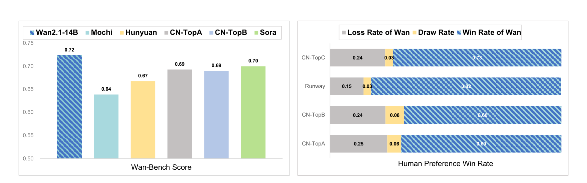
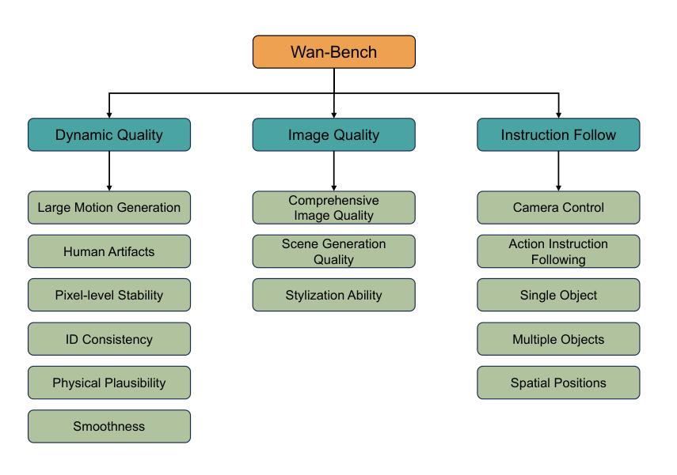
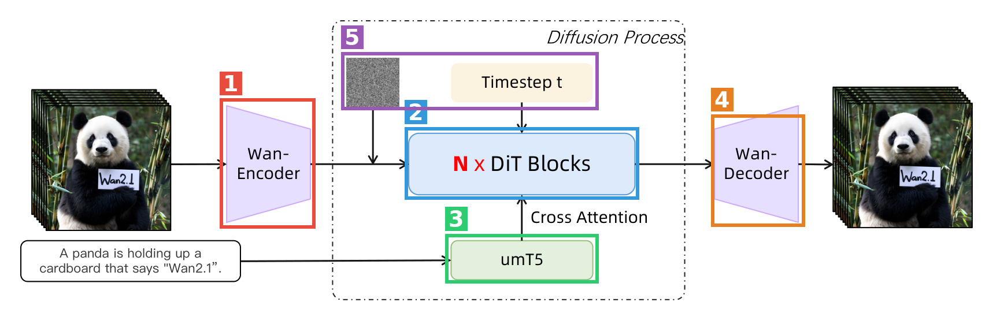
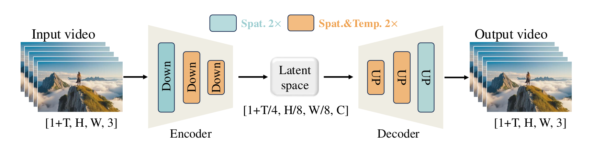
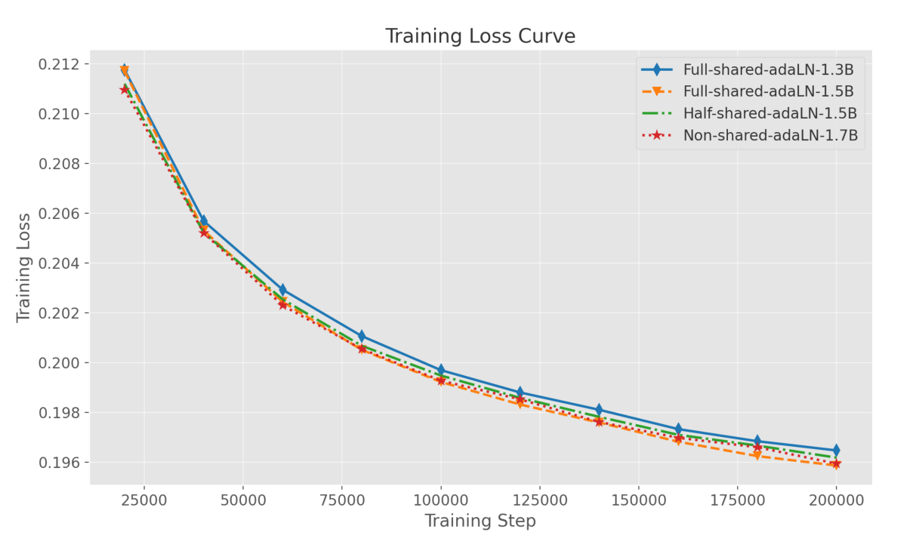
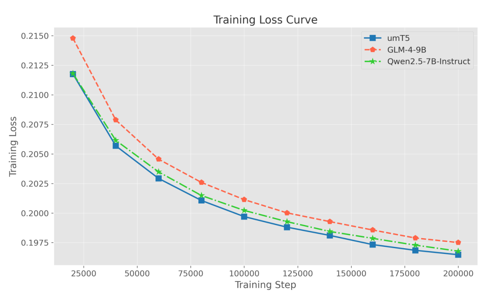

# Wan: Open and Advanced Large-Scale Video Generative Models — 精读

## 元信息

| 项 | 内容 |
|---|---|
| 题目 | Wan: Open and Advanced Large-Scale Video Generative Models |
| 作者 | Wan Team, Alibaba Group（约 60 名贡献者，按名字字母序排列，无指定一作/通讯） |
| arXiv | [2503.20314](https://arxiv.org/abs/2503.20314)（v2，2025-04-19） |
| 发布日期 | 2025-03-26（arXiv v1） |
| 代码 | [github.com/Wan-Video/Wan2.1](https://github.com/Wan-Video/Wan2.1)（论文摘要给出） |
| 一句话 | 阿里开源的视频生成基础模型全家桶（1.3B / 14B），DiT + Flow Matching 主干，自研 3D 因果 VAE，附完整数据管线、训练系统与 8 类下游任务 |

**结构速览**（60 页）：

- §1 Introduction：开源视频模型三大痛点（性能差、能力单一、算力门槛高），Wan 的定位
- §2 Related Work：闭源商业模型时间线 + 开源社区组件综述
- §3 Data Processing Pipeline：预训练/后训练数据清洗（四步过滤、运动质量六档）、视觉文字数据、稠密视频 caption 模型（LLaVA 式，自评达 Gemini 1.5 Pro 水平）
- §4 Model Design and Acceleration：Wan-VAE（3D 因果 + feature cache）、DiT 架构与共享 AdaLN、流匹配预训练、并行策略（FSDP + 2D CP）、显存优化、推理加速（diffusion cache、FP8/8-bit FlashAttention）、prompt 重写、自建 Wan-Bench、评测与消融
- §5 Extended Applications：I2V、统一视频编辑（VACE）、文生图、视频个性化、相机运动控制、实时流式生成（Streamer + LCM 蒸馏）、视频配音（V2A）
- §6 Limitation and Conclusion：大运动细节、推理成本（14B 单卡约 30 分钟）、垂域能力不足
- §7 Contributors：贡献者名单（无附录，正文即全部）

---

## 第1章 · 作者与实验室背景评估

### 作者背景

本文是**工业界团队署名**技术报告：署名 "Wan Team, Alibaba Group"，约 60 名贡献者按名字字母序排列（论文 §7），**没有一作、没有通讯作者**，因此常规的"一作画像/导师主业"框架不完全适用，以下按团队维度评估。

| 主体 | 单位 | 主方向 | 主页 |
|---|---|---|---|
| Wan Team | Alibaba Group（通义实验室 Tongyi Lab） | 视频生成基础模型 | 未找到独立团队主页；开源组织页 [ali-vilab (GitHub)](https://github.com/ali-vilab/VGen) |
| Shiwei Zhang（贡献者之一，Tongyi Lab 视频生成核心成员） | Alibaba Tongyi Lab | 视频生成、视频理解（引用 7700+） | [Google Scholar](https://scholar.google.com/citations?user=ZO3OQ-8AAAAJ) |
| Jingren Zhou（贡献者之一，阿里资深技术负责人） | Alibaba | 大规模数据与 AI 系统 | 未找到个人主页 |

### 实验室主方向判定：传统强方向

**证据（发表记录，事实部分）**——本文参考文献里大量前置工作与贡献者名单直接重合，可从论文 bibliography 逐条核对：

- ModelScope Text-to-Video（Wang et al., 2023a，arXiv:2308.06571）
- VideoComposer（Wang et al., 2023b，NeurIPS 2023）
- I2VGen-XL（Zhang et al., 2023c，arXiv:2311.04145）
- DreamVideo / DreamVideo-2 / DreamRelation（Wei et al., 2024a/2024b/2025）
- InstructVideo（Yuan et al., 2024a，CVPR 2024）
- VideoLCM（Wang et al., 2023c）
- Res-Tuning（Jiang et al., 2023，NeurIPS 2023）、SCEdit（Jiang et al., 2024）
- ACE / ACE++（Han et al., 2025；Mao et al., 2025）
- VACE（Jiang et al., 2025，arXiv:2503.07598）
- The Matrix（Feng et al., 2024，arXiv:2412.03568）

这些论文的作者（Shiwei Zhang、Yingya Zhang、Xiang Wang、Zeyinzi Jiang、Chaojie Mao、Yu Liu、Jingren Zhou 等）几乎全部出现在本文 §7 贡献者名单中。Tongyi Lab 的开源视频生成生态 [VGen](https://github.com/ali-vilab/VGen) 自 2023 年起持续维护。

**结论**：视频生成是该团队 2023 年以来的**持续主攻方向**，本文是其多年积累（T2V → I2V → 编辑 → 个性化 → 加速）的集大成式汇总，属于典型的"传统强方向"。

### 水平预判（推断部分，依据如上发表记录）

- 水毕业风险信号逐条核对：**不适用**——这是工业团队旗舰产品的技术报告，无学位诉求；团队在该方向有 2 年以上、10 篇以上的持续产出；单位（阿里）在视频生成开源社区有 VGen/ModelScope 积累。四条风险信号全部不成立。
- 预判：工程可信度高、系统完整度高的旗舰级技术报告；风险不在"作者不会做"，而在"报告式写作"常见的自证倾向（自建 benchmark、匿名基线）——这一点交给第3章盲审检验。

> ⚠️ 本章内容未进入第3章盲审 agent 的上下文。

---

## 第2章 · 论文类型判定

**结论一句话**：**实验（系统）型 + a+b 组合型**——主干是社区成熟组件（DiT + Flow Matching + T5 系文本编码器 + 3D 因果 VAE 套路）的大规模工程化组合与验证，另有若干处工程原创模块（Wan-VAE feature cache、全共享 AdaLN、Wan-Bench 评测体系）。

### 组件清单（均为论文方法节实际引用并承担流程环节的工作）

| 组件 | 原论文 | 在本文中承担的角色 |
|---|---|---|
| DiT | [Peebles & Xie, 2023](https://arxiv.org/abs/2212.09748) | 去噪主干网络架构（§4.2） |
| Flow Matching | [Lipman et al., 2022](https://arxiv.org/abs/2210.02747) | 训练目标框架（§4.2.2 式 1–3） |
| Rectified Flow / SD3 | [Esser et al., 2024](https://arxiv.org/abs/2403.03206) | 线性插值形式与 logit-normal 时间步采样（§4.2.2） |
| umT5 | [Chung et al., 2023](https://arxiv.org/abs/2304.09151) | 文本编码器（中英双语，512 token，§4.2.1） |
| MagViT-v2 | [Yu et al., 2023](https://arxiv.org/abs/2310.05737) | VAE 首帧仅空间压缩的处理方式（§4.1.1） |
| Improved Video VAE | [Wu et al., 2024](https://arxiv.org/abs/2411.06449) | Wan-VAE 所组合的多种压缩策略来源（§4.1，自家前置工作） |
| RMSNorm | [Zhang & Sennrich, 2019](https://arxiv.org/abs/1910.07467) | 替换 GroupNorm 以保时间因果性（§4.1.1） |
| FSDP | [Zhao et al., 2023](https://arxiv.org/abs/2304.11277) | 参数分片（训练+推理，§4.3.2/§4.4.1） |
| DeepSpeed Ulysses | [Jacobs et al., 2023](https://arxiv.org/abs/2309.14509) | 2D 上下文并行内层（§4.3.2） |
| Ring Attention | [Liu et al., 2023a](https://arxiv.org/abs/2310.01889) | 2D 上下文并行外层（§4.3.2） |
| USP | [Fang & Zhao, 2024](https://arxiv.org/abs/2405.07719) | 2D CP 的组合方式参照（§4.3.2，原文明说 "similar to USP"） |
| DiTFastAttn | [Yuan et al., 2024b](https://arxiv.org/abs/2406.08552) | attention 跨步相似性观察来源（§4.4.2） |
| FasterCache | [Lv et al., 2024](https://arxiv.org/abs/2410.19355) | CFG cache 残差补偿方法（§4.4.2） |
| FlashAttention-3 | [Shah et al., 2025](https://arxiv.org/abs/2407.08608) | 8-bit attention 的基础实现（§4.4.3） |
| SageAttention | [Zhang et al., 2024](https://arxiv.org/abs/2410.02367) | INT8(QK)+FP8(PV) 混合量化策略依据（§4.4.3） |
| DeepSeek-V3 | [Liu et al., 2024a](https://arxiv.org/abs/2412.19437) | FP32 跨块累加的做法来源（§4.4.3） |
| CLIP | [Radford et al., 2021](https://arxiv.org/abs/2103.00020) | I2V 条件图特征 / V2A 视频帧特征提取（§5.1.1/§5.7.1） |
| IP-Adapter | [Ye et al., 2023](https://arxiv.org/abs/2308.06721) | I2V 的 decoupled cross-attention 注入方式（§5.1.3） |
| LLaVA | [Liu et al., 2023c](https://arxiv.org/abs/2304.08485) | caption 模型架构范式（§3.3.3） |
| VACE | [Jiang et al., 2025](https://arxiv.org/abs/2503.07598) | 统一视频编辑框架（§5.2，自家前置工作） |
| The Matrix | [Feng et al., 2024](https://arxiv.org/abs/2412.03568) | 流式实时生成 Streamer 机制（§5.6，自家前置工作） |
| LCM / VideoLCM | [Luo et al., 2023](https://arxiv.org/abs/2310.04378) / [Wang et al., 2023c](https://arxiv.org/abs/2312.09109) | 4 步一致性蒸馏实现实时化（§5.6.3） |
| Instant-ID | [Wang et al., 2024b](https://arxiv.org/abs/2401.07519) | 个性化数据合成（§5.4.2） |
| VGGSfM | [Wang et al., 2024a](https://arxiv.org/abs/2312.04563) | 相机轨迹标注（§5.5） |

**原创模块**（论文未引外部来源、属自研）：Wan-VAE 的分块 feature cache 推理机制（§4.1.3）；全共享 AdaLN + 每块独立 bias（§4.2.1，省约 25% 参数）；Wan-Bench 评测体系与人类偏好加权（§4.6）；I2V 的 mask 统一多任务框架（§5.1.1）；1D 波形 VAE 用于 V2A 时间对齐（§5.7.1）。

---

## 第3章 · 双盲评审 + Rebuttal

> 净化说明：评审文本删除了作者/机构署名、贡献者名单、GitHub 仓库 URL、云厂商身份线索，自引措辞（"our previous work VACE"、The Matrix 脚注）改写为中性引用。

### 3.1 初审意见（由隔离上下文的盲审 agent 独立生成）

**Summary**：本文提出并开源了 Wan——一套基于 Diffusion Transformer + Flow Matching 的视频基础模型（1.3B 与 14B 两个规模），报告覆盖完整技术栈：数据清洗与稠密字幕流水线（Sec. 3）、3D 因果 Wan-VAE（Sec. 4.1）、训练与并行/显存优化（Sec. 4.2–4.3）、推理加速（diffusion cache、FP8/INT8 量化，Sec. 4.4）、自建评测基准 Wan-Bench（Sec. 4.6），以及八类下游应用（I2V、统一编辑、个性化、相机控制、流式实时生成、音频生成等，Sec. 5）。作者声称 14B 模型在自建 Wan-Bench、人工偏好对比和公开的 VBench 榜单上全面超越现有开源与商业模型，1.3B 模型仅需 8.19 GB 显存即可在消费级 GPU 上运行且优于更大的开源模型，并称模型与代码全部公开。

**Strengths**：

- **开放性与系统完整度**。论文承诺公开 1.3B 与 14B 全系列权重与代码（Abstract、Sec. 6），并较完整地披露了数据流水线（Sec. 3.1–3.3）、VAE 训练三阶段与损失权重（Sec. 4.1.2）、并行策略与显存分析（Sec. 4.3）。相对于同类闭源系统报告，这种透明度对社区有实际价值。
- **外部基准上的可核验结果**。VBench 上 14B 取得 86.22% 总分、1.3B 取得 83.96%（Table 4），这是论文中少数不依赖自建评测体系的证据，且 1.3B 超过体量更大的 HunyuanVideo 开源版（83.24%）这一点对"消费级效率"的 claim 构成了实质支撑。
- **VAE 部分的评测相对规范**。Sec. 4.1.4 对比了 7 个基线，明确报告了各方法的压缩率与 latent 维度差异，测试协议（200 段视频、25 帧、720×720）明确，feature cache 机制（Fig. 6）的设计动机与实现描述清楚。
- **有真实信息量的消融**。Sec. 4.7.2 中 AdaLN 共享与深度权衡的四组对照、文本编码器三选一加 token refiner 对照实验，设计上是可信的控制变量比较，结论（同参数量下加深优于加宽 AdaLN）对后续模型设计有参考价值。
- **工程细节可复用**。2D Context Parallelism 的通信开销分析（Sec. 4.3.2，256K 序列 16 GPU 下从 >10% 降到 <1%）、8-bit FlashAttention 的混合量化与 FP32 跨块累加（Sec. 4.4.3）等描述具体到可以被他人实现。

**Weaknesses**：

- **W1（自建基准的循环性，影响核心 SOTA 结论）**。论文最强的 claim——"consistently outperforms the existing open-source models as well as state-of-the-art commercial solutions"（Abstract）——主要证据是 Wan-Bench（Table 2）。但 Sec. 4.6 明确写道，各维度的权重来自"over 5,000 pairwise comparisons of videos generated by different models **including Wan**"的人工偏好与各维度得分的 Pearson 相关。这意味着最终加权方式是在包含被评模型自身的样本池上拟合的，存在使 Wan 占优的循环风险。这个风险不是理论上的：Table 2 中 Wan 14B 在 14 个维度里多数并非第一（Large Motion Generation 0.415 低于 Sora 0.482；Human Artifacts 0.691 为倒数第二；Stylization 0.328 全场最低；Comprehensive Image Quality 低于 CN-TopA 和 Sora），但加权总分却排名第一（0.724），而具体权重数值全文未披露。此外多个商业基线以 CN-TopA/B/C/D 匿名出现，第三方完全无法复核。
- **W2（全文无任何统计检验与不确定度报告）**。Table 2、3、4、7、8 及 Fig. 1 报告的全部是点估计：没有任何假设检验、P 值、置信区间或 error bar。人工评测的胜率差异有些相当小，在无检验的情况下无法区分于噪声。标注者指令、是否盲评、标注者间一致性均未报告。
- **W3（"scaling laws" 这一摘要级 claim 没有对应实验）**。全文没有任何一张图或一个表展示随数据量或模型规模变化的性能曲线——只有 1.3B 和 14B 两个配置不对齐的点（1.3B 仅 480p）。两个不对齐的点无法构成 scaling law 的证据。
- **W4（大量子系统 claims 只有定性或零证据支撑）**。(a) 音频生成声称 "superior performance"，证据仅是 5 个挑选示例的波形图；(b) 统一视频编辑声称定量定性双优，但本文没有任何定量表格；(c) 相机运动控制只有示例图；(d) 实时流式生成的质量损失无定量评测；(e) diffusion cache 声称 "lossless" 但无质量对比数字；(f) VAE "2.5× faster" 未说明具体硬件。
- **W5（正文与表格的内部矛盾）**。Table 7 中 Matching 对 CN-TopA 为 **-4.2%**：若如表注所述是"被偏好比例"，负值在定义上不可能；若实为胜负差，则与正文 "performs favorably across all dimensions" 直接矛盾。另 Table 5 表头 "10k/15k steps" 与正文 "100,000 and 150,000 steps" 相差一个数量级。
- **W6（数据与评测的可复现性缺口）**。训练数据规模全部以 O() 记号给出，来源含未披露的内部版权数据；Wan-Bench 的 prompts、评分代码、人工偏好原始数据是否公开未说明；商业基线大多无版本/日期信息；Sec. 4.5 的 LLM prompt 重写是否同等施加于基线未说明。
- **W7（方法学新颖性有限，且"首个中英文视觉文字生成"优先权 claim 无定量支撑）**。按论文自己的引用链，各核心组件均为已有技术的组合；"the first model that can generate visual text in both Chinese and English" 无 OCR 准确率等定量评测，仅有示例。

**Questions**（8 条，见原文）：权重数值与剔除 Wan 后的敏感性；scaling law 依据；-4.2% 定义；Wan-Bench 是否用于开发期调参；基线版本与 prompt 重写公平性；音频定量指标；视觉文字定量评测；评测资产公开承诺。

**Minor issues**：LAION-5B 美学分类器引用指向 LAION-400M；"T2V pertaining"、"mage transition" 拼写错误；合成图污染 <10% 的"经验证据"未展示；"head-end GPU" 措辞不明；相机控制训练数据 "O(1) thousand" 量级存疑等 7 条。

**初审评级：major revision**——贡献量级够水位（全开放 + 外部榜单领先），但核心 SOTA 结论依赖权重未披露且存在循环拟合风险的自建基准（W1），全文无统计检验（W2），scaling law claim 无实验（W3），近半数子系统只有定性示例（W4），且存在表格与正文的直接矛盾（W5）。

### 3.2 Rebuttal（作者方，一轮）

对 W1–W7 逐条回应，全部论据来自论文内部（全文见对话记录，要点如下）：

- **W1 部分承认+辩护**：承认权重未披露、拟合样本池含 Wan 自身、基线匿名三点；但指出 SOTA 结论另有两条独立证据链——外部第三方榜单 VBench（Table 4，14B 86.22% > Sora 84.28%，维度与权重由外部工作定义）与人工偏好评测（Table 3，5,560–5,785 轮，Overall Ranking 胜负差 +44.0%~+67.6%），二者均不经过 Wan-Bench 权重。
- **W2 承认**：全文确无检验与不确定度；仅补充 n 已在 Table 3/7 给出，大差值事后可检验，但小差值的批评完全成立。
- **W3 承认**：无任何 scaling 曲线，摘要表述超出证据，应删除或弱化。**这是摘要层面的实质硬伤。**
- **W4 大部分承认**：音频/编辑/相机/实时四项无定量证据均成立。两点有限辩护：diffusion cache 的 "lossless" 有机制性保障（验证集选步 + 残差补偿）但确无数字；VAE 加速的测试协议主体（200 视频、25 帧、720×720、同硬件）已给出，缺 GPU 型号。
- **W5 一处澄清+两处承认**：用 Fig. 1 交叉验证澄清 -4.2% 的定义——Fig. 1 的胜率−负率（0.69−0.25=0.44、0.68−0.24=0.44、0.73−0.24=0.49、0.82−0.15=0.67）与 Table 3 的 44.0%/44.0%/48.9%/67.6% 四组全部吻合，证明 "win rate gap" = 胜率−负率，-4.2% 定义自洽（该维度确实输给 CN-TopA）；但表注定义写错、正文 "favorably across all dimensions" 过度声称、Table 5 表头笔误三点承认。
- **W6 大部分承认**：评测资产未承诺公开、基线无版本日期、prompt 重写公平性未说明均成立（后者是初审最有价值的观察之一）；辩护一点：模型与推理代码的开放承诺是明确的，不应被评测资产问题抵消。
- **W7 部分承认+辩护**：组合式架构与 "first" claim 无定量支撑承认；但请求将可迁移贡献从"两条消融"扩展为：Wan-VAE 因果 feature cache、共享 AdaLN+独立 bias、2D CP 通信分析、8-bit FA 的 FP32 跨块累加等工程原创。

**承认的批评清单（= 本文真正硬伤一览）**：

1. 全文无任何统计检验、置信区间、error bar（W2 全部）
2. 摘要声称 "scaling laws" 但无对应实验（W3 全部）
3. Wan-Bench 权重未披露、拟合样本含 Wan 自身（循环风险）、商业基线匿名不可复核（W1）
4. 音频、统一编辑、相机控制、实时生成四个子系统的"优越性"结论只有定性示例（W4）
5. Table 3/7 表注定义写错；正文 "favorably across all dimensions" 与 Matching -4.2% 矛盾；Table 5 表头 10k/15k 为 100k/150k 之笔误（W5）
6. Wan-Bench prompts/评分代码/人工评测原始数据未承诺公开；基线无版本与采样日期；LLM prompt 重写是否同等施加于基线未说明（W6）
7. "首个中英文视觉文字生成"无 OCR 准确率等定量证据（W7）

### 3.3 审稿人二轮回复 + 最终评级

**逐条回应**：

- **W1：部分撤回，核心维持。** 审稿人承认初审"核心 SOTA 结论主要依赖 Wan-Bench"表述过重——VBench（外部定义的 16 维度）与人工偏好评测（n=5,560–5,785，+44%~+67.6% 的差值在该 n 下事后检验几乎必然显著）构成两条不经过 Wan-Bench 权重的独立证据链，撤回"SOTA 结论全部证据基础被循环性污染"这一层含义。但维持对 Table 2 本身的批评（权重未披露、样本池含 Wan、匿名基线），且提示两条"独立"证据链各有自身缺口（VBench 提交条件对齐性未说明、人工评测无协议披露）——它们支撑的是"Wan 处于第一梯队且大概率领先"，而非摘要中无保留的 "consistently outperforms"。
- **W2：维持**（作者已承认）。补充：大差值"事后必然显著"恰说明补检验成本极低，没有理由缺席。
- **W3：维持**（作者已承认）。scaling law claim 必须删除或弱化，无争议。
- **W4：(a)–(d) 维持；(e)(f) 部分撤回。** diffusion cache 从"裸断言"降级为"披露不足"（确有机制性描述）；VAE 2.5× 从"设计缺陷"降级为"披露缺口"（协议主体已给，仅缺 GPU 型号）。
- **W5：-4.2% 数据错误之疑撤回**（审稿人复核了作者的 Fig. 1 交叉验证，四组胜负差完全吻合，确认定义自洽）；但表注定义错误与正文过度声称两点因此坐实，维持。
- **W6：大部分维持；开放性辩护接受**（模型/代码开放与评测资产未公开是两事）。prompt 重写公平性记为双方确认的重要缺陷。
- **W7：部分撤回，总体判断维持。** 撤回"可迁移贡献仅两条"的过窄概括（feature cache、共享 AdaLN、2D CP 分析、8-bit FA 均可在原文定位且可复现）；但"科学新颖性属组件组合与规模验证"及 "first" claim 无支撑维持。

**双方确认的缺陷清单**（7 条，与 3.2 承认清单一致）：零统计报告；scaling laws 无实验；Wan-Bench 权重/循环/匿名三连；四个子系统零定量证据；表注定义错误+正文矛盾+表头笔误；评测资产未公开+基线无版本+prompt 重写公平性；"first" claim 无定量支撑。

**最终评级：major revision（维持初审评级）。**

审稿人说明：rebuttal 在两处实质改变了判断——-4.2% 确认为定义自洽而非数据错误，消除了对数据完整性的最坏怀疑；VBench 与人工评测使"处于第一梯队"这一弱化版结论可信。但双方确认的缺陷修复需要**新实验**（音频/编辑定量评测、权重敏感性分析、cache 质量对比）与全面统计补报，超出表述修改范畴，不满足 minor revision 条件。补充完成且措辞与证据对齐后，本文凭其开放性与系统完整度有明确的录用路径。

---

## 第4章 · 大白话：这篇文章在做什么

**场景**：文生视频——给一句话（"一只熊猫举着写有 Wan2.1 的纸板"），模型生成一段几秒钟的高清视频。这是 Sora 带火的赛道。

**之前的方法**：商业模型（Sora、Kling、Runway）效果好但闭源收费；开源模型（Mochi、HunyuanVideo、CogVideoX）追得辛苦——效果差一截、基本只会文生视频这一件事、而且模型大到普通显卡跑不动。

**本论文的方法**：阿里直接把整套家底开源：一大一小两个模型（14B 冲效果、1.3B 只要 8.19 GB 显存能在游戏显卡上跑）、外加图生视频/视频编辑/个性化/配音等八种玩法，并把数据怎么洗、模型怎么训、怎么加速全写进 60 页报告——声称效果同时超过现有开源和商业模型。

**图内文字翻译**（Figure 1，两张对比图）：左图是各模型在自建基准 **Wan-Bench 上的总分**：Wan2.1-14B 得 0.72，高于 Mochi 0.64、Hunyuan（混元）0.67、CN-TopA（匿名的国内头部商业模型 A）0.69、CN-TopB 0.69、Sora 0.70。右图是**人工偏好胜率**：人类标注员把 Wan 生成的视频与四家商业模型两两对比，条形从左到右分别为 Wan 的负率（灰）、平率（黄）、胜率（蓝条纹）——对 CN-TopC 胜 73% / 负 24%，对 Runway 胜 82% / 负 15%，对 CN-TopB 胜 68% / 负 24%，对 CN-TopA 胜 69% / 负 25%。注：HunyuanVideo 用的是其开源版本测试。

（自查：不做这个方向的人应能看懂——"开源了一套能打过商业产品的视频生成模型，小杯版还能在家用显卡上跑"。）

补充一张官方样例拼图（Figure 2）直观感受生成质量——注意漫画格里清晰的 "WAN" 英文字和右下角春联上的合体汉字，中英文视觉文字生成是本文主打卖点：

---

## 第5章 · 实验

> 说明：本文是视频生成论文，无机器人仿真/真机之分。按本仓库框架自适应为：5.1 = 自动化基准评测，5.2 = 人工评测与下游任务评测。

### 5.1 自动化基准评测

#### 5.1.1 Wan-Bench（自建基准）

**场景一句话**：给 1,035 条 prompt 让各家模型生成视频，用 14 个自动化指标（光流测运动量、YOLOv3 检测 AI 伪影、Qwen2-VL 问答判物理合理性等）打分，再按人类偏好拟合的权重加总。

**条件**：每模型 1,035 个样本；基线含商业（Sora、CN-TopA/B、Hunyuan）与开源（Mochi）；三大维度（动态质量/图像质量/指令遵循）14 个细分指标；总分权重来自 5,000+ 人工两两对比与各维度分的 Pearson 相关（§4.6）。

**主对比表汉化**（Table 2，加权总分与代表性维度；**加粗为该行最优**）：

| Wan-Bench 维度 | CNTopB | Hunyuan | Mochi | CNTopA | Sora | Wan 1.3B | Wan 14B |
|---|---|---|---|---|---|---|---|
| 大幅度运动生成 | 0.405 | 0.413 | 0.420 | 0.284 | **0.482** | 0.468 | 0.415 |
| 人体伪影（越高越好） | 0.712 | 0.734 | 0.622 | **0.833** | 0.786 | 0.707 | 0.691 |
| 像素级稳定性 | 0.977 | **0.983** | 0.981 | 0.974 | 0.952 | 0.976 | 0.972 |
| ID 一致性 | 0.940 | 0.935 | 0.930 | 0.936 | 0.925 | 0.938 | **0.946** |
| 物理合理性 | 0.836 | 0.898 | 0.728 | 0.759 | 0.933 | 0.912 | **0.939** |
| 流畅度 | 0.765 | 0.890 | 0.530 | 0.880 | **0.930** | 0.790 | 0.910 |
| 综合图像质量 | 0.621 | 0.605 | 0.530 | **0.668** | 0.665 | 0.596 | 0.640 |
| 场景生成质量 | 0.369 | 0.373 | 0.368 | 0.386 | **0.388** | 0.385 | 0.386 |
| 风格化能力 | **0.623** | 0.386 | 0.403 | 0.346 | 0.606 | 0.430 | 0.328 |
| 单物体准确率 | **0.987** | 0.912 | 0.949 | 0.942 | 0.932 | 0.930 | 0.952 |
| 多物体准确率 | 0.840 | 0.850 | 0.693 | 0.880 | **0.882** | 0.859 | 0.860 |
| 空间位置准确率 | 0.518 | 0.464 | 0.512 | 0.434 | 0.458 | 0.476 | **0.590** |
| 相机控制 | 0.465 | 0.406 | **0.605** | 0.529 | 0.380 | 0.483 | 0.527 |
| 动作指令遵循 | **0.917** | 0.735 | 0.907 | 0.783 | 0.721 | 0.844 | 0.860 |
| **加权总分** | 0.690 | 0.673 | 0.639 | 0.693 | 0.700 | 0.689 | **0.724** |

注意：Wan 14B 在 14 个维度中仅 4 个第一（ID 一致性、物理合理性、空间位置、及总分），风格化能力全场最低（0.328），但加权总分第一——权重的作用不可忽视（呼应第3章 W1）。

#### 5.1.2 VBench（外部公开榜单）

**场景一句话**：第三方基准 VBench 用 16 个维度评视频生成质量与语义一致性，是社区通用榜单。

**主对比表汉化**（Table 4，**加粗最优**）：

| 模型 | 质量分 | 语义分 | 总分 |
|---|---|---|---|
| MiniMax-Video-01（海螺） | 84.85% | 77.65% | 83.41% |
| Hunyuan（开源版） | 85.09% | 75.82% | 83.24% |
| Gen-3 (2024-07) | 84.11% | 75.17% | 82.32% |
| CogVideoX1.5-5B | 82.78% | 79.76% | 82.17% |
| Kling (2024-07 高性能模式) | 83.39% | 75.68% | 81.85% |
| Sora | 85.51% | 79.35% | 84.28% |
| Wan 1.3B | 84.92% | 80.10% | 83.96% |
| Wan 14B (2025-02-24) | **86.67%** | **84.44%** | **86.22%** |

亮点：1.3B 小模型（83.96%）超过 HunyuanVideo 开源版（83.24%）和 Kling 1.0，支撑"消费级效率"主张。

#### 5.1.3 Wan-VAE 重建评测

**场景一句话**：把 200 段 720×720、25 帧的视频压缩再解压，看还原质量（PSNR）和速度（帧/秒延迟）。

**结论**（Fig. 7，§4.1.4）：Wan-VAE 以 127M 参数（最小之一）达到 PSNR 与效率的双优前沿；同硬件下重建速度是 HunyuanVideo VAE 的 2.5 倍。论文未以表格给出具体 PSNR 数值，仅有散点图。

### 5.2 人工评测与下游任务

**项目主页**：论文内仅给出 [GitHub 仓库](https://github.com/Wan-Video/Wan2.1)（摘要），未给独立项目主页 URL。

#### 5.2.1 T2V 人工评测（Table 3）

700+ 评测任务、20+ 标注者、5,560–5,785 轮两两对比。表中数值 = **Wan 14B 的胜率减负率**（gap，经 Fig. 1 交叉验证；表注原文表述有误，见第3章 W5）：

| 维度 | vs CN-TopA | vs CN-TopB | vs CN-TopC | vs Runway |
|---|---|---|---|---|
| 视觉质量 | +30.6% | +15.9% | +27.8% | +48.1% |
| 运动质量 | +16.1% | +9.7% | +14.9% | +40.3% |
| 文本匹配 | +46.0% | +57.9% | +56.7% | +69.1% |
| **综合排名** | +44.0% | +44.0% | +48.9% | +67.6% |

#### 5.2.2 I2V 人工评测（Table 7）

约 890–896 轮对比，数值同为胜负差：

| 维度 | vs CN-TopA | vs CN-TopB | vs CN-TopC | vs CN-TopD |
|---|---|---|---|---|
| 视觉质量 | +29.2% | +60.8% | +24.6% | +55.6% |
| 运动质量 | +21.7% | +21.7% | +32.5% | +67.0% |
| 文本匹配 | **-4.2%** | +35.0% | +51.7% | +72.2% |
| 综合排名 | +10.8% | +47.5% | +50.8% | +81.6% |

注意 -4.2%：I2V 的文本匹配维度 Wan 输给了 CN-TopA（正文却写 "performs favorably across all dimensions"，见第3章 W5）。

#### 5.2.3 视频个性化（Table 8）

在未见过的评测集上测生成视频与输入人脸的 ArcFace 相似度：Wan 0.5526，CN-TopA **0.5655**，CN-TopB 0.5197，CN-TopC 0.4998——Wan 第二，低于 CN-TopA（论文表述为 "competitive"）。

#### 5.2.4 其余任务

统一编辑（VACE）、相机控制、实时流式生成（8 A100 实时 8 FPS 生成 15 分钟视频；单张 4090 + int8/TensorRT 达 20 FPS）、V2A 配音——**均只有示例图/定性对比，无定量表格**（呼应第3章 W4）。

### 5.3 为什么选这些实验

对照数字看作者的选择逻辑：

- **共同特性**：选的三条主证据链（Wan-Bench、人工偏好、VBench）都是**整体感知质量导向**的评测，最能体现大数据+大模型带来的综合质感优势；而 Wan 的强项维度——物理合理性 0.939（Table 2 第一）、空间位置 0.590（第一，超第二名 0.072）、VBench 语义分 84.44%（超 Sora 5 个点）——恰好吃"数据管线洗得干净 + 稠密 caption 训练"这两个设计（§3 花了 5 页讲数据，§3.3 的 caption 模型专门补了空间关系/计数/OCR 数据）。
- **扬长**：中英文视觉文字生成（§3.1 专门的合成+真实双管线数据）作为"首个"卖点大量展示（Fig. 2、Fig. 15），但只给示例不给 OCR 准确率——因为没有现成 benchmark，也规避了定量检验。
- **避短**：Table 2 里 Wan 14B 的风格化（0.328 全场最低）、人体伪影（0.691 倒数第二）、大运动（0.415 低于自家 1.3B 的 0.468）都如实印在表里但正文不展开；加权总分把这些短板"平均"掉了。
- **该测但没测**：(1) 传统指标 FVD/FID 完全未报告（论文以"与人类感知不对齐"为由绕开，§4.6，这有一定道理但也切断了与历史工作的可比性）；(2) 音频生成没有 FAD 等标准指标，只有 5 个挑选样例；(3) 与 Movie Gen（Meta，同为系统级报告且有公开评测集 Movie Gen Bench）无任何定量对比——相关工作里提了 Movie Gen 却不比，缺席本身是信号。

### 5.4 复现可能性（硬核查）

逐项核查（证据来源：论文 + GitHub 仓库 [Wan-Video/Wan2.1](https://github.com/Wan-Video/Wan2.1) 实际打开核验，2026-08-15）：

**代码**：
- 仓库存在，**实质推理代码**：`wan/` 包、`generate.py`、`gradio/`、`tests/`、`INSTALL.md`（仓库文件列表核验）✅
- **训练代码：未提供**（README 只有推理/生成用法）❌
- star 约 16.8k，社区活跃

**ckpt 逐场景**（README 模型表核验，HuggingFace + ModelScope 双渠道，组织 Wan-AI）：

| 场景 | 权重 |
|---|---|
| T2V-1.3B / T2V-14B | ✅ 开源 |
| I2V-14B-480P / I2V-14B-720P | ✅ 开源 |
| FLF2V-14B（首尾帧） | ✅ 开源 |
| VACE-1.3B / VACE-14B（编辑） | ✅ 开源 |
| 视频个性化（§5.4） | ❌ README 未列出 |
| 相机控制（§5.5） | ❌ README 未列出 |
| 实时流式 Streamer + LCM（§5.6） | ❌ README 未列出 |
| V2A 音频生成（§5.7） | ❌ README 未列出 |
| caption 模型（§3.3） | ❌ 未开源 |

**数据**：
- 原始数据：❌ 不开放——含"internal copyrighted sources"（§3.1），规模只给 O() 记号（"billions of videos and images"、"O(1) trillions of tokens"）
- 数据处理脚本：❌ 仓库无（README 仅有流程概念描述）
- Wan-Bench prompts / 评分代码：❌ 论文与仓库均未承诺公开

**训练细节**（正文/无附录）：
- 找到：优化器 AdamW、weight decay 1e-3、初始学习率 1e-4（按 FID/CLIP Score 平台期衰减）、bf16 混合精度（§4.2.2）；VAE 三阶段训练与 loss 权重 L1:KL:LPIPS = 3:3e-6:3（§4.1.2）；分辨率课程 256px 图像 → 192px/480px/720px 视频三阶段（§4.2.2）；消融实验 global batch size 1536（§4.7.2）；并行配置示例（§4.3.2）
- 未找到（缺失项）：主训练全局 batch size；各阶段训练步数/数据量配比；GPU 数量与总训练时长；学习率 schedule 具体形状；数据在各阶段的切分格式；14B 与 1.3B 除层数外的完整超参表

**结论：`需自行补齐细节`（推理侧）/ `难以复现`（训练侧）**
- 推理复现：权重+代码齐全，主要任务可直接跑 ✅
- 训练复现缺失项：① 训练代码未开源；② 训练数据及处理脚本不可得（含版权数据，原理上不可复现）；③ 主训练 batch size 未给出；④ 各阶段步数与数据配比未给出；⑤ 硬件规模与训练时长未给出；⑥ 四个下游任务（个性化/相机/实时/音频）权重未开源，且其数据全部依赖内部管线

---

## 第6章 · 方法拆解

主流程 = 经典 Latent Diffusion 三件套的视频版：**VAE 压缩 → 潜空间里 DiT 做流匹配去噪 → VAE 解压**。

图中彩色框：🟥 1 = Wan-VAE 编码器；🟦 2 = N×DiT Blocks（去噪主干）；🟩 3 = umT5 文本编码器；🟧 4 = Wan-VAE 解码器；🟪 5 = 扩散过程的噪声与时间步输入。

### 🟥 Wan-VAE 编码器（自研，组合 [Wu et al., 2024](https://arxiv.org/abs/2411.06449) 的策略 + [MagViT-v2](https://arxiv.org/abs/2310.05737) 的首帧处理）

- **接口**：进 `(1+T)×H×W×3` 的视频像素；出 `(1+T/4)×H/8×W/8×16` 的潜特征——时间压 4 倍、空间压 8×8 倍，首帧特殊：只压空间不压时间（这样单张图也能当"1 帧视频"处理，图像视频联合训练成为可能）。
- **训练时**：三阶段——先训 2D 图像 VAE，再"膨胀"成 3D 因果 VAE 在 128×128、5 帧的小视频上训（继承空间压缩先验，比从零训快得多），最后高质量视频微调并加 3D 判别器的 GAN loss。损失 = L1 重建 : KL : LPIPS 感知 = 3 : 3e-6 : 3。
- **部署时**：关键创新 **feature cache**（Fig. 6）：视频切成 1+T/4 个 chunk 逐块编解码，每块最多 4 帧，跨块维护因果卷积的 2 帧历史缓存——显存不随视频长度增长，任意长视频都能编解码。为保因果性把 GroupNorm 全换成 RMSNorm。整个模型仅 127M 参数。

### 🟩 umT5 文本编码器（[Chung et al., 2023](https://arxiv.org/abs/2304.09151)，冻结）

- **接口**：进用户 prompt（实际部署时先经 Qwen2.5-Plus 重写扩充成训练 caption 风格）；出 512 个 token 的文本嵌入序列。
- **选型理由**（§4.2.1 消融）：双语能力强（中英+视觉文字）、双向注意力比 decoder-only LLM 更适合扩散模型、同参数量收敛更快。

### 🟪 噪声与时间步（Flow Matching 框架，[Lipman et al., 2022](https://arxiv.org/abs/2210.02747) / [Esser et al., 2024](https://arxiv.org/abs/2403.03206)）

- **接口**：训练时进干净潜特征 x₁ + 高斯噪声 x₀ + logit-normal 采样的 t，出线性插值 xₜ = t·x₁ + (1−t)·x₀ 与真值速度 v = x₁ − x₀；推理时从纯噪声出发。
- **训练目标**：模型预测速度场，MSE loss（式 3）。大白话：不学"怎么去噪"，学"从噪声直线飞向数据的方向盘"。

### 🟦 N×DiT Blocks（[Peebles & Xie, 2023](https://arxiv.org/abs/2212.09748) 变体 + 自研共享 AdaLN）

- **接口**：进 patchify（1×2×2 的 3D 卷积展平）后的视频 token 序列（长度 = (1+T/4)·H/16·W/16，720p 5 秒可达数十万 token）+ 文本嵌入 + 时间步；出预测的速度场 token 序列。
- **块内结构**（Fig. 10）：时空全注意力（self-attention，不拆分空间/时间）→ cross-attention 吃文本 → FFN。时间步经共享 MLP 产出 6 个调制参数，**所有块共享同一个 MLP、每块只学自己的 bias**——省约 25% 参数，同参数量下不掉点（第7章消融）。
- **训练时**：数据按 §3 管线清洗的图像+视频混合，课程式升分辨率（256px 图 → 192/480/720px 视频）；14B 先做 256px 纯图像预训练再进图像视频联合训练。
- **部署时**：50 步采样；FSDP+2D 上下文并行多卡加速近线性；diffusion cache（隔步复用 attention 与 CFG 结果）提速 1.62×；FP8 GEMM + 8-bit FlashAttention 再提速 1.27×。

### 🟧 Wan-VAE 解码器（与 🟥 对称）

- **接口**：进去噪完成的潜特征 `(1+T/4)×H/8×W/8×16`；出 `(1+T)×H×W×3` 视频像素。同样用 feature cache 逐块解码，空间上采样层输入通道减半省 33% 显存。

**流程串联自查**：视频/噪声 →🟥编码→ 潜 token →（🟪加噪 + 🟩文本经 cross-attn 注入）→🟦预测速度、50 步迭代去噪→ 干净潜特征 →🟧解码→ 输出视频。首尾相接 ✅。下游任务全部在此骨架上做加法：I2V 在通道维拼条件帧潜特征+mask；编辑（VACE）拼概念解耦的上下文 token；个性化在时间维前置 K 张人脸帧；实时化把固定长度去噪改成滑窗 token 队列 + LCM 4 步蒸馏。

---

## 第7章 · 消融

消融均在 1.3B 规模、文生图任务（T2V 训练第一阶段）上做（§4.7.2）。

### 7.1 AdaLN：省下的参数该花在哪

四个配置从零训 20 万步（global batch size 1536），比训练 loss：

| 配置（行名重述） | 参数量 | 结果 |
|---|---|---|
| 全共享 AdaLN，30 层（本文默认） | 1.3B | loss 略高于其余三者 |
| 前 15 层共享、后 15 层不共享 | 1.5B | 中间 |
| **全共享 AdaLN，但加深到 35 层** | 1.5B | **loss 最低** |
| 完全不共享 AdaLN，30 层 | 1.7B | 参数最多却不如上一行 |

**Takeaway**：同样加 0.2B 参数，花在"加深网络"上比花在"每层独立 AdaLN"上收益大；1.7B 不共享还打不过 1.5B 共享加深——AdaLN 参数是低效参数，共享掉换深度是纯赚。

### 7.2 文本编码器选型

| 配置（行名重述） | 结果 |
|---|---|
| umT5（5.3B，双向注意力） | **训练 loss 最低** |
| 换成 GLM-4-9B（decoder-only，取倒数第二层特征） | loss 最高 |
| 换成 Qwen2.5-7B-Instruct（decoder-only，倒数第二层） | 居中 |
| 上两者加双向 token refiner 适配层（照搬 HunyuanVideo 方案） | 仍不如 umT5 |
| 换成多模态 Qwen-VL-7B（倒数第二层特征） | FID 42.91 vs umT5 43.01——打平，但模型更大（Table 6） |

**Takeaway**：给扩散模型当文本编码器，双向注意力的 umT5 以更小体量打平/胜过 7B–9B 的 decoder-only LLM；"LLM 更强所以嵌入更好"在这里不成立。

### 7.3 VAE 重建损失 vs 扩散损失

| 配置（行名重述） | FID@100k 步 | FID@150k 步 |
|---|---|---|
| 标准 VAE（L1 重建损失，本文方案） | **42.60** | **40.55** |
| VAE-D（重建损失换成扩散损失） | 44.21 | 41.16 |

**Takeaway**：VAE 用普通重建损失就好，换成扩散式解码器反而 FID 变差约 0.6–1.6；差距随训练变小但未反超。（注：表头 "10k/15k" 为论文笔误，正文明确是 100k/150k 步，见第3章 W5。）

**消融覆盖度评价**：三组消融都做在"组件选型"层面且实验设计规范（控制参数量、控制训练配置），是报告里科学价值最高的部分之一；但对方法链条上的其他关键设计——数据清洗各环节的贡献、prompt 重写的增益、diffusion cache 的质量代价、共享 AdaLN 在 14B 上是否同样成立——**均无消融**，这与第3章评审 W4"子系统 claim 缺定量支撑"是同一问题的两面。
