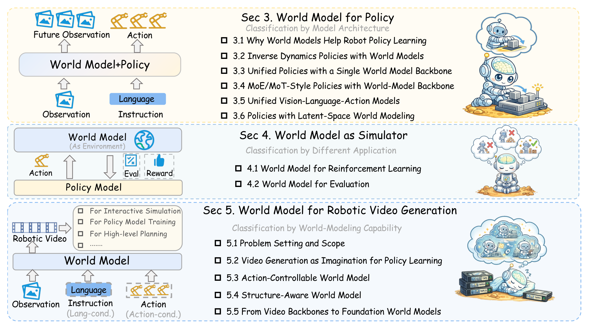
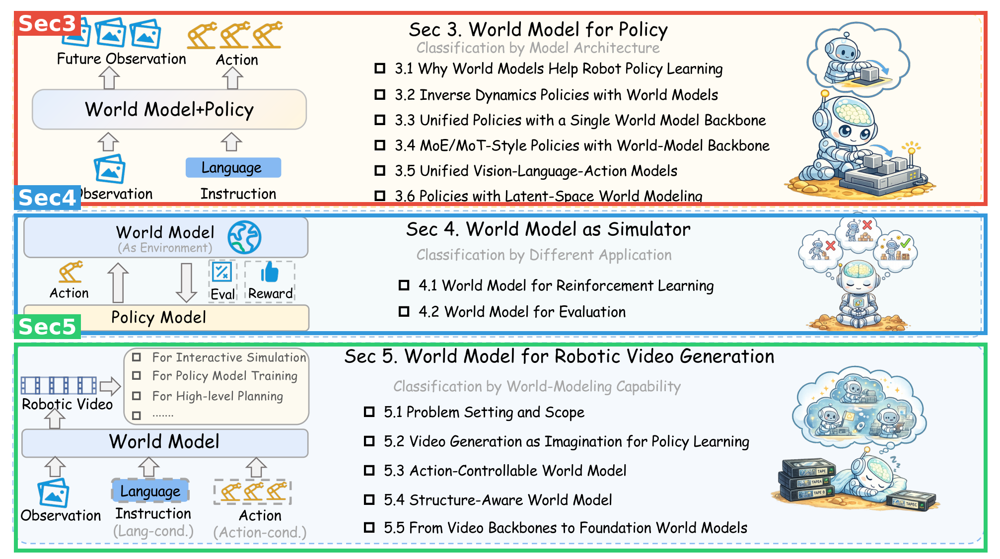
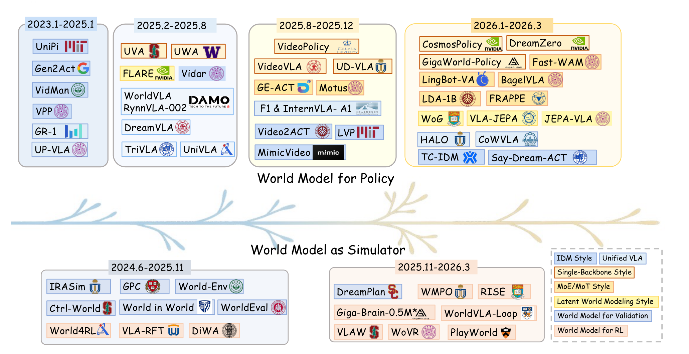
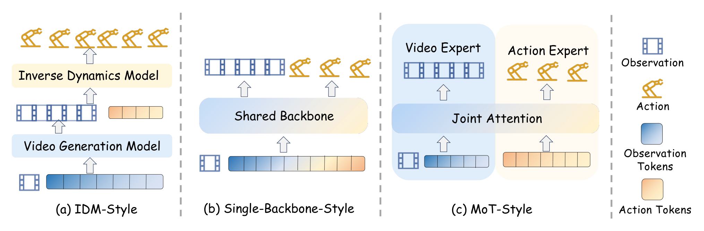
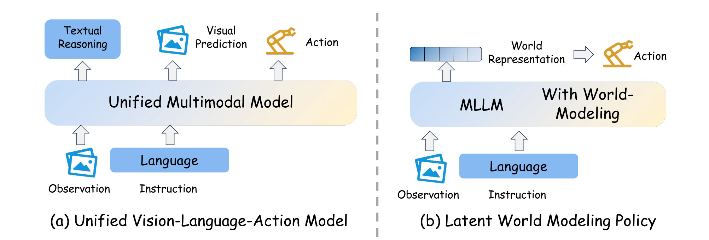
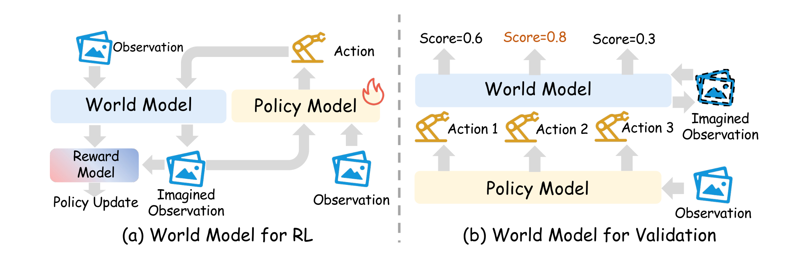
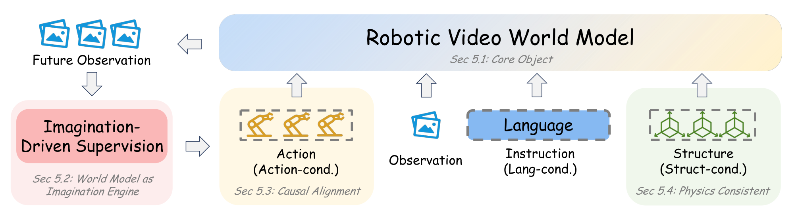

# World Model for Robot Learning: A Comprehensive Survey

> **arXiv**: [2605.00080](https://arxiv.org/abs/2605.00080) ｜ **日期**: 2026-05（v1）
> **作者**: Bohan Hou\*, Gen Li\*, Jindou Jia\*, Tuo An\*, Xinying Guo\*（共同一作，按字母序，均为 NTU）, Sicong Leng (NTU), Haoran Geng (UC Berkeley), Yanjie Ze (Stanford), Tatsuya Harada (UTokyo), Philip Torr (Oxford), Oier Mees (Microsoft), Marc Pollefeys (ETH Zurich), Zhuang Liu (Princeton), Jiajun Wu (Stanford), Pieter Abbeel (UC Berkeley), Jitendra Malik (UC Berkeley), Yilun Du (Harvard), **Jianfei Yang (NTU, 通讯)**
> **代码/资源**: [GitHub 文献仓库](https://github.com/NTUMARS/Awesome-World-Model-for-Robotics-Policy) ｜ [项目主页](https://ntumars.github.io/wm-robot-survey/)
> **体裁**: 综述（43 页，无附录；第 32–43 页为参考文献）

**结构速览**（每节一句话）：

| 节 | 在干嘛 |
|---|---|
| Sec 1 Introduction | 立论：纯反应式 VLA 缺"预演未来"的结构，world model 是从语义意图到物理可行行为的桥 |
| Sec 2 Background | 给出本文的功能性定义：world model（Eq.1）、视频生成模型（Eq.2）、机器人策略（Eq.3），并声明本文聚焦视觉/视频形态的 world model |
| Sec 3 World Model for Policy | 按**架构**把"世界模型+策略"分成五类范式：IDM 解耦式 / 单骨干 / MoE-MoT 专家式 / 统一 VLA / 隐空间世界建模（Table 1） |
| Sec 4 World Model as Simulator | 按**用途**分两类：当 RL 训练环境（含模拟器-策略共同进化）、当评估器（排序/验证/MPC） |
| Sec 5 Robotic Video Generation | 按**能力**分四阶段：想象引擎 → 动作可控 → 结构感知 → 基础模型级视频世界模型（Table 2） |
| Sec 6 Other Applications | 导航与自动驾驶中的 world model（各约一页，较薄） |
| Sec 7 Benchmarks/Datasets/Results | 评估三层框架（开环/闭环/诊断）+ 数据集双维对照表（Tables 3–4）+ LIBERO 等结果汇总（Tables 5–6） |
| Sec 8 Challenges | 六个开放挑战：因果条件化缺口、效率、多模态感知、经典控制融合、符号结构、评估指标 |

---

## 第1章 · 作者与实验室背景评估

### 作者背景表

| 人物 | 角色 | 单位 | 主方向 | 主页 |
|---|---|---|---|---|
| Jianfei Yang | 通讯（导师） | NTU 助理教授，MARS Lab 主任 | Physical AI / 多模态具身；早期主业为无线感知（WiFi CSI）与多模态感知 | [个人主页](https://marsyang.site/portrait/) ｜ [实验室主页](https://marslab.tech/) |
| Bohan Hou | 共同一作 | NTU 博士生（低年级，山东大学本科 2022–2026），阿里达摩院实习 | 多模态基础模型与具身智能；此前主业多模态检索（SIGIR/WWW 2025），具身方向发表集中在 2026（RynnBrain、RynnValue 等） | [个人主页](https://hbhalpha.github.io/) |
| Gen Li | 共同一作 | NTU 博士后 | 视频生成与交互（Mask2IV, AAAI 2026）；PhD 爱丁堡大学（导师 Laura Sevilla-Lara） | [个人主页](https://reagan1311.github.io/) |
| Jindou Jia | 共同一作 | NTU 博士后 | 控制理论 × 机器人学习（feedback neural ODE, ICLR 2025；FORESEER, IJRR）；PhD 北航 2025 | [个人主页](https://jiajindou.github.io/) |
| Tuo An | 共同一作 | NTU MARS Lab 成员 | 未找到公开发表记录 | 未找到主页 |
| Xinying Guo | 共同一作 | NTU 博士生（Jianfei Yang 指导） | 生成式 AI 与具身智能 | [实验室成员页](http://marslab.tech/members/xinying-guo.html)（个人主页未找到） |

挂名合作者阵容显赫：Harada、Torr、Mees、Pollefeys、Zhuang Liu、Jiajun Wu、Abbeel、Malik、Yilun Du——典型的"综述拉大佬背书"结构，实际执笔应为 NTU 五位共同一作。

### 实验室主方向判定：**新开方向**

事实（发表记录）：
- MARS Lab 成立于 2024 年 9 月（[实验室官网](https://marslab.tech/)，ROKAE 合作新闻佐证），历史不足两年，不存在"近 5 年持续投入"的可能。
- Jianfei Yang 引用最高的工作在无线感知/传感器域自适应方向（SenseFi、EfficientFi 等，2021–2023），机器人/VLA/world model 方向的产出集中在 2025–2026：A2A flow matching（RSS 2026）、Mask2IV（AAAI 2026）、与阿里达摩院合作的 RynnBrain 系列（本文引用了 Dang et al. 2026，作者列表含 Hou/Leng/Yang）。
- 实验室 2026 年有 ICLR×2、CVPR×3、ICRA、RSS 收录（官网新闻），产出节奏快。

推断（注明依据）：这是**新实验室的立旗式综述**——用一篇大综述 + 持续维护的 awesome 仓库（746 stars）建立在 world model for robotics 方向的领域存在感，并借重量级合作者提升可信度。属于常见且合理的学术策略，但意味着综述的深度依赖快速文献整理而非多年领域沉淀。

### 水毕业风险信号逐条核对

| 信号 | 核对结果 |
|---|---|
| 一作无相关积累 | **部分成立**：五位共同一作中 Hou/Guo 为低年级博士生、An 无公开记录；但 Li、Jia 两位博士后各有相关积累（视频生成、控制×学习） |
| 导师主业不在此方向 | **部分成立**：Yang 的传统主业是无线感知，2024 年后整体转向 Physical AI，转向坚决且有产出 |
| 实验室该方向无持续投入 | **方向上不成立**：实验室虽新，但 2025–2026 在具身方向连续产出（A2A、Mask2IV、RynnBrain 合作、多篇顶会） |
| 单位在该领域无积累 | **不成立**：NTU 有成建制的 Robotics Research Centre |

水平预判（推断）：综述不涉及实验资源，风险不在"做不出来"，而在**覆盖完整性与数字严谨性**——一支进入该方向不到两年的团队做"Comprehensive Survey"，最可能的软肋是经典谱系覆盖不全和汇总数字的溯源不严。这一预判与第3章盲审的 W2/W3（无收录协议、Dreamer/MuZero 谱系缺席）和 W1（汇总数字口径矛盾）事后互相印证。

⚠️ 本章内容未进入第3章盲审 agent 的上下文。

---

## 第2章 · 论文类型判定

**结论一句话**：本文是**综述型**，不属于 a+b / a+b+c / 原理创新 / 实验系统四类方法论文模板；其"方法"是三条原创组织轴（按架构分策略耦合、按用途分模拟器角色、按能力分视频世界模型阶段），而非可运行的系统。

综述没有"承担流程环节的组件"，改为列**最近似先行综述**（均为论文参考文献中真实引用）：

| 先行工作 | 链接 | 与本文的关系 |
|---|---|---|
| Zhang et al., 2025d《A Step Toward World Models: A Survey on Robotic Manipulation》 | [arXiv:2511.02097](https://arxiv.org/abs/2511.02097) | 本文声称比它"更细粒度、更全面、定义更清晰"（Sec 1），但未逐点对照——盲审 W4 焦点 |
| Ai et al., 2025《A review of learning-based dynamics models for robotic manipulation》(Science Robotics) | [DOI:10.1126/scirobotics.adt1497](https://doi.org/10.1126/scirobotics.adt1497) | 主题近邻（面向操作的动力学模型综述），本文仅在 Sec 2.2 作背景引用，通篇未讨论增量 |

本文自有的三条组织轴（对应 Sec 3/4/5 的分类学）为原创贡献；Sec 3.1 的概率透镜（把 policy / 被动 WM / 可控 WM / IDM 写成同一联合分布 Eq.4 的不同边际/条件，Eqs.5–8）是全文最有辨识度的形式化工具。

---

## 第3章 · 双盲评审 + Rebuttal（全流程记录）

净化说明：从 `_work/fulltext.txt` 生成 `_work/sanitized.txt`，删除作者/机构块、GitHub/主页 URL、通讯邮箱（全文无致谢/资助节、无 "our previous work" 类自引措辞，参考文献保留）。评审由隔离上下文的盲审 agent 独立生成，其上下文只含净化文本与 rebuttal 文本。

### 3.1 初审意见（由隔离上下文的盲审 agent 独立生成）

**Summary**：本文是一篇关于 world models 在 robot learning 中应用的综述，以 policy-centric 视角组织文献：第 3 节按架构范式梳理 world model 与 policy 的耦合方式并提出统一概率视角（Eqs. 4–8）；第 4 节按功能梳理 world model as simulator；第 5 节按能力递进梳理机器人视频世界模型；第 6 节简述导航与自动驾驶；第 7 节汇总 benchmark、数据集与公开结果（Tables 5–6）；第 8 节讨论挑战。

**Strengths**：
- 分类框架清晰且有信息量：五类架构范式（Table 1, Fig. 3）抓住了 2023–2026 的真实演化轴线，Fig. 2 时间线对读者有实际帮助。
- 概率视角统一表述（Eqs. 4–8）是简洁的组织工具，同类综述中不常见。
- 评估三层框架（开环预测质量 / 闭环决策效用 / 物理一致性诊断）是对碎片化 benchmark 生态的有用整理，"visual plausibility 只是 control utility 的弱代理"主线有文献支撑。
- 数据集多维属性对照（Tables 3–4）按能力轴组织，实用。
- 行文自律，多处主动声明不确定性（如 Sec 3.3 承认视频骨干是否优于同规模 VLM 骨干仍是 open question）。

**Weaknesses**：
- **W1（最严重）：Sec 7.3 的经验性结论不被证据支持。** Tables 5–6 是各原论文自报数字，训练数据/骨干规模/trial 数/协议互不可比，无方差无检验，且未纳入任何非 world-model 对照（OpenVLA、π0）。在此基础上得出 "already show strong practical utility" 与 "not tied to one specific implementation" 属结论超出证据。且 UniPi 在 LIBERO-Long 列出 0.0，显然来自第三方复现、出处未标注，与表注自述"仅收录原文直报数字"矛盾。
- **W2：自称 "comprehensive" 却完全缺失文献收录方法**：无检索协议、无纳入/排除标准、无时间截断，大量未评审 preprint 的数字被当作既定事实。
- **W3：覆盖存在与标题冲突的空洞**：Sec 1 亲自点名 model-based RL 是两大动力之一，但 PlaNet/Dreamer(v1–v3)/MuZero 在全文与参考文献中完全缺席；Sec 6 导航/驾驶各约一页，深度与标题辐射范围不匹配。
- **W4：与最近似先行工作区分薄弱**：与 Zhang et al. 2025d 的差异仅一句程度性声明；与 Science Robotics 上高度相关的 Ai et al. 2025 通篇未讨论增量。
- **W5：内部一致性问题**：(a) 3.4/3.5 边界判据依赖主观判断；(b) Table 1 中 GE-Act 引文错标为 Gen2Act 的引文；(c) 两个同名 UniVLA（Wang et al. 2025 / Bu et al. 2025b）未加区分，后者进结果表却不在正文任何讨论中；(d) 同一工作两处分别称 World-Gymnast 与 WorldGym。
- **W6：承诺的 GitHub 仓库在评审时不可核验**（"will maintain" 为前瞻措辞，无匿名镜像）。
- **W7：描述性罗列多于综合**：声称"揭示被忽视的差异"但未落地为可检验论断；概率透镜止步记号层面；Tables 5–6 本可支持 cross-paradigm 分析而未做。

**Minor issues**：Ctrl-World/DreamGen 参考文献重复且引用键混用；"visualmotor"、"Datase" 拼写错误；Fig. 2 图注排版粘连、Giga-Brain-0.5M* 星号无解释；Eq. (11)/(12) 记号不自洽（下标逗号应为冒号、左右条件集不一致）；宣称有 conclusion 但无独立 Conclusion 节；Table 2 中 Cosmos Predict 2.5 的 Action-cond. 标注与 Sec 5.5 叙述有张力。

**初审评级：reject**。理由：组织合理但以描述性枚举为主，与已有综述区分仅有程度性声明；少数经验性结论建立在不可比自报数字上；"comprehensive" 因缺协议与谱系空洞不成立；承诺资源不可用。若 W1–W3 实质修复，适合以 major revision 投专业综述期刊。

### 3.2 Rebuttal（主 agent 以作者方身份撰写）

**承认的批评清单（本文真正的硬伤一览）**：
1. Sec 7.3 因果性措辞（"strong practical utility"、"not tied to one implementation"）超出自报数字描述性汇总所能支持的范围；未纳入非 world-model 基线（W1，承认）。
2. UniPi/LIBERO-Long 的 0.0 来自第三方复现且未标注，违反表注自述收录口径（W1/Q2，承认）。
3. 全文无文献检索/纳入协议，未区分已评审与未评审来源（W2，全盘承认）。
4. PlaNet/Dreamer/MuZero 谱系在参考文献中完全缺席，标题未反映 video-centric 限定，Sec 6 过薄（W3 核心，承认；接受"补谱系或收窄标题"二选一）。
5. 与 Ai et al. 2025、Zhang et al. 2025d 的实质区分未写入正文（W4，承认缺逐点对照）。
6. GE-Act 引文错标、双 UniVLA 未区分、WorldGym 命名不一（W5 b/c/d，全部承认）。
7. 全部 minor issues 承认。

**辩护的点（论据均来自论文内部）**：
- 对 W1 补充：Sec 7.3 原文确有 "less suitable for strict ranking" 的风险提示、表注有分组与缺报说明——但同时承认这些提示与结论段措辞不相称。
- 对 W3 澄清 scope：Sec 2.1.1 明确声明"本文主要对象是视觉形态的 world model"、Sec 5.1 声明聚焦 video-based 的理由；经典隐动力学线并非零覆盖（DayDreamer 在 Sec 4 开头引用、TD-MPC2 在 Sec 4.2/8.4、JEPA 系在 Sec 3.6/4.2）。
- 对 W5(a) 辩护：Table 1 的 Backbone 列（VGM/UMM/MLLM）就是可操作判据，F1/InternVLA-A1/HALO 归 3.5 正因其骨干是 UMM 而非预训练视频生成器。
- 对 W6 澄清：仓库实际存在且持续维护，评审文本移除 URL 是双盲净化所致；可在 rebuttal 期提供匿名镜像。
- 对 W7 辩护：Eq. (5) 的边际化并非纯记号——UWA "通过 timestep 控制边际化掉视觉未来" 就是其实现，Cosmos Policy 的 direct policy mode、GigaWorld-Policy 的 optional visual branch 是工程近似。

### 3.3 审稿人二轮回复 + 最终评级

逐条处置：
- **W1 维持**（双方确认；作者澄清的风险提示属实但不改变结论超证据的核心缺陷）。
- **W2 维持**（双方确认；补救属修订后内容）。
- **W3 部分撤回，核心维持**：撤回"整体略过"的过重表述（scope 声明与 DayDreamer/TD-MPC2/JEPA 的覆盖属实）；维持"Sec 1 亲自点名的动力线奠基工作在参考文献中零覆盖 + 标题未反映限定"。
- **W4 维持**，但认可 rebuttal 给出的三条轴线区分是实质性的——问题是它只存在于 rebuttal 而不在正文。
- **W5(a) 撤回**（Backbone 列判据成立，"依赖主观判断"表述过强），保留"正文表述不够形式化"；(b)(c)(d) 维持。
- **W6 部分维持**："will maintain" 前瞻措辞非净化所致，匿名镜像仅承诺未实际提供，可核验性缺陷仍在。
- **W7 的 Eq.(5) 子点撤回**（UWA/Cosmos Policy 确为该积分的实现，初审断言错误）；综合深度不足的主体批评维持。
- rebuttal 全程仅使用论文内部论据，无权威论证违规。

**最终评级：reject（维持初审）**。理由：rebuttal 诚实且高质量，修正了初审三处过强表述（W3 scope、W5a 判据、W7 Eq.5），但对决定性的 W1–W4 是"承认+承诺修复"而非"指出误读"——证据档位不因 rebuttal 上移。修复清单（收录协议、加对照基线重做对比、补谱系或改题、cross-paradigm 定量分析、逐维对照表）合计相当于重建综述的核心主张与证据基础，超出一轮 major revision 的范围。修订后会是对社区有真实价值的参考综述，更适合投专业综述期刊。

---

## 第4章 · 大白话：这篇文章在做什么

**场景**：想让机器人干活前先"过一遍脑子"——如果它能在动手之前预演"我这么动，世界会变成什么样"，长任务就不容易越走越偏。这个会预演的模型就叫世界模型（world model）。

**之前的方法**：主流 VLA 模型是"看图听指令→直接出动作"的条件反射，缺少对未来的显式预测；与此同时世界模型方向论文大爆发，但散落在各种架构、用途和领域里，没人把它们跟机器人策略的关系讲清楚。

**本论文的方法**：不提出新模型，而是画了一张地图——把"世界模型 × 机器人学习"的文献按三个视角整理：① 世界模型怎么跟策略**耦合**（按架构分五类）；② 世界模型怎么当**模拟器**用（训练环境 / 评估器）；③ 机器人视频世界模型的**能力**进化（想象→可控→结构感知→基础模型），最后配上 benchmark、数据集和结果汇总。

**图内文字中文翻译**（按阅读顺序）：图分三行，对应综述三大主体章节。**第一行（Sec 3，世界模型用于策略，按模型架构分类）**：左侧示意"世界模型+策略"一体：输入当前观测（Observation）和语言指令（Instruction），输出未来观测（Future Observation）和动作（Action）；右侧列出六小节——3.1 为什么世界模型帮得上策略学习、3.2 逆动力学式策略、3.3 单一世界模型骨干的统一策略、3.4 MoE/MoT 专家式策略、3.5 统一 VLA 模型、3.6 隐空间世界建模策略。**第二行（Sec 4，世界模型当模拟器，按用途分类）**：左侧示意世界模型充当环境（As Environment）——策略模型发出动作，世界模型返回评估（Eval）与奖励（Reward）；右侧两小节——4.1 用于强化学习、4.2 用于评估。**第三行（Sec 5，世界模型用于机器人视频生成，按世界建模能力分类）**：左侧示意世界模型接收观测、语言指令（语言条件）与动作（动作条件），生成机器人视频，用途包括交互仿真、策略模型训练、高层规划等；右侧五小节——5.1 问题设定、5.2 视频生成作为策略学习的想象、5.3 动作可控世界模型、5.4 结构感知世界模型、5.5 从视频骨干到基础世界模型。

自查：不做这个方向的人应能看懂——"给机器人配一个会放未来小电影的脑内模拟器"这件事，本文负责把相关文献分门别类画成地图。

---

## 第5章 · 实验

⚠️ 体裁适配说明：本文是综述，**没有自有实验**。本章 5.1 汇报综述聚合的他人结果（Tables 5–6 的汉化），5.2 如实标注无真机实验，5.3 分析作者的 benchmark 选择逻辑，5.4 按综述形态核查资源可用性。

### 5.1 仿真结果汇总（综述聚合，非本文实验）

**LIBERO**（主表，论文 Table 5）：桌面操作仿真基准，四个子套件考察不同泛化维度——Spatial（空间布局变化）、Object（物体种类变化）、Goal（任务目标变化）、Long（长程多步任务）；指标为成功率（%）。**注意：表中数字为各原论文自报值，协议/数据/骨干规模互不可比（盲审 W1 确认的缺陷）**。

| 范式 | 方法 | Spatial | Object | Goal | Long | 平均 |
|---|---|---|---|---|---|---|
| 解耦 IDM 式 | UniPi | – | – | – | 0.0† | – |
| | MimicVideo | 94.2 | 96.8 | 90.6 | 94.0 | 93.9 |
| | Say-Dream-ACT | **99.4** | 99.2 | **98.6** | 95.4 | 98.1 |
| 单骨干式 | UVA | – | – | – | 90.0 | – |
| | VideoPolicy | – | – | – | 94.0 | – |
| | Cosmos Policy | 98.1 | **100.0** | 98.2 | 97.6 | **98.5** |
| | UD-VLA | 94.1 | 95.7 | 91.2 | 89.6 | 92.7 |
| MoE/MoT 式 | Motus | 96.8 | 99.8 | 96.6 | 97.6 | 97.7 |
| | LingBot-VA | 98.5 | 99.6 | 97.2 | **98.5** | **98.5** |
| 统一 VLA | RynnVLA-002 | 99.0 | 99.8 | 96.4 | 94.4 | 97.4 |
| | DreamVLA | 97.5 | 94.0 | 89.5 | 89.5 | 92.6 |
| | UniVLA (Bu et al.) | 96.5 | 96.8 | 95.6 | 92.0 | 95.2 |
| | Unified VLA (Wang et al.) | 95.4 | 98.8 | 93.6 | 94.0 | 95.5 |
| | CoWVLA | 97.2 | 97.8 | 94.6 | 92.8 | 95.6 |
| | F1 | 98.2 | 97.8 | 95.4 | 91.3 | 95.7 |
| | TriVLA | 91.2 | 93.8 | 89.8 | 73.2 | 87.0 |
| 隐空间 WM | VLA-JEPA | 96.2 | 99.6 | 97.2 | 95.8 | 97.2 |
| | JEPA-VLA | 97.2 | 98.0 | 95.6 | 94.8 | 96.4 |

† UniPi 的 0.0 来自第三方复现且论文未标注出处，与表注自述"仅收录原文直报数字"矛盾（盲审确认、rebuttal 承认）。

**RoboTwin 2.0 / CALVIN / SIMPLER**（论文 Table 6，摘录要点）：RoboTwin 双臂操作（RT-A 非随机化环境 / RT-B 随机化环境，成功率%）最优为 LingBot-VA（92.9 / 91.6）；CALVIN 长程语言条件操作（C-A=ABCD→D、C-D=ABC→D 协议，指标为平均完成任务链长度，满分 5）最优分别为 DreamVLA（4.44）与 UD-VLA（4.64）；SIMPLER（真机策略的仿真评估，S-G=Google Robot / S-W=WidowX / S-O=其他）报告零散。论文自己承认这些评测"embodiment 与协议异质性强，不适合严格排序"（Sec 7.3）。

论文由此提出的三个观察（注意其证据强度已被盲审降级为"描述性"）：① 强结果不集中于单一架构范式；② LIBERO-Long 是主要区分器——Spatial/Object 普遍 >94%，而 Long 列出现 TriVLA 73.2 这样的大落差；③ 跨 benchmark 表现迁移性差。

### 5.2 真机实验

**本文无真机实验**（综述体裁）。项目主页已找到：[ntumars.github.io/wm-robot-survey](https://ntumars.github.io/wm-robot-survey/)（含时间轴可视化、分类图表、BibTeX）。

### 5.3 为什么选这些 benchmark（作者的选择逻辑）

- **LIBERO 作为主表**的原因：它是被综述覆盖的方法群中报告最集中、协议最统一的基准（标准 4 套件 Spatial/Object/Goal/Long），能拉出 18 个方法同表对比；且其 Long 套件恰好承载了本文的核心论点——世界模型的价值在**长程、动作接地的一致性**。数字支撑：Spatial/Object 两列几乎所有方法在 94–100% 之间饱和（区分度耗尽），而 Long 列从 73.2（TriVLA）到 98.5（LingBot-VA）跨 25 个点，是唯一还有区分度的维度。
- **RoboTwin-B（随机化环境）**同样服务这一叙事：多个方法从 RT-A 到 RT-B 暴跌（BagelVLA 75.3→20.9、HALO 80.5→26.4、JEPA-VLA 73.5→17.7），而 LingBot-VA/Motus 保持 87–92%——作者借此展示"哪些世界建模方式扛得住环境随机化"。
- **该测未测的缺席信号**：表中没有任何**非世界模型基线**（OpenVLA、π0、π0.5 在 LIBERO 上都有公开数字）——这使"世界模型有用"的核心结论失去对照（盲审 W1 的最重一击）；也没有 Dreamer/TD-MPC 系在 DMC/Meta-World 上的经典 MBRL 结果（与 W3 的谱系缺席一致）。对综述而言，缺席本身就是 scope 取向的证据：作者只看"VLA 时代"的世界模型。

### 5.4 复现可能性（按综述体裁适配为资源可用性核查）

逐项核查（每项附证据来源）：

| 项目 | 状态 | 证据 |
|---|---|---|
| 文献仓库 | **实质性内容**，非空壳：数百条论文条目（含 arXiv/代码/主页链接与徽章）、五类策略范式+模拟器+视频生成+benchmark+数据集分区，746 stars、33 commits，条目更新至 2026 年 4 月 | 实际打开 [GitHub 仓库](https://github.com/NTUMARS/Awesome-World-Model-for-Robotics-Policy) 核验 |
| 项目主页 | 存在，含时间轴、分类图、数据集双表、BibTeX | 实际打开 [主页](https://ntumars.github.io/wm-robot-survey/) 核验 |
| 代码/ckpt/训练细节 | **不适用**（综述无自有模型） | — |
| 汇总数字可溯源性 | **部分缺失**：Tables 5–6 未标注每个数字出自原论文哪个表；UniPi 0.0 出处缺失（见 5.1 注） | 论文 Table 5/6 表注；盲审 W1 |
| 文献收录协议 | **未找到**：全文无检索数据库、关键词、时间截断、纳入/排除标准 | 全文核查；盲审 W2 |

**结论：可直接复用**（作为文献地图：仓库+主页+表格开箱即用），但**作为证据源需自行补齐**，缺失项：① 每个汇总数字的原始出处；② 文献收录协议；③ 非世界模型对照基线。

---

## 第6章 · 方法拆解（综述体裁：拆解组织结构而非模型管线）

本文没有模型管线，"方法"就是这张知识地图的组织方式。用 Figure 1 作总览图打彩色标注框：

### 🟥 红 = Sec 3 · World Model for Policy（按架构分类）

- **来源**：五类范式的划分为本文原创组织；被组织对象是 UniPi→LingBot-VA 等约 40 个方法（各附原文引用）。
- **接口**：进 = Sec 2 的记号系统（Eq.1–3）+ 概率透镜（Eq.4–8）；出 = 五类范式 + Table 1（每个方法标注：推理时是否还生成未来、骨干家族 VGM/UMM/MLLM、耦合方式）。
- **五类一句话**（配下图）：① IDM 解耦式——视频模型先"放电影"，另一个逆动力学模型从电影里反推动作（UniPi/VPP/Vidar）；② 单骨干式——未来帧和动作在同一个生成过程里一起去噪（UVA/Cosmos Policy/DreamZero）；③ MoE/MoT 式——视频专家和动作专家分参数、靠共享注意力深度互通（Motus/LingBot-VA/GE-Act）；④ 统一 VLA——未来预测内化进多模态策略骨干（GR-1/WorldVLA/F1）；⑤ 隐空间世界建模——不生成像素，只在表征空间里预测未来（FLARE/VLA-JEPA/WoG）。演化主线：预测的"未来"从原始像素电影逐步压缩成越来越贴近控制的紧凑表征。

*图2翻译：上半支为"世界模型用于策略"的时间演化（2023.1–2026.3，从 UniPi/GR-1 的解耦管线到 CosmosPolicy/LingBot-VA 等紧耦合设计），下半支为"世界模型当模拟器"的演化（2024.6–2026.3，从 IRASim/WorldEval 的验证排序到 WMPO/WoVR 的 RL 后训练与共同进化）；右下角图例标注五种策略范式与两种模拟器用途的配色。论文提醒：这是主导趋势而非严格的先后替代。*

*图3翻译：(a) IDM 式——视频生成模型出未来帧，逆动力学模型从帧序列反推动作，解耦的"先预测后行动"管线；(b) 单骨干式——观测 token 与动作 token 进同一共享骨干，未来预测与动作生成在同一隐空间联合建模；(c) MoT 式——视频专家与动作专家保持独立参数，通过联合注意力（Joint Attention）跨模态交互。图例：胶片=观测，机械臂=动作，蓝条=观测 token，橙条=动作 token。*

*图4翻译：(a) 统一 VLA 模型——统一多模态模型吃观测+语言指令，同时产出文本推理、视觉预测和动作（对应 Sec 3.5）；(b) 隐空间世界建模策略——MLLM 内部把未来动力学压成紧凑的世界表征（World Representation），再映射到动作，不显式生成未来图像（对应 Sec 3.6）。*

### 🟦 蓝 = Sec 4 · World Model as Simulator（按用途分类）

- **来源**：两用途划分为本文原创组织；对象为 World-Env/VLA-RFT/WMPO/WorldEval 等。
- **接口**：进 = Sec 3/5 产出的"动作可控世界模型"；出 = 两种功能角色 + 一条二阶演化线。
- **两用途**：① **当 RL 训练环境**——策略在世界模型里想象 rollout、拿奖励、做 GRPO 式更新（Eq.16–18），免去真机试错；二阶发展是承认模拟器本身不完美，让"策略失败数据 ↔ 模拟器修复"闭环共同进化（World-VLA-Loop/VLAW/WoVR，Eq.19）。② **当评估器**——对候选动作/策略/checkpoint 在想象中打分排序（GPC/WorldEval/Veo 模拟器评估 Gemini 策略），进一步可作 MPC 的转移动力学（TD-MPC2）。关键警告：评估只有在 rollout 忠实于动作因果时才可信（Ctrl-World 证明可行、WoVR 指出幻觉会直接污染评估信号）。

*图5翻译：(a) 世界模型用于强化学习——策略出动作，世界模型出想象观测，奖励模型给分，驱动策略更新（火焰=被训练模块）；(b) 世界模型用于验证——策略提出动作1/2/3，世界模型分别想象后果并打分（0.6/0.8/0.3），选分高的执行。*

### 🟩 绿 = Sec 5 · Robotic Video Generation（按能力分类）

- **来源**：四阶段能力递进为本文原创组织；对象为 Dreamitate→GigaWorld-0 等（Table 2 用勾选表标注每个方法的任务条件/动作条件/结构感知/基础模型级四项能力）。
- **接口**：进 = 通用视频生成骨干（CogVideoX/Wan 等）；出 = 可被 Sec 3 当策略先验、被 Sec 4 当模拟器的"可动作化"视频世界模型。
- **四阶段**：① **想象引擎**——生成任务执行视频当合成监督/视觉规划（Dreamitate/DreamGen）；② **动作可控**——生成的未来必须精确跟随动作序列（IRASim 帧级动作条件、Ctrl-World 多视角+记忆）；③ **结构感知**——加掩码/深度/4D 表征保接触与几何一致（Mask2IV/TesserAct）；④ **基础模型级**——把大视频骨干改造成可复用的世界模型平台（Vid2World/Genie Envisioner/DreamDojo/Cosmos Predict 2.5）。领域瓶颈一句话：难的不再是"生成逼真"，而是"生成因果对齐、物理自洽、长时稳定、可执行的未来"。

*图6翻译：中央是机器人视频世界模型（Sec 5.1 核心对象），输入三种条件——观测、语言指令（语言条件）、动作（动作条件）、结构（结构条件，Sec 5.4 物理一致），输出未来观测；左侧回路表示预测的未来反过来作为"想象驱动的监督"（Sec 5.2 世界模型当想象引擎）；动作条件对应 Sec 5.3 因果对齐。*

### 全流程串联自查（读者视角的"接口"是否首尾相接）

Sec 2 把术语钉死（世界模型=Eq.1，视频模型=Eq.2，策略=Eq.3）→ Sec 3.1 概率透镜把四个对象统一成 Eq.4 联合分布的四种查询（策略=对未来观测积分 Eq.5；被动 WM=对动作积分 Eq.6；可控 WM=条件于动作 Eq.7；IDM=从观测序列反查动作 Eq.8）→ 🟥 Sec 3 按"预测与动作在架构里靠多近"排布五类范式 → 🟩 Sec 5 供给这些范式所依赖的视频世界模型并按能力升级 → 🟦 Sec 4 把升级后的可控世界模型转成训练环境与评估器 → Sec 7 用三层评估框架（开环质量/闭环效用/物理诊断）+ Tables 3–6 收口 → Sec 8 挑战。链条闭合，无断点；Sec 6（导航/自驾）是挂在主链外的旁支，深度明显不及主线（盲审 W3 亦指出）。

---

## 第7章 · 消融

**本文无消融实验**——综述体裁，无自有模型可消融，这本身不算缺陷。

但存在一个"综述版消融"的缺失，呼应第3章评审 W7：Tables 5–6 已经把约 40 个方法按五类范式分好组，本可以做**范式级对比分析**（例如"哪类耦合方式在 LIBERO-Long 上系统性占优""推理时保留视频生成 vs 训练后丢弃的代价收益"），论文只给了一句"强结果不限于单一范式"就收笔。盲审确认这是全文综合深度不足的主要体现——素材都摆在桌上了，刀没落下去。

---

## 收尾状态

- 七章全部完成（第5/7章按综述体裁适配，已在章内注明）。
- 盲审最终评级：**reject（二轮维持）**——按 Science Robotics 家族 review 文章水位评估；审稿人明确表示修订后适合专业综述期刊。
- 图片 7 张全部本地化于 `figs/`；中间产物在 `_work/`（不进 git）。
