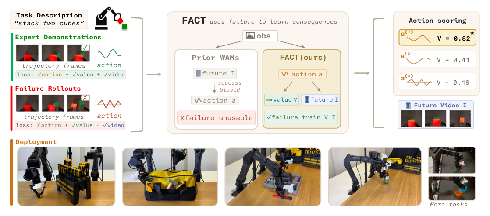
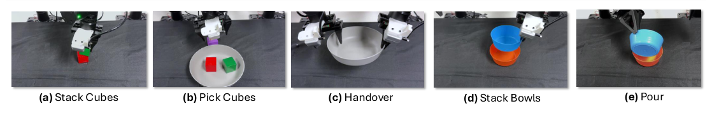
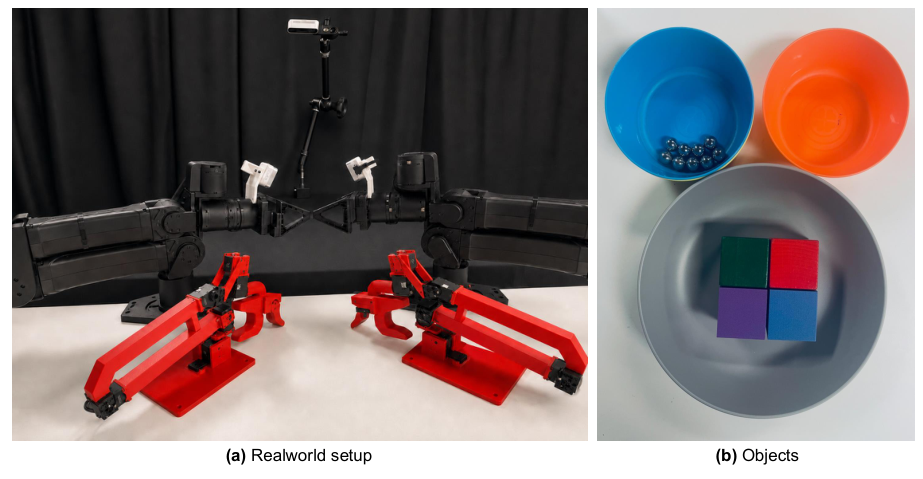
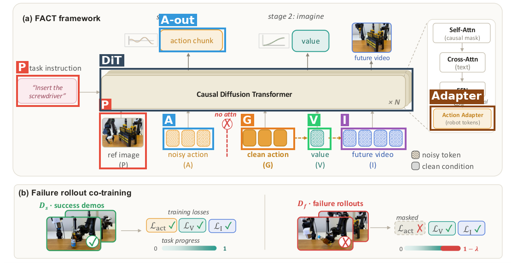
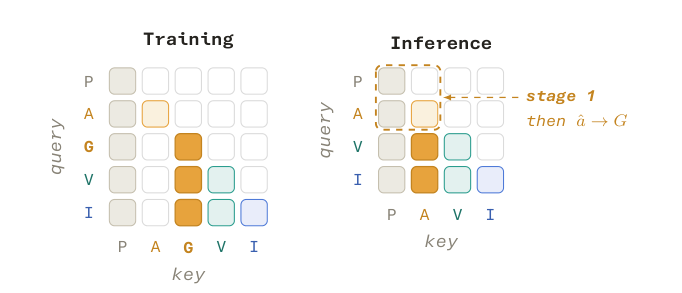
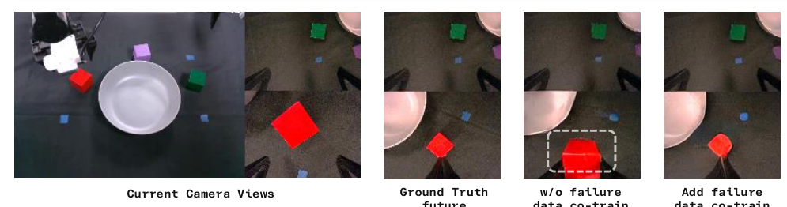
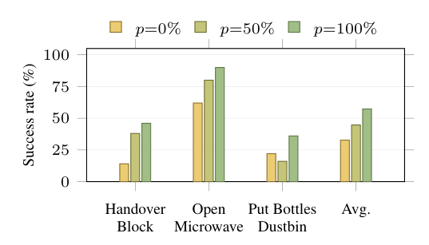
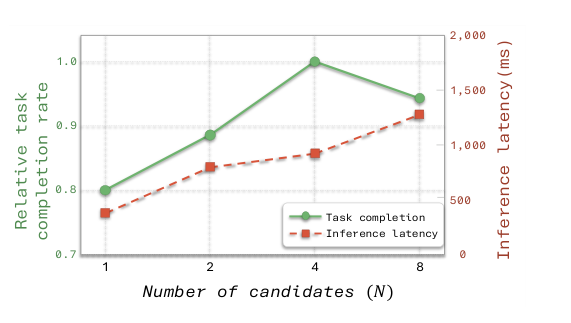
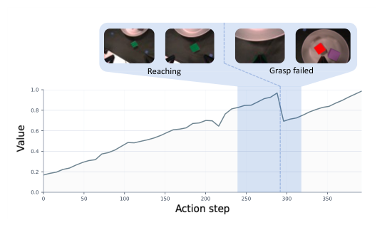
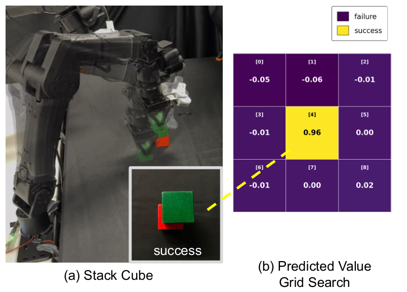

# FACT: Failure-Aware Causal Training for World-Action Models

- **题目**：FACT: Failure-Aware Causal Training for World-Action Models
- **作者**：Quanquan Peng*、Yutong Liang*（*共同一作）、Rui Yan、Nicklas Hansen、Xiaolong Wang（UC San Diego）
- **arXiv**：[2608.10232](https://arxiv.org/abs/2608.10232)（cs.RO）
- **发布日期**：论文 v1 2026-08-10（RoboTwin checkpoint 2026-08-04 已先行上传 HuggingFace）
- **代码/主页**：[项目主页 fact-wam.github.io](https://fact-wam.github.io) ｜ [GitHub Bariona/FACT](https://github.com/Bariona/FACT) ｜ [HF 权重](https://huggingface.co/Bariona/fact-wam) ｜ [HF 数据](https://huggingface.co/datasets/Bariona/robotwin-v2)
- **结构速览**：
  - §1 Introduction：WAM 只见过成功演示 → 坏动作下幻觉成功未来；提出"先动作后预测"让失败数据变成后果监督
  - §2 Related Work：VLA、WAM、机器人数据来源（含失败数据利用）
  - §3 Method：3.1 问题定义（动作条件的未来视频+进度值）；3.2 架构（G 槽 teacher forcing + 注意力 mask + 共享骨干上的 action adapter）；3.3 训练与推理（失败感知 value 目标、三模态 flow matching、两段式推理、可选 best-of-N 打分）
  - §4 Experiments：4.1 RoboTwin 仿真 50 任务；4.2 真机双臂 5 seen + 3 unseen；4.3 消融（视频共训、因果 mask、失败 loss 屏蔽、失败数据 scaling、N 扫描、value 轨迹）
  - §5 Limitations；§6 Conclusion
  - App A 伪代码 ｜ App B/C 真机任务与硬件、prompt ｜ App D RoboTwin 逐任务表 ｜ App E 成功率×延迟 ｜ App F SSIM/PSNR 全表 ｜ App G 更多 value 轨迹 ｜ App H value 热力图

---

## 第1章 · 作者与实验室背景评估

（联网调研，2026-08-16；所有链接来自实际访问的搜索结果，未猜测 URL。⚠️ 本章内容未进入第3章盲审上下文。）

### 作者背景表

| 姓名 | 身份 | 单位 | 主方向 | 代表作 | 主页 |
|---|---|---|---|---|---|
| Quanquan Peng（共同一作） | CS PhD 在读（本科 SJTU ACM 班） | UCSD，导师 Xiaolong Wang | 机器人操作、人形全身控制、人机交互 | Human-Agent Joint Learning（ICRA 2025，共同一作，Best Paper Finalist + HRI Best Paper）；Embodiment-Aware Generalist-Specialist Distillation（ICRA 2026，共同一作） | [pengqq.com](https://pengqq.com/) ｜ [Scholar](https://scholar.google.com/citations?user=9DVPINAAAAAJ) |
| Yutong Liang（共同一作） | CSE **硕士一年级**（2025.9 入学，本科北大计算机） | UCSD，导师 Xiaolong Wang | 机器人学习、灵巧操作、世界模型 | ConTrack（ECCV 2026 一作）；XL-VLA（CVPR 2026 Highlight，二作）；DexterCap（Eurographics 2026 一作） | [lyt0112.com](https://www.lyt0112.com/) ｜ [Scholar](https://scholar.google.com/citations?user=YtGyys8AAAAJ&hl=en) |
| Rui Yan | UCSD ECE 硕士（2026 年起赴 Georgia Tech 读 PhD） | UCSD（论文时期） | 机器人学习、VLA | EgoVLA（IROS 2026，合作者） | 未找到可确认主页（存在同名 Scholar 页但无法确认归属） |
| Nicklas Hansen | UCSD PhD 已毕业，现 NYU 博士后（与 Lerrel Pinto、Yann LeCun 合作） | NYU / UCSD | 世界模型、model-based RL | TD-MPC（ICML 2022）；TD-MPC2（ICLR 2024 Spotlight）；Puppeteer（ICLR 2025） | [nicklashansen.com](https://www.nicklashansen.com/) ｜ [Scholar](https://scholar.google.com/citations?user=8wGH7wsAAAAJ&hl=en) |
| Xiaolong Wang（末位，按惯例推断为通讯/导师） | UCSD Associate Professor，兼任 Meta Superintelligence Labs Research Director | UCSD / Meta | 具身智能、人形、灵巧操作、world model + RL | Open X-Embodiment（ICRA 2024 Best Paper）；TD-MPC 系列；NaVILA（RSS 2025） | [xiaolonw.github.io](https://xiaolonw.github.io/) ｜ [Scholar](https://scholar.google.com/citations?user=Y8O9N_0AAAAJ&hl=en) |

### 实验室主方向

Xiaolong Wang 组（UCSD ECE，[group 页](https://xiaolonw.github.io/group.html)）的 world model + 机器人是 **2022 年起的传统强方向且持续投入**，不是新开方向。证据链（[精选发表页](https://xiaolonw.github.io/publication_select.html)）：world model 线 TD-MPC（ICML 2022）→ Finetuning Offline World Models in the Real World（CoRL 2023）→ TD-MPC2（ICLR 2024）→ Puppeteer（ICLR 2025）→ Learning Massively Multitask World Models（ICLR 2026）；VLA 线 NaVILA（RSS 2025）、EgoVLA（IROS 2026）、XL-VLA（CVPR 2026 Highlight）；另有灵巧操作与人形两条主线。FACT 落在 world model 线与操作线的交汇处，方向匹配度非常高——且 TD-MPC 系列本人 Nicklas Hansen 就在作者列表里。

### 一作画像

- **Quanquan Peng**：此前发表全部在机器人方向且有获奖记录（ICRA 2025 Best Paper Finalist），但无 world model 主题一作——**FACT 是其首篇 world model 主题工作**。
- **Yutong Liang**：入学一年的硕士生，已有 ECCV 2026 一作 + CVPR 2026 Highlight 二作（VLA 方向）——同样是**首篇 world model 主题工作**，但有 VLA 直接相关积累。

### 水毕业风险信号核对与水平预判

**事实**：① 一作无相关积累？——否（有保留）：两人均无 world model 先前一作，但相邻积累强（获奖级操作工作 / Highlight 级 VLA 工作）。② 导师主业不在此方向？——否：连续 4 年顶会 world model 论文。③ 实验室无持续投入？——否：2022–2026 每年有产出。④ 单位无积累？——否：UCSD 有 Contextual Robotics Institute，Wang/Su 两组长期深耕。

**推断**（依据注明）：水毕业/蹭热点风险**低**（依据：导师组连续记录 + TD-MPC 原作者在作者列表 + 一作相邻积累）。需留意：两位一作均首次做 world model 主题、其中一位是入学一年的硕士生，技术深度需精读检验（本文档第3、6章即为此）；Wang 现兼 Meta MSL Research Director，学界组带宽可能分散（兼职是事实，"带宽分散"是推断）。

---

## 第2章 · 论文类型判定

**结论**：**a+b 型组合 + 一处原创核心模块**——a = 预训练视频扩散骨干（WAN2.2-5B）+ flow matching 三模态联合去噪，b = 推理时 best-of-N value 打分（来自 GPC），原创 = "先动作后预测"的 G 槽 teacher-forcing 因果 mask + 失败 rollout 的 loss 屏蔽共训机制（Eq. 6 + Fig. 3）。

| 组件 | 原论文 | 在本文中承担的角色 |
|---|---|---|
| WAN2.2-TI2V-5B 视频扩散模型 | [Wan (arXiv 2503.20314)](https://arxiv.org/abs/2503.20314)，文中 [51] | 整个网络的预训练骨干与视频先验；T5 文本编码随 WAN 管线使用（Sec. 3.3 / Table 5） |
| Flow matching 去噪目标 | [Lipman et al. (arXiv 2210.02747)](https://arxiv.org/abs/2210.02747)，文中 [49] | 动作/价值/未来视频三种模态统一的训练 loss（Eq. 7） |
| Best-of-N 候选打分（GPC） | [Qi et al., RA-L 2026 (arXiv 2502.00622)](https://arxiv.org/abs/2502.00622)，文中 [50] | 推理时用 value 给 N 个动作候选打分选优的思路来源（Sec. 3.3 明引 [50]） |
| RoboTwin 2.0 | [Chen et al. (arXiv 2506.18088)](https://arxiv.org/abs/2506.18088)，文中 [41] | 仿真 benchmark 与演示数据来源（50 任务） |
| AdamW | [arXiv 1711.05101](https://arxiv.org/abs/1711.05101)，文中 [52] | 优化器（常规组件） |

**原创部分**（论文未引来源、属本文设计）：① token 序列 `[P‖A‖G‖V‖I]` 中的干净动作槽 G 与训练/推理两套注意力 mask（Fig. 3）；② 失败 rollout 屏蔽动作模仿 loss、保留 value/视频监督的共训方案与动作条件进度目标 Eq. (6)；③ 共享骨干上的 lightweight action adapter（工程设计，论文明确以此对比 MoT 分离专家路线 [5,7,10]，但 adapter 本身未引出处）。

**疑似借鉴（论文未引用）**：adapter 式参数高效微调是通用技术（LoRA/Adapter 家族），论文未引任何 adapter 文献，此处不算组件。

---

## 第3章 · 双盲评审 + Rebuttal

### 3.1 初审意见（由隔离上下文的盲审 agent 独立生成）

> **Summary**：本文提出 FACT，一种"先动作、后预测"的因果 World-Action Model：模型先去噪生成动作 chunk，再以 teacher-forced 的干净动作为条件预测未来视频与任务进度 value。这一 action-conditioned 接口使失败 rollout 可以在屏蔽动作模仿损失的同时，继续监督未来视频与进度预测，从而把失败数据转化为"后果监督"而非模仿目标。训练后的 value head 可选地用于 best-of-N 动作候选打分。实验在 RoboTwin 50 个仿真任务与 5 个真实双臂任务（含 3 个 unseen 变体）上进行，声称失败数据共训提升策略成功率、并降低坏动作下"成功偏置"的未来幻觉。
>
> **Strengths**：
> - **机制设计干净且动机明确**（Sec. 3.2，Fig. 2–3）。通过在 token 序列中引入干净动作槽 G 并配以定制注意力 mask，把"模仿什么"和"预测什么"在结构上分离，使失败数据能进入世界分支而不污染策略分支。这是对"WAM 只见过成功未来"这一真实缺陷的直接回应。
> - **消融含自我否定的对照，报告较为诚实**（Table 2）。"Ours + scoring"（无失败数据时打分反而从 82% 降到 79%）和"w/ failed-action loss"（不屏蔽失败动作损失时降到 63%）两个对照支持了论文的核心论点。
> - **幻觉降低有量化证据**（Table 4，App. F）：失败子集 PSNR 19.51→25.92、SSIM 0.7461→0.8290，成功子集几乎不变，配合 Fig. 5 定性对比与 App. H value 热力图，机制层面的 claim 有多角度支撑。
> - **评测覆盖面与透明度尚可**：仿真给出全部 50 任务逐任务结果（每任务每 split 100 trials），App. E 报告实测推理延迟（380 ms vs Motus 1220 ms），App. A 给出伪代码。
>
> **Weaknesses**：
> - **W1（Fig. 6 与 Table 6 的数据矛盾/协议未披露）**：Fig. 6 三个 RoboTwin clean 任务 p=0% 平均 32.7%、p=100% 57.3%，但 Table 6 同三任务 clean split 下 FACT（无失败）约 76%、w/ failure 约 88%——远高于 Fig. 6 两个端点。正文未说明 Fig. 6 用了何种不同配置。若配置相同是数据矛盾；若不同则关键协议未披露，scaling 结论建立在读者无法核验的弱化设定上。
> - **W2（统计报告整体缺失）**：全文无显著性检验、置信区间或 error bar。真机每格仅 20 trials，"Ours w/ failure" 89% vs π0.5 88% 只差 1 次成功，"+scoring" 92% vs 89% 只差 3 次，unseen 82% vs 85% 同样在二项噪声内——这些比较性结论目前不被数据支持，只能说"与 π0.5 相当"。
> - **W3（缺少同 rollout 预算的对照）**：所有外部 baseline 只用专家演示，而 Ours w/ failure 额外用了约 1.3K 仿真 + 每 cube 任务约 30 条真机 rollout；Algorithm 2 丢弃成功 rollout。缺"同预算成功样本自模仿"（rejection-sampling 自提升）对照，无法区分收益来自失败后果监督还是更多同策略数据；[42–48, 50] 类方法也无一进入比较。
> - **W4（真机失败数据覆盖与收益模式不自洽且未讨论）**：失败数据只为 cube 任务收集，但收益最大的是无失败数据的 Stack Bowls（80→95）和 Pour（85→95），有失败数据的 Stack Cubes 只有 70→75，Handover 反而下降（90→85）。论文对此只字未提。
> - **W5（可复现性不达标）**：全文无代码/数据可用性声明、无 seed 与重复次数、无外部 baseline 数字来源与协议对齐说明、无失败起点 tf 标注协议（Algorithm 2 仅写 "when available"）。
> - **W6（失败轨迹进度目标的概念性瑕疵）**：pt=t/T 使失败 episode 在 onset 前仍按时间领取上升趋近 1 的"进度"目标，但从一开始就走错方向的轨迹并无此进度，给 value head 注入系统偏差；λfail=1+clip 的两段式粒度粗糙，无敏感性分析。
> - **W7（幻觉实验证据强度定位）**：w/ failure 模型在失败子集上提升，部分是训练/测试分布匹配的必然结果；512 held-out 样本的抽取池构成未写明，宜补跨任务/新失败模式泛化测试。
>
> **Questions**（7 条，要点）：Fig. 6 具体协议？Table 1 baseline 数字是复跑还是引用？几个 seed？成功 rollout 为何丢弃、补上后失败数据增益还剩多少？cube 任务指哪几个、无失败数据任务为何提升最大？tf 由谁按什么标准标注？代码数据是否公开？
>
> **Minor**：App. H "unclipped 可为负"与 Eq. (6) clip 到 [0,1] 表述不一致；512 样本来源未写明；wa=20 无依据；Fig. 6 数值不可读；摘要 "outperforms many existing baselines" 过强（仿真 87.5 并未超过 Motus 87.8）。
>
> **评级：major revision**。机制设计与自我否定式消融值得肯定，机制性结论（失败数据降低幻觉、value 需失败训练才有用）有支撑；但比较性与 scaling 结论撑不住：无统计检验、真机 n=20、Fig. 6 与 Table 6 矛盾未解释、缺同预算对照、无开源声明；且同等数据下未超越最强 baseline（仿真不及 Motus，真机 unseen 不及 π0.5）。

### 3.2 Rebuttal（主 agent 以作者方身份撰写，论据仅来自论文内部）

逐条回应（全文已发送给审稿人，此处收录要点）：

- **W1：承认成立。** 论文内确实无法解释 Fig. 6 与 Table 6 的差距，scaling 协议未披露是实质写作缺陷；澄清前该结论只在未披露的弱化设定下成立。
- **W2：大部分承认，一点范围澄清。** 仿真侧每列约 5000 trials（Table 6 标注 100 trials/任务/split × 50 任务），机制性差异（81.8→85.6→87.5）功效远高于真机侧；但真机 n=20 的全部 1–3 点差异确在噪声内，同意把与 π0.5 的比较降级为"相当"，摘要措辞同意修改。
- **W3：承认核心诉求。** 最接近的论文内证据是 "w/ failed-action loss" 63%（排除"把 rollout 当演示"的朴素路径），但它用的是失败动作，不能替代成功 rollout 自模仿对照。
- **W4：部分辩护 + 部分承认。** 辩护：共享骨干的跨任务传导写在 Sec. 3.2（与 MoT 对比的设计动机）；且按 W2 口径，n=20 下 Handover 90→85 只是 1 次成功的波动——如实承认这把双刃剑同样适用于对我们有利的 Bowls/Pour 大涨。承认：无失败数据明细、无模式分析。cube 任务 = Stack Cubes、Pick Cubes（Sec. 4.2）。
- **W5：全部承认**，并补充一个论文该写而没写的细节：tf 不可得时 1fail 恒为 0，整条失败轨迹按"成功式"进度目标参与训练。
- **W6：部分辩护。** Eq. (3) 是一般化定义、uniform reward 是论文明说的简化；Fig. 8/App. G/App. H 显示 value 经验上跟随动作后果而非单纯跟随时间。承认 onset 前 t/T 的系统偏差真实、无敏感性分析。
- **W7：部分辩护。** 覆盖失败分布是该 claim 的机制而非混淆变量；关键对照是成功子集几乎不变（26.12 vs 26.08）；App. H 网格是对反事实候选动作的受控探测。承认抽样池构成未写明、跨任务泛化未测，表述范围将收窄。

**承认的批评清单（= 本文真正硬伤一览）**：
1. Fig. 6 scaling 实验协议未披露，与 Table 6 的矛盾在论文内无法解释（W1）
2. 全文零统计不确定度；真机侧所有与 π0.5 的比较落在 n=20 二项噪声内，应降级为"相当"；摘要措辞过强（W2）
3. 缺"同预算成功 rollout 自模仿"对照，失败监督收益归因不完全干净（W3）
4. 真机各任务失败数据量无明细，"无失败数据任务收益更大"的模式无分析（W4）
5. 复现性声明整体缺失：代码/数据、seed、baseline 数字来源、tf 标注协议（W5）
6. 失败轨迹 onset 前按 t/T 领取上升进度目标的系统偏差、无敏感性分析（W6）
7. Table 4/8 held-out 池构成未写明、幻觉结论泛化范围未测（W7）

### 3.3 审稿人二轮回复 + 最终评级

> **W1 维持**（作者承认；澄清前 scaling 结论不成立）。**W2 部分撤回、核心维持**：撤回对仿真侧机制性对比"落在噪声内"的暗示（每列约 5000 trials 是论文内证据）；但单一训练配置的 seed 方差未量化，5000 trials 只覆盖评测方差不覆盖训练方差；真机侧降级与摘要修改双方确认。**W3 维持**（"w/ failed-action loss" 排除了朴素路径，但关键对照仍缺失，归因问题在当前稿件内无法化解）。**W4 部分撤回、部分维持**：撤回"不自洽疑点"的强表述（噪声双刃剑论证正当）；但跨任务传导只是与设计一致的可能机制，论文内无实验将其与噪声区分。**W5 维持**，并指出 rebuttal 补充的 tf 退化行为暴露了新的未披露问题：部分失败轨迹实际以"成功式"进度目标参与训练，修订版应量化占比。**W6 部分撤回**：经验证据成立，下调严重度——不威胁主结论，属目标设计的系统性瑕疵。**W7 部分撤回**：撤回"近乎同义反复"的强表述；按收窄后的范围，幻觉降低 claim 是被支持的。
>
> **双方确认的缺陷**：7 条（见 3.2 清单，其中 W6/W7 严重度已下调）。
>
> **最终评级：major revision（维持初审）。** rebuttal 质量高——所有辩护均基于论文内证据且部分成立，促使撤回或下调 W2（仿真部分）、W4（模式定性）、W6、W7；但最致命的三条（Fig. 6 数据矛盾、统计不确定度整体缺失、同预算对照缺失）均被作者确认且只能靠修订版的新实验与新披露封闭。贡献量级维持初审判断：对 WAM 子领域一个真实缺陷的干净组合式解法，机制性结论在收窄范围内可信，但同等数据下未超越最强 baseline。

---

## 第4章 · 大白话：这篇文章在做什么

**场景**：让双臂机器人照着一句话指令干活（叠方块、递盘子、倒小球）。现在流行的做法是训一个既会出动作、又会"想象"接下来画面的模型（world-action model），想象能力给动作提供物理直觉。

**之前的方法**：这类模型的想象力全是拿成功示范教出来的——你喂它一个烂动作，它照样想象出"任务顺利完成"的画面（成功偏置幻觉）。机器人自己跑砸的那些失败录像，既不能当示范学（会学坏），也没别的用法，只能扔掉。

**本论文的方法**：把顺序倒过来——先让模型出动作，再强制以"这个动作"为条件去预测未来画面和任务进度分数。这样失败录像就有用了：里面的烂动作不学（把模仿 loss 关掉），但"这个烂动作会导致什么下场"照学不误。学会了后果，模型还能顺便给几个候选动作打分，挑分最高的执行。

**图内文字中文翻译**（按阅读顺序）：左侧，任务描述"stack two cubes（把两个方块叠起来）"下面是两类训练数据——绿色的**专家演示**（轨迹画面 + 动作，三个 loss 全开：✓动作 + ✓进度值 + ✓视频）和红色的**失败 rollout**（轨迹画面 + 动作，动作模仿 loss 关闭：✗动作 + ✓进度值 + ✓视频）。中间对比框"FACT 用失败学后果"：**以前的 WAM** 从观察直接想象未来画面再倒推动作，想象带成功偏置，失败数据不可用（✗）；**FACT（本文）**先出动作 a，再预测进度值 V 和未来画面 I，失败数据可以训练 V 和 I（✓）。右侧**部署**：动作打分——三个候选动作 a⁽¹⁾/a⁽²⁾/a⁽³⁾ 分别得到 V=0.82（★选中）/0.41/0.19，并可渲染未来视频；底部一排是真机执行的各种任务照片（"更多任务……"）。

自查：不做机器人方向的人应能看懂——"教练只给你看进球集锦，你永远学不会判断哪脚会踢飞；FACT 把踢飞的录像也拿来教裁判打分"。

---

## 第5章 · 实验

### 5.1 仿真实验：RoboTwin 2.0

**场景一句话**：RoboTwin 2.0 是 50 个双臂桌面操作任务的仿真 benchmark（叠方块、开微波炉、把瓶子扔进垃圾桶……），带背景/光照域随机化。

**条件**：训练数据 = clean 演示 2500 条（50 任务 × 50 条）+ 域随机化演示 25000 条（50 任务 × 500 条）（App. D），另加约 1.3K 条模型 rollout 失败轨迹；评测每任务每 split 100 trials（Table 6）；成功率按任务判定器算。基线含 π0、π0.5、X-VLA、Gigaworld-Policy、Motus。

**场景图**：论文未给 RoboTwin 场景截图（Fig. 5 的失败预测对比图为仿真外真机图；逐任务名单见 Table 6），标注：**未找到专门的仿真场景图**。

**主对比表（Table 1 汉化）**：Clean = 干净场景，Rand. = 域随机化场景，数值为 50 任务平均成功率（%），最优加粗：

| 方法 | Clean | Rand. | 平均 |
|---|---|---|---|
| *外部基线* | | | |
| π0 | 65.9 | 58.4 | 62.2 |
| X-VLA | 72.9 | 72.8 | 72.9 |
| π0.5 | 82.7 | 76.8 | 79.8 |
| Gigaworld-Policy | 87.0 | 85.0 | 86.0 |
| Motus | **88.7** | **87.0** | **87.8** |
| *FACT 变体* | | | |
| Ours | 86.3 | 84.9 | 85.6 |
| Ours w/ failure | 88.4 | 86.6 | 87.5 |
| *消融* | | | |
| Ours w/o video co-train | 82.5 | 81.0 | 81.8 |

读法：视频共训 +3.8（81.8→85.6），失败共训再 +1.9（85.6→87.5）；最终与 Motus 相当（87.5 vs 87.8）但推理快约 3×（380 ms vs 1220 ms，App. E）。

### 5.2 真机实验

**场景一句话**：两条 YAM 机械臂 + 1 个 RealSense D435 主视角 + 2 个 D405 腕部相机，GELLO 遥操作采数据（App. C）；5 个 seen 任务（叠方块、捡方块上盘、双臂递盘子、叠碗、倒小球）+ 3 个换颜色/形状/指令的 unseen 变体。

**条件**：cube 任务（Stack Cubes、Pick Cubes）每个 200 条专家演示，其余任务 50 条；每个 cube 任务另收 ~30 条失败 rollout；每格 20 trials；标 optional 的行用 N=4 候选打分，其余单样本推理。**项目主页**：[fact-wam.github.io](https://fact-wam.github.io)（论文首页给出，含 demo 视频）。

**Seen 任务（Table 2 汉化）**，成功率（%），最优加粗：

| 方法 | Stack Cubes | Pick Cubes | Handover | Stack Bowls | Pour | 平均 |
|---|---|---|---|---|---|---|
| Cosmos | 5 | 45 | 25 | 35 | 15 | 25 |
| π0 | 35 | 70 | 40 | 50 | 45 | 48 |
| π0.5 | 75 | **100** | 85 | 80 | **100** | 88 |
| Motus | 50 | 70 | 55 | 85 | 60 | 64 |
| Ours | 70 | 85 | **90** | 80 | 85 | 82 |
| Ours w/ failure | 75 | 95 | 85 | 95 | 95 | 89 |
| Ours w/ failure + scoring（可选） | **85** | **100** | 85 | **100** | 90 | **92** |

**Unseen 任务（Table 3 汉化）**：

| 方法 | Stack Cubes | Pick Cubes | Stack Bowls | 平均 |
|---|---|---|---|---|
| Cosmos | 15 | 10 | 0 | 8 |
| π0 | 30 | 65 | 75 | 57 |
| π0.5 | **65** | 90 | **100** | **85** |
| Motus | 55 | 60 | 70 | 62 |
| Ours | 45 | 75 | 80 | 67 |
| Ours w/ failure | 60 | 85 | 85 | 77 |
| Ours w/ failure + scoring（可选） | **65** | **95** | 85 | 82 |

读法：seen 上失败共训 82→89、加打分 92；unseen 上 67→77→82，接近未用大规模机器人预训练的情况下逼近 π0.5（85）。⚠️ 第3章盲审已确认：n=20/格下这些 1–3 点差异在二项噪声内，与 π0.5 的关系应读作"相当"而非"超越"。

### 5.3 为什么选这些实验

- **共同特性**：全部是**桌面双臂、短-中程、失败模式清晰可判**的操作任务——抓空、叠歪、掉落这类"离散、可自动判定成败"的失败占主导；RoboTwin 还提供了大规模自动评测（每列 5000 trials）和廉价收集失败 rollout 的管道（Algorithm 2 直接拿初版策略跑，失败即入库）。
- **方法哪个设计吃这个特性**：失败感知 value 目标（Eq. 6）需要"明确的失败起点 + 二元成败标注"，这些任务恰好提供；best-of-N 打分吃"一次抓取定成败"的结构——Fig. 7 显示长程抓取任务上 N=1→4 相对完成率 0.80→1.00。数字对上了：失败共训的增益在失败率高、演示少的真机上最大（seen +7：82→89；unseen +10：67→77），在演示充足的 RoboTwin 上只有 +1.9（85.6→87.5）——失败监督像是演示不足时的补品。
- **该测但没测的**：论文引用了 RoboCasa [36,37]、LIBERO [39]、CALVIN [40] 却都没测；长程多阶段任务（厨房级）、可恢复性差的任务（打碎、倒洒不可逆）都缺席。缺席本身是信号：Eq. (6) 的两段式失败目标在"失败模糊、可部分恢复"的长程任务上未必好定义（呼应盲审 W6）。

### 5.4 复现可能性（硬核查，零猜测）

联网核查日期 2026-08-16（实际打开 repo/HF/主页）：

| 信息点 | 状态 | 出处 |
|---|---|---|
| 代码仓库 | ✅ 实质代码（118 个文件路径，模型/训练/推理/评测俱全，非空 README） | [github.com/Bariona/FACT](https://github.com/Bariona/FACT)（Apache 2.0；README 自述覆盖 "end-to-end RoboTwin pipeline"） |
| RoboTwin ckpt | ✅ 已发布（约 10.4 GB，基座 Wan2.2-TI2V-5B），另有可在线跑的 [HF Space demo](https://huggingface.co/spaces/Bariona/fact-world-action-model) | [huggingface.co/Bariona/fact-wam](https://huggingface.co/Bariona/fact-wam) |
| 真机 ckpt | ❌ 未找到 | repo/HF/主页均无 |
| RoboTwin 专家演示数据 | ✅ 已发布（84.5 GB tar，Clean+Randomized 各 50 任务 × 50 episodes，LeRobot v2.1 格式） | [huggingface.co/datasets/Bariona/robotwin-v2](https://huggingface.co/datasets/Bariona/robotwin-v2) |
| 失败 rollout 数据 | ❌ 未找到——代码里消费端俱全（`fact_datasets/datasets/lerobot_dataset.py:527` 读 `meta/failure_rollouts.jsonl`），但数据本体未随数据集发布 | repo 代码检索 |
| 失败 rollout 收集/转换脚本 | ❌ 未找到（`scripts/` 与 `evaluation/robotwin/` 均无，README 无说明） | repo 文件清单 |
| 真机演示数据 | ❌ 未找到（主页只有视频） | 主页/repo/HF |
| 训练超参（论文内） | ✅ 部分：lr 2e-4/2e-5、wa=20、wv=wI=1、H=48、λfail=1、20 flow-Euler 步、WAN2.2-5B、AdamW | Sec. 3.3 Implementation details |
| 训练超参（repo 补齐） | ✅ batch 32/GPU × 8 卡、DeepSpeed ZeRO-2、150K steps、warmup 500 + cosine、AdamW betas (0.9,0.95)、adapter rank 1024、48 帧@15fps、三视角拼 384×192、T5 长度 64 | [`world_action_model/configs/robotwin.py`](https://github.com/Bariona/FACT/blob/main/world_action_model/configs/robotwin.py) |
| GPU 型号 / 训练时长 | ❌ 未找到（论文与 repo 均未写；App. E 的 RTX PRO 6000 仅为推理延迟测量） | — |
| 外部 baseline 数字来源（复跑 or 引用） | ❌ 论文未说明 | 盲审 W5 已确认 |
| seed / 重复次数 | ❌ 论文未说明 | 盲审 W5 已确认 |

**结论：`需自行补齐细节`（仿真主线）；真机部分 `难以复现`。**

缺失项清单：① 失败 rollout 数据未发布；② 失败 rollout 的收集/转换脚本未提供（复现 "Ours w/ failure" 需自建此环节）；③ 真机 ckpt、真机数据、真机训练管线全部未开放；④ GPU 型号与训练时长未写；⑤ seed 与重复次数未写；⑥ baseline 复评协议未写；⑦ 失败起点 tf 的标注标准未写。仿真侧"代码 + ckpt + 专家数据 + 在线 demo"全链条开放是显著加分项，但论文核心卖点（失败共训）恰恰是链条上缺的那一环。

---

## 第6章 · 方法拆解

（框注：🟥 P = 观察前缀（指令 + 参考图）；🟦 A = 噪声动作段与 Stage 1 输出；🟧 G = 干净动作槽（teacher forcing 核心）；🟩 V = 进度值 token；🟪 I = 未来视频 token；⬛ DiT = 因果扩散 Transformer 主干；🟫 Adapter = 动作适配器。训练/推理注意力规则见下方 mask 图。）

**分块说明**（接口首尾相接）：

- **🟥 P 观察前缀**——来源：常规 VLA 输入设计。接口：**进** = 当前三视角 RGB（拼成一张画布，App. C）+ 机器人本体状态 + 语言指令（T5 编码后走 cross-attention）；**出** = 干净条件 token，供后面所有段 attend。训练/部署无差别，永远是干净的（不加噪）。

- **⬛ DiT 主干（因果扩散 Transformer）**——来源：[WAN2.2-TI2V-5B](https://arxiv.org/abs/2503.20314) 预训练视频扩散模型（第2章组件①）。每个 block = 带因果 mask 的 self-attention + 文本 cross-attention + FFN。所有段共用这一个网络，没有分离的"世界专家"（对比 MoT 设计 [5,7,10]）——这正是失败数据的视频/价值 loss 能"反哺"动作能力的通道。训练：主干 lr 2e-5（小步微调，保住视频先验）。

- **🟫 Action Adapter**——来源：作者工程设计（论文未引 adapter 文献）。挂在每个 block FFN 之后、只作用于机器人 token 的轻量旁路（repo config：rank 1024），lr 2e-4（比主干大 10×）。作用：给动作学习专用容量，不动预训练视频通路。

- **🟦 A 噪声动作段（Stage 1：act）**——来源：flow matching 动作头（组件②，π0 一脉的连续动作建模）。接口：**进** = 高斯噪声动作 token，只能看 P（看不到 G/V/I，Fig. 3）；**出** = 去噪后的动作 chunk â（H=48 步，20 flow-Euler 步）。训练：成功演示上 flow matching loss（wa=20）；**失败 rollout 上此 loss 被屏蔽**（ma=0，Algorithm 1）——烂动作不进模仿目标。部署：只要动作就到此为止（380 ms，可用 P 的 KV cache）。

- **🟧 G 干净动作槽（本文核心原创）**——来源：作者原创。训练时放**真实执行过的动作**（teacher forcing）：成功演示放专家动作，失败 rollout 放当时执行的烂动作；A 看不到 G（防泄漏），V 和 I 只看 G 不看 A（Fig. 3 训练 mask）。部署时（Stage 2）把 Stage 1 的 â 填进来。接口：**进** = ground-truth 动作（训练）或 â（部署）；**出** = 给世界分支的动作条件。一句话：**G 槽把"预测什么"从"模仿什么"里剥出来**——这就是失败数据能用的全部机关。

- **🟩 V 进度值 token（Stage 2：imagine）**——来源：目标设计原创，best-of-N 用法来自 [GPC](https://arxiv.org/abs/2502.00622)（组件③）。接口：**进** = P + G；**出** = 动作条件任务进度 v∈[0,1]。训练目标（Eq. 6）：成功轨迹按时间进度 p=t/T；失败轨迹在失败发生后 clip(p−λfail, 0)=0（λfail=1）。部署（可选）：并行采 N=4 个动作候选，各自过 Stage 2 拿分，执行 argmax（Eq. 10）。

- **🟪 I 未来视频 token（Stage 2：imagine）**——来源：WAN 的视频生成能力。接口：**进** = P + G；**出** = 当前帧 + 4 个未来偏移（0, H/4, H/2, 3H/4, H）的画面 latent。训练：flow matching（wI=1），成功与失败轨迹都监督——失败轨迹的"翻车画面"就是这里学的。部署：可选，用于后果可视化。

**串成流程**：P（观察）→ 🟦 Stage 1 去噪出 â → â 填入 🟧 G → 🟩/🟪 Stage 2 以 G 为条件出进度分 + 未来画面 → 分数选动作执行。训练时五段拼成一条序列 `[P‖A‖G‖V‖I]` 单 forward 联合去噪，用 Fig. 3 的 mask 保证上述可见性。接口首尾相接，无断点。

---

## 第7章 · 消融

论文消融充分（Table 1/2/4 + Fig. 5/6/7/8 + App. F/H）。汉化 + takeaway：

**主消融（真机 seen 平均，Table 2；仿真平均，Table 1）**：

| 消融（行名重述成人话） | 真机 seen | 仿真 | Takeaway |
|---|---|---|---|
| 完整版：失败共训 + N=4 打分 | **92** | — | 上限配置 |
| 失败共训，单样本推理 | 89 | **87.5** | 主打配置 |
| 不用失败数据（只有成功演示） | 82 | 85.6 | 失败共训真机 +7、仿真 +1.9 |
| 不用失败数据但硬上打分 | 79 | — | **没见过失败的 value 打分是负资产**（-3）：核心论点最有力的自我对照 |
| 去掉 G 槽因果 mask（动作/价值/视频混在一起去噪） | 77 | — | teacher forcing 结构 +5，是"未来预测转化为动作增益"的关键 |
| 失败数据不屏蔽动作 loss（把翻车动作也当示范学） | 63 | — | 灾难性 -26：失败只能教后果、不能教行为 |
| 去掉视频共训（纯模仿动作头） | 58 | 81.8 | 视频预测是最大单项：真机 -24、仿真 -3.8 |

**失败数据降低幻觉（Table 4/8 + Fig. 5）**：512 个 held-out 窗口上，失败子集 PSNR 19.51→25.92（SSIM 0.7461→0.8290），成功子集几乎不动（26.12→26.08）——失败共训专治"坏动作下想象成功"，不伤正常预测。

（图内文字：左起——当前相机画面｜真实未来｜不加失败数据共训：模型想象方块已被抓起（白色虚线框标出幻觉的成功抓取）｜加失败数据共训：正确预测了抓空的真实下场。）

**失败数据 scaling（Fig. 6）**：三个 RoboTwin clean 任务上失败数据比例 p=0%/50%/100%，平均成功率 32.7%→57.3% 单调上升、未见饱和。⚠️ **注意（呼应盲审 W1，作者方已承认）**：此图与 Table 6 同三任务约 76%/88% 的水平矛盾，训练协议未披露，该 scaling 结论目前只在一个读者无法核验的弱化设定下成立。

**候选数 N 扫描（Fig. 7）**：长程抓取任务上 N=1→4 相对完成率 0.80→1.00，N=8 回落至 ~0.94 且延迟近 1300 ms——N=4 是性价比点（真机 optional 行即用 N=4）。

**value 行为可视化（Fig. 8 + App. G/H）**：Pick Cubes rollout 中 value 随进度上升、抓空瞬间跳水、re-grasp 后回升；App. H 的 3×3 网格放置探测中，唯一能成功的中心位得 0.96，周围失败位 ≈0 甚至为负——value 确实在跟随动作后果而非单纯计时（这组证据在 rebuttal 中成功让审稿人下调了 W6 严重度）。

---

*精读文档由 /read 流水线生成（paper-scout 自动运行，2026-08-16）；第3章由隔离上下文盲审 agent 两轮生成，主 agent 未改动其结论。*
