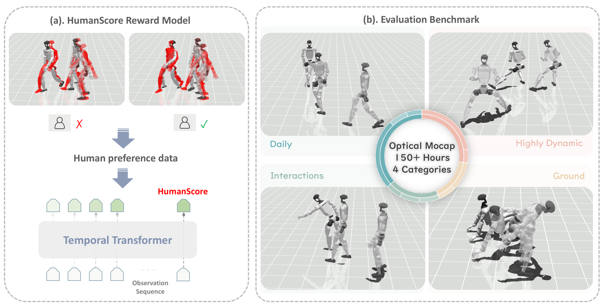
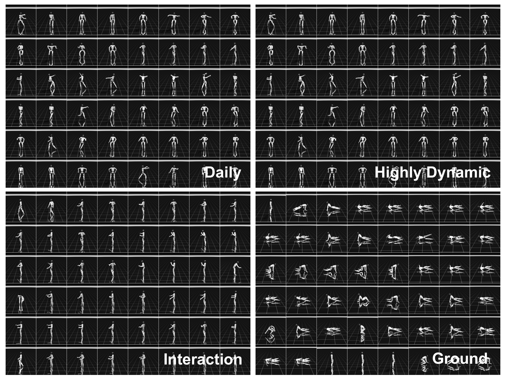
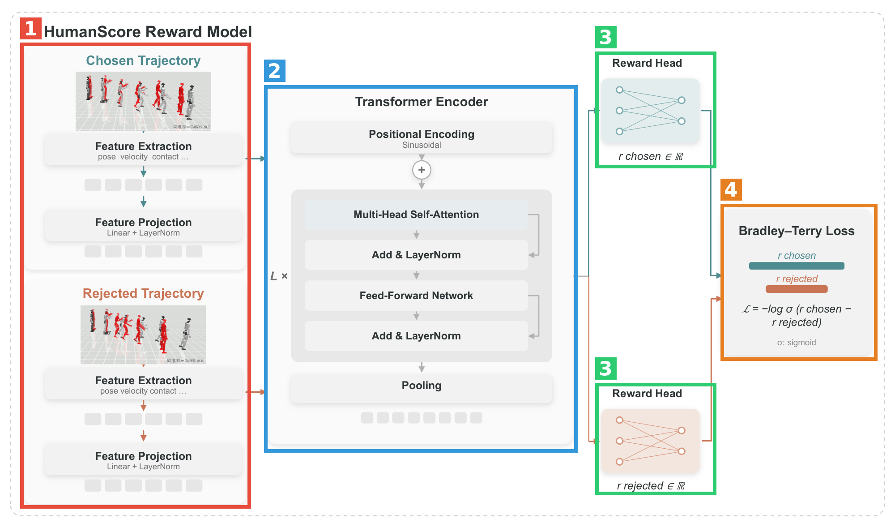
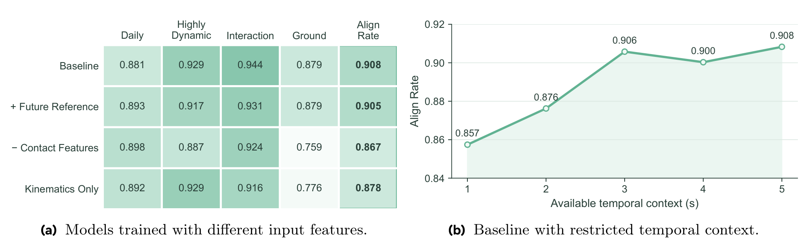

# HumanTracker: Towards Comprehensive and Human-Aligned Motion Tracking Benchmark

- **arXiv**: [2608.13555](https://arxiv.org/abs/2608.13555)（cs.RO）
- **作者**: Dairu Liu*, Zekun Qi*, Jiayu Zeng*, Ruixi Yu, Yu Guan, Yintianrun Zhang, Xuchuan Chen, Sikai Liang, Zekai Li, Chenghuai Lin, Xinqiang Yu, Wenyao Zhang, He Wang†, Li Yi†（*共同一作，†共同通讯）
- **单位**: 南开大学、清华大学、Galbot、上海交通大学、北京大学、上海期智研究院
- **发布日期**: 论文 v1 2026-08-13（arXiv 首页时间戳；文内 Date 行为 2026-08-14）；GitHub 仓库创建于 2026-08-11。README 与作者主页标注 **ECCV 2026** 录用
- **代码**: [GalaxyGeneralRobotics/HumanTracker](https://github.com/GalaxyGeneralRobotics/HumanTracker)（Apache 2.0）
- **项目主页**: [dairuliu.github.io/humantracker](https://dairuliu.github.io/humantracker)
- **数据集**: [HuggingFace: GalaxyGeneralRobotics/HumanTracker](https://huggingface.co/datasets/GalaxyGeneralRobotics/HumanTracker)（**截至 2026-08-16 仓库为空**，见 5.4）

**结构速览**（共 15 页）：

| Section | 在干嘛 |
|---|---|
| 1 Introduction | 两个痛点：运动学指标与人眼感知脱节；常用测试集（AMASS 140 条）太小太窄 |
| 2 Related Work | 2.1 humanoid 动作追踪谱系；2.2 动作数据集与评估 |
| 3.1 Benchmark | 153 小时光学动捕、24 名专业表演者、四大动作家族、GMR 重定向到 29-DoF 人形 |
| 3.2 标准化评测 | 统一 MuJoCo 入口、SONIC 终止准则、Succ/MPJPE 及诊断量记录 |
| 3.3 偏好数据 | 四 tracker 同参考回放 → 5 秒窗对比 → 6 名博士生标注 6,000 对（镜像后 12,000 条） |
| 3.4 HumanScore | 539 维/帧 → Transformer 编码 → 标量奖励，Bradley–Terry 损失 |
| 3.5 打分方式 | 250 帧窗 sigmoid 后按帧数加权平均 ×100 |
| 4 Experiments | Table 3 四 tracker 四家族对比；Table 4 与人类偏好一致率；Fig 5 敏感性分析 |
| 5 Conclusion | 总结 + 未来（跨具身、真机、奖励优化） |
| App A | 实现细节：padding/mask、539 维特征分解（Table 5）、训练超参全表（Table 6） |
| App B | 补充相关工作：偏好评估（RLHF 谱系）、机器人奖励模型 |
| App C | 偏好数据统计与 80/20 划分规则 |
| App D | 数据规模与 NPZ 发布格式（22,495 训练 / 2,500 测试轨迹） |
| App E | 四家族运动学覆盖描述统计（Table 8） |
| App F | 一致率的分层聚类 bootstrap 95% CI（Table 9） |
| App G | 讨论与局限（写得相当诚实） |

---

## 第1章 · 作者与实验室背景评估

### 作者背景表

| 角色 | 姓名 | 单位 | 主页 | 背景 |
|---|---|---|---|---|
| 一作* | Dairu Liu（刘岱儒） | 南开大学（软件工程**大三本科生**）+ Galbot | [个人主页](https://dairuliu.github.io/) · [Google Scholar](https://scholar.google.com/citations?user=DY5lKFcAAAAJ) | 已有 Humanoid-GPT（CVPR 2026，三作）、LIMMT（ICML 2026，中间作者）两篇 tracking 合作论文；另有 NeurIPS 2025 workshop 多模态推理一篇 |
| 共同一作* | Zekun Qi（漆泽昆） | 清华 IIIS 博士生（导师 Li Yi）+ Galbot | [个人主页](https://qizekun.github.io/) | 此前主攻 3D 表征学习（ReCon ICML 2023、ShapeLLM ECCV 2024），近期转 humanoid（Humanoid-GPT 一作） |
| 共同一作* | Jiayu Zeng | Galbot | 未找到主页 | 公开检索仅见本篇署名 |
| 通讯† | He Wang（王鹤） | 北京大学（助理教授，PKU-EPIC 实验室）+ Galbot 创始人/CTO | [个人主页](https://hughw19.github.io/) | 具身智能/机器人操纵为主业；近年 humanoid 线：Humanoid-GPT（CVPR 2026）、网球人形（IROS 2026） |
| 通讯† | Li Yi（弋力） | 清华大学交叉信息研究院（IIIS）助理教授 + Galbot + 上海期智 | [个人主页](https://ericyi.github.io/) | 斯坦福博士（Guibas 组）、前 Google 研究科学家；3D 感知 + humanoid robot learning |

### 实验室主方向判定：**传统强方向**

本文实际是 **Galbot × 清华 IIIS（Li Yi 组）× 北大 EPIC（He Wang 组）** 联合体在 humanoid motion tracking 上的持续产出。近两年同一作者群的证据链（多篇与本文作者高度重叠）：

- [Humanoid-GPT](https://arxiv.org/abs/2606.03985)（CVPR 2026）——本文评测的最强 tracker 即出自同组
- [LIMMT: Less is More for Motion Tracking](https://arxiv.org/abs/2606.06953)（ICML 2026）
- [Any2Track: Track Any Motions under Any Disturbances](https://arxiv.org/abs/2509.13833)
- [学网球的人形机器人](https://arxiv.org/abs/2603.12686)（IROS 2026）
- [HumanoidPF 室内避障](https://arxiv.org/abs/2601.16035)

即：**该组先做出了 tracker（Humanoid-GPT），现在做评测 benchmark 给整个方向立规矩**——典型的"强势组做 benchmark"路线。

### 一作画像与水毕业风险核对

**事实**：一作是南开大三本科生（Galbot 实习），本篇是其首篇一作正式会议论文，但此前已以合作者身份参与同方向两篇（CVPR/ICML 2026）；两位通讯的主业都覆盖本方向；实验室近两年在该方向持续密集投入（上表 5 篇）。

**推断**（依据上述事实）：水毕业风险信号四项全部不成立——一作有相关积累、导师主业在此、实验室持续投入、依托机构（Galbot/清华/北大）在该领域积累深厚。本科生一作 + 工业级动捕投入（153 小时光学动捕、24 名专业表演者是烧钱项目）说明这是组内资源充足的旗舰项目而非边角料。唯一需留意的是利益关联：**benchmark 作者和被评测最强 tracker（Humanoid-GPT）是同一批人**，Table 3 里自家 tracker 拿了大多数第一（此点已隔离于第3章盲审之外，盲审 W1 从纯技术角度独立指出了相关风险）。

⚠️ 本章内容未进入第3章盲审上下文。

---

## 第2章 · 论文类型判定

**结论**：**实验（系统）型（benchmark + 标准化评测协议）为主体，叠加 a+b 型组合**——把 RLHF 的偏好奖励模型配方（a：Bradley–Terry + Transformer 序列编码）搬到 humanoid tracking 评估（b）上，无原理层创新，价值在数据规模、协议标准化和"指标该对齐人的感知"这一立场。

组件清单（均为论文方法节实际承担流程环节、且在参考文献中真实存在的引用）：

| 组件 | 原论文 | 在本文中的角色 |
|---|---|---|
| GMR 重定向 | [Retargeting Matters (arXiv 2510.02252)](https://arxiv.org/abs/2510.02252) | 把人体动捕 SMPL 序列重定向为 29-DoF 机器人参考轨迹（Sec 3.1） |
| SMPL 人体模型 | [SMPL (SIGGRAPH Asia 2015)](https://dl.acm.org/doi/10.1145/2816795.2818013) | 每个 clip 附带的拟合人体表示（Sec 3.1） |
| SONIC | [arXiv 2511.07820](https://arxiv.org/abs/2511.07820) | 双重角色：被评测 tracker 之一 + 本文直接沿用其追踪误差与终止/成功准则（Sec 3.2） |
| GMT | [arXiv 2506.14770](https://arxiv.org/abs/2506.14770) | 被评测 tracker + 偏好数据 rollout 生成器之一（Sec 3.3） |
| TWIST2 | [arXiv 2511.02832](https://arxiv.org/abs/2511.02832) | 同上 |
| Humanoid-GPT | [arXiv 2606.03985](https://arxiv.org/abs/2606.03985) | 同上（同组自家 tracker） |
| 偏好奖励学习范式 | [Christiano et al. 2017](https://arxiv.org/abs/1706.03741)、[InstructGPT](https://arxiv.org/abs/2203.02155) | "收集两两偏好 → 训奖励模型"的方法论来源（Sec 1、App B） |
| Bradley–Terry 损失 | [Bradley & Terry 1952](https://doi.org/10.1093/biomet/39.3-4.324) | HumanScore 的训练目标（Sec 3.4） |
| Transformer 编码器 | [Attention Is All You Need](https://arxiv.org/abs/1706.03762) | 轨迹序列编码骨干（Sec 3.4） |

工具类：MuJoCo 为统一仿真评测入口（Sec 3.2 正文使用，参考文献未单列条目）。疑似借鉴（论文未引用）：无——方法链条上的环节均有真实引用。

---

## 第3章 · 双盲评审 + Rebuttal（隔离上下文，全流程记录）

### 3.1 初审意见（由隔离上下文的盲审 agent 独立生成）

> **Summary**：本文针对 humanoid 运动跟踪的评估问题提出两项贡献：其一是 HumanTracker benchmark，包含约 153 小时、24 名专业表演者的光学动捕轨迹，经 GMR 重定向到一个 29-DoF humanoid，按四个运动家族（Daily、Highly Dynamic、Interaction、Ground）组织并附文本标注（Sec 3.1，Table 2/7）；其二是 HumanScore，一个在 6,000 对（镜像后 12,000 条记录）专家两两偏好标注上以 Bradley–Terry 目标训练的 Transformer 轨迹奖励模型（Sec 3.3–3.5），输入为 539 维逐帧仿真状态特征。作者在统一 MuJoCo 评测协议下比较了 GMT、TWIST2、SONIC、Humanoid-GPT 四个跟踪器（Table 3），并报告 HumanScore 与人类偏好的一致率（0.908）高于各单项运动学诊断指标（Table 4/9），辅以特征与时序上下文的消融（Fig 5）。
>
> **Strengths**：
> - 问题选取真实且有据：现有评估依赖小规模 AMASS 测试集（140 序列）并把异质运动压成单一聚合分数，这一诊断（Sec 1）成立，动机清晰。
> - 数据规模与质量在同类工作中突出：153 小时光学动捕、按家族组织、9:1 motion-disjoint 划分并保留重复运动于同一分区（Sec 3.1，App D），远超常用测试套件。
> - 评测协议设计细致：统一的 reference 表示、rollout 记账与指标实现（Sec 3.2），偏好对按六种 tracker 组合均衡分配、显示顺序随机化（Sec 3.3，Fig 3），镜像对不跨分区且只在未镜像测试对上评估（App C）。
> - 统计报告在本领域平均水准之上：App F 给出按家族分层、按 source motion 聚类的 bootstrap 95% CI（Table 9），并明确了随机种子与划分方式。
> - 消融有信息量：移除接触特征在 Ground 家族上退化最明显（Fig 5a），时序上下文 1s→5s 的分析（Fig 5b）支持"感知失败单元是事件而非孤立姿态"的论点；App G 的 limitations 讨论坦诚。
>
> **Weaknesses**：
> - **W1（最严重）**：HumanScore 的训练与测试 rollout 全部来自同样的四个跟踪器（Sec 3.3），论文却在 Introduction 宣称其 "zero-shot generalization"。实际被检验的只是对未见 motion 的泛化，对未见 tracker/simulator/controller family 的泛化完全没有测试（App G 自己承认）。更麻烦的是，539 维输入包含 policy action 和 motor target（App A.2，Table 5），足以充当跟踪器"指纹"：模型可能学到的是"识别哪个 tracker 产生了这段轨迹，再套用专家对各 tracker 的总体排序"，而非感知质量本身。若如此，Table 3 的 HumanScore 列和 Table 4 的一致率都被高估，且该指标对社区最重要的用途（评估新 tracker）恰恰没有证据。最小修复：leave-one-tracker-out、用第五个不在偏好数据中的 tracker 做真检验、tracker-identity probe + action/motor-target 特征消融。
> - **W2**：Table 4 的核心对比不公平。HumanScore 是在约 9.6K 条偏好记录上训练的学习模型，对照组却是七个从未向偏好数据拟合过的单项诊断指标。应把全部诊断指标（含终止信号）在同一偏好训练集上拟合 logistic/浅层非线性组合作为对照；若拟合组合能到 0.88–0.90，"需要学 Transformer 奖励模型"的方法论贡献将被大幅削弱。App G 承认此对照缺失。
> - **W3**：关键对比缺统计检验。HumanScore CI [87.36, 93.83] 与 KPT MAE [79.67, 88.04]、MPJVE 上界 87.87 存在重叠；同一组测试对天然适合配对检验（McNemar / 配对 bootstrap），论文只报了边际 CI。各家族 strict 测试对数量全文未报。
> - **W4**：标签可靠性未量化。每对只有一名标注者一个判断，无 inter-annotator agreement，0.908 无人际上限可对照；且六名标注者全是 humanoid robotics 博士生，与摘要"what people perceive"的口径不符。
> - **W5**：缺终止信号基线。标注协议第一步就是判断谁失败，故相当比例 strict 偏好可能只编码"谁没摔倒"（Succ 已捕捉的信息），但 Succ 未出现在 Table 4；MPJPE 只在 executed portion 上计算带来幸存者偏差（GMT 在 Ground 上 Succ 0% 却报 MPJPE 0.456）。应报"由失败决定"与"双方均完成"两个子集的一致率。
> - **W6**：可获得性与合规声明缺失。全文以 "released benchmark" 行文，但（净化稿中）无任何数据/代码/checkpoint 可获得性声明；24 名表演者动捕与人类标注涉及人类受试者，未见知情同意或伦理审查声明。
> - **W7**：数据筛选与标签分布不透明。人工筛除无量化标准和比例；strict/Similar/Cannot-compare 数量分布未报。
> - **W8**：全部结论落在单一 embodiment、单一 simulator 仿真中，输入含硬件不可观测的特权量；对真实硬件的相关性未经验证（论文对此诚实）。
>
> **Minor**：Fig 5b 数字非单调（0.906→0.900）与正文 "improves steadily" 不符；Table 2 Interaction 行把期望性质写成 challenges；Table 2 与 Table 7 小时数口径（5h vs 4.59h）；Ref [43] 作者名编码乱码；Table 1 "Categories" 列定义应明确。
>
> **评级：reject**——数据集与协议扎实，但方法论是既有配方应用且无真机验证，辐射范围未超出子领域，达不到旗舰刊"substantial progress"水位；两个最强 claim（zero-shot 泛化、不可被规则诊断替代）均未被实验支撑到其陈述强度。若 rebuttal 给出 held-out tracker 证据可重新考虑证据面判断，但即便证据缺口全部封闭，该贡献更适合专业机器人学习类会议/期刊。

### 3.2 Rebuttal（作者方，一轮）

主 agent 以作者方身份逐条回应（全文要点）：

**承认的批评清单（＝论文真正硬伤一览）**：

1. **对未见 tracker 的泛化未测试**，Introduction "zero-shot generalization of HumanScore" 措辞超出证据强度（W1）——承诺改为 "generalization to unseen motions"
2. **tracker 指纹泄漏风险未被排除**：539 维输入含 policy action / motor target，且每个偏好对恒为两个不同 tracker（W1）——接受 leave-one-tracker-out、第五 tracker 检验、identity probe 三项修复
3. **缺拟合诊断组合基线**（W2）——scope 内可补，承诺补 logistic + 浅层非线性组合（含终止信号）
4. **缺配对统计检验，per-family strict n 未报**（W3 部分）
5. **无 inter-annotator agreement**；专家标注 ≠ 摘要所称大众感知（W4）——承诺子集多人标注报 Fleiss' kappa，或措辞收敛为 expert-aligned
6. **缺终止信号基线与 failure-decided 子集分析**（W5）
7. **表演者知情同意与标注伦理审查声明缺失**（W6 后半）——实质疏漏
8. **筛除比例与 strict/Similar/Cannot-compare 分布未报告**（W7）
9. **真机相关性未验证**（W8）——事实成立，不辩驳
10. Minor 全部接受（Fig 5b 措辞、Table 2 笔误、取整规则注明、Ref [43] 乱码、Table 1 列定义）

**辩护的点（论据均来自论文内部）**：

- 对 W1 的部分辩护：Fig 5a 中移除接触特征后 Ground 家族一致率 0.879→0.759，降幅恰好集中在感知失败最依赖接触事件的家族；若模型主要靠 tracker 指纹，指纹在 1 秒内即应可见，接触块不应是 Ground 的主要贡献特征——说明模型至少部分利用了与感知质量因果相关的物理信号（但承认这只是间接证据）。
- 对 W3 的部分辩护：对领域最常用的 MPJPE，Table 9 的 95% CI **不重叠**（[87.36, 93.83] vs [75.95, 84.76]），且 bootstrap 已按家族分层、按 source motion 聚类——"优于 MPJPE"这一 headline 在现有口径下成立；重叠只发生在 MPJVE/KPT MAE 上。
- 对 W5 的澄清：MPJPE 与 Succ 是三列并报（Table 3），协议意图即禁止单独解读 MPJPE；但承认跨 tracker 存活长度不同时 MPJPE 语义不对齐。
- 对 W6 的澄清：原稿首页摘要下方本有 Project Page 与 Code 两行链接，匿名化时被移除；发布渠道已建立，camera-ready 恢复；伦理声明缺失则如数承认。
- 对 W8 的定位辩护：跨 tracker 可控比较要求固定 embodiment/simulator/终止规则（Sec 2.1 正是以"报告数字不可比"论证的）；真机 25K clip 四 tracker 对照不可行；App G 已明确不外推到硬件。

### 3.3 审稿人二轮回复 + 最终评级

审稿人对 rebuttal 逐条回应（要点）：

- **W1 维持**：作者承认的三项事实即 W1 全部实质。Fig 5a/5b 的辩护是合法的论文内部论据且有一定说服力（接触块对 Ground 的贡献模式更符合"感知质量"假说），但"部分利用物理信号"与"同时利用指纹"不互斥，消融无法界定指纹信号在 0.908 中占比；且 rebuttal 里"随上下文单调受益"的说法与 Fig 5b 非单调数字（0.906→0.900）冲突——同一份 rebuttal 内的措辞不一致恰暴露间接论证的脆弱。三项修复均为未来工作，现稿证据状态不变。
- **W2 维持**：完全承认、无新证据；结论强度未定的设计缺口。
- **W3 部分撤回**："优于 MPJPE"在现有口径（CI 不重叠 + 分层聚类 bootstrap）下成立，此点明确认可撤回；对 MPJVE/KPT MAE 的重叠、配对检验缺失、per-family n 未报三点维持。
- **W4 维持**：单判断无重复的标签无法给 0.908 提供解读参照。
- **W5 基线部分维持，解读规范部分接受澄清**（Succ/MPJPE 三列并报属实）。
- **W6 可获得性有条件缓和**（"原稿含链接"超出审稿人可核验范围，按承诺记录，须文中兑现后才算关闭）；**伦理声明缺失维持**——硬性缺失。
- **W7 维持**；**W8 部分撤回**：接受"仿真内标准化是评估工具第一步的合理范围选择"，不再视为设计缺陷，但"真机相关性未验证"的事实仍影响旗舰刊语境下的贡献量级。
- **Minor**：全部接受；小时数取整规则解释成立，撤回该疑虑。
- **Q6 新确认披露缺口**：每 clip rollout 次数与策略确定性未说明，Table 3 无误差范围。

**双方确认的缺陷清单（9 项）**：① 未见 tracker 泛化未测试 + "zero-shot" 措辞过强；② tracker 指纹捷径未排除；③ 缺拟合诊断组合基线；④ MPJVE/KPT MAE 无配对检验、per-family n 未报；⑤ 标签单判断无人际参照、专家≠大众口径；⑥ 缺终止信号基线与失败/质量分层；⑦ 知情同意与伦理审查声明缺失；⑧ 筛除标准比例与标签分布未报告；⑨ rollout 次数/确定性未说明、Table 3 无不确定度。

**最终评级：reject（维持初审）**。审稿人评价该 rebuttal "在学术诚实上属高水准"，并在 W3/W8 两处撤回；但评级取决于现稿证据而非修复承诺——9 项缺陷中第 ①②③⑤ 项直接决定 HumanScore 核心 claim 强度，全部要靠尚未进行的实验封闭。回调措辞后的论文是"大规模数据集 + 标准化协议 + 一个优于 MPJPE（有 CI 支撑）但泛化边界与不可替代性均未确立的 expert-aligned 指标"——适合专业机器人学习类刊物、补实验后有望录用的扎实工作，未达旗舰刊 "substantial progress" 水位。（注：本文实际录用于 ECCV 2026——与审稿人"适合专业会议"的判断一致；旗舰刊水位盲审的标尺本就高于 ML/CV 会议。）

---

## 第4章 · 大白话：这篇文章在做什么

**场景**：人形机器人学人类动作（跟着参考动作做全身控制），怎么给"学得像不像"打分？现在通行的打分是逐帧算关节角度误差，但这个数字经常和人眼看视频的感受对不上——误差差不多的两段回放，一段脚底打滑、落地时机不对，人一眼就觉得假，数字却看不出来。

**之前的方法**：大家用平均关节误差（MPJPE）这类运动学指标 + 一个只有 140 条序列的 AMASS 老测试集。指标抓不住接触、支撑、平衡这些"看起来稳不稳"的关键，测试集又小又缺高难度动作，且所有动作混在一起出一个总分，看不出 tracker 到底在哪类动作上翻车。

**本论文的方法**：两手抓。一手造大考场：153 小时专业演员光学动捕，按"日常/高动态/交互/地面"四类组织，每类单独出分；一手造新裁判：让四个 tracker 跑同样的参考动作，请 6 名博士生看视频两两比较"哪个更像人"，拿 12K 对偏好标注训练一个 Transformer 奖励模型（HumanScore），它给整段轨迹打 0–100 分，和人类判断的一致率 90.8%，比任何单项运动学指标都高。

**图内文字中文翻译**（Figure 1 总览图，按阅读顺序）：左半 **(a) HumanScore 奖励模型**——两段同参考动作的机器人回放（灰色为参考、红色为实际执行），人类标注员判断左边差（✗）右边好（✓），这样的"人类偏好数据"喂给一个时序 Transformer，输出逐段的 HumanScore 分数（底部为观测序列逐帧输入）。右半 **(b) 评测 Benchmark**——中间圆环标注"光学动捕、150+ 小时、4 大类"，四个象限分别是四个动作家族的示例：Daily（日常，走路转身）、Highly Dynamic（高动态，踢腿跳跃）、Interactions（交互动作）、Ground（地面动作，翻滚爬起）。

**自查**：不做机器人的人能看懂——"给机器人模仿秀换一个更像人类评委的打分器，顺便把考题从 140 道扩到 25000 道、还分了科目"。

---

## 第5章 · 实验

本文是纯仿真 benchmark 论文，实验分两块：给四个 SOTA tracker 出分（Table 3），以及验证 HumanScore 这个新指标本身靠不靠谱（Table 4/9、Fig 5）。

### 5.1 仿真实验

#### 5.1.1 HumanTracker benchmark 上的四 tracker 对比（Table 3）

**场景一句话**：四个现成的全身动作追踪策略，零训练零微调，在 2,500 条测试轨迹（四大类）上跑同样的参考动作，比谁跟得稳、跟得准、跟得像人。

**条件**：
- 数据：HumanTracker 测试集 2,500 条轨迹 / 269 万帧（总数据 153h 的 9:1 划分），29-DoF 人形（Unitree G1，repo 载明 G1 5010 版），MuJoCo，50 Hz
- 被测方法（都是"zero-shot"即未在本 benchmark 上训练）：GMT、TWIST2、SONIC、Humanoid-GPT
- 指标定义：**Succ** = 完整跑完的比例，失败判定沿用 SONIC——骨盆/双踝/双腕垂直误差超 0.25 m、骨盆旋转误差超 1 rad 或数值非有限即终止；**MPJPE** = 29 个驱动关节角平均绝对误差（弧度，只算执行完成的部分）；**HumanScore** = 本文新指标，0–100

**主对比表**（汉化自 Table 3，每家族三列：成功率 % / 关节角误差 rad / HumanScore，粗体为该家族最优）：

| 方法 | Daily Succ | Daily MPJPE | Daily HScore | 高动态 Succ | 高动态 MPJPE | 高动态 HScore | 交互 Succ | 交互 MPJPE | 交互 HScore | 地面 Succ | 地面 MPJPE | 地面 HScore |
|---|---|---|---|---|---|---|---|---|---|---|---|---|
| GMT | 17.0 | 0.250 | 2.4 | 36.2 | 0.196 | 7.0 | 81.4 | 0.205 | 11.7 | 0.0 | 0.456 | 4.0 |
| TWIST2 | 60.1 | 0.105 | 10.1 | 39.9 | 0.112 | 16.9 | 91.3 | 0.111 | 28.3 | 0.0 | 0.341 | 4.5 |
| SONIC | 93.8 | 0.102 | 49.5 | 82.1 | 0.118 | 41.0 | **97.6** | 0.128 | 54.6 | 20.1 | 0.231 | **26.5** |
| Humanoid-GPT | **94.4** | **0.046** | **54.7** | **86.9** | **0.047** | **49.2** | 97.2 | **0.070** | **56.8** | **32.9** | **0.216** | 24.9 |

读法：Humanoid-GPT（同组自家 tracker）综合最强；SONIC 在交互类成功率、地面类 HumanScore 两处反超——论文以此论证"分科目出分能看出总分看不出的差异"。地面类是全场噩梦：最好的方法也只有 32.9% 成功率，GMT/TWIST2 直接 0%。

**场景图**（四大动作家族示例，裁自论文 Figure 2）：

#### 5.1.2 HumanScore 与人类偏好的一致率（Table 4 / Table 9）

**场景一句话**：在测试集的 strict 偏好对上（人类明确判了谁好谁坏的对子），看每个指标"猜中人类选择"的比例（Align Rate，先按家族算再四类等权平均）。

| 指标 | Align Rate | 95% CI（App F，按家族分层、按源动作聚类 bootstrap） |
|---|---|---|
| **HumanScore** | **0.9083** | [87.36, 93.83] |
| MPJPE（关节角误差） | 0.8049 | [75.95, 84.76] |
| MPJVE（关节角速度误差） | 0.8404 | [79.80, 87.87] |
| 关键点位置 MAE | 0.8405 | [79.67, 88.04] |
| 足底接触准确率 | 0.7882 | [73.73, 83.59] |
| 平均关节加速度 | 0.6933 | [64.23, 74.12] |
| 平均关节 jerk | 0.7232 | [67.52, 76.93] |

读法：HumanScore 比最强单项指标高约 6.8 个点；对 MPJPE 的置信区间不重叠，但对 MPJVE/KPT MAE 有重叠（盲审 W3 指出缺配对检验，成立）。

### 5.2 真机实验

**本文无真机实验**。App G 明确声明：评测全部在 MuJoCo 单一 29-DoF 具身上进行，"结果不应被解读为硬件鲁棒性的证据"，真机 rollout 列为未来工作；HumanScore 的 539 维输入含仿真特权量（接触力等），真机上需要可观测特征集或经过验证的状态估计器。项目主页：[dairuliu.github.io/humantracker](https://dairuliu.github.io/humantracker)（论文首页脚注给出）。

### 5.3 为什么选这些实验

**四家族的共同特性**：全部围绕**接触与支撑**做文章——这正是运动学指标最抓不住、而 HumanScore 设计上要抓的东西。Daily 测稳态支撑与漂移，高动态测冲击与快速支撑切换，地面测低重心多点接触。数字支撑：去掉接触特征后 Ground 一致率从 0.879 暴跌到 0.759（Fig 5a，全场最大降幅），而 Daily 反而微升（0.881→0.898）——接触信号恰好在接触最复杂的家族上贡献最大，方法设计与考题选择互相咬合。

**Ground 类是本文最有利的战场**：这类动作上运动学指标与感知的脱节最狠（GMT Succ 0% 却有 MPJPE 0.456 这种"数字还行、实际全摔"的案例），四 tracker 的 HumanScore 与 Succ/MPJPE 排序还出现分歧（SONIC HScore 26.5 > Humanoid-GPT 24.9，但 Succ 20.1 < 32.9）——单一指标讲不清的故事，正好需要本文的"分家族 + 感知指标"来讲。

**该测但没测的**：① 论文批评"AMASS 140 条测试集太小"（Sec 1），却**没有在 AMASS 老测试集上对照跑一遍**让新旧数字接轨——缺这一环，社区无法把已发表结果映射过来；② 引用了 Switch-JustDance（游戏动作 benchmark，[11]）但未纳入对比；③ 偏好对照实验缺"拟合的诊断指标组合"这一最关键基线（盲审 W2）。缺席本身是信号：新旧 benchmark 接轨实验会稀释"必须用我的新考场"的叙事。

### 5.4 复现可能性（硬核查，零猜测）

逐项核查（证据来源标注；repo 于 2026-08-16 实际打开核查）：

| 项目 | 状态 | 证据 |
|---|---|---|
| 评测代码 | ✅ 实质代码 | GitHub repo：`src/humantracker/eval/`（backends/core/并行评测入口）、`reward_model/`（models/train/datasets）、`tool/`（偏好对构建 + 标注界面），非空壳；2026-08-11 建仓 |
| HumanScore checkpoint | ✅ 已开源 | `storage/checkpoints/reward_model/best.pt`，40.4 MB，在 repo 内实测存在 |
| 四 tracker 策略权重 | ⚠️ 3/4 可得 | README：TWIST2、GMT 权重随上游 checkout 附带；SONIC ONNX 从 HuggingFace 下载；**Humanoid-GPT 权重（pns_wo_priv216.onnx）"supplied separately"，不在上游 repo，未公开** |
| Benchmark 动捕数据 | ❌ 暂不可得 | HuggingFace 数据集仓库存在但**截至 2026-08-16 为空**（2.53 kB，"The dataset is currently empty"）；App D 详述了 NPZ schema 与 train/test manifest，但数据本体未上线 |
| 偏好标注原始数据（12K 记录） | ❌ 未找到 | repo 只发布构建工具（`tool/rm_pipeline`）与训练入口（`DATA_DIR` 需用户自备"annotated preference-pair directory"）；论文与 repo 均无 12K 标注记录的下载途径 |
| 训练细节 | ✅ 完整 | App A.3 Table 6 全表：d_model 256 / 4 层 / 8 头 / FFN 1024 / batch 8 / AdamW 1e-4 / cosine 10% warmup / 20 epochs / dropout 0.1 / wd 1e-5 / float32 / seed 42；repo `train.sh` 封装同一套超参 |
| 数据切分 | ✅ 已说明 | 9:1 按轨迹划分（App D：22,495/2,500），偏好 80/20 按 motion_id、seed 42（App C） |
| 硬件/训练时长 | ❌ 未找到 | 论文与 README 均未给出奖励模型训练硬件与耗时；评测端 README 要求 NVIDIA GPU + CUDA 12.x |
| 确定性 | ✅ 罕见的诚实说明 | README"Reproducibility"节：CPU 逐位可复现，GPU 不可（同命令四跑三种结果，HumanScore 波动 -0.35→-0.53），建议 GPU 报全测试集均值 |

**结论：需自行补齐细节**（当前时点偏向"部分难以复现"）。拆开说：
- **HumanScore 指标本身**（拿 checkpoint 给自己的 rollout 打分）：可直接复现——代码 + 权重齐全。
- **Table 3 的 benchmark 数字**：当前无法复现，卡在两处——**基准数据集 HF 仓库为空**、**Humanoid-GPT 策略权重未公开**。
- **从零重训 HumanScore**：难以复现——**12K 偏好标注数据未发布**（只有构建工具），训练硬件/时长未说明。

缺失项清单：① 基准数据本体未上线（HF 空仓）；② Humanoid-GPT 策略权重未公开；③ 12K 偏好标注记录未发布；④ 奖励模型训练硬件与时长未说明。（注：repo 建仓仅 5 天，HF 空仓可能是"论文先行、数据在传"的时间差，建议过两周复查。）

---

## 第6章 · 方法拆解

方法主体是 HumanScore 奖励模型（Figure 4，裁自第 6 页），彩色框标注如下（框①-④）：

- 🟥 **框1 · 轨迹输入与逐帧特征化**（作者原创的特征工程 + 标准做法）
  - 来源：特征选取为作者设计（App A.2 Table 5）；"chosen/rejected 成对输入"承自偏好奖励学习范式（[Christiano et al. 2017](https://arxiv.org/abs/1706.03741)）
  - 接口：**进** = 一段 5 秒（250 帧 @50Hz）的仿真回放窗口（不足 250 帧右侧补零 + 有效性掩码）；**出** = 每帧一个 539 维 token（70 维当前参考状态 + 469 维仿真状态：机器人状态与动作 126 维、实测接触动力学 20 维、根部运动 15 维、14 个关键点位姿与速度 308 维），经 Linear + LayerNorm 投影
  - 训练时与部署时同构；注意**不用未来参考帧**（消融显示加了反而略降）
- 🟦 **框2 · Transformer 时序编码器**
  - 来源：标准 Transformer encoder（[Vaswani et al. 2017](https://arxiv.org/abs/1706.03762)），双向注意力、pre-norm
  - 接口：**进** = 250×539 投影后的 token 序列 + 正弦位置编码；**出** = 对有效 token 做掩码均值池化，得到一个轨迹级向量。配置：d_model 256、4 层、8 头、FFN 1024
  - padding 位置被掩码排除在注意力与池化之外，所以整窗和残窗共用一个模型
- 🟩 **框3 · 奖励头（图中上下两个，同一模型分别给两条轨迹打分）**
  - 来源：偏好奖励模型标准件；3 个线性层的 MLP（App A.3）
  - 接口：**进** = 轨迹级向量；**出** = 一个无界标量奖励 r ∈ ℝ（chosen 和 rejected 各得一个）
- 🟧 **框4 · Bradley–Terry 偏好损失（仅训练时）**
  - 来源：[Bradley & Terry 1952](https://doi.org/10.1093/biomet/39.3-4.324)
  - 接口：**进** = 两个标量奖励之差 Δ；**出** = 损失 L = −log σ(Δ)。"Similar"对用对称损失（两方向各半权重，把胜率往 0.5 拉）；"Cannot compare"对不参与训练

**部署时全流程**（首尾相接）：任意长度 rollout → 切成 N 个 250 帧连续窗（尾窗补零带掩码）→ 框1 特征化 → 框2 编码池化 → 框3 出每窗无界奖励 → sigmoid 压到 (0,1) → 按各窗实际帧数加权平均 × 100 = 整段 HumanScore（0–100）。训练时则是两条轨迹并行走框1→3，在框4 汇合算损失。链条完整，无断点。

---

## 第7章 · 消融

论文的消融 = Sec 4.4 敏感性分析（Figure 5，裁自第 8 页）。指标为四家族等权平均的人类偏好一致率（Align Rate）。

**(a) 输入特征消融**（行名重述成人话）：

| 配置（人话） | Daily | 高动态 | 交互 | 地面 | 平均 | Takeaway |
|---|---|---|---|---|---|---|
| 完整版（当前参考 + 全部仿真状态含接触） | 0.881 | 0.929 | 0.944 | 0.879 | **0.908** | 基线 |
| 再喂给它未来的参考动作 | 0.893 | 0.917 | 0.931 | 0.879 | 0.905 | 未来信息没用还略拖后腿（-0.3 点）——评当下动作质量看当下和历史就够 |
| 去掉实测接触特征（接触/力/足速） | 0.898 | 0.887 | 0.924 | **0.759** | 0.867 | 最大单项损失（-4.1 点），几乎全砸在地面类（-12 点）——接触信号是评地面动作的命根子 |
| 只留运动学（再去掉重力系角速度） | 0.892 | 0.929 | 0.916 | 0.776 | 0.878 | 比基线低 3 点，坐实"纯运动学看不全"这一核心立论 |

**(b) 推理时可见时长消融**：1s→5s 一致率 0.857→0.876→0.906→0.900→0.908。Takeaway：从 1 秒到 3 秒涨 5 个点后基本饱和——脚滑、抖动、漂移、失稳恢复这些"事件级"缺陷需要几秒的窗口才看得出来，逐帧打分天然不行。（注意 3s→4s 有回落 0.906→0.900，正文"steadily improves"措辞过强，盲审 minor 已指出。）

**缺席的消融**（呼应第3章）：没有 leave-one-tracker-out（W1 的指纹问题因此无法排除）、没有拟合的传统指标组合基线（W2）、没有模型容量/损失变体（如去掉 Similar 对的对称损失）的消融。benchmark 论文核心指标只做了特征和时长两轴消融，偏薄。

---

## 收尾备注

- 本文档由 paper-scout 每日流水线自动生成（无人值守模式）。
