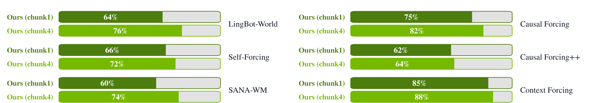
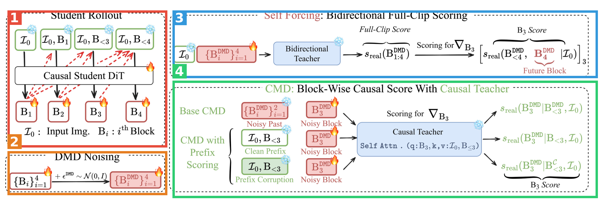
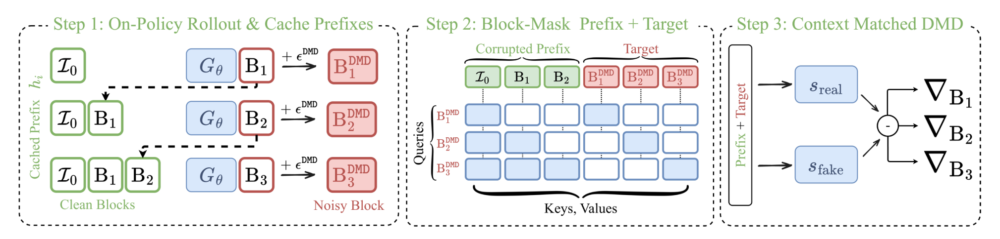
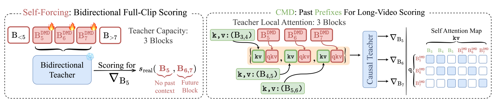
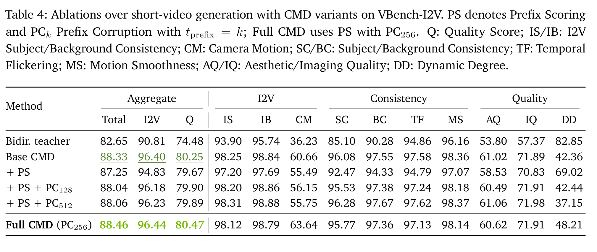

# Context-Matched Distillation: Teacher Causality for Autoregressive Video Distillation

| 项 | 内容 |
|---|---|
| 题目 | Context-Matched Distillation: Teacher Causality for Autoregressive Video Distillation（CMD） |
| 作者 | Hmrishav Bandyopadhyay, Xuanchi Ren, Zijian Huang, Jay Zhangjie Wu, Tianshi Cao, Ruilong Li, Bryan Chu, Sanja Fidler, Yi-Zhe Song, Zian Wang |
| 机构 | NVIDIA（Spatial Intelligence Lab）+ SketchX, CVSSP, University of Surrey |
| arXiv | [2608.13391](https://arxiv.org/abs/2608.13391)（cs.CV） |
| 发布日期 | 论文 v1 2026-08-13（未发现工作本体更早公开：项目主页与论文同期上线，无更早模型/demo 发布） |
| 代码 | **未放出**，项目主页标注 "Code soon"（截至 2026-08-17） |
| 项目主页 | https://hmrishavbandy.github.io/cmd-site/ |

**结构速览**（全文 18 页 = 正文 14 页 + 参考文献 4 页，**无附录**——这与训练细节大量缺失直接相关，见 5.4）：

- §1 Introduction：提出"教师-学生上下文错配"问题（双向教师给因果学生打分时会偷看未来帧/未来控制），给出 CMD 三件套的概览。
- §2 Related Work：三条线定位——块因果自回归视频生成、长视频生成、相机控制视频生成。
- §3 Preliminaries：DMD 蒸馏梯度、自回归视频的分块分解、Diffusion Forcing 记号。
- §4 Methodology：4.1 把错配形式化为"信息集不一致"；4.2 核心方法（因果教师预训练 → 学生初始化 → Prefix Scoring → Prefix Corruption → 块因果单次打分）；4.3 长视频扩展（有界前缀跨 clip 携带）；4.4 相机条件扩展（frame-relative ray map）。
- §5 Experiments：5.1 训练设置与基线；5.2 短视频/长视频/相机控制三线定量；5.3 消融；5.4 定性对比 + Gemini LLM 成对偏好评测。
- §6 Conclusion。

---

## 第1章 · 作者与实验室背景评估

### 作者背景表

| 作者 | 单位/身份 | 主方向 | 主页 |
|---|---|---|---|
| Hmrishav Bandyopadhyay（一作） | Surrey SketchX 三年级博士生，现 NVIDIA Research Scientist Intern，此前在 Stability AI 约一年做时间步蒸馏与视频生成 | sketch → 扩散蒸馏 → 自回归视频加速 | [个人主页](https://hmrishavbandy.github.io/) · [Scholar](https://scholar.google.com/citations?user=aBturOYAAAAJ) · [dblp](https://dblp.org/pid/270/8436.html) |
| Zian Wang（末位，推断为实际 mentor） | 博士毕业于 Toronto（导师 Fidler），曾任 NVIDIA 高级研究科学家兼 Research Manager，领导生成式世界模型/视频基础模型团队；**其主页现显示已离开 NVIDIA 加入创业公司**（论文标注反映工作完成时的隶属） | 逆渲染、生成式渲染、世界模型 | [个人主页](https://www.cs.toronto.edu/~zianwang/) |
| Sanja Fidler | Toronto 教授 + NVIDIA VP of AI Research，领导 Spatial Intelligence Lab（原 Toronto AI Lab） | 3D 视觉、仿真、生成模型/世界模型 | [个人主页](https://www.cs.utoronto.ca/~fidler/) |
| Yi-Zhe Song（Surrey 侧博导） | Surrey 教授，SketchX 实验室主任 | sketch 理解与生成；近年经学生扩展到生成效率方向 | [个人主页](https://personalpages.surrey.ac.uk/y.song/)（SketchX 独立实验室官网未找到） |

一作此前代表作（事实，据 dblp/主页）：2024 年 CVPR/ECCV 四篇 sketch 方向（博士主线）；2025 年起转向蒸馏与视频——NitroFusion（CVPR 2025，单步扩散蒸馏）、SD3.5-Flash（流模型蒸馏，Stability AI 时期）、NAG（NeurIPS 2025）、Block Cascading（块因果视频模型免训练加速）。**这不是他第一篇视频蒸馏方向工作**。

### 实验室主方向

NVIDIA Spatial Intelligence Lab（Fidler/Wang 团队）：**传统强方向**。近 5 年证据链——VideoLDM（CVPR 2023）、GEN3C（CVPR 2025 Highlight，精确相机控制视频生成）、DiffusionRenderer（CVPR 2025 Oral）、Cosmos-Transfer1（2025）、ChronoEdit（ICLR 2026）、Lyra 2.0（SIGGRAPH Asia 2026）、Gamma-World / OmniDreams / SANA-Video 2.0（2026）。本文完全在其主航道上；共同作者 Xuanchi Ren 即 GEN3C 一作。

Surrey SketchX：主方向是 sketch，不是视频生成；视频/蒸馏方向的产出集中在一作本人身上（NitroFusion、Block Cascading），属**新开方向**（个人层面延续、实验室层面无持续投入）。

### 水平预判

事实核对（逐条）：一作无相关积累？**否**（蒸馏×3 + 块因果视频加速在前）。导师主业不在此方向？**Surrey 侧部分是，NVIDIA 侧否**（实际指导重心在 NVIDIA：Wang/Fidler 都是该方向核心人物）。实验室无持续投入？**否**（见上）。单位无积累？**否**（Cosmos 系列头部机构）。

推断（依据上表）：典型的"博士生赴头部工业实验室实习、做在实验室主航道上"的工作，一作轨迹连贯（蒸馏 → 视频加速 → 视频蒸馏），**无水毕业信号**。注意一个背景变动：推断的 mentor Zian Wang 已于近期离开 NVIDIA。

⚠️ 本章内容未进入第3章盲审上下文。

---

## 第2章 · 论文类型判定

**结论：a+b 型组合创新 + 两处原创模块**。骨架是"DMD 蒸馏 + Self-Forcing 式 on-policy rollout"这条成熟流水线，创新点在于把教师换成因果教师（此前工作只用因果教师做初始化，本文推进到打分本身），并加上两个原创机制：Prefix Scoring（用学生真实生成的前缀做打分上下文）和 Prefix Corruption（对前缀加噪稳定训练）。

组件清单（全部为论文参考文献中真实引用、且在方法节实际承担流程环节的工作）：

| 组件 | 原论文 | 在本文中承担的角色 |
|---|---|---|
| DMD 分布匹配蒸馏 [47] | [One-step Diffusion with Distribution Matching Distillation](https://arxiv.org/abs/2311.18828)（CVPR 2024） | 蒸馏目标函数骨架：real/fake score 之差作为学生梯度（式 1/6） |
| Self-Forcing [15] | [Self Forcing: Bridging the Train-Test Gap in Autoregressive Video Diffusion](https://arxiv.org/abs/2506.08009) | 学生 on-policy rollout 的采样方式（backward simulation）；同时是被替换的"双向全片打分"对照 |
| Diffusion Forcing [3] | [Diffusion Forcing: Next-token Prediction Meets Full-Sequence Diffusion](https://arxiv.org/abs/2407.01392)（NeurIPS 2024） | 因果教师的预训练目标：历史帧独立加噪 + 逐帧去噪（式 4） |
| Cosmos-Predict2.5-2B [27] | [World Simulation with Video Foundation Models for Physical AI](https://arxiv.org/abs/2511.00062) | base model，教师由它微调而来 |
| ray map 相机条件 [32] | [LingBot-World: Advancing Open-Source World Models](https://arxiv.org/abs/2601.20540) | 相机嵌入的具体实现（式 8 的 φ） |
| frame-relative 相机参数化 [20] | [Cameras as Relative Positional Encoding](https://arxiv.org/abs/2507.10496)（NeurIPS 2025） | 采用相对（而非绝对）位姿表示的依据；PRoPE 同时是表 6 的对照条件 |
| DL3DV [22] | [DL3DV-10K](https://arxiv.org/abs/2312.16256)（CVPR 2024） | 相机控制分支的训练数据 |

原创部分：① 因果教师直接用于 DMD 打分（区别于 Causal Forcing [[57](https://arxiv.org/abs/2602.02214)] / Causal Forcing++ [[53](https://arxiv.org/abs/2605.15141)] 只用因果教师做学生初始化——§2 明确写 "Unlike these approaches"）；② Prefix Scoring + 块因果 mask 单次前向并行打全部块；③ Prefix Corruption（式 5）及长视频的逐帧 ρ_t 调度。

疑似借鉴（论文未引用）：未发现——方法节各环节均有对应引用。

---

## 第3章 · 双盲评审 + Rebuttal（全流程记录）

### 3.1 初审意见（由隔离上下文的盲审 agent 独立生成）

> **Summary**：本文提出 Context-Matched Distillation (CMD)，针对自回归视频生成的少步蒸馏中"教师-学生上下文错配"问题：现有 DMD 流水线用双向教师给完整视频片段打分，导致对第 t 帧的监督信号可以依赖学生生成该帧时不可见的未来帧与未来控制信号。CMD 先用 Diffusion Forcing 目标把双向预训练模型微调成因果多步教师，再用同一权重初始化少步学生；蒸馏时教师在因果信息边界内打分（base CMD），并进一步用学生实际 rollout 的缓存前缀作为打分上下文（Prefix Scoring），辅以对前缀加噪的稳定化手段（Prefix Corruption）。方法自然延伸到有界上下文长视频与帧相对相机条件控制。
>
> **Strengths**：
> - 问题定位清晰且有理论直觉：4.1 节把错配形式化为信息集不一致，比笼统的 "train-test gap" 更精确，对相机场景（未来位姿泄漏）的推演有说服力。
> - 同源因果框架的工程简洁性：同一因果教师贯穿教师训练、学生初始化和蒸馏，免去 ODE-matching / consistency distillation 初始化，也免去为新控制信号适配两套模型。
> - **控制变量的消融是全文最有力的证据**：表 4/5/6 在同一 base model、同一数据、同一协议下比较双向 vs 因果教师——短视频 Total +5.68（82.65→88.33），长视频 +3.39，相机 ray map 旋转误差 5.73/7.13→1.73/2.16。
> - 相机控制结果幅度大：Camera Motion 76.12 对比最强基线 42.54；chunk-4 在 Hard split 旋转误差 1.27（最好外部基线 2.05）。
> - 评测维度较全：短视频、长视频（501 帧）、相机控制三条线 + 消融 + LLM 成对偏好。
>
> **Weaknesses**：
> - **W1（外部对比存在系统性混淆，SOTA 主张不成立）**：表 1-3 中本文基于 Cosmos-Predict2.5-2B + 自有数据，基线基于 Wan 系模型、部分是"首帧替换"临时改装成 I2V——差距混合了 base model、数据、适配方式与蒸馏方法四种因素，无法归因于 CMD。摘要的 "state-of-the-art among autoregressive methods" 只被混淆变量下的比较支持。可靠证据只有表 4-6 的内部消融。
> - **W2（全文零统计处理）**：无误差棒、无置信区间、无检验。表 4 中 Full CMD 对 Base CMD 的 Total 提升仅 0.13；表 5 明确单 seed；图 6 的 60%/62% 胜率在 n=100 下 95% 置信区间约 [50%, 70%]，覆盖无差异假设。
> - **W3（Prefix Scoring 的贡献主张与消融证据不符）**：表 4 显示单加 Prefix Scoring 使 Total 从 88.33 **降**到 87.25，须叠加 t_prefix=256 的 Prefix Corruption 才回到 88.46——净收益 0.13 且对强度敏感。短视频上几乎全部收益来自因果教师本身，被重点宣传的机制无修正时有害、修正后收益微弱。
> - **W4（不可复现）**：无代码/数据可得性声明；"generated and curated videos" 的来源、规模、curation 标准未交代；学习率、batch size、学生步数、ρ 数值、ρ_t 调度形式全缺；无补充材料。
> - **W5（最直接的并行竞争工作未比较）**：Causal-RCM [54]（unified teacher-forcing/self-forcing 蒸馏配方）概念上是 Prefix Scoring 最近的邻居，但无机制讨论、无实验比较。
> - **W6（长视频"最优"主张对指标 trade-off 呈现有倾向性）**：表 2 中本文 SC/BC/TF 是全表最差，聚合分优势主要由 Dynamic Degree 拉动（67.50 vs Rolling Forcing 的 3.75），而 DD 不区分合理运动与漂移；缺少区分"内容进展"与"外观漂移"的专用度量。
>
> **评级：reject**（Science 家族水位）。理由：贡献量级上是活跃子领域内的增量改进（因果教师思路在 Causal Forcing/++ 已确立，本文的增量是延伸到打分本身 + 前缀机制）；证据上 SOTA 主张建立在不对齐比较上、全文无统计、核心宣传组件消融收益微弱。内部消融所示"因果打分优于双向打分"是扎实发现，补齐后适合 CV 旗舰会议。
>
> 评审范围声明：本文属 cs.CV 而非机器人学，scope 错配仅作备注未降级；图仅有图注无图像内容；无补充材料可查；净化文本未发现作者/机构/热度残留。

### 3.2 Rebuttal（主 agent 以作者方身份撰写）

**承认的批评清单（本文真正硬伤一览）**：

1. **W2 成立**：全文无误差棒/置信区间/显著性检验；表 5 单 seed；图 6 单组 60%/62% 胜率在噪声带内。
2. **W4 成立**：无代码/数据可得性声明，学习率、batch size、优化器、学生步数、硬件、时长全缺，ρ 只写 "set to a small value"，无补充材料。
3. **W5 成立**：Causal-RCM [54] 仅在引用串中一笔带过，机制差异与比较全缺。
4. **W3 短视频部分成立**：单加 Prefix Scoring 有害（88.33→87.25），须靠特定强度 Prefix Corruption 救回，净收益仅 0.13；正文框定过于正面。
5. **W6 一半成立**：未对称承认自身 SC/BC/TF 全表最差；缺区分进展与漂移的专用度量。
6. **W1 表述层面成立**：摘要 SOTA 措辞建立在不对齐的表 1-3 上，应降级限定。

**辩护的点**：

- **W1（核心辩护）**：评审要求的"同 base model 同数据复现一个双向教师配方作为受控对比"**已存在**——表 4/5/6 的 "Bidir. teacher" 行即 Self-Forcing 式全片双向打分在相同 Cosmos-Predict2.5-2B、相同数据、相同协议下的受控基线（5.3 节 (i) 明确定义）。受控设定下：短视频 Total 82.65→88.46、长视频 65.98→70.02、相机 ray map 旋转误差 5.73/7.13→1.37/2.56。"因果打分优于双向打分"的机制证据链是干净的；须修的是把表 1-3 重新定位为系统级参考，属表述层面缺陷。
- **W3**：接受"收窄主张"方向，补充证据幅度——前缀携带信息量大的场景收益明显：长视频（前缀跨 clip 边界携带真实历史）Total +0.65；相机控制（前缀承载已实现视角轨迹）Semantic +0.1377/+0.1369、Simple split 相机误差全面下降。短视频前缀与噪声目标信息高度重叠，收益小可解释。
- **W6**：5.2 节如实报告了自身全部原始分并指出高一致性基线的 DD 仅 0.0875/0.0375（近静止画面上一致性是平凡满分）；LLM 分层评测对长上下文基线 Context Forcing 胜率 85%/88%，远超 n=100 噪声带。

**对问题的回答**：Q1 是——"Bidir. teacher" 即受控基线，但与 Self-Forcing 原始配方的逐项差异清单未写（承认）；Q2 需新实验（承认）；Q3 生成数据的模型/规模/重叠检查论文未写（承认）；Q4 默认 t_prefix=256，ρ 换算与 ρ_t 形式未给（承认）；Q5 论文内无讨论（承认）；Q6 表 6 同数据同 base 消融证明相机改善非数据匹配可解释，外部基线数据可比性未分析（部分承认）。

### 3.3 审稿人二轮回复 + 最终评级

> **W1：部分撤回，核心维持。** "Bidir. teacher" 行确为受控基线，撤回"受控对比不存在"的隐含判断：机制层面证据链受控，且幅度（+5.68、旋转误差 5.73→1.37）大到即使无检验也难以归为噪声。但 W1 主体维持：头条 SOTA 主张降级后，论文实际贡献从"SOTA 系统"收缩为"一个受控验证过的蒸馏机制改进"，直接影响贡献量级判断。另外 "Bidir. teacher" 是"双向打分"的消融而非对某个已发表配方的忠实复现（对抗辅助损失等差异未记录），作为外部对比替代品仍有折扣。
>
> **W2：维持（作者承认）。** 补充：作者 W1 辩护依赖的消融同样受 W2 影响——大幅度差距可信，小幅度差距（Prefix Scoring 的全部净收益）在统计补齐前不可信。
>
> **W3：部分撤回，部分维持。** 长视频与相机场景的解释与方法动机自洽，撤回该部分"主张与证据不符"的指控。维持：表 5 单 seed 单点；表 6 **Hard split 上 Base CMD 的旋转误差反而更低（2.16 vs 2.56），作者辩护只提 Simple split，该不一致仍未解释**。
>
> **W6：部分撤回，部分维持。** 撤回"呈现倾向性"的程度指控（原始分如实报告、85%/88% 超噪声带）。维持：LLM 分层规则将运动达成置于一致性之前，结构上有利于高 DD 模型，不是对"漂移 vs 进展"的独立检验。
>
> **W4、W5：维持（作者全部承认）。**
>
> **双方确认的缺陷**：① 零统计处理；② 不可复现（数据来源/超参/材料全缺）；③ Causal-RCM 无讨论无比较；④ Prefix Scoring 短视频中性偏负、正文框定过正面；⑤ SOTA 表述须降级；⑥ 长视频缺漂移专用度量；⑦ "Bidir. teacher" 与 Self-Forcing 原配方差异未记录。
>
> **最终评级：reject（维持）。** rebuttal 澄清了"因果打分优于双向打分"有受控且幅度可观的证据——这是论文真实且干净的贡献；但不改变两个决定性判断：贡献量级（子领域机制改进，辐射范围有限）与证据完备性（统计与复现是硬性前置条件，须新实验新材料，超出 rebuttal 可修复范围）。此判断不妨碍本文补齐后成为 CV 旗舰会议的合格投稿。

---

## 第4章 · 大白话：这篇文章在做什么

**场景**：交互式视频生成——给一张图，模型像玩游戏一样一帧接一帧往下"播"，你还能随时按 WASD 控制镜头往哪走。这要求两件事：出帧要快（所以要把几十步去噪蒸馏成几步），控制要跟手（模型只能看已经发生的画面和指令，不能"预知"你接下来要按什么）。

**之前的方法**：蒸馏时让一个"老师模型"给学生生成的视频打分。问题是老师是双向的——它一次看完整段视频再打分，所以给第 3 秒画面打的分里掺了第 5 秒的画面和第 5 秒的镜头指令。学生上岗后根本看不到未来，却在按"能看到未来的标准"被训练，老师教的和学生考的不是一张卷子。

**本论文的方法**：把老师也改成"只能看过去"的因果老师，打分时严格不看未来帧、不看未来指令；更进一步，打分时喂给老师的历史就是学生当时真实生成的那段画面（Prefix Scoring），再对这段历史加点噪声防止训练初期学生画得太烂把老师带偏（Prefix Corruption）。结果：画质更好，镜头控制误差大幅下降。

**图内文字中文翻译**（按阅读顺序）：左侧竖排两组行标——上半部分"Long Video Generation"= 长视频生成：三行示例（前两行 Chunk AR = 按多帧块自回归的模型，第三行 Frame AR = 逐帧自回归的模型），列标 0s → 8s → 16s → 24s → 32s，展示从单张输入图（0s）出发滚 32 秒不崩、场景持续推进（夜林、雨中钟楼街道、红岩峡谷）。下半部分"Precise Camera Control"= 精确相机控制：两行（Chunk AR 与 Frame AR），列标 0s → 1.25s → 2.5s → 3.75s → 5s；画面角落的 W/A/S/D 键位图标是当时下发的平移指令，右下圆盘是视线方向（look）控制。Frame AR 每个 latent 帧后就能接收新指令，Chunk AR 只在块边界更新指令。

自查：不做视频生成的人应该能看懂——"老师改卷不许偷看后面的题"就是全文核心。

---

## 第5章 · 实验

> 说明：本文是视频生成/世界模型论文，无机器人仿真与真机实验；5.1 按"每个 benchmark 一小节"组织。

### 5.1 Benchmark 实验

#### 5.1.1 VBench-I2V（短视频质量）

- **场景一句话**：给一张图 + 一句提示词，生成约 5 秒短视频，官方脚本从主体一致性、背景一致性、运动幅度等十几个维度自动打分。
- **条件**：每个 image-prompt 对固定 5 个种子（§5.2）；本文模型 = Cosmos-Predict2.5-2B 微调 + 自有数据（Wan 生成 + 人工筛选的视频，字幕由 Qwen3-VL-8B-Instruct 生成，§5.1）；对比 8 个自回归基线，注意多数基线是 T2V 模型"首帧替换"改装成 I2V（§5.1 Baselines 段，盲审 W1 指出的混淆来源）。
- **指标定义**：Total/I2V/Q 为官方归一化聚合分；CM = Camera Motion（相机运动跟随）；DD = Dynamic Degree（画面动起来的程度）；其余为原始分量。

| 方法 | 块大小 | Total | I2V | Q | IS | IB | CM | SC | BC | TF | MS | AQ | IQ | DD |
|---|---|---|---|---|---|---|---|---|---|---|---|---|---|---|
| CausVid | 3 | 80.77 | 84.06 | 77.48 | 89.05 | 90.99 | 15.57 | 93.45 | 95.35 | 98.14 | 98.67 | **63.13** | 70.43 | 20.57 |
| Self-Forcing | 3 | 85.69 | 92.02 | 79.35 | 95.74 | 96.76 | 26.13 | **96.82** | 96.80 | 98.04 | 99.11 | 62.29 | **72.31** | 24.15 |
| LongLive | 3 | 84.93 | 91.22 | 78.64 | 95.03 | 96.22 | 24.90 | 96.72 | 96.97 | 98.43 | **99.24** | 62.76 | 72.04 | 14.80 |
| Rolling Forcing | 3 | 85.54 | 92.61 | 78.46 | 96.24 | 97.28 | 25.69 | 96.37 | 96.89 | 98.04 | 98.90 | 62.36 | 72.01 | 17.07 |
| Context Forcing | 3 | 85.41 | 90.66 | 80.16 | 94.47 | 95.63 | 27.76 | 94.75 | 95.90 | 97.80 | 98.74 | 62.79 | 72.11 | 42.28 |
| LingBot-World | 3 | 86.86 | 93.76 | 79.96 | 96.00 | 98.04 | 42.54 | 91.96 | 95.16 | 96.06 | 97.37 | 62.77 | 68.96 | 64.39 |
| Causal Forcing | 1 | 87.63 | 93.70 | **81.56** | 96.57 | 98.04 | 34.47 | 91.22 | 93.50 | 94.74 | 98.15 | 59.42 | 70.13 | **87.15** |
| Causal Forcing++ | 1 | 87.35 | 95.36 | 79.35 | **98.63** | **99.35** | 27.34 | 96.35 | **97.41** | **98.70** | 99.19 | 62.82 | 71.48 | 23.66 |
| **Ours** | 1 | 88.46 | 96.44 | 80.47 | 98.12 | 98.79 | 63.64 | 95.77 | 97.36 | 97.13 | 98.14 | 60.62 | 71.91 | 48.21 |
| **Ours** | 4 | **88.47** | **96.54** | 80.40 | 97.64 | 98.44 | **76.12** | 94.77 | 96.72 | 96.71 | 97.99 | 60.82 | 71.51 | 52.93 |

（表头汉化说明：IS/IB = 相对输入图的主体/背景一致性；SC/BC = 视频内主体/背景一致性；TF = 时序闪烁；MS = 运动平滑；AQ/IQ = 美学/成像质量。每列最优加粗。）

最亮眼的是 **Camera Motion 76.12 vs 最强基线 42.54（+33.58）**；Total/I2V 也居首，但 Q 列最优其实是 Causal Forcing（81.56）。

LLM 成对偏好（Gemini 3.1 Pro Preview 盲测强制二选一，每对 100 组）：

图内文字翻译：左列自上而下——对 LingBot-World 胜率 64%（chunk1）/76%（chunk4）；对 Self-Forcing 66%/72%；对 SANA-WM 60%/74%。右列——对 Causal Forcing 75%/82%；对 Causal Forcing++ 62%/64%；对 Context Forcing 85%/88%。（盲审 W2 提醒：60%±，n=100 时置信区间覆盖 50%，单组不显著。）

#### 5.1.2 SANA-WM Simple split（长视频质量）

- **场景一句话**：同一张图不给相机输入，连续滚 501 帧（16fps，约 30 秒），看画面会不会糊掉、僵住或崩坏。
- **条件**：80 张图 + 原始提示词，480×832；消融部分（表 5）明确同 seed 单次评测。
- **场景图**：论文 Figure 5（上半部分为长视频对比）：

图内文字翻译：上半"Long Video Generation"= 长视频对比，四行分别是 Rolling Forcing、LongLive、LingBot-World、Ours，列标 0s→32s：本文模型在穿越不同室内空间时保持了第一人称载具结构，基线要么场景几乎不推进、要么载具结构断裂。下半"Short Video Generation"= 短视频对比（0s→5s），四行为 Causal Forcing、Causal Forcing++、LingBot-World、Ours：马沿屋顶走向圆顶，基线要么马消失、要么位置突变、要么画面基本不动。

| 方法 | 块大小 | Q | S | Total | SC | BC | TF | MS | DD | AQ | IQ |
|---|---|---|---|---|---|---|---|---|---|---|---|
| LingBot-World | 3 | 80.23 | 24.20 | 69.03 | 91.00 | 93.82 | 97.35 | 98.11 | 51.25 | 60.20 | 67.37 |
| LongLive | 3 | 80.04 | 23.86 | 68.80 | 95.43 | 95.08 | 98.38 | **99.16** | 8.75 | 61.20 | 73.07 |
| Rolling Forcing | 3 | 80.04 | 23.66 | 68.77 | **96.09** | **95.41** | **98.60** | 99.13 | 3.75 | 61.63 | 73.48 |
| Context Forcing | 3 | 80.72 | 23.38 | 69.25 | 91.72 | 93.45 | 98.06 | 98.95 | 32.50 | **62.03** | 72.92 |
| **Ours** | 1 | **81.39** | **24.51** | **70.02** | 88.59 | 91.93 | 96.24 | 98.13 | 67.50 | 60.70 | **74.58** |
| **Ours** | 4 | 80.84 | 24.50 | 69.57 | 86.97 | 91.34 | 95.83 | 97.84 | **77.50** | 60.50 | 71.02 |

注意 trade-off（盲审 W6）：本文聚合分最高，但 SC/BC/TF 是全表最差；高一致性基线 LongLive/Rolling Forcing 的 DD 只有 8.75/3.75——画面近乎静止时一致性指标是"平凡满分"。聚合分优势主要由"画面真的在动"（DD 67.50/77.50）拉动。

#### 5.1.3 SANA-WM Simple/Hard split（相机控制）

- **场景一句话**：按给定相机轨迹（平移 + 视线方向）生成视频，然后用位姿估计器 π³ 从生成的视频里反推实际相机轨迹，与指令轨迹做 Umeyama Sim(3) 对齐后量误差——旋转误差（度）、平移误差、CamMC（相机矩阵 Frobenius 距离），全部越低越好。
- **条件**：每场景 8 个 125 帧窗口拼接，每 split 640 个视频；本文相机分支用 DL3DV 训练。

| 方法 | 块 | Split | Quality↑ | Semantic↑ | Total↑ | Rot.↓ | Trans.↓ | CamMC↓ |
|---|---|---|---|---|---|---|---|---|
| HY-WorldPlay | 4 | Simple | 0.8178 | 0.1786 | 0.6900 | 2.5840 | 0.1639 | 0.1866 |
| | | Hard | 0.8215 | 0.1740 | 0.6920 | 6.5991 | 0.2483 | 0.3225 |
| LingBot-World | 3 | Simple | 0.8173 | 0.1841 | 0.6906 | 4.7122 | 0.1562 | 0.2194 |
| | | Hard | 0.8144 | 0.1792 | 0.6873 | 6.2291 | 0.1774 | 0.2618 |
| SANA-WM | 3 | Simple | **0.8355** | 0.1061 | 0.6896 | 1.2104 | 0.1316 | 0.1416 |
| | | Hard | **0.8263** | 0.1073 | 0.6825 | 2.0453 | 0.1822 | 0.1982 |
| minWM | 4 | Simple | 0.8102 | 0.1826 | 0.6847 | 2.8637 | 0.2174 | 0.2388 |
| | | Hard | 0.8167 | 0.1775 | 0.6889 | 6.9128 | 0.2811 | 0.3538 |
| **Ours** | 1 | Simple | 0.8260 | **0.2413** | **0.7091** | 1.3675 | 0.1195 | 0.1312 |
| | | Hard | 0.8184 | **0.2423** | **0.7032** | 2.5607 | 0.1447 | 0.1698 |
| **Ours** | 4 | Simple | 0.8195 | 0.1810 | 0.6918 | **0.8601** | **0.0981** | **0.1027** |
| | | Hard | 0.8139 | 0.1751 | 0.6862 | **1.2718** | **0.1109** | **0.1196** |

chunk-4 拿下全部相机误差最优（Hard 旋转 1.27°，约为多数基线的 1/5）；chunk-1 拿下 Semantic/Total 最优；Quality 最优是 SANA-WM 自己。

### 5.2 真机实验

**本文无真机实验**（视频生成论文，不涉及机器人硬件）。项目主页：[hmrishavbandy.github.io/cmd-site](https://hmrishavbandy.github.io/cmd-site/)（来自论文首页，目前仅有 arXiv 链接与 "Code soon"）。

### 5.3 为什么选这些实验

**共同特性**：三条评测线全都是"控制/上下文信息随时间到来、历史不可回改"的在线生成场景——长视频（501 帧远超训练窗口，历史必须靠有界前缀携带）、相机控制（位姿指令逐帧/逐块下发）、以及 VBench 里权重不小的 Camera Motion 子指标。

**方法的哪个设计恰好吃这个特性**：CMD 消除的正是"教师偷看未来"——未来帧和未来相机指令的泄漏。所以收益最大的地方精确出现在：① Camera Motion 76.12 vs 42.54（+33.58，表 1 全表最大单项差距）；② 相机误差 chunk-4 Hard 旋转 1.27 vs 基线 2.05-6.91（表 3）；③ 消融里双向→因果教师在相机 ray map 条件下把旋转误差从 5.73/7.13 砍到 1.73/2.16（表 6）。反过来，在不吃"未来信息隔离"的纯画质维度上本文并不占优：Q 列最优是 Causal Forcing（81.56 vs 80.47，表 1），长视频一致性三项全表最差（表 2）。作者选的正是自己方法优势最能体现的评测组合。

**该测但没测的（缺席即信号）**：① **速度/延迟**——全文动机是 "low-latency interactive generation"，却没有任何 FPS、单帧延迟或吞吐对比，几步学生到底几步都没写；② **Causal-RCM [54]**——概念上最近的竞争配方，未比（盲审 W5）；③ 相同 base model 上复现任一外部蒸馏配方的对照（只有自建的 "Bidir. teacher" 消融行）；④ 动作条件（离散 action）世界模型评测——基线 HY-WorldPlay/LingBot-World 都支持，本文只测了相机。

### 5.4 复现可能性（硬核查，2026-08-17）

逐项核查（√ = 找到附出处，✗ = 未找到）：

- **代码**：✗ 项目主页仅一个 arXiv 链接 + **"Code soon"**；GitHub 搜 "context-matched distillation" 0 仓库；一作与 nv-tlabs 名下均无相关仓库；正文连 "code will be released" 都没写。
- **ckpt（逐场景）**：短视频 chunk-1 学生 ✗ / chunk-4 学生 ✗ / 长视频模型 ✗ / 相机控制模型 ✗ / 因果 teacher ✗（HuggingFace 搜索 0 结果）。√ 仅 base model Cosmos-Predict2.5-2B 公开（github.com/nvidia-cosmos/cosmos-predict2.5）。
- **数据**：√ 构成写明（§5.1：Wan 生成 + 人工筛选视频；相机分支 DL3DV；字幕 Qwen3-VL-8B-Instruct）；✗ 生成/筛选后数据集未公开、curation 标准未提；✗ 字幕 pipeline 未公开；√ DL3DV 本身公开，✗ 但所用子集/切分未说明。
- **训练细节**：√ 仅有训练迭代数（§5.1：teacher ~8K；短视频学生 ~3.2K/5.1K；长视频续训 ~0.8K/0.9K；相机 teacher ~11K/8K、学生 ~3K/0.9K）。以下全 ✗：学习率、batch size、优化器、GPU 型号/数量、训练时长、CFG/guidance、**学生采样步数**（全文只说 few-step）、长视频窗口 M 与 rollout 数 R 的数值、Prefix Corruption 的 ρ 数值（正文只写 "set to a small value by default"，§4.2）及 ρ_t 调度形式（§4.3 仅定性）。
- **评测**：√ VBench-I2V 公开（github.com/Vchitect/VBench），√ SANA-WM benchmark 公开（NVlabs Sana 文档含 80 场景固定 release）；✗ 5 个固定种子值、作者侧评测脚本、π³+Umeyama 相机误差实现、Gemini 偏好评测脚本均未公开。

**结论：难以复现**（发布 4 天，"Code soon" 状态）。缺失项：① 全部代码；② 全部 5 类 ckpt；③ 训练数据集与 curation 标准；④ 字幕 pipeline；⑤ 学习率/batch size/优化器；⑥ 硬件与时长；⑦ CFG 设置；⑧ 学生步数；⑨ ρ 数值与 ρ_t 调度；⑩ 窗口 M 与 rollout 数 R；⑪ 评测种子与脚本；⑫ 相机误差实现；⑬ LLM 评测脚本。若后续代码放出可升档为"需自行补齐细节"；即便如此，训练数据是内部生成+人工筛选，无法精确对齐。

---

## 第6章 · 方法拆解

方法总览图（Figure 2），彩色框标注版：

🟥 **块1 · 学生自回归 rollout**（图左上）——来源：[Self-Forcing](https://arxiv.org/abs/2506.08009) 的 on-policy backward simulation；学生权重直接从因果教师初始化（本文卖点：不需要 [CausVid](https://arxiv.org/abs/2412.07772) 式 ODE-matching 或 [Causal Forcing++](https://arxiv.org/abs/2605.15141) 式一致性蒸馏做初始化）。**进**：输入图 I₀ + 逐块控制信号（如相机 ray map）；**出**：按块生成的干净 latent 块 B₁…B₄，以及每一块生成时用过的**缓存前缀**（图中绿色 "I₀, B<ᵢ" 序列，冻结❄标记表示打分时不回传梯度）。训练与部署用同一因果结构：逐块去噪、KV cache 复用、历史 detach。

🟧 **块2 · DMD 加噪**（图左下）——来源：[DMD](https://arxiv.org/abs/2311.18828) 标准操作。**进**：块1 产出的干净块 {Bᵢ}；**出**：按随机 timestep τ 加高斯噪声的目标块 {Bᵢᴰᴹᴰ}，交给打分方。

🟦 **块3 · Self-Forcing 双向全片打分（被替换的老路，对照用）**（图右上）——来源：[Self-Forcing](https://arxiv.org/abs/2506.08009)/[CausVid](https://arxiv.org/abs/2412.07772) 的 DMD 配方。**进**：I₀ + 全部加噪块；**出**：整段视频的联合 score，其中第 3 块的分数里包含第 4 块（Future Block，图中红色高亮）的信息——这就是全文要消灭的"教师偷看未来"。此块在 CMD 中不存在，仅作对照（消融表 4/5/6 的 "Bidir. teacher" 行）。

🟩 **块4 · CMD 因果教师打分**（图右下）——**作者原创**（教师本体用 [Diffusion Forcing](https://arxiv.org/abs/2407.01392) 目标在 [Cosmos-Predict2.5-2B](https://arxiv.org/abs/2511.00062) 上预训练：历史帧独立加噪、逐帧去噪，式 4）。**进**：加噪目标块 Bᵢᴰᴹᴰ + 打分上下文 + 控制信号 c≤ᵢ；**出**：s_real 与 s_fake 之差 → 学生的 DMD 梯度（式 6）。图中列出三档上下文：Base CMD 用前面的加噪目标当上下文（Noisy Past）；Prefix Scoring 换成块1 缓存的**干净真实前缀**（Clean Prefix）；Prefix Corruption 再给前缀加一层小噪声 C_ρ（式 5，绿色底纹）防止训练初期学生的烂前缀把教师带偏。块因果 attention mask（q: B₃, k,v: I₀,B≤₃）让所有块的分数在**一次教师前向**里并行算完。训练时：教师冻结，fake-score 网络在线更新；长视频时前缀跨 clip 边界携带、ρ 换成逐帧调度 ρ_t（早期帧弱噪、后期帧强噪）；相机场景把绝对位姿转成 frame-relative 增量 ΔEₜ 再投成 ray map（式 7/8，表示法来自 [LingBot-World](https://arxiv.org/abs/2601.20540)，相对参数化依据 [PRoPE](https://arxiv.org/abs/2507.10496)）。部署时：**教师与 fake-score 网络全部丢弃**，只剩块1 的少步学生在跑。

**接口自查（首尾相接）**：块1 出干净块与缓存前缀 → 块2 把干净块加噪成目标 → 块4 拿"加噪目标 + 损坏前缀 + 控制"打分 → 分差梯度流回块1 的学生参数。闭环成立；块3 是被剪掉的旁路。

辅助图两张：块4 的三步实现细节（Figure 3：① 学生 rollout 并缓存前缀 → ② 损坏前缀与加噪目标在块因果 mask 下打包 → ③ real/fake 分差做 CMD 更新）：

长视频版本（Figure 4：左 = 双向教师逐 clip 打分——没有 clip 前历史、还能看 clip 内未来块；右 = CMD 用滑动的 k,v 有界前缀在一次因果前向里给所有块打分）：

---

## 第7章 · 消融

### 短视频消融（表 4，VBench-I2V）

| 配置（行名重述成人话） | Total | I2V | Q | CM | DD | 一句话 takeaway |
|---|---|---|---|---|---|---|
| 老师用双向的（Self-Forcing 式全片打分） | 82.65 | 90.81 | 74.48 | 36.23 | 82.85 | 起点：老配方 |
| 老师换成因果的，但上下文用前面的加噪目标（Base CMD） | 88.33 | 96.40 | 80.25 | 60.66 | 42.36 | **+5.68 Total，全文最大单项**——收益主体是"教师因果化"本身 |
| 再把上下文换成学生真实前缀，但不加噪（+PS） | 87.25 | 94.83 | 79.67 | 55.49 | 69.02 | **反而降 1.08**：训练初期烂前缀把教师带偏，干净前缀单用有害 |
| 前缀加弱噪（t_prefix=128） | 88.04 | 96.18 | 79.90 | 56.15 | 42.44 | 噪声太弱救不全 |
| 前缀加强噪（t_prefix=512） | 88.06 | 96.23 | 79.89 | 55.75 | 37.15 | 噪声太强抹掉了前缀信息 |
| **Full CMD（PS + t_prefix=256）** | **88.46** | **96.44** | **80.47** | **63.64** | 48.21 | 对 corruption 强度敏感；PS 链路净收益仅 +0.13（盲审确认在噪声带内） |

### 长视频消融（表 5，SANA-WM，同 seed 单次）

| 配置 | Q | S | Total | takeaway |
|---|---|---|---|---|
| 双向教师逐 clip 独立打分（丢掉 clip 前的历史，还允许看 clip 内未来帧） | 76.49 | 23.93 | 65.98 | 起点 |
| 因果教师，但无跨 clip 前缀（Base CMD） | 80.75 | 23.86 | 69.37 | 因果化 +3.39 Total |
| 因果教师 + 学生的有界跨 clip 前缀（Full CMD） | **81.39** | **24.51** | **70.02** | 前缀再 +0.65——长视频里前缀真正携带了跨窗口信息，PS 在这里有实质作用 |

### 相机控制消融（表 6，chunk-1）

| 配置 | Split | Total↑ | Rot.↓ | Trans.↓ | CamMC↓ | takeaway |
|---|---|---|---|---|---|---|
| 双向教师 + PRoPE 相机编码 | Simple / Hard | 0.5662 / 0.5651 | 11.24 / 12.42 | 0.541 / 0.548 | 0.673 / 0.689 | 双向+PRoPE 是灾难级起点 |
| Full CMD + PRoPE | Simple / Hard | 0.6567 / 0.6538 | 1.25 / 3.24 | 0.404 / 0.431 | 0.408 / 0.454 | 换编码之前，光因果化就把旋转误差砍了约 4-9 倍 |
| 双向教师 + ray map | Simple / Hard | 0.6774 / 0.6712 | 5.73 / 7.13 | 0.286 / 0.303 | 0.333 / 0.373 | ray map 本身优于 PRoPE |
| Base CMD + ray map | Simple / Hard | 0.6778 / 0.6713 | 1.73 / **2.16** | 0.126 / **0.126** | 0.142 / **0.147** | 因果化再砍 3 倍；**注意 Hard split 上它的相机误差比 Full CMD 还低**（盲审二轮点名未解释） |
| **Full CMD + ray map** | Simple / Hard | **0.7091** / **0.7032** | **1.37** / 2.56 | **0.120** / 0.145 | **0.131** / 0.170 | 前缀主要拉 Semantic（+0.138/+0.137），Simple 误差全面最低 |

**总结**：贡献大头是"教师因果化"（短视频 +5.68、长视频 +3.39、相机误差砍 3-9 倍）；被论文重点宣传的 Prefix Scoring 只有配合恰好强度的 Prefix Corruption 才不帮倒忙，其净收益在短视频上仅 +0.13（噪声带内）、在长视频/相机上有实质但中等的收益。本文消融覆盖充分（三条线各一张表），但全部无方差刻画，且表 5 为单 seed——这正是盲审 W2 的核心批评。

---

*精读文档由 /read 流水线生成（paper-scout 自动运行，2026-08-17）；盲审由隔离上下文的 blind-reviewer agent 独立完成，主 agent 未软化其结论。*
