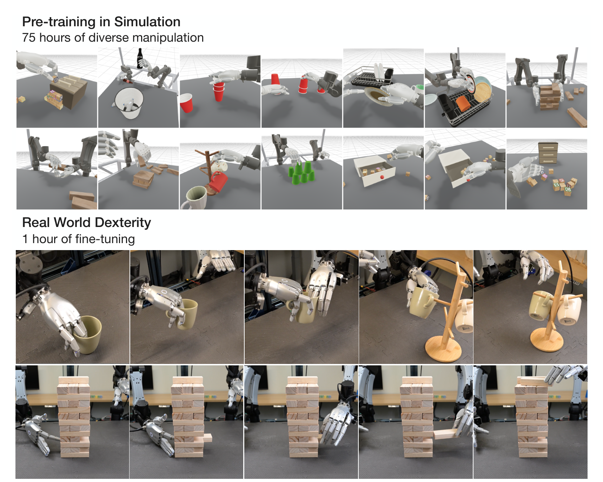
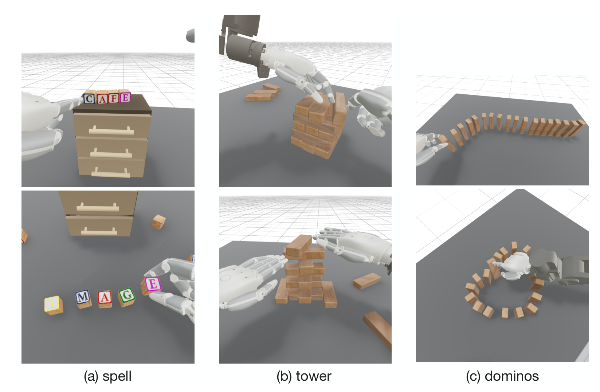
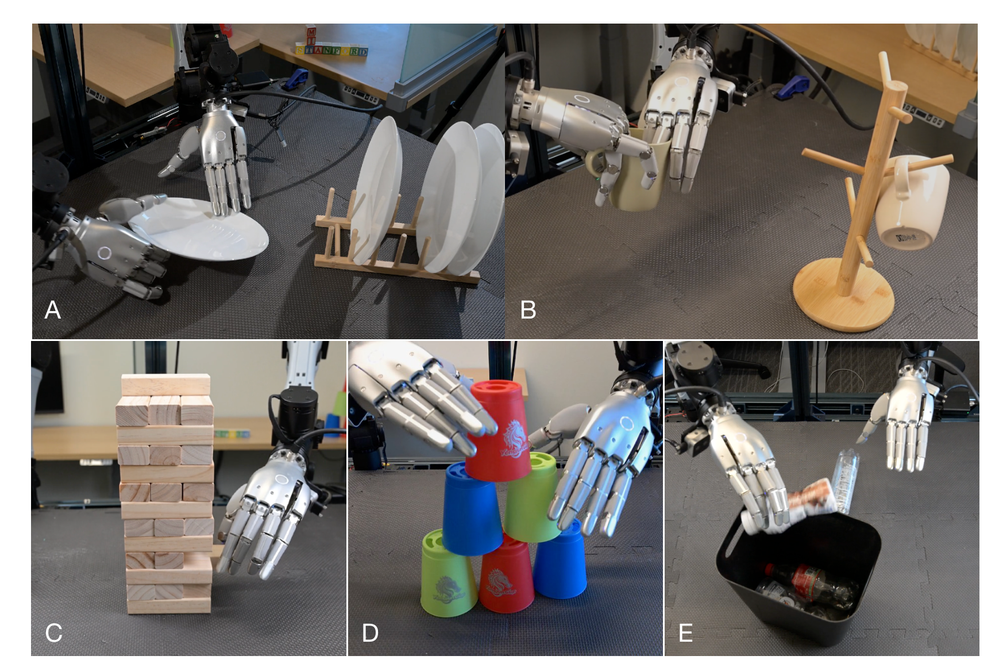
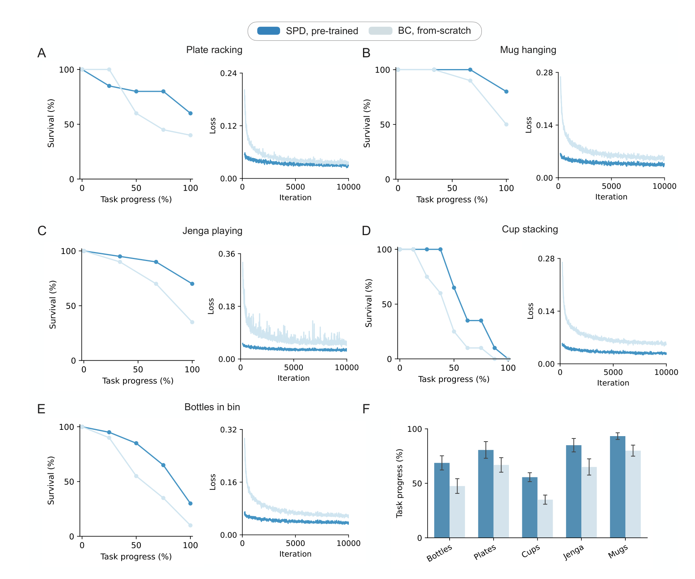
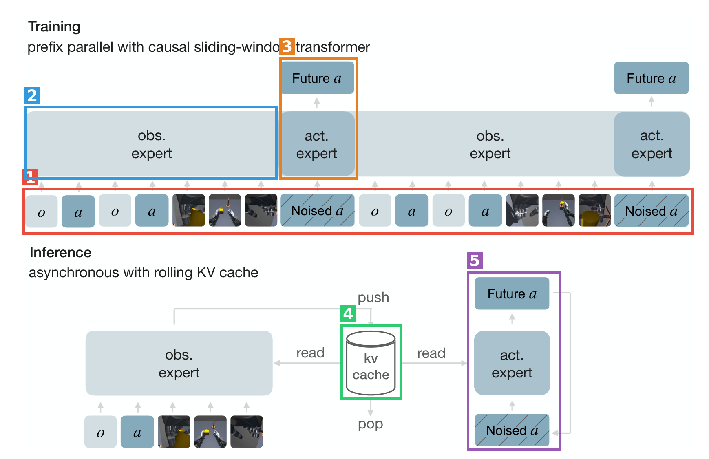
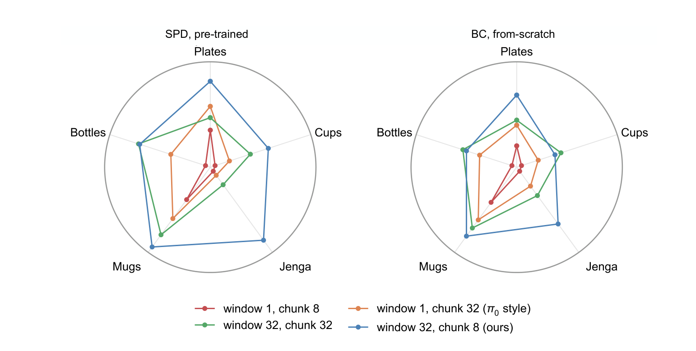

# Pre-training Visual Dexterity in Simulation（SPD）精读

## 元信息

| 项 | 内容 |
|---|---|
| 题目 | Pre-training Visual Dexterity in Simulation |
| 作者 | Sarthak Kamat\*, Adam Rashid\*（共同一作）, Satvik Sharma, Aseem Doriwala, Chelsea Finn, Phillip Isola, C. Karen Liu |
| 单位 | Stanford、MIT、Scale AI |
| arXiv | <https://arxiv.org/abs/2608.15917>（cs.RO） |
| 发布日期 | 论文 v1 2026-08-16（arXiv 首页时间戳；未发现工作本体更早公开的证据，见第1章调研） |
| 项目主页 | <https://spd.bot>（论文首页署名下方） |
| 代码/数据 | 论文声称开源 spd-75h 数据集、spd-vr 软件、六个调好接触参数的场景（p.2）；实际开源情况核查见 5.4 节 |

**结构速览**：

- §1 Introduction：灵巧手数据饥荒问题 + SPD 框架一句话（VR 仿真遥操作采集预训练数据）。
- §2 Related Work：三条线——机器人策略预训练、从人类数据学习（手持设备/人手视频）、仿真+灵巧手（RL sim2real / VR 遥操作）。
- §3 Method：3.1 VR 采数据（MuJoCo + Quest 头显，六个场景 75 小时）；3.2 真机采数据（YAM Pro 双臂 + Sharpa Wave 灵巧手 + Manus 手套）；3.3 策略架构（因果滑窗 diffusion transformer，流匹配目标，全 chunk 并行去噪）。
- §4 Experiments：4.1 预训练 vs 从零训练（5 个真机任务，各 20 试次）；4.2 消融（历史窗口 w × 动作 chunk c 的 2×2 扫描）。
- §5 Conclusion + Limitations（仿真物理失真风险、场景多样性有限、评测物体与仿真相近）+ Future work（混合数据源、扩规模、RL 初始化）。
- 附录：A.1 spd-vr 系统细节；A.2 spd-75h 数据集统计（Table 2）；A.3 spd-teleop 真机遥操作系统；A.4 评测协议与打分 rubric（Table 3）；A.5 模型架构细节（222M 参数）；A.6 训练超参（Table 4/5）。

---

## 第1章 · 作者与实验室背景评估

（联网调研于 2026-08-18；全部事实附来源，找不到的如实标注）

### 作者背景表

| 作者 | 单位/身份 | 主页 | 主方向与此前记录（事实） |
|---|---|---|---|
| Sarthak Kamat（共同一作） | Stanford CS 二年级 PhD，导师 C. Karen Liu，NSF GRFP | [个人主页](https://www.sartk.com/) · [Google Scholar](https://scholar.google.com/citations?user=qdtMGvgAAAAJ) | 公开发表仅 2 篇：本文 + 人形机器人越障行走（[arXiv 2410.03654](https://arxiv.org/abs/2410.03654)，Berkeley 本科期间与 Radosavovic/Darrell/Malik 合作）。**本文是其首篇灵巧手/操作方向工作** |
| Adam Rashid（共同一作） | MIT PhD，导师 Phillip Isola，NSF GRFP（年级未找到） | [个人主页](https://adamrashid96.github.io/) · [Google Scholar](https://scholar.google.com/citations?user=M8yGg9EAAAAJ) | LucidXR（CoRL 2025 共同一作，XR 仿真遥操作采集灵巧操作数据——**与本文思路直接同源的方法学前身**）、LERF-TOGO（CoRL 2023 Oral/Best Paper Finalist）、ABC（[arXiv 2606.27375](https://arxiv.org/abs/2606.27375)）作者之一。**不是首次做灵巧操作** |
| Satvik Sharma | Stanford 二年级 PhD，co-advised by Jeannette Bohg & Dorsa Sadigh（不在 Finn/Liu 组） | [个人主页](https://satvik1701.github.io/) | LERF-TOGO 共同一作、Fleet-DAgger（CoRL 2022 Oral）；方向为样本高效机器人感知 |
| Aseem Doriwala | Scale AI robotics 工程师（ex-Nuro，Berkeley 本科） | [个人主页](https://www.aseemrd.com/) | 参与 Scale 的 EgoVerse（第一人称人类数据训练 Physical AI）；对应论文致谢"感谢 Scale AI 采集 spd-75h" |
| Chelsea Finn | Stanford 教授，IRIS 实验室；Physical Intelligence 联合创始人 | [主页](https://ai.stanford.edu/~cbfinn/) | ALOHA Unleashed（CoRL 2024）、π0（2024）、HumanPlus（CoRL 2024）、Mobile ALOHA/DROID——大规模模仿学习 + 灵巧操作是其核心议程 |
| Phillip Isola | MIT EECS 副教授 | [主页](https://web.mit.edu/phillipi/) | 主业视觉表征学习（pix2pix/CycleGAN/对比学习）；2025–2026 经由学生密集切入机器人：LucidXR（CoRL 2025）→ ABC（2026-06）→ 本文 |
| C. Karen Liu | Stanford 教授，The Movement Lab | [主页](https://cs.stanford.edu/people/karenliu/Home.html) · [实验室](https://tml.stanford.edu) | 主业人体运动/物理仿真/图形学；2024 起有"人体数据→灵巧手"支线（DexCap 2024、Object-centric Dexterous Manipulation 2024） |

### 实验室主方向判定

**"仿真 VR 遥操作作为灵巧手预训练数据源"这个具体命题，对三个组都是新开方向**（直接积累约 1–2 年），但外围积累雄厚，属于头部实验室合流而非孤军新试水：

- Finn 组：大规模真机模仿学习 + 灵巧操作是**传统强方向**（ALOHA Unleashed、π0、DROID），但此前走的是真机遥操作数据路线，不是仿真路线。
- Isola 组：**新开方向**，且是本文最直接的谱系来源——LucidXR（2025，Adam Rashid 共同一作，XR 仿真数据引擎）→ ABC（2026-06，开源大规模 BC）→ 本文（2026-08），一年内三连发。
- Liu 组：主业图形学/人体运动，2024 年起的"低成本采集→灵巧手"支线（DexCap）是**次新方向**，本文由其学生 Kamat 执行，是该支线的自然延伸。

### 水平预判（推断，注明依据）

- **不是水毕业信号**：逐条核对——一作 Kamat 虽无灵巧手积累但另一位一作 Rashid 有直接同源前作（LucidXR）✅；三位导师中 Finn 主业就在此方向 ✅；实验室有持续投入（Isola 组一年三篇同线工作）✅；单位（Stanford/MIT）在该领域积累深厚 ✅。四条风险信号均不成立。
- 推断：这是 Stanford（Finn 的 BC 配方 + Liu 的仿真/人体运动）× MIT（Isola/Rashid 的 XR 数据引擎）× Scale AI（数据采集执行方）的资源型协作，两位低年级一作执行、三位资深作者各出自家技术栈。团队几乎全员 Berkeley 本科出身（两位一作 + Sharma + Doriwala），是一个年轻的跨校协作网络。预期定位：CoRL/ICRA 级别的扎实系统工作，卖点是数据管线与开源承诺而非方法创新。

⚠️ 本章内容未进入第3章盲审 agent 的上下文。

---

## 第2章 · 论文类型判定

**类型结论**：**实验（系统）型为主 + 方法侧 a+b 组装**——核心贡献是"VR 仿真遥操作采集 → 预训练"这条数据管线、spd-75h 数据集和实证结论（仿真预训练对真机灵巧操作有效）；策略架构本身由已有组件拼装（π0 式动作专家 + RPT 式历史条件化 + 流匹配 + DINOv3 + Perceiver 池化），无单点原理创新，但"全序列并行去噪 + 滑窗注意力 + 滚动 KV cache"的工程组合是作者自己的设计。

**组件清单**（判据：方法节实际承担流程环节的引用；均为参考文献中真实存在的引用，链接取自论文参考文献）：

| 组件 | 原论文 | 在本文中承担的角色 |
|---|---|---|
| MuJoCo [57] | [Todorov et al., IROS 2012](https://doi.org/10.1109/IROS.2012.6386109) | VR 数据采集的物理仿真引擎（480 Hz 步进，§3.1/A.1） |
| Madrona 批量渲染器 [58] | [Rosenzweig et al., SIGGRAPH Asia 2024](https://doi.org/10.1145/3680528.3687629) | 采集后离线并行渲染腕部相机帧 + 分割掩码（§3.1，MuJoCo Warp 适配版） |
| mink [61] | [Zakka, 2024（GitHub）](https://github.com/kevinzakka/mink) | 真机遥操作的微分逆运动学求解（A.3） |
| abc [5] | [Allshire et al., 2026](https://abc.bot/) | 真机系统进程架构照搬其设计（A.3）；"训练 loss 与下游性能正相关"的论据来源（§4.1）；致谢中说明遥操作基础设施改自其 ABC 系统 |
| π0 [2] | [Black et al., 2026](https://arxiv.org/abs/2410.24164) | diffusion transformer + 独立权重的动作专家（action expert）设计（§3.3/A.5）；也是消融中 w=1,c=32 对照的"π0 风格"配置 |
| RPT [19] | [Radosavovic et al., CoRL 2023](https://proceedings.mlr.press/v229/radosavovic23a.html) | "条件于视觉-运动历史"的序列建模思路来源（§3.3） |
| Flow Matching [59] | [Lipman et al., 2023](https://arxiv.org/abs/2210.02747) | 动作 chunk 去噪的流匹配速度预测目标（§3.3/A.5） |
| Perceiver [60] | [Jaegle et al., ICML 2021](https://proceedings.mlr.press/v139/jaegle21a.html) | 可学习 query 池化视觉 patch + 每两层回看原始 patch 的 cross-attention 设计（§3.3/A.5） |
| DINOv3 [62] | [Siméoni et al., 2025](https://arxiv.org/abs/2508.10104) | 冻结的视觉编码器 ViT-B/16（A.5） |

**疑似借鉴（论文未正式引用）**：训练优化器 **Muon**（§3.3 与 Table 4 明确写了 "Muon (matrices), AdamW (rest)"，但参考文献里没有 Muon 的引用条目）。这属于用了但没引，不算脑补组件。

---

## 第3章 · 双盲评审 + Rebuttal

### 3.1 初审意见（由隔离上下文的盲审 agent 独立生成）

> 以下为盲审 agent 在净化上下文（仅净化后论文全文，无作者/机构/热度/第1章信息）中独立生成的初审意见，原样记录。

**Summary**：本文提出 SPD，用仿真遥操作数据预训练灵巧手策略：VR 系统 spd-vr 让五名操作员一周采集约 75 小时、六场景双手灵巧演示；以 flow-matching 目标预训练 222M 参数、带 visuomotor history 的因果 diffusion transformer；在 56-DoF 双臂灵巧平台上用每任务 1–2 小时真实演示全量微调。五个真实任务上预训练模型优于同架构从零训练的 BC；消融显示 32 步滑窗历史 + 8 步短 chunk 组合最强且从预训练获益最大。

**Strengths**：

1. 真实硬件上的完整系统与量化评测：五个 contact-rich 双手任务、每任务 20 试次、分阶段 rubric（A.4/Table 3），比二值成功率更有信息量。
2. 数据采集系统设计细致且可复现：脚踏板 checkpoint/revert 机制、接触中拒绝 checkpoint、随机化参数全记录可精确重建 episode、Madrona 并行渲染 + 掩码驱动增广；承诺开源对社区有实际价值。
3. 方法与超参披露充分（A.5–A.6），复现门槛显著低于同类系统工作。
4. 消融有独立价值：单帧+短 chunk 崩溃、加历史后短 chunk 反成最强配置，对"单帧+长 chunk"（π0 式）主流实践是有参考意义的经验发现。

**Weaknesses**：

- **W1（核心 claim 与证据的落差：这不是"pre-training"意义上的验证）**：五个真实任务与六个仿真场景几乎一一对应（dishes→plate racking，mugs→mug hanging，jenga→jenga，cups→cup stacking，bottles→bottles in bin），正文自认评测物体"similar, but not identical"，Limitations 亦承认。实验实际证明的是"同任务的仿真演示能改进该任务的真实微调"——概念上更接近 sim-and-real co-training [52] 在灵巧手上的延伸，而非"学到 broadly useful 表征后迁移到新任务"的 pre-training 叙事。无任何 held-out 任务/物体/场景结果。修复：补分布外迁移实验，或收窄 claim。
- **W2（预训练收益被单一配置支撑，正文表述掩盖反例）**：Table 1 中收益几乎全部集中于 w=32,c=8（+18 分）；其余三配置平均增益约 +2.5/+0.7/+2.4 分，且多任务上从零训练**反超**预训练（jenga：18.3 vs 5.0、30.0 vs 16.7；cups：41.2 vs 36.9）。正文"3 points or less"掩盖逐任务负增益；Figure 5 未写明用的哪个配置。修复：写明配置，如实讨论负增益现象及机制。
- **W3（无任何统计检验）**：全文无假设检验、无 P 值；Table 1 无不确定度；n=20 下许多支撑结论的差距（如 bottles 70.0 vs 51.2）很可能不显著。不满足 Science 家族统计政策。
- **W4（seed 数未披露，训练方差未量化）**：疑似单 seed，2–18 分差异中混入不可估计的训练方差，error bar 仅覆盖 trial 层面。
- **W5（checkpoint 选择协议不透明）**："20 trials per checkpoint"暗示评了多个 checkpoint，未说明报告哪个、如何选定；若回溯挑最优则所有数字带乐观偏。
- **W6（唯一 baseline 是 from-scratch BC）**：无 co-training [52]、真机数据预训练、人手视频预训练任何对照；无微调数据量 scaling 曲线——而数据效率正是 Introduction 的核心动机。
- **W7（可得性声明无法核验）**：正文声称开源三项资产但无访问方式（可能因净化删除，需确认）；训练代码与真机微调数据未提是否公开。

**Questions**（7 条）：Figure 5 用哪个配置？几个 seed？checkpoint 如何选？物体与仿真资产差异具体是什么、有无完全 held-out 类别？jenga/cups 上从零反超如何解释？做过微调数据量 scaling 吗？公开方式与范围？

**Minor**：episode 数三处口径（1,930/1,916/~2,000）；"1 hour"vs"1–2 hours"vs 44–121 分钟；Figure 5 面板顺序疑与 Figure 4 不一致；[5] 引用格式；疑缺第 9 页。

**初审评级：major revision**——执行良好的系统性经验工作，但核心结论目前只被"与仿真场景同分布的五个任务"支持，更接近已知 co-training 结论在灵巧手上的延伸；预训练收益集中于单一配置、无统计检验、单 seed、协议不明。缺口均可在现有平台内补齐；若修订后能证明分布外迁移并通过统计检验，评级可上调，否则贡献量级难达本刊录用线。

### 3.2 Rebuttal（主 agent 以作者方身份撰写）

诚实优先，只为论文内部证据能支撑的点辩护。逐条摘要（完整 rebuttal 全文见 `_work/` 之外的对话记录，以下为要点原样）：

- **W1**：部分承认（无 held-out 评测，claim 应收窄）+ 三点辩护：摘要 claim 的操作性定义就是"好于从零训练"；仿真→真机本身是非平凡分布差（224×168 合成渲染 vs 三路 RealSense、MuJoCo 接触 vs 真实物理），且预训练阶段完全无真机数据，与 co-training [52] 设置有实质区别；多任务预训练→逐任务微调符合 [2,5] 的术语用法。
- **W2**：承认 Figure 5 配置未标明、负增益被平均口径掩盖；辩护一点——w=32,c=8 在**两个 regime 下都是最强变体**，即使拿 SPD 选定配置对阵 BC 的**逐任务最优**（66.9/80.0/65.0/41.2/51.2），SPD（80.6/93.3/85.0/55.6/68.8）仍五任务全胜，配置选择并非评测后回溯偏倚。
- **W3**：完全承认，无可辩护。
- **W4**：完全承认（信息缺失本身就是缺陷）。
- **W5**：承认；补充论文内上下文（推理一律用 EMA 权重）但自认这不构成独立选择规则的证明。
- **W6**：承认无 scaling 曲线与横向对照；辩护 baseline 是同架构同数据同时长的受控比较，且论文显式 claim 仅限"优于从零训练"。
- **W7**：澄清 URL 系双盲净化删除所致；承认训练代码与真机微调数据从未承诺公开。
- **Minor**：episode 三处口径实际自洽（表注解释省略 <10 集任务）；Figure 5 面板顺序与"缺第 9 页"系文本提取/净化伪影，原稿无误；其余承认。

**承认的批评清单（= 论文真正硬伤一览）**：

1. 无任何 held-out 任务/物体评测，"pre-training"强叙事超出证据范围，claim 需收窄（W1）。
2. Figure 5 配置未标明；其余三配置逐任务负增益被"3 points or less"平均口径掩盖（W2）。
3. 全文无统计检验、无 P 值、Table 1 无不确定度（W3）。
4. seed 数未披露，训练方差未量化（W4）。
5. checkpoint 选择协议缺失（W5）。
6. 无微调数据量 scaling 消融，"数据效率"动机只有定性支撑；无任何替代数据源/co-training 对照（W6）。
7. 训练代码与真机微调数据不在开源承诺范围内（W7 部分）。

### 3.3 审稿人二轮回复 + 最终评级

> 同一盲审 agent（保留初审上下文）对 rebuttal 的逐条回应，原样记录。

- **W1 维持**（接受"分布差非平凡、与 co-training 设置有实质区别"两点辩护，措辞软化为"与 co-training 结论密切相关但设置不同"；但 Introduction 以"broadly useful representations"立论而证据全部来自与预训练场景一一对应的任务，缺口经 Q4 确认存在，收窄 claim 是最小修复）。
- **W2 部分撤回**：审稿人核对 Table 1 后确认"最优对最优"比较下 SPD 五任务全胜、w=32,c=8 在两个 regime 下均最强，**撤回"配置选择是评测后回溯偏倚"的暗示**；维持"Figure 5 配置未标明、负增益被掩盖、收益依赖配置未入结论"三点，并指出方向领先≠统计显著（与 W3 联动）。
- **W3 / W4 / W5 维持**（作者均承认）。
- **W6 维持**（受控比较设计合格，但不填补"数据效率只有定性支撑"的缺口）。
- **W7 部分撤回**（URL 净化解释接受，交编辑部核验）；维持"训练代码与真机微调数据必须纳入发布范围"。
- **Minor 两条撤回**（Figure 5 面板顺序、页码——确认为提取/净化伪影）；episode 口径降级为表述建议。

双方确认的缺陷共 8 条（前 6 条需补实验/披露，非改文字可解决）。

**最终评级：major revision（维持初审）。** 审稿人评语：rebuttal 坦诚且高质量，两处辩护成功使方向性结论更可信；但统计检验、多 seed、协议披露、held-out 迁移、数据量 scaling 均未关闭；即使全部补齐，收窄后的贡献能否越过旗舰刊择优线仍属边缘，此判断应如实呈报编辑。

---

## 第4章 · 大白话：这篇文章在做什么

**场景**：想让装了两只五指灵巧手的双臂机器人学会干"细活"——叠杯子、把马克杯挂上架子、从叠叠乐塔里抽积木。这类活要靠大量人类示教数据来教，但灵巧手的真机遥操作又贵又慢，机器人还容易坏。

**之前的方法**：夹爪机器人靠大数据集"预训练 + 少量微调"已经很成功；但灵巧手没有大数据集——真机遥操作难以规模化，人手视频虽然多，可人手和机器手长得不一样（接触点、手指自由度都不同），姿态估计在遮挡下还不准，转成机器人动作会失真。

**本论文的方法**：让人戴上 VR 头显，直接在物理仿真里"用自己的手开动虚拟机器人"收数据——完全不需要真机器人，五个人一周就录了 75 小时。用这批仿真数据预训练一个策略，再用 1–2 小时真机示教微调，五个真机任务上全部好于从零训练。

> **图内文字翻译（Figure 1）**：上半部分——"仿真中预训练：75 小时多样化操作数据"，展示六个仿真场景（纸箱装块、瓶子入桶、叠红杯子、堆叠杯塔、餐具沥水架、Jenga 积木、抽屉收纳、字母积木拼词、挂马克杯等）里半透明机器臂 + 灵巧手的遥操作画面。下半部分——"真实世界灵巧操作：1 小时微调"，上排是真机把马克杯经双手交接后挂上木质杯架的连续帧，下排是真机单手把 Jenga 积木从塔中间推出、另一只手拔出并放到塔顶的连续帧。

自查：不做机器人的人应该也能看懂——"VR 里教虚拟机器人干活，攒出预训练数据，真机上少量数据就能学会"。

---

## 第5章 · 实验

### 5.1 仿真实验

**本文没有仿真评测实验**——仿真只用来采集预训练数据（§3.1），所有性能评测都在真机上（§4）。因此没有可汉化的仿真主对比表。为完整起见，下图是仿真数据长什么样（Figure 2）：同一批操作员在开放式长程任务上产生的多样策略——(a) 从一堆字母积木里拼出目标单词，(b) 把积木搭成 Jenga 塔，(c) 把骨牌排成链。

仿真数据构成（附录 A.2 Table 2 汉化，共 1,916 集 / 4,516 分钟 ≈ 75 小时，六个场景）：

| 场景 | 任务（汉化） | 集数 | 分钟 |
|---|---|---|---|
| Jenga | 搭空心塔 / 实心塔 / 排骨牌 / 交叉堆 / 左→右交接 / 右→左交接 | 92 / 87 / 107 / 103 / 96 / 72 | 567 / 473 / 471 / 386 / 172 / 109 |
| 字母积木 | 拼单词 / 分拣入箱 / 堆金字塔 / 元音辅音分类 | 168 / 25 / 32 / 50 | 587 / 144 / 136 / 109 |
| 马克杯 | 挂杯 | 406 | 491 |
| 餐具 | 沥水架放盘 / 摆盘 | 129 / 79 | 285 / 109 |
| 杯子 | 金字塔 / 两列三叠 / 拆叠 | 44 / 46 / 30 | 109 / 67 / 47 |
| 瓶子 | 扔进桶 | 350 | 253 |

### 5.2 真机实验

**硬件**（§3.2）：两条升级版 YAM Pro 机械臂（J3/J4 电机 10:1 齿比换成 40:1 抗过热）+ 每臂一只 22-DoF Sharpa Wave 灵巧手（合计 56-DoF 系统）+ 三个 RealSense D405（1 顶视 + 2 腕部）。

**五个任务**（Figure 4；每任务微调数据 44–121 分钟，见附录 Table 5）：

> **图内文字翻译（Figure 4）**：(A) 放盘子——把盘子拿起来插进沥水架；(B) 挂马克杯——双手交接后把杯子挂上木质杯架；(C) 玩 Jenga——一只手把积木从塔中间推出，另一只手从对面拔出，再放到塔顶；(D) 叠杯子——把套在一起的杯子拆开、搭成金字塔；(E) 瓶子入桶——把瓶子扔进收纳桶。

**评分方式**（附录 A.4 Table 3 汉化）：每个 checkpoint 每任务 20 次试验，初始物体位置随机化；按分阶段 rubric 打分，报告"任务进度" = 得分/满分：

| 任务 | 摆放 | 满分 | 打分规则（汉化） |
|---|---|---|---|
| 瓶子入桶 | 4 瓶 1 桶 | 4 | 每扔进一瓶 +1；60 秒超时 |
| 放盘子 | 2 盘 1 沥水架 | 4 | 每拿起一盘 +1，每插进架 +1 |
| 叠杯子 | 6 杯 | 8 | 每正确放一杯 +1，之后每步拆叠 +1 |
| 玩 Jenga | 1 塔 | 3 | 推出中层积木 +1；从另一侧拔出且塔不倒 +1；放到塔顶 +1 |
| 挂马克杯 | 1 杯 1 杯架 | 3 | 拿起杯 +1；双手交接 +1；挂上钩 +1 |

**主结果**（§4.1，Figure 5；baseline = 同架构在各任务真机数据上从零训练的 BC）：五个任务上 SPD 预训练版几乎在每个阶段的到达率都更高，平均任务进度全面领先（选定配置 w=32, c=8 下的数字，出自 Table 1）：

| 方法 | plates | mugs | jenga | cups | bottles |
|---|---|---|---|---|---|
| SPD 预训练 | **80.6** | **93.3** | **85.0** | **55.6** | **68.8** |
| BC 从零训练 | 66.9 | 80.0 | 65.0 | 35.0 | 47.5 |

论文还画了各任务训练 loss 曲线：SPD 起点和收敛值都低于从零 BC，并引用 abc [5] 的结论"训练 loss（而非验证 loss）与 BC 下游性能正相关"作为佐证（§4.1）。

> **图内文字翻译（Figure 5）**：深蓝 = SPD 预训练，浅蓝 = BC 从零训练。A–E 每组左图是"存活曲线"——横轴任务进度（%），纵轴到达该进度的试验比例（%）；右图是训练 loss 随迭代步数的曲线。F 是五任务平均任务进度柱状图，误差条为标准误。五个任务分别为：放盘子（A）、挂马克杯（B）、玩 Jenga（C）、叠杯子（D）、瓶子入桶（E）。

**项目主页**：<https://spd.bot>（论文首页署名下方；§4 提到"各任务视频见项目主页"）。

### 5.3 为什么选这些实验

对照数字看作者的选择：

- **共同特性**：五个任务全是**接触密集 + 需要手指级精细控制**的场景——Jenga 抽块要单指推、捏、双手配合；叠杯要拆嵌套杯（手指插进杯缝）；挂杯要双手交接。且都是**中短程、阶段可分**的任务（rubric 能拆成 2–4 个阶段打分），失败模式渐进而非全或无。
- **方法哪个设计吃这个特性**：(1) 预训练数据就是同款灵巧手在**相似物体**上的接触密集操作（Limitations 自己承认"评测物体与仿真所见相似"），迁移距离被刻意压短——这正是预训练收益最大化的设置；(2) 历史条件化 + 短 chunk（w=32, c=8）主打"反应性"，Jenga（85.0 vs 65.0，+20 分）和叠杯（55.6 vs 35.0，+20.6 分）这类需要根据接触反馈随时纠偏的任务收益最大，而这两个任务在 w=1, c=8 配置下直接归零（0.0），说明任务选择与"历史条件化"卖点强耦合。
- **该测但没测的**：没有任何主流公开 benchmark——没有 DexArt、Bi-DexHands 等仿真灵巧手基准（§2 引了 [49][50] 却不在其上评测），也没有与任何外部方法（π0、RDT-1B 等预训练模型）直接对比，唯一 baseline 是自家架构从零训练。跨 embodiment、跨场景泛化也没测（Limitations 承认）。**缺席信号**：本文证明的是"仿真预训练 > 无预训练"，而不是"仿真预训练 > 其他预训练来源"——后者才是更强的主张，作者在 Future work 里把它留给了未来（"与真机遥操作、人手视频在混合语料中的互补性"）。

### 5.4 复现可能性（硬核查）

训练细节在论文内的开放程度（逐项核对正文 + 附录）：

| 信息点 | 状态 | 出处 |
|---|---|---|
| 模型结构（层数/宽度/头数/参数量） | 找到 | A.5：8 块 trunk，768 hidden，12 heads，222M 总参（视觉 86M + 动作专家 58M） |
| 学习率 / 优化器 / schedule | 找到 | Table 4：Muon(矩阵)+AdamW(其余)，lr=1e-3 恒定，weight decay 0.1 |
| batch size / 训练步数 | 找到 | Table 4：batch 64，预训练 170k 步；Table 5：各任务微调 6k–10k 步 |
| EMA / 噪声增广等技巧 | 找到 | Table 4：EMA 半衰期 20 步；观测/动作噪声 σ=0.03 |
| 数据格式与采样率 | 找到 | A.3：HDF5 分流存储，统一重采样到 30 Hz；渲染分辨率 224×168（A.1） |
| 硬件与训练时长 | **未找到** | 全文未提用什么 GPU、训练多久 |
| 微调数据（真机演示） | **未找到开源承诺** | Table 5 只给了时长/集数，论文只承诺开源 spd-75h（仿真部分） |

线上资产实际核查（联网核查，证据见下）：

（核查日期 2026-08-18，论文公开后 2 天；方法：实际访问 spd.bot + GitHub API 搜索 + HuggingFace 搜索）

| 资产 | 状态 | 证据 |
|---|---|---|
| 项目主页 spd.bot | 找到，可访问 | 有论文 PDF、作者链接、5 个任务的自主 rollout 视频；**但页面上没有任何 GitHub/HuggingFace/代码/数据链接，连 "coming soon" 占位都没有**（逐一提取页面全部 href 确认） |
| spd-vr 软件（论文承诺开源） | **未找到** | GitHub 搜索 `spd-vr`/`spd dexterity`/`spd-teleop` 均无相关命中；一作 GitHub（sartk）名下无 SPD 相关仓库 |
| spd-75h 数据集（论文承诺开源） | **未找到** | HuggingFace 全文/数据集搜索 `spd-75h` 返回 0 结果；无自建下载页 |
| 六个调参场景（论文承诺开源） | **未找到** | 同上 |
| 预训练/微调 checkpoint | **未找到**（论文本就未承诺） | HuggingFace 无命中；p.2 的 release 声明逐字核对只含数据集、软件、场景三项 |
| 真机微调数据（各任务 44–121 分钟） | **未找到**（论文未承诺公开） | Table 5 只给统计量 |

旁证（相关但不等于论文资产）：共同一作 Adam Rashid 在论文公开前 2 天推送了 [yam-vr-teleop](https://github.com/AdamRashid96/yam-vr-teleop)（实质代码，WebXR 场景流 + VR 控制器控制），但 README 完全未提 SPD/本论文，且自我声明"有意省略数据集、回放、策略推理、任务评估、随机化"——可能是 spd-vr 的剥离组件，不能当作承诺资产的发布。

**结论：`难以复现`（以当前时点计）。** 缺失项分点：

1. 论文承诺的三项资产（spd-75h / spd-vr / 六场景）截至核查日**无一实际可获取**——注意论文刚公开 2 天，"尚未发布"与"不发布"无法区分，但按"只有找到/没找到"的口径，当前全部未找到。
2. 训练代码从未承诺公开。
3. 真机微调数据从未承诺公开——即使拿到 spd-75h，复现第4章任何一个真机数字都需要自己有同款硬件（YAM Pro + Sharpa Wave + 改装电机）并自采微调数据。
4. 训练硬件与时长未披露（论文内检查已列）。

若三项承诺资产日后如约发布，预训练部分可升档为"需自行补齐细节"（超参披露充分，见上表）；真机部分因硬件与微调数据门槛，任何情况下都属"难以复现"。

---

## 第6章 · 方法拆解

流程总览（Figure 3 标注版；上半 = 训练，下半 = 部署推理）：

- 🟥 **框1 · 交错输入 token 序列**：
  - 来源：序列建模条件于视觉-运动历史的思路来自 [RPT](https://proceedings.mlr.press/v229/radosavovic23a.html)；具体交错格式为作者设计。
  - 接口：进——256 步 × 30 Hz 的轨迹；出——一条交错 token 流给 transformer。每步含 1 个本体感知 token（o，56 维关节状态归一化）+ 1 个上一步动作 token（a）；每 8 步插入三路相机图像（各 4 个池化 token）和一个 8 步"加噪未来动作 chunk"。
  - 训练时：图像由冻结的 [DINOv3](https://arxiv.org/abs/2508.10104) ViT-B/16 编码成 patch，再用 4 个可学习 query 按 [Perceiver](https://proceedings.mlr.press/v139/jaegle21a.html) 方式 cross-attention 池化；o/a 输入加 σ=0.03 高斯噪声防历史依赖的分布漂移。
  - 部署时：每个控制 tick 把当前观测 token 追加进序列。
- 🟦 **框2 · obs. expert（观测专家 = 共享 trunk）**：
  - 来源：作者设计的 8 块因果 transformer（hidden 768）；"观测与动作分家"的双专家结构承自 [π0](https://arxiv.org/abs/2410.24164)。
  - 接口：进——框1 的观测类 token；出——带时序信息的上下文表征（经 KV 进入注意力）。
  - 训练时：全部注意力因果 + 每层 32 步滑窗；时间位置用 RoPE（按时间戳）。
  - 部署时：只增量处理新 token，KV 写入框4 的缓存。
- 🟧 **框3 · act. expert（动作专家）+ Future a 输出**：
  - 来源：独立权重的动作专家承自 [π0](https://arxiv.org/abs/2410.24164)（58M 参数）；去噪目标用 [Flow Matching](https://arxiv.org/abs/2210.02747) 速度预测。
  - 接口：进——加噪动作 chunk（x_t = (1−t)x₀ + t·x₁）+ 观测上下文；出——速度场 v = x₁ − x₀，积分后得到 8 步未来动作。
  - 训练时：**全序列 32 个 chunk 在因果掩码下并行去噪**（每 chunk 独立采 t），把 256 步长上下文的计算摊薄——这是本文效率设计的核心；chunk token 额外加流匹配时间步 + chunk 内位置嵌入。
  - 部署时：见框5。
- 🟩 **框4 · 滚动 KV cache**：
  - 来源：作者工程设计（与训练时 32 步滑窗注意力严格匹配）。
  - 接口：进——框2 增量产生的 KV（push）；出——供框2/框3 读取的定长历史（read），过期条目弹出（pop）。
  - 训练时：不存在（训练用滑窗注意力等效模拟）。
  - 部署时：保证推理算力恒定，历史窗口固定 32 步。
- 🟪 **框5 · 异步推理回路**：
  - 来源：作者设计。
  - 接口：进——纯噪声动作 chunk + KV cache 里的上下文；出——下一个 8 步动作序列发给机器人（56 维关节指令，30 Hz）。
  - 训练时：无。
  - 部署时：在 chunk 边界用 10 步 Euler 积分流 ODE 得到 8 步动作；因为有 32 步历史，chunk 可以短（≈0.27 秒），策略每 8 步就能重规划一次——"反应快但不抖"（第7章消融的主角）。

**接口自查**：轨迹 → 框1 token 化 → 框2 编码历史（KV 进框4）→ 框3 拿历史去噪 chunk → 框5 积分出动作驱动真机 → 新观测回到框1。首尾相接 ✅。

上游数据管线（图外，§3.1–3.2）：VR 侧 [MuJoCo](https://doi.org/10.1109/IROS.2012.6386109) 480 Hz 仿真 + Quest 3 手部追踪 IK 驱动虚拟机器人 → 事后用 [Madrona](https://doi.org/10.1145/3680528.3687629) 批量渲染 + 分割掩码做颜色/背景/纹理随机化 + 左右臂镜像增广；真机侧 Manus 手套 + Quest 控制器 → [mink](https://github.com/kevinzakka/mink) 微分 IK，系统架构照搬 [abc](https://abc.bot/)。

---

## 第7章 · 消融

论文只有一组消融（§4.2）：滑动窗口 w（历史长度）× 动作 chunk 长度 c 的 2×2 扫描，每个变体分别从预训练 checkpoint 和从零训练，五任务全测（Table 1 汉化，数字 = 平均任务进度 %，每列最优加粗）：

| 配置（行名重述） | plates | mugs | jenga | cups | bottles | takeaway |
|---|---|---|---|---|---|---|
| **SPD 预训练** | | | | | | |
| 无历史 + 短 chunk（w=1, c=8） | 31.9 | 35.0 | 0.0 | 0.0 | 0.0 | 没历史时短 chunk 直接崩：策略肉眼可见地抖、三个任务归零 |
| 无历史 + 长 chunk（w=1, c=32，π0 风格） | 55.6 | 58.3 | 5.0 | 15.0 | 36.2 | 长 chunk 靠"一口气执行 1 秒"稳住，但 Jenga/叠杯仍几乎不行 |
| 带历史 + 长 chunk（w=32, c=32） | 44.4 | 78.3 | 16.7 | 36.9 | **70.0** | 历史有帮助但长 chunk 牺牲反应性 |
| 带历史 + 短 chunk（w=32, c=8，**选定配置**） | **80.6** | **93.3** | **85.0** | **55.6** | 68.8 | 历史给时序一致性、短 chunk 给反应性，两头都要 |
| **BC 从零训练** | | | | | | |
| 无历史 + 短 chunk（w=1, c=8） | 16.2 | 38.3 | 0.0 | 0.0 | 0.0 | 同样归零——崩溃是架构问题，与预训练无关 |
| 无历史 + 长 chunk（w=1, c=32） | 36.9 | 60.0 | 18.3 | 17.5 | 33.8 | — |
| 带历史 + 长 chunk（w=32, c=32） | 41.9 | 70.0 | 30.0 | **41.2** | **51.2** | — |
| 带历史 + 短 chunk（w=32, c=8） | **66.9** | **80.0** | **65.0** | 35.0 | 47.5 | 从零训练时它也是最强变体 |

**核心 takeaway**（§4.2 原文数字）：w=32, c=8 的五任务平均比其从零版高 **18 分**，而其他三个变体从预训练获得的提升都 **≤3 分**——即**预训练的收益几乎全部由"历史条件化 + 短 chunk"这个配置吃到**。作者解释：有了 32 步历史，策略可以频繁重规划而不丢时序一致性；短 chunk 提供反应性。这也是对 π0 式"单帧 + 1 秒 chunk"设计的一个直接挑战。

> **图内文字翻译（Figure 6）**：左雷达 = SPD 预训练，右雷达 = BC 从零训练；五个轴是五个任务（盘子/杯子/Jenga/马克杯/瓶子）。四条线：红 = 窗口1+chunk8，橙 = 窗口1+chunk32（π0 风格），绿 = 窗口32+chunk32，蓝 = 窗口32+chunk8（本文选定）。左图蓝线几乎包住所有其他线。

**缺的消融**：没有数据量 scaling 消融（75h 全量 vs 一半）、没有视觉增广/对称增广的贡献拆解、没有微调数据量敏感性——这些正是"仿真预训练值不值"最该回答的问题（呼应第3章评审意见）。
