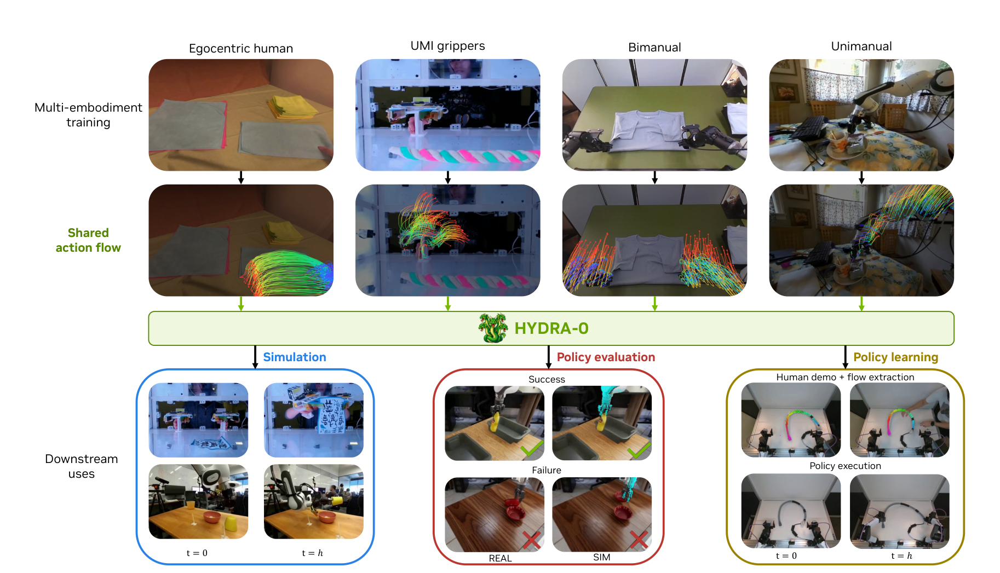
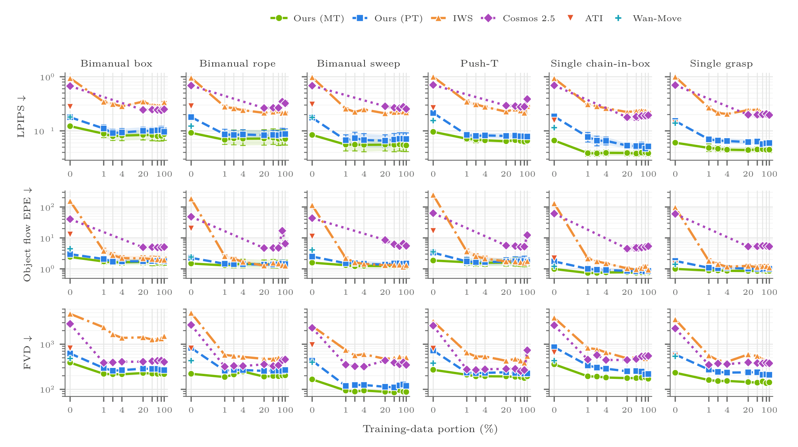
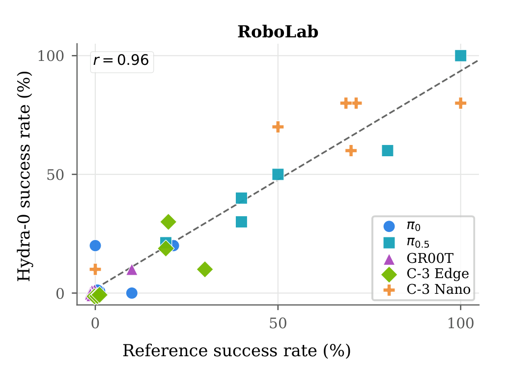
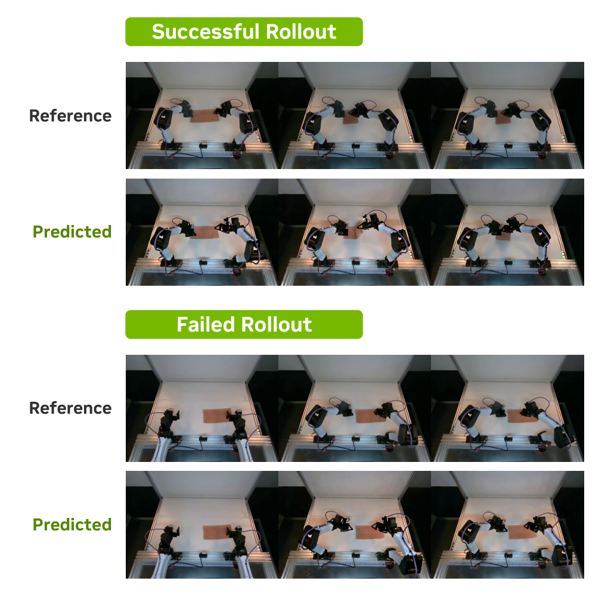
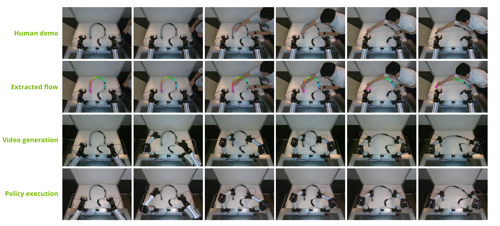
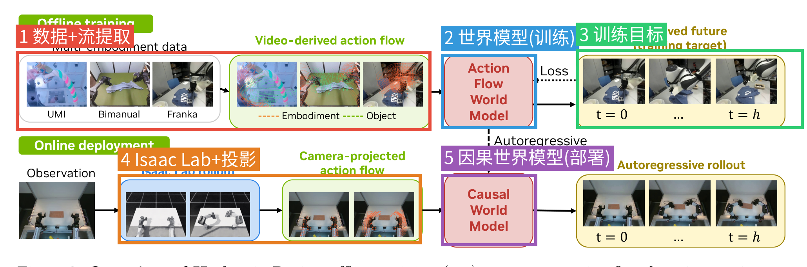

# Hydra-0: Action Flow for Generalist World Modeling and Control

| 项 | 内容 |
|---|---|
| 题目 | Hydra-0: Action Flow for Generalist World Modeling and Control |
| 作者 | Hongyu Li, Bowen Wen, Xinghao Zhu, Yixuan Wang, Yilun Du, Yunzhu Li, George Konidaris, Stan Birchfield, Soha Pouya, Chenran Li, Yan Chang |
| 单位 | NVIDIA / Brown University / Columbia University / Harvard University |
| arXiv | [2608.18077](https://arxiv.org/abs/2608.18077) (cs.RO) |
| 发布日期 | 论文 v1 2026-08-18（未发现工作本体更早公开的证据；项目主页与论文同期上线） |
| 代码/主页 | [项目主页](https://nvidia-isaac.github.io/video_to_data/hydra-0/)（截至 2026-08-19 为占位页，仅含 "test" 一词）；代码/权重均未公开，详见 5.4 节 |

**一句话**：把机器人动作改写成"图像平面上的像素运动轨迹"（action flow），让一个视频生成世界模型吃下人手/手持夹爪/单臂/双臂的所有交互数据，正向可做动作条件的未来预测与开环策略评估，逆向可从"想让物体怎么动"反推出机器人动作。

## 结构速览

| Section | 在干嘛 |
|---|---|
| 1 Introduction | 动机：原生动作表示绑死具身，提出 action flow 作为共享视觉接口；四条贡献 |
| 2 Method | 2.1 action flow 的两条构建路线（几何感知 / 纯视频）+ 训练期四种采样模式；2.2 flow 条件注入视频模型（ATI/Wan-Move 式特征传播）+ flow-matching 目标；2.3 自回归改造 + DMD2 少步蒸馏；2.4 正向策略评估 + 逆向 world action model |
| 3 Datasets | 7 个数据源约 2200 小时的多具身语料，过滤/标注流水线（AllTracker 轨迹、SAM 3 mask、caption） |
| 4 Experiments | 4.1 实现细节；4.2 跨 backbone 有效性（Table 2）；4.3 IWS 数据效率；4.4 推理速度；4.5 RoboLab 开环策略评估；4.6 逆向模式真机演示 |
| 5 Related Work | 神经模拟器/机器人世界模型；运动条件视频生成 |
| 6 Limitations | 抓取厘米级误差、接触状态模糊、仅开环评估 |
| 7 Conclusion | 总结 |
| 8 Appendix | 8.1 附加定性结果；8.2–8.4 flow 构建/采样/聚合细节；8.5–8.6 Wan2.2 两个变体的注入实现；8.7–8.8 自回归改造与蒸馏细节；8.9 VLM 评分细节 |

---

## 第1章 · 作者与实验室背景评估

（以下信息来自联网调研，2026-08-19；每条附来源）

### 作者背景表

| 作者 | 角色 | 单位/身份 | 主方向 | 主页 |
|---|---|---|---|---|
| Hongyu Li | 一作 | Brown CS 末年博士生；2026-04 起 NVIDIA research intern | 操作、视触觉感知、6D 位姿，近期转世界模型 | [个人主页](https://lhy.xyz/) · [Google Scholar](https://scholar.google.com/citations?user=aM2PHREAAAAJ) |
| George Konidaris | 导师（Brown） | Brown CS Full Professor（2026-05 晋升），Intelligent Robot Lab 主任 | 分层 RL、技能与符号抽象、规划 | [个人主页](https://cs.brown.edu/people/gdk/) · [实验室](http://irl.cs.brown.edu/) |
| Yunzhu Li | 导师（Columbia，co-advisor） | Columbia CS Assistant Professor，RoboPIL 负责人 | Structured World Models、可变形物体操作、多模态感知 | [个人主页](https://yunzhuli.github.io/)（实验室独立网站未找到，robopil.github.io 为占位页） |
| Bowen Wen | NVIDIA 合作者 | NVIDIA Seattle Robotics Lab Senior Research Scientist | 6D 位姿/跟踪，FoundationPose (CVPR 2024) 一作 | [NVIDIA 页](https://research.nvidia.com/person/bowen-wen) |
| Yilun Du | 合作者 | Harvard Assistant Professor（Kempner），兼 NVIDIA part-time | 能量模型/扩散/组合式世界模型 | [个人主页](https://yilundu.github.io/) |
| Xinghao Zhu / Yixuan Wang / Stan Birchfield | NVIDIA 研究侧 | 灵巧操作 / 精细操作与世界建模（Yixuan Wang 兼 Columbia 博士生）/ 机器人视觉 | — | 未逐一列出 |
| Soha Pouya / Chenran Li / Yan Chang | NVIDIA Isaac 工程侧 | 工程经理/首席工程师；Yan Chang 领导 Isaac loco-manipulation 团队；三人同为 X-Mobility 作者 | 世界模型工程化 | 未找到个人主页（Chenran Li） |

### 实验室主方向判定

- **Yunzhu Li / RoboPIL：传统强方向。** 粒子/结构化世界模型是其从 MIT 博士期间（DPI-Net 系）延续至今的主业，近 5 年证据链：Dynamic-Resolution Model Learning (2023)、BaB-ND (2024/25)、Particle-Grid Neural Dynamics (2025)、Deform360 (2026，副标题即 "for Deformable World Models")。
- **Konidaris / Brown IRL：新开方向。** 其"世界模型"传统指抽象 MDP/符号模型（From Skills to Symbols 2018、RLJ 2024 的 Abstract World Model），视频生成式路线在其名下最早就是本文一作主导的 NovaFlow (ICRA 2026)——概念同源但属学生驱动的新延伸。
- **NVIDIA：公司级战略投入。** Cosmos 世界基础模型、GR00T-Dreams/DreamGen、FLARE、X-Mobility 等；本文项目页挂在 nvidia-isaac.github.io 的 "video_to_data" 产品线下。

### 一作画像与水毕业风险预判

**事实**：Hongyu Li 是 NovaFlow（arXiv 2510.08568，"actionable flow" 概念的直接前身）和 Deform360（本文训练数据源之一）的一作；本文是其 NVIDIA 实习期间产出，主页明确双导师 = Konidaris + Yunzhu Li。**这不是他的首篇该方向工作**，而是 flow-as-action 脉络的第三篇。

**推断（依据上表）**：四条风险信号——一作无积累（❌ 有直接前身工作）、导师主业不符（❌ 双导师中 Yunzhu Li 完全对口）、实验室无持续投入（❌ RoboPIL ≥5 年 + NVIDIA 战略投入）、单位无积累（❌）——全部不成立。典型的"强学生 + 对口导师 + 工业平台"毕业前大作模式；反而要注意的是资源密集（32×H100×5 天 + 2200 小时语料），学术界复现门槛高。

⚠️ 本章内容未进入第3章盲审上下文。

---

## 第2章 · 论文类型判定

**结论：a+b 型组合创新为主体（视频骨干 + 轨迹条件注入 + 自回归蒸馏三块成熟技术的组装），叠加一处原创接口设计——action flow 的"运动学 grounding"（用控制器+物理仿真把可执行指令投影成像素轨迹，Eq. 1）及其正/逆双模用法。**

方法流程中实际承担环节的组件（均为论文参考文献中真实存在的引用）：

| 组件 | 原论文 | 在本文中承担的角色 |
|---|---|---|
| Wan2.2 | [Wan (arXiv 2503.20314)](https://arxiv.org/abs/2503.20314) | 视频生成骨干（I2V-A14B / TI2V-5B 两变体） |
| Cosmos 2.5 | [World Simulation with Video Foundation Models (arXiv 2511.00062)](https://arxiv.org/abs/2511.00062) | 视频生成骨干 + 原生 6D 动作条件基线 |
| ATI | [arXiv 2505.22944](https://arxiv.org/abs/2505.22944) | 轨迹条件注入机制的来源之一：首帧特征沿轨迹高斯传播 |
| Wan-Move | [arXiv 2512.08765](https://arxiv.org/abs/2512.08765) | 轨迹条件注入机制的来源之二：首帧 VAE 特征沿 latent 轨迹复制（论文自称 "closest video-conditioning precedent"） |
| LongLive-2.0 | [arXiv 2605.18739](https://arxiv.org/abs/2605.18739) | 自回归改造 recipe + 少步蒸馏初始化 |
| DMD2 | [arXiv 2405.14867](https://arxiv.org/abs/2405.14867)、[DMD (arXiv 2311.18828)](https://arxiv.org/abs/2311.18828) | 4 步蒸馏目标 |
| AllTracker | [arXiv 2506.07310](https://arxiv.org/abs/2506.07310) | 纯视频路线的稠密点跟踪（128×128 查询网格） |
| SAM 3 | [arXiv 2511.16719](https://arxiv.org/abs/2511.16719) | embodiment/object mask 的 grounded 分割 |
| Isaac Lab | [arXiv 2511.04831](https://arxiv.org/abs/2511.04831) | 部署期：候选指令 → 控制器+物理 rollout → link 变换 |
| LoRA | [arXiv 2106.09685](https://arxiv.org/abs/2106.09685) | 参数高效微调（骨干 rank-64；逆向模式 rank-32） |
| RoboLab | [arXiv 2604.09860](https://arxiv.org/abs/2604.09860) | 开环策略评估 benchmark |
| Causal Forcing | [arXiv 2602.02214](https://arxiv.org/abs/2602.02214) | 蒸馏时保持三网络因果性的做法（附录 8.8 引用） |

原创部分：① 几何感知构建路线（Eq. 1 的 link 变换投影 + 深度缓冲可见性判定）；② 训练期四模式轨迹采样（Embodiment/Object/All/None）；③ 逆向 world action model（物体流条件 + DiT token 读出 action head，Eq. 7）。

疑似借鉴（论文已引用但只在 related work 出现、未进流程）：Track2Act [5]、Im2Flow2Act [50]、FlowWAM [9] 等 flow-接口工作——与本文核心主张重叠度高，见第3章 W7。

---

## 第3章 · 双盲评审 + Rebuttal

### 3.1 初审意见（由隔离上下文的盲审 agent 独立生成，仅见净化文本）

> **Summary**：本文提出 Hydra-0，用 "action flow"（机器人可见表面点或物体点的图像平面稀疏轨迹）作为视频生成世界模型的统一条件接口。训练时从多具身交互视频（约 2200 小时、7 个数据源）通过稠密跟踪与 grounded 分割恢复 flow；部署时通过 Isaac Lab 控制器-物理 rollout 加相机投影从可执行命令导出 flow。在 Cosmos 2.5 与两个 Wan2.2 变体上实例化，报告对比原生 6D 动作基线的运动误差下降、IWS 数据高效适配、RoboLab 开环策略评估 r=0.96，以及逆向模式概念验证。
>
> **Strengths**
> 1. **同 backbone 受控对比设计合理**（Section 4.2, Table 2）：Ours (Cosmos 2.5 2B) 与原生 6D 条件基线共享骨干、数据与 horizon，真正隔离了条件表征变量。
> 2. **跨 backbone 可移植性有实证**：同一 flow 构建方案在三个架构上均工作。
> 3. **行文对证据边界总体诚实**：如 "best displayed point estimate"、FVD 方差声明、"不是 end-to-end speedup"、Limitations 坦承开环局限。
> 4. **数据工程与披露较完整**：Table 1 给出规模、过滤前后、许可证，过滤阈值量化。
> 5. **逆向模式训练数据设计有好想法**：成对 rollout 无需专家演示，失败轨迹同样提供监督。
>
> **Weaknesses**
> - **W1（标题数字跨 backbone 混淆）**：摘要反复引用的 90.40%/60.16% 来自 ~14B 蒸馏 Wan2.2 对 2B Cosmos 基线的对比，混淆容量/预训练/表征三因素；真正受控的同 backbone 数字是 ~60%/53%。claim 与 evidence 直接错配。
> - **W2（gripper EPE 结构性偏向 + 基线数据存疑）**：flow 条件在输入中已给出夹爪像素位置，gripper EPE 度量的正是跟随度，优势有构造性；且原生 6D 基线如何消费人手/UMI 数据未说明。
> - **W3（逆向模式作为四大贡献之一，证据仅单任务单例定性）**：无成功率、无 trial 数、无基线，cherry-picking 无法排除。
> - **W4（"开环策略评估"效用主张超出实验设计）**：回放已执行轨迹只证明"给定完整轨迹能复现结果"；生成侧成功判定协议缺失；r=0.96 的 n 表述含糊（5 还是 30）。
> - **W5（无统计检验）**：± 未定义、无 seed/重复说明、无 CI、无假设检验。
> - **W6（代码与模型不可得）**：无任何可得性声明；EgoDex 的 CC-BY-NC-ND（禁衍生）许可用于训练需合规说明。
> - **W7（最直接竞争工作只列举未比较）**：FlowWAM [9]、Flow-as-Interface [50] 与核心主张高度重叠，无实证对比或逐点差异论证。
> - **W8（"zero-shot composition" 缺直接实验锚点）**：0% 数据点只证明 mid-training 迁移收益，"组合"是更强的机制性主张，需专门消融。
>
> **Questions**：Q1 ±定义/单 checkpoint？Q2 生成侧判定协议 + r 的 n 与 CI？Q3 基线有效训练数据？Q4 为何 4-step 学生全面超过 50-step 教师？Q5 逆向模式 trial 数与失败案例？Q6 与 FlowWAM 区别？Q7 声明报告 LPIPS 但 Table 2 无此列？
>
> **Minor**：加粗规则含灰行歧义；Figure 7 横轴刻度与正文分数集不一致；Eq. 3 排版断裂；"actionable flow"/"action flow" 混用；H1-Fold-Clothes 仅 0.1 小时意义存疑。
>
> **评级：major revision。** 核心结论（flow 作为跨具身统一接口）已被 [9][50][45][13] 不同程度占据，增量在运动学 grounding 部署路径 + 多具身规模 + 正反双模的系统整合；最有说服力的受控对比未被用作标题数字，两条 headline claim 证据不足，无统计检验、无代码声明。修正后可上调至 minor revision。

### 3.2 Rebuttal（主 agent 以作者方身份撰写，论据仅来自论文内部）

**承认的批评清单（= 本文真正的硬伤一览）**：

1. **W1 成立**：摘要/贡献引用的 90.40%/60.16% 是非受控的跨 backbone 对比；受控数字应为同 backbone 的 ~60%/53%。
2. **W2c 成立**：原生 6D 动作基线如何处理 EgoDex 人手与 UMI 数据、其有效训练子集是否与 Ours 相同，论文未说明。
3. **W3 成立**：逆向模式仅一个任务的一组定性快照，无 trial 数/成功率/基线（论文自标 "proof-of-concept"，但摘要措辞未带此限定）。
4. **W4b/W4c 成立**：r=0.96 的 n 在引言与 4.5 节表述不一致（应为 30 个 policy–task 对）；生成 rollout 的成功判定协议（谁判、什么标准、是否盲评）未写明。
5. **W5 成立**：全文无统计检验，Table 2 的 ± 未定义，无 seed/重复训练说明。
6. **W6 成立**：无代码/模型/数据可得性声明；EgoDex ND 许可合规性需说明。
7. **W8 成立**："zero-shot composition" 缺少去掉人类形变数据源的 mid-training 消融支撑，应弱化为 "zero-shot transfer"。
8. **Q7 成立**：Metrics 段声明报告 LPIPS 但 Table 2 无此列。

**辩护的点（仅两处）**：

- **W2b**：即便完全弃用被质疑的 gripper EPE，同 backbone 受控对比在其余所有指标上仍成立（object EPE 6.27 vs 13.23、PSNR 18.41 vs 15.62、SSIM 0.725 vs 0.668、FID 32.4 vs 39.1、FVD 277.4 vs 405.8，Table 2 Average）；object EPE 不存在"条件里含答案"问题（Embodiment 模式条件中只有夹爪流，物体运动必须由模型推断）。核心结论不依赖被质疑指标。
- **W4a / W7**：achieved-trajectory replay 是论文明确声明遵循既有神经模拟器评估协议（[48]）的标准验证方式，结果保真是替代真实执行的必要前提，且 Limitations 已承认仅开环；与 [9][50] 的差异并非纯并列——Section 5.2 末段给出可见性感知表面点轨迹（非稠密光流）、多具身训练、正逆双模三点差异，且"从可执行指令经控制器-物理 rollout 导出部署 flow"（Eq. 1）是 [9][50] 均不具备的可执行性 grounding；[9] 按参考文献时间标注公开于 2026 年 7 月，属并行工作，投稿周期内实证对比不可行。

（对 Q4 的回应：论文未讨论；论文内部可指出 DMD 目标匹配数据分布而非模仿教师轨迹、且附录 8.8 中蒸馏阶段 CFG 系数为 0 与教师配置不同，两者均可能导致学生超过教师，确证需补实验。）

### 3.3 审稿人二轮回复 + 最终评级

> **逐条回应**：
> - **W1 维持（双方确认）**：作者同意替换标题数字；"our best configuration" 措辞客观上引导误读，缺陷在当前稿件未闭合。
> - **W2 (b) 部分撤回，(a)(c) 维持**：作者的内部论据有效——剔除 gripper EPE 后受控对比在 object EPE/PSNR/SSIM/FID/FVD 上仍一致占优，且 Embodiment 模式下物体运动须由模型推断，object EPE 无"条件含答案"问题。撤回"核心结论依赖被质疑指标"的推断，收窄为"gripper EPE 优势含构造性成分"。(c) 维持并加重：若基线实际可用数据显著少于 Ours，"同数据"前提被削弱，需如实报告。
> - **W3 维持（双方确认）**：作者选择降级措辞而非补实验（不虚假承诺补测值得肯定），后果是贡献集合收窄，已计入评级。
> - **W4 (a)(b) 部分撤回，(c) 维持**：接受"遵循 [48] 既有协议 + Limitations 已限定"的内部论据，撤回实验设计层面质疑；确认 4.5 节原文 "across policy–task pairs"，n=30 有文本依据，撤回 "n 可能仅为 5"。(c) 生成侧成功判定协议缺失是 r=0.96 证据链上的实质缺口，维持。
> - **W5、W6、W8、Q7 维持（双方确认）**。
> - **W7 部分撤回**：核对原文确认 5.2 末段存在三点差异列举，初审"仅并列句带过"表述过重，撤回；concurrent work 定性依据文献年份标注接受。维持：逐点对照段落与 concurrent 标注尚不存在于稿件，与 [50] 的区分应写入正文。
> - **Q4**：rebuttal 给出的两个方向（DMD 匹配数据分布、蒸馏期 CFG=0 配置不同）有论文内部锚点，可作待补分析假设；现象目前仍是未解释的反常。
>
> **双方确认的缺陷清单**（12 项）：标题数字混淆；gripper EPE 构造性成分；基线数据构成未披露；逆向模式无 n/成功率/基线；生成侧判定协议缺失；n 表述不一致且无 CI；无统计检验/±未定义；无可得性声明 + EgoDex ND 合规；与 [9][50] 无实证对比；composition 无消融锚点；学生超教师无分析；LPIPS 声明与表格不一致。
>
> **最终评级：major revision（维持）**。rebuttal 的两处有效辩护使"flow 条件优于原生动作条件"这一核心结论比初审判断更稳固；但评级不变：一是逆向模式与 composition 两条 headline 主张均以降级措辞而非补充证据解决，有效贡献集合收窄至"受控条件表征对比 + 跨 backbone 可移植 + 结果保真验证"，按旗舰刊择优水位仍处边界；二是多项确认缺陷（判定协议、基线数据、统计定义、可得性）的闭合质量只能在修改稿中核验，任何一项恶化都可能进一步削弱主结论。完整兑现后可达 minor revision 至接收边界。
>
> **违规检查**：rebuttal 中 "[9] 公开于 2026 年 7 月" 的具体月份不见于净化文本，按外部信息忽略，仅依据年份标注接受 concurrent 定性。

**流程备注**：二轮后流程终止。主 agent 未对评审结论做任何软化或删改。（审稿人指出的"7 月"确实来自原始论文参考文献 [9] 的 "July 2026" 标注，因参考文献匿名化时只保留了年份，审稿人无法核验——属净化流程的副作用，不影响结论。）

---

## 第4章 · 大白话：这篇文章在做什么

**场景**：机器人世界模型——让机器人在"脑内"预演：给它当前画面和一串候选动作，它预测出"执行这串动作后世界会变成什么样"的视频。有了这个，不用真跑机器人就能评估策略好坏、甚至反推动作。

**之前的方法**：动作条件的视频世界模型直接把关节角或末端位姿喂给模型。这种表示绑死了特定机器人——同一个末端指令在不同机器人上产生的画面完全不同，所以模型换个机器人就得重训，人手视频这种没有"关节角"的数据更是完全用不上。

**本论文的方法**：把"动作"翻译成"画面上这些点接下来怎么移动"的像素轨迹（action flow）。人手、手持夹爪、单臂、双臂的动作在这个表示下长得一样，于是一个模型能吃下所有数据；部署时用物理仿真器把真实机器人指令投影成像素轨迹再喂给模型。反过来，只给"我想让物体这样动"的轨迹，模型还能脑补出配套的机器人运动，接个小输出头就变成了可执行动作。

**图内文字中文翻译**（按阅读顺序）：顶行是四类训练数据源——第一人称人类演示（Egocentric human，叠布）、手持 UMI 夹爪（拧花绳）、双臂机器人（Bimanual，叠 T 恤）、单臂机器人（Unimanual，桌面整理）。第二行"Shared action flow（共享动作流）"：把上面每种视频里"正在动的那个身体"的运动都画成彩色像素轨迹——这就是喂给模型的统一动作语言。中间绿色长条是 HYDRA-0 模型本体。底行三个下游用途：左（蓝框）Simulation 仿真——给定 t=0 画面和动作流，生成 t=h 的未来；中（红框）Policy evaluation 策略评估——真实执行（REAL）成功/失败，模型回放（SIM）也对应成功/失败，打勾打叉一致；右（黄框）Policy learning 策略学习——从人类演示提取物体流（Human demo + flow extraction），模型反推出机器人动作并真机执行（Policy execution）。

**自查**：不做这个方向的人需要知道的唯一背景是"世界模型 = 预测未来的模拟器"，三段话已给出；术语 action flow 首次出现即用大白话定义。通过。

---

## 第5章 · 实验

### 5.1 仿真/离线实验

#### 5.1.1 多具身验证集上的动作条件预测（主实验，Table 2）

**场景一句话**：给模型第一帧 + 夹爪的像素运动轨迹，让它生成未来 5 秒（81 帧 @480p）的视频，跟真实视频对比——考察"模型是否理解了这串动作会导致什么"。重点场景全是可变形物体（叠衣、拧绳等），因为这类东西显式物理仿真最难做。

**条件**：训练语料 7 源约 156 万窗口 / 2202 小时（Table 1，过滤后）；每数据集 100 条 held-out 验证片段。Baseline：① Cosmos 2.5 原生 6D 相对末端动作条件（同数据微调，受控对比）；② ATI、Wan-Move 零样本（灰行，用官方权重不做多具身训练）。指标：PSNR/SSIM（像素保真）、object/gripper EPE（物体/夹爪轨迹端点误差，像素，越低越好）、FID/FVD（分布质量）、VLM 评分（Gemma 4 31B 按物理合理性等 4 维打 1–5 分）。

**主对比表（Table 2 的 Average 块汉化；5 个数据集的非加权平均，加粗 = 最优）**：

| 模型 | PSNR↑ | SSIM↑ | 物体 EPE↓ | 夹爪 EPE↓ | FID↓ | FVD↓ | VLM↑ |
|---|---|---|---|---|---|---|---|
| ATI（零样本） | 17.01 | 0.700 | 23.19 | 4.62 | 36.4 | 444.2 | 3.14 |
| Wan-Move（零样本） | 16.35 | 0.688 | 21.53 | 4.67 | 34.4 | 408.3 | 3.71 |
| Cosmos 2.5（原生 6D 动作，受控基线） | 15.62 | 0.668 | 13.23 | 34.28 | 39.1 | 405.8 | 3.88 |
| Ours (Cosmos 2.5 2B) | 18.41 | 0.725 | 6.27 | 13.80 | 32.4 | 277.4 | 3.83 |
| Ours (Wan2.2 5B) | 19.64 | 0.770 | 6.61 | 3.88 | 24.1 | 248.8 | 3.90 |
| Ours (Wan2.2 A14B) | 20.76 | 0.805 | 6.00 | 3.83 | 20.7 | 193.7 | 3.98 |
| Ours (Wan2.2 A14B 4-step 蒸馏) | **21.84** | **0.830** | **5.27** | **3.29** | **18.7** | **155.9** | **4.23** |

要点（附出处）：① **受控对比**（同 Cosmos 2.5 骨干，仅换条件表征）：物体 EPE 13.23→6.27、夹爪 EPE 34.28→13.80，五个数据集全部占优（Section 4.2）——这是"像素动作表示优于原生 6D 表示"的核心证据；② 4-step 蒸馏学生几乎所有指标反超 50-step 教师（原因论文未讨论，见第3章 Q4）；③ 摘要里的 90.4%/60.2% 是拿最强 Wan2.2 A14B 4-step 对比 Cosmos 基线的跨骨干数字，混入了骨干容量因素（见第3章 W1）。

两个代表性数据集的分块数字（其余 DROID/MolmoAct2/ABC-130k 见论文 Table 2，趋势一致）：

| XVLA-Soft-Fold（双臂叠衣） | PSNR↑ | 物体 EPE↓ | 夹爪 EPE↓ | FVD↓ |
|---|---|---|---|---|
| Cosmos 2.5（6D 基线） | 14.95 | 6.65 | 35.78 | 479.9 |
| Ours (Cosmos 2.5 2B) | 16.62 | 5.29 | 17.36 | 378.5 |
| Ours (Wan2.2 A14B 4-step) | **19.23** | 3.47 | **3.20** | **238.5** |

| Deform360（手持夹爪玩可变形物） | PSNR↑ | 物体 EPE↓ | 夹爪 EPE↓ | FVD↓ |
|---|---|---|---|---|
| Cosmos 2.5（6D 基线） | 15.86 | 20.02 | 47.85 | 474.5 |
| Ours (Cosmos 2.5 2B) | 17.53 | 8.47 | 21.53 | 295.0 |
| Ours (Wan2.2 A14B 4-step) | **20.63** | **6.86** | **5.06** | **166.5** |

**图内文字翻译**：上下两个面板分别是 XVLA-Soft-Fold（叠 T 恤）和 Deform360（拧花绳），横轴 0–5 秒六个同步时刻。每面板五行从上到下：Wan-Move 生成、微调 Cosmos 2.5 生成、Action Flow（喂给本文模型的轨迹条件可视化）、Ours（本文干净输出）、Ground Truth（真实视频）。看点：Wan-Move 在叠衣里凭空长出一只人手，Cosmos 2.5 的衣服运动幅度不足，Ours 与真值最接近。

#### 5.1.2 IWS 六任务数据效率（Figure 7）

**场景一句话**：在训练语料之外的 Interactive World Simulator 六个任务（双臂装盒/理绳/扫桌、Push-T 推 T 形块、单臂链条入盒、单臂抓取）上，只给 0%–100% 的任务数据做适配，看多具身预训练（MT）比从原始 Wan2.2 权重起步（PT）省多少数据。

**条件**：种子化嵌套子集（1/2/4/20/40/60/80/100%），所有方法用同一子集；对比 IWS 从零训练的任务专用模型、Cosmos 2.5、零样本 ATI/Wan-Move。指标 LPIPS / 物体流 EPE / FVD。

要点（附出处，Section 4.3）：0% 零样本时 MT 在全部 6 任务 × 3 指标上优于 PT；100% 时 MT 在 LPIPS/FVD 全部 6 任务最优、EPE 4 任务最优；**MT 的收益大头在 20% 数据前就到位**（20%→100% 各指标变化 ≤3.4%/6.7%/6.8%）——即多具身预训练可省约 80% 任务数据。

**图内文字翻译**：六列 = 六个 IWS 任务；三行 = LPIPS↓、物体流 EPE↓、FVD↓；横轴 = 任务数据比例（%）。绿线 Ours (MT，多具身预训练起步)、蓝线 Ours (PT，原始 Wan2.2 起步)、橙线 IWS（任务专用从零训）、紫线 Cosmos 2.5、红/青点 ATI 与 Wan-Move（仅 0% 零样本）。绿线整体压在所有线下方，且很早就走平。

#### 5.1.3 RoboLab 开环策略评估（Figure 8）

**场景一句话**：把 5 个预训练策略（π0、π0.5、GR00T N1.7、Cosmos-3 Edge/Nano）在 RoboLab 6 个任务上的 300 条已执行轨迹，用 Hydra-0 从第一帧开环回放，看"模型里的成功率"和"真实成功率"是否一致。

**条件**：从每条 rollout 的真实首帧出发，条件是从记录的末端轨迹导出的因果动作流；策略不在生成画面上重新查询（纯开环回放）。指标：Pearson r、Spearman ρ、MAE。

结果（Section 4.5）：**r = 0.96，ρ = 0.93，MAE = 5.7 个百分点**；按任务平均后能复现 5 个策略的真实排名。注意（呼应第3章 W4）：这证明的是"结果保真"，不是"可替代真实执行"；生成侧成功判定协议论文未写明。

**图内文字翻译**：横轴 = 参考成功率（真实执行，%），纵轴 = Hydra-0 回放成功率（%）；每个点 = 一个策略×任务对的 10 次试验聚合；虚线 = 最小二乘拟合，左上角 r=0.96。图例：π0、π0.5、GR00T (N1.7)、C-3 Edge/Nano（Cosmos-3 两档）。点大致贴着对角线 = 模型里的成败与真实世界一致。

### 5.2 真机实验

#### 5.2.1 真机开环回放（Figure 9）

真实双臂叠布置景，回放成功与失败各一条轨迹：生成 rollout 定性保持了不同结局（成功的照样成功、失败的照样失败）。仅定性、无数字（Section 4.5 "Real-world proof of concept"）。

**图内文字翻译**：上半 Successful Rollout（成功轨迹）：Reference = 真实录像，Predicted = 模型开环预测；下半 Failed Rollout（失败轨迹）同构。看点：失败那条的预测里布同样没被叠起来。

#### 5.2.2 逆向模式：物体流驱动真机执行（Figure 10）

**场景一句话**：人演示一遍"把软管掰成拱形"，从演示视频里只提取**物体**的运动轨迹喂给模型（不给任何机器人轨迹），模型脑补出双臂机器人该怎么动，action head 把内部特征解码成可执行动作，真机成功执行。

**条件**：世界动作模型 = 预训练因果模型 + rank-32 LoRA + 动作/状态双头（Eq. 7，Huber + 速度平滑损失），在成对真实 rollout（含失败）上后训练，无需任务专家演示。仅展示 flexible-pipe-bending 一个任务、一组快照；trial 数与成功率论文未报告（第3章 W3 确认为硬伤）。

**图内文字翻译**：四行 × 六个时刻。第 1 行 Human demo：人徒手把软管两端往中间掰；第 2 行 Extracted flow：从演示中提取的物体运动轨迹（彩色点串）；第 3 行 Video generation：只喂物体流，Hydra-0 生成"双臂机器人来完成同样物体运动"的想象视频；第 4 行 Policy execution：action head 输出动作后真机实际执行，软管被掰成同样形状。

**项目主页**：[https://nvidia-isaac.github.io/video_to_data/hydra-0/](https://nvidia-isaac.github.io/video_to_data/hydra-0/)（论文摘要下方脚注）。

### 5.3 为什么选这些实验

- **共同特性：可变形物体 + 多具身。** 语料过滤时"只保留布/线/绳/袋/纸交互"（Section 3），五个验证集里四个以可变形操作为主。原因直白：可变形物体是显式状态重建和物理仿真最难啃的场景（Section 4 开头原话），传统 sim 无法提供 ground-truth 动力学，视频世界模型的相对优势最大；而"多具身"恰好是 action flow 这个表示独有的卖点——原生 6D 表示根本没法定义人手数据。数字支撑：可变形场景里基线劣化最狠（Deform360 上 Cosmos 2.5 夹爪 EPE 47.85 vs Ours 5.06，差近 10 倍），而刚体为主、场景杂乱的 DROID 上差距相对小（夹爪 EPE 28.45 vs 3.13，且物体 EPE 因无法标注干脆没报）。
- **方法设计吃这个特性的点**：像素轨迹直接把"布该往哪走"写进条件（Object 模式），绕过了可变形物体没有低维状态的难题；四模式采样让同一模型既能被夹爪流驱动也能被物体流驱动。
- **该测但没测的主流 bench**：RLBench/LIBERO/SimplerEnv 等刚体操作标准 bench 全部缺席；策略评估只用了 NVIDIA 自家的 RoboLab（作者关联，见第1章）。缺席信号：action flow 依赖"可见的身体运动"，遮挡重、动作幅度小（如 50 像素以下被过滤）或刚体精确抓取的场景可能不占优——Limitations 也自认抓取厘米级误差与接触状态模糊。另外与 Ctrl-World、WorldGym 等其它策略评估世界模型没有横向对比。

### 5.4 复现可能性（硬核查，零猜测）

联网实查日期 2026-08-19，每项只有"找到了（附出处）"或"没找到（列入缺失）"两种状态。

**代码**：
- ❌ **未找到 Hydra-0 代码。** 项目主页 https://nvidia-isaac.github.io/video_to_data/hydra-0/ 实际内容是一个单词 "test"（占位页，对应仓库文件 `nvidia-isaac/video_to_data` 的 `docs/hydra-0/index.html`，2026-08-18 论文公开后仍是占位）。该 GitHub 仓库本身是**另一个项目**（V2D 视频摄取 + 3D 重建 + Isaac Lab RL 流水线，关联 CHORD 报告）；遍历其全部 2608 个文件，hydra/alltracker/action_flow/wan2/cosmos 关键词只命中占位页和一个无关的 VLM 封装。nvidia-isaac 组织、NVlabs/NVIDIA 组织及 GitHub 全站检索均无官方仓库。论文正文逐句检索 "github/release/open source/publicly available"：**零发布声明**。
- ✅ 评估侧：RoboLab benchmark 实质开源（[github.com/NVlabs/RoboLab](https://github.com/NVlabs/RoboLab)，实际打开验证：含 `robolab/` 包、tests、docker、examples、policies 等，441 stars，持续更新）。

**ckpt（逐变体）**：

| 变体 | 公开？ |
|---|---|
| Ours (Cosmos 2.5 2B) | ❌ HuggingFace 检索未找到 |
| Ours (Wan2.2 TI2V-5B) | ❌ 未找到 |
| Ours (Wan2.2 I2V-A14B) | ❌ 未找到 |
| Ours (A14B 4-step 蒸馏) | ❌ 未找到 |
| World action model + action head | ❌ 未找到 |
| 底座 Wan2.2 / Cosmos 2.5 | ✅ 本身是公开模型（非本文产物） |

**数据**：
- ✅ 七个源数据集原始版公开（DROID、ABC-130k、MolmoAct2、EgoDex、Deform360、XVLA-Soft-Fold、H1-Fold-Clothes；许可证见论文 Table 1）。
- ❌ 本文的过滤 + AllTracker 轨迹 + SAM 3 mask + caption 标注后版本未公开；处理/标注脚本未公开；正文无发布承诺。

**训练细节（正文+附录核查）**：

找到了：骨干冻结、patch embedding + rank-64 LoRA（q/k/v/o+FFN）（Sec 2.2）｜四模式采样概率 (0.05, 0.40, 0.40, 0.15) 与轨迹条数 1–128 / 256–1024（Sec 4.1、附录 8.3）｜β=220、top-K=2、无 softmax 归一化（附录 8.4）｜A14B 训练 5 天 / 40,000 步 / 32×H100（Sec 4.1）｜数据预处理：480p@16fps、81 帧窗口、50 像素运动过滤阈值（Sec 3）｜投影可见性深度容差 1.2 cm、3×3 邻域（附录 8.2）｜蒸馏：每 chunk 4 步、5 次 critic/1 次生成器、CFG=0（附录 8.8）｜WAM：rank-32 LoRA、λh=0.1、λv=0.1、头结构（Sec 2.4）。

没找到（缺失项）：学习率｜optimizer 与 schedule｜batch size｜Cosmos 2B / TI2V-5B 变体的训练步数与算力｜100 条验证 clip 的选取方式（数据切分）｜蒸馏阶段训练步数｜WAM 后训练的数据量、任务构成与真机平台型号｜动作归一化的具体方式｜IWS 适配实验的训练超参。

**结论：`难以复现`（模型本体）。** 代码零、权重零、处理后数据零、关键训练超参（lr/batch/schedule）零，唯一能复用的是评估 benchmark 与底座模型；从零复刻还需对齐 2200 小时语料的标注流水线与 32×H100×5 天量级算力。此结论与第3章盲审 W6（无可得性声明）互相印证。

---

## 第6章 · 方法拆解

方法总览图（Figure 2）+ 彩色框标注：

（原图：[figs/fig2_pipeline.png](hydra-0-action-flow-figs/fig2_pipeline.png)；辅助图：Figure 3 流构建与采样 [figs/fig3_flow_sampling.png](hydra-0-action-flow-figs/fig3_flow_sampling.png)、Figure 4 条件注入 [figs/fig4_conditioning.png](hydra-0-action-flow-figs/fig4_conditioning.png)）

### 🟥 块1 · 数据 + 流提取（离线训练路线）

- **来源**：AllTracker（[arXiv 2506.07310](https://arxiv.org/abs/2506.07310)）+ SAM 3（[arXiv 2511.16719](https://arxiv.org/abs/2511.16719)）的组装；采样策略为作者原创。
- **接口**：进 = 原始交互视频（无需机器人描述文件或相机标定）；出 = 一组带可见性标记的像素轨迹 F = {(x_{n,t}, m_{n,t})}，并按 mask 分成 embodiment / object / 未分配三池。
- **训练时**：视频统一 480p@16fps 切 81 帧窗口，AllTracker 128×128 网格稠密跟踪，SAM 3（或标定渲染/投影手部几何）出 mask；每步从四种条件模式抽一种——Embodiment（夹爪/手的轨迹，主动作条件，概率 0.40）、Object（物体轨迹，任务意图，0.40）、All（混采 256–1024 条，0.15）、None（无轨迹，条件 dropout，0.05）；前两种模式每次采 1–128 条轨迹（Figure 3、附录 8.3）。
- **部署时**：此块不用（部署走 🟧 块4）。

### 🟩 块2 · 训练目标构造

- **来源**：视频骨干自带的 VAE + flow matching（标准做法）。
- **接口**：进 = 观测到的未来真实视频；出 = 加噪 latent Z_t 与 flow-matching 目标速度 v*_t（Eq. 5）。
- **训练时**：预计算 VAE latent 存盘（Section 3）；loss 只有一个：以运动条件为额外输入的标准 flow-matching MSE。
- **部署时**：不用（没有未来真值）。

### 🟦 块3 · Action Flow 世界模型（训练形态，双向去噪）

- **来源**：骨干 = Wan2.2（[arXiv 2503.20314](https://arxiv.org/abs/2503.20314)）或 Cosmos 2.5（[arXiv 2511.00062](https://arxiv.org/abs/2511.00062)）；轨迹注入 = ATI 的高斯传播（[arXiv 2505.22944](https://arxiv.org/abs/2505.22944)）+ Wan-Move 的首帧特征沿轨迹复制（[arXiv 2512.08765](https://arxiv.org/abs/2512.08765)）。
- **接口**：进 = 首帧 latent s0 + 轨迹集 F + 文本/图像上下文；出 = 未来 latent 序列（VAE 解码成视频）。
- **训练时**：每条轨迹在首帧 latent 上双线性采一个特征 h_n，沿轨迹未来位置用高斯权重（β=220，每格取 top-2）铺回时空网格得运动特征 M，加一个 0–1 的"此处有轨迹经过"presence gate g，合成 C_motion=(M,g) 与噪声 latent 拼接进 DiT（Eq. 3–4，Figure 4）。骨干权重冻结，只训 patch embedding + rank-64 LoRA（q/k/v/o + FFN）。三种骨干的注入位置略有不同（Cosmos：17 通道旁路加到 token；A14B：借用 I2V 视觉条件通道，只喂高噪声专家；5B：49 通道旁路拼接，附录 8.5–8.6）。
- **部署时**：本形态是全窗口双向去噪，慢（50 步 20.92 s/clip），真正部署用 🟪 块5。

### 🟧 块4 · Isaac Lab 执行 + 相机投影（部署期动作→流的翻译器）

- **来源**：Isaac Lab（[arXiv 2511.04831](https://arxiv.org/abs/2511.04831)）+ 作者原创的投影管线（Eq. 1）。
- **接口**：进 = 候选指令序列 a_{0:H-1}（比如某个 VLA 的输出）+ 机器人 URDF + 相机内外参；出 = 与训练格式完全相同的像素轨迹 F。
- **部署时**：指令喂给仿真里的控制器+物理引擎跑出每步 link 变换 → 把首帧可见的机器人表面采样点用 link 变换传播 → 透视投影进相机平面；深度缓冲（容差 1.2 cm、3×3 邻域）处理自遮挡决定可见性 m（附录 8.2）。**这一块是全文的"可执行性 grounding"关键**：它把"像素轨迹"这个训练接口接到了"真实可执行指令"上。
- **训练时**：对有标定的机器人数据也可用记录状态走同样投影（几何感知路线）。

### 🟪 块5 · 因果世界模型（部署形态：自回归 + 4 步蒸馏）

- **来源**：LongLive-2.0 的自回归改造与蒸馏 recipe（[arXiv 2605.18739](https://arxiv.org/abs/2605.18739)）+ DMD2（[arXiv 2405.14867](https://arxiv.org/abs/2405.14867)）；保持因果性的做法引 Causal Forcing（[arXiv 2602.02214](https://arxiv.org/abs/2602.02214)）。
- **接口**：进 = s0 + C_motion（🟧 块4 输出，整窗计算一次、按绝对偏移切片）；出 = 逐 chunk（7 latent 帧）自回归生成的长视频，KV cache 复用历史。
- **训练时**：先 clean-context teacher forcing + block-causal mask 做自回归转换（不需 ODE 初始化），再 DMD2 蒸馏到每 chunk 4 步（5 次 critic 更新/1 次生成器更新，CFG=0，附录 8.7–8.8）。
- **部署时**：81 帧 480×832 单卡 H100 1.31 s/clip = 62 FPS（Table 3，16 倍于双向教师；不含 VAE 解码）。

### ➕ 块6 · 逆向模式：world action model + 动作头（不在 Figure 2 中，见 Figure 10）

- **来源**：作者原创（结构复用块3/5）。
- **接口**：进 = 期望**物体**流 F_obj（如从人类演示提取，不给任何机器人流）+ 首帧；中间 = 模型"脑补"的含机器人运动的 latent rollout；出 = action head 从每个去噪后 latent block 的 DiT token（均值池化 + 单查询注意力池化 → LayerNorm → 2 层 GELU MLP，宽 1024）直接解码的机器人动作与状态，**不经过像素解码**。
- **训练时**：预训练因果模型上后训 rank-32 自注意力 LoRA + 运动输入投影 + 轻量双头；数据 = 成对真实 rollout（含失败轨迹，无需专家演示）；loss = flow matching + 0.1×(动作 Huber + 状态 Huber + 0.1×速度 L1)（Eq. 7）。
- **部署时**：人示范 → 提取物体流 → 模型 rollout → 动作头输出 → 真机执行（Figure 10）。注意：目前用的是 50 步自回归教师而非 4 步学生（Section 4.4 末）。

**接口自查（首尾相接）**：视频 →(块1)→ 轨迹池 →(采样)→ F；F + 首帧 →(块3)→ 未来 latent ←loss→(块2) 目标。部署：指令 →(块4)→ F →(块5)→ 未来视频（正向）或 →(块6)→ 动作（逆向）。链条闭合，无悬空接口。✅

---

## 第7章 · 消融

**本文没有专门的消融小节/消融表**——组件级消融（高斯 β、top-K、presence gate、四模式采样概率、各数据源贡献）全部缺失。这算缺陷：呼应第3章 W8（"zero-shot composition" 主张正因缺少数据源消融而悬空）与 W5（相邻配置差异无法归因）。以下是散落在正文里的三组"事实上的消融"：

| 消融（行名已语境化） | 数字 | Takeaway |
|---|---|---|
| 把 action flow 换回原生 6D 末端动作条件（同 Cosmos 2.5 骨干，Table 2） | 物体 EPE 6.27→13.23，夹爪 EPE 13.80→34.28，FVD 277.4→405.8 | 条件表征本身贡献了物体运动误差减半、夹爪误差降 60%，是全文最硬的单项证据 |
| 去掉多具身 mid-training，从原始 Wan2.2 权重直接适配（MT vs PT，Figure 7） | 0% 零样本时 6 任务 × 3 指标 MT 全胜；100% 数据时 MT 仍在 LPIPS/FVD 全 6 任务最优 | 多具身预训练既给零样本迁移，也省约 80% 任务数据（20% 处基本走平） |
| 去掉自回归改造/少步蒸馏（Table 3 速度阶梯） | 双向 50 步 20.92s → 自回归 12.48s（1.68×）→ 4 步蒸馏 1.31s（16×，62 FPS） | 蒸馏是速度大头（≈9.5×）；且蒸馏后质量不降反升（Table 2，原因未解释，见 Q4） |

消融配图：见上文 [figs/fig7_data_efficiency.png](hydra-0-action-flow-figs/fig7_data_efficiency.png)（MT vs PT 即第二行消融的可视化）。

---
