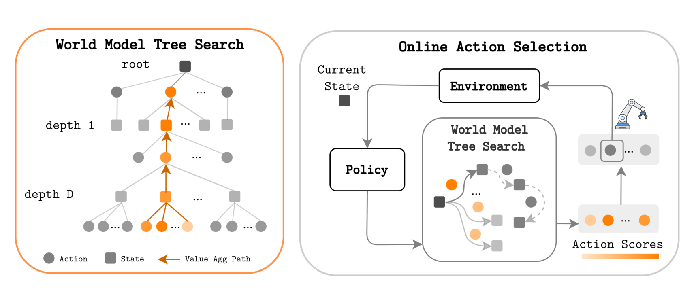
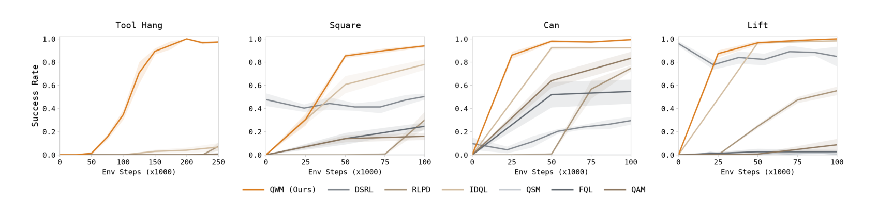
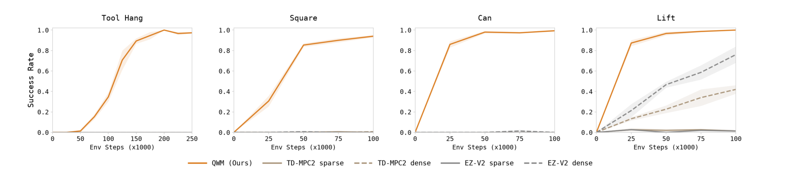
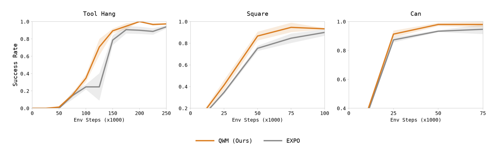
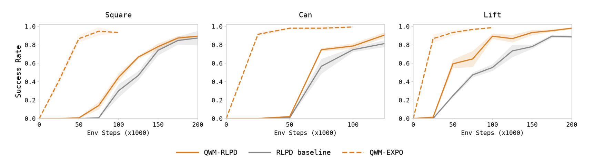
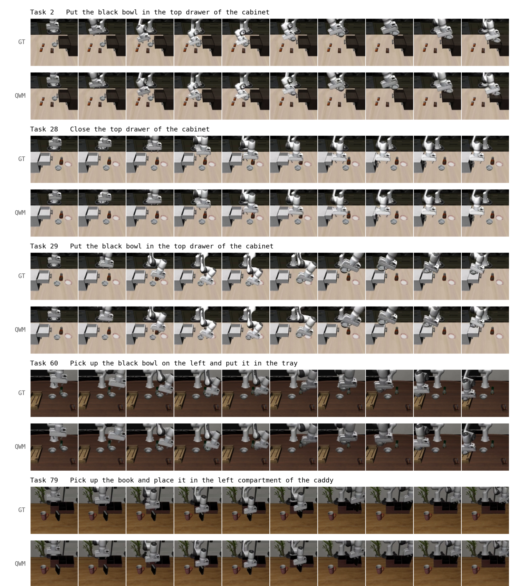
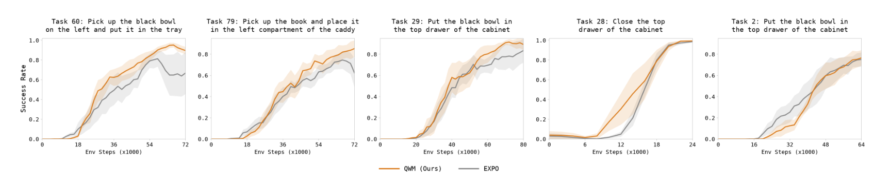
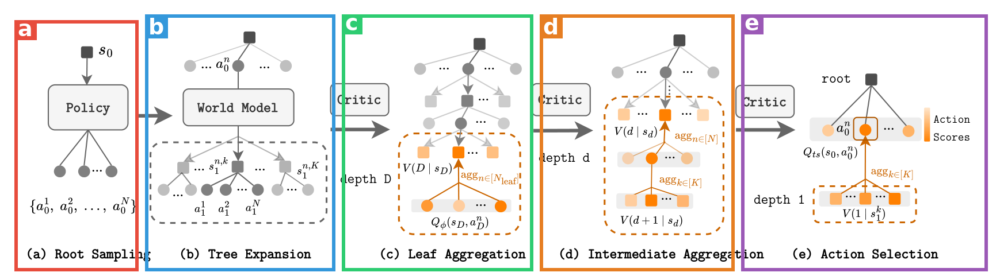
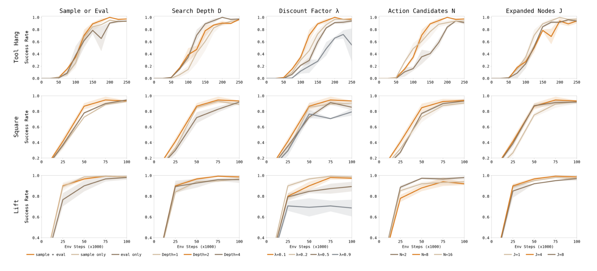

# Q-Learning With World Models (QWM)

| 项目 | 内容 |
|---|---|
| 题目 | Q-Learning With World Models |
| 作者 | Perry Dong*†（Stanford，通讯）、Yueru Jia*（北大）、Chelsea Finn（Stanford）、Dorsa Sadigh（Stanford）；* 共同一作 |
| arXiv | <https://arxiv.org/abs/2608.17163> |
| 发布日期 | 论文 v1 提交 2026-08-17（未发现工作本体更早的公开渠道——无模型发布/博客/demo） |
| 代码/主页 | **未找到**（论文全文、arXiv 页均无链接，网络检索亦未见官方仓库） |

**结构速览**：

- §1 Introduction：提出核心问题——世界模型能否**不进训练环节**、只在决策时使用，就能提升在线 Q-learning
- §2 Related Work：四条线——离线数据加速在线 RL / model-based RL 三大家族（Dyna 造数据、想象内训策略、决策时规划）/ 世界模型×VLA / test-time scaling（best-of-N）
- §3 Preliminaries：MDP 记号 + 两个 base 算法（EXPO、RLPD）的目标函数
- §4 Method：树构造（4.1）→ 双估计器价值聚合（4.2）→ Q 引导的束搜索式剪枝（4.3）→ 两种世界模型实例化（4.4：state 用 MLP 残差模型、pixel 用 Wan2.2-TI2V-5B 微调）
- §5 Experiments：Q1 对比 model-free / model-based 基线；Q2 对比 base 算法本身；Q3 pixel 设定扩展；Q4 消融
- §6 Discussion：局限——搜索的推理开销、世界模型训练成本
- §7 Acknowledgments
- 附录：A 作者贡献 / B "用 V 搜索 vs 用 Q 搜索"对照实验 / C 超参数（C.1）、环境（C.2）、世界模型训练细节与预测质量（C.3）、baseline 逐个说明（C.4）

---

## 第1章 · 作者与实验室背景评估

### 作者背景表

| 作者 | 角色 | 单位 | 主方向 | 主页 |
|---|---|---|---|---|
| Perry Dong | 共同一作 + 通讯 | Stanford CS PhD（IRIS 实验室） | 机器人在线 RL / RL 微调 | 个人主页未找到（pd-perry.github.io 根页 404，仅有项目页）；[Google Scholar](https://scholar.google.com/citations?user=3Eu7CagAAAAJ&hl=en) |
| Yueru Jia | 共同一作 | 北京大学计算机学院硕士生（导师张尚行） | 机器人操作 + 生成式 AI | [个人主页](https://jiayueru.github.io/) |
| Chelsea Finn | 导师 | Stanford 教授，IRIS 实验室负责人，Physical Intelligence 联创 | 机器人学习 | [个人主页](https://ai.stanford.edu/~cbfinn/)，[IRIS 实验室](https://irislab.stanford.edu/) |
| Dorsa Sadigh | 导师 | Stanford 副教授，ILIAD 实验室负责人 | 人机交互 / 机器人学习 | [个人主页](https://dorsa.fyi/) |

### 事实（发表记录）

**Perry Dong 的近两年发表流水线**（全部见本文参考文献，均可点开）：RLIF（交互式模仿学习即 RL，2024，Berkeley 时期与 Sergey Levine 合作）→ [隐式模仿引导 RL（2025a）](https://arxiv.org/abs/2506.07505) → [EXPO（2025b）](https://arxiv.org/abs/2507.07986) → [批量在线 RL（2025c，ICLR 2026）](https://arxiv.org/abs/2505.08078) → [EXPO-FT：VLA 的 RL 微调（2026a）](https://arxiv.org/abs/2605.25477) → [TQL：Transformer 化 Q 函数（2026b）](https://arxiv.org/abs/2602.01439) → [在线 RL 微调要不要预训练 Q（2026c）](https://arxiv.org/abs/2607.27203) → [FASTER：值引导采样（2026d）](https://arxiv.org/abs/2604.19730) → [Value Flows（2026e）](https://arxiv.org/abs/2510.07650)。本科/硕士在 UC Berkeley（2024 年 EECS 技术报告），现 Stanford PhD。

**Yueru Jia**：北大硕士（2024 级），此前工作在生成式图像编辑与操作策略侧——DesignEdit（AAAI 2025，一作）、Lift3D（CVPR 2025，共一）、Video2Act（共一）、WoW 世界模型（共作者）、RwoR（IROS 2025，共作者）。这是她**首篇 RL 微调方向**的工作，但有世界模型（WoW）与视频生成的积累，与本文 pixel 侧（Wan2.2 视频世界模型改造）职责吻合；附录 A 也写明她负责代码库维护、实验与图表。

**实验室方向**：Finn 的 IRIS 与 Sadigh 的 ILIAD 近年在"在线 RL 微调机器人策略"上是持续、密集投入（上面 Perry Dong 的 9 篇几乎全部由 Finn+Sadigh 共同署名）；世界模型侧 Finn 组同期还有 VLAW（Guo et al. 2026）、Cosmos Policy（Kim et al. 2026）。判定：**传统强方向**——"RL 微调"是这条线自己的主场，"世界模型"是实验室正在加码的新分支，本文正是两者的交点。

### 推断（水毕业可能性）

风险信号逐条核对：一作无相关积累？**否**（9 篇同方向连续产出，EXPO 正是本文 base 算法）。导师主业不在此方向？**否**。实验室无持续投入？**否**。单位无积累？**否**。——四项全部阴性，**水毕业风险极低**。依据：这是一条典型的"自家算法栈上继续叠积木"的工作（EXPO → QWM），产出动机是推进自己的算法体系而非凑数。风格上更像快速抢占"世界模型×Q-learning"生态位的 arXiv 首发（v1 刚挂出，无代码、统计报告单薄——见第3章盲审）。

---

## 第2章 · 论文类型判定

**结论：a+b 型 + 一处原创模块**——a =现成的 off-policy Q-learning 算法（EXPO / RLPD），b = 现成骨干改造的动作条件世界模型（Wan2.2 / 自训 MLP），原创模块 = 把两者接起来的"Q 引导束搜索 + 双估计器价值聚合"决策时搜索层（论文不用世界模型产生任何训练数据，这个"只在测试时用"的接法是全文核心主张）。

组件清单（均为方法节实际承担流程环节、且在参考文献中真实存在的引用）：

| 组件 | 原论文 | 在本文中承担的角色 |
|---|---|---|
| EXPO | [Dong et al., 2025](https://arxiv.org/abs/2507.07986) | base 算法 1：base policy + edit policy + OTF 选择，提供策略与 critic（§3） |
| RLPD | [Ball et al., 2023](https://arxiv.org/abs/2302.02948) | base 算法 2：对称采样 + 高 UTD + critic 集成，提供策略与 critic（§3） |
| SAC 熵正则目标 | [Haarnoja et al., 2018](https://arxiv.org/abs/1801.01290) | RLPD 的 actor 训练目标（§3 式 4） |
| Wan2.2-TI2V-5B | [Wan et al., 2025](https://arxiv.org/abs/2503.20314) | pixel 设定的世界模型骨干：加 MLP 动作编码器微调成动作条件视频模型（§4.4） |
| IDQL 式 best-of-N | [Hansen-Estruch et al., 2023](https://arxiv.org/abs/2304.10573) | 概念上的直接前身（一步 best-of-N by Q），QWM 把"一步"推广为"多步想象"（§2、§5.1） |

疑似借鉴（论文未作为组件引用，仅相关工作中对照）：MCTS/MuZero 家族与 TD-MPC 系的决策时规划（[Hansen et al., 2024](https://arxiv.org/abs/2310.16828)、[Schrittwieser et al., 2020](https://arxiv.org/abs/1911.08265)）——树搜索+价值引导的思想同源，但本文的树构造/剪枝是自己的轻量实现，不复用其代码或算法细节。盲审（第3章 W3）指出还存在论文未引的更近先例（Hamrick et al. 2020, "Combining Q-Learning and Search with Amortized Value Estimates"），此点成立。

---

## 第3章 · 双盲评审 + Rebuttal

### 3.1 初审意见（由隔离上下文的盲审 agent 独立生成）

> **Summary**：QWM 在标准 off-policy Q-learning 之上叠加"世界模型测试时搜索"：每个决策步由策略提出 N 个候选动作，世界模型向前想象构成搜索树，用 Q 函数与树上聚合值打分选动作；搜索同时用于在线采集与评测，策略与 critic 只在真实转移上训练。在 EXPO/RLPD 上实例化，于 Robomimic（state）与 LIBERO（pixel，Wan2.2 改造视频世界模型）上评测。
>
> **Strengths**：核心思想清晰、实现简单，动机（避免 compounding model bias）明确；§4.2 双估计器互补性分析自洽；与 base 算法的受控对比（Fig 4/5）是全文最干净的证据，附录 B 还有 search-with-V 对照；消融覆盖面全；把 5B 视频模型改造成动作条件世界模型接入在线 RL 采样工程上不平凡；Discussion 对局限的陈述较诚实。
>
> **Weaknesses**：
> - **W1 统计报告全面缺失**：全文无 seed 数、无评测 episode 数、无误差带定义、无统计检验，却使用 "significantly outperforms"——对以学习曲线为全部证据形态的论文是致命伤。
> - **W2 与 model-based 基线协议不对等**：QWM 有示教数据预训练世界模型 + offline ratio 0.5 + UTD 20；EZ-V2 按官方协议 UTD 0.4，TD-MPC2 是否拿到示教数据未说明。稀疏奖励下"没示教就学不会"几乎必然，Fig 3 说明不了方法优势，"outperforms SOTA model-based" 失去支撑。
> - **W3 新颖性定位失公**：TD-MPC/TD-MPC2 本就是"决策时规划 + 价值在真实转移上 TD 训练"，与 QWM 核心卖点高度重合；实际差异只在观测空间建模、用 Q 而非 V+reward 打分、策略提议动作构树。"Q-learning+搜索"已有直接先例（Hamrick et al., ICLR 2020）未被引用。剥离 SOTA claim 后属既有组件重组的增量贡献。
> - **W4 无测试时算力对齐对照**：QWM 每步 N×K×D 量级查询 vs 基线一次前向；IDQL 的 N 未报告未对齐，无法区分增益来自"看未来"还是"多花算力"。
> - **W5 多处自相矛盾**：(a) 正文说 D=2、λ=0.2 最优，Table 2 默认 D=4、λ=0.1，加上 C.1 "λ 应乘 1/2" 的换算说明，主实验配置无法确认；(b) state 版世界模型是确定性 MLP，Table 2 却设 K=8 个"world-model samples"；(c) 默认 J=1，所谓 tree search 实际是每根候选一条贪心路径，与 Fig 2 呈现落差大；(d) 交叉引用错乱（5.2 引 Fig 6 应为 Fig 5、5.3 引 Fig 4 应为 Fig 7、第 7 页图无编号、C.1 引 §4.4 应为 §4.3）。
> - **W6 复现性未达门槛**：无任何代码/数据可得性声明；LIBERO 的树搜索超参未给；实际实现中 rψ≡0（稀疏奖励不学 reward model），运行的方法与公式呈现版本不同。
> - **W7 选择性报告风险**：LIBERO 只评 5 任务且仅以"follow prior work"为选择依据；"visual results can be even stronger" 属外推推测；核心机制主张"避免 compounding bias"从未被直接检验（无 Dyna 式对照）。
>
> **评级：reject**。理由：剥离被 W1/W2 削弱的 SOTA claim 后，可支撑结论是"仿真操纵上测试时模型搜索能提升 EXPO/RLPD 的样本效率"——对子领域有意义的增量，但与 TD-MPC2 系概念重合度高，未达期刊要求的实质推进；且零统计、协议不对等、配置矛盾、代码不可得使主要 claims 仅部分获得支撑。补齐后可成扎实的 ML 会议论文，但贡献量级不变，故不以补实验为条件转 revision。

### 3.2 Rebuttal（作者方，一轮）

**承认的批评清单（＝本文真正硬伤一览）**：

1. **W1 成立**：全文确实无 seed 数、episode 数、误差带定义与统计检验，"significantly" 无检验支撑。
2. **W5(a) 成立**：Table 2 默认 D=4、λ=0.1 与正文"D=2、λ=0.2 最优"矛盾，主实验实际配置在现稿中无法唯一确定。
3. **W5(d) 成立**：四处交叉引用错误全部属实。
4. **W6 成立**：无代码/数据可得性声明；LIBERO 树搜索超参缺失；N 消融最终取值只写"a moderate number"。
5. **W7 部分成立**："visual results can be even stronger" 是外推推测；compounding-bias 机制主张缺少 Dyna 式直接对照。

**辩护要点**（论据全部来自论文内部）：

- **W2**：UTD 不对齐并非任意设置——C.1 明确 EZ-V2 按官方推荐协议（UTD 0.4）跑；对不同算法家族强行拉平 UTD 可能反而损害基线（高 UTD 需配套正则化，正是 RLPD 的核心设计点）。且论文已为 model-based 基线额外提供 dense reward 变体，并非只在最不利设定下报告。承认：示教数据是否给到 TD-MPC2/EZ-V2 未说明，应补 demo-bootstrapped 对比。
- **W3**：Related Work 未回避决策时规划家族（§2 明确单列并点名 Hansen et al. 2022/2024 及其 terminal value）；QWM 与 TD-MPC2 的实质差异文中有据：Q 函数就是 base 算法自身的 critic，在**原始观测空间**的真实转移上训练，世界模型与 RL 训练完全解耦，而非与动力学联合训练的 latent 价值；附录 B 的"V 搜索 vs Q 搜索"对照（Fig 8/9）正是对该差异点的实验支撑。承认：导言对 TD-MPC 系的一笔带过刻画不公，Hamrick et al. 2020 应补引。
- **W4**：IDQL 基线本身就是"一步 best-of-N by Q"（C.4），§5.1 的对比已部分回答"看未来 vs 只看一步"，只是预算未对齐使证据不完整——是需补强而非从零缺失。
- **W5(b)**：K 的设计动机针对一般（含随机）世界模型；pixel 设定的扩散模型（1 步去噪随机采样）K>1 有实义；state 设定下 K=8 退化为相同预测、正文未说明，承认是写作缺陷。
- **W5(c)**：按 §4.3 定义剪枝以**每个根动作**为单位（B0 为单根路径），J=1 时根层面对 N=8 个候选的搜索比较仍然存在，并非整树退化为一条路径；且 J 消融（J=1/4/8）如实报告了不敏感。承认："tree search" 之名与"每候选单路径 rollout"之实之间的呈现落差应明示。
- **W6 中 rψ 一点**：§4.4 已明确声明稀疏奖励下不学 reward model，非隐瞒；承认应把退化后的实际公式写出来。

### 3.3 审稿人二轮回复 + 最终评级

逐条裁决（维持 / 撤回）：

| 条目 | 裁决 | 要点 |
|---|---|---|
| W1 统计缺失 | **维持** | 只能靠补实验修复，rebuttal 无法论证消解 |
| W2 model-based 协议 | **核心维持，UTD 分论点撤回** | 接受"EZ-V2 按官方协议、强行拉平 UTD 未必更公平"的辩护，撤回 UTD 指控；但**示教数据不对等**（QWM 有示教预训练+持续采样，基线未说明）足以单独解释 Fig 3 基线全零，"outperforms SOTA model-based" 仍不成立 |
| W3 新颖性 | **维持，措辞局部修正** | 承认 §2 未回避规划家族、附录 B 确有 V-vs-Q 对照；但 §2 末句仍把决策时规划一并划入"在想象 rollout 上训练"、刻画失准；且论文自己承认附录 B 的对照是混杂的（估计器与 base 算法同时变）——不能干净支撑差异点。贡献量级判断不变 |
| W4 算力对齐 | **维持** | 接受"IDQL 已部分回答"的澄清、措辞微调；但查询数/wall-clock 全缺，归因仍无法确立 |
| W5(a) 配置矛盾 | **维持** | 作者完全承认 |
| W5(b) K=8 | **部分撤回** | pixel 下 K>1 有实义，撤回"深层设计矛盾"暗示；降级为报告缺陷（state 表中 K=8 无意义且无说明） |
| W5(c) J=1 | **部分撤回** | 接受"剪枝以每根候选为单位、根层面 N=8 比较仍在"的读法，撤回"整树退化单条路径"的过强表述；维持"呈现落差须明示" |
| W5(d) 交叉引用 | **维持** | 事实性错误清单 |
| W6 复现性 | **维持** | rψ 一点接受澄清；主体（无代码声明、LIBERO 超参缺失）无法不修稿化解 |
| W7 选择性报告 | **维持** | 协议沿用部分缓解 cherry-picking 疑虑，但不能替代正面选择标准 |

**最终评级：reject（维持初审）**。审稿人评价："rebuttal 质量高、态度诚实，成功修正了三处过强表述，但这些修正均属边缘——两条决定性缺陷（统计报告全面缺失、示教数据不对等）被作者完全或核心承认，证据水位没有因 rebuttal 上移；剥离不成立的 SOTA claims 后，可支撑的结论仍是子领域层面的增量组合。补齐多 seed 统计、公平化基线、算力对齐对照与代码公开后，可成为一篇扎实的 ML 会议投稿，但不改变其相对本刊水位的位置，故不转 major revision。"

> 备注：以上为对旗舰刊（Science Robotics 水位）标准的盲审结论；对 ICLR/ICML 类 ML 会议，审稿人两轮均明示"补齐后可成扎实投稿"。

---

## 第4章 · 大白话：这篇文章在做什么

**场景**：机器人在真实环境里边试边学（在线强化学习/RL 微调）。每一次真实尝试都又慢又贵，所以大家拼的是"样本效率"——用尽量少的真实交互把抓取、插销这类操作任务学到接近满分。

**之前的方法**：两条路各有难处。model-free 的 Q-learning（如 EXPO、RLPD）每一步只让策略吐一个动作就执行，动作好不好全凭当下 Q 函数的判断，策略没优化到位就选不出好动作；model-based RL 则用世界模型"造数据"或干脆在想象里训练策略，省了真实交互，但模型不准的地方会被训练不断放大（compounding bias），任务越长、画面越复杂越糟。

**本论文的方法**：世界模型**不参与训练，只当决策时的沙盘**。每一步让策略提出 8 个候选动作，世界模型往前推演几步"如果这么做会发生什么"，Q 函数给每条推演打分，挑总分最高的动作去真实环境执行。训练侧完全不变、只用真实数据——既躲开了模型偏差进训练的坑，又白赚了"提前看几步"带来的选动作提升。

**图 1 汉化**（按阅读顺序）：左半"World Model Tree Search（世界模型树搜索）"——从 root（当前状态，方块）出发，策略提出候选动作（圆点），世界模型想象下一状态（方块），一层动作一层状态交替展开到深度 D；橙色高亮路径是"Value Agg Path（价值聚合路径）"，即分数从深层往根部回传的通道；图例：圆点=动作、方块=状态。右半"Online Action Selection（在线动作选择）"——Current State（当前状态）进入 Policy（策略），策略的候选动作交给"世界模型树搜索"打分得到 Action Scores（动作分数，颜色越深分越高），选最高分动作交给 Environment（环境）里的机械臂执行，得到新状态后循环。关键一句（图注）：**树搜索用于在线采样和评测两个阶段，而策略与 critic 只在真实环境转移上训练**。

自查：不做 RL 的人可以把它理解成"下棋前在脑子里推演几步再落子，但复盘学习只用真实对局"。

---

## 第5章 · 实验

### 5.1 仿真实验

> 说明：本文**没有数值型主对比表**，所有主结果以学习曲线（success rate vs 环境步数）呈现，以下嵌入曲线图并汉化图注；文中引用的具体数字为从曲线目测的近似值，均已标注。

#### 5.1.1 Robomimic（state 观测，4 任务）

**场景大白话**：7 自由度机械臂 + 低维状态输入（末端位姿、夹爪、物体状态）。Lift → "把物体抓起来举高"；Can → "抓圆罐放到目标位置"；Square → "把方形螺母精准套到柱子上"；Tool Hang → "先搭好支架再把工具挂上去"（长程多阶段，最难）。奖励全部是稀疏的"完成才给分"。

**条件**（附录 C.1/C.2）：示教数据——Lift 用原数据集 10 条子集（故意调难）、Can 用 multi-human（MH）、Square/Tool Hang 用 proficient-human（PH）；所有方法 5000 步后开始训练、offline 数据比例 0.5、UTD=20、batch 256、无离线预训练；指标 = 在线评测成功率（论文未给评测 episode 数与 seed 数——见第3章 W1）。

**场景图**：论文未提供 Robomimic 任务场景截图，作者亦无项目主页可取图——**未找到场景图**（任务外观可参考 LIBERO 部分的 figs/wm_quality.png 风格自行想象，或查 Robomimic 官方文档）。

**对比 model-free 基线**（RLPD、DSRL、QSM、QAM、FQL、IDQL）：

图注汉化：QWM 与 model-free 基线的在线成功率曲线（横轴：环境步数×1000）。目测读数：Tool Hang 上 **QWM 一枝独秀**（200k 步到 ~1.0），全部基线几乎贴零；Square 上 QWM 50k 步 ~0.85，最强基线 IDQL 100k 步 ~0.78；Can 上 QWM 50k 步 ~0.97 vs IDQL ~0.92；Lift 上 DSRL 起点即高（~0.95），QWM 25k 步后追平并到 1.0。

**对比 model-based 基线**（TD-MPC2、EfficientZero V2，各配 sparse/dense 两版奖励）：

图注汉化（Figure 3）：QWM vs TD-MPC2 / EZ-V2。目测读数：**两个 model-based 方法在报告步数内除 Lift 外全部零成功**；Lift 上 EZ-V2 dense 版爬到 ~0.75、TD-MPC2 dense ~0.4，QWM 25k 步即 ~0.85。⚠️ 此对比的协议对等性被盲审重点质疑（第3章 W2：示教数据与 UTD 未对齐），数字解读需谨慎。

**对比 base 算法本身**（Q2）：

图注汉化（Figure 4）：EXPO vs QWM(EXPO)。Tool Hang 收益最大（150k 步 QWM ~0.9 vs EXPO ~0.8 且中段 EXPO 有 ~0.25 的深坑）；Square/Can 上 QWM 曲线整体左移（同样成功率提前 ~25k 步达到）。

图注汉化（Figure 5）：RLPD vs RLPD+树搜索（QWM-RLPD）vs QWM-EXPO（虚线参考）。三个任务上加树搜索都更快（Can 上 RLPD 50k 步才起步，QWM-RLPD 同期已 ~0.75）；但 QWM-EXPO（虚线）仍显著快于 QWM-RLPD——**base 算法越强，QWM 越强**。

#### 5.1.2 LIBERO（pixel 观测，5 任务）

**场景大白话**：语言条件的桌面操作（"把黑碗放进柜子顶层抽屉"这类指令），输入是 RGB 相机图（agent 视角+腕部相机双流），沿用先前工作（FASTER, Dong et al. 2026d）的 5 个任务（Task 2/28/29/60/79）。世界模型 = Wan2.2-TI2V-5B 微调的动作条件视频模型（细节见第6章 🟦 块）。**受算力限制，pixel 设定只在采样阶段用搜索、评测阶段不用**（§5.3）。

**场景图**（论文附录 Fig 10，兼作世界模型预测质量图）：

图注汉化（Figure 10）：五个任务各两行——GT 行 = 真实未来观测，QWM 行 = 世界模型按同样动作序列想象的未来。预测抓住了机械臂位形与物体位置的主要变化，但推演步数越多误差越明显（这正是正文坚持"短程推演"的原因）。

图注汉化（Figure 6）：QWM vs EXPO 在五个 LIBERO 任务上的在线成功率。目测读数：Task 60、79 收益最明显（60 上 QWM 末段 ~0.9 vs EXPO ~0.65 且 EXPO 末段回落）；Task 28 两者都到近满分但 QWM 更早；Task 2、29 相当或略优。

### 5.2 真机实验

**本文无真机实验**——全部实验在 Robomimic / LIBERO 仿真中完成。考虑到导言用"real-world robotics"作为动机（§1 第一段），真机缺席是一个明显的落差（盲审 Minor issues 亦点名）。项目主页：论文脚注/摘要无链接，网络检索未见——**未找到项目主页**。

### 5.3 为什么选这些实验

**共同特性**：全部是**稀疏奖励 + 有示教数据可用**的操作任务，且覆盖"从短程（Lift）到长程多阶段（Tool Hang）"的难度梯度。这不是巧合：

1. **稀疏奖励恰好豁免了 reward model**。QWM 的价值聚合公式里有一项世界模型的预测奖励 rψ（式 6/9），但 §4.4 声明稀疏设定下不学 reward model——即实际上 rψ≡0，价值全部由 Q 函数供给。如果选密集奖励的 benchmark（如 DMC/Meta-World），就必须真的学 reward model，方法的简洁性卖点会打折。反过来，稀疏奖励正是 TD-MPC2/EZ-V2 的弱项（论文自己承认"designed for dense rewards, struggles in sparse"，§5.1），Fig 3 中两者除 Lift 外全零。
2. **长程任务最能放大"提前看几步"的价值**。方法收益与任务长度正相关的证据：Tool Hang（最长程）上 model-free 基线全部贴零、QWM 独自到 ~1.0；对 EXPO 的增益也是 Tool Hang > Square > Can（Fig 4，图注原话 "larger gains on Tool Hang and Square"）。短平快的 Lift 上 QWM 与 DSRL 差距很小。
3. **有示教数据 → 世界模型可以离线预训练**。QWM 需要先有一个能用的世界模型（state 版在示教转移上 MSE 预训练 100k 步，pixel 版在示教视频上微调 200k 步，附录 C.3），这决定了它只能选自带高质量示教集的 benchmark。

**该测但没测的**：(a) **真机**——动机里的 "VLA RL 微调" 场景一个真机数字都没有；(b) **密集奖励连续控制主流套件**（DMC、Meta-World、MyoSuite 等 TD-MPC2 的主场）——完全缺席，意味着"QWM vs 决策时规划系"的正面交锋从未在对方的地盘上发生过；(c) LIBERO 只取 5/130 任务且未给选择标准（盲审 W7）。这些缺席共同指向：实验被圈定在"稀疏奖励+示教可得+仿真"这个对本方法最有利的三角区内。

### 5.4 复现可能性（硬核查）

逐项核查（每项只有"找到了（附出处）"或"没找到"两种状态）：

| 项目 | 状态 | 证据来源 |
|---|---|---|
| 代码仓库 | **没找到** | 论文全文无 URL；arXiv 页无 comments 链接；GitHub/网络检索无果（2026-08-19 查） |
| ckpt（逐场景） | **没找到** | Robomimic 4 任务、LIBERO 5 任务：均无任何权重发布的说法 |
| 世界模型权重 | **没找到** | state 版 MLP 与 pixel 版 Wan2.2 微调权重均未提及发布 |
| 原始数据 | **找到了（第三方）** | Robomimic/LIBERO 为公开 benchmark；demo 切分有说明：Lift=10 条子集、Can=MH、Square/Tool Hang=PH（附录 C.2） |
| RL 训练超参 | **找到了（部分）** | Table 1：start steps 5000、offline ratio 0.5、UTD 20、batch 256、γ=0.99、τ=0.005 |
| 树搜索超参（state） | **找到了** | Table 2：N=8、K=8、J=1、Nleaf=8、D=4、λ=0.1、中间层 max/叶层 mean 聚合 |
| 树搜索超参（LIBERO） | **没找到** | Table 2 标题明示只覆盖 state-based；pixel 版 N/K/D/J/λ 全部未给 |
| 世界模型训练细节 | **找到了** | C.3：state 版 Adam、lr 3e-4、batch 256、100k 步；pixel 版 AdamW、lr 1e-5、8 GPU、每卡 batch 1、bf16、梯度检查点、200k 步、推理 1 步去噪、取生成片段第 2 帧 |
| EXPO/RLPD 自身超参 | **没找到** | edit 幅度 β、熵系数 α、critic 集成数 M 等均未在本文给出（需回原论文+自行猜配） |
| seed 数 / 评测 episode 数 | **没找到** | 全文无（第3章 W1） |
| 硬件/训练时长（RL 部分） | **没找到** | 只有世界模型的 8 GPU；RL 在线训练的硬件与 wall-clock 未给 |

**结论：难以复现**。缺失项：代码、全部 ckpt、LIBERO 树搜索超参、base 算法超参、seed/评测协议、RL 硬件与时长、λ 的确切语义（正文 λ=0.2 最优 vs Table 2 λ=0.1 vs C.1 "应乘 1/2"三者矛盾，连该用哪个值都无法确定）。有利因素仅在于：两个 base 算法（EXPO/RLPD）与两个 benchmark 均有公开代码，世界模型结构简单，愿意自行补配的人可以搭出"形似"的系统，但无法对齐论文数字。

---

## 第6章 · 方法拆解

五个色框对应论文 Figure 2 的五个阶段（a–e），接口首尾相接：

🟥 **a · Root Sampling（根部采样）**——来源：base 算法自带策略（[EXPO](https://arxiv.org/abs/2507.07986) 的 base+edit 策略，或 [RLPD](https://arxiv.org/abs/2302.02948) 的高斯策略），非本文新造。接口：**进** 当前真实状态 s₀；**出** N=8 个候选动作 {a₀¹…a₀ᴺ}。训练时：随 base 算法在真实转移上正常训练（QWM 不改动）。部署时：每个环境步都跑一次。

🟦 **b · Tree Expansion（世界模型展开）**——来源：state 版是作者自训的 3 层 MLP 残差动力学模型（M(s,a)=s+Δ(s,a)，隐层 256）；pixel 版是 [Wan2.2-TI2V-5B](https://arxiv.org/abs/2503.20314) 视频生成模型改造：加一个 3 层 MLP 把机器人动作编码成 token、与文本 token 拼接喂给扩散 Transformer。接口：**进** 状态 + 候选动作；**出** 每个动作 K=8 个想象的下一状态，递归展开到深度 D。训练时：state 版在示教转移上 MSE 预训练（lr 3e-4，100k 步）后**冻结**；pixel 版在示教视频+动作序列上用 Wan2.2 原生 flow-matching 目标微调（VAE 和文本编码器冻结，lr 1e-5，200k 步）。部署时：pixel 版 1 步去噪生成 5 帧 128×128 片段、取第 2 帧当"下一观测"再递归；state 版直接前向。注意：**它不产生任何训练数据，只在决策时被查询**。

🟩 **c · Leaf Aggregation（叶层聚合）**——来源：base 算法自带的 critic Qϕ（真实数据 TD 训练，QWM 不改）。接口：**进** 树最深层的想象状态 s_D；**出** 该状态的价值——在 s_D 上再采 Nleaf=8 个动作、取它们 Q 值的均值（式 7，Table 2 叶层用 mean）。

🟧 **d · Intermediate Aggregation（中间层聚合）**——来源：作者原创（本文核心模块）。每个中间状态的价值 = 两个估计器各打一半：V_Q（当场用 Q 打分，不吃模型误差但全靠 Q 准）+ V_r（沿想象轨迹算"奖励+λ×未来价值"，用上了推演但误差随深度累积）（式 5–8）。实操细节：稀疏奖励下不学 reward model（rψ≡0），λ=0.1~0.2 的小权重意味着"以短期估计为主、未来只小比例掺入"；同层多动作/多样本用 max 聚合。接口：**进** 叶层与下层回传的价值；**出** 逐层往根部回传的折扣聚合价值。

🟪 **e · Action Selection（动作选择）**——来源：作者原创。每个根候选动作得到树搜索总分 Qts(s₀,a₀ⁿ)=½[Q(s₀,a₀ⁿ) + (r+λ·下层聚合价值)]（式 9），取 max（或 softmax）选出动作交给**真实环境**执行。配套的剪枝机制（§4.3）：树太大展不完，就按"累计折扣 Q 和"做束搜索，每根候选只保留 J=1 条最优路径继续展开——所以默认配置下每个候选动作实际是"一条 Q 引导的贪心推演"而非满树（消融显示 J=1/4/8 性能几乎无差）。

**接口串联自查**：a 出候选动作 → b 吃（状态,动作）出想象状态 → c 给最深层想象状态定价 → d 把价值逐层折扣回传 → e 汇总成每个根候选的总分并择优 → 选中动作进真实环境 → 新真实状态回到 a。训练数据流（真实转移 → replay buffer → 策略/critic 更新）与搜索完全解耦，闭环成立。

---

## 第7章 · 消融

本文消融（§5.4 + Figure 7 + 附录 B）全部以曲线呈现、无数值表，按行语境化重述（数字为曲线目测）：

图注汉化（Figure 7）：5 列消融 × 3 行任务（Tool Hang / Square / Lift），橙色实线为默认配置。

| 消融项（人话） | Takeaway |
|---|---|
| 搜索只用在采样 / 只用在评测 / 两边都用 | 两边都用最稳最快；只采样或只评测都会慢半拍（Tool Hang 上 eval-only 中段有 ~0.6 的深坑）。说明"采到更好的数据"和"执行时选更好的动作"是两份互补的收益 |
| 推演深度 D=1/2/4 | **正文结论 D=2 最好**：D=1 看不清后果学得慢，D=4 开始吃世界模型的累积误差。⚠️ 但 Table 2 默认 D=4，与此矛盾（盲审 W5a，作者方 rebuttal 已承认） |
| 未来价值权重 λ=0.1/0.2/0.5/0.9 | 小权重（0.1–0.2）最好；λ=0.9 灾难性掉分（Tool Hang 末段 ~0.55、Lift 全程 ~0.7 垫底）。说明想象出来的未来只能"小比例参考"，重仓未来=重仓模型误差 |
| 候选动作数 N=2/8/16 | 中等最好（默认 8）：N=2 候选太少搜索没意义，N=16 无增益还放大误差与算力。最优 N 依环境而定 |
| 保留路径数 J=1/4/8 | 几乎无差——贪心保留 1 条高价值路径就够。侧面说明起作用的是"每个候选往前看一眼"，不是"把树展开得多茂盛" |
| （附录 B）用状态价值 V 搜索 vs 用 Q 搜索 | V 版（AWR 式）全面大幅落后（Fig 8/9）。说明动作条件的 Q 是搜索质量的关键供给，也是"QWM 建在 Q-learning 上而非 V 上"的立论实验 |

**消融配图已含于上图**；无单独消融表可汉化。整体评价：消融覆盖面在同类论文中算全的（两阶段、D、λ、N、J、V-vs-Q 六项俱全），但与主实验共享"无 seed/无统计"的缺陷，且 D、λ 的最优值与默认值矛盾未解释——这两点已被盲审归入 W1/W5，构成实质扣分项。
