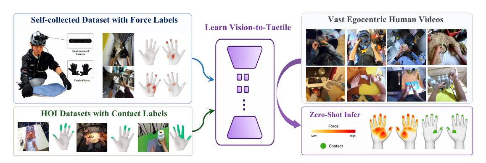
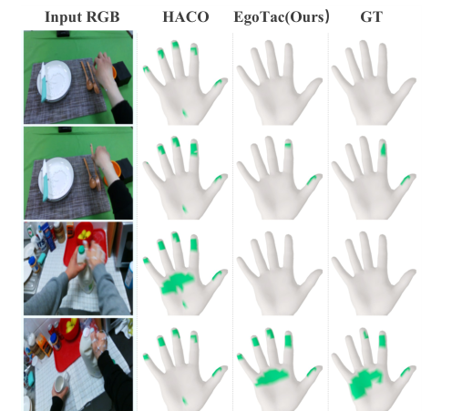
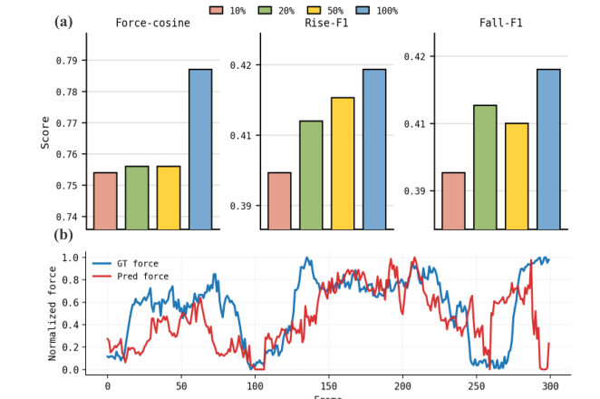
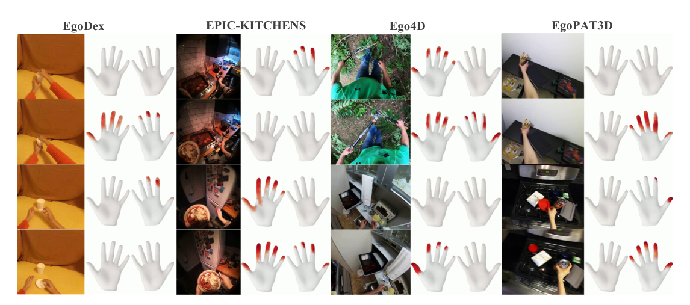
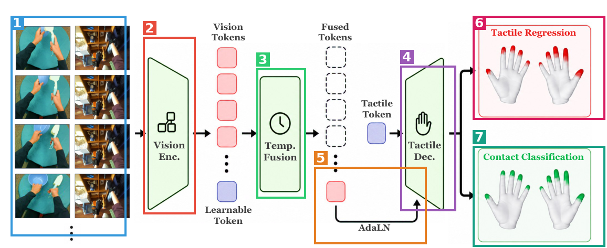
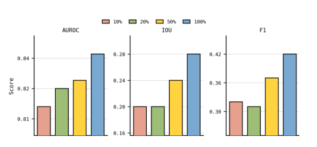

# EgoTac: In-the-wild Tactile Prediction from Egocentric Vision

| 项 | 内容 |
|---|---|
| 题目 | EgoTac: In-the-wild Tactile Prediction from Egocentric Vision |
| 作者 | Wenkang Zhang¹²、Chengbo Yuan³、Zicheng Zhang⁴、Zhengxue Cheng²、Yang Gao¹³\*（¹上海期智研究院 ²上海交通大学 ³清华大学 ⁴复旦大学，\*通讯） |
| arXiv | [2608.15060](https://arxiv.org/abs/2608.15060)（cs.CV, cs.RO） |
| 发布日期 | 论文 v1 2026-08-15（未发现更早公开的模型/博客/demo；一作 CV 显示投稿 NeurIPS 2026） |
| 代码/主页 | 未找到（论文全文无任何 URL；作者 GitHub、Hugging Face、X 均查无 EgoTac 仓库/主页/宣传帖） |

**结构速览**：
- §1 Introduction：人类视频缺触觉 → 提出"视觉→触觉"预测问题，三条贡献（数据集/模型/评测）
- §2 Related Work：2.1 第一视角 HOI 数据集综述（Table 1 对比 18 个数据集）；2.2 视觉预测触觉的既有方法
- §3 数据集：统一 MANO 顶点标注格式；自采 EgoTac-SC（触觉手套+头戴相机，3.9M 帧/24 环境）；8 个已有 HOI 数据集的接触标签转换
- §4 方法：问题形式化（RGB 片段→双手 1556 顶点力+接触）；DINOv2 编码器+时序融合+AdaLN 解码器；力-接触联合训练（4 项 loss）
- §5 实验：域内力/接触评估与消融（Table 2/3）、OOD 接触（Table 4）与 OpenTouch 力动态（Fig 6）、零样本定性（Fig 7）、数据 scaling（Table 5/Fig 8）
- §6 Conclusion
- 附录：B 自采数据集细节（硬件/后处理/手套→MANO 映射）；C 其他数据集处理；D 实现细节（增广/采样/loss 公式/超参表 X1）；E 指标定义；F 补充实验（频域评估、数据集消融 X4/X5、Lcons 消融 X6）；G 讨论（手套域差距、接触数据为何帮力预测、架构新颖性自述）；H 局限与社会影响

---

## 第1章 · 作者与实验室背景评估

### 作者背景表（事实）

| 作者 | 单位/身份 | 主页 | 与本文相关的记录 |
|---|---|---|---|
| **Wenkang Zhang（一作）** | 上海交大电子工程**本科生**（2022-2026 级，GPA 专业第 2），上海期智研究院实习背景 | [个人主页](https://mr-zwkid.github.io/)（模板状态，Publications 区为空）· [GitHub](https://github.com/Mr-Zwkid) · Google Scholar 未找到 | 一作 AAAI 2026 论文 D-FCGS（[arXiv 2507.05859](https://arxiv.org/abs/2507.05859)，动态高斯泼溅压缩）；三作 OmniVTLA（[arXiv 2508.08706](https://arxiv.org/abs/2508.08706)，触觉 VLA）；FTP-1 第 10 作者（[arXiv 2606.13102](https://arxiv.org/abs/2606.13102)，同团队触觉基础策略）；2025 暑期在帕西尼感知（触觉传感器公司）实习 |
| **Chengbo Yuan（二作）** | 清华叉院硕士生（高阳组） | [个人主页](https://michaelyuancb.github.io/) · [Scholar](https://scholar.google.com/citations?user=ehrpcBwAAAAJ) | MotionTrans（ICRA 2026）与 FTP-1 的一作，方向 embodied AI / 人类数据 / 触觉操作 |
| **Zicheng Zhang（三作）** | 复旦大学 | **未找到主页**（注意与上交大做图像质量评价的同名者区分，无证据同一人） | FTP-1 二作（同团队核心成员） |
| **Zhengxue Cheng（四作）** | 上交大图像通信研究所助理研究员（2024 入职，早稻田 PhD，前蚂蚁集团） | [SJTU Media Lab 页](https://medialab.sjtu.edu.cn/author/zhengxue-cheng/) | 主方向学习式媒体压缩/质量评价，近期扩展到触觉 VLA（OmniVTLA 一作）；**是一作在 SJTU 的 RA 导师**（一作 CV 明确写明） |
| **Yang Gao（通讯）** | 清华叉院助理教授 + 上海期智研究院 PI + Spirit AI（千寻智能）联合创始人；清华本科 → Berkeley PhD（Trevor Darrell）→ Darrell/Abbeel 博后 | [个人主页](https://yang-gao.weebly.com/) · [IIIS 页](https://iiis.tsinghua.edu.cn/en/gaoyang) · [Scholar](https://scholar.google.com/citations?user=bo0P2qYAAAAJ) | 代表作：EfficientZero（NeurIPS 2021）、Data Scaling Laws in Imitation Learning（ICLR 2025）、FP3（ICRA 2026 Best Paper Finalist）、General Flow（CoRL 2024） |

### 实验室主方向判定：传统强方向的交汇点

高阳组近两年在本文两条支线上都有密集产出（来源：[组主页 publications](https://yang-gao.weebly.com/publications.html)）：

- **人类视频/egocentric 线**：MotionTrans（ICRA 2026）、UniDex: Universal Dexterous Hand Control from Egocentric Human Videos（CVPR 2026）、Self-Supervised Monocular 4D Scene Reconstruction for Egocentric Videos（ICCV 2025）、General Flow（CoRL 2024）、Become a Proficient Player... Watching Pure Videos（ICLR 2023）
- **触觉/灵巧手线**：FTP-1（arXiv 2026，本文一二三作+通讯同团队）、Spatially-anchored Tactile Awareness（ICRA 2026）、KineDex（CoRL 2025）、DexCatch（CoRL 2024）；高阳本人 2016 年博士期间就发过 Deep Learning for Tactile Understanding from Visual and Haptic Data（ICRA 2016）

**判定：传统强方向**。EgoTac 是"egocentric 人类数据 × 触觉"两条已确立产线的自然交汇，配套的 FTP-1（触觉基础策略）暗示这是组内触觉数据飞轮的上游一环，不是孤立试水。

### 一作画像与水毕业风险核对（推断，注明依据）

- 一作是**本科生**（大四），此前唯一一作论文是 3D 压缩方向（D-FCGS），**EgoTac 是其首篇一作的触觉/机器人学习工作**；但并非零积累——有 OmniVTLA 三作、FTP-1 参与和触觉传感器公司实习（依据：CV + arXiv 记录交叉验证）。
- 风险信号逐条核对：一作无相关积累？**部分成立**（首篇一作，但有参与式积累）。导师主业不在此方向？**不成立**（通讯高阳的组两条产线都对口；四作 Cheng 主业是压缩，但她是 SJTU 侧联合指导人，触觉线上也有 OmniVTLA）。实验室无持续投入？**不成立**。单位无积累？**不成立**（期智+清华叉院在具身智能领域积累深厚）。
- **水平预判（推断）**：这不是水毕业作品，而是强组给强本科生练手的"数据工程+scaling 验证"型项目——工程量大（自建手套采集 3.9M 帧）、方法保守（论文附录 G 自认架构无新组件）、定位是组内触觉数据生态的上游供给。可信度预期：数据集贡献实、模型贡献薄、claim 可能偏大（后被盲审证实，见第3章）。

⚠️ 本章内容未进入第3章盲审上下文。

---

## 第2章 · 论文类型判定

**结论：实验（系统）型（数据集工程为主体）+ a+b 型模型（全部组件为已有技术拼装，论文附录 G 自认"不引入新 Transformer 原语"）。**

方法节中实际承担流程环节的组件：

| 组件 | 原论文 | 在本文中承担的角色 |
|---|---|---|
| MANO 手模型 | [Embodied Hands (SIGGRAPH Asia 2017)](https://arxiv.org/abs/2201.02610) | 统一输出空间：所有数据源的力/接触标注都落到每手 778 顶点的 MANO 网格上（§3.2） |
| UniTacHand 的手套→MANO 映射 | [arXiv 2512.21233](https://arxiv.org/abs/2512.21233) | 自采手套 132 通道力读数按预定义区域块+双线性权重摊到 MANO 顶点（附录 B.2 "Following [45]"） |
| HACO 的网格距离接触标签法 | [arXiv 2505.11152](https://arxiv.org/abs/2505.11152)（NeurIPS 2025） | 7 个无力标注 HOI 数据集的接触标签生成：手-物网格最近距离 <1cm 判接触（附录 C.1 "following [21]"）；同时是 OOD 对比的 SOTA 基线 |
| DINOv2-Base ViT | [arXiv 2304.07193](https://arxiv.org/abs/2304.07193) | 视觉编码器，0.1× 学习率联合微调（§4.2、表 X1） |
| OpenTouch 数据集 | [arXiv 2512.16842](https://arxiv.org/abs/2512.16842) | 训练语料成分之一 + OOD 力动态评测集（§3.4、§5.3） |
| 8 个 HOI 数据集（HOT3D/TACO/HOI4D/H2O/ARCTIC/OAKINK2/FPHA + OpenTouch） | 各自原文（见论文 Table 1 引用） | 接触监督语料（前 5 个进训练集）+ OOD 评测（OAKINK2/FPHA） |
| AdamW | [ICLR 2019](https://arxiv.org/abs/1711.05101) | 优化器 |

**疑似借鉴（论文未引用，不算组件）**：
- **AdaLN 条件化**（式 3 的 `(1+γ(z))⊙h+β(z)` 正是 DiT 的 adaLN-Zero 风格调制）——DiT（Peebles & Xie, Scalable Diffusion Models with Transformers）未被引用；
- **可学习 query token 解码**（tactile query tokens 逐层更新后过预测头）是 DETR 式设计——DETR 未被引用。

原创部分：EgoTac-SC 数据集（自建手套硬件采集 3.9M 帧）、力-接触双头+有效性掩码+一致性损失的混合监督训练配方（§4.3）。

---

## 第3章 · 双盲评审 + Rebuttal

### 3.1 初审意见（由隔离上下文的盲审 agent 独立生成）

> **Summary**：本文提出 EgoTac，一个从第一人称 RGB 视频预测双手稠密触觉状态（连续力 + 二值接触）的模型。作者将自采的力标注数据集 EgoTac-SC（3.9M 帧，触觉手套 + 头戴相机，24 个环境）与 8 个已有 hand-object interaction 数据集统一到 MANO 顶点表示（Sec 3），构成 5.7M 样本的混合监督语料，并用 DINOv2 编码器 + 时序融合 + AdaLN 解码器的架构做 force 回归与 contact 分类的联合训练（Sec 4）。实验报告了 EgoTac-SC 上的域内力预测（MAEact 0.056 N，Table 2）、OAKINK2/FPHA 上优于 BSTRO/DECO/HACO 的域外接触估计（Table 4）、OpenTouch 上归一化力动态的跨传感器迁移（Fig 6），以及在 Ego4D、EPIC-KITCHENS 等数据上的定性零样本预测（Fig 7），并给出数据量与数据源多样性的 scaling 分析（Sec 5.4）。
>
> **Strengths**
> 1. **数据资源有实质价值。** EgoTac-SC 在规模（3.9M 帧、857 clips）、环境多样性（24 环境、70+ 任务）和标注形态（双手真实力信号 + 手部位姿）上明显超过 Table 1 中最接近的 OpenTouch（550K、14 环境、单手），统一 MANO 表示的转换协议（Sec 3.2、Appendix B/C）也为异构监督联合训练提供了可复用的格式。
> 2. **消融相当诚实。** Appendix F 的 Table X4 如实报告了 EgoTac-SC 对 OOD 接触泛化几乎没有增益，Table X6 承认 Lcons 的贡献不一致，Appendix G 明确声明架构组件均为已有技术、主张的新颖性只在问题表述与数据层面。这种透明度在同类投稿中少见，值得肯定。
> 3. **混合监督的设计合理。** force-valid / contact-valid mask 加一致性损失的方案（Sec 4.3、Appendix D.3）让力监督与仅接触监督的数据在同一输出空间共存，且用受控消融拆解了各项损失的作用（Table 2、X6）。
> 4. **OOD 评估有对照。** 在 OAKINK2 和 FPHA 两个未见数据集上与三个已发表方法比较，AUROC/IoU/F1 一致占优（Table 4），并对 HACO recall 更高的现象给出了合理解释（Sec 5.3，Fig 5）。
> 5. **跨传感器力动态评估的协议设计谨慎。** 作者明确说明 OpenTouch 缺少 per-taxel 标定、拒绝做无依据的牛顿级换算，改为归一化后评相对动态（Sec 5.3），并在 Appendix E.3/E.4 给出完整指标定义。
>
> **Weaknesses**
>
> **W1（最严重）：标题级 claim 与证据之间存在系统性落差。** 摘要与结论声称 EgoTac "enables broadly applicable tactile-aware robot learning"、提供 "scalable physical supervision for robot learning"（Abstract；Fig 1 caption；Sec 6），但全文没有任何下游实验证明预测出的触觉标签对任何任务（机器人策略学习、动作理解或其他）有用。同样，"in-the-wild tactile prediction" 这一核心卖点在 in-the-wild 数据上没有任何定量评估——Fig 7 与 Fig X5 的零样本结果纯属定性展示，无 ground truth、无失败案例统计、无样本选取标准，无法排除 cherry-picking。剥离掉这层包装后，被定量支持的结论是"在两个接触基准上超过 HACO、在 OpenTouch 上归一化力动态相关性约 0.7-0.8"——这是一篇扎实的数据集+预测器论文的结论，但撑不起论文自己给出的定位。修复路径要么补一个下游效用实验（例如用 EgoTac 伪标签预训练策略并对比），要么在 in-the-wild 数据上构造定量评估协议，要么把 claim 降级到证据水位。
>
> **W2：自采数据集的独特价值被论文自己的消融削弱，但主文叙事未如实反映。** Table X4 显示，OOD 接触泛化上 "Contact-only HOI"（0.84/0.29/0.44）与加入 EgoTac-SC 的完整配置（0.84/0.29/0.44）完全打平；而主文 Table 5 的"数据多样性 scaling"从 1 dataset（AUROC 0.603，与 Table X4 的 SC-only 0.60 吻合）起步，意味着所谓多样性增益主要是"加入裸手数据修复了手套域差距"，而非普适的 scaling 规律。力动态一侧，混合训练相对 SC-only 的增益也有限（force-cosine 0.745 → 0.777，Table X5）。主文 Sec 5.4 与摘要"data diversity and volume improve performance steadily"的表述掩盖了这一结构：占语料 68% 的旗舰自采数据，其可量化的独特贡献目前只有"提供力刻度监督"这一项。建议在主文中直面这一点并重新组织 scaling 叙事。
>
> **W3：统计报告全面缺失。** 全文所有对比（Table 2-5、X2-X8、Fig 6/8）均为单次训练的点估计：无随机种子重复、无 error bar 或置信区间、无任何显著性检验、无精确 P 值。OOD 上对 HACO 的优势幅度不大（FPHA F1 0.268 → 0.290，Table 4），在没有变异度信息的情况下无法判断是否超出训练随机性。各测试集的精确 n（帧数/序列数）也从未报告。这不符合 Science 系刊物对统计报告的硬性要求。最小修复：至少 3 个种子重复训练主模型与关键消融，报告均值 ± 标准差与检验结果，并给出所有评估集的样本量。
>
> **W4：域内评估的数据划分方式未定义，存在泄漏风险。** Sec 5.1 只说 "each dataset is split 9:1"，未说明按 episode 还是按帧划分。若按帧划分，相邻帧高度相关会直接抬高 Table 2/3 的域内指标，"MAEact < 0.06 N" 的核心数字随之失去意义。这是一个一句话就能澄清、但目前无法核验的关键协议细节。
>
> **W5：基线比较的公平性无法核验。** Fig 5 caption 表明 HACO 只做右手预测，但 Table 4 的定量比较如何对齐手部覆盖范围（HACO 只评右手 vs EgoTac 双手？）未说明；BSTRO/DECO 原本是人体-场景接触估计模型，如何适配到 MANO 手部顶点评估、是否重训、二值化阈值如何选，均未交代。此外 EgoTac 用 5.7M 领域内数据训练而基线用各自原始数据，比较混淆了"方法优势"与"数据优势"——这本身可以是论文论点，但需要明说并给出对齐训练数据的对照。
>
> **W6：可复现性与数据可得性未达发表门槛。** 全文没有代码或数据可用性声明；EgoTac-SC 是否发布未提及；手套为 in-house 硬件（Appendix B.1），132 通道力矩阵如何标定到牛顿、传感器噪声底是多少均未描述——而论文的核心数字（MAEact 0.056 N）以牛顿为单位，若 GT 本身的标定误差与之同量级，该数字无从解读。此外，涉及人类被试的数据采集未报告参与者人数、知情同意与伦理审查（Appendix H 只讨论了部署阶段的 consent）。按 Science 系政策，数据与核心代码公开是发表前置条件，目前状态按未满足处理。
>
> **W7："first" 声明与最近似先验工作的关系未厘清。** 论文两处声称是"the first in-the-wild tactile prediction model from egocentric vision"（Sec 1 贡献列表；Sec 2）。但论文自己的 Table 1 列出 FEEL [7]：第一人称、真实 pressure 标注、in-the-wild ✓、3M 帧——与本文设定高度重叠，却既未作为基线比较，也未在 Related Work 中说明差异（Sec 2.1 只笼统地说这些资源 "lacking real-world scene diversity"，而 Table 1 中 FEEL 的 in-the-wild 一栏恰恰是 ✓）。"first" 声明要么给出精确限定与逐点差异，要么删除。
>
> **W8：域内力预测质量本身偏弱，措辞超前。** Table 2 的 Temporal Pearson 仅 0.506，说明域内总力轨迹与真值的相关只是中等；且 MAEact 0.056 N 没有给出活跃顶点上典型力幅值的分布作参照（若典型接触力在 0.1-0.5 N 量级，相对误差不小）。"accurate force prediction" 的表述（Sec 1、Sec 6）需要配上这些语境信息。
>
> **Questions**（7 条，见原文；核心为划分单位、基线适配、手套标定、数据发布、FEEL 差异、下游效用、样本量）
>
> **Minor issues**：τc 在 Eq (6)（0.05 N）与 Eq (18)（0.03）同名不同值；"jointly predict" 语法；Fig 2 "Mano" 拼写；摘要与 Fig 7 数据集清单不一致；数个 arXiv 编号格式存疑；Table 1 中 FPHA 的 Bimanual ✓ 需核实。
>
> **Rating：reject**
>
> 理由：就贡献量级而言，本文的可验证结论——一个统一格式的数据资源加一个在两个接触基准上小幅超过既有方法的预测器——属于对 hand-object interaction 这一子领域有意义的工作，但没有下游效用证明、没有 in-the-wild 定量评估、架构组件均为既有技术（作者在 Appendix G 中自认），达不到本刊对结论辐射范围的要求。就证据而言，核心 claim（in-the-wild 触觉预测可作为机器人学习的可扩展监督源）目前只有定性图支撑，且统计报告缺失（W3）、划分协议未定义（W4）、数据代码未承诺公开（W6）均属硬伤。若作者补齐下游效用实验与统计规范、澄清划分与基线协议并承诺数据发布，本工作在专门的 CV/ML 会议或数据集类栏目会是一篇有竞争力的投稿；但在本刊现有水位下，即使上述问题全部修复，贡献量级仍难以越过录用线。

### 3.2 Rebuttal（作者方，一轮）

**承认的批评清单（＝论文真正硬伤一览）**：

1. **W3 全部承认**：所有数字为单次训练点估计，无多种子/error bar/显著性检验/样本量 n；FPHA 上对 HACO 的 F1 优势（0.268→0.290）无法与训练随机性区分。
2. **W6 全部承认**：无代码/数据可用性声明；自制手套 132 通道→牛顿的标定流程、标定误差、噪声底未描述（而核心指标以牛顿计）；被试人数/知情同意/伦理审查未报告。
3. **W1 核心承认**："enables tactile-aware robot learning" 无任何下游实验支撑；完全无约束语料（Ego4D 等）的零样本预测只有定性图，无采样标准、无失败案例统计。
4. **W8 承认**：Temporal Pearson 0.506 只是中等相关；活跃顶点 GT 力分布未报告，0.056 N 缺分母参照。
5. **W2 主体承认**：Table X4 显示 EgoTac-SC 对 OOD 接触泛化增益为零，主文 scaling 叙事未如实反映"多样性增益主要来自裸手数据修复手套域差距"。
6. **Minor 承认**：τc 同名不同值、FPHA Bimanual 标注待核实、语法与图文不一致。

**部分辩护（论据全部来自论文内部）**：

- **W1**："in-the-wild 无任何定量评估"略过重——OpenTouch 在 Table 1 中标注 In-the-wild ✓（14 环境、真实 pressure），§5.3 在其上的归一化力动态评估（Fig 6）是定量的跨域评估；OAKINK2/FPHA（Table 4）同为定量 OOD。准确表述是：半自然场景有定量证据，完全无约束语料只有定性证据。
- **W4**：§5.2 明确写 "held-out EgoTac-SC **episodes**"，力评估按 episode 划分，Table 2 的 MAEact 不受逐帧泄漏影响；承认其余五个 HOI 数据集（Table 3）的划分单位未写明。
- **W5**：§5.1 Baselines 段记录了 HACO 的右手协议，附录 F 声明整手 778 顶点评估协议与主文一致；承认 BSTRO/DECO 适配细节未交代、数据优势 vs 方法优势混淆存在。
- **W7**：论文 claim 是 "the first generalizable **model**"，而 FEEL [7] 题目自述是 "**A dataset** for physical action understanding"，两者不同层面；Table 1 中 FEEL 的 Envs=1 与 §2.1 "lacking real-world scene diversity" 自洽；承认 FEEL 的 in-the-wild ✓ 与 1 env 表内张力需澄清、应有逐点差异讨论。
- **Minor 澄清**：[7][23][25][46][48] 的 arXiv 编号为真实发布编号，非净化产物。

### 3.3 审稿人二轮回复 + 最终评级

**逐条回应（撤回/维持）**：

- **W1：维持核心，接受局部表述修正。** 采纳"半自然场景有定量 OOD 证据（OpenTouch/OAKINK2/FPHA），完全无约束语料只有定性证据"的精确化表述；但 headline claim 无下游效用实验支撑、零样本展示无采样标准与失败统计——维持。并强调：OpenTouch 评的是归一化相对动态，它证明"跨传感器保留力趋势"，与"可作为机器人学习的监督源"之间仍有未被证据覆盖的推理距离。
- **W2/W3/W8：维持**（作者承认，无争议）。
- **W4：部分撤回。** "held-out EgoTac-SC episodes" 内证成立，对 Table 2 的泄漏推断撤回（审稿人自认读得不够细）；维持：其余五个 HOI 数据集（Table 3）的划分单位仍未定义。
- **W5：部分撤回。** HACO 右手协议确有明文，"覆盖完全未交代"说法过重，撤回；维持：整手 778 顶点协议与 HACO 只输出右手如何对账（左手计零分还是全员只评右手）原文无法唯一确定；BSTRO/DECO 适配细节缺失与数据/方法优势混淆维持。
- **W6：维持。** 牛顿标定链路与被试伦理报告缺失均属发表前置条件层面问题。
- **W7：部分撤回。** "first generalizable **model**" vs FEEL "A **dataset**" 不在同一贡献层面，"被 FEEL 直接证伪"的严重度下调撤回；维持：Table 1 中 FEEL 行 "1 env" 与 "In-the-wild ✓" 自相矛盾、缺逐点差异讨论。
- **Minor（arXiv 编号）：撤回**（2512/2602/2603 为合法编号，初审猜测有误）。

**双方确认的缺陷清单（9 条）**：① 无多种子/error bar/显著性检验/样本量 n；② 无代码数据声明、牛顿标定链路缺失、被试伦理未报告；③ 无下游效用实验，无约束语料仅定性展示；④ EgoTac-SC 对 OOD 接触零增益而主文 scaling 叙事未如实反映；⑤ 五个 HOI 数据集域内划分单位未定义；⑥ BSTRO/DECO 适配协议缺失、手部覆盖对账不明；⑦ FEEL 行表内自相矛盾、"first" 限定需精确化；⑧ Temporal Pearson 0.506 仅中等而措辞超前；⑨ τc 同名不同值等 minor。

**最终评级：reject（维持初审）。** 理由：rebuttal 态度诚实、澄清有效（W4 被内证化解，W5/W7 严重度下调，全部采纳），但未提供任何新数据或新实验；剥除未被支持的定位性 claim 后，可验证结论是子领域内的数据资源+小幅领先的预测器，自采数据的独特增益被自身消融收窄到"力刻度监督"一项，贡献量级与证据强度（统计规范、可复现性、标定链路）两个支柱均未被动摇。审稿人补充：补齐下游效用证明、统计规范与数据发布后，本工作在 CV/ML 会议上会有较强竞争力。

---

## 第4章 · 大白话：这篇文章在做什么

**场景**：机器人学抓握、擦桌子这类活儿，最缺的是"手上使了多大劲"的触觉数据。网上有海量的第一视角人类视频（戴着 GoPro 做饭、修东西），但视频只有画面，没有触觉。

**之前的方法**：要么给人戴触觉手套专门采数据——贵、慢、场景少；要么用手和物体的 3D 网格算"挨没挨上"——只有碰/没碰的二值信息，没有力的大小；要么在实验室固定桌面上做按压估计——出了实验室就不灵。

**本论文的方法**：先自己戴手套+头戴相机采了 390 万帧"画面-力"配对数据，再把 8 个现成数据集的接触标注统一折算到同一个手模型上，凑成 570 万样本，训练一个"看视频猜触觉"的模型。训好之后对任意第一视角视频零样本输出每只手 778 个点的力和接触——相当于给全网人类视频免费补上触觉标签。

**图内文字翻译**（按阅读顺序）：左上"Self-collected Dataset with Force Labels"＝自采的带力标注数据集（头戴相机 Head-mounted Camera + 触觉手套 Tactile Gloves，旁边的手模型上红斑就是力热图）；左下"HOI Datasets with Contact Labels"＝带接触标注的手-物交互数据集（手模型上绿点是接触区）；中间"Learn Vision-to-Tactile"＝学一个视觉→触觉的映射模型；右上"Vast Egocentric Human Videos"＝海量第一视角人类视频；右下"Zero-Shot Infer"＝零样本推理，色条 Force 从低（Low）到高（High），绿点 Contact＝接触。整图流向：两类标注数据训练中间的模型，模型再对海量无标注视频做零样本触觉推断。

自查：不做这个方向的人应该能看懂——"给无声电影配音"式的任务，只不过这里是"给无触觉的视频配触觉"。

---

## 第5章 · 实验

**注**：本文是视觉预测类论文，**无仿真实验、无机器人真机实验**——所有实验都是在数据集上评估预测质量。按"域内 / 域外 / 零样本"三层组织（对应论文 §5 的三个研究问题）。

### 5.1 域内评估（EgoTac-SC + 5 个 HOI 数据集的 held-out 测试集）

**场景一句话**：模型在见过的数据分布内，猜力猜得准不准、猜接触猜得准不准。

**条件**：训练集 = EgoTac-SC + HOI4D + H2O + HOT3D + ARCTIC + TACO，每个数据集 9:1 划分取 10% 做测试（§5.1；EgoTac-SC 按 episode 划分，其余数据集划分单位论文未写明）。基线是 EgoTac-i（去掉时序上下文的单帧变体，自我对照）。指标：全局 MAE、活跃区 MAEact（GT 力 >0.05N 的顶点上的平均误差，单位牛顿）、时序 Pearson（逐帧总力轨迹与真值的相关）；接触用 AUROC/IoU/Precision/Recall/F1（附录 E）。

**力预测主表（Table 2，EgoTac-SC 测试集）**：

| 方法 | 全局 MAE ↓ | 活跃区 MAEact ↓ | 时序 Pearson ↑ |
|---|---|---|---|
| **EgoTac** | **0.004** | **0.056** | **0.506** |
| 去掉时序上下文 | 0.005 | 0.056 | 0.463 |
| 去掉活跃区损失 | 0.004 | 0.097 | 0.482 |
| 去掉力监督（只用接触标签训练） | 0.322 | 0.108 | 0.240 |

**接触预测主表（Table 3 + 附录 X7，各数据集测试集，EgoTac 完整版）**：

| 测试集 | AUROC ↑ | IoU ↑ | Precision ↑ | Recall ↑ | F1 ↑ |
|---|---|---|---|---|---|
| HOT3D | 0.976 | 0.593 | 0.667 | 0.767 | 0.706 |
| H2O | 0.989 | **0.743** | **0.804** | **0.904** | **0.850** |
| ARCTIC | 0.977 | 0.669 | 0.732 | 0.897 | 0.795 |
| TACO | 0.973 | 0.656 | 0.729 | 0.858 | 0.787 |
| HOI4D | 0.959 | 0.579 | 0.657 | 0.818 | 0.724 |

### 5.2 域外与零样本评估

**场景一句话**：模型碰到没见过的数据集（不同传感器、不同场景），还能不能用。

**(a) OOD 接触估计（OAKINK2、FPHA，全程未参与训练）**——与三个已发表 RGB 接触估计器对比（Table 4）：

| 测试集 | 方法 | AUROC ↑ | IoU ↑ | Precision ↑ | Recall ↑ | F1 ↑ |
|---|---|---|---|---|---|---|
| OAKINK2 | BSTRO | 0.537 | 0.076 | 0.172 | 0.139 | 0.134 |
| | DECO | 0.655 | 0.144 | 0.291 | 0.329 | 0.243 |
| | HACO（SOTA） | 0.772 | 0.259 | 0.356 | **0.568** | 0.400 |
| | **EgoTac** | **0.844** | **0.285** | **0.498** | 0.441 | **0.435** |
| FPHA | BSTRO | 0.535 | 0.017 | 0.080 | 0.033 | 0.032 |
| | DECO | 0.635 | 0.041 | 0.161 | 0.092 | 0.075 |
| | HACO（SOTA） | 0.699 | 0.160 | 0.187 | **0.716** | 0.268 |
| | **EgoTac** | **0.758** | **0.178** | **0.304** | 0.401 | **0.290** |

HACO 的 Recall 更高但 Precision 只有一半——论文解释（§5.3）：HACO 倾向于把没碰的地方也判成接触，靠覆盖换 Recall。定性对比：

**(b) OOD 力动态（OpenTouch，不同触觉传感器体系）**：OpenTouch 公开标注缺 per-taxel 物理标定，无法换算牛顿，论文改评归一化到 [0,1] 后的**相对动态**：力-余弦相似度 >0.7、力上升/下降事件 F1 >0.4，预测总力曲线跟得上真值起伏（Fig 6b）：

**(c) 零样本定性（EgoDex、EPIC-KITCHENS、Ego4D、EgoPAT3D）**：只有定性图（Fig 7），无定量指标——盲审 W1 的主要靶点。

**项目主页**：未找到（论文无脚注/链接，网络检索亦无）。

### 5.3 为什么选这些实验

- **共同特性**：所有定量评测都停在"感知层"——接触二分类和归一化力趋势，恰好是这套 5.7M 异构语料能直接监督的两件事。OOD 只选了 OAKINK2/FPHA（接触）+ OpenTouch（力动态），三者都有现成的 MANO 对齐或可转换标注，评测成本最低。
- **方法设计与场景的咬合**：混合监督（力+接触双头）的卖点正是"接触数据管泛化、自采数据管力刻度"——OAKINK2 上 AUROC 0.844 vs HACO 0.772 吃的是 6 数据集的视觉多样性（Table 5：1→6 数据集 AUROC 0.603→0.844）；OpenTouch 上 force-cosine 0.777 吃的是 EgoTac-SC 独有的连续力监督（附录 X5：contact-only 数据完全训不出力预测分支）。
- **该测但没测的（缺席即信号）**：① **下游任务**——用预测的触觉标签去训一个机器人策略或动作识别模型，一个都没有；这是"scalable supervision for robot learning" 叙事的直接验证，缺席最刺眼（组内 FTP-1/MotionTrans 有现成管线，技术上不难）。② **FEEL 数据集**——论文自家 Table 1 里唯一同为 in-the-wild✓+真实 pressure 的资源，既没进训练也没进评测。③ **PressureVision++/EgoPressure 系**的实验室按压基准——同为力预测却未对比，论文只在 related work 说它们"受限于实验室场景"。

### 5.4 复现可能性（硬核查）

逐项核查（证据来源标注）：

| 项 | 状态 | 证据 |
|---|---|---|
| 代码仓库 | **没找到**：论文全文无任何 URL（全文 grep 无 http/github/code release 字样）；一作 GitHub（Mr-Zwkid）下无 EgoTac 仓库；Hugging Face papers 页 404 | 全文检索 + 网络调研 |
| ckpt | **没找到**：任何场景的权重都未提及发布 | 全文无相关表述 |
| 数据：EgoTac-SC 原始数据 | **没找到**：3.9M 帧自采数据（占语料 68%）是否发布只字未提 | 全文无 availability 声明 |
| 数据：处理脚本 | **没找到**：8 个 HOI 数据集→MANO 的转换管线只有文字描述（附录 C.1 列了 5 步协议），无脚本 | 附录 C |
| 训练细节：超参 | **找到了**：lr 1e-4→1e-5 cosine、warm-up 5%、batch 32×4、AdamW、wd 1e-5、bf16、grad clip 5.0、解码器 12 层/12 头/768 维、T=4、K=1、输入 224²、loss 权重 (1.0, 0.2, 1.0, 0.05)、采样温度 τ=0.5、正类重加权 α=2.0 | 附录 D.4 表 X1、D.2、D.3 |
| 训练细节：硬件/时长 | **部分**：4×A10 找到了（§4.4）；训练时长/步数**未给出** | §4.4 |
| 数据切分 | **部分**：9:1 找到了（§5.1）；EgoTac-SC 按 episode（§5.2 "held-out episodes"）；其余 5 个数据集**切分单位未说明** | §5.1、§5.2 |
| 手套标定 | **没找到**：132 通道力矩阵如何标定到牛顿、误差多大，全文未描述 | 附录 B 只写了通道布局 |
| 手套→MANO 映射权重 | **部分**：公式给了（式 5，双线性权重），但预定义区域块和权重的具体数值未提供 | 附录 B.2 |

**结论：`难以复现`**。缺失项：① 代码未发布也未承诺；② 任何 ckpt 未发布；③ 核心训练数据 EgoTac-SC（3.9M 帧）未发布且依赖 in-house 手套硬件，第三方无法重采；④ 手套→牛顿标定流程未描述；⑤ 手套→MANO 映射的区域块/权重数值未给；⑥ HOI 数据集切分单位未说明；⑦ 训练时长/总步数未给。模型架构与超参本身描述得足够细（表 X1 很完整），但没有数据一切免谈。

---

## 第6章 · 方法拆解

标注框：**1🟦 输入帧序列 → 2🟥 DINOv2 视觉编码器 → 3🟩 时序融合 → 5🟧 AdaLN 条件通路 → 4🟪 触觉解码器 → 6🩷 力回归头 + 7🩵 接触分类头**

- **🟦 块1 · 输入：第一视角 RGB 片段**。部署时：任意第一视角视频截 T=4 帧、缩到 224×224 喂入；训练时：同一窗口内做时序一致的颜色抖动/随机裁剪/±10% 视野缩放增广（附录 D.1）。出：4 帧图像张量。
- **🟥 块2 · 视觉编码器（DINOv2-Base ViT）**。来源：[DINOv2](https://arxiv.org/abs/2304.07193)，预训练权重，以 0.1× 学习率联合微调。进：每帧图像；出：每帧一组空间-语义 vision tokens。论文附的注意力图显示它自动盯住手-物接触区（Fig 4）。
- **🟩 块3 · 时序融合**。作者拼装（可学习 token + cross-attention，常规做法）。进：4 帧的 vision tokens 序列 + 1 个可学习时序 token；该 token 对整个序列做 cross-attention。出：一个全局上下文向量 z ∈ R⁷⁶⁸——整段视频压缩成一支"当前手上正在发生什么"的浓缩向量。
- **🟧 块5 · AdaLN 条件通路**。疑似借鉴 DiT（论文未引用）。进：上下文向量 z；出：解码器每层的缩放 γℓ(z) 和平移 βℓ(z)，即 `(1+γ)⊙h+β`（式 3）——视觉信息不进解码器的注意力，而是从"旁路"调制每层归一化。
- **🟪 块4 · 触觉解码器**。DETR 式可学习 query（未引用）+ AdaLN 调制的 12 层 Transformer（768 维、12 头）。进：K=1 个可学习触觉 query token + AdaLN 调制信号；出：一步预测的触觉特征（单次前向，非自回归）。
- **🩷 块6 · 力回归头**。作者原创配方的一半。进：解码器特征；出：F̂ ∈ R^{1556}——双手 2×778 个 MANO 顶点上的法向压力（牛顿）。训练时：MSE loss（λ=1.0）只在有力标注的样本上生效（force-valid mask），另加活跃区 SmoothL1 loss（λ=0.2）防止"全预测成 0"偷懒。
- **🩵 块7 · 接触分类头**。配方的另一半。进：同一解码器特征；出：Ĉ ∈ R^{1556} 每顶点接触 logits。训练时：正类重加权（α=2.0）的 BCE（λ=1.0）在所有样本上生效——这是混合监督的关键：**有力标注的样本两个头都学，只有接触标注的样本（占来源 7/9）只学这个头**。再加一致性 loss（λ=0.05）：把力预测经 `(F̂−0.05)/0.03` 折成隐式接触 logits，向接触头的预测（停梯度）对齐（式 18-19），让两个头别各说各话。

**接口自查（首尾相接）**：4 帧 RGB →(块2)→ 每帧 tokens →(块3)→ 全局向量 z →(块5)→ 每层调制参数 →(块4)→ 触觉特征 →(块6/7)→ 1556 维力 + 1556 维接触。训练数据从哪来：手套数据经 UniTacHand 式映射（式 5）落到同样的 1556 顶点，接触数据集经 HACO 式 1cm 网格距离阈值（式 8）落到同样的顶点——输出空间统一是整套混合监督能成立的前提。流程闭环 ✓

---

## 第7章 · 消融

**主消融（Table 2，域内力预测）**——行名重述成人话：

| 消融 | MAE ↓ | MAEact ↓ | 时序 Pearson ↑ | takeaway |
|---|---|---|---|---|
| 完整 EgoTac | 0.004 | 0.056 | 0.506 | 基准 |
| 只看单帧（去掉时序上下文） | 0.005 | 0.056 | 0.463 | 时序信息只影响力"轨迹"的顺滑度（Pearson −0.043），单帧就能把力"大小"猜到同等水平——时序贡献偏小 |
| 不加活跃区损失 | 0.004 | 0.097 | 0.482 | 接触区误差近乎翻倍（0.056→0.097），是**最大单项**：不逼一把，模型就靠"到处预测 0"刷全局 MAE |
| 不用力标签、只用接触标签训练 | 0.322 | 0.108 | 0.240 | 接触 logits 换算不出力的物理刻度，全局 MAE 崩到 80 倍——力监督无可替代，这就是自采数据集存在的理由 |

**数据集消融（附录 X4/X5，盲审 W2 的火药库）**：

| 训练数据 | OAKINK2 接触 F1 ↑ | OpenTouch 力余弦 ↑ | takeaway |
|---|---|---|---|
| 只用自采 EgoTac-SC | 0.12 | 0.745 | 手套数据独扛时 OOD 接触崩盘（戴手套的手 vs 裸手的域差距） |
| 只用接触数据集 | **0.44** | 训不了（无力标签） | 裸手接触数据才是 OOD 接触泛化的全部来源 |
| 混合（=完整 EgoTac） | **0.44** | **0.777** | 自采数据对 OOD 接触的增益＝**零**；它的独特贡献只剩"力刻度监督"一项 |

**一致性损失消融（附录 X6）**：去掉 Lcons，OpenTouch 力余弦 0.777→0.759，其余指标互有涨跌——论文自己定性为"温和的结构正则化，不是混合数据增益的主要来源"。takeaway：这项原创设计的实际贡献很小。

**数据 scaling（Table 5 + Fig 8 + Fig 6a）**：数据源 1→6 个，OAKINK2 AUROC 0.603→0.844（但见上：主要是"加入裸手数据"的一次性跳变）；数据量 10%→100%，OAKINK2 F1 0.32→0.42、OpenTouch force-cosine 0.754→0.787，量的 scaling 是真实但平缓的。

**没做的消融**：解码器深度/宽度、观测窗长 T、AdaLN vs 简单 concat 条件化、采样温度 τ——架构侧完全没消融，与附录 G "架构不是贡献点"的自我定位一致，倒也自洽。
