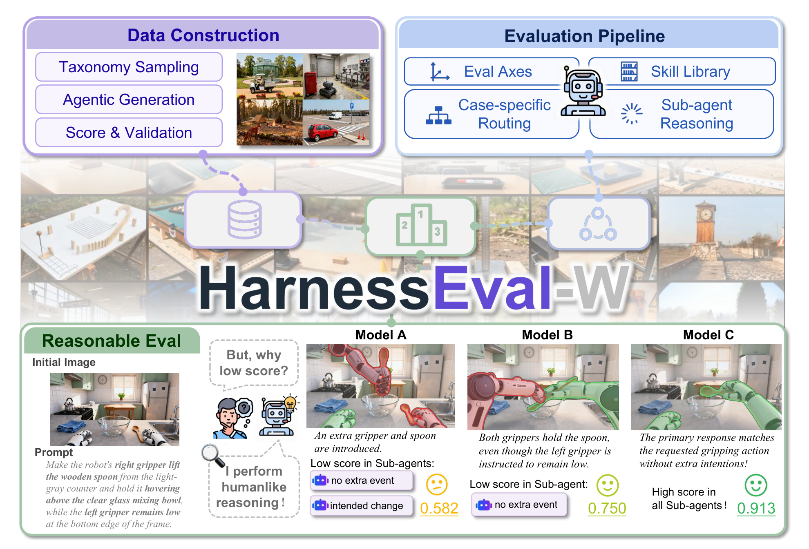
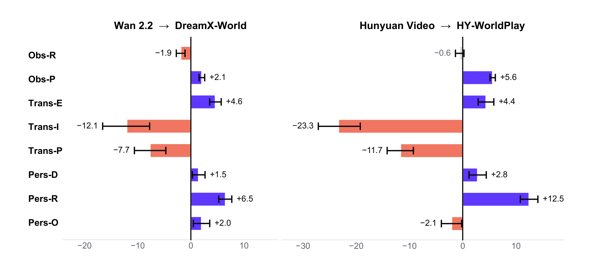
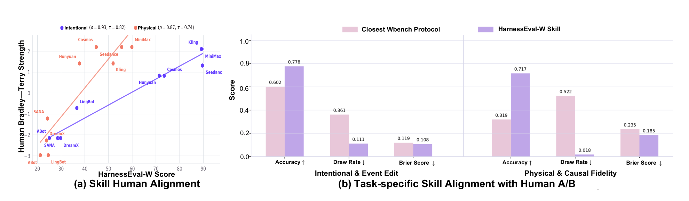
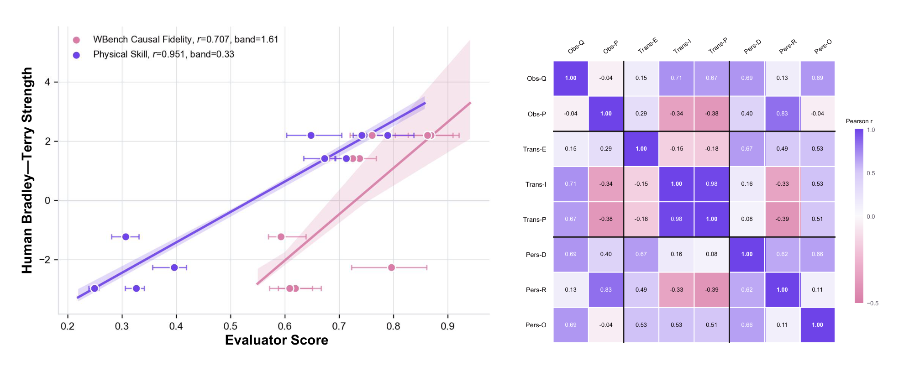
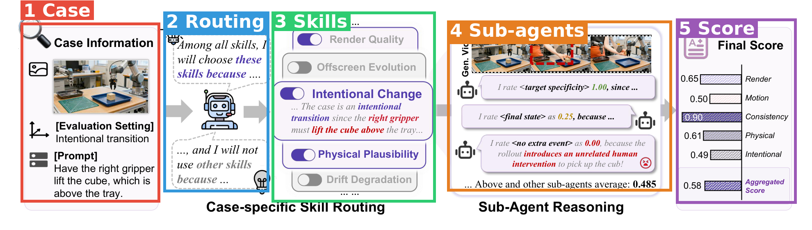
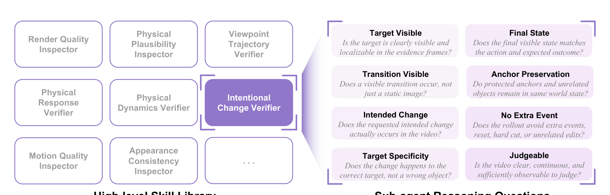
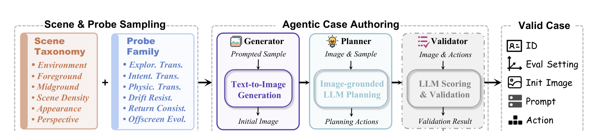

# HarnessEval-W: Agentifying the Evaluation of Visual Worlds

| 项目 | 内容 |
|---|---|
| 题目 | HarnessEval-W: Agentifying the Evaluation of Visual Worlds |
| 作者 | 共同一作：Weiliang Chen、Haowen Sun、Jun Gao；共同项目负责人：Jun Gao、Jialong Wu、Jiangran Lyu、Fangfu Liu；另有 30+ 位作者，资深作者含 Ziwei Liu、Ming-Yu Liu、Yizhou Wang、Xinchao Wang、Yueqi Duan 等（论文未标注各作者单位） |
| arXiv | [2608.16859](https://arxiv.org/abs/2608.16859) |
| 发布日期 | 论文 v1 2026-08-17（arXiv 提交戳）；代码 / 主页 / 博客 2026-08-18 同步发布（repo News 栏），工作本体未早于论文公开 |
| 代码 | [github.com/MirroS-Lab/HarnessEval-W](https://github.com/MirroS-Lab/HarnessEval-W)（Apache 2.0） |
| 主页 | [项目主页](https://mirros-lab.github.io/HarnessEval-W) · [MirroS 博客](https://mirros.ai/blog/harnesseval) |

**一句话**：把 LLM 生态里的 "evaluation harness" 范式搬到世界模型评测——评测不再是固定指标算分，而是一个 agent 系统：按 case 路由技能、分解成子问题、派 sub-agent 逐项查证、聚合成带完整推理链的分数。

**结构速览**（全文 17 页，无附录）：

- §1 Introduction：现有世界模型 benchmark 分数"不可解释、不可验证"，提出把人类评测工作流 harness 化
- §2 Related Works：视频生成与交互世界模型 → 视频/世界模型 benchmark 谱系 → agentic evaluation
- §3 方法：世界模型形式化（式 1）→ 三评测轴八设置（Table 1）→ 分层 agentic 评测（skill routing + sub-agent reasoning）
- §4 Case 构建：场景 taxonomy 采样 + probe family 分配 + 生成/规划/校验三 agent 流水线，产出 330 个 case
- §5 实验：18 模型 leaderboard（Table 2）；评测器自评（人类对齐、对比 WBench、重复鲁棒性）；轴间相关与微调能力迁移分析
- §6 Future Work：test-time scaling、技能库扩张、递归自改进的评测 harness
- §7 Conclusion + 参考文献（87 条）

---

## 第1章 · 作者与实验室背景评估

**事实（发表记录，均经联网核实）：**

| 角色 | 人物 | 单位 / 背景 | 代表作 | 主页 |
|---|---|---|---|---|
| 共同一作 | Weiliang Chen | 清华大学电子系博士生，导师 Yueqi Duan、Jiwen Lu | DreamCinema 等 3D/视频生成工作 | [个人主页](https://chen-wl20.github.io/) |
| 共同一作 | Haowen Sun | ReconX（清华 Yueqi Duan 组视频扩散重建工作）共同作者 | ReconX | 未找到主页 |
| 共同一作 + 共同负责人 | Jun Gao | NVIDIA 研究科学家，即将任 UMich EECS 助理教授；多伦多大学博士（导师 Sanja Fidler） | GET3D 系、Cosmos-Drive-Dreams（世界基础模型合成数据） | [个人主页](https://www.cs.toronto.edu/~jungao/) |
| 共同负责人 | Jialong Wu | 清华大学软件学院（Mingsheng Long 组） | iVideoGPT（NeurIPS 2024，交互式视频世界模型） | [个人主页](https://manchery.github.io/) |
| 共同负责人 | Jiangran Lyu | 北京大学计算机学院博士生，导师 Yizhou Wang，联合导师 He Wang | 机器人操作方向 | [个人主页](https://jiangranlv.github.io/) |
| 共同负责人 | Fangfu Liu | 清华大学电子系博士生（Yueqi Duan 组），领导清华 Spatial Intelligence & Vision Group | ReconX、DimensionX、Terra（3D 世界模型） | [个人主页](https://liuff19.github.io/) |

发布主体是 **MirroS**（[mirros.ai](https://mirros.ai/)）：2026 年出现的创业公司，口号 "Building Physical RSI"（物理世界的递归自改进），官网未公开团队名单与融资信息，未找到实验室意义上的"近 5 年发表列表"。作者列表中的资深学者（Yizhou Wang/北大、Yueqi Duan/清华、Ziwei Liu/NTU、Ming-Yu Liu/NVIDIA 等）与上述学生作者的师承关系吻合，可判断这是 MirroS 牵头、多所高校实验室参与的大型联合项目。值得注意的是 VBench 系列的一作 Ziqi Huang 也在作者列表中——评测方向的核心人员直接参与。

**实验室主方向判定**：MirroS 作为公司无历史发表可考（**新开方向**，但即为其主业）；参与的学术组在世界模型/视频生成/评测三个子方向都是**传统强方向**——证据：iVideoGPT（Long 组）、ReconX/Terra/DimensionX（Duan 组）、VBench/VBench++/VBench-2.0（Ziwei Liu 组）。

**推断（水平预判，依据上述事实）**：不适用"水毕业风险"框架——这不是单个学生的毕业论文，而是公司级 launch 项目（论文、代码、主页、博客同日发布，40 人作者列表）。一作与负责人均有本方向持续积累，非首篇该方向工作。预判风险点不在作者背景，而在"benchmark 论文由世界模型公司发布"的利益结构：榜单裁判与潜在选手同源（MirroS 官网自称在造世界模型），该风险与第3章盲审意见 W5（构建-评测同源偏置）同向。

⚠️ 本章内容未进入第3章盲审 agent 的上下文。

---

## 第2章 · 论文类型判定

**结论**：**实验（系统）型**（benchmark/评测系统论文）+ **a+b 型范式迁移**——a = LLM 生态的评测 harness / agent-as-a-judge 范式，b = 世界模型评测（三轴八设置的被测对象域）。系统本身 training-free，无原创模型组件；创新在工作流设计（case 路由 → 子问题分解 → 证据树聚合）与 330 case 的 agentic 构建管线。

**组件清单**（只列方法节实际承担流程环节的引用工作）：

| 组件 | 原论文 | 在本文中的角色 |
|---|---|---|
| GPT-5.5（VLM backend） | 闭源 API，无论文 | 全部 sub-agent 的推理引擎（§5.1 说所有 sub-agent 同 backend/温度/帧采样，§5.3 两处指明为 GPT-5.5） |
| 世界模型 S/T/s 因子分解 | [World Models（Ha & Schmidhuber）](https://arxiv.org/abs/1803.10122)、[Dreamer](https://arxiv.org/abs/1912.01603)、[DreamerV3](https://arxiv.org/abs/2301.04104) | 式 (1) 的形式化来源，三评测轴由此导出（§3.2–3.3） |
| WBench | [arXiv 2605.25874](https://arxiv.org/abs/2605.25874) | §5.3 对比基线（Event Edit / Causal Fidelity 两协议同条件重跑） |
| Bradley–Terry 模型 | 经典统计方法（1952） | §5.3 将 5000 次人类 A/B 判断聚合为模型强度分 |
| LLM-as-a-judge 范式 | [MT-Bench](https://arxiv.org/abs/2306.05685)、Agent-as-a-Judge（Zhuge et al., ICML 2025，论文未给 arXiv 号） | §2.3 承接的评测范式先例 |
| 技能库思想 | [Voyager](https://arxiv.org/abs/2305.16291)、RewardHarness（[arXiv 2605.08703](https://arxiv.org/abs/2605.08703)） | 可扩展 skill library 的设计来源（§2.3、§6） |
| 证据抽取工具（MUSIQ / MegaSaM / DreamSim / SAM 2） | [MUSIQ](https://arxiv.org/abs/2108.05997)、MegaSaM（CVPR 2025）、DreamSim（NeurIPS 2023）、SAM 2（ICLR 2025） | §2.2 提及的工具层；正文未明说方法用了哪些，但 repo `src/harnesseval/metric_backends/` 有 `megasam.py`，佐证 MegaSaM 实际在用 |

**疑似借鉴（论文未引用）**：repo `metric_backends/` 下有 `unidepth.py`（UniDepth 单目深度估计），参考文献中未见 UniDepth——工具实际在用但论文未引。

---

## 第3章 · 双盲评审 + Rebuttal（隔离上下文，全流程记录）

净化说明：从 `_work/fulltext.txt` 生成 `_work/sanitized.txt`，删除作者块（40 人名单与分工标注）、Blog/Code/主页 URL，第 [87] 条自引博客的团队名改写为中性表述；逐段检查无机构/姓名残留。盲审 agent 只收到净化文本路径。

### 3.1 初审意见（由隔离上下文的盲审 agent 独立生成）

> **Summary**（摘录）：本文提出 HarnessEval-W，将 LLM 生态中的 "evaluation harness" 范式引入世界模型评测……评测轴由世界模型的因子分解（式 1）导出为三轴八设置……330 个评测 case 由 agentic 构建流水线自动生成……在 18 个模型上给出 leaderboard，并以 5000 次人类 A/B 判断在 2 个设置上验证人类对齐。
>
> **Strengths**：
> 1. 问题动机真实且切中要害——"分数无法解释、无法核验"的批评成立，把评测过程做成可审计推理链是有价值的方向性主张。
> 2. 评测轴推导有原则性——三轴八设置从式 (1) 的 S/T/{s_i} 因子分解导出，比多数 benchmark 的维度堆砌更有内在结构。
> 3. 对评测器自身做了元评估（§5.3）——人类对齐 + 同条件受控对比 WBench + 重复稳定性，"evaluate the evaluator" 的设计意识高于 benchmark 论文平均水准。
> 4. 相关工作梳理全面，诚实交代了与 agentic 评测先行工作的承接关系。
> 5. 附带分析有信息量——Trans-I/Trans-P 强耦合（r=0.98）而与 Trans-E 近乎无关；微调使模型"会探索但更不会执行干预"。
>
> **Weaknesses**：
> - **W1（核心 claim 验证覆盖严重不足）**：宣称 "closely align with human preferences"，但人类对齐只覆盖 8 个设置中的 2 个、18 个模型中的 9 个，n=9 的 ρ=0.93 无 CI/P 值；其余 6 项指标从未对人类判断验证，Table 2 的 Overall 排名大部分建立在未经校准的自动打分上。
> - **W2（无消融，收益归因不明）**：skill routing / sub-question 分解 / validator 无任何组件消融；每 case 的 VLM 调用远多于 WBench，Figure 6b 的优势无法区分是"分解设计"还是"更多调用预算"；与最近似的 agentic 评测器（Evaluation Agent、VideoGen-Eval、VideoArgus）无实证比较。
> - **W3（leaderboard 无不确定度）**：Table 2 全是点估计，第 1、2 名 Overall 仅差 0.5 分而自家鲁棒性实验证明评测存在跨轮波动；"Seedance 2.0 ranks first"、"文本驱动生成器占优"缺统计支撑；§5.4.2 基于 n=2 对断言趋势，外推过强。
> - **W4（正文与图数字矛盾）**：§5.4.2 正文数字（4.8/7.8/3.5/−11.9/−7.2；8.4/−24.2/−11.2）与 Figure 10（+4.6/+6.5/+2.0/−12.1/−7.7；+12.5/−23.3/−11.7）对不上。
> - **W5（构建-评测同源偏置未讨论）**：case 由 LLM 写 prompt、text-to-image 生成初始图、LLM validator 筛选、GPT-5.5 打分；"text-driven 生成器包揽前四"可能部分是构建管线偏向文本接口的伪影；接口翻译协议未交代；构建 LLM 与打分 VLM 若同源存在 self-preference 风险。
> - **W6（人类研究方法学缺失）**：5000 次 A/B 的标注者人数、重复标注、inter-annotator agreement、指南、模型选取标准均未报告；各 probe family 的精确 case 数只有柱状图无数字。
> - **W7（可复现性不足）**：送审文本内无 sub-agent prompts、完整技能清单（Figure 3 以"…"截断）、帧采样数、聚合权重；§5.1 未点名评测 VLM 型号；"声称将开源"在评审时点不可核验。
>
> **Minor**：Obs-R/Obs-Q 命名不一致；Figure 6(b) 出现 "WorldSherlock Skill" 疑为旧名残留；Figure 3 子问题多处语法错误；"a specific a scenario" 笔误；"1 to 100" 疑应为 0 到 100；[79][81][87] 以博客作学术论据偏弱。
>
> **评级：major revision**——"把 agentic harness 范式带进世界模型评测"是对既有组件的系统性组合，对 subfield 有实在意义，但辐射范围距旗舰刊 "substantial progress" 水位尚有距离；核心结论目前只被部分支持。缺口均可在本研究 scope 内封闭，故 major revision 而非 reject；若 W1/W2 补充结果不理想，结论将转为 reject。

（审稿人同时声明：无法核验声称开源的材料；Figure 10 矛盾不能完全排除 PDF 抽取错位——本仓库主 agent 已用页面渲染图核实该矛盾为真，见 3.2。）

### 3.2 Rebuttal（主 agent 以作者方身份撰写，双盲不破）

逐条回应见发送记录，要点：

**承认的批评（= 论文真正硬伤一览）**：
1. **W1 成立**：人类对齐只覆盖 2/8 设置、9/18 模型，n=9 无置信区间；Overall 排名大部分未经人类校准。
2. **W2 成立**：无任何组件消融；等预算 self-consistency 基线应做未做；无 agentic 评测器基线。
3. **W3 主体成立**：Table 2 无误差条，相邻名次无显著性检验，"文本驱动占优"与 n=2 微调趋势的表述超出统计证据。
4. **W4 完全成立**：经与 Figure 10（带误差条）逐项核对，正文 §5.4.2 的数字确为错误，非 PDF 抽取错位，应以图为准。
5. **W5 主体成立**：接口翻译协议未交代；构建 LLM 与打分 VLM 同源性未披露，text-native 偏置未量化。
6. **W6 完全成立**：人类研究方法学报告全面缺失。
7. **W7 主体成立**：凭正文无法复现任何一个分数。
8. Minor 全部成立。

**辩护的点（论据全部来自论文内部）**：
- W3 一处澄清：重复方差并非完全未报——Figure 8 每模型有跨三轮水平误差条，Figure 10 的 Δ 带误差条，鲁棒性节量化了斜率/相关/包络范围。
- W5 一处澄清：§3.4 明确 routing 只依赖 case 上下文、对所有模型一致，同一 case 内跨模型比较在评测端对称。
- W7 两处澄清：评测 VLM 可从 §5.3 两处 "the same GPT-5.5 backend ... as our benchmark" 确定为 GPT-5.5；摘要与 §6 有明确的完整开源承诺。

### 3.3 审稿人二轮回复 + 最终评级

逐条处置：
- **W1 维持**：选择理由的辩护成立但不能替代其余 6 设置验证；rebuttal 未提供新证据。
- **W2 维持**：作者直接承认；WBench 对比的受控性初审已计入 Strengths，预算混淆在受控范围之外。
- **W3 主体维持，接受一处部分澄清**：鲁棒性包络量化确在文中；但"Figure 8/10 带每模型误差条"在纯文本中无法核验，**不采纳**（注：误差条在渲染图中确实可见，这是盲审 agent 只读文本的固有局限，主 agent 按红线不干预评审结论）。Table 2 点估计、无显著性检验的核心批评维持。
- **W4 维持，升级为双方确认的正文错误**：可修正、不属 fatal，但 §5.4.2 全部数字需重写。
- **W5 维持**：routing 对称性辩护成立但答非所问——批评指向构建端偏置与接口翻译协议缺失。
- **W6 维持**：无新信息。
- **W7 部分撤回一个子点，主体维持**：撤回"未点名评测 VLM"，修正为"披露位置问题"（应在 §5.1 明示而非让读者从 §5.3 反推）；其余复现缺失全部维持。
- 审稿人评价 rebuttal："全程仅引用论文内部文本，程序合规；坦诚程度值得肯定，但坦诚本身不产生证据。"

**最终评级：major revision（与初审一致）**。理由：rebuttal 的两处澄清只修正措辞精度，不触及核心批评；全部缺口经作者确认成立且未提供新实验；缺口均可在本研究 scope 内封闭，但若修改稿中 W1 扩展验证或 W2 等预算对照结果不理想，结论应转为 reject。二轮后流程终止。

---

## 第4章 · 大白话：这篇文章在做什么

**场景**：现在很多模型能"生成会动的世界"——给它一张图和一个指令（比如"让机械臂右爪把木勺举到碗上方"），它生成后续视频。怎么给这些模型打分、排座次？

**之前的方法**：现有 benchmark 用一套固定指标暴力算个分。分数出来了，但你问"为什么这个模型只有 0.58 分"，没人答得上来——错在哪、哪一步违反了物理，全在黑盒里。

**本论文的方法**：把"评测"本身做成一个 agent 团队，像人类审片一样干活：先看这道题该查什么（路由到对应技能），再把大问题拆成小问题（勺子看得见吗？变化发生在正确目标上吗？有没有多余事件？），每个小问题派一个 sub-agent 盯着视频查证打分，最后汇总成一棵"证据树"——每个分数都能顺藤摸瓜查到是哪个小问题扣的分、为什么。

**图内文字中文翻译**（按阅读顺序）：
- 左上 **Data Construction（数据构建）**：taxonomy 采样 → agentic 生成 → 打分与校验，右侧是生成的多样初始场景示例。
- 右上 **Evaluation Pipeline（评测流水线）**：评测轴（Eval Axes）、技能库（Skill Library）、按 case 路由（Case-specific Routing）、sub-agent 推理（Sub-agent Reasoning）四要素。
- 下方 **Reasonable Eval（讲得出道理的评测）**：初始图是厨房台面（左下有机器人双爪、木勺、玻璃碗）；prompt 要求"右爪把木勺从浅灰台面举起，悬停在玻璃搅拌碗上方，左爪保持在画面底部低位"。用户问"为什么分低？"，评测 agent 答"我做的是类人推理"：
  - Model A 得 0.582：画面凭空多出一个爪子和一把勺子——"no extra event（无多余事件）"和"intended change（预期变化）"两个 sub-agent 打了低分；
  - Model B 得 0.750：两只爪子都去握勺，违反"左爪保持低位"的指令——"no extra event" 扣分；
  - Model C 得 0.913：动作与指令一致、无多余动作，所有 sub-agent 高分。

自查：不做这个方向的人应该能看懂——评测器从"一个黑盒分数"变成"一群会解释自己判断的检查员"。

---

## 第5章 · 实验

> 本文是 benchmark/评测系统论文，无机器人真机或策略仿真实验；按本文实验结构组织：5.1 主榜单（18 模型）、5.2 评测器自身的元评估、5.3 实验选择分析、5.4 复现性硬核查。

### 5.1 主实验：18 个世界模型的 leaderboard（Table 2 汉化）

**条件**：全部 18 个模型在同一套冻结的 330 case 上评测；每个 case 的交互被翻译成各模型的原生输入形式（文本指令 / 相机轨迹 / 控制序列）；所有 sub-agent 用同一 VLM backend、温度与帧采样。指标 0–1 打分后归一化到 100；Obs 两项在全部 330 case 上平均，其余六项只在对应 probe family 子集上平均；Overall 为 330 个 case 分的算术平均。**注意：论文未给各 probe family 的精确 case 数**（只有 Figure 5c 柱状图），子集指标的样本量不明。

指标缩写：Obs-Q 渲染质量 / Obs-P 物理合理观察 / Trans-E 探索式转移（视角移动）/ Trans-I 意图式转移（指定改某物）/ Trans-P 物理转移（施加物理干预）/ Pers-D 抗漂移 / Pers-R 重访一致性 / Pers-O 画外演化。**加粗 = 该列全场最优**。

| 模型 | 接口 | Obs-Q | Obs-P | Trans-E | Trans-I | Trans-P | Pers-D | Pers-R | Pers-O | Overall |
|---|---|---|---|---|---|---|---|---|---|---|
| Seedance 2.0*（闭源） | 文本 I2V | 83.6 | 61.8 | 80.2 | 81.8 | 63.5 | **79.8** | 76.8 | 68.9 | **75.5** |
| Wan 2.7*（闭源） | 文本 I2V | 80.9 | 58.8 | 78.7 | **83.6** | **71.1** | 74.3 | 68.5 | 65.9 | 75.0 |
| Kling 3.0*（闭源） | 文本 I2V | 82.1 | 60.6 | 79.1 | 82.6 | 63.2 | 77.2 | 75.4 | 66.2 | 74.4 |
| MiniMax H3 | 文本 I2V | 81.5 | 61.3 | 77.7 | 81.7 | 66.9 | 77.0 | 72.3 | 67.2 | 74.3 |
| Grok Imagine 1.5*（闭源） | 文本 I2V | **85.1** | 60.6 | 76.4 | 80.2 | 66.7 | 79.1 | 70.9 | 64.5 | 73.4 |
| FLUX 3*（闭源） | 文本 I2V | 81.7 | 61.6 | 76.4 | 79.0 | 63.2 | 77.1 | 70.2 | 67.4 | 72.2 |
| Cosmos3-Super | 文本 I2V | 83.5 | 61.0 | 77.9 | 75.1 | 60.2 | 77.6 | 70.6 | 66.8 | 71.9 |
| HunyuanVideo 1.5 | 文本 I2V | 80.0 | 59.0 | 77.6 | 73.2 | 57.2 | 76.5 | 69.5 | 63.2 | 70.3 |
| Wan 2.2 | 文本 I2V | 80.4 | 58.6 | 77.2 | 62.0 | 55.1 | 76.0 | 66.5 | 63.4 | 67.7 |
| LTX-2.3 | 文本 I2V | 78.4 | 54.5 | 73.8 | 60.4 | 53.3 | 72.4 | 63.3 | 57.7 | 64.6 |
| SANA-WM | 原生动作 | 81.0 | 62.3 | 82.5 | 50.6 | 47.6 | 78.9 | 78.8 | **72.3** | 68.7 |
| ABot-World | 原生动作 | 77.7 | 60.8 | **83.5** | 49.0 | 45.7 | 76.3 | 72.0 | 60.8 | 66.1 |
| DreamX-World | 原生动作 | 78.5 | 60.6 | 81.8 | 50.0 | 47.4 | 77.5 | 73.1 | 65.4 | 66.8 |
| LingBot World v2 | 相机位姿 | 80.5 | 63.3 | 81.5 | 56.8 | 49.8 | 79.5 | 75.8 | 66.1 | 68.8 |
| Lyra 2 | 相机位姿 | 79.5 | 64.0 | 80.7 | 48.9 | 45.1 | 77.6 | 79.7 | 56.4 | 65.5 |
| Fantasy-World | 相机位姿 | 74.1 | 62.7 | 73.2 | 52.4 | 48.9 | 69.9 | 68.4 | 53.8 | 62.1 |
| HY-WorldPlay 1.5 | 相机位姿 | 79.4 | **64.6** | 82.0 | 49.9 | 45.5 | 79.3 | **81.9** | 61.1 | 67.1 |
| InSpatio-World | 相机位姿 | 79.0 | 63.0 | 70.7 | 48.6 | 45.6 | 74.5 | 77.0 | 54.0 | 61.4 |

**读法**：文本驱动的通用视频生成器包揽 Overall 前四（作者归因于大规模文本条件训练带来的指令理解，恰是 Trans-I/Trans-P 所需）；但"原生动作/相机位姿"类模型在 Trans-E、Pers-R、Pers-O 上反超（如 ABot-World 的 Trans-E 83.5 全场第一、SANA-WM 的 Pers-O 72.3 全场第一）——不同训练数据分布导致各有所长。**注意第3章 W3**：全表为点估计，第 1、2 名仅差 0.5 分，无显著性检验。

**微调能力迁移**（§5.4.2 + Figure 10）：把文本视频模型微调成动作条件世界模型（Wan 2.2→DreamX-World，HunyuanVideo→HY-WorldPlay），两对都表现出同一模式——重访一致性大涨（+6.5 / +12.5），意图与物理转移大跌（−12.1 / −7.7 与 −23.3 / −11.7，按 Figure 10 数字；**正文数字与图不一致，盲审 W4 已锤实**）。作者假设是微调数据偏探索轨迹、缺指令式干预。

### 5.2 评测器的元评估（"评测评测器"）

**人类对齐**（Figure 6a）：9 个代表模型、5000 次人类 A/B 判断，Bradley–Terry 聚合成参考序。HarnessEval-W 分数与人类序的 Spearman ρ=0.93（Intentional）/ 0.87（Physical）。**论文未报告**标注者人数、agreement、指南（盲审 W6）。

**对比 WBench**（Figure 6b）：同视频、同 GPT-5.5、同温度帧采样重跑 WBench 最近似协议。Physical 上 pairwise accuracy 31.9%→71.7%、draw rate 52.2%→1.8%；Intentional 上 60.2%→77.8%、draw 36.1%→11.1%；Brier score 双双更低。原因很直白：WBench 的 Causal Fidelity 把整段视频压成一个 0–3 分，一半以上的对比打成平手分不出胜负；HarnessEval-W 拆成多个子问题后区分度大增。**但未控制 VLM 调用预算**（盲审 W2）。

**重复鲁棒性**（Figure 8）：GPT-5.5 温度 0 跑三轮，拟合"分数→人类强度"直线：斜率 9.6–10.8、相关 0.928–0.964、三轮包络仅 0.33 BT 单位；WBench 斜率 11.2→21.0 翻倍、包络 1.61（宽 4.9 倍）。注意：§5.3 开头写"robustness under different VLMs"，**实际实验只是同一 GPT-5.5 重复三次**，换 VLM 的鲁棒性并没测。

**轴间相关**（Figure 9）：Trans-I 与 Trans-P 强耦合（r=0.98，都吃"理解干预语义并生成后果"）；两者与 Trans-E 近乎无关（r=−0.15/−0.18，会连贯地探索 ≠ 会执行指令）；Obs-Q 与 Obs-P 几乎不相关（r=−0.04，画面好看 ≠ 物理合理）。

### 5.3 为什么选这些实验

- **人类对齐只验证 Intentional/Physical 两设置**：作者理由（§5.3 原文）是这两项"最直接要求对干预做语义与因果解释、最难自动评测"。但对照数字看还有另一层：这两项恰是相对 WBench **优势最戏剧化**的设置（Physical 上 WBench 准确率仅 31.9%、draw 52.2%——几乎瘫痪），选它们做展示对比效果最好。Persistence 三项的长时序判断对 VLM 同样难，却没验证。
- **对比对象只有 WBench**：与自己最像的 agentic 评测器（Evaluation Agent、VideoGen-Eval、VideoArgus，§2.3 都引了）一个都没比——缺席本身就是信号：跟固定协议比稳赢，跟同类 agentic 评测器比胜负未知。
- **被测模型选择**：18 个模型覆盖三类接口，闭源模型走官方 API——这保证了榜单的"新闻价值"（Seedance/Kling/Grok 都在），但也使复现依赖大量闭源 API。
- **该测未测**：等 VLM 调用预算的朴素多询问基线（直接检验"拆子问题"本身的贡献）；换 VLM backend 的鲁棒性（标题写了没做）；其余 6 设置的人类对齐。

### 5.4 复现可能性（硬核查，零猜测）

逐项核查（证据来源标注在括号内）：

**代码**：仓库存在且是实质代码（[MirroS-Lab/HarnessEval-W](https://github.com/MirroS-Lab/HarnessEval-W)，实测文件树 590 个文件）：`src/harnesseval/` 含 CLI、pipeline（planner.py、backends.py）、12 个技能后端实现（`skill_backend/`：intentional_change_vlm.py、physical_plausibility.py、drift_degradation.py 等，与 Figure 3 技能库对应）、视频质量指标套件（`metrics/video_quality/`）、MegaSaM/UniDepth 度量后端；三个 conda 环境配置；自带可跑 demo（`runs/example/`）。Apache 2.0，206 stars（GitHub API，2026-08-20 查）。

**评测 case（相当于"数据"）**：**只放出 6/330**。`benchmark/plans/` 每个 probe family 仅 1 个 skill_plan.json，`benchmark/initial_observations/` 仅 6 张初始图（repo 文件树实测）；README 却宣称 "Released the full HarnessEval benchmark"。324 个 case 缺失。

**ckpt**：不适用——评测系统无训练权重。但复现 Table 2 需要：GPT-5.5 API（闭源）+ 18 个被测模型访问权（6 个明确标注闭源 API：Seedance 2.0、Wan 2.7、Kling 3.0、Grok Imagine 1.5、FLUX 3；论文 Table 2 星号）。

**评测细节**：
- VLM 型号：GPT-5.5（§5.3 两处；§5.1 未直接点名）——找到
- 温度：0（§5.3 鲁棒性实验处）——找到
- 帧采样数量：论文只说"same frame-sampling configuration"（§5.1），具体数值未给——**缺失**
- sub-agent prompts：论文未给；repo `skill_backend/` 有对应 .py 文件（未逐个打开核验 prompt 完整性）——**论文内缺失，repo 部分存在**
- 子问题分→case 分的聚合权重：论文未给（只说 average）；repo 有 `aggregate.py`、`formulas.py`、`weight_utils.py`——**论文内缺失**
- rollout 长度 / 分辨率：论文未给——**缺失**
- 人类研究原始数据（5000 次 A/B）：论文与 repo 均未提及开放——**缺失**

**训练细节**：不适用（无训练）。

**小坑**：README 安装步骤引用 `config/example.env`，但 repo 文件树中不存在 `config/` 目录（实测）——按 README 走会卡住。

**结论：`需自行补齐细节`**。评测框架代码本体可安装可跑（自带 demo），但要复现论文任何一个表内数字，缺失项：① 324/330 个评测 case 未发布；② 帧采样等评测超参数未在论文给出；③ GPT-5.5 与多数被测模型是闭源 API（成本与版本漂移不可控）；④ 人类研究数据未开放；⑤ README 的 config 路径坏了。

---

## 第6章 · 方法拆解

方法总览图（Figure 2）+ 彩色标注（1 轮画准）：

**分块说明**（接口首尾相接）：

🟥 **1 Case——评测题目（输入端）**。来源：第4章的 agentic 构建流水线（作者自建，见下方 Figure 4）。内容 = 初始图（世界的第 0 帧观测）+ 动作 prompt（"让右爪举起托盘上方的方块"）+ 评测设置标签（八设置之一，如 Intentional transition）。**出**：case 上下文 → 🟦。另一路：被测世界模型拿同一 case 生成 rollout 视频，供 🟧 查证。

🟦 **2 Routing——按 case 路由技能的 planner**。来源：作者设计，承接 agent-as-a-judge 思想（[MT-Bench](https://arxiv.org/abs/2306.05685) 之后的 agentic 评测谱系，§2.3）。**进**：case 上下文；**出**：激活的技能列表 + 每个激活/跳过技能的书面理由（图中："这是 intentional transition，所以启用 Intentional Change 和 Physical Plausibility，跳过 Offscreen Evolution，因为所有动作都在画面内"）。关键设计：路由只看 case、不看被测模型是谁，同一 case 所有模型走同一套问题——保证公平。无训练，VLM 推理。

🟩 **3 Skills——高层技能库**。来源：作者定义，思想承自 [Voyager](https://arxiv.org/abs/2305.16291) 式可增长技能库。库内有 Render Quality Inspector、Physical Plausibility Inspector、Intentional Change Verifier、Viewpoint Trajectory Verifier、Appearance Consistency Inspector 等（Figure 3 展示 8+ 个并以"…"示意可扩展）。**进**：被激活 + case 上下文；**出**：把本技能的评测问题分解成一组可测量子问题（如 Intentional Change Verifier 拆成 8 问：目标可见？转移可见？预期变化发生？改对目标了？终态正确？锚定物保持？无多余事件？可判读？）→ 🟧。

🟧 **4 Sub-agents——子问题查证**。来源：作者设计；推理引擎为 GPT-5.5（§5.3），部分技能挂工具后端（repo 证据：MegaSaM 相机运动、视频质量指标套件）。**进**：一个子问题 + rollout 视频抽帧证据；**出**：离散分数 + 书面理由（图中："no extra event 打 0.00，因为视频里凭空出现一只人手来拿方块"）。查证前有一个额外 sub-agent 先从 case 上下文推理"预期结果应该长什么样"，其余 sub-agent 对照该预期并行打分。父技能 agent 校验各 sub-agent 证据后组装成证据树。部署即全部流程——系统 training-free。

🟪 **5 Score——聚合与最终分**。来源：作者设计。**进**：各技能/子问题的分数与证据；**出**：按维度的分数条（Render 0.65 / Motion 0.50 / Consistency 0.90 / Physical 0.61 / Intentional 0.49）+ 聚合分（0.58）。任何低分都能回溯到具体是哪个子问题、哪帧证据扣的分。聚合权重论文未给（见 5.4 缺失项）。

**闭环自查**：🟥 出 case → 🟦 选技能 → 🟩 拆子问题 → 🟧 对着 rollout 逐问查证 → 🟪 聚合出可追溯的分数。首尾相接，成立。

**配套：case 是怎么造出来的**（Figure 4，第4章内容）：场景 taxonomy（环境/前景/中景/密度/画风/视角六轴）+ probe family（六类探针）采样 → 文生图模型出初始图 → image-grounded LLM planner 在图上落地一个可诊断的动作 → LLM validator 审核（目标可见？动作可行？预期结果够具体？证据够用？），不合格打回重采——330 个 case 全部经过这条流水线。注意：文生图模型与 planner/validator LLM 的型号论文均未点名。

---

## 第7章 · 消融

**本文无消融实验。**

这算不算缺陷？**算，而且是第3章盲审 W2 的核心**：分层设计的三个关键组件——skill routing、子问题分解、validator 校验——各自贡献多少，论文一个都没拆。全文最接近"消融"的两个实验都不是组件消融：

| 实验 | 它证明了什么 | 它没证明什么 |
|---|---|---|
| Figure 6b 对比 WBench 协议 | "拆成子问题的协议"整体优于"整体打一个分的协议" | 优势来自设计还是来自多几倍的 VLM 调用（无等预算基线） |
| Figure 8 三轮重复 | 同 backend 下评测结果稳定 | 换一个 VLM backend 是否还稳定（标题承诺了但没做） |

对一篇卖点是"评测应该可解释、可验证"的论文，自己的系统设计却没有可验证的归因，是最扎眼的自相矛盾点；rebuttal 中作者方（本仓库扮演）已直接承认。

---

## 收尾备注

- 盲审全程记录见第3章；净化文本与中间产物在 `_work/`（不进 git）。
- 本文档由 paper-scout 自动化流水线生成，未经用户人工复核。
